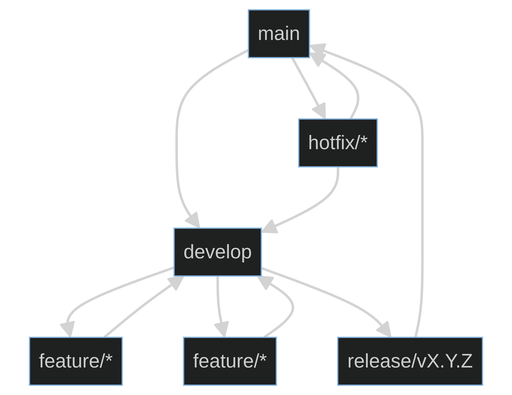

# AutoGrader Branching Strategy

This document outlines the branching strategy for the AutoGrader project, following a modified GitFlow approach optimized for our development workflow.

## Table of Contents
- [Branch Types](#branch-types)
- [Branch Naming Conventions](#branch-naming-conventions)
- [Workflow](#workflow)
- [Branch Protection](#branch-protection)
- [Common Tasks](#common-tasks)
- [Best Practices](#best-practices)

## Branch Types

### Main Branches (Long-lived)

1. **`main`**
   - Production-ready code
   - Always deployable
   - Protected branch
   - Only updated via pull requests from `release/*` or `hotfix/*` branches

2. **`develop`**
   - Integration branch for features
   - Contains the latest delivered development changes
   - Source for creating feature branches
   - Protected branch

### Supporting Branches (Short-lived)

3. **Feature Branches** (`feature/*`)
   - For developing new features
   - Branched from: `develop`
   - Merged into: `develop`
   - Naming: `feature/[short-description]`
   - Example: `feature/ai-pdf-processing`

4. **Bugfix Branches** (`bugfix/*`)
   - For fixing bugs in development
   - Branched from: `develop`
   - Merged into: `develop`
   - Naming: `bugfix/[short-description]`
   - Example: `bugfix/pdf-parsing-issue`

5. **Hotfix Branches** (`hotfix/*`)
   - For urgent production fixes
   - Branched from: `main`
   - Merged into: `main` and `develop`
   - Naming: `hotfix/[short-description]`
   - Example: `hotfix/critical-security-fix`

6. **Release Branches** (`release/*`)
   - For preparing new production releases
   - Branched from: `develop`
   - Merged into: `main` and `develop`
   - Naming: `release/v[major].[minor].[patch]`
   - Example: `release/v1.2.0`

## Branch Naming Conventions

- Use kebab-case for branch names
- Be descriptive but concise
- Include issue numbers if using an issue tracker
- Prefix with branch type (feature/, bugfix/, etc.)

Examples:
- `feature/42-ai-grading`
- `bugfix/123-fix-login-error`
- `hotfix/security-update`
- `release/v1.3.0`

## Workflow




## Branch Protection

### Main Branches
- Require pull request reviews (minimum 1)
- Require status checks to pass
- Require linear history
- Restrict who can push
- Require signed commits (recommended)

### Release Branches
- Require CI/CD pipeline to pass
- Require code review
- No direct pushes

## Common Tasks

### Starting a New Feature
```bash
git checkout develop
git pull origin develop
git checkout -b feature/your-feature-name
```

### Creating a Hotfix
```bash
git checkout main
git pull origin main
git checkout -b hotfix/issue-description
```

### Creating a Release
```bash
git checkout develop
git pull origin develop
git checkout -b release/v1.0.0
# Update version numbers, changelog, etc.
git commit -am "Bump version to 1.0.0"
```

## Best Practices

1. **Keep branches focused** - Each branch should have a single purpose
2. **Keep branches short-lived** - Merge or delete branches when work is complete
3. **Pull frequently** - Keep your branches up to date with their parent branches
4. **Delete merged branches** - Keep the repository clean by deleting branches after merging
5. **Write good commit messages** - Follow conventional commits when possible
6. **Rebase before merging** - Keep history clean by rebasing feature branches before merging

## Commit Message Format

We follow the [Conventional Commits](https://www.conventionalcommits.org/) specification:

```
<type>[optional scope]: <description>

[optional body]

[optional footer(s)]
```

Example:
```
feat(ai): implement PDF text extraction

- Add PyMuPDF integration
- Extract text from PDF files
- Handle common PDF parsing errors

Closes #42
```

## Versioning

We follow [Semantic Versioning](https://semver.org/) (SemVer) for version numbers in the format `MAJOR.MINOR.PATCH`.
