# Grade Automator Plus — AI Grading Flow (End to End)

1. **A submission comes in for grading.** The system loads the rubric (the questions, point values, and grading levels the teacher set up) and the student's parsed answers.
2. **Free, deterministic grading runs first (Tier 0).** For multiple-choice / true-false ("OBJECTIVE") questions, plain Python code tries to match the student's answer directly — no AI call, no cost, and it only ever claims a question when the match is unambiguous. Anything genuinely unclear is left for the AI.
3. **The answer cache is checked next (Tier 0.5).** If a student's answer text (for a given question) exactly matches an answer that's already been graded before, the prior result is reused instead of paying for another AI call. This is what guarantees two students with identical answers get identical grades — not "probably," but by construction.
4. **If everything was resolved by steps 2–3, grading stops here** — a submission that's entirely objective/cached needs no AI call at all.
5. **Whatever's left goes to the AI grader ("Grader A").** Questions are batched (up to 5 per call) and sent to the model with the rubric, the assignment context, and the student's answers (explicitly marked as untrusted input, to guard against a student trying to talk the AI into a better grade). The model is required to write its evidence quote and reasoning *before* it's allowed to state a score — this ordering is enforced by the response schema itself, not just asked for in the prompt, so the model can't pick a number first and rationalize backward.
6. **Two safety checks run on the AI's response:**
   - **Completeness** — if any requested question is missing from the response, the whole batch is retried (up to 3 times).
   - **Evidence verification** — every quote the model cites must actually appear, verbatim, in the student's real answer. A fabricated or missing quote triggers a retry; if it's still failing on the last retry, the system accepts the grade anyway rather than losing it, but marks it as "evidence unverified" for visibility.
7. **The AI's own math is never trusted.** Every score is clamped to the question's point cap and snapped to the nearest valid rubric level in plain code — regardless of what the AI's own total says. The submission's total score and percentage are recomputed from scratch server-side.
8. **The system decides whether a second, independent opinion is needed.** This doesn't happen for every question — it's triggered selectively:
   - The whole run's confidence was low, OR
   - The AI flagged the question itself (e.g. suspected plagiarism, off-topic answer), OR
   - The AI said this particular answer was a genuine "borderline" call between two rubric levels, OR
   - The question is worth a lot of points, OR
   - **(New)** the question is an essay or short-answer question — these get a second opinion by default, regardless of the above, since subjective/judged questions are where independent graders diverge the most, OR
   - It was randomly selected as part of an ongoing 5% quality-audit sample.
9. **If triggered, a second AI model re-grades — blind.** A *different* model (never the same one that graded pass A) re-grades only the triggered questions, seeing nothing about grader A's score or reasoning. This keeps the second opinion genuinely independent.
10. **The two opinions are compared.** If they agree, nothing changes — silently. If they disagree, grader A's score still stands (a second opinion never overwrites a number), but the submission is flagged `needs_review` with a severity level (critical / moderate / borderline) based on how far apart the two graders landed.
11. **Fresh evaluations get written back to the answer cache** — but only if they weren't disputed by a second opinion. A disagreed-upon grade is never propagated to future students via the cache.
12. **The grade is saved to the student's submission record.** Score, feedback, confidence, and (if applicable) the review flag are all persisted. If the assignment isn't published yet, the student doesn't see anything until the teacher releases it.
13. **A teacher can review and resolve anything sitting in the `needs_review` queue**, via one of two endpoints:
    - **`mark-reviewed`** — "I looked at both graders' rationales, grader A's score stands." No score changes, no credits consumed. Clears `needs_review` and appends a `{"resolved": "confirmed", ...}` entry to `review_reasons`.
    - **`update-grade`** — actually changes the score. Requires the teacher to have AI credits available, because it does more than update a number: it validates the new score against the rubric's max, recomputes the percentage, marks the submission as `was_regraded`, resolves the review (`{"resolved": "overridden", ...}`), notifies the student if the grade was already published — **and then kicks off a background AI call** that regenerates the student-facing "formatted grade" write-up to reflect the corrected score. That last step is a real, billed AI call, which is why the endpoint is credit-gated even though the score change itself is a plain database write.
14. **Separately, a nightly (free) and weekly (billed) benchmark run** against a set of synthetic students with known-correct answers, to catch any drift in grading accuracy over time — this runs independently of live grading, not as part of any individual submission's flow.

---

## Flow chart

```mermaid
flowchart TD
    Start([Submission ready to grade]) --> Parse[Parse rubric and\nstudent answers]

    Parse --> Tier0{"Tier 0:\nDeterministic match\n(OBJECTIVE questions)"}
    Tier0 -->|Unambiguous match| ClaimedT0[Claimed — no AI call]
    Tier0 -->|Ambiguous / not objective| Tier05{"Tier 0.5:\nAnswer cache hit?"}

    Tier05 -->|Identical answer seen before| ClaimedCache[Reuse cached evaluation\nno AI call]
    Tier05 -->|No match| NeedsAI[Question needs Grader A]

    ClaimedT0 --> AllClaimed{All questions\nresolved without AI?}
    ClaimedCache --> AllClaimed
    NeedsAI --> AllClaimed

    AllClaimed -->|Yes| DetOnly[Build deterministic-only result\nconfidence = 100%]
    AllClaimed -->|No, some remain| BatchAI[Batch remaining questions\nup to 5 per call]

    BatchAI --> GraderA["Grader A (single or batched pass)\nEvidence + reasoning MUST be\nwritten before the score field"]

    GraderA --> Complete{Response has\nevery requested question?}
    Complete -->|No| RetryBatch[Retry batch\nup to 3x]
    RetryBatch --> GraderA

    Complete -->|Yes| Evidence{Evidence quotes verified\nverbatim in the answer?}
    Evidence -->|Fails, retries left| RetryBatch
    Evidence -->|Fails, last attempt| DegradeLog[Accept grade,\nmark evidence-unverified]
    Evidence -->|Verified| Finalize

    DegradeLog --> Finalize[Finalize scores:\nclamp to point cap,\nsnap to nearest rubric level,\nrecompute totals server-side]

    DetOnly --> Persist
    Finalize --> SecondOp{"Second opinion\ntriggered?"}

    SecondOp -->|"Low run confidence\nOR flagged by AI\nOR borderline call\nOR high points\nOR ESSAY / SHORT-ANSWER (new)\nOR random QA sample"| PickModel[Pick an independent\nmodel ≠ Grader A]
    SecondOp -->|None of the above| Persist

    PickModel -->|No independent model available| NoNet["Log WARNING only\n(NOT flagged needs_review —\nsafety net going dark is\ncurrently invisible to teachers)"]
    PickModel -->|Independent model found| GraderB["Grader B re-grades\nblind — never sees A's score"]
    PickModel -->|Ran out of credits mid-pass| OutOfCredits["Flag needs_review:\nsecond_opinion_unavailable"]

    GraderB --> Compare{Compare A vs B\nscore, per question}
    Compare -->|Agree| Silent[Record agreement\nsilently]
    Compare -->|Disagree| FlagReview["A's score stands\nFlag needs_review\nseverity: critical / moderate / borderline"]

    Silent --> CacheWrite[Write fresh evaluations\nto answer cache]
    FlagReview --> CacheWriteSkip[Do NOT cache\ndisputed evaluations]
    NoNet --> Persist
    OutOfCredits --> Persist

    CacheWrite --> Persist[(Save to StudentSubmission:\nscore, feedback, confidence,\nneeds_review, review_severity)]
    CacheWriteSkip --> Persist

    Persist --> Published{Assignment\npublished?}
    Published -->|No| Held[Grade held from student\nuntil teacher publishes]
    Published -->|Yes| Visible[Student sees grade]

    Persist --> ReviewQueue{"needs_review = true?\n(GET ?needs_review=true\n&ordering=-review_severity)"}
    ReviewQueue -->|No| Done([Done])
    ReviewQueue -->|Yes, teacher opens it| TeacherChoice{Teacher's decision}

    TeacherChoice -->|"AI grade is fine as-is"| MarkReviewed["POST mark-reviewed\nNo credits needed, no score change\nreview_reasons += resolved: confirmed\nneeds_review -> false"]
    TeacherChoice -->|"Score needs correcting"| UpdateGrade["PATCH update-grade\nRequires HasCreditBalance"]

    UpdateGrade --> ValidateScore{"Score valid?\n0 <= score <= max_total_points"}
    ValidateScore -->|No| Reject400["400 error, submission\nunchanged"]
    ValidateScore -->|Yes| WriteOverride["Recompute percentage server-side\nWrite score, score_percentage, max_points\nwas_regraded = true, regraded_at = now\n\nSTALE TODAY: feedback.question_evaluations\n(per-question breakdown) is NOT updated —\nsee SPECIFICATION_V2.md Section 1"]

    WriteOverride --> ResolveReview["review_reasons += resolved: overridden\nneeds_review -> false"]
    ResolveReview --> SaveOverride[(Save submission)]

    SaveOverride --> PublishedCheck{Already published\nto student?}
    PublishedCheck -->|Yes| NotifyUpdate[Notify student\nof grade update]
    PublishedCheck -->|No| SkipNotify[No notification yet\ngrade still held]

    NotifyUpdate --> DispatchFormat
    SkipNotify --> DispatchFormat["Dispatch background AI task:\nformatted_grade_async\n(billed AI call — regenerates the\nstudent-facing formatted write-up)"]
    DispatchFormat --> FormatDone([formatted_grade saved\nonto the submission])

    MarkReviewed --> Done2([Done — grade unchanged])

    style GraderA fill:#4a7ba6,color:#fff
    style GraderB fill:#a64a7b,color:#fff
    style FlagReview fill:#b5652c,color:#fff
    style ClaimedT0 fill:#3a8a5c,color:#fff
    style ClaimedCache fill:#3a8a5c,color:#fff
    style WriteOverride fill:#b5652c,color:#fff
    style UpdateGrade fill:#4a7ba6,color:#fff
    style MarkReviewed fill:#3a8a5c,color:#fff
```

---
