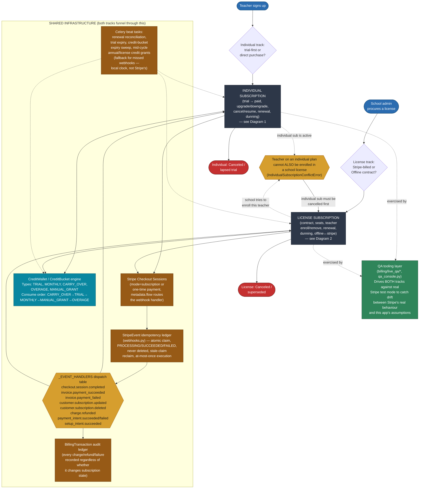

# Subscription System — Flow Diagrams

Reverse-engineered directly from the codebase (`billing/services.py`, `billing/stripe_service.py`,
`billing/license_service.py`, `billing/webhooks.py`, `billing/models.py`, `billing/tasks.py`) as of
this snapshot. Function/file references are inline on nodes and edges where it matters.

---

## 1. Individual (Teacher) Subscription — Full Flow

```mermaid
flowchart TD
    classDef entry fill:#2b6cb0,color:#fff,stroke:#1a4971,stroke-width:1px
    classDef decision fill:#d69e2e,color:#1a1a1a,stroke:#975a16,stroke-width:1px
    classDef success fill:#2f855a,color:#fff,stroke:#1c4532,stroke-width:1px
    classDef error fill:#c53030,color:#fff,stroke:#742a2a,stroke-width:1px
    classDef webhook fill:#6b46c1,color:#fff,stroke:#44337a,stroke-width:1px
    classDef state fill:#2d3748,color:#fff,stroke:#1a202c,stroke-width:1px
    classDef task fill:#4a5568,color:#fff,stroke:#2d3748,stroke-width:1px
    classDef credit fill:#0987a0,color:#fff,stroke:#065666,stroke-width:1px

    %% ===================== ENTRY POINTS =====================
    Signup(["Teacher account created\n(users/signals.py)"]):::entry
    TrialCheckoutEP(["Explicit trial checkout\n(card required upfront)"]):::entry
    DirectCheckoutEP(["Direct checkout\n(no trial, incl. trial finalize)"]):::entry
    LegacySubscribeEP(["Legacy subscribe\n(paid, no checkout builder)"]):::entry
    SelectPlanEP(["POST /select-plan\n(upgrade / downgrade / resubscribe)"]):::entry
    CancelEP(["POST /cancel"]):::entry
    ResumeEP(["POST /resume"]):::entry
    OverageEP(["POST /credits/overage/purchase"]):::entry
    PaymentMethodEP(["Payment method mgmt\n(setup intent / portal / delete / default)"]):::entry

    %% ===================== A. SIGNUP / AUTOMATIC TRIAL =====================
    Signup --> AutoTrialGuard{"Ever had a trial?\n(one-trial-ever guard)"}
    AutoTrialGuard -- "yes" --> AutoTrialReject["No trial granted"]:::error
    AutoTrialGuard -- "no" --> AutoTrialGrant["activate_automatic_free_trial()\nservices.py:1741\nTRIAL bucket: 5,000,000 credits\nexpires_at = now + 14d"]:::success
    AutoTrialGrant --> TrialState

    %% ===================== B. EXPLICIT TRIAL CHECKOUT =====================
    TrialCheckoutEP --> TrialCkGuard{"Active trial exists?\nOR active sub exists?\nOR plan is LICENSE?"}
    TrialCkGuard -- "reject" --> TrialCkReject["Rejected"]:::error
    TrialCkGuard -- "ok" --> TrialCkSession["Stripe Checkout\nmode=subscription\ntrial_period_days=14\npayment_method_collection=always"]
    TrialCkSession --> CheckoutCompleted

    %% ===================== C. DIRECT CHECKOUT (unified builder) =====================
    DirectCheckoutEP --> DirectCkGuard{"Chargeable active\nnon-trial sub already exists?"}
    DirectCkGuard -- "yes" --> DirectCkReject["Rejected — use\nupgrade/downgrade instead"]:::error
    DirectCkGuard -- "no, or trial only" --> DirectCkSession["Stripe Checkout\n(snapshots trial_subscription_id\nin metadata if trial active)"]
    DirectCkSession --> CheckoutCompleted

    LegacySubscribeEP --> LegacyCkSession["Stripe Checkout\nflow=individual_subscribe"]
    LegacyCkSession --> CheckoutCompleted

    %% ===================== CHECKOUT WEBHOOK DISPATCH =====================
    CheckoutCompleted(["Stripe webhook:\ncheckout.session.completed"]):::webhook
    CheckoutCompleted --> FlowSwitch{"metadata.flow"}
    FlowSwitch -- "individual_checkout" --> HandleIndivCheckout["_handle_individual_checkout\nstripe_service.py:2807"]
    FlowSwitch -- "individual_subscribe (legacy)" --> HandleIndivSubscribe["_handle_individual_subscribe\nstripe_service.py:3386"]
    FlowSwitch -- "individual_trial (legacy)" --> HandleIndivTrial["_handle_individual_trial\nstripe_service.py:3423"]
    FlowSwitch -- "trial_to_paid" --> HandleTrialToPaid["_handle_trial_to_paid\nstripe_service.py:3532"]
    FlowSwitch -- "individual_upgrade_checkout" --> HandleUpgradeCkCompleted
    FlowSwitch -- "overage_block_purchase_checkout" --> HandleOverageCk

    HandleIndivCheckout --> TrialMetaGuard{"trial_subscription_id\nin metadata?"}
    TrialMetaGuard -- "yes" --> FinalizeTrialToPaid["finalize_trial_to_paid_conversion()\nservices.py"]
    TrialMetaGuard -- "no" --> ActivateSub["activate_subscription()\nservices.py:149"]
    HandleIndivSubscribe --> ActivateSub
    HandleTrialToPaid --> FinalizeTrialToPaid

    ActivateSub --> BetaGate{"plan == BETA\nand NOT user.is_beta_eligible()?"}
    BetaGate -- "yes" --> BetaReject["Rejected:\nBeta restricted to teachers"]:::error
    BetaGate -- "no" --> ForfeitLingerTrial["Forfeit any lingering\nTRIAL bucket (EXPIRE ledger)\nservices.py:210-263"]
    ForfeitLingerTrial --> GrantMonthly1["Grant MONTHLY bucket\n(GRANT ledger)"]:::credit
    GrantMonthly1 --> ActiveState

    FinalizeTrialToPaid --> FTPGuard{"trial_sub is_trial\nAND is_active?"}
    FTPGuard -- "no" --> FTPReject["Rejected"]:::error
    FTPGuard -- "yes" --> FTPForfeit["Forfeit remaining TRIAL\ncredits (EXPIRE ledger)"]:::credit
    FTPForfeit --> GrantMonthly2["Grant MONTHLY bucket\n(GRANT ledger)"]:::credit
    GrantMonthly2 --> ActiveState

    %% ===================== TRIAL STATE & ITS OUTCOMES =====================
    %% activate_automatic_free_trial() creates NO Stripe subscription at
    %% all (its own docstring: "no Stripe, no card collection") — so a
    %% trial reached that way can never receive invoice.payment_failed,
    %% invoice.payment_succeeded, or a Stripe-side
    %% customer.subscription.deleted. Only create_individual_trial_session
    %% (path B, card collected upfront — itself marked legacy/FIXME) ever
    %% attaches a real Stripe subscription to a trialing row. Kept as two
    %% separate states rather than one shared "Trialing" node so this
    %% distinction can't get lost.
    AutoTrialState(["STATE: Trialing, automatic\nis_trial=True, auto_renew=False\nNO stripe_subscription_id"]):::state
    AutoTrialState --> AutoTrialOutcome{"How does\nthis trial end?"}
    AutoTrialOutcome -- "user explicitly subscribes\n(first real checkout)" --> DirectCheckoutEP
    AutoTrialOutcome -- "credits exhausted\nbefore trial_end" --> ExpireTrialTask
    AutoTrialOutcome -- "nightly sweep:\nexpire_active_trials task" --> ExpireTrialTask

    CardTrialState(["STATE: Trialing, card-backed\nis_trial=True, auto_renew=False\nreal stripe_subscription_id\n(legacy entry path)"]):::state
    CardTrialState --> CardTrialOutcome{"How does\nthis trial end?"}
    CardTrialOutcome -- "user explicitly upgrades\nmid-trial (trial_to_paid)" --> TrialToPaidSession["create_trial_to_paid_session()\nstripe_service.py:776\n(a DIFFERENT checkout builder\nthan the trial-start session)"]
    TrialToPaidSession --> CheckoutCompleted
    CardTrialOutcome -- "trial_end reached,\nStripe auto-charges card" --> InvoiceSucceededTrial
    CardTrialOutcome -- "trial_end reached,\ncard declines" --> InvoiceFailedTrial
    CardTrialOutcome -- "Stripe sub deleted\nmid-trial" --> SubDeletedTrial
    CardTrialOutcome -- "credits exhausted, or\nnightly sweep catches it\nbefore Stripe's own charge" --> ExpireTrialTask

    InvoiceSucceededTrial(["webhook: invoice.payment_succeeded\nbilling_reason=subscription_cycle"]):::webhook
    InvoiceSucceededTrial --> FinalizeTrialViaStripe["finalize_trial_conversion_via_stripe()\nservices.py:1431"]
    FinalizeTrialViaStripe --> FTVSGuard{"subscription\nstill is_trial?"}
    FTVSGuard -- "no (defensive,\nout-of-order webhook)" --> FTVSNoop["No-op, warning logged"]:::error
    FTVSGuard -- "yes" --> FTVSForfeit["Forfeit TRIAL bucket\n+ Grant MONTHLY bucket"]:::credit
    FTVSForfeit --> ActiveState

    InvoiceFailedTrial(["webhook: invoice.payment_failed\n(card declined at trial end)"]):::webhook
    InvoiceFailedTrial --> ExpireTrialForce["expire_trial(force=True)"]
    ExpireTrialForce --> TrialLapsed

    SubDeletedTrial(["webhook: customer.subscription.deleted\n(trial_end still in future)"]):::webhook
    SubDeletedTrial --> TrialLapsed

    ExpireTrialTask(["Celery: expire_active_trials\ntasks.py"]):::task
    ExpireTrialTask --> ExpireTrialNatural["expire_trial()\nservices.py:1130"]
    ExpireTrialNatural --> TrialLapsed

    TrialLapsed["Expire TRIAL bucket\n(EXPIRE ledger)\nis_active=False, is_trial=False"]:::credit
    TrialLapsed --> LapsedState(["STATE: No subscription\n(trial lapsed, unconverted)"]):::state
    LapsedState -.->|"user can start over"| DirectCheckoutEP

    %% ===================== ACTIVE STATE =====================
    ActiveState(["STATE: Active, paid, renewing\nis_active=True, auto_renew=True\nstripe_status=ACTIVE"]):::state

    %% ===================== SELECT-PLAN DECISION ENGINE =====================
    SelectPlanEP --> LockGuard{"billing:planchange:{user_id}\ncache lock free?"}
    LockGuard -- "no" --> LockReject["400: already being\nprocessed"]:::error
    LockGuard -- "yes" --> AutoResume{"Currently\ncancelling?\n(auto_renew=False)"}
    AutoResume -- "yes" --> ReactivateFirst["reactivate_if_cancelling()\n(undo Stripe cancel_at_period_end)"]
    AutoResume -- "no" --> DetermineBranch
    ReactivateFirst --> DetermineBranch

    DetermineBranch{{"_determine_branch()\nstripe_service.py:2566"}}:::decision
    DetermineBranch -- "no active sub,\nor sub is_trial,\nor no stripe_subscription_id" --> BranchCheckout["branch = checkout"]
    DetermineBranch -- "stripe_status == PAST_DUE" --> PastDueReject["Rejected: fix payment\nmethod first"]:::error
    DetermineBranch -- "target == current plan,\nno pending change" --> AlreadySubReject["Rejected: already\nsubscribed"]:::error
    DetermineBranch -- "target == current plan,\npending_plan set" --> BranchCancelPending["branch = cancel_pending"]
    DetermineBranch -- "either tier unranked\n(CUSTOM / contact-sales)" --> UnrankedReject["Rejected: contact\nsupport"]:::error
    DetermineBranch -- "tier UP,\nANNUAL→MONTHLY crossing" --> BranchUpgradeScheduled["branch = upgrade_scheduled"]
    DetermineBranch -- "tier UP,\nsame interval or MONTHLY→ANNUAL" --> BranchUpgrade["branch = upgrade"]
    DetermineBranch -- "tier DOWN\n(any interval)" --> BranchDowngrade["branch = downgrade"]
    DetermineBranch -- "same tier,\nMONTHLY→ANNUAL" --> BranchUpgrade
    DetermineBranch -- "same tier,\nANNUAL→MONTHLY" --> BranchLateralScheduled["branch = lateral_scheduled"]

    BranchCheckout --> DirectCheckoutEP

    %% ----- upgrade (immediate) -----
    BranchUpgrade --> UpgradePreview["Invoice.create_preview()\nproration_behavior:\nnone if MONTHLY→ANNUAL\nelse always_invoice"]
    UpgradePreview --> AmountDueCheck{"amount_due <= 0?"}
    AmountDueCheck -- "yes" --> ApplyDirect["_apply_upgrade_directly()\n(no checkout redirect)"]
    AmountDueCheck -- "no" --> UpgradeCkSession["One-time-payment\nCheckout session"]
    UpgradeCkSession --> HandleUpgradeCkCompleted["_handle_individual_upgrade_checkout_completed\nstripe_service.py:3245"]
    HandleUpgradeCkCompleted --> StaleGuard{"active sub still same\nas at session creation?"}
    StaleGuard -- "no" --> StaleReject["Skipped, flagged for\nmanual review"]:::error
    StaleGuard -- "yes" --> ApplySwap["Apply plan swap"]
    ApplyDirect --> IntervalCheck1{"interval-crossing\nchange?"}
    ApplySwap --> IntervalCheck1
    IntervalCheck1 -- "yes" --> ActivateSubUpgrade["activate_subscription()\n(new row, reset cycle clock)"]
    IntervalCheck1 -- "no, same interval" --> ImmediateSwap["apply_immediate_plan_change()\nservices.py:352\n(in-place swap, cycle preserved)"]
    ActivateSubUpgrade --> DoubleChargeGuard{"interval-crossing:\nStripe forced its own\nside-effect invoice?"}
    DoubleChargeGuard -- "yes" --> VoidOrRefund["_void_or_refund_side_effect_invoice()\nstripe_service.py:1524\nvoid if open, refund if paid"]
    DoubleChargeGuard -- "no" --> RolloverUpgrade
    VoidOrRefund --> RolloverUpgrade
    ImmediateSwap --> RolloverUpgrade
    RolloverUpgrade["Rollover unused MONTHLY\n→ CARRY_OVER (capped)\n+ Grant new MONTHLY bucket"]:::credit
    RolloverUpgrade --> ActiveState

    UpgradePreview -.->|"card decline / requires_action\n(3DS not threaded through)"| RevertPrice["_revert_to_previous_price()\nrevert item, void unpaid invoice"]:::error
    RevertPrice --> ActiveState

    %% ----- downgrade / deferred changes -----
    BranchDowngrade --> ScheduleChange
    BranchUpgradeScheduled --> ScheduleChange
    BranchLateralScheduled --> ScheduleChange
    ScheduleChange["schedule_plan_change_on_stripe()\nstripe_service.py:1882\ntwo-phase Stripe SubscriptionSchedule"]
    ScheduleChange --> ScheduleExistsCheck{"stripe_schedule_id\nalready set?"}
    ScheduleExistsCheck -- "yes" --> ReuseSchedule["Update existing schedule\n(idempotent)"]
    ScheduleExistsCheck -- "no" --> CreateSchedule["Create schedule:\nphase 1 = current price\nuntil billing_cycle_end;\nphase 2 = new price,\nend_behavior=release"]
    ScheduleExistsCheck -.->|"stale/conflicting schedule\ndetected"| AutoRelease["Auto-release conflicting\nschedule, retry"]
    AutoRelease --> CreateSchedule
    ReuseSchedule --> PendingChangeState
    CreateSchedule --> PendingChangeState
    PendingChangeState(["STATE: Active,\npending_plan set\npending_change_type set\nstripe_schedule_id set"]):::state
    PendingChangeState -.->|"user can cancel\nthe pending change"| BranchCancelPending

    BranchCancelPending --> ReleaseSchedule{"Release Stripe\nschedule succeeds?"}
    ReleaseSchedule -- "no" --> ReleaseFail["Rejected — local state\nNOT mutated (fail-closed)"]:::error
    ReleaseSchedule -- "yes" --> CancelScheduled["cancel_scheduled_plan_change()\nservices.py"]
    CancelScheduled --> ActiveState

    PendingChangeState -->|"billing_cycle_end reached\n(caught by renewal invoice)"| ScheduledChangeApplies["sync_price() pushes\nscheduled price onto Stripe;\napplied at next renewal"]
    ScheduledChangeApplies --> RenewalCore

    %% ===================== CANCEL / RESUME =====================
    CancelEP --> CancelLockGuard{"cache lock free?"}
    CancelLockGuard -- "no" --> LockReject
    CancelLockGuard -- "yes" --> CancelSchedRelease["Release any pending\nscheduled plan change"]
    CancelSchedRelease --> StripeCancelAtPeriodEnd["Stripe: cancel_at_period_end=True"]
    StripeCancelAtPeriodEnd --> CancellingState(["STATE: Active,\ncancelling at period end\nauto_renew=False, cancelled_at=now"]):::state

    ResumeEP --> ResumeLockGuard{"cache lock free?\nperiod not yet ended?"}
    ResumeLockGuard -- "period already ended" --> ResumeExpiredReject["Rejected: already_renewed\n(race with real renewal)"]:::error
    ResumeLockGuard -- "ok" --> ResumeStatusGuard{"Stripe status is\ncanceled/incomplete_expired?"}
    ResumeStatusGuard -- "yes" --> ResumeMustResubReject["Rejected: must\nresubscribe fresh"]:::error
    ResumeStatusGuard -- "no (PAST_DUE warns\nbut doesn't block)" --> UndoCancelAtPeriodEnd["Stripe: cancel_at_period_end=False"]
    UndoCancelAtPeriodEnd --> LocalSaveCheck{"Local DB save\nsucceeds?"}
    LocalSaveCheck -- "no" --> RollbackResume["Compensating rollback:\nre-set cancel_at_period_end=True\non Stripe"]:::error
    LocalSaveCheck -- "yes" --> ActiveState

    CancellingState -->|"period end reached,\nno renewal invoice generated"| SubDeletedCancel(["webhook: customer.subscription.deleted"]):::webhook
    SubDeletedCancel --> CanceledState(["STATE: Canceled\nis_active=False\nstripe_status=CANCELED"]):::state

    %% ===================== RENEWAL CYCLE =====================
    ActiveState -->|"billing period elapses"| InvoiceSucceededRenewal(["webhook: invoice.payment_succeeded\nbilling_reason=subscription_cycle"]):::webhook
    InvoiceSucceededRenewal --> RenewalCore{{"_handle_individual_invoice_succeeded\nstripe_service.py:3733"}}:::decision
    RenewalCore --> IsTrialCheck{"user_sub.is_trial?"}
    IsTrialCheck -- "yes" --> FinalizeTrialViaStripe
    IsTrialCheck -- "no" --> RenewalGuards{"billing_reason in\n{subscription_cycle,subscription}\nAND billing_cycle_end<=now\nAND is_active?"}
    RenewalGuards -- "no (any fails)" --> RecordOnly["Record BillingTransaction only\n(no credit grant)"]
    RenewalGuards -- "yes" --> ProcessRollover["process_rollover_and_renewal()"]
    ProcessRollover --> RolloverRenewal["Rollover unused MONTHLY\n→ CARRY_OVER (capped)\n+ Grant new MONTHLY bucket\n+ sync_price() for scheduled changes"]:::credit
    RolloverRenewal --> ActiveState

    %% ===================== PAYMENT FAILURE / DUNNING =====================
    ActiveState -->|"card charge fails"| InvoiceFailedRenewal(["webhook: invoice.payment_failed"]):::webhook
    InvoiceFailedRenewal --> RecordFailedTxn["Record BillingTransaction\nstatus=FAILED"]
    RecordFailedTxn --> SetPastDue["stripe_status = PAST_DUE\n(no local cancellation yet)"]
    SetPastDue --> PastDueState(["STATE: Past due\nis_active=True still"]):::state
    PastDueState -->|"Stripe Smart Retries\n(no local retry counter)"| RetryOutcome{"retry succeeds\nbefore dunning ends?"}
    RetryOutcome -- "yes" --> InvoiceSucceededRenewal
    RetryOutcome -- "no, dunning exhausted" --> SubDeletedDunning(["webhook: customer.subscription.deleted"]):::webhook
    SubDeletedDunning --> CanceledState
    PastDueState -.->|"blocks all plan changes\nuntil resolved"| PastDueReject

    %% ===================== DASHBOARD-SIDE EDITS =====================
    ActiveState -.->|"admin edits subscription\nin Stripe Dashboard"| SubUpdated(["webhook: customer.subscription.updated"]):::webhook
    SubUpdated --> StatusMap["Map Stripe status →\nlocal StripeSubscriptionStatus"]
    StatusMap --> DeactivatingCheck{"status is\nCANCELED or UNPAID?"}
    DeactivatingCheck -- "yes" --> DeactivateLocal["is_active = False"]:::state
    DeactivatingCheck -- "no" --> SyncStatusOnly["Sync status only\n(plan/price/period untouched\n— owned by other paths)"]
    SubUpdated --> SyncCancelIntent["_sync_cancellation_intent()\nmirrors cancel_at_period_end\n→ auto_renew / cancelled_at\n(catches dashboard cancel/uncancel)"]

    %% ===================== REFUNDS =====================
    ActiveState -.->|"support issues a refund\nin Stripe"| ChargeRefunded(["webhook: charge.refunded"]):::webhook
    ChargeRefunded --> MatchInvoice{"Match by\nstripe_invoice_id,\nthen payment_intent_id"}
    MatchInvoice -- "found" --> UpdateTxnStatus["BillingTransaction status\n→ REFUNDED / PARTIALLY_REFUNDED"]
    MatchInvoice -- "not found" --> FlagManualReview["Create standalone record,\nflagged for manual review"]:::error
    UpdateTxnStatus -.->|"NOTE: no automatic\ncredit-bucket clawback"| NoClawback["Any credit reversal\nrequires manual reconciliation"]:::error

    %% ===================== OVERAGE PURCHASE =====================
    OverageEP --> OverageCkSession["create_overage_checkout_session()\nstripe_service.py:2183"]
    OverageCkSession --> CheckoutCompleted
    HandleOverageCk["_handle_overage_checkout_completed\nstripe_service.py:2906"]
    HandleOverageCk --> OverageCapRecheck{"Cap still valid\nat grant time?\n(re-validated under lock)"}
    OverageCapRecheck -- "breach\n(payment already succeeded)" --> OverageManualFlag["Recorded PAID, flagged\nneeds manual reconciliation"]:::error
    OverageCapRecheck -- "ok" --> GrantOverage["grant_overage_bucket()\nservices.py:1387\nOVERAGE bucket, never expires\noverage_blocks_used++"]:::credit
    GrantOverage --> ActiveState

    %% ===================== PAYMENT METHODS =====================
    PaymentMethodEP --> PMActions{"action"}
    PMActions -- "create" --> SetupIntent["Stripe SetupIntent"]
    SetupIntent --> SetupIntentSucceeded(["webhook: setup_intent.succeeded"]):::webhook
    SetupIntentSucceeded --> PMAttached["Payment method attached\n(no lifecycle state change)"]
    PMActions -- "portal_session" --> BillingPortal["Stripe Billing Portal\n(payment-methods-only config)"]
    PMActions -- "destroy" --> DeleteGuard{"Would this delete\nthe last card on an\nactive paid sub?"}
    DeleteGuard -- "yes" --> DeleteReject["Rejected"]:::error
    DeleteGuard -- "no" --> CardDeleted["Card deleted"]
    PMActions -- "set_default" --> DefaultSet["Default payment\nmethod updated"]

    %% ===================== SCHEDULED SYSTEM TASKS =====================
    ReconcileTask(["Celery: reconcile_subscription_renewals\ntasks.py — catches missed webhooks"]):::task
    ReconcileTask -.-> RenewalGuards
    CleanupTask(["Celery: cleanup_expired_credit_buckets\ntasks.py:339"]):::task
    CleanupTask --> ExpireBucketSweep["expire_bucket() for every\nexpires_at<=now, is_processed=False\n(EXPIRE ledger if unused>0)"]:::credit
    AnnualGrantTask(["Celery: process_annual_plan_credit_grants\n(mid-cycle MONTHLY grants\non ANNUAL-interval plans)"]):::task
    AnnualGrantTask --> GrantMonthlyMidCycle["process_mid_cycle_credit_grant()\nGrant new MONTHLY bucket\n(billing_cycle_end unchanged)"]:::credit
```

**Credit consumption order** (`CreditWallet.consume_credits`, `models.py:831`), applies across every
flow above: `CARRY_OVER → TRIAL → MONTHLY → MANUAL_GRANT → OVERAGE`, soonest-`expires_at` first
within a type. CARRY_OVER/TRIAL are one-shot forfeit-at-expiry pools so they drain first; OVERAGE is
paid-for standing balance so it drains last.

---

## 2. License (School / Multi-Seat) Subscription — Full Flow

```mermaid
flowchart TD
    classDef entry fill:#2b6cb0,color:#fff,stroke:#1a4971,stroke-width:1px
    classDef decision fill:#d69e2e,color:#1a1a1a,stroke:#975a16,stroke-width:1px
    classDef success fill:#2f855a,color:#fff,stroke:#1c4532,stroke-width:1px
    classDef error fill:#c53030,color:#fff,stroke:#742a2a,stroke-width:1px
    classDef webhook fill:#6b46c1,color:#fff,stroke:#44337a,stroke-width:1px
    classDef state fill:#2d3748,color:#fff,stroke:#1a202c,stroke-width:1px
    classDef task fill:#4a5568,color:#fff,stroke:#2d3748,stroke-width:1px
    classDef credit fill:#0987a0,color:#fff,stroke:#065666,stroke-width:1px
    classDef offline fill:#805ad5,color:#fff,stroke:#553c9a,stroke-width:1px

    %% ===================== ENTRY: CONTRACT CREATION =====================
    CreateEP(["Superadmin: create license\n(school, plan, contract_months,\nmax_seats, teacher_emails)"]):::entry
    CreateEP --> BillingMethodChoice{"billing_method?"}
    BillingMethodChoice -- "STRIPE" --> LicenseCkSession["Stripe Checkout\nquantity=max_seats\ninterval_count=contract_months\nflow=license_create"]
    BillingMethodChoice -- "OFFLINE" --> CreateLicenseSync["create_license_subscription()\n(synchronous, immediate)\nlicense_service.py:706"]

    LicenseCkSession --> LicenseCheckoutCompleted(["webhook: checkout.session.completed\nflow=license_create"]):::webhook
    LicenseCheckoutCompleted --> HandleLicenseCreate["_handle_license_create\nstripe_service.py:3442"]
    HandleLicenseCreate --> CreateLicenseSync

    CreateLicenseSync --> ValidatePlan{"validate_license_plan\n(LICENSE category?\nmonthly_credits set?\ntier != STANDARD?)"}
    ValidatePlan -- "invalid" --> PlanValidationReject["Rejected"]:::error
    ValidatePlan -- "valid" --> ValidateAdmin{"validate_admin_user\n(actor not STUDENT,\ncorrect school)?"}
    ValidateAdmin -- "invalid" --> AdminValidationReject["Rejected"]:::error
    ValidateAdmin -- "valid" --> SeatsPositive{"max_seats > 0?"}
    SeatsPositive -- "no" --> SeatsZeroReject["Rejected"]:::error
    SeatsPositive -- "yes" --> ExistingLicenseCheck{"School has an\nexisting active license?"}

    ExistingLicenseCheck -- "yes" --> CarryForwardCheck{"carry_forward_teachers\nflag set?"}
    CarryForwardCheck -- "yes" --> SnapshotCarryForward["Snapshot old license's active\nnon-admin teacher emails"]
    CarryForwardCheck -- "no" --> SeatCombinedCheck
    SnapshotCarryForward --> SeatCombinedCheck{"carry_forward count +\nnew count > max_seats?"}
    SeatCombinedCheck -- "yes" --> SeatCombinedReject["Rejected — WHOLE creation\naborted, old license untouched"]:::error
    SeatCombinedCheck -- "no" --> RejectOldOverageReqs["Auto-reject old license's\nPENDING overage-offline requests"]
    RejectOldOverageReqs --> DeactivateOldLicense["Deactivate old license\n(is_active=False, SUPERSEDED)"]
    DeactivateOldLicense --> CreateRow
    ExistingLicenseCheck -- "no" --> CreateRow

    CreateRow["Create LicenseSubscription row\nbilling_cycle_end = now + contract_months"]
    CreateRow --> GrantAdminAlloc["_grant_admin_allocation()\n(NOT best-effort — must succeed)\n5,000-credit analytics-only allocation\nis_admin_allocation=True"]:::credit
    GrantAdminAlloc --> CarryForwardEnroll["Carry forward old-license\nteachers (no invite email)"]
    CarryForwardEnroll --> InviteNewTeachers["Invite + enroll new teachers\n(best-effort per teacher —\none failure doesn't abort others)"]
    InviteNewTeachers --> LicenseActiveState

    %% ===================== LICENSE ACTIVE STATE =====================
    LicenseActiveState(["STATE: License active\nis_active=True\nbilling_method = STRIPE | OFFLINE"]):::state

    %% ===================== TEACHER ENROLLMENT =====================
    EnrollEP(["School admin: add teacher(s)\n(single or batch)"]):::entry
    EnrollEP --> EnrollInternal["_enroll_teacher_internal()\nlicense_service.py:1138"]
    EnrollInternal --> SchoolMatchCheck{"teacher.school ==\nlicense.school?"}
    SchoolMatchCheck -- "no" --> SchoolMismatchReject["Rejected"]:::error
    SchoolMatchCheck -- "yes" --> IndivConflictCheck{"Teacher has an active\nindividual UserSubscription?\n(no_individual_sub_for_\nlicensed_teacher invariant)"}
    IndivConflictCheck -- "yes" --> IndivConflictReject["IndividualSubscriptionConflictError\n— cancel individual sub first"]:::error
    IndivConflictCheck -- "no" --> AlreadyEnrolledCheck{"Already actively\nenrolled?"}
    AlreadyEnrolledCheck -- "yes" --> EnrollNoop["No-op, return\nexisting allocation"]:::success
    AlreadyEnrolledCheck -- "no" --> ReactivationCheck{"Reactivating a\npreviously-removed\nallocation?"}
    ReactivationCheck -- "yes (seat check skipped)" --> CreateAllocation
    ReactivationCheck -- "no" --> SeatsRemainingCheck{"seats_remaining <= 0?\n(max_seats==0 = unlimited)"}
    SeatsRemainingCheck -- "yes" --> SeatCapReject["Rejected: no seats left"]:::error
    SeatsRemainingCheck -- "no" --> CreateAllocation["Create/reactivate\nSchoolCreditAllocation\nmonthly_allocation = plan.monthly_credits"]
    CreateAllocation --> BudgetCheck{"max_seats == 0\n(unlimited)?"}
    BudgetCheck -- "yes" --> GrantFullNoCap["Grant full monthly_allocation,\nno cap"]:::credit
    BudgetCheck -- "no" --> RemainingBudget{"remaining_budget =\nmax_seats*monthly_credits -\ntotal_credits_consumed\n<= 0?"}
    RemainingBudget -- "yes" --> GrantZero["Grant 0 credits\n(teacher enrolled with\nempty bucket, WARNING logged)"]:::credit
    RemainingBudget -- "no" --> GrantCapped["Grant min(monthly_allocation,\nremaining_budget)\n(ledger tagged is_capped=True\nif capped)"]:::credit
    GrantFullNoCap --> RolloverEnroll
    GrantZero --> RolloverEnroll
    GrantCapped --> RolloverEnroll
    RolloverEnroll["Rollover any pre-existing\nnon-expired MONTHLY bucket\n(e.g. from individual sub)"]:::credit
    RolloverEnroll --> ResetOverageEnroll["overage_blocks_used = 0"]
    ResetOverageEnroll --> LicenseActiveState

    %% ===================== TEACHER REMOVAL =====================
    RemoveEP(["School admin: remove teacher"]):::entry
    RemoveEP --> RemoveTeacher["remove_teacher_from_license()\nlicense_service.py:1532"]
    RemoveTeacher --> ExpireAllBuckets["allocation.is_active = False\nExpire ALL active buckets\n(MONTHLY/CARRY_OVER/OVERAGE/...)\nwallet + history retained for audit"]:::credit
    ExpireAllBuckets --> LicenseActiveState

    %% ===================== SEAT COUNT CHANGE =====================
    SeatsEP(["School admin: update_seats\n(new_max_seats)"]):::entry
    SeatsEP --> SeatsValidGuard{"new_max_seats <= 0?\nOR < active teacher count?\nOR == current?"}
    SeatsValidGuard -- "yes, any" --> SeatsChangeReject["Rejected"]:::error
    SeatsValidGuard -- "no" --> SeatsIncreaseCheck{"new_max_seats >\nold max_seats?"}
    SeatsIncreaseCheck -- "yes (increase)" --> SeatsProrationInvoice["proration_behavior =\nalways_invoice"]
    SeatsIncreaseCheck -- "no (decrease)" --> SeatsProrationNone["proration_behavior = none\n(no refund, takes effect\nnext cycle)"]
    SeatsProrationInvoice --> SeatsBillingCheck{"billing_method?"}
    SeatsProrationNone --> SeatsBillingCheck
    SeatsBillingCheck -- "STRIPE" --> StripeModifyQty["Subscription.modify\n(quantity=new_max_seats)"]
    SeatsBillingCheck -- "OFFLINE" --> OfflineSeatsRecord["LicenseBillingRecord\n(SEATS_CHANGE_OFFLINE)"]:::offline
    StripeModifyQty --> SeatsInvoicePaidCheck{"latest_invoice\nstatus == paid?\n(increase only)"}
    SeatsInvoicePaidCheck -- "no" --> RevertSeatsQty["Revert Stripe quantity\nto old_seats — NO local\nmutation happens"]:::error
    SeatsInvoicePaidCheck -- "yes, or decrease" --> RecordSeatsTxn["Record\nLICENSE_SEAT_CHANGE_CHARGE\ntransaction"]
    RecordSeatsTxn --> UpdateLocalSeats["local max_seats updated"]
    OfflineSeatsRecord --> UpdateLocalSeats
    UpdateLocalSeats --> LicenseActiveState

    %% ===================== PLAN CHANGE =====================
    PlanChangeEP(["School admin: change_plan"]):::entry
    PlanChangeEP --> ChangeLicensePlan["change_license_plan()\nlicense_service.py:1878"]
    ChangeLicensePlan --> PlanSamePriceCheck{"plan AND effective price\nboth unchanged?"}
    PlanSamePriceCheck -- "yes" --> PlanChangeNoopReject["Rejected: no-op"]:::error
    PlanSamePriceCheck -- "no" --> UpdatePlanFields["Update license.plan\n+ custom_price_cents"]
    UpdatePlanFields --> UpdateAllocFuture["Update every active non-admin\nallocation's monthly_allocation\n(future grants only — current-cycle\nbuckets untouched)\n+ PLAN_CHANGE ledger audit row"]:::credit
    UpdateAllocFuture --> PlanBillingCheck{"billing_method?"}
    PlanBillingCheck -- "STRIPE" --> PlanProrationCheck{"new_price > old_price?"}
    PlanProrationCheck -- "yes (upgrade)" --> PlanProrationInvoice["proration_behavior =\nalways_invoice"]
    PlanProrationCheck -- "no (downgrade/lateral)" --> PlanProrationNone["proration_behavior = none"]
    PlanProrationInvoice --> ChangeLicensePrice["change_license_price()\n(custom Stripe Price\nif custom_price_cents set)"]
    PlanProrationNone --> ChangeLicensePrice
    PlanBillingCheck -- "OFFLINE" --> OfflinePlanRecord["LicenseBillingRecord\n(PLAN_CHANGE_OFFLINE) +\nLICENSE_OFFLINE_PLAN_CHANGE txn"]:::offline
    ChangeLicensePrice --> MailerliteResync["MailerLite re-sync\nfor all teachers under license"]
    OfflinePlanRecord --> MailerliteResync
    MailerliteResync --> LicenseActiveState

    %% ===================== RENEWAL =====================
    LicenseActiveState -->|"billing_cycle_end\napproaches/passes"| RenewalDriverCheck{"billing_method?"}
    RenewalDriverCheck -- "STRIPE" --> RenewalWebhookOrTask{"which fires first?"}
    RenewalWebhookOrTask -- "webhook" --> LicenseInvoiceSucceeded(["webhook: invoice.payment_succeeded\n(billing_reason check)"]):::webhook
    RenewalWebhookOrTask -- "nightly task\n(fallback if webhook missed)" --> RenewalTask(["Celery: process_license_renewals\ntasks.py:192"]):::task

    LicenseInvoiceSucceeded --> BillingReasonCheck{"billing_reason in\n{subscription_cycle,\nsubscription}?"}
    BillingReasonCheck -- "no" --> RecordTxnOnlyLicense["Record BillingTransaction only"]
    BillingReasonCheck -- "yes" --> IsActiveCheckWebhook{"license.is_active?"}
    IsActiveCheckWebhook -- "no (out-of-order\ndelivery post-cancel)" --> IgnoreRenewalWebhook["Ignored — must not\nrevive cancelled license"]:::error
    IsActiveCheckWebhook -- "yes" --> ProcessLicenseRenewalCore

    RenewalTask --> TaskAutoRenewCheck{"auto_renew == False?"}
    TaskAutoRenewCheck -- "yes" --> TaskCancelStripe["Cancel Stripe sub\n(cancel_at_period_end=True)\nis_active=False, MailerLite sync"]:::state
    TaskAutoRenewCheck -- "no" --> TaskSubIdCheck{"has\nstripe_subscription_id?"}
    TaskSubIdCheck -- "no" --> TaskSkipWarn["Skip, warning logged"]:::error
    TaskSubIdCheck -- "yes" --> TaskInvoicePaidCheck{"latest_invoice\nstatus == paid?"}
    TaskInvoicePaidCheck -- "no" --> TaskSetPastDue["stripe_status = PAST_DUE,\nskip"]:::state
    TaskInvoicePaidCheck -- "yes" --> NewPeriodInvoiceCheck{"_find_new_period_paid_invoice:\ninvoice covers a period BEYOND\ncurrent billing_cycle_end?"}
    NewPeriodInvoiceCheck -- "no (still on\nold cycle's invoice)" --> TaskSkipStale["Skip — nothing new to renew"]:::error
    NewPeriodInvoiceCheck -- "yes" --> TaskLockRecheck["Lock row, re-check\nbilling_cycle_end > now\n(double-renewal guard)"]
    TaskLockRecheck -- "already renewed\n(future date)" --> TaskNoopRenewed["No-op — webhook\nalready renewed it"]:::success
    TaskLockRecheck -- "still due" --> ProcessLicenseRenewalCore

    RenewalDriverCheck -- "OFFLINE" --> OfflineRenewEP(["Superadmin: renew_offline\n(explicit action)"]):::entry
    OfflineRenewEP --> ProcessOfflineRenewal["process_offline_renewal()\nlicense_service.py:3116\n(NO idempotency early-return —\nhuman may legitimately re-renew\nearly/late)"]:::offline
    ProcessOfflineRenewal --> OfflineGuards{"billing_method==OFFLINE?\nis_active?\nnew_end > now?"}
    OfflineGuards -- "no" --> OfflineRenewReject["Rejected"]:::error
    OfflineGuards -- "yes" --> PerTeacherRolloverOffline["Per-teacher rollover +\nfresh MONTHLY grant\n(shared primitive)"]:::credit
    PerTeacherRolloverOffline --> ResetConsumedOffline["Reset total_credits_consumed=0\nconsumption_window_start=now"]
    ResetConsumedOffline --> OfflineRenewRecord["LicenseBillingRecord\n(RENEWED_OFFLINE) +\nLICENSE_OFFLINE_RENEWAL txn"]:::offline
    OfflineRenewRecord --> LicenseActiveState

    ProcessLicenseRenewalCore{{"process_license_renewal()\nlicense_service.py:1591\n(SHARED by webhook + task)"}}:::decision
    ProcessLicenseRenewalCore --> RenewalIdempotencyGuard{"billing_cycle_end > now?\n(THE double-renewal guard)"}
    RenewalIdempotencyGuard -- "yes, already renewed" --> RenewalNoop["No-op"]:::success
    RenewalIdempotencyGuard -- "no, due" --> RenewalActiveGuard{"is_active?"}
    RenewalActiveGuard -- "no" --> RenewalInactiveWarn["Warning, no-op"]:::error
    RenewalActiveGuard -- "yes" --> RenewalAutoRenewGuard{"auto_renew?"}
    RenewalAutoRenewGuard -- "no" --> RenewalDeactivate["Deactivate license,\nMailerLite sync"]:::state
    RenewalAutoRenewGuard -- "yes" --> PerTeacherRollover["For each active allocation\n(nested savepoint —\none failure doesn't\nroll back the rest):\nrollover + fresh MONTHLY grant"]:::credit
    PerTeacherRollover --> AnyTeacherSucceeded{"renewal_count > 0\nOR no active allocations?"}
    AnyTeacherSucceeded -- "yes" --> AdvanceCycle["Advance billing_cycle_start/end\nby contract_months;\nreset total_credits_consumed=0,\nconsumption_window_start=now"]
    AnyTeacherSucceeded -- "no — ALL teachers\nfailed" --> TotalFailure["Deactivate license entirely,\nraise RuntimeError\n(never left half-renewed)"]:::error
    AdvanceCycle --> LicenseActiveState

    %% ===================== MONTHLY CREDIT REFRESH (in-contract) =====================
    MonthlyRefreshTask(["Celery: process_license_monthly_credit_refreshes\ntasks.py:819\n(billing-method-agnostic)"]):::task
    MonthlyRefreshTask --> RefreshFilter["Filter: license.is_active\nAND billing_cycle_end > now"]
    RefreshFilter --> RefreshWindowCheck{"consumption_window_start\nIS NULL OR\n<= now - 1 month?"}
    RefreshWindowCheck -- "no (already reset\nthis month by an\nearlier teacher)" --> RefreshGrantOnly["Grant fresh MONTHLY bucket\nonly — do NOT re-zero\ntotal_credits_consumed"]:::credit
    RefreshWindowCheck -- "yes (first teacher\nrefreshed this month)" --> RefreshResetAndGrant["Reset total_credits_consumed=0,\nconsumption_window_start=now,\n+ grant fresh MONTHLY bucket"]:::credit
    RefreshGrantOnly --> LicenseActiveState
    RefreshResetAndGrant --> LicenseActiveState

    %% ===================== PAYMENT FAILURE =====================
    LicenseActiveState -.->|"card charge fails"| LicenseInvoiceFailed(["webhook: invoice.payment_failed"]):::webhook
    LicenseInvoiceFailed --> LicenseRecordFailed["Record BillingTransaction\nstatus=FAILED"]
    LicenseRecordFailed --> LicenseSetPastDue["stripe_status = PAST_DUE\n(no explicit dunning\nstate machine)"]:::state
    LicenseSetPastDue -->|"Stripe retry exhausted,\nor dashboard cancel"| LicenseSubDeleted

    %% ===================== CANCELLATION =====================
    LicenseSubDeleted(["webhook: customer.subscription.deleted"]):::webhook
    LicenseSubDeleted --> LicenseCanceledState["is_active=False\nstripe_status=CANCELED\nMailerLite sync"]:::state
    LicenseActiveState -.->|"dashboard-side edit"| LicenseSubUpdated(["webhook: customer.subscription.updated"]):::webhook
    LicenseSubUpdated --> LicenseStatusSync["Sync stripe_status only"]
    LicenseStatusSync --> LicenseDeactivatingCheck{"status is\nCANCELED or UNPAID?"}
    LicenseDeactivatingCheck -- "yes" --> LicenseCanceledState
    LicenseDeactivatingCheck -- "no" --> LicenseActiveState

    DeadCodeCancel["⚠ cancel_license_subscription()\nexists but is called from\nNO real view/webhook —\nonly tests + QA scenarios.\nDELETE endpoint's docstring claims\nit soft-cancels, but DRF's default\nDestroyModelMixin HARD-DELETES\nthe row (cascades to allocations,\nbilling records, overage requests)."]:::error

    %% ===================== OFFLINE <-> STRIPE CONVERSION =====================
    ConvertToStripeEP(["Superadmin: convert-to-stripe"]):::entry
    ConvertToStripeEP --> ConvertCkSession["Stripe Checkout\nflow=license_convert_to_stripe"]
    ConvertCkSession --> ConvertCkCompleted(["webhook: checkout.session.completed"]):::webhook
    ConvertCkCompleted --> HandleConvertToStripe["_handle_license_convert_to_stripe\nstripe_service.py:4443"]
    HandleConvertToStripe --> ConvertGuard{"billing_method\nstill OFFLINE?"}
    ConvertGuard -- "no (stale/duplicate)" --> ConvertNoop["No-op"]:::error
    ConvertGuard -- "yes" --> FlipToStripe["billing_method=STRIPE\nstripe_status=ACTIVE\nLicenseBillingRecord\n(CONVERTED_TO_STRIPE)"]:::success
    FlipToStripe --> LicenseActiveState

    ConvertToOfflineEP(["Superadmin: convert-to-offline"]):::entry
    ConvertToOfflineEP --> ConvertOfflineGuard{"billing_method\nalready OFFLINE?"}
    ConvertOfflineGuard -- "yes" --> ConvertOfflineReject["Rejected"]:::error
    ConvertOfflineGuard -- "no" --> DeleteStripeSubImmediate["stripe.Subscription.delete()\nimmediately — NO proration\nrefund for unused time"]
    DeleteStripeSubImmediate --> FlipToOffline["billing_method=OFFLINE\nclear stripe_subscription_id\nLicenseBillingRecord\n(CONVERTED_TO_OFFLINE)"]:::offline
    FlipToOffline --> LicenseActiveState

    %% ===================== OVERAGE (per teacher, within license) =====================
    LicOverageEP(["Teacher/admin: overage\npurchase or request"]):::entry
    LicOverageEP --> OverageEligibility{"Teacher has an active\nSchoolCreditAllocation\nunder this license?"}
    OverageEligibility -- "no" --> OverageEligibilityReject["Rejected"]:::error
    OverageEligibility -- "yes" --> OverageMethodChoice{"method"}
    OverageMethodChoice -- "Stripe self-serve" --> LicOverageIntent["LicenseOveragePurchaseIntent\n(PENDING)"]
    LicOverageIntent --> LicOverageCkSession["Stripe Checkout\nflow=license_overage_purchase_checkout"]
    LicOverageCkSession --> LicOverageCkCompleted(["webhook: checkout.session.completed"]):::webhook
    LicOverageCkCompleted --> HandleLicOverageCk["_handle_license_overage_checkout_completed"]
    HandleLicOverageCk --> GrantOverageLic["_grant_overage_blocks()"]:::credit
    GrantOverageLic --> IntentComplete["intent → COMPLETED\n(or FAILED)"]
    OverageMethodChoice -- "Offline request" --> OfflineOverageRequest["LicenseOverageOfflineRequest\n(PENDING)"]
    OfflineOverageRequest --> SuperadminDecision{"Superadmin\ndecision"}
    SuperadminDecision -- "approve" --> ApproveOffline["Grant + LicenseBillingRecord\n(OFFLINE_OVERAGE_REQUEST_APPROVED)"]:::credit
    SuperadminDecision -- "reject" --> RejectOffline["Rejected"]:::error
    OverageMethodChoice -- "Superadmin comp grant" --> ManualGrant["grant_manual_teacher_overage()\nImmediate grant, no Stripe,\nLicenseBillingRecord\n(MANUAL_OVERAGE_GRANT)\n(works for both billing methods)"]:::credit
    ApproveOffline --> LicenseActiveState
    ManualGrant --> LicenseActiveState
    IntentComplete --> LicenseActiveState
```

---

## 3. Sky-High Overview — Whole Subscription System



**Known implementation gap surfaced while building this diagram**: `LicenseSubscriptionService.
cancel_license_subscription()` (a soft-cancel method) is never called by any real view or webhook —
only by tests and QA scenarios. `LicenseSubscriptionViewSet`'s docstring claims its `DELETE` action
cancels a license, but no `destroy()`/`perform_destroy()` override exists, so DRF's default
`DestroyModelMixin` hard-deletes the row instead (cascading to allocations, billing records, and
overage requests). Worth confirming which behavior is actually intended before anyone relies on the
documented one.
