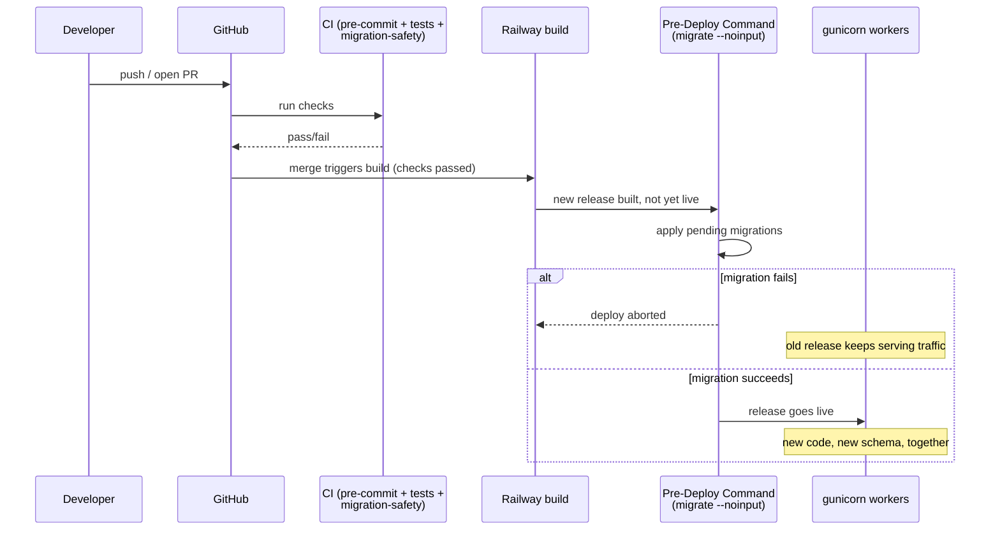
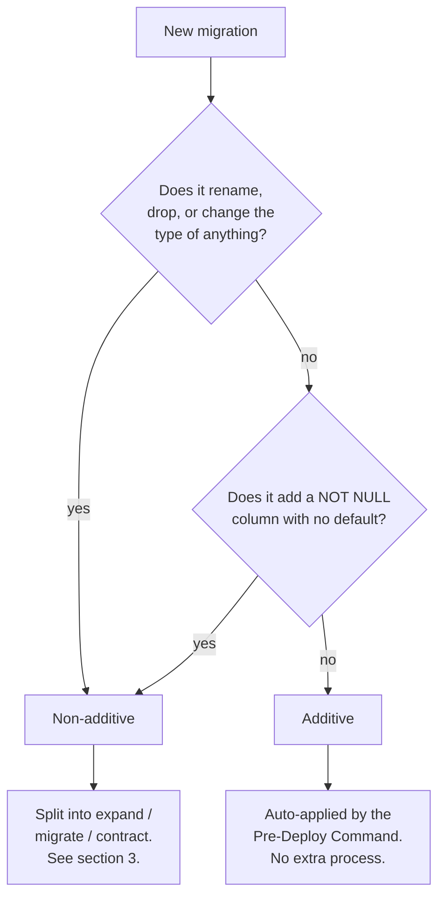
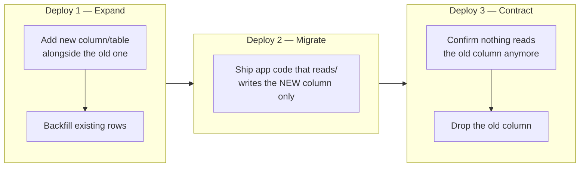
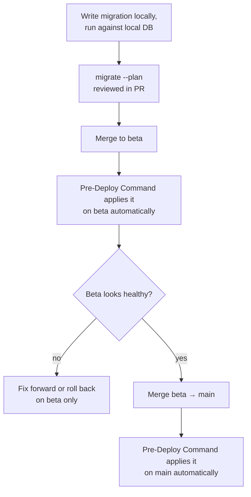

# Migration house rule

This document exists because of one incident-shaped question: **what happens
if a migration fails halfway through, or a worker running old code hits a
column a migration just removed?** Right now the answer is "we find out live
on Railway." This doc is the process that stops that.

It covers three things:
1. How migrations actually reach the production database (and how that's
   changing).
2. The rule for deciding whether a migration is safe to auto-apply, or needs
   to be split into multiple deploys.
3. The step-by-step process for the "needs to be split" case.

---

## 1. How migrations reach production

**Old way (stop doing this):** migrating from a laptop, by pointing
`ENVIRONMENT=prod` at a local shell and running `manage.py migrate` by hand
against the live Railway database.

This has no coupling to the deploy itself. A migration can run while the
*previous* release's workers are still serving traffic against the new
schema, or a deploy can go out before anyone remembers to migrate at all —
new code hitting the old schema. There's also no audit trail: nothing
records who ran what, when, or against which database, beyond your own
shell history.

**New way:** Railway's **Pre-Deploy Command**, set per service in the
Railway dashboard (Service → Settings → Deploy → *Pre-Deploy Command*):

```
python manage.py migrate --noinput
```

This runs once per deploy, using the exact code and environment variables
of the release about to go live, **before** that release starts receiving
traffic. Set it on both the `grade-automator-plus-production` (main) and
`grade-automator-beta-production` (beta) services.



The key property: **migration and code deploy happen atomically, in the
right order, automatically, every time.** No laptop, no shell, no
DATABASE_URI to double check.

A second consequence of moving to this pipeline: `manage.py makemigrations`
must never run against `ENVIRONMENT=prod` again, from anywhere. Migration
*files* are generated locally against dev/local data, committed, and
reviewed in a PR like any other code change. The Pre-Deploy Command only
ever runs `migrate` — applying files that already exist in the repo and
already went through review.

---

## 2. Additive vs. non-additive — the actual rule

A migration is **additive** if a worker running the *previous* release's
code, and a worker running the *new* release's code, can both run against
the resulting schema at the same time without either one erroring. That
window — old code and new code both live, both hitting the same database —
always exists during a rolling deploy, even a fast one. The rule exists to
make sure nothing breaks during it.

| Additive (safe to auto-apply) | Non-additive (needs the 3-step process below) |
|---|---|
| Add a new table | Rename a column or table |
| Add a new nullable column | Drop a column or table |
| Add a new column *with a real default* | Change a column's type |
| Add a new index (concurrently, for large tables) | Make an existing column `NOT NULL` without a default |
| Add a new, unused foreign key (nullable) | Any operation that removes something old code might still read or write |

The intuition: additive changes are things old code simply doesn't know
about yet, and doesn't need to. Non-additive changes take something away
that old code is actively depending on.



This is exactly what `scripts/check_migration_safety.py` checks
automatically in CI (see section 4) — the table above is its rulebook, not
just documentation of intent.

---

## 3. The expand → migrate → contract process

When a migration is non-additive, it becomes **three separate migrations,
in three separate deploys**, not one migration with three steps inside it.
Each deploy is independently safe; a mistake in one doesn't take the whole
rollout down, and you can pause between any of them for as long as you
need.



### Worked example: renaming `SubscriptionPlan.price` to `price_cents`

This is a real rename that already happened in this codebase's history
(`billing/migrations/0032`–`0033`) as a single-step
`RemoveField`/`RenameField` pair. Here's how it should be done under this
rule instead:

**Deploy 1 — Expand.**
```python
# billing/migrations/00XX_add_price_cents.py
operations = [
    migrations.AddField(
        model_name="subscriptionplan",
        name="price_cents",
        field=models.IntegerField(null=True),  # nullable: additive
    ),
]
```
Follow with a data migration or a one-off management command that backfills
`price_cents = price * 100` for existing rows. Old code keeps reading/
writing `price` — untouched, still working. New code doesn't exist yet.
Deploy. Verify the backfill completed (row counts match, spot-check a few
values).

**Deploy 2 — Migrate.**
Ship the application code change: every read and write that used to touch
`price` now touches `price_cents` instead. `price` is still in the schema
and still gets backfilled by anything writing through the old path if it's
still in use elsewhere (there shouldn't be, by this point, but the column
being present means nothing breaks if you're wrong). Deploy. Confirm in
logs/metrics that nothing is still touching the old column.

**Deploy 3 — Contract.**
```python
# billing/migrations/00XX_remove_price.py
# expand-contract-step: contract
operations = [
    migrations.RemoveField(model_name="subscriptionplan", name="price"),
]
```
Only now does `price` actually go away. By this point every running worker,
across every replica, has been on code that doesn't reference it for at
least one full deploy cycle.

Note the `# expand-contract-step: contract` comment on the final migration
— that's what tells the CI check in section 4 that this `RemoveField` is a
deliberate, reviewed step and not an accident.

---

## 4. The CI check

`scripts/check_migration_safety.py`, wired into
`.github/workflows/migration-safety.yml`, runs on every pull request. It
inspects every migration file the PR *adds* (not ones already merged) and
classifies each operation using the table in section 2.

- **Additive migration:** passes automatically, nothing to do.
- **Non-additive migration, no marker:** the PR fails, with the specific
  operation and file named.
- **Non-additive migration, with a marker:** passes, and prints a reminder
  of what was acknowledged — so a reviewer scanning the PR log can see
  exactly what was allowed through and why.

To acknowledge a deliberate non-additive step, add this comment anywhere in
the migration file:

```python
# expand-contract-step: expand
# expand-contract-step: migrate
# expand-contract-step: contract
```

(pick whichever step it actually is — this isn't checked against the
operations for consistency, it's a marker that a human looked at this and
made a call, not a proof of correctness).

### Running it yourself before opening a PR

```bash
python scripts/check_migration_safety.py --base origin/main
```

This is also your fastest local feedback loop — no need to push and wait
for CI to find out a migration needs splitting.

### ⚠️ One-time note on adopting this mid-project

Because `beta` currently carries months of migrations not yet merged to
`main` — several of them non-additive renames/removals that are **already
applied to the live beta database** — running this check against
`origin/main` will flag that entire backlog the next time `beta` merges
into `main`, even though every one of those migrations already shipped
safely. That's not a bug in the check; it's correctly describing history it
wasn't there to review at the time.

**When that merge happens, follow
[BETA_TO_MAIN_MIGRATION_ACK.md](BETA_TO_MAIN_MIGRATION_ACK.md)** — it has
the exact file list, the commands to acknowledge them, and which ones are
worth a closer look before waving through. This is a one-time backlog
cleanup; going forward from that merge, every *new* migration goes through
the real process in section 3.

---

## 5. Verifying before every migration ships

Before merging any PR that adds a migration, run this against a copy of
production data (the `beta` database is exactly this — use it as a
rehearsal environment before touching `main`):

```bash
python manage.py migrate --plan
```

This prints the exact set of migrations that would run and the order,
without applying anything. Use it to catch:
- An unexpected migration file swept up by the diff (wrong dependency,
  stale branch).
- A migration you thought was already applied showing up as pending.

The rollout for a schema change that touches `beta` and `main` should be:



`beta` having its own real database, running the same code as `main`, means
you get one full production-shaped rehearsal for free before anything
touches the database real users are on.
