# Grade A+ (AutoGrader) — Backend Reference

> **Scope.** This document describes the backend **as it exists in the codebase**, traced from URL
> routing through views, serializers, services, models, Celery tasks and external integrations.
> Every claim below is anchored to a file so the implementation can be located. Where the code's
> intent could not be established from the code itself, that is stated explicitly rather than
> guessed at.
>
> **Generated from:** `beta` branch. Django 5.2.6 / DRF 3.16 / Celery 5.5 / PostgreSQL / Redis.

---

## Table of contents

1. [System Overview](#1-system-overview)
2. [Backend Architecture](#2-backend-architecture)
3. [Application / Module Responsibilities](#3-application--module-responsibilities)
4. [Database Schema](#4-database-schema)
5. [Entity Relationships](#5-entity-relationships)
6. [Authentication & Authorization](#6-authentication--authorization)
7. [API Documentation](#7-api-documentation)
8. [Feature-by-Feature Backend Functionality](#8-feature-by-feature-backend-functionality)
9. [Business Rules](#9-business-rules)
10. [Decision Trees](#10-decision-trees)
11. [Workflow Diagrams](#11-workflow-diagrams)
12. [State Machines](#12-state-machines)
13. [Background Jobs & Scheduled Processes](#13-background-jobs--scheduled-processes)
14. [External Integrations](#14-external-integrations)
15. [Notifications & Side Effects](#15-notifications--side-effects)
16. [Error Handling](#16-error-handling)
17. [Data Flow](#17-data-flow)
18. [Permissions Matrix](#18-permissions-matrix)
19. [Technical Decisions](#19-technical-decisions)
20. [Architectural Observations](#20-architectural-observations)
21. [Known Limitations, Risks & Gaps](#21-known-limitations-risks--gaps)
22. [Glossary](#22-glossary)
23. [Appendix: Important Backend Components](#23-appendix-important-backend-components)

---

## 1. System Overview

Grade A+ is an **AI-assisted assignment grading platform** for teachers and schools. The backend is
a single Django project (`AutoGrader`) exposing a JSON REST API under `/api/v1/`, backed by
PostgreSQL, Redis (cache + Celery broker + result backend), and a set of external services
(OpenRouter for LLM inference, Stripe for billing, Cloudinary for media, MailerSend for
transactional email, MailerLite for marketing lists, Google OAuth for social sign-in).

### What the system actually does

| Capability | Where it lives |
| --- | --- |
| Teachers create courses/sessions and enroll students | `classrooms/` |
| Teachers author assignments — typed, uploaded (PDF/image), or AI-generated from a prompt | `assignments/`, `ai_processor/` |
| Students (or teachers on their behalf) upload answer papers; AI extracts structured answers | `students/`, `ai_processor/` |
| AI grades submissions against the rubric, with deterministic pre-pass, caching, evidence verification and a selective blind second opinion | `ai_processor/services.py`, `students/services.py` |
| Teachers review, override, and publish grades | `students/views.py` |
| Every AI call is metered in *credits* against a wallet, funded by an individual Stripe subscription or a school-wide license | `billing/` |
| Role-specific analytics dashboards (super admin / school admin / teacher / student), including a credit-billed "ask the AI about my data" chat | `dashboard/` |
| Scheduled work: renewals, credit refreshes, trial expiry, weekly digests, at-risk alerts, grading-quality benchmarks, Beat self-monitoring | `*/tasks.py` + `CELERY_BEAT_SCHEDULE` |

### Two mutually exclusive commercial tracks

The single most load-bearing business rule in the system is the split between:

* **INDIVIDUAL track** — a teacher with a personal email address, their own `UserSubscription`,
  their own Stripe customer, and their own `CreditWallet`.
* **LICENSE track** — a `School` with a `LicenseSubscription` managed by a `SCHOOL_ADMIN`, under
  which each teacher gets a `SchoolCreditAllocation` that funds their own wallet.

The two are separated at *registration time* by email-domain rules
(`users/serializers.py::CustomUserSerializer.validate`): teacher accounts must use a personal
email, school-admin accounts must use a business email, and attaching a school to a
personal-email teacher is refused. There is deliberately **no merge path** between the tracks.

---

## 2. Backend Architecture

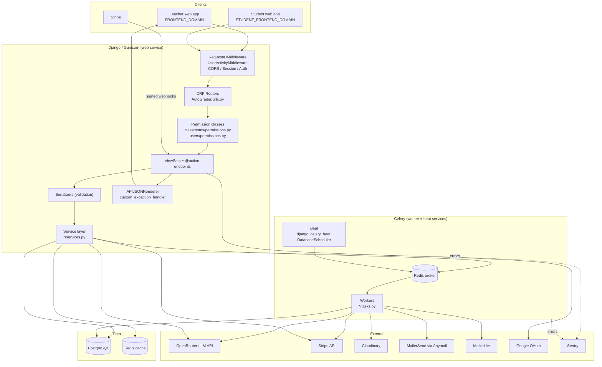
```mermaid
flowchart TD
    subgraph Clients
        TW[Teacher web app<br/>FRONTEND_DOMAIN]
        SW[Student web app<br/>STUDENT_FRONTEND_DOMAIN]
        ST[Stripe]
    end

    subgraph Web["Django / Gunicorn (web service)"]
        MW["RequestIDMiddleware<br/>UserActivityMiddleware<br/>CORS / Session / Auth"]
        R["DRF Routers<br/>AutoGrader/urls.py"]
        V["ViewSets + @action endpoints"]
        P["Permission classes<br/>classrooms/permissions.py<br/>users/permissions.py"]
        S["Serializers (validation)"]
        SVC["Service layer<br/>*/services.py"]
        REND["APIJSONRenderer<br/>custom_exception_handler"]
    end

    subgraph Async["Celery (worker + beat services)"]
        Q[(Redis broker)]
        W["Workers<br/>*/tasks.py"]
        B["Beat<br/>django_celery_beat DatabaseScheduler"]
    end

    subgraph Data
        PG[(PostgreSQL)]
        RC[(Redis cache)]
    end

    subgraph External
        OR[OpenRouter LLM API]
        STR[Stripe API]
        CL[Cloudinary]
        MS[MailerSend via Anymail]
        ML[MailerLite]
        GO[Google OAuth]
        SEN[Sentry]
    end

    TW & SW --> MW --> R --> P --> V --> S --> SVC
    SVC --> PG
    SVC --> RC
    SVC --> Q
    V --> REND --> TW
    ST -->|signed webhooks| V
    Q --> W
    B --> Q
    W --> PG
    W --> OR
    W --> MS
    W --> STR
    W --> CL
    W --> ML
    SVC --> OR
    SVC --> STR
    V --> GO
    Web -.errors.-> SEN
    Async -.errors.-> SEN
```

### Process topology

Three deployable processes share one codebase and one database:

| Process | Entrypoint | Health gate |
| --- | --- | --- |
| **web** | `AutoGrader/wsgi.py` under gunicorn (`--timeout 100`, see `Dockerfile`) | `GET /api/v1/health` — DB `SELECT 1` + cache round-trip (`AutoGrader/health.py`) |
| **worker** | `celery -A AutoGrader worker` | n/a |
| **beat** | `celery -A AutoGrader beat` with `django_celery_beat.schedulers:DatabaseScheduler` | `GET /api/v1/health/beat` — checks the `check-beat-health` PeriodicTask ran within 45 min |

`health` and `health/beat` are deliberately **separate endpoints**: `health` gates the web
service's deploy cutover, so folding a Beat outage into it would block unrelated web deploys
(`AutoGrader/health.py` module docstring).

### Request correlation

`AutoGrader/middleware.py::RequestIDMiddleware` runs **first** in `MIDDLEWARE`. It trusts an
inbound `X-Request-ID` header if well-formed, otherwise generates one, sets it on a contextvar
(`AutoGrader/request_context.py`), tags Sentry with it, and echoes it on the response.
`AutoGrader/celery_signals.py` propagates that id across `.delay()` boundaries so a log line in a
worker can be traced back to the originating HTTP request.

### Response envelope

Every response is wrapped by `users/renderers.py::APIJSONRenderer`:

```jsonc
// success
{ "success": true,  "message": "Request Successful", "data": { ... } }
// error
{ "success": false, "message": "Email: This field is required.", "error": { "field_errors": { ... } } }
```

`flatten_errors()` collapses nested DRF error dicts into one human-readable sentence (numbered
when there are several). `users/exceptions.py::custom_exception_handler` logs every API exception
and marks DRF-handled responses so the renderer can distinguish a validation error from an
unhandled 500 (whose message is replaced by `AutoGrader/error_messages.py::describe_user_error`).

---

## 3. Application / Module Responsibilities

| App | Responsibility | Key modules |
| --- | --- | --- |
| **`AutoGrader`** (project) | Settings, URL root, correlation ids, health checks, Celery app, resilient task dispatch, shared pagination, upload size guard, user-safe error classification | `settings.py`, `urls.py`, `middleware.py`, `dispatch.py`, `health.py`, `beat_health.py`, `uploads.py`, `error_messages.py`, `pagination.py`, `tasks.py` |
| **`users`** | Custom user model, auth (JWT + Google OAuth), OTP flows, settings/notification prefs, beta whitelist/waitlist, background-task status API, throttling, response rendering | `models.py`, `views.py`, `serializers.py`, `permissions.py`, `throttling.py`, `renderers.py`, `middleware.py`, `signals.py`, `mailerlite_service.py` |
| **`classrooms`** | Schools, academic sessions, courses, topics, student enrollment (single/bulk/direct), school-level roll-ups | `models.py`, `views.py`, `serializers.py`, `permissions.py`, `signals.py`, `tasks.py` |
| **`assignments`** | Assignment lifecycle (draft/published), AI extraction & generation, rigor scoring, PDF rendering + cache, due-date/auto-grade scheduling, batch grading fan-out | `models.py`, `views.py`, `services.py`, `tasks.py`, `signals.py`, `rigor.py`, `pdf_renderer.py`, `pdf_cache.py`, `pdf_document.py`, `prosemirror_converter.py` |
| **`students`** | Submissions, answer upload/extraction, the grading engine entrypoint & idempotency claim, review queue, publishing, background-task tracking model | `models.py`, `views.py`, `services.py`, `task_tracking.py`, `task_context.py`, `signals.py`, `exceptions.py` |
| **`ai_processor`** | All LLM interaction: prompts, schemas, the multi-tier grading pipeline, evidence verification, answer completeness, objective matching, grading cache, second opinion, benchmark harness | `services.py`, `evidence.py`, `objective_grading.py`, `answer_completeness.py`, `second_opinion.py`, `grading_cache.py`, `grading_schemas.py`, `extraction_schemas.py`, `tools.py`, `benchmark/` |
| **`billing`** | Plans, wallets/buckets/ledger, individual subscriptions, school licenses, overage (Stripe + offline), Stripe integration + webhook ledger, refunds, manual grants, beta analytics, live-QA console | `models.py`, `services.py`, `license_service.py`, `stripe_service.py`, `webhooks.py`, `access_control.py`, `refunds.py`, `subscription_resolver.py`, `tasks.py`, `*_views.py` |
| **`dashboard`** | Four role-scoped analytics surfaces, at-risk detection, rigor roll-ups, weekly digests, inactivity/at-risk alerting, credit-billed AI chat over dashboard data | `views.py`, `services.py`, `tasks.py`, `risk.py`, `rigor.py`, `at_risk_improvements.py`, `models.py`, `throttling.py` |
| **`grading`** | **Empty.** `models.py`, `views.py`, `admin.py` contain only scaffolding comments. Registered in `INSTALLED_APPS`. | — |
| **`ocr_processor`** | **Empty.** Same as above. OCR is actually performed inside `ai_processor/services.py::PDFService`/`OCRService`. | — |

### Inter-module dependency direction

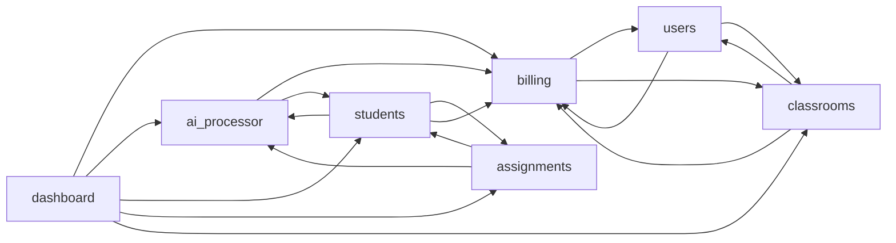
```mermaid
flowchart LR
    dashboard --> billing
    dashboard --> ai_processor
    dashboard --> students
    dashboard --> assignments
    dashboard --> classrooms
    students --> ai_processor
    students --> assignments
    students --> billing
    assignments --> ai_processor
    assignments --> students
    ai_processor --> billing
    ai_processor --> students
    classrooms --> users
    classrooms --> billing
    users --> billing
    users --> classrooms
    billing --> users
    billing --> classrooms
```

There are **genuine import cycles** at module level between `students ↔ assignments`,
`ai_processor ↔ students`, and `users ↔ billing ↔ classrooms`. The codebase resolves these with
deliberate local (function-scope) imports — e.g. `students/services.py::_run_grading_pipeline`
imports `assignments.tasks.formatted_grade_async` inside the function body, and
`assignments/views.py::publish_all_grades` imports `students.services` inside the action. Comments
at those sites name the cycle explicitly.

---

## 4. Database Schema

Conventions used throughout: primary keys are `UUIDField(default=uuid4, editable=False)` unless
noted; "raw credits" always means *display value × 1000* (`billing/models.py::CONVERSION_FACTOR`).

### 4.1 `users`

#### `CustomUser` (`AUTH_USER_MODEL`, extends `AbstractUser`)

| Field | Type | Notes |
| --- | --- | --- |
| `id` | UUID PK | |
| `email` | EmailField **unique** | `USERNAME_FIELD`; `username` is removed (`= None`) |
| `first_name`, `last_name` | CharField | `REQUIRED_FIELDS` |
| `middle_name` | CharField(255) null/blank, default `""` | |
| `school` | FK → `classrooms.School`, `SET_NULL`, null | `related_name="users"` |
| `user_type` | choices `STUDENT / TEACHER / SCHOOL_ADMIN / SUPER_ADMIN` | **default `TEACHER`** |
| `is_active` | Bool, **default `False`** | account is inert until email verification |
| `bio`, `profile_image`, `profile_image_url` | | image uploads go to Cloudinary |
| `activation_token` | CharField(64), **indexed** | 6-digit OTP |
| `activation_expires` | DateTime | |
| `email_verified_at` | DateTime | |
| `registration_method` | choices `EMAIL / GOOGLE / FACEBOOK / TWITTER` | |

**Ordering:** `first_name, last_name, email`.

**Methods / properties**

* `get_full_name()` — joins first/middle/last, skipping blanks.
* `is_student()`, `is_teacher()`, `is_beta_eligible()` (teacher-only).
* `get_active_subscription()` — for teachers, first checks an active `SchoolCreditAllocation`
  under an active license and returns the `LicenseSubscription`; otherwise the active
  `UserSubscription`; else `None`.
* `subscription_type` → `"LICENSE" | "INDIVIDUAL" | None`; `is_under_license()`.
* `get_teacher_monthly_allocation()` — allocation's `monthly_allocation` under a license, else
  `plan.monthly_credits`, else 0.
* `renew_activation_token()` — **raises `ValueError` for non-students**; teachers must use the OTP
  endpoint.

**Constants:** `ACTIVATION_TOKEN_VALIDITY = 24 hours`. (Note: the "expires in 24 hours"/"7 days"
strings in invite email bodies are literals, not derived from this constant.)

#### Supporting `users` models

| Model | Purpose | Key constraints |
| --- | --- | --- |
| `UserGoogleCredentials` | O2O → user; `access_token`/`refresh_token` stored via `EncryptedCharField` (django-encrypted-model-fields) | |
| `Settings` | O2O → user; theme + 8 notification opt-in booleans, **all default `False`** | auto-created by signal |
| `UserActivity` | FK → user, `timestamp` indexed | written on **every authenticated request** by `UserActivityMiddleware` |
| `PasswordResetOTP` | O2O → user, unique `code`; `attempts`, `locked_until` | `MAX_ATTEMPTS=5`, `LOCKOUT_DURATION=30 min`, validity 15 min; `UniqueConstraint(user, code)` |
| `PasswordChangeOTP` | O2O → user | validity 5 min. **Currently unused** — `change_password` verifies the current password instead (OTP check is commented out) |
| `ConcurrentUserSnapshot` | `timestamp`, `concurrent_users` | written every 60 s by Beat |
| `BetaWhitelist` | unique email, `mode` = `BETA`/`WAITLIST`, `is_active` | **no longer gates signup** — kept as a record only |
| `Waitlist` | unique email; `transfer_to_whitelist()` | |

### 4.2 `classrooms`

| Model | Fields of note | Constraints & rules |
| --- | --- | --- |
| `School` | `name` unique+indexed, `address`, `phone`, `website`, `is_active` | `DELETE /schools/{id}` **soft-deletes** (`is_active=False`) |
| `Session` | `name`, `owner_type` (`INDIVIDUAL`/`SCHOOL`, indexed), `teacher` FK CASCADE (null), `school` FK CASCADE (null), `created_by` FK SET_NULL | `UniqueConstraint(name, teacher)` where `owner_type=INDIVIDUAL`; `UniqueConstraint(name, school)` where `owner_type=SCHOOL`. `clean()` enforces the XOR (INDIVIDUAL ⇒ teacher and no school; SCHOOL ⇒ school and no teacher); `save()` calls `full_clean()` |
| `Course` | `name`, `teacher` FK CASCADE, `session` FK CASCADE, `description`, `is_active` | `UniqueConstraint(name, teacher, session)` |
| `Topic` | `name`, `course` FK CASCADE | `UniqueConstraint(name, course)` |
| `CourseCategory` | `name` | Model + viewset exist but the viewset is **not routed** in `classrooms/urls.py` |
| `StudentCourse` | `student` FK CASCADE, `course` FK CASCADE, `enrollment_status` (`ENROLLED/WITHDRAWN/COMPLETED/PENDING`, default **PENDING**, indexed), `auto_added`, `withdrawal_date`, `final_grade` Decimal(5,2), `ai_summary`, `ai_summary_generated_at` | `UniqueConstraint(student, course)`. Default manager `StudentCourseQuerySet.active()` excludes WITHDRAWN; `all_objects` is the unfiltered manager. `clean()` refuses a **duplicate exact full name** in the same course |

`StudentCourse` methods: `withdrawn(when=None)`, `reactivate()`, and the classmethod
`find_name_conflicts(...)` used by both `clean()` and the student-registration flow.

### 4.3 `assignments`

#### `Assignment`

| Group | Fields |
| --- | --- |
| Identity | `id`, `course` FK CASCADE, `topic` FK CASCADE (null), `title` (indexed), `teacher` FK SET_NULL (marked *"IN REVIEW FOR REMOVAL"* — ownership is really `course.teacher`) |
| Source | `raw_input` (ProseMirror text), `raw_input_hash` (sha256, `editable=False`) |
| AI output | `instructions`, `total_points`, `question_count`, `assignment_type` (`OBJECTIVE/ESSAY/SHORT-ANSWER/HYBRID`, default OBJECTIVE), `questions` (JSON), `extraction_confidence`, `potential_issues` (`ArrayField`), `self_assessment`, `ai_generated`, `ai_raw_payload`, `ai_generated_at`, `extraction_started_at`, `extraction_completed_at` |
| Rigor (denormalized) | `rigor_demand`, `rigor_standards`, `rigor_blooms_coverage` — kept in sync by a `pre_save` hook |
| Lifecycle | `status` (`DRAFT/PUBLISHED/UNPUBLISHED`, default DRAFT), `due_date`, `auto_grade_on_due_date`, `scheduled_grading_at`, `grading_task_name`, `admin_grading_notified_at` (idempotency guard), `was_overridden`, `overridden_at`, `custom_ai_prompt` |
| Timestamps | `created_at`, `updated_at` (`auto_now` — **the PDF cache key depends on this**) |

**Constraints:** `UniqueConstraint(course, title, raw_input_hash)`.
**Indexes:** `(course, title)` named `assignment_course_title_idx`. `rigor_demand` is deliberately
**not** indexed (the comment explains: a non-concurrent `CREATE INDEX` would hold an exclusive
write lock at deploy time and the dashboard filters on already-indexed columns).

**Signals on `Assignment` (`assignments/signals.py`)**

| Signal | Handler | Effect |
| --- | --- | --- |
| `pre_save` | `sync_assignment_rigor` | recomputes `rigor_*` from `questions`; skipped when `update_fields` excludes `questions` |
| `pre_save` | `sanitize_assignment_title` | strips HTML from `title` on **every** save (title is read verbatim in emails, PDF headers, filenames) |
| `pre_save` | `handle_due_date_removal` | captures `_previous_status`; deletes the auto-grade PeriodicTask when `auto_grade_on_due_date` or `due_date` is cleared |
| `post_save` | `schedule_auto_grading` | creates/updates the one-off clocked `auto_grade_due_assignment` task; syncs the two due-reminder tasks (24 h, 1 h); on transition into PUBLISHED, queues `send_new_assignment_posted_notification` + `prerender_assignment_pdfs` via `transaction.on_commit` |
| `post_save`/`post_delete` | `clear_assignment_cache` | Redis `delete_pattern` sweep |
| `post_delete` | `delete_auto_grading_task` | removes the auto-grade and both reminder PeriodicTasks |

#### Assignment generation chat

| Model | Purpose |
| --- | --- |
| `AssignmentGenerationSession` | one chat thread per (teacher, course); indexes `(user, course, -updated_at)` |
| `AssignmentGenerationMessage` | `role` (`USER`/`ASSISTANT`), `content`, optional `assignment` FK SET_NULL, `assignment_snapshot` JSON, `metadata` JSON (`draft_status` = `AI_DRAFT` / `SAVED` / `NEEDS_CLARIFICATION`) |
| `AssignmentGenerationHistory` | older flat prompt→assignment log; `assignment` FK SET_NULL. **Not routed by any URL** |

### 4.4 `students`

#### `StudentSubmission`

| Group | Fields |
| --- | --- |
| Identity | `assignment` FK CASCADE, `student` FK CASCADE, `submission_date`, `attempt_count` |
| Content | `answers` (JSON, **not nullable**), `raw_input` (ProseMirror text) |
| Grade | `score` Dec(6,2), `score_percentage` Dec(5,2) **indexed**, `max_points`, `feedback` JSON, `graded_at`, `grading_confidence`, `extraction_confidence` |
| AI mirror | `ai_score`, `ai_feedback`, `ai_graded_at`, `ai_grading_completed_at` |
| Idempotency | `grading_state` (`IDLE/RUNNING/DONE/FAILED`, indexed), `grading_started_at` |
| Review queue | `needs_review` (indexed), `review_reasons` JSON, `review_severity` Float (indexed), `review_tier` (indexed) |
| Human override | `was_regraded` (indexed), `regraded_at` |
| Release | `is_published`, `formatted_grade` |
| Scheduling | `scheduled_grading_at`, `grading_task_name` |

**Constraints:** `UniqueConstraint(student, assignment)` — one submission row per student per
assignment; re-submission **updates** the row.
**Indexes:** `(assignment, -submission_date)`, `(graded_at)`.

#### Batch & task tracking

| Model | Purpose |
| --- | --- |
| `BatchUploadSession` | `teacher` FK, `task_type` (`submission`/`assignment`/`grade`), optional `assignment`/`course`, `total_files`, `results` JSON list; `update_result()` appends inside `transaction.atomic()` |
| `BackgroundProcessingTask` | The user-visible task record. `celery_task_id` **unique+indexed**, `requested_by`, optional `batch_session`/`assignment`/`submission`, `task_type` (8 choices), `status` (`PENDING/STARTED/CANCELLED/SUCCESS/FAILURE`, indexed), `file_name`, `meta` JSON, `error`, `cancel_requested_at`, `started_at`, `finished_at` |

### 4.5 `billing`

#### Catalogue

| Model | Notes |
| --- | --- |
| `PlanFeature` | **`key` is the primary key** (no surrogate). `label`, `is_gating_feature` — only `True` rows are enforced in code |
| `PlanFeatureInclusion` | through-table: `plan` CASCADE, `feature` **PROTECT**, `included`, `display_order`; `unique_together(plan, feature)` |
| `SubscriptionPlan` | `name` unique (from `PlanType`), `category` (INDIVIDUAL/LICENSE), `tier`, `interval` (MONTHLY/ANNUAL/NONE), Stripe `product_id`/`stripe_price_id`/`stripe_overage_price_id`, `price_cents`, `monthly_credits`, rollover (`carry_over_percent`, `carry_over_max`, `max_bank`, `carry_over_expiry_months`), overage (`overage_block_size`, `overage_block_price`, `max_overage_blocks`), display (`highlight`, `is_contact_sales`, `tagline`), `is_active` |

`PLAN_TIER_HIERARCHY = [STANDARD, PRO, POWER]`; `get_tier_rank()` **raises `ValueError`** for a
tier outside that list rather than silently ordering it.

#### Subscriptions

| Model | Notes |
| --- | --- |
| `UserSubscription` | `user` CASCADE, `plan` **PROTECT**, `is_active`, `billing_cycle_start/end`, `is_trial`, `trial_end` (indexed), `auto_renew`, `cancelled_at`, `pending_plan` PROTECT, `pending_change_type` (`DOWNGRADE`/`UPGRADE_DEFERRED`/`LATERAL_DEFERRED`), `pending_change_note`, `stripe_schedule_id`, `stripe_subscription_id`, `stripe_customer_id`, `stripe_status`, `next_credit_grant_at`. **`UniqueConstraint(user) WHERE is_active` — at most one active subscription per user** |
| `LicenseSubscription` | `school` CASCADE, `admin_user` **PROTECT**, `plan` PROTECT, `contract_months` (9/10/12), `max_seats` (`0` = unlimited), cycle dates, `is_active`, `auto_renew`, Stripe ids, `billing_method` (`STRIPE`/`OFFLINE`), `custom_price_cents`, `total_credits_consumed`, `consumption_window_start`. Properties: `teacher_count` (excludes admin allocation), `seats_remaining` (`None` when unlimited) |
| `SchoolCreditAllocation` | `license_subscription` CASCADE, `user` CASCADE, `monthly_allocation`, `is_active`, `is_admin_allocation`, `next_credit_grant_at`. `unique_together(license_subscription, user)`; indexes `(license_subscription, is_active)`, `(user, is_active)` |

#### Credits

| Model | Notes |
| --- | --- |
| `CreditWallet` | **O2O** → user, `overage_blocks_used`, `stripe_customer_id`. Auto-created by both the post-save signal *and* `UserActivityMiddleware` |
| `CreditBucket` | `wallet` CASCADE, `bucket_type` (`MONTHLY/CARRY_OVER/OVERAGE/MANUAL_GRANT/TRIAL`), `total_credits`, `used_credits`, `expires_at` (null = never), `is_processed`. Index `(wallet, bucket_type, expires_at)` |
| `CreditLedger` | Immutable audit trail. `user` CASCADE, `bucket` **SET_NULL**, `ledger_type` (`CONSUME/REFUND/GRANT/EXPIRE/PURCHASE/PLAN_CHANGE`), signed `amount`, `reference`, `metadata` JSON |
| `CreditUsageLog` | Per-consumption detail. `wallet`, `bucket` CASCADE, `course` SET_NULL, **`school` SET_NULL — a snapshot at consumption time, deliberately not joined live**, `amount`, `feature` (indexed), `task_type`, `task_id` (indexed), `is_refunded` |

#### Money & events

| Model | Notes |
| --- | --- |
| `BillingTransaction` | Unified money ledger across both tracks. Partial unique constraints on `stripe_invoice_id`, `stripe_payment_intent_id`, `license_billing_record` give DB-level idempotency for `BillingTransactionService.record()`'s upsert |
| `LicenseBillingRecord` | Immutable accounting trail for offline/manual license events (9 record types) |
| `LicenseOveragePurchaseIntent` | Stripe Checkout overage flow; snapshots block size + unit price at initiation; `stripe_checkout_session_id` unique |
| `LicenseOverageOfflineRequest` | Off-Stripe overage request awaiting **human superadmin review**; `PENDING/APPROVED/REJECTED`, quoted vs confirmed amounts, `fulfilled_allocations`/`skipped_allocations` |
| `StripeEvent` | Webhook idempotency ledger. `stripe_event_id` unique, `status` (`PROCESSING/SUCCEEDED/FAILED`), `claimed_at` (fencing token), `completed_at`, `attempts`, `last_error`. Rows are **never deleted** |
| `BetaProfile` | O2O → user; cohort timing, credit velocity, feature mix, intent signals, `conversion_probability` |
| `LiveQARun` | Durable record of a real-Stripe QA run (the Celery result backend expires after 1 h) |

### 4.6 `dashboard`

| Model | Purpose | Constraint |
| --- | --- | --- |
| `StudentRiskAlertState` | mutable per-(student, school) at-risk cache; detects the false→true transition | `UniqueConstraint(student, school)` |
| `SchoolAtRiskSnapshot` | daily historical count per school (written for **every** school, regardless of email opt-in) | `UniqueConstraint(school, snapshot_date)` |
| `TeacherInactivityAlertState` | O2O → teacher; one alert per inactivity episode | — |

### 4.7 `ai_processor`

| Model | Purpose |
| --- | --- |
| `ChatSession` | Dashboard AI-chat thread. `UniqueConstraint(user, assistant_type)` where both non-null — one thread per user per assistant type (`SUPER_ADMIN_ANALYTICS`/`SCHOOL_ADMIN_ANALYTICS`/`TEACHER_ADMIN_ANALYTICS`) |
| `ChatMessage` | `role` (`user`/`assistant`/`system`), `content`, ordered by `timestamp` |
| `BenchmarkRun` | DB mirror of `benchmark/history/runs.jsonl`; deliberately denormalized and nullable — "an import must never fail because one metric is missing" |
| `BenchmarkQuestionOutcome` | Per-question result within a run; `UniqueConstraint(run, assignment_key, student_key, question_number)` |

---

## 5. Entity Relationships

### 5.1 Teaching domain

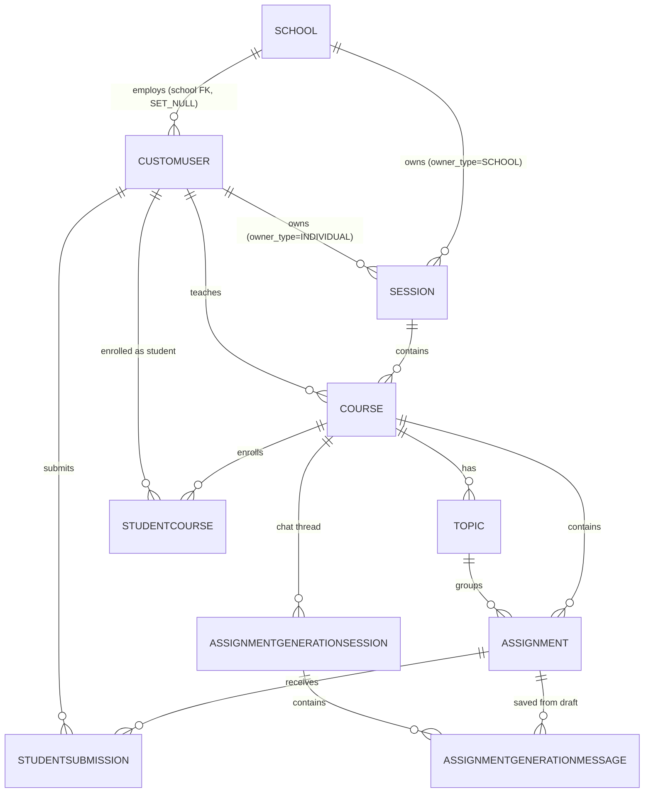
```mermaid
erDiagram
    SCHOOL ||--o{ CUSTOMUSER : "employs (school FK, SET_NULL)"
    SCHOOL ||--o{ SESSION : "owns (owner_type=SCHOOL)"
    CUSTOMUSER ||--o{ SESSION : "owns (owner_type=INDIVIDUAL)"
    SESSION ||--o{ COURSE : contains
    CUSTOMUSER ||--o{ COURSE : teaches
    COURSE ||--o{ TOPIC : has
    COURSE ||--o{ STUDENTCOURSE : enrolls
    CUSTOMUSER ||--o{ STUDENTCOURSE : "enrolled as student"
    COURSE ||--o{ ASSIGNMENT : contains
    TOPIC ||--o{ ASSIGNMENT : groups
    ASSIGNMENT ||--o{ STUDENTSUBMISSION : receives
    CUSTOMUSER ||--o{ STUDENTSUBMISSION : submits
    ASSIGNMENT ||--o{ ASSIGNMENTGENERATIONMESSAGE : "saved from draft"
    COURSE ||--o{ ASSIGNMENTGENERATIONSESSION : "chat thread"
    ASSIGNMENTGENERATIONSESSION ||--o{ ASSIGNMENTGENERATIONMESSAGE : contains
```

### 5.2 Billing domain

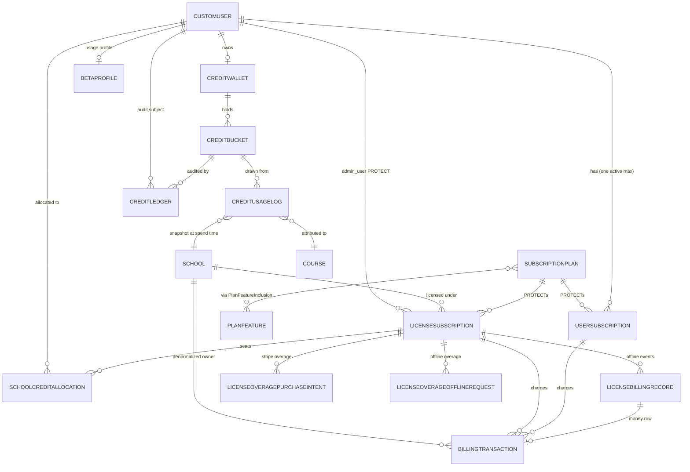
```mermaid
erDiagram
    CUSTOMUSER ||--o| CREDITWALLET : owns
    CREDITWALLET ||--o{ CREDITBUCKET : holds
    CREDITBUCKET ||--o{ CREDITUSAGELOG : "drawn from"
    CREDITBUCKET ||--o{ CREDITLEDGER : "audited by"
    CUSTOMUSER ||--o{ CREDITLEDGER : "audit subject"
    CUSTOMUSER ||--o{ USERSUBSCRIPTION : "has (one active max)"
    SUBSCRIPTIONPLAN ||--o{ USERSUBSCRIPTION : "PROTECTs"
    SUBSCRIPTIONPLAN ||--o{ LICENSESUBSCRIPTION : "PROTECTs"
    SUBSCRIPTIONPLAN }o--o{ PLANFEATURE : "via PlanFeatureInclusion"
    SCHOOL ||--o{ LICENSESUBSCRIPTION : "licensed under"
    CUSTOMUSER ||--o{ LICENSESUBSCRIPTION : "admin_user PROTECT"
    LICENSESUBSCRIPTION ||--o{ SCHOOLCREDITALLOCATION : "seats"
    CUSTOMUSER ||--o{ SCHOOLCREDITALLOCATION : "allocated to"
    LICENSESUBSCRIPTION ||--o{ LICENSEBILLINGRECORD : "offline events"
    LICENSESUBSCRIPTION ||--o{ LICENSEOVERAGEPURCHASEINTENT : "stripe overage"
    LICENSESUBSCRIPTION ||--o{ LICENSEOVERAGEOFFLINEREQUEST : "offline overage"
    LICENSEBILLINGRECORD ||--o| BILLINGTRANSACTION : "money row"
    USERSUBSCRIPTION ||--o{ BILLINGTRANSACTION : charges
    LICENSESUBSCRIPTION ||--o{ BILLINGTRANSACTION : charges
    SCHOOL ||--o{ BILLINGTRANSACTION : "denormalized owner"
    CUSTOMUSER ||--o| BETAPROFILE : "usage profile"
    CREDITUSAGELOG }o--|| COURSE : "attributed to"
    CREDITUSAGELOG }o--|| SCHOOL : "snapshot at spend time"
```

### 5.3 Task-tracking domain

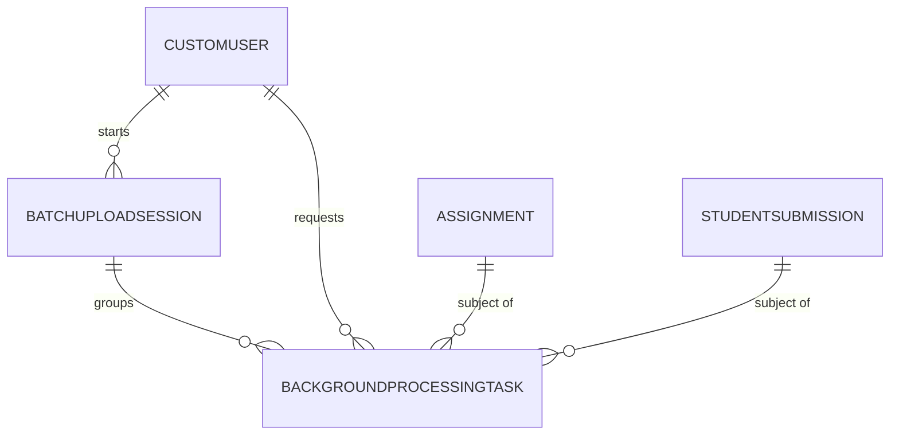
```mermaid
erDiagram
    CUSTOMUSER ||--o{ BATCHUPLOADSESSION : starts
    BATCHUPLOADSESSION ||--o{ BACKGROUNDPROCESSINGTASK : groups
    CUSTOMUSER ||--o{ BACKGROUNDPROCESSINGTASK : requests
    ASSIGNMENT ||--o{ BACKGROUNDPROCESSINGTASK : "subject of"
    STUDENTSUBMISSION ||--o{ BACKGROUNDPROCESSINGTASK : "subject of"
```

### 5.4 Delete-behaviour summary

| Relationship | Behaviour | Consequence |
| --- | --- | --- |
| `CustomUser.school` | `SET_NULL` | deleting a school detaches its users rather than deleting them |
| `Session.teacher` / `Session.school` | `CASCADE` | deleting a teacher deletes their individual sessions → courses → assignments → submissions |
| `UserSubscription.plan`, `LicenseSubscription.plan`, `PlanFeatureInclusion.feature` | `PROTECT` | a plan/feature in use **cannot** be deleted |
| `LicenseSubscription.admin_user` | `PROTECT` | the admin account of a live license cannot be deleted |
| `CreditLedger.bucket` | `SET_NULL` | the audit row survives bucket deletion |
| `CreditUsageLog.course` / `.school` | `SET_NULL` | historical usage survives course/school deletion |
| `BillingTransaction.*` | all `SET_NULL` | money history is never cascaded away |
| `AssignmentGenerationMessage.assignment` | `SET_NULL` | chat history survives assignment deletion |
| `BackgroundProcessingTask.assignment` | `CASCADE` | *but* `cleanup_cancelled_task_artifacts` explicitly detaches tasks before deleting a cancelled assignment, so the cancellation record survives for polling |

### 5.5 Where each constraint lives

| Layer | Examples |
| --- | --- |
| **Database** | `UniqueConstraint(student, assignment)`, `one_active_subscription_per_user`, partial unique indexes on `BillingTransaction` Stripe ids, `unique_session_name_per_teacher/school` |
| **Model `clean()` / `save()`** | `Session` owner-type XOR, `StudentCourse` duplicate-name refusal (both call `full_clean()` in `save()`) |
| **Serializer (API validation)** | email-domain track rules, privileged-field read-only enforcement, score bounds, `min_length=1` on questions, due-date sanity |
| **Service layer (business rules)** | credit consumption ordering, rollover capping, grading claim, license seat limits, plan-change branch selection, refund scoping |
| **Permission classes** | role gating and object ownership |

---

## 6. Authentication & Authorization

### 6.1 Authentication mechanisms

| Mechanism | Configuration |
| --- | --- |
| **JWT (primary)** | `rest_framework_simplejwt`. Access token **1 day**, refresh **2 days**, `ROTATE_REFRESH_TOKENS=True`, `BLACKLIST_AFTER_ROTATION=True`, HS256, header type `Bearer`, user id claim `user_id` (`AutoGrader/settings.py::SIMPLE_JWT`) |
| **Session (secondary)** | `SessionAuthentication` is also in `DEFAULT_AUTHENTICATION_CLASSES` — used by the DRF browsable API and the internal QA console |
| **Google OAuth 2.0** | `POST /api/v1/auth/google-auth` exchanges an authorization `code` server-side, verifies the returned `id_token` against `GOOGLE_OAUTH_CLIENT_ID`, then issues the project's own JWT pair |
| **Stripe signature** | Webhook endpoints are unauthenticated and CSRF-exempt; `stripe.Webhook.construct_event` against `STRIPE_WEBHOOK_SECRET` **is** the authentication |

Default permission for every endpoint is `IsAuthenticated`
(`REST_FRAMEWORK.DEFAULT_PERMISSION_CLASSES`); public endpoints opt out explicitly with
`permission_classes=[AllowAny]`.

### 6.2 Authentication flows

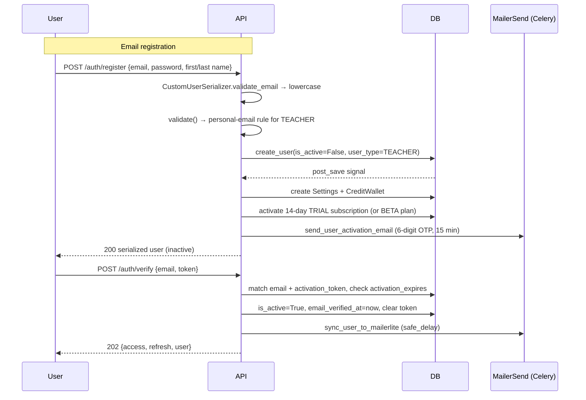
```mermaid
sequenceDiagram
    participant U as User
    participant API
    participant DB
    participant Mail as MailerSend (Celery)

    Note over U,API: Email registration
    U->>API: POST /auth/register {email, password, first/last name}
    API->>API: CustomUserSerializer.validate_email → lowercase
    API->>API: validate() → personal-email rule for TEACHER
    API->>DB: create_user(is_active=False, user_type=TEACHER)
    DB-->>API: post_save signal
    API->>DB: create Settings + CreditWallet
    API->>DB: activate 14-day TRIAL subscription (or BETA plan)
    API->>Mail: send_user_activation_email (6-digit OTP, 15 min)
    API-->>U: 200 serialized user (inactive)

    U->>API: POST /auth/verify {email, token}
    API->>DB: match email + activation_token, check activation_expires
    API->>DB: is_active=True, email_verified_at=now, clear token
    API->>Mail: sync_user_to_mailerlite (safe_delay)
    API-->>U: 202 {access, refresh, user}
```

Notable details:

* `send_user_activation_email` (`users/services.py`) sets the token expiry to **15 minutes**, while
  `CustomUser.renew_activation_token()` (student invite renewal) uses `ACTIVATION_TOKEN_VALIDITY`
  = **24 hours**. Two different windows for two different flows.
* The student and teacher apps get different activation URLs: `STUDENT_FRONTEND_DOMAIN` vs
  `FRONTEND_DOMAIN`.
* Registration is **open**. `BetaWhitelist`/`Waitlist` no longer gate `validate_email` — the
  docstring says so explicitly; the models and their superadmin endpoints remain as records.

### 6.3 Password flows

| Flow | Endpoint | Mechanics |
| --- | --- | --- |
| Forgot password | `POST /auth/otp` `{email, otp_type:"RESET_PASSWORD"}` → `POST /auth/reset-password` | `PasswordResetOTP.generate_code()` (resets attempts and clears lockout); reset uses `constant_time_compare`, counts failures (`register_failure`), 5 attempts → 30-min lockout, 15-min validity. **All non-lockout failures return the identical message** so nothing leaks which field was wrong. On success: password set, OTP deleted, **every** outstanding refresh token blacklisted, a fresh pair issued |
| Change password (authenticated) | `POST /auth/change-password` | Verifies `current_password`; the `PasswordChangeOTP` check is **commented out**. Blacklists all outstanding tokens and issues a fresh pair |
| Request change-password OTP | `POST /auth/request-change-password` | Generates a `PasswordChangeOTP` and sends it **synchronously** via `send_mail` (not Celery). The code it sends is not verified by any endpoint |
| Logout | `POST /auth/logout` `{refresh}` | Blacklists that one refresh token → `205` |

`generate_code()` resetting the attempt counter is why `OTPRequestThrottle` (5/hour) is described
in `users/throttling.py` as **load-bearing for the lockout**, not merely spam control.

### 6.4 Throttling

Throttling is **anonymous-only by design** (`AutoGrader/settings.py` comment): the authenticated
dashboards fan out into many sub-queries per page load, so a global per-user cap would throttle
legitimate use; the threats being closed (OTP brute force, credential stuffing, registration spam)
are all unauthenticated.

| Scope | Rate | Applied to |
| --- | --- | --- |
| `anon` | 60/min | global default for unauthenticated traffic |
| `login` | 10/min | `TokenObtainPairView` |
| `verify_email` | 5/hour | `AuthViewSet.verify` |
| `otp_request` | 5/hour | `AuthViewSet.otp` |
| `password_reset` | 10/hour | `AuthViewSet.reset_password` |
| `register` | 10/hour | `register`, `register_student`, `register_school_admin`, `CourseViewSet.handle_expired_token` |
| `google_auth` | 20/hour | `AuthViewSet.google_auth` |
| `custom_ai_prompt` | scoped | **The one authenticated bucket.** Shared across all four dashboard AI-chat actions via `throttle_scope="custom_ai_prompt"` — deliberately one bucket per user across all endpoints so a multi-role user cannot multiply their budget by hopping endpoints |

Health endpoints are explicitly `@throttle_classes([])` — a 429 there would read as an outage to
an uptime monitor.

### 6.5 Role model & permission classes

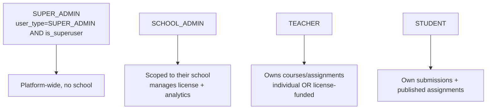
```mermaid
flowchart TD
    A[SUPER_ADMIN<br/>user_type=SUPER_ADMIN AND is_superuser] --> B[Platform-wide, no school]
    C[SCHOOL_ADMIN] --> D[Scoped to their school<br/>manages license + analytics]
    E[TEACHER] --> F[Owns courses/assignments<br/>individual OR license-funded]
    G[STUDENT] --> H[Own submissions + published assignments]
```

`classrooms/permissions.py`:

| Class | Rule |
| --- | --- |
| `IsSuperAdmin` | **Requires both** `user_type == SUPER_ADMIN` **and** `is_superuser` — checking only one would let the two disagree |
| `IsSchoolAdmin` | `user_type == SCHOOL_ADMIN` |
| `IsTeacher` | `user_type == TEACHER` |
| `IsStudent` | `user_type == STUDENT` |
| `IsNotStudent` | any authenticated non-student |
| `IsTeacherOrReadOnly` | safe methods → any authenticated user; writes → teachers only |
| `IsTeacherOrStudent` | teacher or student |
| `CanManageSession` | Read: anyone (queryset does the scoping). Write: super admin always; school admin only for `SCHOOL` sessions of a school they belong to; **individual-track teacher only for their own `INDIVIDUAL` sessions**; a teacher **under an active license can never write** — keyed off `is_under_license()`, not `school_id`, because `school_id` survives license removal |

`billing/license_views.py::IsSchoolAdminOrSuperAdmin` — object permission is scoped by **school
membership, not `obj.admin_user == request.user`**. The comment records why: keying off
`admin_user` locked out a school's second admin and disagreed with `get_queryset()` (license
appeared in the list then 403'd on retrieve), and let a wrongly-set `admin_user` lock the real
admin out entirely.

`users/permissions.py::HasCreditBalance` — not a role check but a **balance** check. Super admins
always pass. For a student it resolves the responsible teacher from the URL kwargs
(`assignment_id` → `course_id`/`id` → `submission_id`/`pk`) and checks *that teacher's* wallet.
On zero balance it raises `ParseError` (HTTP 400) with an HTML-formatted message.

### 6.6 Object-level scoping (data isolation)

Isolation is enforced primarily through `get_queryset()` overrides, so a guessed UUID 404s rather
than leaking:

| ViewSet | Teacher sees | Student sees | School admin sees | Super admin sees |
| --- | --- | --- | --- | --- |
| `CustomUserViewSet` | self + students enrolled in their courses | self only | self + same-school users + students of same-school teachers | everyone |
| `CourseViewSet` | own courses | courses they're enrolled in | *(none — `Course.objects.none()`)* | *(none)* |
| `SessionViewSet` | own INDIVIDUAL sessions, **or** their school's SCHOOL sessions when under licence | sessions of courses they're ENROLLED in | SCHOOL sessions of schools they belong to | all |
| `AssignmentViewSet` | `course__teacher=self` | `course__enrollments__student=self` **and** `status=PUBLISHED` | none | none |
| `StudentSubmissionViewSet` | `assignment__course__teacher=self` | own, excluding DRAFT/UNPUBLISHED assignments | none | none |
| `TopicViewSet` | topics of own courses | topics of enrolled courses | none | none |
| `LicenseSubscriptionViewSet` | — | — | own school's licenses | all |

Two extra guards worth naming:

1. **`CustomUserViewSet.partial_update`** — being able to *see* a user is not permission to *edit*
   them. Teachers/school admins can read their students, so the action explicitly refuses any
   edit of another account unless the caller is a super admin.
2. **`CustomUserSerializer.PRIVILEGED_FIELDS = ("user_type", "school")`** — forced read-only in
   `__init__` unless the serializer was built with a genuine super admin in its context. Set
   explicitly in both directions because DRF ignores `Meta.read_only_fields` for
   class-declared fields. Server-side callers that legitimately set these (student/school-admin
   registration, license enrollment) assign them on the model directly.
3. **`get_queryset()` never raises** in `CustomUserViewSet` — `UserCacheMixin.get_cache_key()`
   calls it for the model name *before* permissions run, so an exception there would surface as a
   500 rather than a 401/403.

### 6.7 Cross-tenant invariants

Enforced in `CustomUserSerializer.validate()`:

* A super admin **cannot** be assigned a school, and cannot be converted into
  `SCHOOL_ADMIN/TEACHER/STUDENT` while still a superuser (this would make them show up as a
  school's admin on every school screen *and* silently revoke their own `IsSuperAdmin` access).
* Promoting an account to `SUPER_ADMIN` requires clearing its school in the same request.
* A teacher on a personal email **cannot** be attached to a school.
* Students cannot edit their own names after registration.
* Email-domain rules re-fire when `user_type` changes, not just on create/email-change — otherwise
  PATCHing an existing gmail teacher to `SCHOOL_ADMIN` sailed through.
* `@student.local` addresses (system-generated placeholders for name-only students) are exempt
  from all of the above and are **nulled out in API responses** (`to_representation`).

The mirror-image invariant on the billing side is
`LicenseSubscriptionService.validate_admin_user()`.

---

## 7. API Documentation

**Base path:** `/api/v1/`. **Trailing slashes: none** (`DEFAULT_ROUTER_TRAILING_SLASH: False`).
**Pagination:** `AutoGrader.pagination.StandardPageNumberPagination`, `PAGE_SIZE=20`,
`?page=&page_size=`.
**Schema:** `GET /api/v1/` (OpenAPI via drf-spectacular), `GET /api/v1/swagger-ui`.

All payloads below are wrapped in the `{success, message, data|error}` envelope described in §2.

### 7.1 Authentication (`users`)

| Method | Path | Auth | Throttle | Purpose |
| --- | --- | --- | --- | --- |
| POST | `/auth/login` | public | `login` 10/min | JWT pair + serialized user; lowercases email; records activity |
| POST | `/auth/refresh` | public | — | rotate refresh → new pair |
| POST | `/auth/register` | public | `register` | Create a TEACHER (user_type is dropped from the payload by design) |
| POST | `/auth/register/student` | public | `register` | Complete a student invite: token → set names/password, activate, flip all PENDING enrollments to ENROLLED |
| POST | `/auth/register/school-admin` | public | `register` | Complete a school-admin invite; uses `select_for_update()` so two submissions of the same link can't both pass the `is_active` check |
| POST | `/auth/verify` | public | `verify_email` 5/h | Activate an account by 6-digit token → 202 + JWT pair |
| POST | `/auth/otp` | public | `otp_request` 5/h | Issue `VERIFY_EMAIL` or `RESET_PASSWORD` OTP. Returns 202 with a neutral message even for an unknown email (no account enumeration) |
| POST | `/auth/reset-password` | public | `password_reset` | Reset by OTP; blacklists all tokens; returns a fresh pair |
| POST | `/auth/request-change-password` | auth | — | Emails a `PasswordChangeOTP` **synchronously** |
| POST | `/auth/change-password` | auth | — | Verifies `current_password`, sets new one, blacklists all tokens, returns a fresh pair |
| POST | `/auth/google-auth` | public | `google_auth` 20/h | Code → token exchange → id_token verification → find-or-create user → JWT pair. Stores encrypted Google tokens in `UserGoogleCredentials` |
| POST | `/auth/logout` | auth | — | Blacklist one refresh token → 205 |

**Example — login**

```http
POST /api/v1/auth/login
{ "email": "jane@gmail.com", "password": "..." }
```

```jsonc
{ "success": true, "message": "Request Successful", "data": {
    "refresh": "...", "access": "...",
    "user": { "id": "...", "email": "jane@gmail.com", "user_type": "TEACHER",
              "settings": { ... }, "credit_wallet": { ... }, "is_system_generated_email": false }
}}
```

**Errors:** `400` invalid/expired token, already-verified email, wrong OTP (identical message for
every non-lockout failure); `401` bad credentials; `429` throttled.

### 7.2 Users, settings, tasks (`users`)

| Method | Path | Permission | Notes |
| --- | --- | --- | --- |
| GET | `/users` | `IsSuperAdmin` | filters: `user_type`, `school__name`, `enrollments__course`, `enrollments__course__session`, `enrollments__enrollment_status`; search on names/email |
| POST | `/users` | `IsSuperAdmin` | the only path that can mint non-teacher accounts via serializer |
| GET | `/users/me` | auth | cached 5 min under `user:user_id__{id}` |
| GET/PATCH/DELETE | `/users/{id}` | auth (PATCH self-only unless super admin; DELETE super admin) | |
| GET | `/users/settings` | `IsSuperAdmin` | |
| GET | `/users/settings/my_settings` | auth | **self-heals** a missing `Settings` row rather than 404ing |
| GET/PATCH | `/users/settings/{id}` | auth (own only) | POST/DELETE return `405` by design |
| GET | `/tasks/status/{celery_task_id}` | auth | Maps `BackgroundProcessingTask` → `processing/completed/failed/cancelled` + resource context; falls back to Celery `AsyncResult` |
| POST | `/tasks/cancel/{celery_task_id}` | auth | Only tasks `requested_by` the caller; already-terminal tasks report their real final status instead of claiming cancellation |
| POST | `/tasks/cancel-session/{session_id}` | auth (session owner) | Cancels every non-terminal task in a batch |
| GET | `/tasks/session-results/{session_id}` | auth (session owner) | progress, percent, and success/failure/cancelled/pending lists with per-task context |
| CRUD | `/whitelist`, `/waitlist` | `IsSuperAdmin` | records only; `POST /waitlist/{id}/transfer` moves an entry to the whitelist |

### 7.3 Schools, sessions, courses, enrollment (`classrooms`)

| Method | Path | Permission | Notes |
| --- | --- | --- | --- |
| GET | `/schools` | `IsSuperAdmin` | annotated with teachers/students/tokens_used/sessions + first admin; `?search=`, `?ordering=`, `?include_archived=true` |
| POST | `/schools` | `IsSuperAdmin` | |
| POST | `/schools/create_with_admin` | `IsSuperAdmin` | creates the school **and** invites its admin in one transaction |
| GET | `/schools/{id}` | `IsSuperAdmin` | detail with a per-session, per-teacher breakdown of assignments/students/tokens plus `tokens_unattributed` |
| DELETE | `/schools/{id}` | `IsSuperAdmin` | **soft delete** (`is_active=False`) → 204 |
| GET | `/schools/admin-summary` | `IsSuperAdmin` | paginated school admins with school aggregates |
| GET | `/schools/teacher-summary` | `IsSuperAdmin` | per-teacher assignments/students/tokens; `?school_id=`, `?session_id=` also reports `tokens_used_outside_session` |
| GET | `/schools/monthly-token-usage` | **`IsAuthenticated`** | deliberate exception: a school admin sees their own school; a superadmin must pass `?school_id=`; `?months=1..36` (default 12) |
| CRUD | `/sessions` | `CanManageSession` | `perform_create` decides owner_type by role; a licensed teacher gets `403` with "contact your school admin" |
| CRUD | `/course` | `IsTeacherOrReadOnly` | annotated `student_count`; prefetches non-withdrawn enrollments |
| GET | `/course/my-courses` | student only | cached 5 min; excludes WITHDRAWN |
| POST | `/course/{id}/students` | teacher (scoped) | invite/enroll one student by email |
| POST | `/course/{id}/direct-add-student` | `IsTeacher` | name-only student (creates an `@student.local` placeholder account) |
| POST | `/course/{id}/bulk-add-students` | `IsTeacher` | CSV file **or** pasted TSV/CSV; header auto-detection needs ≥2 recognised columns, otherwise rows are parsed positionally |
| DELETE | `/course/{id}/student/{student_id}` | course teacher | **deletes the enrollment AND the student account** (see §21) |
| POST | `/course/{id}/topics` | teacher | accepts a list of strings or dicts |
| GET | `/course/{id}/student-summary?student_id=&refresh=` | `IsTeacher` + `HasCreditBalance` | returns the cached `ai_summary` unless `refresh=true`, else dispatches `student_summary_async` and returns a `task_id` |
| POST | `/course/renew-student-token` | **public** + `register` throttle | reissues an expired student invite; emails both student and teacher |
| GET | `/student-course`, `/student-course/{id}` | `IsTeacherOrReadOnly` | teacher sees own courses' enrollments; student sees own |
| GET | `/student-course/my-students` | `IsTeacher` | distinct non-withdrawn students across the teacher's courses |
| CRUD | `/topics` | scoped by role | |

### 7.4 Assignments

| Method | Path | Permission | Behaviour |
| --- | --- | --- | --- |
| GET | `/assignments` | auth (scoped) | `AssignmentListSerializer` / `AssignmentListStudentSerializer`; filters `course`, `status`, `assignment_type`, `course__session` |
| POST | `/assignments` | `IsTeacherOrReadOnly` | **synchronous** AI extraction from `raw_input` → `202` |
| POST | `/assignments/create-async` | same | creates the row, then queues `extract_assignment_background_task` → `202 {assignment_id, task_id}` |
| GET | `/assignments/{id}` | auth (scoped) | detail; students get the student serializer |
| PATCH | `/assignments/{id}` | teacher | with `raw_input` → re-extraction **gated on `HasCreditBalance`** (403 if broke); without → plain metadata update |
| PATCH | `/assignments/{id}/update-async` | `IsTeacher` + `HasCreditBalance` | commits metadata synchronously, queues re-extraction |
| POST | `/assignments/upload` | `IsTeacher` | multipart `assignments[]`; synchronous per-file extraction; returns `201`, `400`, or **`207 Multi-Status`** when partially successful |
| POST | `/assignments/upload-async` | `IsTeacher` + `HasCreditBalance` | creates a `BatchUploadSession` and one task per file → `202 {session_id, tasks[]}` |
| POST | `/assignments/generate/{course_id}` | teacher (course-scoped) | AI generation chat; may return a **clarification turn** instead of a draft |
| POST | `/assignments/generated-drafts/{message_id}/save` | teacher | Materialize an `AI_DRAFT` message into a real `Assignment` (idempotent: re-saving returns the existing one) |
| PATCH | `/assignments/{id}/associate-topic?topic_id=` | teacher | refuses a topic from another course |
| POST | `/assignments/{id}/grade-all` | `IsTeacher` + `HasCreditBalance` | fans out one `grade_engine_async` per **ungraded** submission |
| POST | `/assignments/{id}/schedule_grade_all_submission` | `IsTeacher` + `HasCreditBalance` | creates a one-off `ClockedSchedule` PeriodicTask for `grade_batch_async` |
| POST | `/assignments/{id}/publish-all-grades` | `IsTeacher` | bulk `is_published=True` for rows with **both** `graded_at` and `score`; notifies only newly published students |
| GET | `/assignments/{id}/download-pdf?view=student\|teacher` | auth (scoped) | `FileResponse` PDF; `403` if a non-owner requests the teacher view or a student requests an unpublished assignment; **`503 + Retry-After: 5`** when the renderer is at capacity |
| GET/DELETE | `/assignment-generation-sessions[/{id}]` | auth (own only) | read-only browse of generation threads |

**Example — generation clarification response**

```jsonc
{ "content": "", "reply": "<p>Which grade level is this for?</p>",
  "assignment_id": null, "session_id": "…", "message_id": "…",
  "is_draft": false, "needs_clarification": true }
```

**Errors:** `402 Payment Required` on `InsufficientCreditsError`; `403` on
`AIFeatureNotAvailableError`; `404` for a dead generation session; `500` with a plain-language
message otherwise.

### 7.5 Submissions & grading (`students`)

| Method | Path | Permission | Behaviour |
| --- | --- | --- | --- |
| GET | `/submissions` | auth (scoped) | filters `assignment`, `grading_state`, `is_published`, `needs_review`, `review_tier`; ordering incl. `-review_severity` with **NULLs forced last** |
| GET | `/submissions/{id}` | auth (scoped) | cached 5 min; lazily backfills `raw_input` via `queryset.update()` (**deliberately skipping `post_save`**) |
| POST | `/submissions` | — | raises `NotImplementedError` by design |
| POST | `/submissions/{assignment_id}/upload` | `IsStudent` + `HasCreditBalance` | one file, synchronous extraction, `201` |
| POST | `/submissions/{assignment_id}/upload-async` | `IsStudent` + `HasCreditBalance` | queues `upload_answers_engine_async` → `200 {task_id}` |
| POST | `/submissions/{assignment_id}/batch-upload` | `IsTeacher` + `HasCreditBalance` | teacher uploads many papers; **all files size-validated before any task is queued** |
| PATCH | `/submissions/{id}` | `IsStudent` + `HasCreditBalance` | re-extract answers from edited `raw_input` |
| POST | `/submissions/{id}/grade` | `IsTeacher` + `HasCreditBalance` | synchronous grading; **`409 Conflict`** if a claim is already held |
| POST | `/submissions/{id}/grade-async` | same | queues `grade_engine_async` |
| POST | `/submissions/{id}/schedule-grade-async` | same | must be in the future **and after the due date** |
| GET | `/submissions/{id}/teacher_feedback` | teacher (see note) | returns `formatted_grade` if present, else queues `formatted_grade_async` |
| PATCH | `/submissions/{id}/update-grade` | `IsTeacher` + `HasCreditBalance` | manual override; clamps `0 ≤ score ≤ max_total_points`; sets `was_regraded`; **clears `needs_review` and records resolution `"overridden"`**; re-queues formatting; emails the student if already published |
| POST | `/submissions/{id}/publish` | `IsTeacher` | requires **both** `graded_at` and `score`; conditional UPDATE claim so exactly one notification is sent |
| POST | `/submissions/{id}/mark-reviewed` | `IsTeacher` | resolution `"confirmed"`; idempotent |
| DELETE | `/submissions/{id}` | `IsTeacher` | |

> **Note on `teacher_feedback`.** Its `@action(permission_classes=[IsAuthenticated, IsTeacherOrReadOnly])`
> kwarg is **dead** — `get_permissions()` overrides it and the action actually runs as
> `[IsAuthenticated, IsTeacher, HasCreditBalance]`. An inline comment warns not to "fix" the
> kwarg without auditing the override, since doing so would newly expose the endpoint to students.

### 7.6 Billing — individual track

| Method | Path | Permission | Purpose |
| --- | --- | --- | --- |
| GET | `/subscription/me` | `IsNotStudent` | **Track-polymorphic.** Returns one of three shapes discriminated by `subscription_source`: `INDIVIDUAL`, `LICENSE_TEACHER`, `LICENSE_ADMIN`; `404` if none |
| GET | `/subscription/plan` | `IsNotStudent` | all plans |
| GET | `/subscription/status` | `IsNotStudent` | active `UserSubscription` or `404 {status:"inactive"}` |
| POST | `/subscription/select-plan` | `IsNotStudent` | the single entry point for subscribe / upgrade / downgrade / interval change — branch chosen by `IndividualPlanChangeService._determine_branch` |
| POST | `/subscription/cancel` | `IsNotStudent` | cancel at period end; guarded by a Redis lock keyed `billing:planchange:{user_id}` |
| POST | `/subscription/resume` | `IsNotStudent` | undo a scheduled cancellation; same lock |
| POST | `/subscription/credits/overage/purchase` | `IsNotStudent` | Stripe Checkout for overage blocks |
| GET | `/subscription/credits/summary` | `IsNotStudent` | wallet + plan consumption percentages |
| GET | `/subscription/credits/wallet` \| `/buckets` \| `/ledger` \| `/usage-logs` \| `/overage` \| `/carry-over` | `IsNotStudent` | credit introspection |
| GET | `/subscription/history` | `IsNotStudent` | past subscriptions |
| GET | `/invoices`, `/invoices/{id}` | `IsNotStudent` | unified `BillingTransaction` money ledger across both tracks |
| GET/POST | `/payment-methods` | `IsNotStudent` | list / attach via SetupIntent |
| POST | `/payment-methods/portal-session` | `IsNotStudent` | Stripe billing-portal session restricted to a payment-methods-only configuration |
| POST | `/payment-methods/{id}/set-default` | `IsNotStudent` | |
| DELETE | `/payment-methods/{id}` | `IsNotStudent` | refuses deleting the **last** card while a subscription depends on it |
| CRUD | `/subscription-plans` | read: auth; write: `IsSuperAdmin` | |
| POST | `/subscription-plans/create-custom-license` | `IsSuperAdmin` | mints a bespoke license plan + Stripe price |
| CRUD | `/user-subscriptions`, `/credit-wallets`, `/credit-buckets`, `/credit-ledgers`, `/credit-usage-logs` | read: own (`IsNotStudent`); write: `IsSuperAdmin` | raw model access |

### 7.7 Billing — license track

| Method | Path | Permission | Purpose |
| --- | --- | --- | --- |
| GET/POST | `/license-subscriptions` | list/retrieve: school admin or super admin; **create: super admin** | |
| POST | `/license-subscriptions/{id}/add_teachers` | school admin or super admin | invite/enroll teachers (batch) |
| POST | `/license-subscriptions/{id}/remove_teachers` | school admin or super admin | deactivate allocations |
| POST | `/license-subscriptions/{id}/purchase-overage` | school admin or super admin | Stripe Checkout; creates a `LicenseOveragePurchaseIntent` with price snapshot |
| POST | `/license-subscriptions/{id}/setup-payment-method` | school admin or super admin | SetupIntent for the license customer |
| POST | `/license-subscriptions/{id}/change_plan`, `/update_seats`, `/cancel`, `/renew-offline`, `/convert-to-stripe`, `/convert-to-offline`, `/grant-teacher-overage` | **`IsSuperAdmin`** | |
| GET | `/license-subscriptions/{id}/renewal_info`, `/billing-history`, `/license-subscriptions/active?school=` | **`IsSuperAdmin`** (documented as superadmin-only) | |
| GET | `/school-credit-allocations[/{id}]` | `IsNotStudent` (scoped) | read-only |
| GET | `/license-overage-offline-requests[/{id}]` | `IsSuperAdmin` | review queue |
| POST | `/license-overage-offline-requests/{id}/approve` \| `/reject` | `IsSuperAdmin` | human settlement of an off-Stripe overage |
| POST | `/admin/credits/grant` | `IsSuperAdmin` | manual `MANUAL_GRANT` bucket top-up |
| GET | `/admin/credits/grants/all` \| `/summary` \| `/user/{user_id}` \| `/detail/{grant_id}` | `IsSuperAdmin` | grant history |

### 7.8 Webhooks & internal QA

| Method | Path | Auth | Notes |
| --- | --- | --- | --- |
| POST | `/stripe/webhooks` | Stripe signature | full-payload events |
| POST | `/stripe/webhooks/thin` | Stripe signature | thin notification → `stripe.Event.retrieve` → same dispatcher |
| POST | `/qa/time-travel` | see `billing/qa_time_travel.py` | test-clock advance for QA environments |
| GET/POST | `/qa/console*` | see `billing/qa_console.py` | internal real-Stripe QA console (HTML + JSON) |

### 7.9 Dashboards

All four dashboards are `viewsets.ViewSet` (no queryset), each pinned to exactly one role.

| Path prefix | Permission | Endpoints |
| --- | --- | --- |
| `/super-admin/dashboard/` | `IsSuperAdmin` | `adoption`, `usage`, `ai_performance`, `scaling_signals`, `schools`, `teachers`, `students`, `concurrency`, `custom-ai-prompt`, `custom-ai-prompt/history` |
| `/school-admin/dashboard/` | `IsSchoolAdmin` | `summary`, `at-risk-trend`, `teachers`, `teachers/{teacher_id}`, `course-performance`, `unit-performance`, `students`, `assignment-activity-over-time`, `course-overview-chart`, `custom-ai-prompt`, `custom-ai-prompt/history` |
| `/teacher-admin/dashboard/` | `IsTeacher` | `overview/{session_id}`, `courses/{course_id}`, `assignments/{assignment_id}`, `students/{course_id}`, `custom-ai-prompt`, `custom-ai-prompt/history` |
| `/student-admin/dashboard/` | `IsStudent` | `overview`, `assignments`, `summary/{course_id}` |
| `/analytics/*`, `/beta-chart/*`, `/beta-profile` | `IsSuperAdmin` | beta-cohort analytics: summary, credit-usage stats, intent signals, distributions, peak hours, feature mix, weekly trends |

`POST .../custom-ai-prompt` is the only **authenticated, per-call-billed** dashboard endpoint; all
four share the `custom_ai_prompt` throttle bucket.

### 7.10 Health & schema

| Method | Path | Auth | Success |
| --- | --- | --- | --- |
| GET | `/health` | public, unthrottled | `200 {"status":"ok","checks":{"database":"ok","cache":"ok"}}` / `503 degraded` |
| GET | `/health/beat` | public, unthrottled | `200`/`503` based on the `check-beat-health` PeriodicTask's last run (max gap 45 min) |
| GET | `/` , `/swagger-ui` | auth per DRF defaults | OpenAPI schema / Swagger UI |

---

## 8. Feature-by-Feature Backend Functionality

### 8.1 Teacher registration & automatic trial

**Feature.** Self-serve teacher signup with email verification and an automatic free trial, so a
new teacher can grade something before paying.

**Actors.** Anonymous visitor (becomes a TEACHER).

**Preconditions.** Email not already registered; email must be a *personal* domain
(`users/utils.py::is_personal_email`), unless it is an exempt domain.

**Input.** `{email, password, first_name, last_name}`.

**Processing** (`users/views.py::AuthViewSet.register` → `CustomUserSerializer.create`)

1. `validate_email` lowercases and strips.
2. `validate()` applies the track rules (§6.7). `user_type` from the client is ignored —
   `PRIVILEGED_FIELDS` is read-only for a serializer built without a super-admin context.
3. `CustomUser.objects.create_user(...)` inside `transaction.atomic()`; `is_active` defaults to
   `False`.
4. `post_save` → `users/signals.py::create_default_settings_and_wallet`:
   * `Settings.objects.get_or_create` (failures logged, not raised),
   * `CreditWallet.objects.get_or_create` (same),
   * trial activation, **skipped** when the user is not `is_beta_eligible()` (non-teacher) or when
     `billing/context.py::get_license_invitation_context()` is set (a thread-local flag the
     license-invite path sets so an invited teacher does not get a personal trial),
   * if `USE_BETA_PLAN_ON_SIGNUP`: create a `BetaProfile` and `activate_subscription(BETA plan)`;
     otherwise `activate_automatic_free_trial(user)`.
5. `send_user_activation_email` queues a 6-digit OTP (15-minute expiry) through Celery.

**Database effects.** `CustomUser`, `Settings`, `CreditWallet`, `UserSubscription` (trial),
`CreditBucket` (TRIAL, 5,000,000 raw credits / 5,000 display, 14 days), `CreditLedger` GRANT,
possibly `BetaProfile`.

**Output.** `200` with the serialized (inactive) user.

**Errors.** `400` for domain-rule violations or duplicate email; the email dispatch is wrapped in
its own `try/except` so a mail failure never fails the registration.

**Side effects.** Activation email; on verification, a MailerLite sync via `safe_delay`.

---

### 8.2 Student invitation & enrollment

**Feature.** Three ways for a teacher to get students into a course.

| Path | Endpoint | Behaviour |
| --- | --- | --- |
| **By email, one at a time** | `POST /course/{id}/students` | Existing **active** student → enroll `ENROLLED` + "you've been added" email. Existing **inactive** → reuse or renew the activation token, enroll `PENDING`, send the invite. Unknown email → create an inactive `STUDENT` (school inherited from `course.teacher.school`), enroll `PENDING`, send the invite |
| **By name only** | `POST /course/{id}/direct-add-student` | `DirectAddStudentSerializer` creates a placeholder account on an `@student.local` address |
| **Bulk** | `POST /course/{id}/bulk-add-students` | CSV upload or pasted TSV/CSV. Header detection requires **≥2** recognised columns; otherwise rows are parsed positionally (`_parse_row_without_headers` picks the first email-looking cell as the email and the remaining cells as first/last/middle in order). Per-row results: `invited` / `enrolled` / `skipped` / `failed` |

**Business rules.**

* Course lookup goes through `self.get_queryset()` (teacher-scoped) so a teacher cannot enroll into
  someone else's course by guessing an id; the course row is then re-fetched with
  `select_for_update()` *inside* the transaction, deliberately after the ownership check so an
  `Http404` surfaces as a clean 404 rather than being swallowed by the blanket handler.
* `StudentCourse.clean()` refuses a **second student with the exact same full name** in one course.
  The student-registration endpoint re-checks the same rule across all of the invitee's PENDING
  enrollments and lists the conflicting courses.
* `EnrollmentStatusType` defaults to `PENDING`; `register_student` flips every PENDING enrollment
  for that user to `ENROLLED` in one transaction.

**Errors.** Django `ValidationError` is translated to a DRF `400`; `ParseError`/`PermissionDenied`
are re-raised past the blanket `except Exception` so they keep their real status codes.

---

### 8.3 Assignment creation & AI extraction

**Feature.** Turn free-form teacher input (rich text, or a scanned PDF/image) into a structured
`questions` JSON with rubrics, points and Bloom's levels.

**Actors.** TEACHER (course owner).

**Processing** (`assignments/services.py::AssignmentProcessingService`)

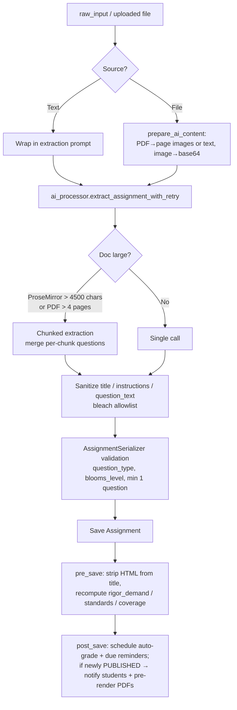
```mermaid
flowchart TD
    A[raw_input / uploaded file] --> B{Source?}
    B -->|Text| C[Wrap in extraction prompt]
    B -->|File| D[prepare_ai_content:<br/>PDF→page images or text, image→base64]
    C & D --> E[ai_processor.extract_assignment_with_retry]
    E --> F{Doc large?}
    F -->|ProseMirror > 4500 chars<br/>or PDF > 4 pages| G[Chunked extraction<br/>merge per-chunk questions]
    F -->|No| H[Single call]
    G & H --> I[Sanitize title / instructions / question_text<br/>bleach allowlist]
    I --> J[AssignmentSerializer validation<br/>question_type, blooms_level, min 1 question]
    J --> K[Save Assignment]
    K --> L[pre_save: strip HTML from title,<br/>recompute rigor_demand / standards / coverage]
    L --> M[post_save: schedule auto-grade + due reminders;<br/>if newly PUBLISHED → notify students + pre-render PDFs]
```

**Chunking thresholds** (`ai_processor/services.py`): `CHUNKED_EXTRACTION_PAGE_THRESHOLD = 4`
pages, `CHUNK_SIZE = 2`, `PROSEMIRROR_CHUNK_THRESHOLD = 4500` characters with a
`PROSEMIRROR_TOKEN_BUDGET_PER_CHUNK = 3000`.

**Sync vs async.** `POST /assignments` runs extraction inline (simple, but ties up a gunicorn
worker for the duration of several LLM calls). `POST /assignments/create-async` returns a
`task_id` immediately and does the same work in `extract_assignment_background_task`. Both exist;
the async variants are the ones wired to `BackgroundProcessingTask` tracking and cancellation.

**Database effects.** `Assignment` row (created first, then updated with extraction output),
`BackgroundProcessingTask`, optionally `BatchUploadSession` + one task per file, plus the credit
rows written by `execute_graded_task`.

**Side effects.** Editing an assignment through the re-extraction path calls
`students/services.py::notify_students_of_assignment_edit`, which emails **every** student who has
already submitted (opt-in `notify_assignment_edited`), because a re-extraction reassigns
`question_number`s and grading links answers to questions by that number alone.

**Cancellation.** `cleanup_cancelled_task_artifacts` deletes the half-built assignment when an
`ASSIGNMENT_EXTRACTION` / `BATCH_ASSIGNMENT_UPLOAD` task is cancelled — but only if it has no
submissions, and it first detaches the tracking rows so the cancellation record survives for
polling. Re-extraction/update tasks are deliberately excluded: they operate on a real,
pre-existing assignment.

---

### 8.4 AI assignment generation (chat)

**Feature.** A teacher describes an assignment in prose; the AI either produces a draft or asks a
clarifying question. Drafts are **not** assignments until explicitly saved.

**Processing** (`assignments/views.py::generate_assignment_from_prompt`)

1. Course ownership check; `AssignmentGenerationSession` fetched (`session_id`) or created.
2. Chat history rebuilt from the last **12** messages, compacted:
   assistant turns are reduced to `{assistant_reply, assignment_draft}` with only a fixed
   whitelist of fields — "compact semantic context, not editor JSON".
3. Course context (name, description, up to 15 topic names) is added to ground the model.
4. **The AI call runs outside the DB transaction.** Only the message writes are transactional —
   the comment states a hanging call would otherwise hold a connection and lock the session rows.
5. `self_assessment` is sanitized once, at this boundary, because it now carries teacher-facing
   HTML.
6. `needs_clarification` is `True` if the model says so **or** if `questions` is empty — an empty
   questions list is always a clarification-shaped response, and treating it otherwise used to
   500 on serializer validation.
7. Otherwise the draft is rendered to standard HTML → ProseMirror text and stored on an
   `ASSISTANT` message with `draft_status = "AI_DRAFT"`.

`POST /assignments/generated-drafts/{message_id}/save` locks the message
(`select_for_update`), refuses anything that isn't an unsaved `AI_DRAFT`, merges the teacher's
overrides (topic/due date/status), re-renders `raw_input`, creates the `Assignment`, and marks the
message `SAVED`. Re-calling it returns the already-created assignment (`200` instead of `201`).

---

### 8.5 Answer upload & extraction

**Actors.** STUDENT (own paper) or TEACHER (batch, on students' behalf).

**Processing** (`students/services.py::upload_answers_engine`)

1. `ai_processor.extract_answer_with_retry` with the assignment's `questions` as context.
2. **Validation at the boundary:** if `answers` is not a list, raise — `StudentSubmission.answers`
   is non-nullable, and before this guard the failure surfaced as a bare `IntegrityError` *after*
   the teacher had already been billed.
3. **Proxy upload** (teacher batch): the model returns `student_name`; the backend matches it
   against `ENROLLED` students in the course by first/last name (`icontains`). No match →
   `CannotAssociateStudentError`.
4. **Attempt limiting** inside `transaction.atomic()` with `select_for_update()`: a student's own
   upload is refused once `attempt_count >= 3`. The lock closes the TOCTOU race where two
   concurrent uploads both pass the check.
5. Existing row → update `answers` and increment `attempt_count`; no row → create with
   `attempt_count = 1` (teacher proxy uploads use `0`) and an explicit `submission_date`
   (needed because the HTML renderer runs before the first save).
6. `raw_input` is built **outside** the lock (CPU-only), `extraction_confidence` persisted, then
   one `cancellable_final_save`.
7. First-time student uploads notify the teacher (`notify_teacher_of_student_submission`,
   opt-in `notify_student_submission`).

**Business rule.** The 3-attempt cap applies only to `is_student_self_upload` — a teacher
re-uploading a paper does not consume the student's attempts.

---

### 8.6 The grading pipeline

This is the most intricate feature in the system. Entry point:
`students/services.py::grade_engine(user, submission, processing_task_id=None)`.

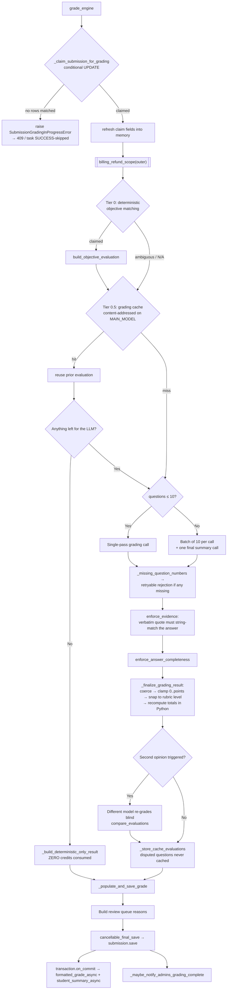
```mermaid
flowchart TD
    S[grade_engine] --> C{_claim_submission_for_grading<br/>conditional UPDATE}
    C -->|no rows matched| X[raise SubmissionGradingInProgressError<br/>→ 409 / task SUCCESS-skipped]
    C -->|claimed| R[refresh claim fields into memory]
    R --> SCOPE[["billing_refund_scope(outer)"]]
    SCOPE --> T0{Tier 0: deterministic<br/>objective matching}
    T0 -->|claimed| EV0[build_objective_evaluation]
    T0 -->|ambiguous / N/A| T05
    EV0 --> T05{Tier 0.5: grading cache<br/>content-addressed on MAIN_MODEL}
    T05 -->|hit| EVC[reuse prior evaluation]
    T05 -->|miss| LLM
    EVC --> ALL{Anything left for the LLM?}
    ALL -->|No| DONLY[_build_deterministic_only_result<br/>ZERO credits consumed]
    ALL -->|Yes| LLM{questions ≤ 10?}
    LLM -->|Yes| SP[Single-pass grading call]
    LLM -->|No| BATCH[Batch of 10 per call<br/>+ one final summary call]
    SP & BATCH --> COMPLETE[_missing_question_numbers →<br/>retryable rejection if any missing]
    COMPLETE --> EVID[enforce_evidence:<br/>verbatim quote must string-match the answer]
    EVID --> ANSC[enforce_answer_completeness]
    ANSC --> FIN[_finalize_grading_result:<br/>coerce → clamp 0..points → snap to rubric level<br/>→ recompute totals in Python]
    FIN --> SO{Second opinion triggered?}
    SO -->|Yes| B2[Different model re-grades blind<br/>compare_evaluations]
    SO -->|No| STORE
    B2 --> STORE[_store_cache_evaluations<br/>disputed questions never cached]
    DONLY & STORE --> PERSIST[_populate_and_save_grade]
    PERSIST --> RQ[Build review queue reasons]
    RQ --> SAVE[cancellable_final_save → submission.save]
    SAVE --> OC["transaction.on_commit → formatted_grade_async + student_summary_async"]
    SAVE --> ADM[_maybe_notify_admins_grading_complete]
```

#### The idempotency claim

`_claim_submission_for_grading` is a **single conditional UPDATE**:

```sql
UPDATE ... SET grading_state='RUNNING', grading_started_at=now
WHERE pk=? AND NOT (grading_state='RUNNING' AND grading_started_at > now - GRADING_CLAIM_STALE_AFTER)
```

Two concurrent claimants serialize on the row lock and exactly one wins — the loser re-evaluates
the `WHERE` against the winner's committed state and matches zero rows. Claimable states: `IDLE`,
`DONE` (a legitimate re-grade), `FAILED`, and a `RUNNING` claim older than
`GRADING_CLAIM_STALE_AFTER` (= `GRADING_TASK_TIME_LIMIT_SECONDS` (25 min) + 5 min).

**Why this exists:** `CELERY_TASK_ACKS_LATE = True` with a Redis broker means Redis redelivers a
task once `visibility_timeout` elapses. `visibility_timeout` is set to **3600 s**, deliberately
well above the 25-minute task hard limit, precisely so a healthy long-running grading task is never
mistaken for a dead one — an earlier 600 s value caused double-billing.

#### Refund scoping

`billing/refunds.py::billing_refund_scope` replaces what would otherwise be a long-lived
`transaction.atomic()` around the whole pipeline. Each `execute_graded_task` call commits its own
charge and registers its `task_id` on a **contextvar**; if the scope's block raises, every
registered id is refunded via `SubscriptionService.refund_credits`. Scopes nest: the inner scope
inside `ai_processor` hands its ids **up** to the outer scope in `_run_grading_pipeline` on
success, so a later failure during persistence still reclaims the AI charges.

The comment is explicit about why the outer scope must cover persistence, not just the AI call:
the `grading_summary` shape guard, confidence coercion, HTML→ProseMirror conversion and the final
`save()` can all raise, and because `FAILED` is a re-claimable state, each retry would charge
again.

#### Arithmetic authority

`_finalize_grading_result` is the **single arithmetic authority**. Model-reported totals are never
used. For each evaluation it:

1. coerces `score_awarded` to a number, floors at 0;
2. clamps to the question's `points`;
3. **snaps to the nearest rubric level** (0 is always a candidate; exact ties resolve *downward* —
   never inflate on a coin-flip), skipping deterministic evaluations and any question whose rubric
   has fewer than 2 distinct point values;
4. normalizes `level_decision` to `borderline`/`clear` — anything unrecognised becomes `clear`, so
   a model that omits the key cannot route every question to a paid second grader;
5. recomputes `total_score`, `max_total_points`, `percentage` and writes a
   `score_calculation_verification` block.

A non-zero snap count is logged at WARNING, because silent correction would hide the model
ignoring the prompt's "discrete scores only" rule.

#### Evidence verification

`ai_processor/evidence.py` string-matches every `evidence_quote` against the student's answer
after canonicalization (HTML stripped both ways, entities unescaped, unicode folded, punctuation
straightened) and a LaTeX-cosmetic desugaring pass. Paraphrases do **not** verify by design. An
evaluation awarding points on a non-empty answer must end with ≥1 verified quote; awarding points
to an empty answer is always a rejection. Mode is `GRADING_EVIDENCE_ENFORCEMENT`
(`strict` → retryable rejection, `log` → record and continue) — flippable in production without a
deploy.

#### Second opinion

`ai_processor/second_opinion.py` selects which questions get a blind re-grade by a **different**
model:

| Trigger | Setting |
| --- | --- |
| low grading confidence | `GRADING_SECOND_OPINION_MIN_CONFIDENCE` (default 80) |
| grader's own `flag_for_review` markers | always |
| high-stakes questions | `GRADING_SECOND_OPINION_HIGH_POINTS` (default 15) |
| `level_decision == "borderline"` | `GRADING_SECOND_OPINION_ON_BORDERLINE` |
| subjective question types | `GRADING_SECOND_OPINION_SUBJECTIVE_TYPES` (ESSAY, SHORT-ANSWER) |
| random QA sample | `GRADING_SECOND_OPINION_SAMPLE_RATE` (default 0.05) |

Excluded from selection: deterministic evaluations, cache-served evaluations, and `not_attempted`
answers. **Grader A's score always stands** — a second opinion can only flag, never change a
number. Agreement finalizes silently; disagreement escalates to the *teacher*, never to a third AI.
The whole step is non-fatal: a failure annotates `result["second_opinion"]["error"]` and the run
succeeds. If every candidate model collides with grader A's actual model, that is logged at
**WARNING** with a machine-readable `skipped_reason`, because it means the review queue's safety
net went dark exactly when grader A was already having trouble.

#### Review queue construction

`_populate_and_save_grade` builds `review_reasons` from **two independent, accumulated** sources
(deliberately not `if/elif` — a submission can have both):

1. `answers_not_found` — a question was graded without the student's answer. **Always `critical`,
   always sorted to the very top.** The comment: scoring it 0 may still be correct, but that is a
   conclusion for a human to reach.
2. `second_opinion.disagreements` — per-question tier + gap fraction. If the second opinion could
   not run for a reason the teacher needs to know (currently: out of credits), a single `moderate`
   entry is recorded so an unverified grade never passes as silently confirmed.

`review_severity` is a **tier-weighted** 0–1 key (`_review_sort_key`): the tier picks the band
(critical 0.67–1.0, moderate 0.33–0.67, borderline 0–0.33) and the point gap orders within it.
Ordering on the raw gap fraction buried genuinely critical disagreements (2+ rubric levels apart at
a small point gap) below milder ones. `review_tier` is denormalized onto its own indexed column
because `review_reasons` is a JSONField and cannot be filtered.

Every grading run **resets** these fields, so a re-grade whose graders now agree clears a stale
flag.

#### Follow-ups

Dispatched via `transaction.on_commit`, not merely after the save — so `formatted_grade_async`
cannot finish first and have its `formatted_grade` write clobbered by this function's own full-row
save. A follow-up dispatch failure is logged and swallowed: the grade is already committed and must
not be un-claimed.

`_maybe_notify_admins_grading_complete` fires once per assignment ever, guarded by an atomic
claim on `admin_grading_notified_at`. A late submitter graded afterwards does not re-trigger it.

---

### 8.7 Credit metering

**Chokepoint.** `ai_processor/services.py::AIProcessor.execute_graded_task`. Every billed AI call
goes through it.

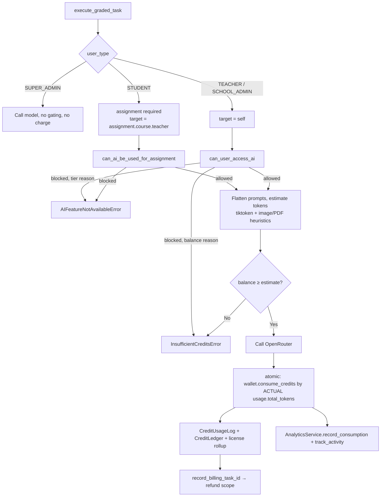
```mermaid
flowchart TD
    A[execute_graded_task] --> B{user_type}
    B -->|SUPER_ADMIN| Z[Call model, no gating, no charge]
    B -->|STUDENT| C[assignment required<br/>target = assignment.course.teacher]
    C --> D[can_ai_be_used_for_assignment]
    B -->|TEACHER / SCHOOL_ADMIN| E[target = self]
    E --> F[can_user_access_ai]
    F -->|blocked, balance reason| G[InsufficientCreditsError]
    F -->|blocked, tier reason| H[AIFeatureNotAvailableError]
    D -->|blocked| H
    D & F -->|allowed| I[Flatten prompts, estimate tokens<br/>tiktoken + image/PDF heuristics]
    I --> J{balance ≥ estimate?}
    J -->|No| G
    J -->|Yes| K[Call OpenRouter]
    K --> L[atomic: wallet.consume_credits by ACTUAL usage.total_tokens]
    L --> M[CreditUsageLog + CreditLedger + license rollup]
    L --> N[AnalyticsService.record_consumption + track_activity]
    M --> O[record_billing_task_id → refund scope]
```

Key rules:

* **Students never pay.** A student-triggered call is billed to, and gated by, the assignment's
  teacher. The access check and the billing-target resolution are one branch, deliberately not two
  separate `if/elif` chains, so they cannot drift apart.
* **Estimate then charge actual.** The pre-call estimate (`estimate_total_token`) is only a
  gate; the ledger records `response.usage.total_tokens`.
* **Consumption order** (`CreditWallet.consume_credits`) is by **type priority**, not expiry:
  `CARRY_OVER → TRIAL → MONTHLY → MANUAL_GRANT → OVERAGE`, with `expires_at` (nulls last) only as
  a secondary tiebreaker. Rationale in the docstring: `CARRY_OVER` and `TRIAL` are one-shot pools
  permanently forfeited at expiry, whereas unused `MONTHLY` gets another chance to roll over;
  draining by soonest expiry would be backwards. `OVERAGE` is always last because it costs money.
* The wallet row is locked with `select_for_update()` and the buckets with `select_for_update()`;
  if the locked scan cannot cover the amount that `total_remaining_credits()` promised (e.g. a
  bucket crossed `expires_at` between the two reads), the whole charge is rolled back rather than
  silently under-charging.
* **License rollup is an explicit call**, not a signal: `CreditUsageLog` rows are written with
  `bulk_create()`, which does not emit `post_save`. `billing/signals.py` is intentionally empty and
  says so.
* **Model fallbacks are restricted** for `grade_assignment` / `extract_answer` /
  `extract_assignment` to `GRADING_FALLBACK_MODELS` — never a nano-tier model, so two students in
  the same class are never graded by models of visibly different capability because of transient
  routing.

---

### 8.8 Individual subscription lifecycle

`POST /subscription/select-plan` is the single entry point. `IndividualPlanChangeService`
(`billing/stripe_service.py`) picks a branch:

| Situation | Branch |
| --- | --- |
| No subscription / no Stripe subscription | Stripe **Checkout session** |
| On a trial | trial-to-paid checkout (`_handle_trial_to_paid`) |
| Same tier, same interval | no-op / reactivation |
| Upgrade, same interval | immediate `Subscription.modify` price swap, or an **upgrade checkout session** when payment is needed |
| Downgrade | **deferred** — `pending_plan` + `pending_change_type=DOWNGRADE` + a Stripe `SubscriptionSchedule` |
| Interval change | deferred (`LATERAL_DEFERRED`) |

Concurrency: `cancel`, `resume`, and `select_plan` all take the **same** Redis lock key
`billing:planchange:{user_id}` (30 s) so a plan change, a cancellation and a resume can never run
concurrently against the same `UserSubscription`.

`SubscriptionService.activate_subscription` is the credit half:

1. Refuse a BETA plan for a non-teacher.
2. Resolve the billing period — preferring Stripe's authoritative `period_start/period_end` when
   the caller has them, so local dates mirror Stripe instead of drifting by webhook latency.
3. Deactivate any existing active subscription; create the new one.
4. **Trial forfeiture** — any live, unprocessed `TRIAL` bucket is expired and ledgered `EXPIRE`,
   so a user converting through a path that bypasses `finalize_trial_to_paid_conversion` cannot
   stack trial credits on top of a paid grant.
5. **Rollover** — the live `MONTHLY` bucket's unused balance is run through
   `compute_capped_rollover` using the **target** plan's rules; a `CARRY_OVER` bucket + `GRANT`
   ledger row are created; the old monthly bucket is expired.
6. Reset `overage_blocks_used`; create the new `MONTHLY` bucket; write the `GRANT` ledger row;
   `queue_sync(user)` for MailerLite.

`compute_capped_rollover` enforces `plan.max_bank` as a ceiling on **live MONTHLY + CARRY_OVER**
only — `OVERAGE` and `MANUAL_GRANT` are exempt. **The monthly grant is never trimmed**; only the
carryover portion is reduced. A `max_bank` lower than the monthly grant is logged as a plan
misconfiguration and carryover is forced to 0. The returned metadata (`requested_rollover`,
`final_rollover`, `max_bank_applied`, `existing_live_carry_over`, `monthly_amount_used`) is merged
into the ledger entry so the decision is fully reconstructable after the fact.

---

### 8.9 School license lifecycle

**Creation** (`LicenseSubscriptionService.create_license_subscription`, super admin only):
validates the plan is `category=LICENSE`, validates/resolves the admin user, sets
`contract_months` (9/10/12), grants the admin a fixed analytics-only allocation
(`is_admin_allocation=True`, excluded from seat counts and from `total_credits_consumed`), and
invites/enrolls the initial teachers.

**Enrollment** (`_get_or_invite_teacher` → `_enroll_teacher_internal`): re-checks the business
email rule, refuses a teacher who already holds an active individual subscription
(`IndividualSubscriptionConflictError`), enforces `max_seats` (`0` = unlimited), and grants the
teacher's monthly allocation — which **can be lower than `plan.monthly_credits`** when capped by
the license's seat/global budget. This is why `get_monthly_credit_ceiling_for_user` uses
`allocation.monthly_allocation` rather than the nominal plan value for the progress-bar baseline.

The `billing/context.py` thread-local `set_license_invitation_context()` is set around invited-user
creation so `users/signals.py` skips the automatic personal trial.

**Consumption window.** `LicenseSubscription.total_credits_consumed` is measured against
`max_seats × plan.monthly_credits`, a *monthly* figure — so it must reset monthly, not per
contract. `consumption_window_start` exists to make that reset idempotent and self-serializing,
because the monthly refresh runs **once per teacher** and a naive reset would fire N times a month
and discard consumption recorded between teachers refreshed on different days.

**Overage — three distinct paths:**

| Path | Model | Settlement |
| --- | --- | --- |
| Stripe Checkout | `LicenseOveragePurchaseIntent` | webhook `checkout.session.completed` → `_handle_license_overage_checkout_completed` grants blocks; teachers no longer active are recorded as *skipped* |
| Off-Stripe request | `LicenseOverageOfflineRequest` | starts `PENDING`, **a human super admin approves/rejects**; approval records the *confirmed* amount (which may differ from the quote) plus payment reference, writes a `LicenseBillingRecord` and a `BillingTransaction` |
| Super-admin comp grant | none (immediate) | `_grant_overage_offline` grants straight away and ledgers `MANUAL_OVERAGE_GRANT` |

Only the ID of the intent/request goes into Stripe metadata — the allocation map can be
arbitrarily large and Stripe caps metadata values at 500 characters. Price is **snapshotted** at
initiation so a plan price change mid-flight cannot grant the wrong amount for what was paid.

**Billing method** is convertible in both directions (`convert-to-stripe` / `convert-to-offline`),
each writing a `LicenseBillingRecord`.

---

### 8.10 Assignment PDF download

**Feature.** Render an assignment to PDF, in a student view (no rubrics) or a teacher view (with
rubrics).

**Why Chromium and not WeasyPrint** (`assignments/pdf_renderer.py` docstring): WeasyPrint has no
math renderer, so `$x = 5$` printed as literal text. Chromium typesets it via **KaTeX vendored
locally** (`assignments/vendor/katex/`), never a CDN — a render therefore never depends on
outbound network access.

**Three layers of protection against the publish stampede:**

1. **Cache** (`pdf_cache.py`) keyed on `assignment.id : view_type : assignment.updated_at`. Putting
   the timestamp *in the key* means there is nothing to invalidate by hand: an edit bumps
   `updated_at` (`auto_now`), which changes the key, so the next request is a natural miss and the
   superseded entry ages out under its TTL (default 24 h). A write path added later without an
   invalidation hook therefore *cannot* serve a stale PDF. Entries over `ASSIGNMENT_PDF_CACHE_MAX_BYTES`
   (5 MB) are not cached at all. Every cache call is wrapped — a backend hiccup degrades to "render
   fresh", never to a failed download.
2. **Single-flight** (`get_or_render`) — per-process, deliberately not cluster-wide (a distributed
   lock's failure modes are worse than the duplicate work it saves). Measured: 30 simultaneous
   requests for one uncached assignment went from 30 renders to 1. Followers wait up to
   `ASSIGNMENT_PDF_SINGLEFLIGHT_TIMEOUT_SECONDS` (60 s) then render for themselves. If the leader's
   render *fails*, waiters get the same error rather than each retrying — the renderer already
   retries internally on a dead browser.
3. **Pre-render on publish** — `prerender_assignment_pdfs` is dispatched by the same `on_commit`
   hook that notifies students, warming both views before anyone asks. It retries (up to 5, 60 s
   apart) **only** on `PDFRendererBusy`; any other failure is logged and dropped, because
   pre-rendering must never compete with real users for render capacity.

**Load shedding.** The renderer bounds concurrent renders and queue depth; past capacity it raises
`PDFRendererBusy`, which the view turns into `503 + Retry-After: 5` rather than parking a worker
thread for the render timeout. The warm Chromium worker recycles itself after
`_max_renders_per_browser()` renders and self-heals a dead browser.

---

### 8.11 Dashboards and the AI chat

Four `ViewSet`s, each pinned to one role, computing aggregates directly (heavy use of `Subquery`,
`Coalesce`, `Count(distinct=True)`).

One recurring correctness pattern is worth naming: several school-level metrics are computed as
**separate grouped aggregates merged in Python** rather than one `annotate()` call, because
combining a `Sum` with multiple joined one-to-many relations in a single query silently inflates
every total via join fan-out — and only `Count(distinct=True)` has an escape hatch for that.

Another: `tokens_unattributed` in the school detail endpoint is computed as a **residual**
(`tokens_total - Σ session tokens`) so the invariant "session tokens + unattributed = total" holds
by construction, regardless of why a given usage log failed to appear in the breakdown.

Token attribution is scoped by `CreditUsageLog.school` — the snapshot taken at consumption time —
**not** by `wallet__user__school`. A teacher who transfers schools must not drag their historical
usage with them, nor vanish from the school they earned it under.

**Custom AI prompt** (`POST .../custom-ai-prompt`) builds a role-appropriate data context, wraps
both the context and the user's question in explicit untrusted-content markers
(`_wrap_dashboard_context_as_untrusted`, `_wrap_dashboard_question_as_untrusted` in
`ai_processor/services.py`), and calls the model through `execute_graded_task` (billed, except for
super admins). History is stored in `ChatSession`/`ChatMessage` with one thread per
(user, assistant_type).

---

## 9. Business Rules

### 9.1 Identity & tenancy

| # | Rule | Enforced in |
| --- | --- | --- |
| B1 | Teacher accounts require a **personal** email; school-admin accounts require a **business** email | `CustomUserSerializer.validate` |
| B2 | A super admin belongs to no school and cannot be converted into a tenant role while still `is_superuser` | same |
| B3 | A personal-email teacher cannot be attached to a school | same |
| B4 | Students cannot rename themselves after registration | same |
| B5 | `user_type` and `school` are writable only by a genuine super admin | `PRIVILEGED_FIELDS` |
| B6 | Two students with the identical full name cannot be enrolled in one course | `StudentCourse.clean()` |
| B7 | A `Session` is owned by exactly one of a teacher (INDIVIDUAL) or a school (SCHOOL), never both | `Session.clean()` + two partial unique constraints |
| B8 | A teacher under an active license cannot create or edit sessions | `CanManageSession` |
| B9 | A teacher with an active individual subscription cannot be enrolled under a license | `IndividualSubscriptionConflictError` |

### 9.2 Assignments & submissions

| # | Rule | Enforced in |
| --- | --- | --- |
| B10 | Students see only `PUBLISHED` assignments | `AssignmentViewSet.get_queryset` |
| B11 | Uploads are only accepted for `PUBLISHED` assignments | `upload_answers`, `upload_answers_async`, `partial_update` |
| B12 | A student may submit at most **3** times per assignment | `upload_answers_engine` (locked) |
| B13 | One submission row per (student, assignment); re-submission updates it | DB unique constraint |
| B14 | A submission is publishable only when it has **both** `graded_at` and a `score` | `publish_grade`, `publish_all_grades` |
| B15 | A manual score override must satisfy `0 ≤ score ≤ max_total_points` | `update_grade` |
| B16 | A manual override **is** the teacher's resolution of a pending review | `update_grade` |
| B17 | Scheduled grading must be in the future **and** after the assignment's due date | `schedule_grade_async` |
| B18 | Bulk grading only ever targets **ungraded** submissions | `grade_all_submission`, `grade_batch_async`, `auto_grade_due_assignment` |
| B19 | The teacher PDF view is available only to the course's own teacher | `download_pdf` |
| B20 | Uploads are capped at **50 MB** per file | `AutoGrader/uploads.py` |

### 9.3 Grading quality

| # | Rule | Enforced in |
| --- | --- | --- |
| B21 | Model-reported totals are never trusted; all arithmetic is recomputed in Python | `_finalize_grading_result` |
| B22 | Scores are clamped to the question's points and snapped to a rubric level; ties resolve downward | same |
| B23 | A response missing any requested question is a **retryable rejection**, not a partial success | `_missing_question_numbers` |
| B24 | Points awarded on a non-empty answer require ≥1 verified verbatim quote; points on an empty answer are always rejected | `evidence.enforce_evidence` |
| B25 | Grader A's score always stands; a second opinion can only flag | `_maybe_run_second_opinion` |
| B26 | A question with a second-opinion disagreement is **never cached** | `_store_cache_evaluations` |
| B27 | Grading a question without the student's answer is **always critical** and sorts to the top of the review queue | `_populate_and_save_grade` |
| B28 | Grading never falls back to a nano-tier model | `execute_graded_task` / `GRADING_FALLBACK_MODELS` |
| B29 | A second-opinion model must differ from grader A's actual model, or the step is skipped and logged at WARNING | `pick_second_model` |

### 9.4 Billing

| # | Rule | Enforced in |
| --- | --- | --- |
| B30 | At most one active `UserSubscription` per user | DB partial unique constraint |
| B31 | Credits are consumed `CARRY_OVER → TRIAL → MONTHLY → MANUAL_GRANT → OVERAGE` | `consume_credits` |
| B32 | `max_bank` caps live MONTHLY+CARRY_OVER only; the monthly grant is never trimmed | `compute_capped_rollover` |
| B33 | Converting to a paid plan forfeits any remaining trial balance | `activate_subscription`, `finalize_trial_to_paid_conversion` |
| B34 | A failed AI pipeline refunds every credit charge it made | `billing_refund_scope` |
| B35 | Only `SUCCEEDED` suppresses a Stripe webhook redelivery; rows are never deleted | `billing/webhooks.py` |
| B36 | Downgrades and interval changes are **deferred** to period end; upgrades apply immediately | `IndividualPlanChangeService._determine_branch` |
| B37 | Overage prices are snapshotted at purchase initiation | `LicenseOveragePurchaseIntent`, `LicenseOverageOfflineRequest` |
| B38 | The last payment method cannot be deleted while a subscription depends on it | `PaymentMethodViewSet.destroy` |
| B39 | A school admin's analytics allocation is excluded from seat counts, plan-change allocation overwrites, and license consumption totals | `is_admin_allocation` |
| B40 | School admins are gated by a fixed feature allowlist, not by a plan tier | `ADMIN_ALLOWED_AI_FEATURES` |
| B41 | A `PlanFeature` with `is_gating_feature=False` never blocks access; a missing catalogue row **denies** by default | `_plan_includes_gating_feature` |
| B42 | Super admins are unmetered and ungated | `execute_graded_task` |

---

## 10. Decision Trees

### 10.1 Request authorization

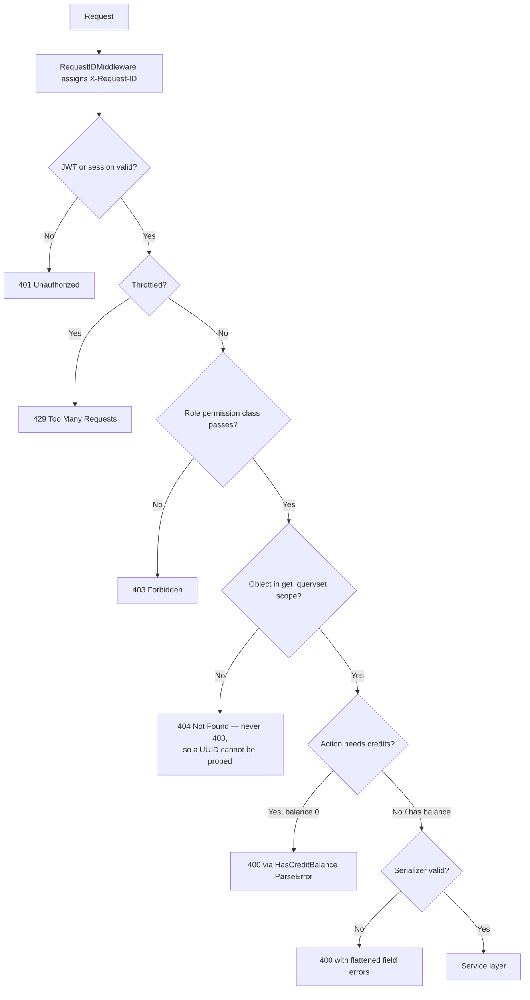
```mermaid
flowchart TD
    A[Request] --> B[RequestIDMiddleware assigns X-Request-ID]
    B --> C{JWT or session valid?}
    C -->|No| D[401 Unauthorized]
    C -->|Yes| E{Throttled?}
    E -->|Yes| F[429 Too Many Requests]
    E -->|No| G{Role permission class passes?}
    G -->|No| H[403 Forbidden]
    G -->|Yes| I{Object in get_queryset scope?}
    I -->|No| J[404 Not Found — never 403,<br/>so a UUID cannot be probed]
    I -->|Yes| K{Action needs credits?}
    K -->|Yes, balance 0| L[400 via HasCreditBalance ParseError]
    K -->|No / has balance| M{Serializer valid?}
    M -->|No| N[400 with flattened field errors]
    M -->|Yes| O[Service layer]
```

### 10.2 Which wallet is charged, and is it allowed?

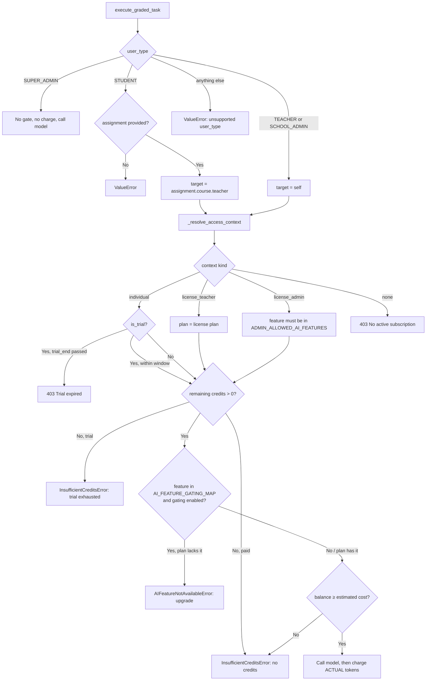
```mermaid
flowchart TD
    A[execute_graded_task] --> B{user_type}
    B -->|SUPER_ADMIN| C[No gate, no charge, call model]
    B -->|STUDENT| D{assignment provided?}
    D -->|No| E[ValueError]
    D -->|Yes| F[target = assignment.course.teacher]
    B -->|TEACHER or SCHOOL_ADMIN| G[target = self]
    B -->|anything else| H[ValueError: unsupported user_type]
    F & G --> I[_resolve_access_context]
    I --> J{context kind}
    J -->|license_teacher| K[plan = license plan]
    J -->|license_admin| L[feature must be in ADMIN_ALLOWED_AI_FEATURES]
    J -->|individual| M{is_trial?}
    J -->|none| N[403 No active subscription]
    M -->|Yes, trial_end passed| O[403 Trial expired]
    M -->|Yes, within window| P
    M -->|No| P{remaining credits > 0?}
    K --> P
    L --> P
    P -->|No, trial| Q[InsufficientCreditsError: trial exhausted]
    P -->|No, paid| R[InsufficientCreditsError: no credits]
    P -->|Yes| S{feature in AI_FEATURE_GATING_MAP<br/>and gating enabled?}
    S -->|Yes, plan lacks it| T[AIFeatureNotAvailableError: upgrade]
    S -->|No / plan has it| U{balance ≥ estimated cost?}
    U -->|No| R
    U -->|Yes| V[Call model, then charge ACTUAL tokens]
```

### 10.3 Stripe webhook claim

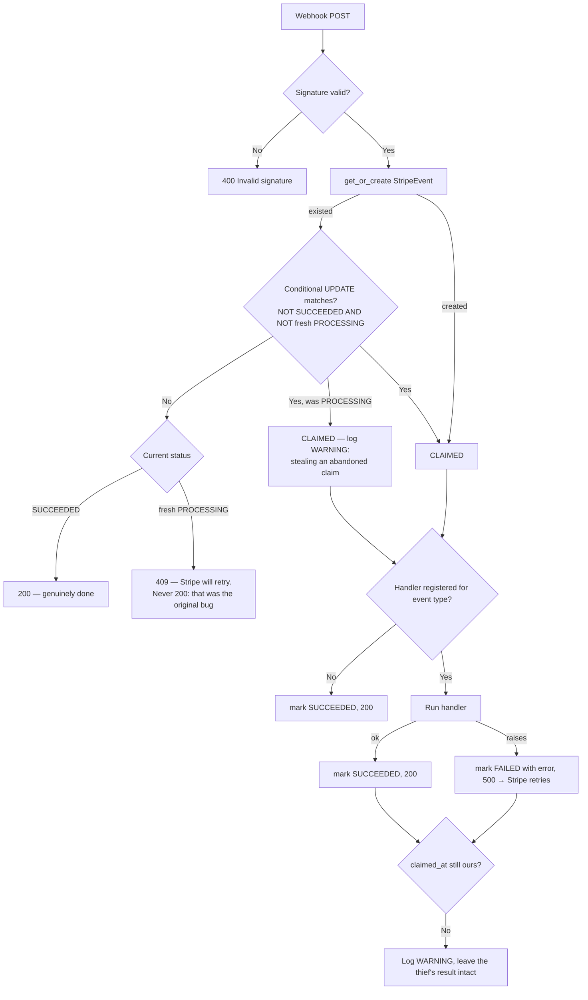
```mermaid
flowchart TD
    A[Webhook POST] --> B{Signature valid?}
    B -->|No| C[400 Invalid signature]
    B -->|Yes| D[get_or_create StripeEvent]
    D -->|created| E[CLAIMED]
    D -->|existed| F{Conditional UPDATE matches?<br/>NOT SUCCEEDED AND NOT fresh PROCESSING}
    F -->|Yes, was PROCESSING| G[CLAIMED — log WARNING:<br/>stealing an abandoned claim]
    F -->|Yes| E
    F -->|No| H{Current status}
    H -->|SUCCEEDED| I[200 — genuinely done]
    H -->|fresh PROCESSING| J[409 — Stripe will retry.<br/>Never 200: that was the original bug]
    E & G --> K{Handler registered for event type?}
    K -->|No| L[mark SUCCEEDED, 200]
    K -->|Yes| M[Run handler]
    M -->|raises| N[mark FAILED with error, 500 → Stripe retries]
    M -->|ok| O[mark SUCCEEDED, 200]
    N & O --> P{claimed_at still ours?}
    P -->|No| Q[Log WARNING, leave the thief's result intact]
```

### 10.4 Grading tier selection per question

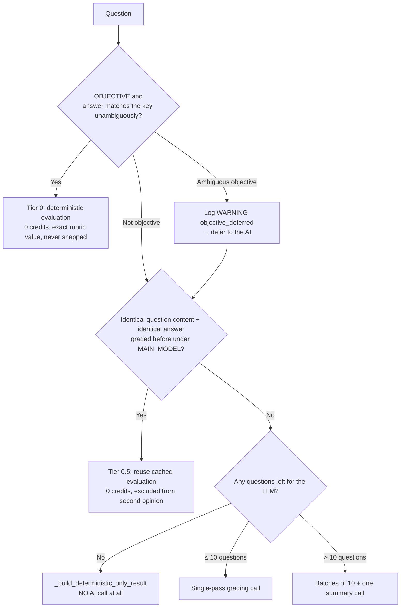
```mermaid
flowchart TD
    A[Question] --> B{OBJECTIVE and<br/>answer matches the key unambiguously?}
    B -->|Yes| C[Tier 0: deterministic evaluation<br/>0 credits, exact rubric value, never snapped]
    B -->|Ambiguous objective| D[Log WARNING objective_deferred<br/>→ defer to the AI]
    B -->|Not objective| E
    D --> E{Identical question content + identical answer<br/>graded before under MAIN_MODEL?}
    E -->|Yes| F[Tier 0.5: reuse cached evaluation<br/>0 credits, excluded from second opinion]
    E -->|No| G{Any questions left for the LLM?}
    G -->|No| H[_build_deterministic_only_result<br/>NO AI call at all]
    G -->|≤ 10 questions| I[Single-pass grading call]
    G -->|> 10 questions| J[Batches of 10 + one summary call]
```

### 10.5 Individual plan change

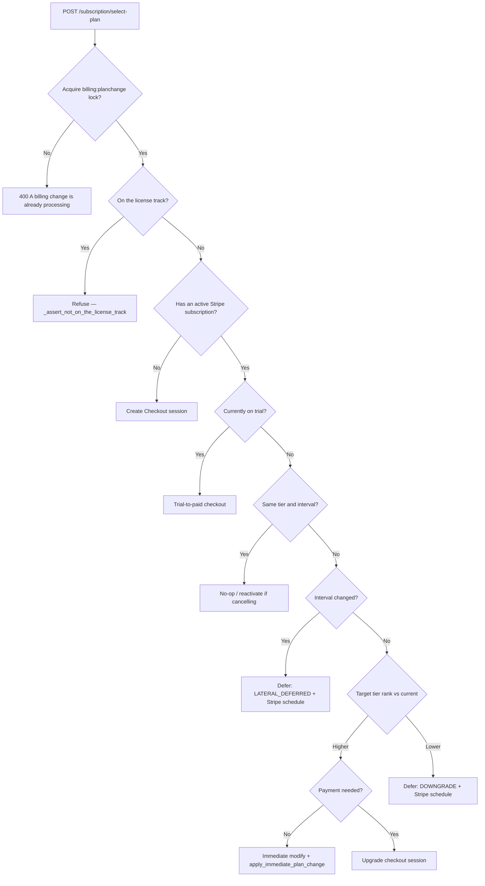
```mermaid
flowchart TD
    A[POST /subscription/select-plan] --> B{Acquire billing:planchange lock?}
    B -->|No| C[400 A billing change is already processing]
    B -->|Yes| D{On the license track?}
    D -->|Yes| E[Refuse — _assert_not_on_the_license_track]
    D -->|No| F{Has an active Stripe subscription?}
    F -->|No| G[Create Checkout session]
    F -->|Yes| H{Currently on trial?}
    H -->|Yes| I[Trial-to-paid checkout]
    H -->|No| J{Same tier and interval?}
    J -->|Yes| K[No-op / reactivate if cancelling]
    J -->|No| L{Interval changed?}
    L -->|Yes| M[Defer: LATERAL_DEFERRED + Stripe schedule]
    L -->|No| N{Target tier rank vs current}
    N -->|Higher| O{Payment needed?}
    O -->|No| P[Immediate modify + apply_immediate_plan_change]
    O -->|Yes| Q[Upgrade checkout session]
    N -->|Lower| R[Defer: DOWNGRADE + Stripe schedule]
```

### 10.6 Review-queue routing

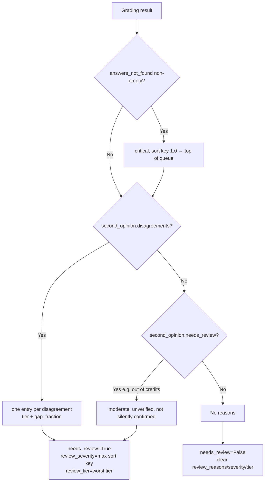
```mermaid
flowchart TD
    A[Grading result] --> B{answers_not_found non-empty?}
    B -->|Yes| C[critical, sort key 1.0 → top of queue]
    B -->|No| D
    C --> D{second_opinion.disagreements?}
    D -->|Yes| E[one entry per disagreement<br/>tier + gap_fraction]
    D -->|No| F{second_opinion.needs_review?}
    F -->|Yes e.g. out of credits| G[moderate: unverified, not silently confirmed]
    F -->|No| H
    E & G --> I[needs_review=True<br/>review_severity=max sort key<br/>review_tier=worst tier]
    H[No reasons] --> J[needs_review=False<br/>clear review_reasons/severity/tier]
```

---

## 11. Workflow Diagrams

### 11.1 Student invitation → first graded submission

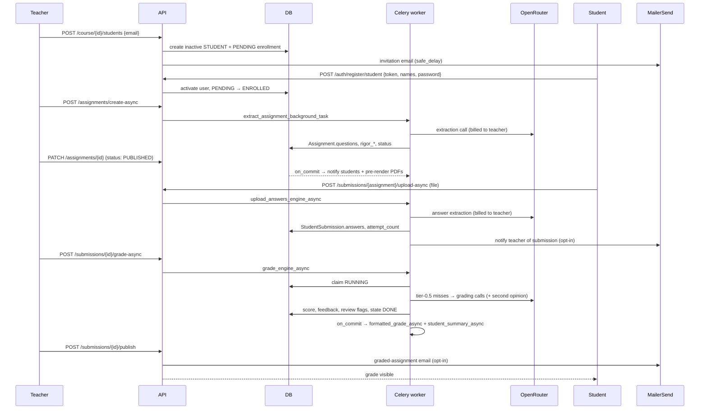
```mermaid
sequenceDiagram
    participant T as Teacher
    participant API
    participant DB
    participant W as Celery worker
    participant AI as OpenRouter
    participant S as Student
    participant M as MailerSend

    T->>API: POST /course/{id}/students {email}
    API->>DB: create inactive STUDENT + PENDING enrollment
    API->>M: invitation email (safe_delay)
    S->>API: POST /auth/register/student {token, names, password}
    API->>DB: activate user, PENDING → ENROLLED
    T->>API: POST /assignments/create-async
    API->>W: extract_assignment_background_task
    W->>AI: extraction call (billed to teacher)
    W->>DB: Assignment.questions, rigor_*, status
    T->>API: PATCH /assignments/{id} {status: PUBLISHED}
    DB-->>W: on_commit → notify students + pre-render PDFs
    S->>API: POST /submissions/{assignment}/upload-async (file)
    API->>W: upload_answers_engine_async
    W->>AI: answer extraction (billed to teacher)
    W->>DB: StudentSubmission.answers, attempt_count
    W->>M: notify teacher of submission (opt-in)
    T->>API: POST /submissions/{id}/grade-async
    API->>W: grade_engine_async
    W->>DB: claim RUNNING
    W->>AI: tier-0.5 misses → grading calls (+ second opinion)
    W->>DB: score, feedback, review flags, state DONE
    W->>W: on_commit → formatted_grade_async + student_summary_async
    T->>API: POST /submissions/{id}/publish
    API->>M: graded-assignment email (opt-in)
    API-->>S: grade visible
```

### 11.2 Batch upload

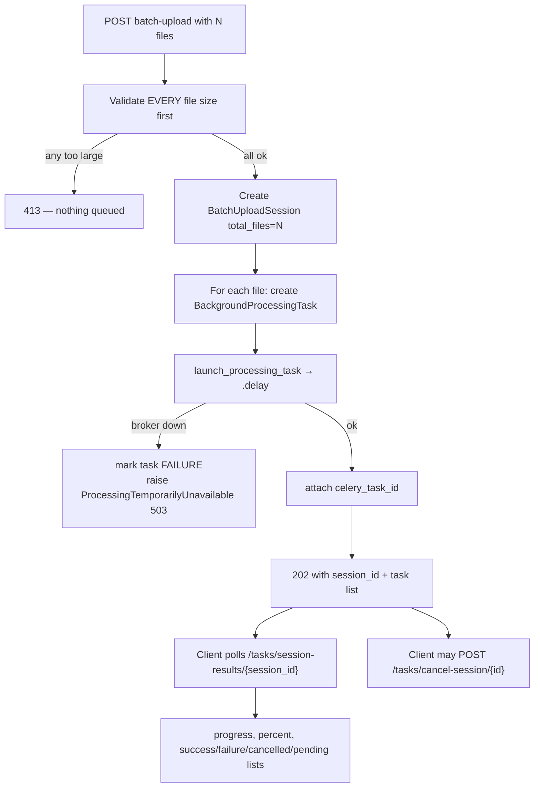
```mermaid
flowchart TD
    A[POST batch-upload with N files] --> B[Validate EVERY file size first]
    B -->|any too large| C[413 — nothing queued]
    B -->|all ok| D[Create BatchUploadSession total_files=N]
    D --> E[For each file: create BackgroundProcessingTask]
    E --> F[launch_processing_task → .delay]
    F -->|broker down| G[mark task FAILURE<br/>raise ProcessingTemporarilyUnavailable 503]
    F -->|ok| H[attach celery_task_id]
    H --> I[202 with session_id + task list]
    I --> J["Client polls /tasks/session-results/{session_id}"]
    J --> K[progress, percent, success/failure/cancelled/pending lists]
    I --> L["Client may POST /tasks/cancel-session/{id}"]
```

### 11.3 Stripe subscription renewal

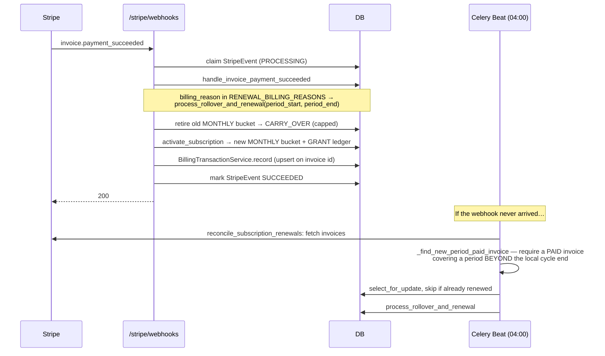
```mermaid
sequenceDiagram
    participant ST as Stripe
    participant WH as /stripe/webhooks
    participant DB
    participant Beat as Celery Beat (04:00)

    ST->>WH: invoice.payment_succeeded
    WH->>DB: claim StripeEvent (PROCESSING)
    WH->>DB: handle_invoice_payment_succeeded
    Note over WH,DB: billing_reason in RENEWAL_BILLING_REASONS →<br/>process_rollover_and_renewal(period_start, period_end)
    WH->>DB: retire old MONTHLY bucket → CARRY_OVER (capped)
    WH->>DB: activate_subscription → new MONTHLY bucket + GRANT ledger
    WH->>DB: BillingTransactionService.record (upsert on invoice id)
    WH->>DB: mark StripeEvent SUCCEEDED
    WH-->>ST: 200

    Note over Beat: If the webhook never arrived…
    Beat->>ST: reconcile_subscription_renewals: fetch invoices
    Beat->>Beat: _find_new_period_paid_invoice — require a PAID invoice<br/>covering a period BEYOND the local cycle end
    Beat->>DB: select_for_update, skip if already renewed
    Beat->>DB: process_rollover_and_renewal
```

The `_find_new_period_paid_invoice` guard exists because the **previous** cycle's invoice is also
`paid` — renewing off it would advance the cycle without Stripe having billed a new one.

### 11.4 License offline overage approval

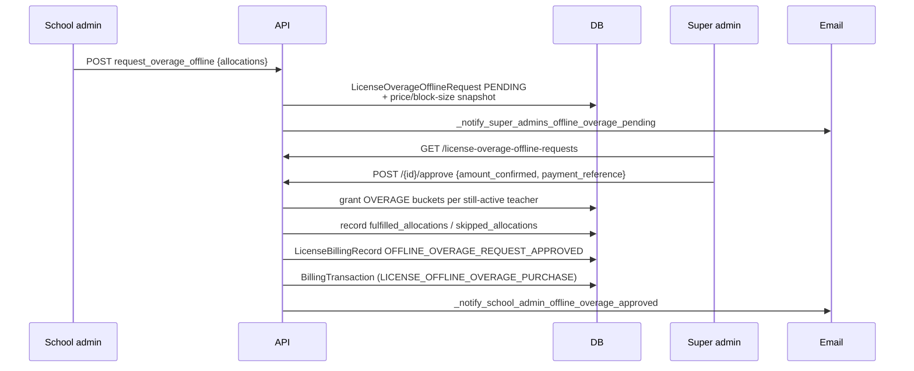
```mermaid
sequenceDiagram
    participant SA as School admin
    participant API
    participant DB
    participant SUP as Super admin
    participant M as Email

    SA->>API: POST request_overage_offline {allocations}
    API->>DB: LicenseOverageOfflineRequest PENDING<br/>+ price/block-size snapshot
    API->>M: _notify_super_admins_offline_overage_pending
    SUP->>API: GET /license-overage-offline-requests
    SUP->>API: POST /{id}/approve {amount_confirmed, payment_reference}
    API->>DB: grant OVERAGE buckets per still-active teacher
    API->>DB: record fulfilled_allocations / skipped_allocations
    API->>DB: LicenseBillingRecord OFFLINE_OVERAGE_REQUEST_APPROVED
    API->>DB: BillingTransaction (LICENSE_OFFLINE_OVERAGE_PURCHASE)
    API->>M: _notify_school_admin_offline_overage_approved
```

### 11.5 Task cancellation

```mermaid
flowchart TD
    A["POST /tasks/cancel/{celery_task_id}"] --> B{Task belongs to caller?}
    B -->|No| C[404 Tracked task not found]
    B -->|Yes| D{Already terminal?}
    D -->|Yes| E[Report the REAL final status,<br/>do not claim cancellation succeeded]
    D -->|No| F[select_for_update → status=CANCELLED,<br/>cancel_requested_at, finished_at]
    F --> G[cleanup_cancelled_task_artifacts]
    G -->|extraction/upload task<br/>with no submissions| H[Detach tracking rows, delete the Assignment]
    G -->|re-extraction task| I[Leave the pre-existing assignment intact]
    F --> J[AsyncResult.revoke terminate SIGTERM<br/>+ app.control.revoke]
    J --> K[Worker: next ensure_task_not_cancelled raises TaskCancelledError]
    K --> L[cancellable_final_save re-checks under a row lock<br/>so a late save cannot race the cancel]
```

---

## 12. State Machines

### 12.1 `Assignment.status`

```mermaid
stateDiagram-v2
    [*] --> DRAFT: create / create-async
    DRAFT --> PUBLISHED: PATCH status
    PUBLISHED --> UNPUBLISHED: PATCH status
    UNPUBLISHED --> PUBLISHED: PATCH status
    DRAFT --> UNPUBLISHED: PATCH status
    PUBLISHED --> [*]: delete
```

There is **no transition guard** — any teacher-owned assignment can move between any two states via
`PATCH`. What differs by state:

| State | Visible to students | Accepts submissions | Due reminders scheduled | New-assignment email |
| --- | --- | --- | --- | --- |
| `DRAFT` | No | No | No | No |
| `PUBLISHED` | Yes | Yes | Yes (24 h, 1 h) | On entry, once per transition |
| `UNPUBLISHED` | No | No | No (tasks deleted) | No |

Entering `PUBLISHED` (from creation or from another state) triggers, on commit:
`send_new_assignment_posted_notification` + `prerender_assignment_pdfs`.

### 12.2 `StudentSubmission.grading_state`

```mermaid
stateDiagram-v2
    [*] --> IDLE: submission created
    IDLE --> RUNNING: claim acquired
    RUNNING --> DONE: _populate_and_save_grade
    RUNNING --> FAILED: any exception (_mark_grading_claim_failed)
    DONE --> RUNNING: re-grade (DONE is claimable)
    FAILED --> RUNNING: retry (FAILED is claimable)
    RUNNING --> RUNNING: stale claim stolen after 30 min
```

| Transition | Trigger | Who | DB effects | Side effects |
| --- | --- | --- | --- | --- |
| `IDLE/DONE/FAILED → RUNNING` | `grade_engine` | teacher, scheduled task, or auto-grade | conditional UPDATE sets `grading_state`, `grading_started_at` | none |
| `RUNNING → RUNNING` (steal) | claim older than 35 min | another worker | same UPDATE | the original worker is provably dead (task hard-limit is 25 min) |
| `RUNNING → DONE` | grading succeeded | worker | score, percentage, `feedback`, `graded_at`, review fields, `raw_input` | `formatted_grade_async`, `student_summary_async`, possible admin "grading complete" email |
| `RUNNING → FAILED` | any exception | worker | `grading_state=FAILED` + cache sweep | refund of every charge in the scope |
| *(blocked)* | claim held & fresh | second request/redelivery | none | `409` on the sync endpoint; the async task finishes **SUCCESS with `skipped: true`** so Celery does not retry and the user is not shown an error for a run that is in fact happening |

### 12.3 Submission review & publication

```mermaid
stateDiagram-v2
    [*] --> Ungraded
    Ungraded --> Graded_OK: grading, no review reasons
    Ungraded --> Graded_NeedsReview: answers_not_found or grader disagreement
    Graded_NeedsReview --> Graded_OK: mark-reviewed (resolution "confirmed")
    Graded_NeedsReview --> Graded_Overridden: update-grade (resolution "overridden")
    Graded_OK --> Graded_Overridden: update-grade
    Graded_OK --> Published: publish / publish-all-grades
    Graded_Overridden --> Published: publish
    Graded_NeedsReview --> Published: publish (NOT blocked by needs_review)
    Published --> Published: update-grade → re-notifies the student
```

> **Note:** `needs_review` does **not** block publication. A teacher can publish a submission the
> system has flagged as needing review. Reasoning not evident from code: the implementation
> permits it, but no comment or guard states whether that is intended.

### 12.4 `StudentCourse.enrollment_status`

```mermaid
stateDiagram-v2
    [*] --> PENDING: invited (inactive account)
    [*] --> ENROLLED: added by name, or an already-active student
    PENDING --> ENROLLED: student completes registration
    ENROLLED --> WITHDRAWN: withdrawn()
    WITHDRAWN --> ENROLLED: reactivate()
    ENROLLED --> COMPLETED: (choice exists; no code path sets it)
```

`COMPLETED` is defined in `EnrollmentStatusType` but **nothing in the codebase assigns it**.
The default manager excludes only `WITHDRAWN`.

### 12.5 `UserSubscription`

```mermaid
stateDiagram-v2
    [*] --> Trial: signup (activate_automatic_free_trial)
    [*] --> Beta: signup when USE_BETA_PLAN_ON_SIGNUP
    Trial --> Active: checkout (finalize_trial_to_paid_conversion) — trial balance forfeited
    Trial --> Expired: trial_end passed OR credits exhausted (expire_active_trials, every 6 h)
    Active --> Active: renewal (invoice.payment_succeeded → rollover + new grant)
    Active --> PendingChange: select-plan downgrade / interval change (pending_plan + Stripe schedule)
    PendingChange --> Active: change applied at period end
    PendingChange --> Active: cancel_scheduled_plan_change
    Active --> Cancelling: POST /subscription/cancel (auto_renew=False, cancelled_at set)
    Cancelling --> Active: POST /subscription/resume
    Cancelling --> Inactive: customer.subscription.deleted
    Active --> PastDue: invoice.payment_failed
    PastDue --> Active: payment recovered
    PastDue --> Inactive: Stripe gives up
```

`is_active` is the local flag; `stripe_status` mirrors Stripe's own
(`TRIALING/ACTIVE/PAST_DUE/CANCELED/INCOMPLETE/UNPAID`). `auto_renew` is the operative
cancellation flag — `cancelled_at` is purely informational but is the only record of *when* the
cancellation was requested.

### 12.6 `StripeEvent`

```mermaid
stateDiagram-v2
    [*] --> PROCESSING: first delivery claims it
    PROCESSING --> SUCCEEDED: handler returned (fenced on claimed_at)
    PROCESSING --> FAILED: handler raised
    FAILED --> PROCESSING: Stripe retry re-claims it
    PROCESSING --> PROCESSING: stale claim (>100s+5min) stolen — logged WARNING
    SUCCEEDED --> SUCCEEDED: redelivery answered 200, handler NOT re-run
```

**Invalid by construction:** `SUCCEEDED → anything else`, and any terminal write by a request whose
claim was stolen (the `claimed_at=claim_token` fence rejects it, leaving the current owner's
result intact).

### 12.7 `BackgroundProcessingTask.status`

```mermaid
stateDiagram-v2
    [*] --> PENDING: create_processing_task
    PENDING --> STARTED: worker picks it up
    PENDING --> FAILURE: broker unavailable at dispatch
    STARTED --> SUCCESS
    STARTED --> FAILURE
    PENDING --> CANCELLED: user cancels
    STARTED --> CANCELLED: user cancels
```

Terminal statuses (`SUCCESS`, `FAILURE`, `CANCELLED`) are sticky: `update_processing_task` refuses
a status change out of a terminal state (it will still merge `meta`).
`normalize_processing_task_status` reconciles a non-terminal row against Celery's own
`AsyncResult.state` on read, so a worker killed without writing a terminal row is still reported
correctly.

### 12.8 `LicenseOverageOfflineRequest`

```mermaid
stateDiagram-v2
    [*] --> PENDING: school admin requests (price snapshotted)
    PENDING --> APPROVED: super admin confirms payment
    PENDING --> REJECTED: super admin rejects with a reason
```

Only a super admin can leave `PENDING`. Approval grants only to **still-active** teachers; the
rest are recorded in `skipped_allocations`.

---

## 13. Background Jobs & Scheduled Processes

### 13.1 Dispatch mechanics

There are **three** distinct dispatch paths, and the difference between them is deliberate
(`AutoGrader/dispatch.py`):

| Path | Used for | Broker-outage behaviour |
| --- | --- | --- |
| `safe_delay(task, ...)` | side effects whose loss must never break the caller's own work — notification emails, MailerLite syncs | Catches `RedisConnectionError`, `RedisTimeoutError`, kombu `OperationalError`, `ConnectionError`, `TimeoutError`; logs and returns `None`. Any *other* exception still propagates (a bug in how the call was built is not an outage) |
| `launch_processing_task(task, processing_task, ...)` | user-initiated processing (grading, uploads, extraction) | Marks the `BackgroundProcessingTask` FAILURE and raises `ProcessingTemporarilyUnavailable` → **HTTP 503** with a plain message, not a 500 with a raw connection traceback |
| bare `.delay()` | internal fan-out inside tasks, some email sends | propagates |

Both resilient paths share the same `BROKER_UNAVAILABLE_ERRORS` tuple so "what counts as a broker
outage" cannot drift between the silent and the loud path.

### 13.2 Celery configuration

| Setting | Value | Why |
| --- | --- | --- |
| broker / result backend | Redis (per-environment URL) | |
| `CELERY_TASK_ACKS_LATE` | `True` | a killed worker's task is redelivered |
| `CELERY_WORKER_PREFETCH_MULTIPLIER` | `1` | long tasks; no hoarding |
| `visibility_timeout` | **3600 s** | must exceed the 25-min grading hard limit, or Redis redelivers a *still-running* grading task to a second worker and double-bills the teacher |
| `CELERY_RESULT_EXPIRES` | 3600 s | which is why `LiveQARun` and `BackgroundProcessingTask` exist as durable records |
| `CELERY_BROKER_CONNECTION_RETRY_ON_STARTUP` | `True` | worker/beat surviving a Redis restart |
| scheduler | `django_celery_beat.schedulers:DatabaseScheduler` | one-off `ClockedSchedule` tasks are created at runtime |

### 13.3 Scheduled (Beat) jobs

| Schedule | Task | What it does | Failure handling |
| --- | --- | --- | --- |
| every 60 s | `dashboard.tasks.record_concurrent_users` | writes a `ConcurrentUserSnapshot` from the Redis `online_users_set` | logged |
| `*/15 min` | `AutoGrader.beat_health.check_beat_health` | compares every `BEAT_HEALTH_EXPECTATIONS` entry against `PeriodicTask.last_run_at`; logs overdue tasks | this is itself the watchdog; `/health/beat` reads its `last_run_at` |
| hourly (`:15`) | `billing.tasks.sweep_stale_stripe_events` | settles `PROCESSING` claims abandoned by killed workers; raises ERROR for `FAILED` rows nearing the end of Stripe's ~3-day retry window. **Never re-runs handlers** | `max_retries=0` |
| 00:00 | `billing.tasks.process_license_renewals` | for `auto_renew=False`: deactivate + cancel at period end. For `auto_renew=True`: verify a **paid invoice covering a new period** before renewing; locks the row and skips if already renewed | per-license try/except; counters in the summary |
| 01:00 | `billing.tasks.nightly_stripe_live_qa` | real-Stripe QA suite; **no-op unless `ENABLE_STRIPE_LIVE_QA` and `sk_test_` keys** | `max_retries=0` |
| 01:30 | `ai_processor.tasks.nightly_grading_benchmark_replay` | replays **recorded** model responses through the real pipeline and diffs against the committed baseline — free, deterministic, and the only scheduled check that catches a regression in *our* grading code (there is no CI in this repo) | stale recordings → WARNING + skip, not a regression |
| 02:00 | `billing.tasks.process_annual_plan_credit_grants` | monthly credit refresh for ANNUAL-interval plans (billed yearly, credited monthly) | per-row |
| 03:00 | `billing.tasks.process_license_monthly_credit_refreshes` | per-teacher monthly refresh under a license; resets `total_credits_consumed` idempotently via `consumption_window_start` | per-row |
| 03:00 weekly (`GRADING_BENCHMARK_DAY_OF_WEEK`) | `ai_processor.tasks.weekly_grading_benchmark_live` | grades the fixed dataset against the **live** model — the only check that can detect the provider changing behaviour. Off unless `ENABLE_AI_LIVE_QA` | `max_retries=0` |
| 04:00 | `billing.tasks.reconcile_subscription_renewals` | fallback for a missed `invoice.payment_succeeded`; same new-period invoice guard | per-row |
| 05:00 | `billing.tasks.cleanup_expired_credit_buckets` | formalizes physically-expired buckets in the ledger via `expire_bucket()` | `max_retries=0` |
| every 6 h | `billing.tasks.expire_active_trials` | expires trials by **time or credit exhaustion**; atomic per trial, continues past a bad row | per-trial |
| daily `AT_RISK_ALERT_HOUR` | `dashboard.tasks.send_at_risk_student_alerts` | writes a `SchoolAtRiskSnapshot` for **every** school with an active admin (regardless of opt-in), then alerts only on students who **newly** crossed the threshold | per-school |
| daily `TEACHER_INACTIVITY_ALERT_HOUR` | `dashboard.tasks.send_teacher_inactivity_alerts` | one alert per inactivity episode; teachers who joined more recently than the threshold are skipped | per-school |
| weekly (`WEEKLY_COURSE_SUMMARY_*`) | `dashboard.tasks.send_weekly_course_summaries` / `send_weekly_student_summaries` / `send_weekly_school_admin_summaries` | AI-narrated digests | per-recipient |

**Idempotency notes.** `send_at_risk_student_alerts` uses `StudentRiskAlertState` to detect the
false→true transition; a school with zero opted-in admins still gets a snapshot but no alert-state
bookkeeping, so if an admin opts in later the next run treats the whole current at-risk set as
"newly at-risk" and sends a one-time catch-up — **documented as intentional**.
`send_teacher_inactivity_alerts` uses `TeacherInactivityAlertState`; recovering activity clears the
flag so a future episode re-alerts.

### 13.4 On-demand tasks

| Task | Triggered by | Retry / limits |
| --- | --- | --- |
| `assignments.tasks.grade_engine_async` | grade-async, grade-all, auto-grade, scheduled grading | `soft_time_limit = 25 min − 60 s`, `time_limit = 25 min`. Soft limit fires first so the normal failure path (mark failed, release the claim, refund) runs before SIGKILL |
| `assignments.tasks.grade_batch_async` | scheduled grade-all | `max_retries=3`; fans out one `grade_engine_async` per ungraded submission |
| `assignments.tasks.auto_grade_due_assignment` | one-off `ClockedSchedule` at `due_date` | returns a string on error rather than raising |
| `assignments.tasks.extract_assignment_background_task` / `update_assignment_background_task` | create-async / update-async | tracked, cancellable |
| `assignments.tasks.upload_assignment_async` | batch assignment upload | `max_retries=3`, `soft_time_limit=1800`, `time_limit=2100` |
| `assignments.tasks.upload_answers_engine_async` | student/teacher answer upload | `max_retries=3`, `soft_time_limit=2700`, `time_limit=3000` |
| `assignments.tasks.formatted_grade_async` / `format_grade` | after grading, after an override, on demand | `_reconcile_formatted_grade_numbers` **forces the LLM restatement's numbers to agree with the stored grade** — the overall score sentence is rebuilt deterministically and each per-question max is overwritten from the stored feedback |
| `assignments.tasks.send_assignment_due_reminder` | one-off clocked tasks at due − 24 h and due − 1 h | re-checks `PUBLISHED` + `due_date` at run time; excludes students who already submitted and `@student.local` addresses |
| `assignments.tasks.send_new_assignment_posted_notification` | publish transition | opt-in `notify_new_assignment_posted` |
| `assignments.tasks.prerender_assignment_pdfs` | publish transition | `max_retries=5`, 60 s delay — **retries only on `PDFRendererBusy`** |
| `classrooms.tasks.student_summary_async` | student-summary endpoint, and after every grading run | re-raises |
| `users.tasks.sync_user_to_mailerlite` | activation, registration completion, billing changes | `max_retries=3`, 60 s delay |
| `AutoGrader.tasks.send_email_task` | everything | `max_retries=3`, 30 s delay; falls back from a MailerSend template send to plain `send_mail` when a plain body exists, then retries with backoff |
| `billing.tasks.run_live_qa_console_job` | QA console | writes results to `LiveQARun` |
| `assignments.tasks.grade_all_submissions` | **nothing** — legacy, kept only because a `PeriodicTask` row could still reference it by dotted path | |

### 13.5 Task lifecycle & cancellation

```mermaid
flowchart LR
    A[create_processing_task<br/>PENDING] --> B[launch_processing_task]
    B -->|broker down| F1[FAILURE + 503]
    B --> C[attach celery_task_id]
    C --> D[mark_processing_task_started<br/>STARTED]
    D --> E{ensure_task_not_cancelled<br/>at each step}
    E -->|cancelled| G[TaskCancelledError → CANCELLED<br/>+ artifact cleanup]
    E -->|ok| H[work]
    H --> I[cancellable_final_save<br/>locks the task row, re-checks, then saves]
    I --> J[mark_processing_task_success<br/>SUCCESS]
    H -->|exception| K[mark_processing_task_failure<br/>FAILURE + user-safe message]
```

`cancellable_final_save` closes the specific race where a worker checks for cancellation, the user
cancels, and the worker then commits anyway using stale in-memory data: the final write happens
inside `transaction.atomic()` while holding `select_for_update()` on the task row and re-checking
the status.

---

## 14. External Integrations

### 14.1 OpenRouter (LLM inference) — **synchronous**

| Aspect | Detail |
| --- | --- |
| Client | `openai.OpenAI(base_url="https://openrouter.ai/api/v1", api_key=OPENROUTER_API_KEY)` |
| Auth | bearer API key from env; `HTTP-Referer` and `X-Title: GradeA+` headers sent |
| Primary model | `MAIN_MODEL = "x-ai/grok-4.3"` |
| Fallbacks | `DEFAULT_FALLBACK_MODELS = ["deepseek/deepseek-v4-pro", "openai/gpt-5.4-nano"]`; **grading/extraction restricted to `GRADING_FALLBACK_MODELS = ["deepseek/deepseek-v4-pro"]`** |
| Determinism | `temperature=0.0` everywhere |
| Output contract | `response_format` is a strict `json_schema` where a schema exists (`grading_schemas.py`, `extraction_schemas.py`), else `json_object` |
| Sent | prompt text from `ai_processor/*.txt`, base64 images, PDF bytes, question/answer JSON |
| Received | JSON completions + `usage.total_tokens` (used for billing) |
| Retries | per-feature `*_with_retry` wrappers (typically `max_retries=3`), plus retryable rejections from completeness/evidence checks |
| Timeout | SDK default; the Celery task's `soft_time_limit` is the real bound |
| DB impact | `CreditUsageLog`, `CreditLedger`, license rollup, `BetaProfile` counters, plus whatever the feature persists |

**Prompt-injection posture.** Untrusted content is explicitly fenced before it reaches a prompt:
`_wrap_fetched_content_as_untrusted` (tool-fetched web content),
`_wrap_student_answers_as_untrusted`, `_wrap_dashboard_context_as_untrusted`,
`_wrap_dashboard_question_as_untrusted`. Tool-calling is bounded by `MAX_TOOL_CALL_ROUNDS = 3`.

### 14.2 Stripe — **both directions**

Outbound (synchronous, inside request handlers and tasks): Customers, Checkout Sessions,
SetupIntents, Subscriptions (`modify`, `retrieve`), SubscriptionSchedules, Prices, Invoices,
Refunds, Billing Portal sessions, Test Clocks (QA only).

Inbound (asynchronous): nine webhook event types.

```mermaid
sequenceDiagram
    participant S as Stripe
    participant W as webhooks.py
    participant DB
    participant H as StripeWebhookHandler

    S->>W: POST (signed)
    W->>W: construct_event(payload, sig, STRIPE_WEBHOOK_SECRET)
    W->>DB: _claim_stripe_event (conditional UPDATE, NOT in a transaction)
    Note over W,DB: the claim must be committed and its lock released<br/>BEFORE the handler makes outbound Stripe calls
    W->>H: dispatch via _EVENT_HANDLERS
    H->>DB: mutate subscriptions / grant credits / record BillingTransaction
    H->>S: (some handlers call back out: Refund.create, Subscription.modify)
    W->>DB: _finish_stripe_event fenced on claimed_at
    W-->>S: 200 / 409 / 500
```

| Event | Handler | Effect |
| --- | --- | --- |
| `checkout.session.completed` | `handle_checkout_completed` | routes on metadata: individual subscribe, upgrade, trial→paid, license create, license convert-to-stripe, individual overage, license overage |
| `invoice.payment_succeeded` | `handle_invoice_payment_succeeded` | renewal → rollover + new grant; records a `BillingTransaction` keyed on the invoice id |
| `invoice.payment_failed` | `handle_invoice_payment_failed` | `stripe_status = PAST_DUE`, records the failure |
| `customer.subscription.updated` | `handle_subscription_updated` | syncs status, cancellation intent (`_sync_cancellation_intent`), plan/period |
| `customer.subscription.deleted` | `handle_subscription_deleted` | deactivates locally |
| `charge.refunded` | `handle_charge_refunded` | updates `refunded_amount_cents` / status |
| `payment_intent.succeeded` / `.payment_failed` | | overage and one-off payments |
| `setup_intent.succeeded` | | attaches/sets the default payment method |

**Retry/timeout behaviour.** Stripe retries any non-2xx for ~3 days (`STRIPE_RETRY_WINDOW`). The
endpoint answers `409` for in-flight work rather than `200`, because answering 200 for unfinished
work is exactly the bug that used to lose billing events permanently. gunicorn's `--timeout 100`
is mirrored in `WEBHOOK_REQUEST_HARD_TIMEOUT_SECONDS`, and
`STRIPE_EVENT_CLAIM_STALE_AFTER = 100 s + 5 min` is *derived* from it — a comment in both the
Dockerfile and `webhooks.py` says to raise them together.

### 14.3 MailerSend (transactional email, via Anymail) — **asynchronous**

`EMAIL_BACKEND = "anymail.backends.mailersend.EmailBackend"`,
`DEFAULT_FROM_EMAIL = "Grade A+ <support@gradeautomator.com>"`, token from `MAILSEND_API_KEY`.
Almost every send goes through `AutoGrader.tasks.send_email_task`. Two send styles coexist:
Django templates rendered to HTML (`templates/email/*.html`) and MailerSend **template ids** with
`merge_data` (e.g. `ynrw7gy0ye2l2k8e` for activation, `yzkq340r0n04d796` for course
notifications). A templated send that fails falls back to plain `send_mail` when a plain body
exists; otherwise it raises and the task retries.

`AuthViewSet.request_change_password` is the one place email is sent **synchronously** with
`send_mail(fail_silently=False)`.

### 14.4 MailerLite (marketing lists) — **asynchronous**

`users/mailerlite_service.py`. `queue_sync(user)` is a **no-op until the account is active**, so
billing paths that run during signup (trial/beta activation) cannot push an unverified signup into
MailerLite. Group ids are configured per role
(`MAILERLITE_GROUP_ID_TEACHER/STUDENT/SCHOOL_ADMIN`). `sync_user_to_mailerlite` retries 3× at 60 s.
`sync_teachers_under_license_to_mailerlite` re-syncs a whole license's teachers when its state
changes.

### 14.5 Cloudinary — **synchronous**

`django-cloudinary-storage` backs `MEDIA` — profile images and the benchmark archive
(`ai_processor/benchmark/archive.py`). Cloudinary errors are classified as infrastructure errors in
`AutoGrader/error_messages.py::_infra_error_categories` so they surface as a user-safe message
rather than a raw exception.

### 14.6 Google OAuth 2.0 — **synchronous**

Server-side authorization-code exchange against `https://oauth2.googleapis.com/token`, then
`google.oauth2.id_token.verify_oauth2_token` against `GOOGLE_OAUTH_CLIENT_ID`. Requires
`email_verified`. The email is **lowercased** before lookup (a mixed-case Google address otherwise
missed the lookup, fell into the create branch, and died on the unique constraint). Access/refresh
tokens are stored encrypted in `UserGoogleCredentials`. A Google account on a *business* domain is
rejected with a bespoke message pointing the user at their school admin's invitation, rather than a
raw serializer error dict.

### 14.7 Sentry — **asynchronous, optional**

Initialized only when `SENTRY_DSN` is set **and** `ENVIRONMENT in ("prod", "dev")`, with
`traces_sample_rate` from env (default 0.05). Every request is tagged with `request_id`. The import
is guarded — an uninstalled or uninitialized SDK must be a no-op, never a startup error.

### 14.8 Chromium / Playwright — **local subprocess**

A warm headless Chromium worker thread (`assignments/pdf_renderer.py`) with KaTeX vendored locally.
Bounded concurrency and queue depth; recycles after N renders; self-heals a dead browser; sheds
load with `PDFRendererBusy` → `503 + Retry-After`.

---

## 15. Notifications & Side Effects

### 15.1 Email inventory

All are opt-in via the corresponding `Settings` flag, **all of which default to `False`**.

| Email | Recipient | Setting flag | Trigger |
| --- | --- | --- | --- |
| Account activation (OTP) | new user | — (always) | registration |
| Password reset code | user | — | `POST /auth/otp` |
| Password change code | user | — | `POST /auth/request-change-password` (synchronous) |
| Course invitation / "you've been added" | student | — | enrollment |
| Invite-link renewal | student **and** teacher | — | `POST /course/renew-student-token` |
| Removed from course | student | — | `DELETE /course/{id}/student/{sid}` |
| School-admin invitation | new school admin | — | `POST /schools/create_with_admin`, license creation |
| License teacher invitation | teacher | — | license enrollment |
| New assignment posted | enrolled students | `notify_new_assignment_posted` | assignment enters PUBLISHED |
| Assignment due reminder (24 h, 1 h) | teacher + students **who have not submitted** | `notify_assignment_due_reminder` | clocked tasks |
| Assignment edited after submission | students who already submitted | `notify_assignment_edited` | AI re-extraction of an assignment |
| New student submission | teacher | `notify_student_submission` | student's first upload |
| Assignment graded / grade updated | student | `notify_grading_complete` | publish, or an override of an already-published grade |
| Grading complete for an assignment | school admins | `notify_grading_complete` | last submission graded — **once per assignment ever** |
| Weekly course / student / school-admin summary | teacher / student / school admin | `notify_weekly_summary` | weekly Beat jobs |
| At-risk student alert | school admins | `notify_at_risk_student_alerts` | daily, on a false→true transition |
| Teacher inactivity alert | school admins | `notify_teacher_activity_alerts` | daily, once per episode |
| Teacher first-course milestone | school admins | `notify_teacher_activity_alerts` | teacher's first-ever `Course` |
| Offline overage: pending / approved / rejected | super admins / school admin | — | offline overage lifecycle |
| Manual credit grant | recipient | — | `POST /admin/credits/grant` |

Every notification send is individually wrapped in `try/except` + `logger.exception` — a mail
failure never fails the operation that triggered it.

### 15.2 Cache invalidation as a side effect

Redis (`django-redis`) is the cache. `UserCacheMixin` caches list/retrieve payloads per user for
`CACHE_TTL` (5 min) under keys like `{model}s:user_id__{id}:query__{md5}`.

Invalidation is by **wildcard `delete_pattern` sweeps** fired from `post_save`/`post_delete`
receivers in `users/signals.py`, `classrooms/signals.py`, `assignments/signals.py`,
`students/signals.py`. Every sweep is guarded with `hasattr(cache, "delete_pattern")` so a
non-Redis backend degrades gracefully.

Because several write paths deliberately bypass `post_save` (`queryset.update()` for atomic
claims, `bulk_create`), those paths call `delete_cache_patterns(...)` **explicitly**:

* `publish_grade` and `mark_reviewed` (conditional-UPDATE claims),
* `publish_all_grades` (bulk update — also calls the signal handler directly for the batch),
* `_mark_grading_claim_failed` (otherwise a failed submission keeps serving a cached `RUNNING`).

Conversely, `StudentSubmissionViewSet.retrieve` uses `queryset.update()` for its lazy `raw_input`
backfill **specifically to avoid** `post_save` — a teacher paging through submissions was
otherwise recalculating course final grades and flushing deployment-wide caches on every GET.

### 15.3 Other side effects

| Side effect | Where |
| --- | --- |
| `UserActivity` row + Redis `online_users_set` membership + `active_user:*` heartbeat (300 s TTL) | `UserActivityMiddleware`, on **every** authenticated request |
| `CreditWallet.get_or_create` | same middleware (a second safety net beside the signal) |
| `StudentCourse.final_grade` recomputed as a points-weighted average, under `select_for_update()` | `classrooms/signals.py`, on submission save **and delete** |
| `BetaProfile` counters, `conversion_probability`, distinct-login-day tracking | `AnalyticsService.record_consumption` / `track_activity` |
| Django-celery-beat `PeriodicTask` + `ClockedSchedule` rows created/deleted | assignment signals, scheduled-grading endpoints |
| MailerLite sync | activation, registration completion, subscription changes, license changes |
| Sentry tag `request_id` | every request |

---

## 16. Error Handling

### 16.1 Strategy

Three layers, in order:

1. **DRF exception handler** (`users/exceptions.py::custom_exception_handler`) — logs every API
   exception with view/path/method/user, lets DRF translate known exceptions, and marks the
   response `_drf_handled`. Anything DRF cannot handle becomes a bare `500` carrying `_raw_exc`.
2. **Renderer** (`users/renderers.py::APIJSONRenderer`) — wraps the payload in the envelope. For
   handled errors it flattens field errors into one sentence and preserves the structured dict
   under `error.field_errors`. For an unhandled 500 it substitutes
   `describe_user_error(exc, ...)` and includes a traceback **only when `DEBUG`**.
3. **User-safe message classifier** (`AutoGrader/error_messages.py`) — a small allowlist of
   *user-authored* exception types passes through verbatim
   (`CannotAssociateStudentError`, `AIFeatureNotAvailableError`, `InsufficientCreditsError`,
   `IndividualSubscriptionConflictError`); everything else is replaced by an operation-specific
   fallback sentence. Infrastructure exceptions (requests, Cloudinary, OpenAI, pdf2image, PIL) are
   categorized separately so an outage reads as an outage.

Django's own `handler400/403/404/500` are overridden by `AutoGrader/handlers.py` so even
non-DRF errors return JSON.

### 16.2 Status-code contract

| Condition | Status | Shape |
| --- | --- | --- |
| Validation failure | `400` | `{success:false, message:"Field: msg", error:{field_errors:{...}}}` |
| Zero credit balance (permission gate) | `400` | `HasCreditBalance` raises `ParseError` |
| Not authenticated / bad token | `401` | |
| Insufficient credits (AI generation) | `402` | `{"error": "..."}` |
| Wrong role, ownership violation, plan/tier gate | `403` | |
| Out of scope or non-existent | `404` | scoping produces 404, never 403, so ids cannot be probed |
| Method disabled (e.g. creating `Settings`) | `405` | |
| Partial batch success | `207` | `{successful, failed, summary}` |
| Upload too large | `413` | `PayloadTooLarge` |
| Grading already in flight | `409` | |
| Stripe event in flight | `409` | plain text |
| Throttled | `429` | |
| Broker unavailable | `503` | `ProcessingTemporarilyUnavailable` |
| PDF renderer at capacity | `503` + `Retry-After: 5` | |
| Health degraded | `503` | `{status:"degraded", checks:{...}}` |
| Unhandled | `500` | plain-language message; traceback only in DEBUG |

### 16.3 Failure semantics by subsystem

| Failure | Behaviour |
| --- | --- |
| **AI call fails mid-pipeline** | `billing_refund_scope` refunds every charge made inside the scope; `grading_state → FAILED` (re-claimable); the tracked task is marked FAILURE with a user-safe message |
| **AI returns an incomplete/unverifiable response** | Retryable rejection (`GradingCompletenessError`, `GradingEvidenceError`) — both subclass `ValueError` so existing retry handlers behave unchanged, but they can be *counted* separately (previously indistinguishable from "malformed JSON") |
| **Second opinion fails** | Non-fatal: annotates `result["second_opinion"]["error"]`, run succeeds. Only cancellation propagates |
| **Refund itself fails** | Logged with "manual reconciliation required"; never masks the original exception |
| **Stripe handler raises** | `StripeEvent → FAILED`, `500` returned, Stripe retries; the row stays claimable |
| **Worker killed mid-task** | `acks_late` redelivers; the grading claim / Stripe claim staleness windows are both derived from the relevant hard kill point so a stale claim is provably abandoned |
| **Broker unreachable** | Loud (`503`) for user-initiated processing; silent for side effects |
| **Email send fails** | Template send falls back to plain; then retries 3× at 30 s; then logged and dropped |
| **Cache backend error** | PDF cache degrades to "render fresh"; `delete_pattern` sweeps are `hasattr`-guarded |
| **Database `IntegrityError` on upload** | Pre-empted by explicit boundary validation of the extractor's `answers` list, so the failure is legible and refundable |

---

## 17. Data Flow

### 17.1 Canonical write path

```text
Client
  │  Authorization: Bearer <access>, X-Request-ID (optional)
  ▼
RequestIDMiddleware            → correlation id set on contextvar + Sentry tag
UserActivityMiddleware         → UserActivity row, Redis heartbeat, wallet ensure
  ▼
DRF Router → ViewSet
  ▼
Throttle (anon scopes) → Permission class (role) → get_queryset() (tenancy)
  ▼
Serializer.validate()          → field + cross-field business rules
  ▼
Service layer (*/services.py)  → transactions, locks, claims
  ├──► PostgreSQL              (models, constraints, signals)
  ├──► Redis cache             (read-through, pattern invalidation)
  ├──► Redis broker            (safe_delay | launch_processing_task)
  └──► External API            (OpenRouter / Stripe), billed via execute_graded_task
  ▼
APIJSONRenderer                → {success, message, data|error}
  ▼
Client  (+ X-Request-ID echoed)
```

### 17.2 Grading data flow

```text
StudentSubmission.answers (JSON)  +  Assignment.questions (JSON)
        │
        ├─► Tier 0   objective_grading.match_objective_answer  ── exact, 0 credits
        ├─► Tier 0.5 grading_cache (content hash + MAIN_MODEL) ── reuse, 0 credits
        └─► Tier 1   LLM  (single pass ≤10 q, else batches of 10 + a summary call)
                    │
                    ├─ completeness check  → retry on missing questions
                    ├─ evidence check      → verbatim quote must string-match
                    ├─ answer completeness → status inference / blank verification
                    ├─ _finalize_grading_result → clamp, snap, recompute totals
                    └─ second opinion (selective, different model, blind)
        ▼
grading dict {grading_summary, question_evaluations, second_opinion, answers_not_found, ...}
        ▼
_populate_and_save_grade
        ├─ score / ai_score / max_points / score_percentage
        ├─ feedback (the whole dict)  ── this JSON is the durable record
        ├─ needs_review / review_reasons / review_severity / review_tier
        ├─ raw_input  ← student_submission_to_html → ProseMirror text
        └─ grading_state = DONE
        ▼
post_save → classrooms.signals._recalculate_final_grade (locked, weighted)
on_commit → formatted_grade_async, student_summary_async
        ▼
publish → notify_student_of_graded_submission
```

### 17.3 Credit data flow

```text
execute_graded_task
  ├─ estimate (tiktoken + image/PDF heuristics)  → gate only
  ├─ OpenRouter call → usage.total_tokens        → the real charge
  └─ atomic:
       CreditWallet.consume_credits(amount)
         ├─ SELECT FOR UPDATE wallet
         ├─ SELECT FOR UPDATE buckets ORDER BY type_priority, expires_at NULLS LAST, created_at
         ├─ per bucket: used_credits += min(remaining, needed)
         ├─ bulk_create CreditUsageLog  (feature, task_type, task_id, course, school-snapshot)
         ├─ bulk_create CreditLedger    (CONSUME, negative amount, metadata)
         └─ _record_license_consumption → LicenseSubscription.total_credits_consumed  (explicit F() update)
       AnalyticsService.record_consumption / track_activity → BetaProfile
  └─ record_billing_task_id(task_id) → innermost billing_refund_scope
```

Refund is the mirror image: `SubscriptionService.refund_credits(task_id)` decrements
`used_credits` on the original buckets, writes `REFUND` ledger rows, marks
`CreditUsageLog.is_refunded`, and reverses the license rollup.

---

## 18. Permissions Matrix

Legend: **✓** allowed · **✗** denied · **own** own records only · **school** own school only ·
**SA** super admin only.

### 18.1 Core resources

| Feature | Student | Teacher | School admin | Super admin |
| --- | --- | --- | --- | --- |
| School — create / update / delete | ✗ | ✗ | ✗ | ✓ (delete = soft) |
| School — list / retrieve | ✗ | ✗ | ✗ | ✓ |
| School — monthly token usage | ✗ | ✗ | ✓ school | ✓ any (`?school_id=`) |
| Session — create/update/delete | ✗ | ✓ own INDIVIDUAL, **✗ if under a license** | ✓ own school's SCHOOL sessions | ✓ (SCHOOL only) |
| Session — read | ✓ enrolled | ✓ own / school's | ✓ school | ✓ all |
| Course — create/update/delete | ✗ | ✓ own | ✗ | ✗ |
| Course — read | ✓ enrolled | ✓ own | ✗ | ✗ |
| Enroll / bulk-add / remove students | ✗ | ✓ own courses | ✗ | ✗ |
| Topic — create/read/update/delete | read only | ✓ own courses | ✗ | ✗ |
| Assignment — create/update/delete | ✗ | ✓ own courses | ✗ | ✗ |
| Assignment — read | ✓ PUBLISHED, enrolled | ✓ own | ✗ | ✗ |
| Assignment — download student PDF | ✓ PUBLISHED only | ✓ | ✗ | ✗ |
| Assignment — download **teacher** PDF | ✗ | ✓ course owner only | ✗ | ✗ |
| Assignment — AI generate / save draft | ✗ | ✓ own courses | ✗ | ✗ |
| Submission — upload own | ✓ (+credits, max 3) | ✗ | ✗ | ✗ |
| Submission — batch upload | ✗ | ✓ (+credits) | ✗ | ✗ |
| Submission — read | ✓ own, non-draft | ✓ own courses | ✗ | ✗ |
| Submission — grade / grade-all / schedule | ✗ | ✓ (+credits) | ✗ | ✗ |
| Submission — override grade | ✗ | ✓ (+credits) | ✗ | ✗ |
| Submission — publish / mark-reviewed | ✗ | ✓ | ✗ | ✗ |
| Submission — delete | ✗ | ✓ | ✗ | ✗ |
| User — list / create / delete | ✗ | ✗ | ✗ | ✓ |
| User — retrieve | own | own + own students | own + school | ✓ all |
| User — update | own | own only | own only | ✓ any |
| Settings — read/update | own | own | own | ✓ any |
| Beta whitelist / waitlist | ✗ | ✗ | ✗ | ✓ |
| Background task status / cancel | own | own | own | own |

### 18.2 Billing

| Feature | Student | Teacher | School admin | Super admin |
| --- | --- | --- | --- | --- |
| `/subscription/me`, wallet, buckets, ledger, usage logs | ✗ | ✓ own | ✓ own | ✓ own |
| Select plan / cancel / resume / purchase overage (individual) | ✗ | ✓ own | ✓ own | ✓ own |
| Payment methods (list/add/default/delete/portal) | ✗ | ✓ own | ✓ own | ✓ own |
| Invoices (`BillingTransaction`) | ✗ | ✓ own | ✓ own + school | ✓ all |
| Subscription plans — read | ✗ | ✓ | ✓ | ✓ |
| Subscription plans — write / create custom license plan | ✗ | ✗ | ✗ | ✓ |
| License — list / retrieve | ✗ | ✗ | ✓ school | ✓ all |
| License — create | ✗ | ✗ | ✗ | ✓ |
| License — add / remove teachers | ✗ | ✗ | ✓ school | ✓ |
| License — purchase overage (Stripe) / setup payment method | ✗ | ✗ | ✓ school | ✓ |
| License — change plan / seats / cancel / renew offline / convert / grant overage | ✗ | ✗ | ✗ | ✓ |
| License — `active`, `renewal_info`, `billing-history` | ✗ | ✗ | ✗ | ✓ |
| Offline overage requests — approve / reject | ✗ | ✗ | ✗ | ✓ |
| Manual credit grants | ✗ | ✗ | ✗ | ✓ |
| School credit allocations (read) | ✗ | ✓ own | ✓ school | ✓ all |
| Beta analytics / charts / profiles | ✗ | ✗ | ✗ | ✓ |
| QA console / time travel | ✗ | ✗ | ✗ | ✓ (env-gated) |

### 18.3 Dashboards & AI features

| Feature | Student | Teacher | School admin | Super admin |
| --- | --- | --- | --- | --- |
| Student dashboard | ✓ own | ✗ | ✗ | ✗ |
| Teacher dashboard | ✗ | ✓ own | ✗ | ✗ |
| School admin dashboard | ✗ | ✗ | ✓ school | ✗ |
| Super admin dashboard | ✗ | ✗ | ✗ | ✓ |
| Custom AI prompt | ✗ | ✓ billed | ✓ billed, **allowlisted features only** | ✓ unmetered |
| AI assignment generation | ✗ | ✓ if the plan includes `AI_PROMPT_ASSIGNMENT_CREATION` | ✗ | ✓ |
| AI student summary | ✗ | ✓ billed | ✗ | ✓ |
| Weekly course summary (AI) | ✗ | ✓ if the plan includes `AI_PROMPT_ANALYTICS_SUMMARY` | ✓ (allowlisted) | ✓ |
| Grading / extraction | ✗ (billed to teacher) | ✓ baseline, any paid tier | ✗ | ✓ |

**Feature gating detail.** Only `"Assignment Generation"` and `"Weekly Course Summary"` are in
`AI_FEATURE_GATING_MAP`. Everything else (grading, assignment extraction, answer extraction,
formatted grade, student summary) is **baseline** — available to any active user with credits. A
gate is only enforced if its `PlanFeature.is_gating_feature` is `True`; a missing catalogue row
**denies** by default.

---

## 19. Technical Decisions

Each entry separates **observed implementation** (what the code does, with its stated reason where
one is recorded in a comment or docstring) from **interpretation** (this document's reading).

### D1 — Conditional UPDATE as a distributed claim

**Observed.** The same idiom appears three times: `_claim_submission_for_grading`,
`_claim_stripe_event`, and the "publish exactly once" / "mark-reviewed exactly once" claims in
`students/views.py`. A single UPDATE whose returned row count *is* the result; two claimants
serialize on the row lock and the loser matches zero rows. Every staleness window is *derived*
from the relevant hard kill point (Celery `time_limit` for grading, gunicorn `--timeout` for
webhooks) plus a margin, so a stale claim is provably abandoned rather than merely slow.

**Interpretation.** This is the load-bearing correctness pattern of the whole system. It replaces
what would otherwise be either a distributed lock (with its own expiry failure modes) or a
long-lived transaction across network I/O. The derivation of staleness windows from kill points —
rather than picking a round number — is what makes the "provably abandoned" claim actually true.

### D2 — Refund scope instead of a transaction around AI calls

**Observed.** `billing_refund_scope` uses a `contextvars.ContextVar` list of committed charge ids,
refunding them if the block raises. The docstring states the alternative it replaced:
`@transaction.atomic` around a multi-call pipeline, which held the wallet row locked (via
`consume_credits`' `select_for_update`) across every network call.

**Interpretation.** Same user-visible outcome (no charge for a failed run), no lock or transaction
held across network I/O. A `ContextVar` rather than instance state on the module-level
`ai_processor` singleton is the correct choice — that singleton is process-wide and shared by
threads. Scope nesting (inner hands ids up to outer on success) is what makes "refund the whole
logical operation" work across module boundaries.

### D3 — Timestamped cache keys instead of invalidation hooks

**Observed.** `assignments/pdf_cache.py` keys on `assignment.updated_at`;
`ai_processor/grading_cache.py` uses content addressing. Both docstrings state the same reason: a
future write path added without a matching invalidation hook *cannot* serve a stale result.

**Interpretation.** This trades storage (superseded entries linger until TTL) for a correctness
property that survives future code changes. Given that `updated_at` is `auto_now`, every write
path gets it for free.

### D4 — Business logic in services, not models or signals

**Observed.** Models carry field-level invariants (`clean()`), simple derived properties, and one
significant exception — `CreditWallet.consume_credits` / `compute_capped_rollover`, which are
substantial business logic on the model. Everything else lives in `*/services.py`.
`billing/signals.py` is **deliberately empty**, with a comment explaining that a `post_save`
receiver on `CreditUsageLog` never fired because `consume_credits` uses `bulk_create`, and
instructing: *"do not reintroduce a signal for billing-critical accounting; explicit calls can't
be silently skipped by a bulk write."*

**Interpretation.** The rule appears to be "signals for cache invalidation and scheduling
side effects; explicit calls for anything that touches money." The credit logic living on
`CreditWallet` is defensible — it is inseparable from the row-locking it performs.

### D5 — Denormalization where a JSON re-parse would be an N+1

**Observed.** `Assignment.rigor_demand/rigor_standards/rigor_blooms_coverage`,
`StudentSubmission.review_tier`/`review_severity`, `BillingTransaction.school`,
`CreditUsageLog.school`. Each carries a comment naming what it avoids: re-parsing questions JSON
per request for the school roll-up; filtering a JSONField (impossible in django-filter);
surviving the license row changing; historically accurate school attribution after a transfer.

**Interpretation.** All four are justified. The `CreditUsageLog.school` snapshot in particular is
a *semantic* decision, not a performance one — it changes what the number means.

### D6 — Tiered grading (deterministic → cache → LLM)

**Observed.** Tier 0 is claim-only: an ambiguous objective is deferred to the AI, never zeroed, so
the partition can only remove LLM error, never add any. Tier 0.5 is content-addressed on
`MAIN_MODEL` (not on whichever model fallback routing actually served the call) so a fallback event
does not fragment the cache. When every question is claimed, **no AI call is made and no credits
are consumed at all**.

**Interpretation.** Cost reduction and consistency in one mechanism. The "claim-only" framing is
what makes tier 0 safe to enable by default.

### D7 — Never trust the model's arithmetic, and cite-or-lose

**Observed.** `_finalize_grading_result` recomputes everything in Python; `evidence.py` requires a
string-matching verbatim quote; `_missing_question_numbers` makes an incomplete response
retryable; snapping is logged at WARNING when it fires.

**Interpretation.** Evidence verification is described in its own docstring as "the cheapest
possible second opinion, costing zero extra model calls" — an accurate description. Logging silent
corrections is what keeps prompt-adherence drift visible instead of invisible.

### D8 — Selective, blind, advisory second opinion

**Observed.** Triggered per-question, graded by a different model with a prompt containing only
questions and answers, and **it can only flag** — grader A's score always stands. Disagreement
escalates to a human, never to a third AI.

**Interpretation.** Escalating to a third model would be cheaper but would produce a majority vote
with no ground truth. Routing to a human is the only step that can produce labelled data, and
`review_reasons` records the resolution (`confirmed` / `overridden`) explicitly for that purpose.

### D9 — Environment-flippable enforcement

**Observed.** `GRADING_EVIDENCE_ENFORCEMENT`, `GRADING_SECOND_OPINION_*`,
`GRADING_DETERMINISTIC_OBJECTIVE`, `GRADING_ANSWER_CACHE_ENABLED`, `ASSIGNMENT_PDF_CACHE_*`,
`ENABLE_AI_LIVE_QA`, `ENABLE_STRIPE_LIVE_QA` all read from env with today's values as defaults.
The settings comment calls the evidence flag "the single most useful operational lever for a
grading pipeline still building up a track record."

**Interpretation.** Correct for a system whose quality gates are still being calibrated.

### D10 — Anonymous-only throttling, with one authenticated exception

**Observed.** `UserRateThrottle` is deliberately not enabled; the sole authenticated bucket is
`custom_ai_prompt`, shared across all four dashboard chat endpoints so a multi-role user cannot
multiply their budget.

**Interpretation.** The reasoning given (chatty authenticated dashboards; the real threats are
unauthenticated) is sound, and the one exception is exactly where it should be — an authenticated,
per-call-billed LLM endpoint.

### D11 — Scoping via `get_queryset()` rather than object permissions

**Observed.** Almost all tenancy is enforced by `get_queryset()` filters. Custom `@action`s that
would otherwise bypass it explicitly call `get_object_or_404(self.get_queryset(), ...)` — with
comments naming the bypass they close.

**Interpretation.** Produces `404` rather than `403` for out-of-scope ids, which prevents UUID
probing. The trade-off is that every new `@action` must remember to route through the queryset;
the comments suggest this was learned the hard way.

### D12 — Two webhook endpoints, one dispatch table

**Observed.** `stripe_webhook` (full payload) and `thin_webhook` (notification → `Event.retrieve`)
share `_EVENT_HANDLERS` and `_record_and_dispatch`. The comment: the table used to be duplicated
inline in both, so a new event type had to be wired twice or silently no-op'd on one.

### D13 — Beat as the CI substitute

**Observed.** `ai_processor/tasks.py` states plainly: *"There is no CI in this repo, so Celery Beat
is the only scheduler available. If CI is ever added, the nightly replay belongs there instead."*

**Interpretation.** An explicit, documented compromise rather than an accident.

---

## 20. Architectural Observations

*(This section is interpretation, clearly separated from the observed behaviour documented above.)*

1. **The codebase is unusually well commented at decision points.** Most non-obvious lines carry a
   comment explaining the bug that motivated them. That is what made a documentation pass of this
   depth possible without running the system. It is also the codebase's main defence against
   regression, given there is no CI.

2. **Correctness effort is concentrated where money and grades are.** Grading and billing carry
   claims, fencing tokens, refund scoping, arithmetic re-derivation and idempotency ledgers. The
   dashboards and classroom CRUD are comparatively plain. This is proportionate.

3. **The service layer is inconsistently factored.** `billing` has a clean service layer
   (`SubscriptionService`, `LicenseSubscriptionService`, `Stripe*Service`,
   `BillingTransactionService`). `dashboard/views.py` is 4,173 lines with substantial aggregation
   logic inline in view methods, only partly extracted into `dashboard/services.py`. `students` and
   `assignments` sit in between.

4. **Sync and async variants of the same operation both exist and diverge.**
   `POST /assignments` vs `/assignments/create-async`, `/submissions/{id}/grade` vs `/grade-async`,
   `/submissions/{a}/upload` vs `/upload-async`. Only the async variants are wired to
   `BackgroundProcessingTask` tracking and cancellation. Two code paths for one operation is twice
   the surface for a business rule to drift.

5. **Caching is coarse.** Read-through per-user caching with wildcard `delete_pattern`
   invalidation means almost any write flushes almost everything (`clear_course_cache` alone
   sweeps 11 patterns). Correct, but the hit rate under a normal write load is likely low, and
   `delete_pattern` on a large keyspace is an O(keys) Redis operation.

6. **`UserActivityMiddleware` writes a row per authenticated request.** `UserActivity` is an
   append-only table growing linearly with total request volume, and the middleware also performs a
   `CreditWallet.get_or_create` on every request. The middleware's own comment acknowledges this
   ("for high traffic, this should be throttled … or moved to a background task/cache").

7. **The QA tooling is substantial and lives in production code.** `billing/live_qa/`,
   `stripe_live_qa*.py`, `qa_console.py`, `qa_time_travel.py`, `ai_processor/benchmark/` total
   several thousand lines shipped in the deployed image. All are env-gated to no-op in production,
   but they are routed URLs on the production URLconf.

8. **Two empty apps remain installed.** `grading` and `ocr_processor` contain nothing but
   scaffolding comments; the OCR work they were presumably meant for lives in
   `ai_processor/services.py::PDFService`/`OCRService`.

---

## 21. Known Limitations, Risks & Gaps

Ordered roughly by severity. Each is an observation about the current code, not a change made.

### 21.1 Correctness / data-loss risks

| # | Finding | Location | Impact |
| --- | --- | --- | --- |
| R1 | **Removing a student from a course deletes the student's entire account**, not just the enrollment: `enrollment.delete(); student.delete()`. The soft-withdraw code (`enrollment.withdrawn()`) sits commented out directly above it. A student enrolled in three courses is erased from all three — and their submissions cascade away — when one teacher removes them from one course | `classrooms/views.py::CourseViewSet.remove_student` | Irreversible cross-course data loss triggered by a routine action |
| R2 | `partial_update` falls off the end of the function and returns `None` when `extract_answer_with_retry` returns `None`, which DRF surfaces as a 500 | `students/views.py::StudentSubmissionViewSet.partial_update` | Confusing failure after a billed AI call |
| R3 | `detect_ai_assignment_override` calls `self.normalizer(...)` — a typo for `self.normalize`. The method is **never called**, so it has no runtime effect today, but `was_overridden`/`overridden_at` are consequently **never set by any code path** | `assignments/views.py` | The "teacher edited the AI's output" signal is dead |
| R4 | `needs_review` does not block publication — a flagged submission can be published to the student without review | `students/views.py::publish_grade`, `publish_all_grades` | Reasoning not evident from code; may be intended |
| R5 | The grading-claim staleness window (35 min) is derived from the Celery `time_limit`. `grade_batch_async` fans out with a bare `.delay()` and no per-submission claim of its own, so a batch re-run before the previous one finishes relies entirely on the per-submission claim | `assignments/tasks.py::grade_batch_async` | Correct today, but the safety is one layer deep |
| R6 | `bulk_add_students` matches an emailless row against **any** existing student with the same first/middle/last name **platform-wide** (`CustomUser.objects.filter(first_name__iexact=..., ...)`), not scoped to the teacher or school | `classrooms/views.py::bulk_add_students` | Two different real students sharing a name can be conflated across tenants |

### 21.2 Security observations

| # | Finding | Location |
| --- | --- | --- |
| S1 | `POST /course/renew-student-token` is unauthenticated, takes a guessed activation token, and **sends email on success** — both a token-guessing oracle and a free outbound-mail trigger. It shares the `register` bucket (10/hour per IP), which the code comments acknowledge | `classrooms/views.py::handle_expired_token` |
| S2 | `PasswordChangeOTP` is generated and emailed by `request-change-password`, but `change_password` **never verifies it** (the check is commented out; it verifies `current_password` instead). Users receive a code that does nothing | `users/views.py` |
| S3 | `HasCreditBalance` raises `ParseError` → **HTTP 400** for a zero balance, and embeds `<b>` HTML in the message. A payment-required condition surfacing as a validation error is easy for a client to mishandle | `users/permissions.py` |
| S4 | `HasCreditBalance._get_teacher_for_request` resolves a student's teacher from `view.kwargs["pk"]` treated as a *submission* id. On routes where `pk` is an assignment id, the lookup silently returns `None` and the check falls back to the student's own (empty) wallet | `users/permissions.py` |
| S5 | The QA console and time-travel endpoints are routed on the production URLconf. They are env-gated internally, but the routes exist | `billing/urls.py` |
| S6 | `CORS_ALLOW_CREDENTIALS = False` with JWT in a header is correct, but `CORS_ALLOWED_ORIGIN_REGEXES` should be reviewed against its intended breadth | `AutoGrader/settings.py` |
| S7 | Broad `except Exception` handlers appear throughout the view layer. Most correctly re-raise `ParseError`/`PermissionDenied` first (with comments explaining why), but not uniformly — any that don't will downgrade a real 400/403 to a 500 | several `*/views.py` |

### 21.3 Performance concerns

| # | Finding |
| --- | --- |
| P1 | `UserActivity` row + `CreditWallet.get_or_create` on **every** authenticated request (§20.6) |
| P2 | Wildcard `delete_pattern` cache sweeps on nearly every write; `clear_course_cache` alone sweeps 11 patterns including `*user*` and `*school*` |
| P3 | Synchronous AI endpoints (`POST /assignments`, `POST /assignments/upload`, `POST /submissions/{a}/upload`, `POST /submissions/{id}/grade`, `PATCH /submissions/{id}`) hold a gunicorn worker for the duration of multiple LLM calls, against a `--timeout 100` process |
| P4 | PDF single-flight is per-process, so N gunicorn workers still cost up to N renders for one cold assignment (an explicit, documented trade-off) |
| P5 | Dashboard endpoints fan out into many sub-queries per page load — acknowledged in the settings comment as the reason authenticated throttling is disabled |
| P6 | `_recalculate_final_grade` runs on **every** submission save (including every grading run) and takes `select_for_update()` on the enrollment row |

### 21.4 Dead, duplicate or unreachable code

| # | Item |
| --- | --- |
| X1 | Apps `grading` and `ocr_processor` — empty, still in `INSTALLED_APPS` |
| X2 | `CourseCategory` model + `CourseCategoryViewSet` — never routed |
| X3 | `AssignmentGenerationHistory` model + two serializers — no view, superseded by `AssignmentGenerationSession`/`Message` |
| X4 | `PasswordChangeOTP` — generated but never verified (see S2) |
| X5 | `EnrollmentStatusType.COMPLETED` — defined, never assigned |
| X6 | `assignments.tasks.grade_all_submissions` — explicitly documented as legacy, kept only for stale `PeriodicTask` rows |
| X7 | `Assignment.teacher` FK — marked *"IN REVIEW FOR REMOVAL"*; ownership is really `course.teacher` |
| X8 | `AssignmentViewSet.detect_ai_assignment_override` — never called, and broken if it were (R3) |
| X9 | `users.tasks.sample_periodic_task` — placeholder |
| X10 | `BetaWhitelist` / `Waitlist` — no longer gate signup; kept as records with live superadmin CRUD endpoints |
| X11 | The final `return Response(serializer.data, ...)` in `upload_assignment` is unreachable |
| X12 | Large commented-out blocks remain in `classrooms/views.py`, `students/views.py`, `billing/models.py` |

### 21.5 Inconsistencies

| # | Finding |
| --- | --- |
| I1 | Two activation-token lifetimes: 15 minutes (`send_user_activation_email`) vs 24 hours (`ACTIVATION_TOKEN_VALIDITY`). Invite email bodies hardcode "24 hours"/"7 days" as literal strings — a comment in `users/models.py` warns they must be updated together |
| I2 | Sync/async endpoint pairs diverge in tracking and cancellation support (§20.4) |
| I3 | Two overlapping notions of "background task": Celery's own `AsyncResult` and `BackgroundProcessingTask`. `normalize_processing_task_status` reconciles them on read, but the status vocabularies differ (`PENDING/STARTED/SUCCESS/FAILURE/CANCELLED` vs `processing/completed/failed/cancelled`) |
| I4 | `teacher_feedback`'s `@action(permission_classes=...)` kwarg is dead and contradicts the effective permissions (documented in-code, but a real footgun) |
| I5 | `BEAT_HEALTH_EXPECTATIONS` is hand-maintained alongside `CELERY_BEAT_SCHEDULE` — a deliberate choice, but the two can silently drift when an entry is added |
| I6 | `SchoolViewSet.list`/`retrieve` build responses by hand as dicts rather than through serializers (except for a final `SchoolDetailSerializer(data=...)` validation pass), so the OpenAPI schema and the actual payload can drift |

### 21.6 Under-documented business rules

* Why a student is limited to exactly **3** submission attempts (`upload_answers_engine`).
* Why `contract_months` is restricted to 9/10/12.
* Why `needs_review` does not gate publication (R4).
* The exact intended semantics of `Assignment.assignment_type` (`HYBRID` in particular) — it is set
  by AI extraction and read by the PDF renderer, but no rule keys off it.
* The relationship between `SubscriptionService.TRIAL_CREDITS_*` constants and the BETA plan's
  `monthly_credits`, which are configured independently.

---

## 22. Glossary

| Term | Meaning |
| --- | --- |
| **Raw credits** | The stored unit. Display value × `CONVERSION_FACTOR` (1000). Wallet balances shown to users are `floor(raw / 1000)` |
| **Bucket** | One pool of credits with its own type and expiry. Five types: `MONTHLY`, `CARRY_OVER`, `OVERAGE`, `MANUAL_GRANT`, `TRIAL` |
| **Ledger** | `CreditLedger` — the immutable audit trail of every credit movement (CONSUME/REFUND/GRANT/EXPIRE/PURCHASE/PLAN_CHANGE) |
| **Usage log** | `CreditUsageLog` — per-consumption detail linking a charge to a bucket, feature, task id, course and school snapshot |
| **Wallet** | `CreditWallet` — one per user; the container for buckets and the object that performs locked consumption |
| **Individual track** | A teacher paying for themselves via `UserSubscription` |
| **License track** | A school paying via `LicenseSubscription`, with per-teacher `SchoolCreditAllocation`s |
| **Allocation** | `SchoolCreditAllocation` — one teacher's seat and monthly credit grant under a license |
| **Admin allocation** | An allocation with `is_admin_allocation=True`: the school admin's analytics-only credits. Excluded from seat counts, plan-change overwrites and license consumption totals |
| **Overage** | Credit blocks purchased beyond the plan allowance. Three settlement paths: Stripe Checkout, offline request + super-admin approval, super-admin comp grant |
| **Rollover / carry-over** | Unused `MONTHLY` credits carried into a `CARRY_OVER` bucket at renewal, at `carry_over_percent`, capped by `max_bank` |
| **`max_bank`** | Ceiling on live `MONTHLY + CARRY_OVER` only. `OVERAGE` and `MANUAL_GRANT` are exempt. The monthly grant is never trimmed |
| **Grading claim** | `grading_state=RUNNING` + a fresh `grading_started_at`. The idempotency guard preventing double-billed concurrent grading |
| **Fencing token** | `StripeEvent.claimed_at`, used in the terminal `WHERE` clause so a request whose claim was stolen cannot overwrite the new owner's result |
| **Tier 0 / 0.5 / 1** | Deterministic objective matching / grading cache reuse / LLM grading |
| **Evidence quote** | A verbatim span from the student's answer that a points-awarding evaluation must cite, verified by canonicalized exact substring match |
| **Second opinion** | A selective blind re-grade of triggered questions by a different model. Advisory only — it can flag but never change a score |
| **Review tier / severity** | `critical` / `moderate` / `borderline`, and the tier-weighted 0–1 sort key that orders the teacher's review queue |
| **`level_decision`** | Per-question `borderline` / `clear` uncertainty signal; anything unrecognised normalizes to `clear` |
| **Rigor** | A 0–5 composite of *demand* (points-weighted Bloom's level), *evidence* (inverted achieved score) and *standards* (rubric coverage of open-ended questions) |
| **Bloom's level** | `remember / understand / apply / analyze / evaluate / create`, mapped to 0–5 in `assignments/rigor.py::BLOOMS_SCALE` |
| **ProseMirror text** | The frontend editor's document format. `raw_input` on assignments and submissions is stored in it |
| **`@student.local`** | Domain used for placeholder accounts of name-only students. Exempt from email rules; nulled out in API responses |
| **`BackgroundProcessingTask`** | The durable, user-pollable record of a Celery task (the Celery result backend expires after 1 hour) |
| **`BatchUploadSession`** | Groups the tasks of one multi-file upload or one grade-all run |
| **`safe_delay` / `launch_processing_task`** | The silent and loud task-dispatch paths for a broker outage |
| **Thin webhook** | Stripe's notification-only delivery mode; the payload is fetched with `Event.retrieve` before dispatch |

---

## 23. Appendix: Important Backend Components

### 23.1 Where to look first

| To understand… | Read |
| --- | --- |
| Everything that runs on a schedule | `AutoGrader/settings.py::CELERY_BEAT_SCHEDULE` + `BEAT_HEALTH_EXPECTATIONS` |
| Every endpoint | `AutoGrader/urls.py` → each app's `urls.py` (all use DRF routers with `trailing_slash=False`) |
| The response envelope | `users/renderers.py` + `users/exceptions.py` |
| Who may do what | `classrooms/permissions.py`, `billing/license_views.py::IsSchoolAdminOrSuperAdmin`, each viewset's `get_permissions()`/`get_queryset()` |
| The grading pipeline | `students/services.py::grade_engine` → `ai_processor/services.py::_grade_student_submission_impl` |
| How a credit is spent | `ai_processor/services.py::execute_graded_task` → `billing/models.py::CreditWallet.consume_credits` |
| How a subscription changes | `billing/stripe_service.py::IndividualPlanChangeService` + `billing/services.py::SubscriptionService` |
| How a school license works | `billing/license_service.py` |
| Webhook safety | `billing/webhooks.py` (read the module docstring first — it documents the event-loss bug the design prevents) |
| Task tracking / cancellation | `students/task_tracking.py` |
| PDF rendering | `assignments/pdf_renderer.py` → `pdf_cache.py` → `pdf_document.py` |

### 23.2 Files with the highest concept density

| File | Lines | Why it matters |
| --- | --- | --- |
| `ai_processor/services.py` | 4,883 | Every LLM interaction, the whole grading pipeline, PDF/OCR extraction |
| `billing/stripe_service.py` | 4,487 | All Stripe I/O and all nine webhook handlers |
| `dashboard/views.py` | 4,173 | Four role dashboards + AI chat |
| `billing/license_service.py` | 3,653 | The entire license track |
| `classrooms/views.py` | 3,057 | Schools, sessions, courses, enrollment |
| `billing/views.py` | 2,633 | Subscription management + beta analytics |
| `billing/models.py` | 2,241 | The credit model, including consumption ordering and rollover capping |
| `students/services.py` | 1,007 | Grading entrypoint, claim, review queue, notifications |

### 23.3 Environment variables (grouped)

| Group | Variables |
| --- | --- |
| Core | `ENVIRONMENT` (`local`/`dev`/`prod`), `SECRET_KEY`, `DEBUG`, `FRONTEND_DOMAIN`, `STUDENT_FRONTEND_DOMAIN`, `SUPPORT_EMAIL` |
| Database | `dj_database_url`-style URL per environment |
| Redis | `REDIS_LOCAL_URL` / `REDIS_DEV_URL` / `REDIS_PROD_URL` (broker, results and cache) |
| AI | `OPENROUTER_API_KEY`, `GRADING_EVIDENCE_ENFORCEMENT`, `GRADING_SECOND_OPINION_*`, `GRADING_DETERMINISTIC_OBJECTIVE`, `GRADING_ANSWER_CACHE_ENABLED`, `ENABLE_AI_LIVE_QA`, `GRADING_BENCHMARK_DAY_OF_WEEK` |
| Stripe | `STRIPE_PUBLIC_KEY`, `STRIPE_SECRET_KEY`, `STRIPE_WEBHOOK_SECRET` (plus `LOCAL_*` variants), `ENABLE_STRIPE_LIVE_QA` |
| Email | `MAILSEND_API_KEY` (Anymail/MailerSend), `DEFAULT_FROM_EMAIL` |
| Marketing | `MAILERLITE_API_KEY`, `MAILERLITE_GROUP_ID_TEACHER/STUDENT/SCHOOL_ADMIN` |
| Media | `CLOUDINARY_CLOUD_NAME`, `CLOUDINARY_API_KEY`, `CLOUDINARY_API_SECRET` |
| Google | `GOOGLE_OAUTH_CLIENT_ID`, `GOOGLE_OAUTH_CLIENT_SECRET`, `GOOGLE_REDIRECT_URI` |
| Observability | `SENTRY_DSN`, `SENTRY_TRACES_SAMPLE_RATE` |
| Scheduling | `WEEKLY_COURSE_SUMMARY_DAY_OF_WEEK/HOUR/MINUTE`, `AT_RISK_ALERT_HOUR/MINUTE`, `TEACHER_INACTIVITY_ALERT_HOUR/MINUTE`, `TEACHER_INACTIVITY_THRESHOLD_DAYS` |
| PDF | `ASSIGNMENT_PDF_CACHE_ENABLED`, `ASSIGNMENT_PDF_CACHE_TTL_SECONDS`, `ASSIGNMENT_PDF_CACHE_MAX_BYTES`, `ASSIGNMENT_PDF_SINGLEFLIGHT_TIMEOUT_SECONDS` |
| Signup | `USE_BETA_PLAN_ON_SIGNUP` |

`.example.env` is the authoritative list.

### 23.4 Management commands

| App | Command | Purpose |
| --- | --- | --- |
| `ai_processor` | `grading_benchmark --mode replay\|live\|record` | Run / re-record the grading benchmark |
| | `grading_benchmark_history` | Inspect and compare historical benchmark runs |
| | `grading_eval` | Evaluate grading quality against labelled data |
| | `extraction_benchmark` | Answer/assignment extraction accuracy benchmark |
| `assignments` | `backfill_assignment_rigor` | Populate the denormalized `rigor_*` columns on existing rows |
| | `repair_question_blooms_levels` | Fix missing/invalid `blooms_level` values |
| | `strip_html_from_assignment_titles` | One-off cleanup matching the `pre_save` sanitizer |
| | `strip_duplicate_option_letters` | Remove leading option letters duplicated in option text |
| `billing` | `seed_plan_features` | Seed the `PlanFeature` / `PlanFeatureInclusion` catalogue |
| | `backfill_billing_transactions` | Backfill `BillingTransaction` rows from `StripeEvent` history |
| | `backfill_receipt_urls` | Populate `receipt_url` on existing transactions |
| | `backfill` | General billing backfill |
| | `replay_stripe_events` | Manually re-run `FAILED` webhook events past Stripe's retry window |
| | `run_stripe_live_qa` | Real-Stripe QA suite (test keys only) |
| | `audit_email_track_separation` | Report accounts violating the personal/business email track rules |
| | `audit_school_admins` | Report school-admin/tenancy anomalies |
| `users` | `add_whitelist` | Add emails to `BetaWhitelist` |

### 23.5 Repo-side guard scripts

| Script | Checks |
| --- | --- |
| `scripts/check_gunicorn_timeout_sync.py` | that gunicorn's `--timeout` and `WEBHOOK_REQUEST_HARD_TIMEOUT_SECONDS` stay in step (see §14.2) |
| `scripts/check_migration_safety.py` | migration safety (e.g. non-concurrent index creation holding write locks) |

Both are wired into `.pre-commit-config.yaml` alongside black, isort, flake8 (+bugbear,
comprehensions, docstrings, eradicate, print), mypy with django-stubs, bandit, detect-secrets and
codespell.

### 23.6 Related documents in this repo

| Document | Content |
| --- | --- |
| `GRADING_FLOW.md`, `GRADING_HANDBOOK.md` | Narrative walkthroughs of the grading pipeline |
| `SUBSCRIPTION_FLOW_DIAGRAMS.md`, `SUBSCRIPTION_FLOW_PLAIN_LANGUAGE.md` | Billing flows in diagram and plain-language form |
| `SPECIFICATION_V2.md` | Product specification |
| `API_DOCUMENTATION_LICENSE.md`, `API_LAYER_SUMMARY.md` | Earlier API notes |
| `QA_SERVER_SETUP.md`, `docs/ops/postgres-guard-rails.md` | Operational runbooks |
| `docs/MIGRATIONS.md`, `docs/backend/project-config.md`, `docs/tasks.md` | Backend conventions |
| `FUTURE_ROADMAP.md` | Deferred work, including the deliberately-deferred old-vs-new question matching on assignment edits |
