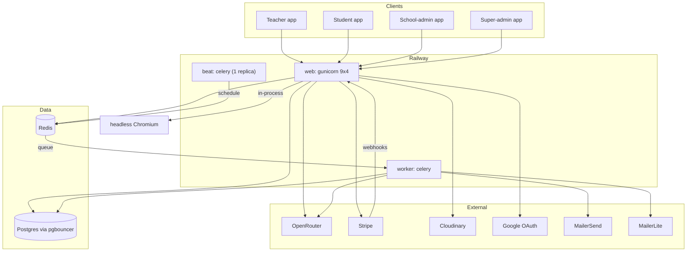
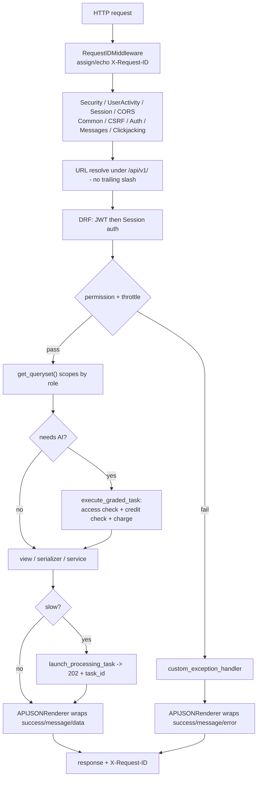
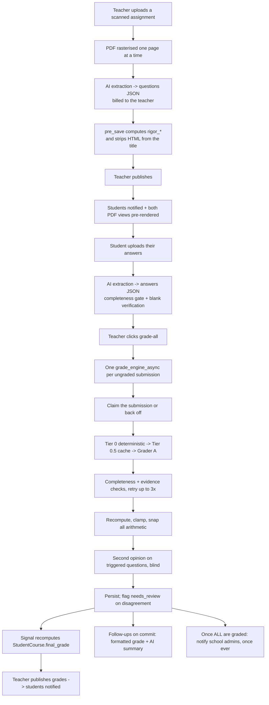

# Grade Automator Plus — backend reference

A complete technical reference for the backend, derived from the source. Every non-obvious claim carries a `path/to/file.py:LINE` citation.

**Audience:** a backend engineer who has never seen this codebase and needs to debug production or extend a feature — and a non-engineer who can read the "In plain terms" paragraph at the top of every section.

---

## What this system does

Teachers upload assignments and student papers — typed, scanned, or photographed. The system uses AI to turn both into structured data, marks the answers against the teacher's rubric, and returns a grade with per-question feedback. Schools pay either per teacher or through a school-wide licence, and every AI call is metered in credits. Because the marking is done by a model that can be wrong, a large part of the codebase exists to check its work: scores are recomputed in Python, every point awarded must be justified by a quote that literally appears in the student's answer, and questions most likely to be marked wrong are re-marked blind by a **different** model — with disagreements escalated to a human rather than to a third AI.

---

## System context

*Caption: three services from one image; Redis is broker, cache, and lock store.*

---

## Request lifecycle

*Caption: every response is re-wrapped into a `{success, message, data|error}` envelope.*

Three things a newcomer trips over:

1. **No trailing slashes.** `APPEND_SLASH = False` and `DEFAULT_ROUTER_TRAILING_SLASH = False` — `/api/v1/assignments/` is a 404.
2. **Everything is wrapped.** The payload you expect is under `data`.
3. **Tenant isolation is `get_queryset()`**, endpoint by endpoint. There is no tenant middleware.

---

## Tech stack

| Layer | Choice |
|---|---|
| Framework | Django 5.2, Django REST Framework |
| Python | 3.12 |
| Database | PostgreSQL, behind **pgbouncer in transaction pooling mode** |
| Queue / cache / locks | Redis (one instance, three roles) |
| Async | Celery + `django_celery_beat` (`DatabaseScheduler`) |
| Auth | `djangorestframework-simplejwt` + Google OAuth |
| API docs | `drf-spectacular` — `/api/v1/` and `/api/v1/swagger-ui` |
| AI | OpenRouter (`x-ai/grok-4.3` primary) |
| Payments | Stripe |
| Media | Cloudinary |
| Email | MailerSend via Anymail; MailerLite for lists |
| PDF | **headless Chromium via Playwright**, in-process, with vendored KaTeX |
| Errors | Sentry (prod/dev, 5% traces, no PII) |
| Hosting | Railway — three services, one image |

---

## Apps

| App | Non-test LOC | What it owns | Doc |
|---|---|---|---|
| `AutoGrader` | ~2.5k | settings, Celery, middleware, health, dispatch | [project-config.md](project-config.md) |
| `users` | ~4k | accounts, auth, **the email-track fork**, throttling | [users-and-auth.md](users-and-auth.md) |
| `classrooms` | ~4.5k | schools, sessions, courses, enrolment, **final grades** | [classrooms.md](classrooms.md) |
| `assignments` | ~7k | authoring, AI extraction, rigor, scheduling | [assignments.md](assignments.md) · [pdf-pipeline.md](pdf-pipeline.md) |
| `students` | ~4k | submissions, **the grading claim**, review queue, task tracking | [students-and-submissions.md](students-and-submissions.md) |
| `ai_processor` | ~14k | extraction, grading, evidence, second opinion, benchmarks | [ai-processor.md](ai-processor.md) · [ai-quality-harness.md](ai-quality-harness.md) |
| `dashboard` | ~8k | analytics, at-risk, rigor roll-up, digests | [dashboard.md](dashboard.md) |
| `billing` | ~30k | plans, credits, Stripe, licences, QA harness | [billing-core.md](billing-core.md) · [billing-stripe.md](billing-stripe.md) · [billing-licenses.md](billing-licenses.md) · [billing-qa-harness.md](billing-qa-harness.md) |
| `grading` | **10** | **empty stub** — no models, no views, no migrations | — |
| `ocr_processor` | **10** | **empty stub** — OCR is the vision model's job | — |
| `scripts/` | ~290 | two CI guard scripts | [operations.md](operations.md) |

`grading` and `ocr_processor` are registered in `INSTALLED_APPS` but contain only Django's generated boilerplate. Grading lives in `ai_processor` + `students`; OCR is done by the vision model reading page images, which is why `ocr_processor` was never built (`ai_processor/services.py:567` calls it *"an empty stub"* in passing).

---

## Documents

| Document | Covers |
|---|---|
| [project-config.md](project-config.md) | settings layering, middleware, response envelope, correlation ids, health checks, error handling |
| [users-and-auth.md](users-and-auth.md) | accounts, JWT, Google OAuth, OTPs, **the personal-vs-business email fork and its five enforcement points**, MailerLite, task-status API |
| [classrooms.md](classrooms.md) | schools, sessions, courses, topics, three enrolment paths, the name-uniqueness rule, **final-grade recalculation** |
| [assignments.md](assignments.md) | creation paths, AI extraction, sanitisation, **rigor scoring**, status lifecycle, scheduled grading, notifications |
| [pdf-pipeline.md](pdf-pipeline.md) | Chromium renderer, warm-browser recycling, **single-flight**, **load shedding**, the PDF cache |
| [students-and-submissions.md](students-and-submissions.md) | upload paths, **the grading claim**, the refund scope, **the review queue**, task tracking and cancellation |
| [ai-processor.md](ai-processor.md) | the provider, **the billing chokepoint**, prompt-injection defence, three grading tiers, **evidence verification**, **second opinion** |
| [ai-quality-harness.md](ai-quality-harness.md) | the ground-truth benchmark, replay vs live, three-tier run history, `grading_eval` |
| [dashboard.md](dashboard.md) | four role dashboards, **at-risk classification**, rigor roll-up and its verdicts, digests, the AI chat |
| [billing-core.md](billing-core.md) | credits, buckets, consumption order, `max_bank`, subscriptions, trials, **refunds**, access control |
| [billing-stripe.md](billing-stripe.md) | **the webhook idempotency ledger**, the claim, reconciliation, **plan-change branching** |
| [billing-licenses.md](billing-licenses.md) | school licences, allocations, admin credits, offline billing, overage purchases |
| [billing-qa-harness.md](billing-qa-harness.md) | real-Stripe QA, **the two-clock problem**, invariants, the chaos walk, the console |
| [data-model.md](data-model.md) | consolidated ER, conventions, derived state, indexes, constraints |
| [async-and-infrastructure.md](async-and-infrastructure.md) | Celery config, **39-task inventory**, Beat, **Redis keys and TTLs**, idempotency, sync-vs-worker |
| [integrations.md](integrations.md) | LLM, Stripe, Cloudinary, Google, email, Chromium, **the SSRF-guarded fetcher** |
| [security-and-tenancy.md](security-and-tenancy.md) | roles, auth surface, tenant isolation, untrusted input, **the four absolute lines**, audit trails |
| [operations.md](operations.md) | deploy topology, CI, **migration safety**, pgbouncer guard rails, logging, monitoring, **runbook** |
| [glossary.md](glossary.md) | terms that mean something more specific than they sound like |

---

## Trace one assignment end to end

The path a new engineer should follow first.

*Caption: the money path. Every AI box charges credits; a failure anywhere inside the refund scope reclaims them.*

Read in this order:

1. [assignments.md § Creation paths](assignments.md#creation-paths) — how questions get in
2. [ai-processor.md § Answer extraction](ai-processor.md#answer-extraction) — how answers get in
3. [students-and-submissions.md § The grading claim](students-and-submissions.md#the-grading-claim) — why it only happens once
4. [ai-processor.md § Grading](ai-processor.md#grading) — the three tiers and the checks
5. [billing-core.md § Refunds](billing-core.md#refunds) — what happens when it fails
6. [students-and-submissions.md § Review queue](students-and-submissions.md#review-queue) — what a human sees
7. [classrooms.md § Final-grade recalculation](classrooms.md#final-grade-recalculation) — how it reaches the gradebook

---

## The ideas that explain most of the code

Nine patterns account for most of what looks unusual.

| Idea | Why | Where |
|---|---|---|
| **Never trust the model's arithmetic** | scores are coerced, clamped, snapped to rubric levels, and totals recomputed — *"Model-reported totals are not used"* | [ai-processor.md](ai-processor.md#the-arithmetic-authority) |
| **Mechanical checks beat prompt instructions** | evidence quotes are string-matched; completeness is counted; *"the cheapest possible second opinion, costing zero extra model calls"* | [ai-processor.md](ai-processor.md#evidence-verification) |
| **A claim, not a lock** | a conditional UPDATE with a staleness window **derived from a hard kill point** — used for grading and Stripe webhooks | [async-and-infrastructure.md](async-and-infrastructure.md#idempotency) |
| **Content-addressed caches** | the key contains everything that determines the value, so **nothing needs invalidating** | [pdf-pipeline.md](pdf-pipeline.md#key-design) |
| **Refuse fast rather than queue** | load shedding: *"refusing fast keeps those threads free for work the process can serve"* | [pdf-pipeline.md](pdf-pipeline.md#load-shedding) |
| **Degrade on the final attempt** | a strict check becomes advisory on the last retry, because *"failing on the final attempt destroys the whole submission"* | [ai-processor.md](ai-processor.md#the-completeness-gate) |
| **Fail closed on the unknown** | unrecognised email domains, enforcement modes, `ENVIRONMENT`, and Stripe keys are all refused rather than assumed safe | [security-and-tenancy.md](security-and-tenancy.md) |
| **Test the beliefs, not the mocks** | two QA harnesses exist because *"mocked tests encode our BELIEFS about the API rather than its behaviour"* | [billing-qa-harness.md](billing-qa-harness.md) · [ai-quality-harness.md](ai-quality-harness.md) |
| **Audits are read-only** | *"The repairs are business decisions … not things to do behind anyone's back"* | [security-and-tenancy.md](security-and-tenancy.md#audit-commands) |

---

## Where money and data can go inconsistent

The complete list, each documented with its detection and repair:

| Risk | Detection | Repair |
|---|---|---|
| A Stripe webhook fails past Stripe's 3-day retry window — *"a customer may have paid without receiving anything"* | hourly ERROR | `replay_stripe_events --apply`, after inspecting the event |
| A refund fails after credits were consumed | ERROR: *"manual reconciliation required"* | re-run `refund_credits` for the `task_id` |
| A process dies between the provider call and the charge commit | none | none — **fails in the user's favour** |
| An account billed on **both** tracks — charged for credits it can never spend | `audit_email_track_separation` | business decision |
| A licence renewal fails for **every** teacher → the licence is deactivated | ERROR | manual reactivation |
| A proxy upload matches the **wrong** student | none — silent | the teacher must spot it |
| A derived column drifts (`bulk_update`, raw SQL) | none for `final_grade`; a command for rigor | `backfill_assignment_rigor` |
| A missed daily at-risk run leaves a permanent gap in the only history | none | not backfillable |
| A duplicated Beat fires every job twice | **neither health check detects it** | check the replica count |

---

## Reading conventions

- Every feature doc opens with **"In plain terms"** — 3–5 sentences, no jargon.
- **Every complete enumeration is stated in full**, with what each value means and who writes it.
- Quoted italic text is **verbatim from a code comment or docstring** — this codebase documents its own reasoning unusually well, and quoting preserves the *why*.
- `> **UNVERIFIED:**` marks something that could not be determined from the source, saying what would resolve it.
- Diagrams are Mermaid in fenced blocks; edges carry the real condition.

---

## Relationship to the root-level docs

Twelve `*.md` files predate `docs/` and were **left in place**, per the brief. They are useful history but should not be treated as current.

### Where they contradict the code

| Root doc | Claim | Reality |
|---|---|---|
| `GRADING_FLOW.md` | grading questions are *"batched (up to 5 per call)"* | `GRADING_QUESTIONS_PER_CHUNK = 10`, **raised from 5 on 2026-08-21** after a 50-run live test found no accuracy cost ([ai_processor/services.py:184-191](../../ai_processor/services.py#L184-L191)) |
| `GRADING_FLOW.md` | otherwise **accurate and current** — tiers, evidence, second opinion, triggers, resolution endpoints all match | the closest root doc to the code; treat the rest of it as reliable |
| `API_LAYER_SUMMARY.md` | `billing/license_service.py` is *"~400+ lines"*, **11 endpoints** | it is **3,653 lines**, and the licence surface now includes overage intents, offline requests, conversions, and seat changes |
| `IMPLEMENTATION_SUMMARY.md` | *"~550 lines of production code"*, **11 core methods** | ~50 methods; the offline-billing and overage subsystems did not exist when it was written |
| `BILLING_SERVICE_REVIEW.md` | a June 2026 review of `LicenseSubscriptionService` | predates offline billing, overage purchases, `is_admin_allocation`, and the whole live-QA suite |
| `SPECIFICATION_V2.md` | proposals with a 🟡/🔵/🟢 status legend | **statuses are not maintained** — §1 (per-question overrides after a manual override) is still accurate as a description of current behaviour and still unimplemented |
| `SUBSCRIPTION_FLOW_DIAGRAMS.md`, `SUBSCRIPTION_FLOW_PLAIN_LANGUAGE.md` | Aug 2026 | predate the annual→monthly deferred-upgrade rule and the licence-track guard on individual purchases; verify any specific claim against [billing-stripe.md](billing-stripe.md) |
| `FINAL_VERIFICATION_REPORT.md` | June 2026 verification | superseded |
| `QA_SERVER_SETUP.md`, `FUTURE_ROADMAP.md`, `GRADING_HANDBOOK.md`, `API_DOCUMENTATION_LICENSE.md` | — | not cross-checked for this pass |

### One contradiction inside the code itself

`ai_processor/tasks.py:23-25` states *"There is no CI in this repo, so Celery Beat is the only scheduler available"*, and `extraction_benchmark.py` calls `--mode replay` *"what CI runs"*. **Three GitHub Actions workflows exist** (`tests.yml`, `pre-commit.yml`, `migration-safety.yml`). The nightly benchmark replay could move there, as that same comment says it should.

---

## Quick reference

| Question | Answer |
|---|---|
| Where is the AI billed? | `AIProcessor.execute_graded_task` — the **only** chokepoint |
| Where is a submission protected from double-grading? | `students.services._claim_submission_for_grading` |
| Where is a Stripe event protected from double-processing? | `billing.webhooks._claim_stripe_event` |
| Where is the personal/business email rule? | `users/utils.py` (classification), `users/serializers.py:validate` (enforcement) |
| Where is grading arithmetic decided? | `AIProcessor._finalize_grading_result` |
| Where does a course's `final_grade` come from? | `classrooms/signals.py::_recalculate_final_grade` |
| Which settings must change together? | [async-and-infrastructure.md § the chain](async-and-infrastructure.md#the-chain-to-re-derive-together) |
| What do I run when an ERROR fires? | [operations.md § runbook](operations.md#runbook) |
| What does this word mean here? | [glossary.md](glossary.md) |
