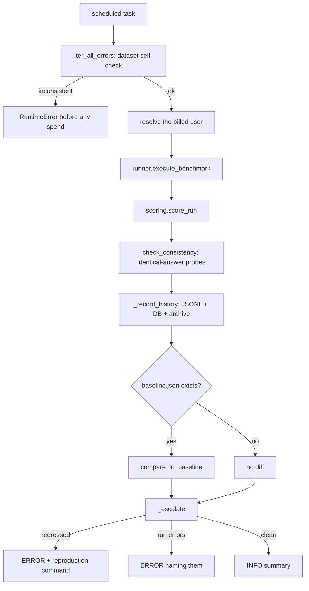

# AI quality harness — benchmarks, run history, and the accuracy scoreboard

> Part of the [backend reference](README.md). Related: [ai-processor.md](ai-processor.md), [async-and-infrastructure.md](async-and-infrastructure.md), [integrations.md](integrations.md).

## In plain terms

Grading is done by an AI, and an AI can quietly get worse — either because someone changed the app's code, or because the AI company changed the model underneath. This is the machinery that catches both. There is a small, hand-written set of assignments and student answers where the **correct grades are already known**. Running them through the real grading pipeline and comparing gives a score. That runs two ways: a free nightly version that replays saved AI responses (catches *our* bugs), and a paid weekly version that asks the live model (the only thing that can catch *the model* changing). Every run is kept so trends are visible over months, and a separate report measures whether the "two graders disagree" safety net is actually finding real mistakes.

---

## Entry points

| Kind | Name | Cost | Source |
|---|---|---|---|
| Celery Beat | `ai_processor.tasks.nightly_grading_benchmark_replay` — 01:30 daily | **free** | [ai_processor/tasks.py:166](../../ai_processor/tasks.py#L166) |
| Celery Beat | `ai_processor.tasks.weekly_grading_benchmark_live` — 03:00, day per `GRADING_BENCHMARK_DAY_OF_WEEK` | **real credits** | [ai_processor/tasks.py:192](../../ai_processor/tasks.py#L192) |
| Command | `grading_benchmark --mode replay\|live\|record [--json] [--pdf --out DIR] [--assignment KEY] [--persist] [--baseline PATH]` | varies | [grading_benchmark.py](../../ai_processor/management/commands/grading_benchmark.py) |
| Command | `extraction_benchmark --mode replay\|live\|record [--case KEY] [--json]` | varies | [extraction_benchmark.py](../../ai_processor/management/commands/extraction_benchmark.py) |
| Command | `grading_benchmark_history --trends \| --unstable \| --question KEY \| --html FILE \| --sync-db \| --rebuild-from-archives DIR` | **free, read-only** | [grading_benchmark_history.py](../../ai_processor/management/commands/grading_benchmark_history.py) |
| Command | `grading_eval [--days 90] [--course ID] [--json]` | **free, read-only** | [grading_eval.py](../../ai_processor/management/commands/grading_eval.py) |

Both scheduled tasks use `max_retries=0`, following `billing/tasks.py`'s live-QA conventions: *"a failure here is a signal to investigate, not a transient to paper over"* ([ai_processor/tasks.py:19-21](../../ai_processor/tasks.py#L19-L21)).

**There is no CI in this repo, so Celery Beat is the only scheduler available.** The module leaves a standing note: *"If CI is ever added, the nightly replay belongs there instead — it needs no credentials and no database of its own"* ([ai_processor/tasks.py:23-25](../../ai_processor/tasks.py#L23-L25)).

Both are registered in `BEAT_HEALTH_EXPECTATIONS`, so a stopped job is caught by the watchdog ([settings.py:933](../../AutoGrader/settings.py#L933), [936](../../AutoGrader/settings.py#L936)) — see [project-config.md](project-config.md#why-two-layers-of-beat-monitoring).

### Module map

| Module | Role |
|---|---|
| [benchmark/dataset.py](../../ai_processor/benchmark/dataset.py) | ground truth — 3 assignments, 7 students. **Pure data** |
| [benchmark/runner.py](../../ai_processor/benchmark/runner.py) | executes the dataset through the real pipeline in 3 modes |
| [benchmark/scoring.py](../../ai_processor/benchmark/scoring.py) | metrics. **Pure functions** |
| [benchmark/submissions.py](../../ai_processor/benchmark/submissions.py) | the student answers |
| [benchmark/history.py](../../ai_processor/benchmark/history.py) | Tiers 1–2 — JSONL run history + DB mirror |
| [benchmark/archive.py](../../ai_processor/benchmark/archive.py) | Tier 3 — full raw archive to Cloudinary |
| [benchmark/analysis.py](../../ai_processor/benchmark/analysis.py) | trends and variation statistics |
| [benchmark/report_html.py](../../ai_processor/benchmark/report_html.py) | a shareable HTML page |
| [benchmark/render.py](../../ai_processor/benchmark/render.py) | readable PDFs of the dataset |
| [benchmark/extraction_dataset.py](../../ai_processor/benchmark/extraction_dataset.py) | ground truth for *assignment extraction* |
| [benchmark/extraction_runner.py](../../ai_processor/benchmark/extraction_runner.py), [extraction_scoring.py](../../ai_processor/benchmark/extraction_scoring.py) | the extraction benchmark |

---

## The two scheduled jobs

The split is the whole design ([ai_processor/tasks.py:1-26](../../ai_processor/tasks.py#L1-L26)):

| | `nightly_grading_benchmark_replay` | `weekly_grading_benchmark_live` |
|---|---|---|
| Cost | free | real credits |
| Determinism | fully deterministic | varies run to run |
| Detects | **regressions in our code** — snapping, evidence enforcement, batching, arithmetic | **the provider silently changing behaviour** |
| Cannot detect | the model changing, *by construction* | nothing extra |
| Gate | none — safe anywhere | `ENABLE_AI_LIVE_QA`, else no-op at DEBUG |
| Schedule | 01:30 daily | 03:00 weekly |


*Caption: dataset integrity is checked before anything is spent.*

### Escalation

`_escalate` ([ai_processor/tasks.py:130-162](../../ai_processor/tasks.py#L130-L162)) logs at a level matching severity, and a regression ERROR **names the exact reproduction command**:

```
manage.py grading_benchmark --mode <mode> --baseline <path>
```

Three outcomes: `REGRESSED` against baseline → ERROR; submissions failed outright → ERROR with the list; otherwise INFO with `questions / exact_rate / within_one_level_rate / bias`.

### Stale recordings are not a regression

`MissingRecordingError` is caught separately in the nightly job ([ai_processor/tasks.py:176-186](../../ai_processor/tasks.py#L176-L186)): *"Recordings go stale whenever the dataset or a prompt file changes. That is a maintenance task, not a grading defect, so it must not read as a quality regression."* It logs a **WARNING** naming the re-record command — and warns that re-recording *"makes real, billed calls."*

### Bookkeeping never destroys a run

`_record_history` ([ai_processor/tasks.py:75-127](../../ai_processor/tasks.py#L75-L127)) is *"wrapped whole"*: *"these scheduled jobs exist to detect grading regressions, and the weekly one spends real credits. Failing a run because the bookkeeping broke would destroy the thing the job exists to produce, so every failure here is logged and swallowed."*

It also names why this matters more on the server than locally: **Celery cannot commit to git**, so the JSONL files it writes live only on that machine — the database mirror and the Cloudinary archive are what actually make a server-side run durable, and the archive carries its own history rows so the files can be rebuilt from it later.

---

## The dataset

[benchmark/dataset.py](../../ai_processor/benchmark/dataset.py) — 3 assignments, 7 students, known-correct grades. **Pure data**: no Django imports, no `ai_processor.services` import, *"so dataset integrity can be validated without a database or an `OPENROUTER_API_KEY`."*

### How expected grades work

| Question kind | Assertion | Reasoning |
|---|---|---|
| Objective, computational maths/chemistry | `exact=True` — exact score match | one right answer |
| Essays, open short-answers | `exact=False` — that level **or an adjacent one** | *"Two competent human markers routinely disagree by one rubric level on the same essay, so an exact-match assertion there would fail on correct behaviour and the suite would rightly be ignored"* ([dataset.py:9-19](../../ai_processor/benchmark/dataset.py#L9-L19)) |

### The authoring constraint that bites

`_finalize_grading_result` snaps every LLM score to the nearest rubric level ([ai-processor.md](ai-processor.md#the-arithmetic-authority)). **An expected score that is not itself a rubric level value is therefore unreachable — the grader could never produce it no matter how right it was** ([dataset.py:21-30](../../ai_processor/benchmark/dataset.py#L21-L30)).

`iter_expectation_errors()` enforces this, and `tests_grading_benchmark` fails loudly if it is ever violated. `iter_all_errors()` is called at the top of every run, so an inconsistent dataset fails **before any credits are spent**.

### Deliberate probes

| Probe | What it catches |
|---|---|
| `STUDENTS["fluent_wrong"]` | confident, well-structured, **factually wrong** answers. *"This is the failure mode that matters most: a grader that rewards style over correctness looks fine on every other student"* |
| `STUDENTS["twin"]` | byte-identical answers to `STUDENTS["strong"]` on two essay questions. *"Two identical answers must receive identical scores; today they are two independent model calls with no shared state, and nothing in the pipeline would notice if they diverged"* |
| Objective answer formats | bare letter, option text, and text-with-letter-prefix — exercises `objective_grading.py`'s letter/text handling |
| `PARAPHRASE_PROBES` | one answer correct but paraphrased so heavily it shares almost no vocabulary with `model_answer` |

The twin probe is what `scoring.check_consistency(run, IDENTICAL_ANSWER_PROBES)` measures ([ai_processor/tasks.py:65](../../ai_processor/tasks.py#L65)). Note this probe predates and motivates the [answer cache](ai-processor.md#tier-05--the-cross-student-cache), which now makes identical answers identical **by construction** rather than by luck.

---

## The runner

[benchmark/runner.py](../../ai_processor/benchmark/runner.py) — three modes:

| Mode | Network | Credits | Purpose |
|---|---|---|---|
| `live` | yes | yes | produces the accuracy numbers |
| `record` | yes | yes | a live run that **also captures every model response** to `recordings/` |
| `replay` | **no** | **no** | serves recorded responses; fully deterministic |

### It does not create `StudentSubmission` rows

*"`classrooms/signals.py::update_student_course_final_grade` fires on every submission save and recalculates the enrolled student's course final grade. Persisting benchmark submissions into a production database would therefore corrupt real students' grades"* ([runner.py:15-24](../../ai_processor/benchmark/runner.py#L15-L24)).

The default path calls `extract_grade_with_retry` **directly** and touches no submission tables at all. `--persist` opts into the full `grade_engine` path for local runs where exercising persistence is the point.

### Replay keying

Recorded responses are keyed by a hash of *what actually determines a model reply*: the **system prompt**, the **user prompt**, and the **model override** ([runner.py:26-33](../../ai_processor/benchmark/runner.py#L26-L33)). The override must be in the key because *"the second-opinion pass reuses the same batch prompt with a different model."*

**A prompt with no recording raises rather than silently falling through to a live call** — *"a replay that quietly costs money would be worse than a failing one."* That is the `MissingRecordingError` the nightly task handles.

Recordings are gzipped under `benchmark/recordings/`.

---

## Scoring

[benchmark/scoring.py](../../ai_processor/benchmark/scoring.py) — pure functions on plain dicts, so every metric is unit-testable against hand-built inputs.

**The central idea is the rubric LEVEL, not the raw score** ([scoring.py:6-12](../../ai_processor/benchmark/scoring.py#L6-L12)): *"'Off by 5 points' means nothing on its own: 5 points is a whole grade band on a 10-point question and a rounding error on a 25-point essay."* Every accuracy number is computed in **level-index space**, where 0 = the top level, 1 = one level down, and so on.

`grade_one(question, spec, awarded)` ([scoring.py:57+](../../ai_processor/benchmark/scoring.py#L57)) returns one of four verdicts:

| Verdict | Meaning |
|---|---|
| `exact` | awarded == expected |
| `adjacent` | one rubric level away, **and the question allows it** (`exact=False`) |
| `off` | outside the accepted band — **a real failure** |
| `unreachable` | awarded is not a value the grader should be able to produce — **indicates a snapping regression** |

`level_index` returns `None` for an off-ladder score *"which should be impossible after `_finalize_grading_result`'s snapping, so it is reported rather than silently coerced"* ([scoring.py:29-38](../../ai_processor/benchmark/scoring.py#L29-L38)). `nearest_level_index` exists purely for diagnostics on such a score, *"so a snapping regression shows up as a number rather than as a crash."*

The `unreachable` verdict is therefore a **self-check on the grading pipeline's own invariant**, not on the model.

Headline metrics: `exact_rate`, `within_one_level_rate`, `mean_level_error` (the **bias** — signed, so systematic over- or under-marking is visible), `evidence_verified_rate`, `deterministic_accuracy`, `second_opinion_disagreement_rate`, `total_tokens`.

`statistics` from the stdlib only — *"scipy is not a dependency of this project and pulling it in for one statistic would be disproportionate"*; numpy and pandas are installed but deliberately unused ([analysis.py:32-35](../../ai_processor/benchmark/analysis.py#L32-L35)).

---

## Run history — three tiers

Motivation ([history.py:3-14](../../ai_processor/benchmark/history.py#L3-L14)): *"The benchmark could measure accuracy once, but not measure CHANGE. Every run write-up in FINDINGS.md ends up saying some version of 'a single run cannot distinguish the fix didn't help from noise', because nothing kept the numbers … **Runs 1–4's data no longer exists at all.**"*

| Tier | Storage | Contents | Size |
|---|---|---|---|
| 1 | `benchmark/history/runs.jsonl` (git) | one line per run — headline metrics | ~4 KB/run |
| 2 | `benchmark/history/questions.jsonl` (git) | one line per question per run | ~33 KB/run |
| 3 | Cloudinary (`.json.gz`) | **every model response, every full grading, every student answer** | ~1 MB/run |

### Tiers 1–2: plain-text JSONL in git

*"Plain text (not gzip) is deliberate: git delta-compresses text well, and `grep`, `git diff` and code review all keep working. At roughly 4 KB and 33 KB per run, a weekly run costs about 2 MB a year, which is not worth optimising"* ([history.py:16-23](../../ai_processor/benchmark/history.py#L16-L23)).

**These files are an INDEX, not the source of truth.** Each Tier 3 archive contains its own copy of these rows, so the files can be rebuilt from the archives — *"which is what makes a run on the server, where Celery cannot commit to git, recoverable."* That is the `--rebuild-from-archives` path.

### Comparability

Every row records `code_sha`, `prompt_fingerprint`, and `dataset_fingerprint`, *"because comparing two runs is only valid when the inputs match. This is not hypothetical: ground truth for maths/strong Q4 was corrected mid-way through this benchmark's life, and runs either side of that are not comparable on that question"* ([history.py:29-35](../../ai_processor/benchmark/history.py#L29-L35)).

Two kinds of row are **excluded from variation statistics**, and both are recorded so the analysis can exclude them:

| Excluded | Why |
|---|---|
| `mode: "replay"` | re-reads fixed recorded responses, so metrics are identical every time. *"Averaging 365 identical nightly rows would collapse the apparent spread to zero and then make every real run look like a huge anomaly."* Still kept: **same inputs + changed code = OUR regression**, which is exactly what the nightly job is for |
| partial runs (`--assignment maths`) | grade a subset, so rates are not comparable with full runs |

`BenchmarkRun.is_full_run` is the denormalised form of that test ([ai_processor/models.py:87-90](../../ai_processor/models.py#L87-L90)).

`history.py` **raises normally on failure** ([history.py:47-49](../../ai_processor/benchmark/history.py#L47-L49)) — the callers in the grading path are what wrap it, *"so that a bookkeeping bug can never destroy an expensive run."*

### Tier 3: the raw archive

[archive.py](../../ai_processor/benchmark/archive.py). Tiers 1–2 *"store a fixed set of numbers, so they can answer questions we have already thought of. This tier keeps the raw material … so it can answer questions we have NOT thought of yet."*

**That is not hypothetical:** the LaTeX evidence bug (FINDINGS.md, Round 4 — the one that produced the desugaring rules in [evidence.py](ai-processor.md#evidence-verification)) *"was found by re-reading the model's actual quotes and diffing them against what the student wrote. That investigation was only possible because the run in question happened to be the most recent one; for any earlier run the data was already gone."* It also means **a metric invented tomorrow can be computed for every archived run**, instead of starting from zero.

**Why Cloudinary and not git** ([archive.py:18-25](../../ai_processor/benchmark/archive.py#L18-L25)): ~1 MB per run compressed; the repo has a 500 KB large-file guard, and gzipped blobs do not delta-compress, so every run would add its full weight to git history forever. Cloudinary is already a hard requirement (settings reads `CLOUDINARY_*` with no defaults), so this adds **no new vendor, credentials, or setup**.

**Only paid runs (`live`/`record`) are archived** — *"A replay re-reads fixed recorded responses and produces the same bytes every time, so archiving the nightly job would upload one identical file 365 times a year."*

Two safety properties ([archive.py:27-40](../../ai_processor/benchmark/archive.py#L27-L40)), because *"A paid run costs real money and about an hour. Losing one to a bookkeeping bug would be far worse than having no bookkeeping"*:

1. **Written to local disk first, then uploaded.** If the upload fails the data still exists and can be pushed later.
2. **`archive_run()` never raises** — it returns `(url, error, local_path)` and the caller records whichever happened.

`BENCHMARK_ARCHIVE_STORAGE` defaults to `RawMediaCloudinaryStorage`, **not** the default `MediaCloudinaryStorage`, because *"the default is image-typed and mishandles a `.json.gz`"* ([settings.py:1277-1282](../../AutoGrader/settings.py#L1277-L1282)).

`BENCHMARK_ARCHIVE_ENABLED` defaults to `not _RUNNING_TESTS` ([settings.py:1287-1296](../../AutoGrader/settings.py#L1287-L1296)), and the reasoning is worth repeating: *"`ENVIRONMENT` is 'local' in `.env`, and 'local' resolves to REAL Cloudinary, so a test that saved a file would make a live network call using real credentials. Individual tests still override the storage backend explicitly; this is the backstop for the test someone forgets to."*

### Database mirror

`BenchmarkRun` and `BenchmarkQuestionOutcome` ([ai_processor/models.py:62-171](../../ai_processor/models.py#L62-L171)) mirror the two JSONL files.

*"The JSONL files are the shared, git-tracked source of truth (they travel with the code, so every developer sees the same history). This table mirrors them so the data is queryable — via the ORM, the admin, or a future dashboard chart — and so a run executed on the SERVER by Celery, which cannot commit to git, is still recorded somewhere durable."*

**Deliberately denormalised and nullable**: *"this is an analysis mirror, not the authority. An import must never fail because one metric is missing from an older row."* Every metric column is `null=True`, and a `payload` JSONField keeps the whole row *"so a metric added later is still recoverable from rows written before the column existed."*

| Model | Key fields | Constraints |
|---|---|---|
| `BenchmarkRun` | `run_id` (**unique**), `recorded_at`, `mode`, `source`, `code_sha`, `prompt_fingerprint`, `dataset_fingerprint`, `is_full_run`, 7 metric floats, `archive_url`, `payload` | indexes on `(mode, recorded_at)` and `prompt_fingerprint` |
| `BenchmarkQuestionOutcome` | `run` FK, `assignment_key`, `student_key`, `question_number`, `question_type`, `subject`, expected/awarded points and levels, `level_error`, `verdict`, `level_decision`, `graded_by`, `evidence_verified`, `second_opinion_disagreed`, `payload` | unique on `(run, assignment_key, student_key, question_number)`; index on the last three |

`BenchmarkQuestionOutcome` exists for a question no aggregate can answer ([ai_processor/models.py:121-130](../../ai_processor/models.py#L121-L130)): *"'has this question's grade changed between runs?' … the existing `twin` probe only checks that two identical answers agree WITHIN a single run, not that the same answer is graded the same way across runs."*

`sync_to_database` is **idempotent** — `--sync-db` can be re-run safely.

---

## Trend analysis

[analysis.py](../../ai_processor/benchmark/analysis.py) turns "is this real or noise?" from a judgement call into a computation ([analysis.py:1-16](../../ai_processor/benchmark/analysis.py#L1-L16)):

> *"If exact-match has ranged 82.7–86.5% across five runs with no relevant change, then a two-point move is ordinary wobble; a seven-point move in evidence-verified is four times that spread and is therefore real."*

Runs are **grouped by prompt fingerprint**, *"because a prompt change alters what the model was asked; the caller is warned when a span mixes versions."*

`grading_benchmark_history` surfaces it four ways ([grading_benchmark_history.py:1-24](../../ai_processor/management/commands/grading_benchmark_history.py#L1-L24)):

| Flag | Question it answers |
|---|---|
| `--trends` | has anything actually changed, or is it noise? |
| `--unstable` | which questions does the grader mark inconsistently? |
| `--question maths/strong/4` | one question's full grade history |
| `--html trends.html` | a page you can open in a browser and send to someone |
| `--sync-db` | mirror the files into the database (idempotent) |
| `--rebuild-from-archives ./archives` | rebuild the files from downloaded run archives |

The command **only reads** — it makes no model calls and costs nothing.

---

## Extraction benchmark

[extraction_dataset.py](../../ai_processor/benchmark/extraction_dataset.py) tests a different thing: whether an assignment survives a **round trip**.

**Why a round trip** ([extraction_dataset.py:3-17](../../ai_processor/benchmark/extraction_dataset.py#L3-L17)): every case is defined by the questions expected, and the *document* is generated **from** those questions through the pipeline's own renderer (`format_assignment_standard_html` → `html_to_prosemirror_text`) — *"byte-for-byte how a real assignment reaches the editor and how the editor hands it back on an edit."*

That makes each case a fidelity test of the loop teachers actually live in: **"if a teacher opens this assignment and saves it, do they get the same assignment back?"** And that loop is not optional: *"the frontend editor is free-form and resends the whole document, so every edit is a full AI re-extraction — which makes round-trip fidelity the single property the editing experience rests on."*

### The cases pin specific known conflicts in the prompt

| Case | What it settles |
|---|---|
| `six_level_rubric` | the prompt says *"rubric: Array of 4 performance levels"* (line 642) while also saying *"parse each data row"* (line 434). **A teacher who adds levels 5 and 6 is betting on the second instruction.** This case settles which wins |
| `custom_level_names` | the prompt says *"Always use lowercase level names: excellent, good, fair, poor"* — **an instruction to RENAME a teacher's own levels** |
| `six_option_mcq` | options carry no count rule anywhere in the prompt, so this should pass. **It is here to catch a REGRESSION if someone ever adds one** |
| `no_rubric` | the one case where generating exactly 4 levels **is** correct — an open-ended question that arrived with no rubric at all |

This is unusually valuable documentation in its own right: it records four places where the extraction prompt contains an internal contradiction, and makes the resolution testable rather than folkloric.

`extraction_scoring.py` scores per-metric (`METRICS` at [extraction_scoring.py:39](../../ai_processor/benchmark/extraction_scoring.py#L39)) across option normalisation, rubric level names, and rubric points.

`iter_extraction_dataset_errors()` is the equivalent integrity self-check.

The extraction benchmark has **no scheduled job** — it is command-only. Its docstring says `--mode replay` is *"what CI runs"*, but there is no CI in this repo, so **nothing runs it automatically**.

> **UNVERIFIED:** whether the extraction benchmark is deliberately manual or was simply never wired to Beat. To resolve: ask the team, or check whether a `PeriodicTask` row for it exists in production.

---

## `grading_eval` — the accuracy scoreboard

[grading_eval.py](../../ai_processor/management/commands/grading_eval.py) is different from everything above: it measures **the real production system on real submissions**, not a fixed dataset.

Its purpose is stated precisely ([grading_eval.py:5-7](../../ai_processor/management/commands/grading_eval.py#L5-L7)): *"computes the metrics that say whether the second-opinion system is improving grading accuracy **or merely generating AI calls**."*

Five sections:

| # | Measures |
|---|---|
| 1 | **Coverage & trigger mix** — how often a second opinion ran, and why (which of `low_confidence` / `flagged:*` / `borderline_level` / `high_stakes` / `subjective_type` / `qa_sample` fired) |
| 2 | **Disagreement rates** — overall and segmented by question type, severity tier, confidence band, course, and model pair |
| 3 | **Teacher alignment** — when a teacher resolved a disagreement, **whose grade were they closer to: grader A's or grader B's?** |
| 4 | **Trigger calibration** — is low self-reported confidence actually predictive of disagreement, and what hidden-error rate does the random QA sample find on "easy" cases? |
| 5 | **Regrade baseline** — the pre-existing human-correction signal (`score` vs `ai_score`) |

Section 3 is the closest thing the system has to ground truth on real work, and it is only possible because the pipeline deliberately preserves the labelled data: `mark_reviewed` records `"confirmed"` and `update_grade` records `"overridden"` into `review_reasons` ([students-and-submissions.md](students-and-submissions.md#resolving-a-review)), and `ai_score`/`ai_feedback` are never overwritten by a manual override.

Section 4 is what checks the `level_decision` self-report the borderline trigger depends on — the concern [second_opinion.py](ai-processor.md#triggers) raises that *"it is self-reported and so could be gamed by a lazy grader answering 'clear' to everything."*

*"Every input was already persisted by the grading pipeline"* ([grading_eval.py:20-25](../../ai_processor/management/commands/grading_eval.py#L20-L25)) — `graded_by` provenance, `feedback["second_opinion"]` blocks, trigger reasons, resolutions, and regrade deltas. **Nothing extra is recorded for this command's benefit**, which is why the stable-string warnings on reason and tier labels matter.

It is read-only and makes no model calls. Default window: 90 days.

---

## Failure modes & recovery

| Failure | Behaviour | Recovery |
|---|---|---|
| Dataset internally inconsistent | `RuntimeError` **before any spend**, listing every problem | fix `dataset.py`; `iter_expectation_errors` names the unreachable expectations |
| Expected score is not a rubric level | caught by `iter_expectation_errors`; the test suite also fails | make the expectation a reachable level |
| Recordings stale/missing (replay) | **WARNING**, task returns "skipped" — *not* a regression | `grading_benchmark --mode record` (**billed**) |
| Live run with `ENABLE_AI_LIVE_QA` unset | DEBUG log, no-op | set it on a QA/staging worker |
| Live run, no billable user resolvable | `_resolve_user` raises | ensure a suitable user exists |
| Benchmark regressed vs baseline | **ERROR** naming which metrics and the reproduction command | investigate; re-baseline only after understanding why |
| Submissions failed outright | ERROR listing them | usually a provider outage |
| JSONL write fails | logged, **swallowed** — the run's result still returns | the DB mirror and archive may still have it |
| DB mirror fails | WARNING, swallowed | `--sync-db` later |
| Cloudinary upload fails | WARNING naming the **local path**; `archive_error` recorded on the run | push the local bundle later |
| Archive bundle unwritable | `archive_run` returns an error tuple; **never raises** | — |
| Score off-ladder | verdict `unreachable` | **a snapping regression in `_finalize_grading_result`** — investigate the pipeline, not the model |
| Beat stops running either job | silent | `check_beat_health` reports it overdue (2-day / 10-day thresholds) |
| `baseline.json` missing | no diff computed; the run still reports metrics | commit a baseline |

**Nothing here can corrupt production data** — the runner does not write submission rows by default, and every history/archive path is failure-swallowing. The one real cost is money: a `live` or `record` run bills a real wallet.

---

## Configuration

| Var | Default | Effect |
|---|---|---|
| `ENABLE_AI_LIVE_QA` | `False` | gates `weekly_grading_benchmark_live`. *"Default False so a normal production worker never spends credits on QA"* ([settings.py:1261-1266](../../AutoGrader/settings.py#L1261-L1266)) |
| `GRADING_BENCHMARK_DAY_OF_WEEK` | `"0"` | which day the weekly live run fires ([settings.py:857](../../AutoGrader/settings.py#L857)) |
| `BENCHMARK_ARCHIVE_ENABLED` | `not running tests` | Tier 3 uploads |
| `BENCHMARK_ARCHIVE_STORAGE` | `cloudinary_storage.storage.RawMediaCloudinaryStorage` | **must be Raw** — the default is image-typed and mishandles `.json.gz` |
| `BENCHMARK_ARCHIVE_PREFIX` | `benchmark_archives` | Cloudinary folder |
| `OPENROUTER_API_KEY` | required | only needed for `live`/`record` |
| `CLOUDINARY_*` | required | already required by the app |

Non-configurable paths:

| Path | Contents |
|---|---|
| `ai_processor/benchmark/baselines/baseline.json` | the comparison baseline (**latest run only**) |
| `ai_processor/benchmark/history/runs.jsonl` | Tier 1 |
| `ai_processor/benchmark/history/questions.jsonl` | Tier 2 |
| `ai_processor/benchmark/recordings/` | gzipped model responses for replay |
| `benchmark_artifacts/` (repo root) | rendered PDFs, timing logs, and the accuracy-investigation write-ups referenced from the code comments |
