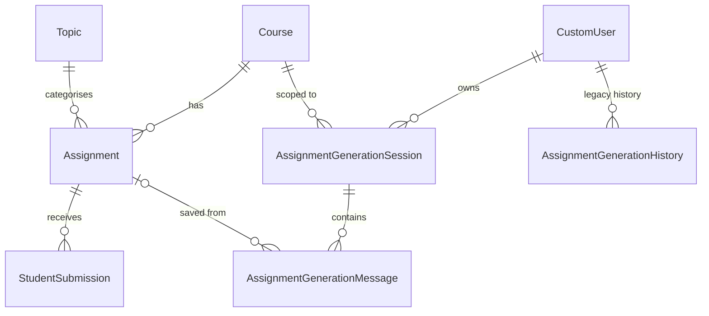
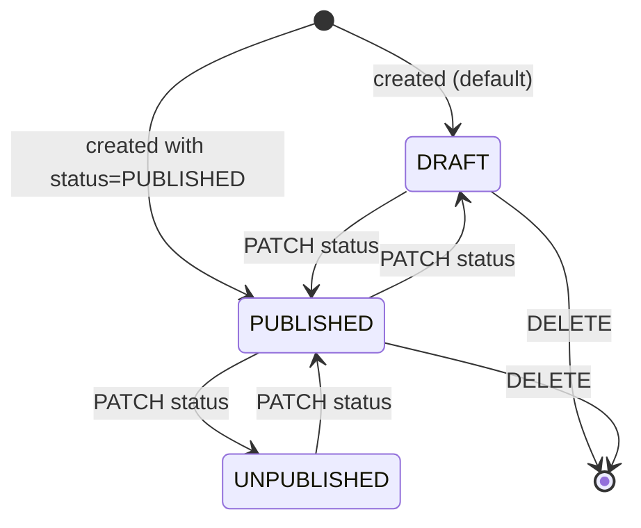
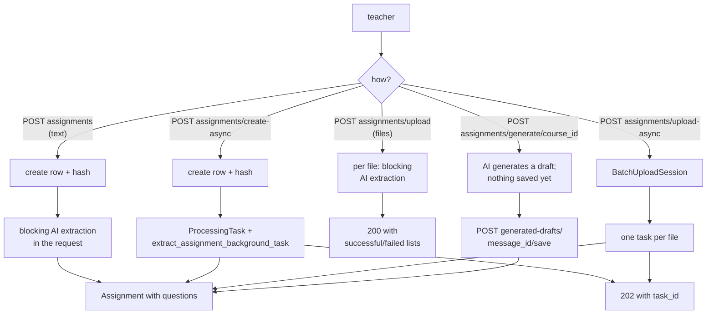
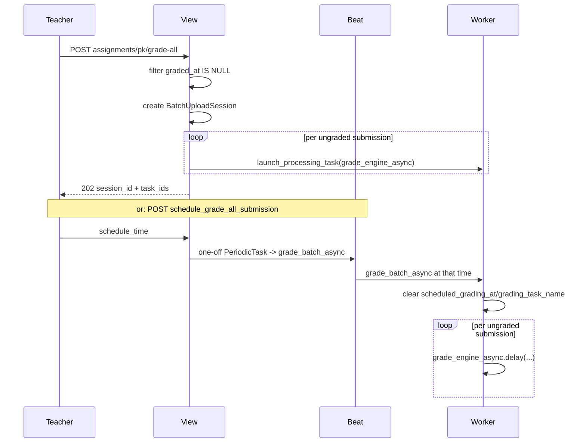
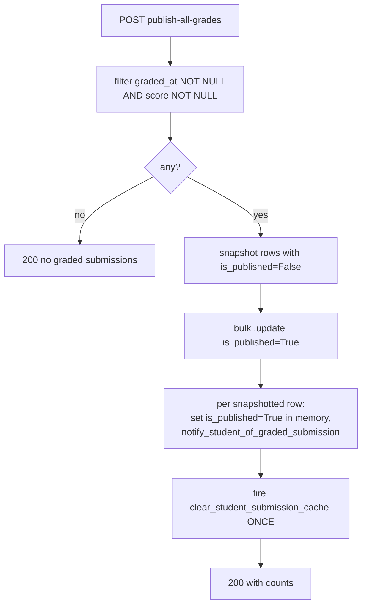

# Assignments — authoring, AI extraction, rigor, scheduling

> Part of the [backend reference](README.md). PDF rendering is split out into [pdf-pipeline.md](pdf-pipeline.md). Related: [ai-processor.md](ai-processor.md), [students-and-submissions.md](students-and-submissions.md), [classrooms.md](classrooms.md).

## In plain terms

An assignment is a set of questions a teacher gives to a course. A teacher can create one three ways: type or paste it, upload a scan or photo of a paper one, or ask the AI to generate one from a prompt. In every case the text goes through an AI extraction step that turns it into structured questions with points, answers, rubrics, and a "how hard is this thinking?" label. From there the assignment can be published to students, scheduled to auto-grade when it's due, downloaded as a PDF, and used to send reminder emails. This app also computes a **rigor score** — a number that tells a school admin whether the work being set actually demands much thinking.

---

## Entry points

All paths relative to `/api/v1/`. `SimpleRouter(trailing_slash=False)` ([assignments/urls.py:5](../../assignments/urls.py#L5)).

### `AssignmentViewSet` — base `assignments`

| Method | Path | Permissions | Sync/async | Source |
|---|---|---|---|---|
| GET | `assignments` | `IsAuthenticated, IsTeacherOrReadOnly` | sync | [assignments/views.py:277](../../assignments/views.py#L277) |
| GET | `assignments/<pk>` | as above | sync | — |
| POST | `assignments` | as above | **sync — blocking AI call** | [assignments/views.py:334](../../assignments/views.py#L334) |
| POST | `assignments/create-async` | as above | async | [assignments/views.py:404](../../assignments/views.py#L404) |
| PATCH | `assignments/<pk>` | as above (+ credit check if `raw_input`) | **sync if `raw_input`** | [assignments/views.py:490](../../assignments/views.py#L490) |
| PATCH | `assignments/<pk>/update-async` | `IsTeacher, HasCreditBalance` | async | [assignments/views.py:574](../../assignments/views.py#L574) |
| DELETE | `assignments/<pk>` | as above | sync | — |
| POST | `assignments/<pk>/associate-topic` | — | sync | [assignments/views.py:669](../../assignments/views.py#L669) |
| POST | `assignments/upload` | `IsTeacher` (**no credit check**) | **sync — blocking AI call per file** | [assignments/views.py:739](../../assignments/views.py#L739) |
| POST | `assignments/upload-async` | `IsTeacher, HasCreditBalance` | async, per-file fan-out | [assignments/views.py:929](../../assignments/views.py#L929) |
| POST | `assignments/generate/<course_id>` | — | sync | [assignments/views.py:1197](../../assignments/views.py#L1197) |
| POST | `assignments/generated-drafts/<message_id>/save` | — | sync | [assignments/views.py:1436](../../assignments/views.py#L1436) |
| POST | `assignments/<pk>/grade-all` | `IsTeacher, HasCreditBalance` | async fan-out | [assignments/views.py:1528](../../assignments/views.py#L1528) |
| POST | `assignments/<pk>/schedule_grade_all_submission` | `IsTeacher, HasCreditBalance` | schedules a Beat task | [assignments/views.py:1591](../../assignments/views.py#L1591) |
| POST | `assignments/<pk>/publish-all-grades` | `IsTeacher` | sync bulk | [assignments/views.py:1650](../../assignments/views.py#L1650) |
| GET | `assignments/<pk>/download-pdf?view=teacher\|student` | inherited | sync render | [assignments/views.py:1747](../../assignments/views.py#L1747) — see [pdf-pipeline.md](pdf-pipeline.md) |

### `AssignmentGenerationSessionViewSet` — base `assignment-generation-sessions`

GET/DELETE only (`http_method_names = ["get", "head", "delete", "options"]`, [assignments/views.py:1889](../../assignments/views.py#L1889)), `IsAuthenticated`, scoped to the requesting user.

### Celery tasks

| Task | Retries | Time limits | Dispatched by |
|---|---|---|---|
| `extract_assignment_background_task` | **none** | none | `create-async` |
| `update_assignment_background_task` | **none** | none | `update-async` |
| `extract_answer_background_task` | **none** | none | students app |
| `grade_engine_async` | **none** | `soft = GRADING_TASK_TIME_LIMIT_SECONDS - 60`, `hard = GRADING_TASK_TIME_LIMIT_SECONDS` | `grade-all`, `grade_batch_async`, `auto_grade_due_assignment` |
| `format_grade` | **none** | none | students app |
| `upload_answers_engine_async` | `max_retries=3` | soft 2700s / hard 3000s | students app |
| `formatted_grade_async` | **none** | none | students app |
| `upload_assignment_async` | `max_retries=3` | soft 1800s / hard 2100s | `upload-async` |
| `grade_batch_async` | `max_retries=3` | none | one-off `PeriodicTask` |
| `auto_grade_due_assignment` | **none** | none | one-off `PeriodicTask` at due date |
| `send_assignment_due_reminder` | **none** | none | one-off `PeriodicTask`, 24h and 1h before due |
| `send_new_assignment_posted_notification` | **none** | none | publish signal |
| `prerender_assignment_pdfs` | `max_retries=5`, `default_retry_delay=60` | none | publish signal |
| `grade_all_submissions` | **none** | none | **dead** — nothing dispatches it |

`grade_all_submissions` is explicitly kept only because a Beat `PeriodicTask` row could still reference it by dotted path ([assignments/tasks.py:52-60](../../assignments/tasks.py#L52-L60)).

Note the two time limits are derived, not arbitrary: `upload_answers_engine_async`'s 2700/3000 is sized against `PDFService.MAX_PAGE_COUNT` (300) and `ANSWERS_EXTRACTION_PAGES_PER_CHUNK` (3), and must stay safely under `visibility_timeout=3600` ([assignments/tasks.py:670-678](../../assignments/tasks.py#L670-L678)). See [async-and-infrastructure.md](async-and-infrastructure.md).

### Signals (all in [assignments/signals.py](../../assignments/signals.py))

| Signal | Receiver | Effect |
|---|---|---|
| `pre_save` | `sync_assignment_rigor` | recompute `rigor_*` from `questions` |
| `pre_save` | `sanitize_assignment_title` | strip HTML from `title` |
| `pre_save` | `handle_due_date_removal` | stash `_previous_status`; delete the auto-grade task if due date / flag removed |
| `post_save` | `schedule_auto_grading` | sync due reminders, publish notification, auto-grade task |
| `post_save`/`post_delete` | `clear_assignment_cache` | wildcard cache purge |
| `post_delete` | `delete_auto_grading_task` | remove all three `PeriodicTask` rows |

### Management commands

| Command | Purpose |
|---|---|
| `backfill_assignment_rigor [--batch-size N] [--dry-run] [--school ID]` | recompute `rigor_*` for every row |
| `repair_question_blooms_levels [--dry-run]` | recover `blooms_level` lost to a serializer bug |
| `strip_duplicate_option_letters [--dry-run]` | fix `"A. A) x"` option text |
| `strip_html_from_assignment_titles [--dry-run]` | fix `"<p>Matrices Exam</p>"` titles |

All four are `--dry-run`-first, idempotent, and use `bulk_update` deliberately so the `post_save` cascade (cache purges, periodic-task sync, "new assignment posted" emails) does **not** fire for a silent data repair ([repair_question_blooms_levels.py:19-23](../../assignments/management/commands/repair_question_blooms_levels.py#L19-L23)).

---

## Data model

### `Assignment` ([assignments/models.py:25-193](../../assignments/models.py#L25-L193))

| Field | Type | Null | Default | Written by | Meaning |
|---|---|---|---|---|---|
| `id` | UUID | no | `uuid4` | — | PK |
| `course` | FK → Course | **no** | — | client | CASCADE, `related_name="assignments"` |
| `topic` | FK → Topic | yes | — | client | CASCADE |
| `title` | CharField(255) | yes | — | client or AI | db_index. **HTML-stripped on every save** |
| `raw_input` | TextField | yes | — | client or AI | the ProseMirror JSON document the teacher edits. Serialised JSON *text*, not a JSONField |
| `raw_input_hash` | CharField(64) | yes | — | **view** | `editable=False`. SHA-256 of `raw_input`, part of the uniqueness constraint |
| `created_at` | DateTime | no | `auto_now_add` | — | |
| `updated_at` | DateTime | no | `auto_now` | — | **read by the PDF cache key** — see below |
| `instructions` | TextField | yes | `""` | AI | |
| `total_points` | Integer | yes | — | AI | |
| `question_count` | Integer | yes | — | AI | |
| `assignment_type` | CharField(20) | no | `OBJECTIVE` | AI | choices below |
| `questions` | **JSONField** | yes | — | AI | the structured question list; free-form, no schema at the DB level |
| `rigor_demand` | Float | yes | — | **pre_save signal** | points-weighted mean Bloom's level, 0–5. Null below `MIN_BLOOMS_COVERAGE` |
| `rigor_standards` | Float | yes | — | pre_save signal | share of open-ended questions with a usable rubric, scaled 0–5. Null when no open-ended questions |
| `rigor_blooms_coverage` | Float | yes | — | pre_save signal | fraction of question points that carried a recognised level, 0.0–1.0 |
| `due_date` | DateTime | yes | — | client | drives reminders and auto-grading |
| `auto_grade_on_due_date` | Boolean | no | `False` | client | |
| `extraction_confidence` | Integer | yes | `0` | AI | |
| `potential_issues` | `ArrayField(CharField(1000))` | yes | — | AI | Postgres array — the only one in the schema |
| `self_assessment` | TextField | yes | — | AI | the model's own critique of its extraction |
| `custom_ai_prompt` | TextField | yes | — | teacher | supplementary grading instructions spliced into the grading prompt — see [ai-processor.md](ai-processor.md) |
| `ai_generated` | Boolean | no | `True` | — | **see the note below** |
| `ai_raw_payload` | JSONField | yes | — | extraction | untouched AI response; the recovery source for `repair_question_blooms_levels` |
| `ai_generated_at` | DateTime | yes | — | — | |
| `was_overridden` | Boolean | no | `False` | `detect_ai_assignment_override` | teacher edited AI output |
| `overridden_at` | DateTime | yes | — | same | |
| `extraction_started_at` / `extraction_completed_at` | DateTime | yes | — | extraction | timing pair |
| `status` | CharField(20) | no | `DRAFT` | client | choices below |
| `scheduled_grading_at` | DateTime | yes | — | schedule action | cleared when the batch runs |
| `grading_task_name` | CharField(255) | yes | — | schedule action | name of the one-off `PeriodicTask` |
| `admin_grading_notified_at` | DateTime | yes | — | notification | **doubles as an idempotency guard** — the admin "grading finished" notification is sent at most once per assignment |
| `teacher` | FK → CustomUser | yes | — | — | `SET_NULL`. Marked **"IN REVIEW FOR REMOVAL"** ([models.py:160](../../assignments/models.py#L160)); the real teacher is `course.teacher` and every query uses that |

**`ai_generated` defaults to `True` but extraction sets it to `False`** ([assignments/services.py:768](../../assignments/services.py#L768)) — so the flag reads inverted from its name on every AI-extracted assignment. Treat the field as unreliable; `ai_raw_payload IS NOT NULL` is the honest test.

**`AssignmentTypes`** ([models.py:12-16](../../assignments/models.py#L12-L16)) — complete: `OBJECTIVE`, `ESSAY`, `SHORT-ANSWER` (note the stored value has a hyphen while the Python name has an underscore), `HYBRID`.

`HYBRID` is **assignment-level only** — a *question* carrying it is malformed and deliberately gets no label rather than a misleading one ([assignments/services.py:176-180](../../assignments/services.py#L176-L180)).

**`AssignmentStatus`** ([models.py:19-22](../../assignments/models.py#L19-L22)) — complete: `DRAFT`, `PUBLISHED`, `UNPUBLISHED`.

**Constraints and indexes:**
- `unique_assignment_per_course` on `(course, title, raw_input_hash)` — the same text under the same title cannot be added to a course twice.
- `assignment_course_title_idx` on `(course, title)` — backs `course__teacher=user` sorted by `Meta.ordering = ["title"]`. The comment records why it is explicit: `Meta.ordering` alone creates no index ([models.py:186-193](../../assignments/models.py#L186-L193)).
- The `rigor_*` columns are **deliberately unindexed**: the dashboard roll-up filters on `course__teacher_id` and `status` (both indexed) and only aggregates these, so a standalone index would never be chosen — while its non-concurrent `CREATE INDEX` would hold an exclusive write lock over the whole table at deploy time ([models.py:73-79](../../assignments/models.py#L73-L79)).

**`updated_at` is load-bearing.** The rendered-PDF cache key is built from it, so an edit changes the key and the next download is a natural miss; the stale entry ages out under its own TTL. There is **no invalidation hook** to keep in sync with future write paths ([models.py:46-51](../../assignments/models.py#L46-L51)). See [pdf-pipeline.md](pdf-pipeline.md).

### Generation-history models

`AssignmentGenerationHistory` ([models.py:196-235](../../assignments/models.py#L196-L235)): `id` UUID, `user` FK (CASCADE), `prompt` TextField, `assignment` FK (`SET_NULL`), `assignment_snapshot` JSONField, `created_at` (db_index). Ordered `-created_at`.

`AssignmentGenerationSession` ([models.py:238-266](../../assignments/models.py#L238-L266)): a chat thread per teacher per course. `user` FK, `course` FK, `title`, `created_at`, `updated_at` (both db_index). Composite index `(user, course, -updated_at)`. Ordered `-updated_at, -created_at`.

`AssignmentGenerationMessage` ([models.py:274-313](../../assignments/models.py#L274-L313)): `session` FK (CASCADE), `role` (`USER`/`ASSISTANT`, db_index), `content` TextField, optional `assignment` FK (`SET_NULL`), `assignment_snapshot` JSONField, `metadata` JSONField, `created_at`. Two composite indexes: `(session, created_at)` and `(session, role, created_at)`.

`AssignmentGenerationHistory` and the session/message pair are **two parallel implementations of the same idea**. The viewset routes only the session model; `AssignmentGenerationHistory` appears to be the older design.

### ER diagram


*Caption: `Assignment.teacher` is omitted — it is pending removal; ownership flows through `course.teacher`.*

---

## Status lifecycle


*Caption: `status` is a plain client-writable field — every transition is a PATCH. Nothing is server-enforced.*

There is **no validation on the transition itself**; `status` is set straight from `serializer.validated_data` ([assignments/views.py:531](../../assignments/views.py#L531), [assignments/views.py:590](../../assignments/views.py#L590)). What matters is the **side effects**, which are keyed off entering `PUBLISHED`:

| Condition | Effect | Source |
|---|---|---|
| `status == PUBLISHED` and (`created` or `_previous_status != PUBLISHED`) | dispatch `send_new_assignment_posted_notification` **and** `prerender_assignment_pdfs`, on commit | [signals.py:60-85](../../assignments/signals.py#L60-L85) |
| `status != PUBLISHED` or no `due_date` | delete both due-reminder `PeriodicTask` rows | [signals.py:34-36](../../assignments/signals.py#L34-L36) |
| `due_date` and `auto_grade_on_due_date` both set | create/update the one-off auto-grade `PeriodicTask` | [signals.py:115-132](../../assignments/signals.py#L115-L132) |
| either removed | delete that task | [signals.py:184-194](../../assignments/signals.py#L184-L194) |

`_previous_status` is stashed by the `pre_save` receiver `handle_due_date_removal`, which does a **`SELECT` of the old row on every `Assignment.save()`** ([signals.py:180-196](../../assignments/signals.py#L180-L196)). That is an extra query per save, and it means the "just published" test cannot be fooled by a client resending `PUBLISHED` — a re-save of an already-published assignment does **not** re-notify.

**Impossible / not-modelled:** there is no state for "extraction in progress" — that lives in the `ProcessingTask` row ([students-and-submissions.md](students-and-submissions.md)), not on the assignment. An assignment can therefore be `PUBLISHED` with `questions = null` while its extraction task is still running.

### Scheduled tasks created per assignment

Up to three `django_celery_beat.PeriodicTask` rows exist per assignment, all `one_off=True` on a `ClockedSchedule`:

| Name | Task | Fires |
|---|---|---|
| `assignment-due-reminder-<id>-24h` | `send_assignment_due_reminder` | `due_date - 24h` |
| `assignment-due-reminder-<id>-1h` | `send_assignment_due_reminder` | `due_date - 1h` |
| `auto-grade-assignment-<id>` | `auto_grade_due_assignment` | `due_date` |
| `grade-batch-<id>.<uuid4>` | `grade_batch_async` | teacher-chosen time |

Reminders are only created when `status == PUBLISHED`, a `due_date` exists, and the reminder time is still in the future — otherwise the row is deleted ([signals.py:30-57](../../assignments/signals.py#L30-L57)). `post_delete` removes all of them ([signals.py:199-205](../../assignments/signals.py#L199-L205)).

The scheduled-grading name includes a `uuid4` ([views.py:1609](../../assignments/views.py#L1609)) so re-scheduling produces a new row; the view deletes the previously-recorded `grading_task_name` first. `ClockedSchedule` rows are `get_or_create`d and **never cleaned up** — they accumulate one row per distinct timestamp ever used.

---

## Creation paths


*Caption: the sync and async variants of each path exist side by side; the sync ones hold an HTTP worker for the whole AI call.*

**The sync/async duplication is the defining shape of this app.** `create`/`create-async`, `partial_update`/`update-async`, and `upload`/`upload-async` are near-identical, and the sync members each build the *same* prompt string inline in the view ([views.py:359](../../assignments/views.py#L359), [views.py:430](../../assignments/views.py#L430), [views.py:504](../../assignments/views.py#L504), [views.py:600](../../assignments/views.py#L600)). Practical consequences:

- The sync variants block a gunicorn worker for the length of a multi-retry AI call. There is no timeout on the view side.
- **`POST assignments/upload` has no `HasCreditBalance` check** ([views.py:737](../../assignments/views.py#L737)) while `upload-async` does ([views.py:927](../../assignments/views.py#L927)). The sync upload endpoint can therefore run billed AI extraction for a teacher with an empty wallet.
- `PATCH assignments/<pk>` checks credits **manually** inside the view body, only when `raw_input` is present ([views.py:499-503](../../assignments/views.py#L499-L503)) — calling `HasCreditBalance().has_permission()` directly rather than as a permission class, so metadata-only edits stay free.

> **UNVERIFIED:** no comment or commit message explains whether the sync variants are deprecated-but-kept for an older frontend, or still the primary path. To determine: check frontend call sites, or add request logging to both.

### Batch upload error handling differs between the two

| | `upload` (sync) | `upload-async` |
|---|---|---|
| Malformed file | appended to a `failed` list, loop continues ([views.py:791-803](../../assignments/views.py#L791-L803)) | **`raise ParseError`** — aborts the whole batch ([views.py:967-974](../../assignments/views.py#L967-L974)) |
| Size validation | — | `validate_upload_size(uploaded_file)` ([views.py:976](../../assignments/views.py#L976)) |
| Result | 200 with `successful`/`failed` | 202 with `session_id` + per-file `task_id`s |

So the async path is stricter about the payload but the sync path skips the size guard entirely.

The async path serialises each file to **base64 in the Celery message** ([services.py:406-415](../../assignments/services.py#L406-L415)) and rebuilds it worker-side ([services.py:417-425](../../assignments/services.py#L417-L425)). At the 50 MB upload cap that is a ~67 MB base64 payload per task pushed through Redis — worth knowing when sizing the broker.

### Detecting a teacher override

`detect_ai_assignment_override` ([views.py:472-489](../../assignments/views.py#L472-L489)) compares the incoming payload against the stored one using `normalize()` — `json.loads(json.dumps(data, sort_keys=True))` ([views.py:469-470](../../assignments/views.py#L469-L470)) — so key order does not count as a change. A difference sets `was_overridden=True` and `overridden_at`.

---

## Assignment ingestion and sanitisation

### File → AI content

`AssignmentProcessingService.prepare_ai_content` ([services.py:319-358](../../assignments/services.py#L319-L358)):

| Content type | Handling |
|---|---|
| `image/jpeg`, `image/png`, `image/gif`, `image/webp` | opened with PIL, `compress_image_for_upload`, base64 data URL |
| `application/pdf` | `pdf_service.extract()` → one base64 image per page |
| anything else | `ParseError` naming the allowed formats |

**PDFs are converted to images, not text.** The AI reads page images, which is why `ocr_processor` is an empty stub — OCR is the model's job. `PDFService` in `assignments/services.py` ([services.py:265-311](../../assignments/services.py#L265-L311)) is a *different, PyMuPDF-based text extractor* that is **not used by this path** — `prepare_ai_content` calls the module-level `pdf_service` imported from `ai_processor`. The local `PDFService` class has no live caller.

### HTML sanitisation is the security boundary

`sanitize_ai_html` ([services.py:364-387](../../assignments/services.py#L364-L387)) is explicit that "the AI is only *instructed* (not enforced) to emit safe markup, so this is the actual security boundary."

| Step | Why |
|---|---|
| `strip_control_chars` | XML-illegal characters break downstream serialisation |
| `strip_raw_text_elements` **first** | bleach removes `<script>`/`<style>` tags but **keeps their source text**, which would surface as visible prose in the rendered assignment |
| `bleach.clean(tags=AI_HTML_ALLOWED_TAGS, attributes=…, protocols=[], strip=True)` | scripts, event handlers, links, images, inline style/class all dropped |

The attribute allowlist is narrow ([services.py:92-97](../../assignments/services.py#L92-L97)): `colspan`/`rowspan` on `td`/`th`, and `class` on `span` **only when the value is exactly `math-block`** ([services.py:87-88](../../assignments/services.py#L87-L88)).

`sanitize_ai_image_url` ([services.py:389-404](../../assignments/services.py#L389-L404)) permits only absolute `http`/`https` URLs with a netloc — `javascript:`, `data:`, and anything that could break out of the surrounding attribute return `""`.

### Two coalescing helpers, and why both exist

`_none_default(value, default)` ([services.py:98-112](../../assignments/services.py#L98-L112)) substitutes **only on `None`**:

- `dict.get(key, default)` is wrong because it only substitutes when the key is *absent*, and AI extraction emits explicit `null` for optional fields — `None` is exactly as live as a missing key.
- `value or default` is wrong in the other direction: it would replace a legitimate `0` (e.g. a 0-point rubric level) with the default.

`_list_or_empty` ([services.py:115-130](../../assignments/services.py#L115-L130)) adds a type coercion with a one-line warning log, so an AI response that returns a string where a list was expected degrades to `[]` rather than crashing the document.

### The doubled-option-letter bug

The app renders its own option letters from position, but AI extraction prompts used to instruct the model to bake `"A) "` into the option text — producing `"A. A) $x=5$"`.

`_strip_leading_option_letter` ([services.py:140-156](../../assignments/services.py#L140-L156)) strips `A)`, `A.`, and `(A)` forms, and **loops** rather than doing one substitution: option text has been seen with the marker baked in more than once, after an edit round-tripped through AI re-extraction on top of already-rendered content. Leaving even one copy still doubles up.

`_render_lettered_option_html` ([services.py:198-240](../../assignments/services.py#L198-L240)) merges the marker into the front of the option's own leading `<p>` rather than wrapping it in an outer one. The reasoning is precise: the AI sometimes returns bare text (`"A) $x=5$"`) and sometimes a `<p>`-wrapped option (`"<p>Evaporation</p>"`). Wrapping the pre-wrapped form nests `<p>` inside `<p>`, which is invalid HTML — the ProseMirror parser auto-closes the outer `<p>` at the inner one, splitting the letter and the option text into two disconnected paragraphs, so the option renders with no visible text beside its letter.

`_option_letter` ([services.py:193-195](../../assignments/services.py#L193-L195)) is `A`–`Z` then falls back to a 1-based number past 26.

Data written before the fix is repaired by `strip_duplicate_option_letters` ([management/commands/strip_duplicate_option_letters.py](../../assignments/management/commands/strip_duplicate_option_letters.py)), which touches only `OBJECTIVE` questions' `options` and `model_answer`.

### Title sanitisation

`_strip_html_from_title` ([services.py:158-172](../../assignments/services.py#L158-L172)) reduces `title` to plain text and collapses whitespace. Applied by a `pre_save` receiver on **every** write path — serializers, extraction tasks, admin, shell ([signals.py:158-173](../../assignments/signals.py#L158-L173)).

The receiver is deliberately **not gated on `update_fields`**, unlike `sync_assignment_rigor`: a partial save that only touches `title` must still be sanitised.

The root cause: AI extraction wraps the title in heading/paragraph tags meant for the rich editor and PDF body, but `title` is read verbatim in plain-text contexts — notification emails, PDF headers and filenames, list views — where the tags leaked through as literal text (`"<p>Matrices Exam</p>"`). `strip_html_from_assignment_titles` repairs pre-fix rows.

### ProseMirror round-trip

`html_to_prosemirror_text` is the **correct entry point for anything persisting to `raw_input`**, and the docstring says why ([services.py:444-454](../../assignments/services.py#L444-L454)): `raw_input` is a `TextField`, so assigning the dict form lets Django coerce it with `str()`, storing a Python repr (`"{'type': 'doc', ...}"`) that **no JSON parser can read back**. Use `html_to_prosemirror_json` only when the caller wants the dict in memory.

The converter itself lives in [assignments/prosemirror_converter.py](../../assignments/prosemirror_converter.py) (702 lines) and owns the schema; `AssignmentProcessingService` only delegates.

---

## Rigor scoring

[assignments/rigor.py](../../assignments/rigor.py) is a pure-function module — no model imports, no DB access, no Django settings — so the rules are testable in isolation and safe to call from a migration ([rigor.py:32-34](../../assignments/rigor.py#L32-L34)).

### The three components

| Component | Measures | Source data | Where stored |
|---|---|---|---|
| **demand** | what level of thinking is asked for | per-question `blooms_level` | `Assignment.rigor_demand` |
| **standards** | whether open-ended questions define what "good" looks like | rubric depth | `Assignment.rigor_standards` |
| **evidence** | whether the work actually stretched anyone | achieved `score_percentage` | **not stored** — aggregated live |

The split is deliberate ([rigor.py:6-30](../../assignments/rigor.py#L6-L30)):

- `demand` is "the definitional core of rigor: cognitive demand", but it is **self-reported by the question author**.
- `evidence` is "the reality check" on it — "a class averaging 95% was not stretched, whatever the questions claimed to be".
- `standards` is the component "a school admin can most directly act on" — "demanding work without stated standards is not rigor, it is just harshness".

`demand` and `standards` never change once the questions are set, so they are denormalised. `evidence` moves every time something is graded, so denormalising it would go stale immediately.

**Why denormalise at all:** the school-admin dashboard and weekly digest aggregate these across every assignment of every teacher in a school; re-parsing the questions JSON per request made that an N+1 over JSON blobs ([models.py:64-70](../../assignments/models.py#L64-L70)).

### Bloom's scale and thresholds

```
remember 0.0 · understand 1.0 · apply 2.0 · analyze/analyse 3.0 · evaluate 4.0 · create 5.0
```
([rigor.py:37-45](../../assignments/rigor.py#L37-L45)). The en-GB spelling `analyse` is tolerated even though the enum emits en-US.

| Constant | Value | Reasoning |
|---|---|---|
| `OPEN_ENDED_QUESTION_TYPES` | `{ESSAY, SHORT-ANSWER}` | `OBJECTIVE` is excluded — a multiple-choice answer is right or wrong and a rubric adds nothing ([rigor.py:47-50](../../assignments/rigor.py#L47-L50)) |
| `MIN_RUBRIC_LEVELS` | 3 | fewer levels do not meaningfully discriminate; "a single full-marks row is not a rubric" ([rigor.py:52-54](../../assignments/rigor.py#L52-L54)) |
| `MIN_BLOOMS_COVERAGE` | 0.5 | below half the points, the demand score is guesswork — report nothing rather than a confident number from a minority of the assignment ([rigor.py:56-59](../../assignments/rigor.py#L56-L59)) |
| `COMPONENT_WEIGHTS` | demand 0.6, evidence 0.25, standards 0.15 | renormalised over whichever components exist, so an all-objective assignment is not penalised for having no `standards` ([rigor.py:61-68](../../assignments/rigor.py#L61-L68)) |
| `RIGOR_SCALE_MAX` | 5.0 | |

### Decision tables

**`compute_demand(questions)` → `(demand, coverage)`** ([rigor.py:111-163](../../assignments/rigor.py#L111-L163)):

| Condition | Result | Reasoning |
|---|---|---|
| no dict-shaped questions | `(None, 0.0)` | nothing to score |
| `total_points > 0 and rated_points > 0` | points-weighted mean; `coverage = rated/total points` | points are how the assignment itself weights the work — a 40-point "Create" essay counts more than a 1-point "Remember" MCQ |
| no usable points anywhere, but some rated | **unweighted** mean; `coverage = rated/total count` | an assignment scored purely by rubric, or with points never filled in, still gets a score instead of silently disappearing from the metric |
| no recognised levels at all | `(None, 0.0)` | |
| `coverage < 0.5` | `(None, coverage)` — **coverage is still returned** | the caller can show "we couldn't score this, and here's how sparse the data was" |

**`compute_standards(questions)` → `0–5` or `None`** ([rigor.py:166-194](../../assignments/rigor.py#L166-L194)): `5 × (open-ended questions with ≥3 rubric rows ÷ all open-ended questions)`. Returns **`None`, not 0**, when there are no open-ended questions — "an all-multiple-choice quiz is not failing at rubric design, the question simply does not apply to it, and scoring it 0 would be a false negative".

**`compute_evidence(avg_pct)` → `0–5` or `None`** ([rigor.py:197-215](../../assignments/rigor.py#L197-L215)): `5 × (1 − pct/100)`, clamped. 100% average → 0 (nobody stretched); 0% → 5. **The function cannot know the sample size** — callers are responsible for only passing an average drawn from enough submissions (`dashboard/rigor.py`'s `MIN_GRADED_SUBMISSIONS`).

**`compose_rigor(demand, evidence, standards)`** ([rigor.py:218-244](../../assignments/rigor.py#L218-L244)): **`demand` is required.** If it is `None` the whole score is `None`, because "a score built purely from outcomes would answer a different question while wearing the same label". Weights are renormalised across whatever is present.

### Input robustness

Every input is treated as untrusted, because `questions` is a free-form JSONField that may be `None` or a malformed list from an older extraction run:

- `_iter_questions` yields only dict-shaped entries from a list/tuple ([rigor.py:98-108](../../assignments/rigor.py#L98-L108))
- `_coerce_points` turns anything non-numeric, negative, NaN, or infinite into `0.0` weight rather than blowing up the assignment ([rigor.py:78-88](../../assignments/rigor.py#L78-L88))
- `_blooms_value` returns `None` for anything that is not a recognised string ([rigor.py:91-95](../../assignments/rigor.py#L91-L95))

### Keeping the columns in sync

`sync_assignment_rigor` ([signals.py:135-155](../../assignments/signals.py#L135-L155)) runs on `pre_save` so **any** write path lands consistent values without remembering to call anything.

It **skips a partial save that does not touch `questions`** — the recomputed values could not be persisted by that UPDATE anyway, since Django writes only the named columns, so doing the work would just burn CPU. The docstring leaves a standing instruction: *no `Assignment` save path currently passes `questions` in `update_fields`; if one is ever added it must include the three `rigor_*` columns alongside it.*

`bulk_update` and raw SQL bypass `pre_save` entirely — which is exactly why `backfill_assignment_rigor` exists ([management/commands/backfill_assignment_rigor.py:1-16](../../assignments/management/commands/backfill_assignment_rigor.py#L1-L16)). Its `_differs` helper uses a `1e-9` tolerance and handles `None` correctly on both sides.

### The `blooms_level` data-loss bug

`QuestionSerializer.validate_blooms_level` raised on invalid input but **forgot to return valid input**, so DRF wrote `None` for every *correctly* labelled question ([management/commands/repair_question_blooms_levels.py:1-8](../../assignments/management/commands/repair_question_blooms_levels.py#L1-L8)). Every assignment saved through that path lost the cognitive-demand data rigor scoring is built on.

Recovery is possible because `ai_raw_payload` holds the untouched AI response and the extraction schema requires `blooms_level` on every question. The repair command matches on `question_number`, falling back to position when the numbers do not line up, and is conservative: it only fills a level that is **missing or blank** (never overwriting one a teacher may have corrected by hand), only accepts levels in the recognised taxonomy, and recomputes the rigor columns inline exactly as the `pre_save` hook would.

---

## Grading orchestration from the assignment side

The grading engine itself is documented in [ai-processor.md](ai-processor.md) and [students-and-submissions.md](students-and-submissions.md). This app owns the three ways a *batch* of grading is triggered.


*Caption: all three batch paths converge on one `grade_engine_async` task per submission.*

| Path | Trigger | Filter | Credit check |
|---|---|---|---|
| `grade-all` | teacher, now | `graded_at IS NULL` | yes (`HasCreditBalance`) |
| `schedule_grade_all_submission` | teacher, at a chosen time | `graded_at IS NULL` | yes, **at scheduling time only** |
| `auto_grade_due_assignment` | due date, if `auto_grade_on_due_date` | `graded_at IS NULL` | **none** |

All three scope to ungraded submissions. The comment on the dead `grade_all_submissions` records why: the old unfiltered query re-ran the full **billed** AI pipeline over already-graded work ([tasks.py:58-60](../../assignments/tasks.py#L58-L60)).

Two gaps worth flagging:

- The scheduled and auto-grade paths run **hours or days after** the credit check. A teacher whose balance has since emptied still triggers billed grading; whatever enforcement exists happens deeper in `grade_engine`.
- `auto_grade_due_assignment` bills to `assignment.course.teacher` with no permission or balance check at all ([tasks.py:1013-1022](../../assignments/tasks.py#L1013-L1022)), and its exception handler **returns a string containing a full traceback** as the task result rather than raising ([tasks.py:1025-1028](../../assignments/tasks.py#L1025-L1028)) — so the task always reports `SUCCESS` and the failure is invisible to any monitoring that looks at task state. `send_assignment_due_reminder` and `send_new_assignment_posted_notification` do the same ([tasks.py:1145](../../assignments/tasks.py#L1145), [tasks.py:1218-1221](../../assignments/tasks.py#L1218-L1221)).

`grade_batch_async` clears `scheduled_grading_at` and `grading_task_name` before fanning out, and creates a `BatchUploadSession` if one was not passed ([tasks.py:957-985](../../assignments/tasks.py#L957-L985)). That whole block is wrapped in `except Exception: logger.error(...); pass`, so a failure to clear the scheduling fields does not stop the grading.

### `publish-all-grades`


*Caption: three deliberate corrections are encoded in this flow.*

1. **`AND`, not `OR`.** Publishable means grading actually finished — both `graded_at` and `score`. The old `OR` let half-graded rows (a failed run that set one but not the other) be published to students ([views.py:1665-1671](../../assignments/views.py#L1665-L1671)).
2. **Snapshot before the bulk write.** `.update()` bypasses `post_save`, so nothing else would notify those students or invalidate caches. The set of first-time publishes has to be captured beforehand ([views.py:1681-1685](../../assignments/views.py#L1681-L1685)).
3. **Mutate the in-memory copies.** The snapshot was taken before the write, so the instances still say `is_published=False` — and the notifier *correctly* refuses to email about an unpublished grade ([views.py:1687-1690](../../assignments/views.py#L1687-L1690)).

Cache invalidation is fired once for the whole batch by calling the signal receiver directly with a single instance ([views.py:1698-1700](../../assignments/views.py#L1698-L1700)) — the handler clears wildcards, so one call covers all rows.

Each notification is individually wrapped in try/except so one bad email does not abort the publish ([views.py:1691-1697](../../assignments/views.py#L1691-L1697)).

---

## Notifications

| Task | Recipients | Opt-in flag | Filters |
|---|---|---|---|
| `send_assignment_due_reminder` | teacher (+ students) | `notify_assignment_due_reminder` | requires `status == PUBLISHED` and a `due_date`; `hours_before` must be 24 or 1 |
| `send_new_assignment_posted_notification` | students | `notify_new_assignment_posted` | `ENROLLED` in the course, real email address |
| `notify_students_of_assignment_edit` | students | `notify_assignment_edited` | only when the assignment already has submissions |

`send_new_assignment_posted_notification` excludes placeholder mailboxes explicitly ([tasks.py:1163-1166](../../assignments/tasks.py#L1163-L1166)):

```python
.exclude(email__isnull=True).exclude(email="").exclude(email__iendswith="@student.local")
```

Those `@student.local` addresses come from `direct_add_student` ([classrooms.md](classrooms.md)) and are not real mailboxes.

Both re-check `status == PUBLISHED` at execution time, not just at schedule time — a one-off `PeriodicTask` fires regardless of what happened to the assignment in between ([tasks.py:1037-1038](../../assignments/tasks.py#L1037-L1038), [tasks.py:1155-1156](../../assignments/tasks.py#L1155-L1156)).

Per-recipient sends are individually try/except'd and counted, so one failure does not abort the loop ([tasks.py:1205-1213](../../assignments/tasks.py#L1205-L1213)).

`update_assignment_from_extraction` triggers the edit notification only when submissions already exist ([services.py:838-841](../../assignments/services.py#L838-L841)) — nobody needs telling an assignment changed if nobody has answered it.

These tasks use `send_email_task.delay(...)` **directly**, not `safe_delay` ([tasks.py:1191](../../assignments/tasks.py#L1191)) — but they are already inside a worker, and each call is inside the per-recipient try/except, so a broker failure is caught and logged rather than raised.

---

## PDF pre-rendering

`prerender_assignment_pdfs` ([tasks.py:1223-1300](../../assignments/tasks.py#L1223-L1300)) is dispatched alongside the publish notification, "because they are triggered by exactly the same event: students being told the assignment exists" ([signals.py:79-83](../../assignments/signals.py#L79-L83)).

The reasoning is measured, not speculative ([tasks.py:1230-1240](../../assignments/tasks.py#L1230-L1240)): publishing is the moment a whole class opens the same assignment at once, and it is the one moment the cache is guaranteed cold. Single-flight already cut a 30-simultaneous-request burst from 30 renders to 1; rendering before anyone asks cuts it to 0.

Its retry policy is unusual and deliberate:

| Outcome | Behaviour | Reasoning |
|---|---|---|
| already cached | skip that view | |
| `PDFRendererBusy` | **`self.retry()`** — up to 5 times, 60s apart | the renderer is shedding load; the work is genuinely worth deferring. "Pre-rendering must never compete with real users for render capacity" |
| any other exception | **log and drop** | "A broken document should not keep a Celery worker busy retrying; the download path will surface the real error to the teacher who can act on it" |
| assignment deleted / unpublished / no questions | return a message, no work | |

Both views (`student` with `include_rubric=False`, `teacher` with `True`) are warmed. See [pdf-pipeline.md](pdf-pipeline.md) for the renderer, cache, single-flight, and load-shedding mechanics.

---

## Visibility

`AssignmentViewSet.get_queryset()` ([views.py:305-315](../../assignments/views.py#L305-L315)):

| Role | Sees |
|---|---|
| `TEACHER` | `course__teacher=self` — **all statuses** |
| `STUDENT` | courses they are enrolled in **and** `status == PUBLISHED` |
| everyone else, incl. `SCHOOL_ADMIN` and `SUPER_ADMIN` | `none()` |

The student filter is the only place `PUBLISHED` gates read access — `DRAFT` and `UNPUBLISHED` assignments are invisible to students at the queryset level. Note the student clause does **not** filter on enrolment status, so a `WITHDRAWN` student still sees published assignments for that course.

`get_serializer_class` ([views.py:317-331](../../assignments/views.py#L317-L331)) picks four different shapes:

| Action | Teacher | Student |
|---|---|---|
| `list` | `AssignmentListSerializer` | `AssignmentListStudentSerializer` |
| `retrieve` | `AssignmentDetailSerializer` | `AssignmentDetailStudentSerializer` |
| POST/PUT/PATCH | `AssignmentTextSerializer` | — |

The student serializers omit rubrics and model answers. `PolymorphicAssignmentExtension` ([assignments/schema.py](../../assignments/schema.py)) tells drf-spectacular to document `list` as a `user_type`-discriminated union so both shapes appear in the OpenAPI schema.

`AssignmentGenerationSessionViewSet` scopes to `user=request.user` ([views.py:1896-1901](../../assignments/views.py#L1896-L1901)).

---

## Failure modes & recovery

| Failure | User sees | Recovery |
|---|---|---|
| Unsupported upload format | 400 naming allowed formats | — |
| Upload > 50 MB | 413 (**async path only**) | — |
| Corrupt file, sync upload | that file in `failed`, others still processed | re-upload the bad one |
| Corrupt file, async upload | 400, **whole batch rejected** | fix and resubmit all |
| AI extraction fails, sync | 500 after the worker was held for the whole call | retry |
| AI extraction fails, async | `ProcessingTask` → `FAILURE` with a user-facing message | poll `/tasks/status`, retry |
| Task cancelled mid-extraction | `CANCELLED`, `cleanup_cancelled_task_artifacts` runs | — |
| Duplicate title + text in a course | `IntegrityError` on `unique_assignment_per_course` → 500 | change the title |
| `grade_engine_async` exceeds the hard limit | SIGKILL; the claim is reclaimed after `GRADING_CLAIM_STALE_AFTER` | automatic |
| Broker down at dispatch | 503 `ProcessingTemporarilyUnavailable` (via `launch_processing_task`) | retry |
| Broker down at publish | assignment publishes; notification **and** pre-render silently dropped (`safe_delay`) | students never told; re-save to re-trigger |
| `auto_grade_due_assignment` fails | task reports **SUCCESS** with a traceback string as its result | read the task result manually |
| Reminder fires after the assignment is unpublished | task returns "not eligible", no email | by design |
| `blooms_level` lost by the serializer bug | rigor silently `None`, assignment vanishes from the dashboard metric | `repair_question_blooms_levels` |
| `rigor_*` drifted (bulk_update / raw SQL) | dashboard numbers wrong, no error | `backfill_assignment_rigor --dry-run` then apply |
| Doubled option letters | students see `"A. A) x"` | `strip_duplicate_option_letters` |
| HTML in a title | `"<p>Exam</p>"` in emails and PDF filenames | `strip_html_from_assignment_titles` |
| `raw_input` written as a Python repr | ProseMirror editor cannot load the document | use `html_to_prosemirror_text`; existing rows need manual repair |

**Where data can go inconsistent:** the `rigor_*` columns and `raw_input` are both denormalised state with no reconciliation loop. Rigor has a repair command; `raw_input` does not. `admin_grading_notified_at` is a one-way idempotency latch — once set, that notification can never be re-sent without clearing it by hand.

---

## Configuration

This app defines no env vars of its own. It reads:

| Setting / constant | Value | Effect |
|---|---|---|
| `GRADING_TASK_TIME_LIMIT_SECONDS` | from `students/services.py` | `grade_engine_async` limits; `GRADING_CLAIM_STALE_AFTER` is derived from it |
| `ASSIGNMENT_DUE_REMINDER_OFFSETS` | `(24, 1)` hours | which reminders exist ([signals.py:15](../../assignments/signals.py#L15)) |
| `MAX_UPLOAD_SIZE_BYTES` | 50 MB | async upload only |
| `generation_history_message_limit` | 12 | chat history window ([views.py:298](../../assignments/views.py#L298)) |
| `DEFAULT_FROM_EMAIL`, `SUPPORT_EMAIL` | — | all emails |
| `CACHE_TTL` | 300 | `UserCacheMixin` |

Rigor constants (`MIN_BLOOMS_COVERAGE`, `MIN_RUBRIC_LEVELS`, `COMPONENT_WEIGHTS`, `BLOOMS_SCALE`) are module-level in [assignments/rigor.py](../../assignments/rigor.py) and **not** env-configurable — changing a scoring rule requires a deploy plus a `backfill_assignment_rigor` run.

PDF settings (`ASSIGNMENT_PDF_CACHE_*`, `PDF_RENDERER_*`) are documented in [pdf-pipeline.md](pdf-pipeline.md). Grading flags (`GRADING_*`, `ANSWER_*`) in [ai-processor.md](ai-processor.md).

Email templates rendered by this app (Django templates, not MailerSend ids): `email/assignment_due_reminder.html`, `email/new_assignment_posted.html`.
