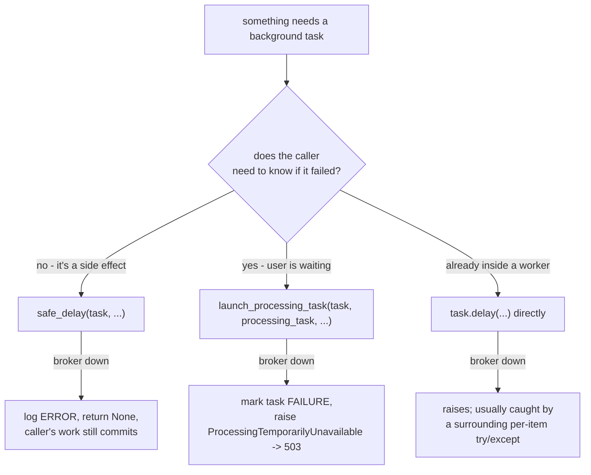
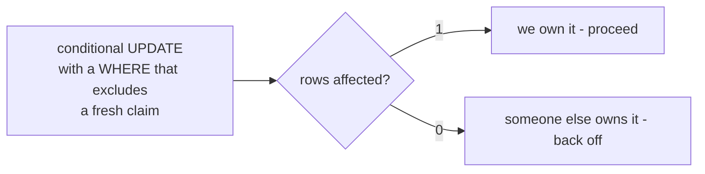

# Async and infrastructure — Celery, Redis, and the sync/worker boundary

> Part of the [backend reference](README.md). Related: [project-config.md](project-config.md), [operations.md](operations.md), [integrations.md](integrations.md).

## In plain terms

Some jobs are too slow to do while a user waits: reading a scanned exam, marking thirty submissions, rendering a PDF. Those are handed to **background workers** through a queue held in Redis. Redis also does three other jobs here: it caches expensive answers so they don't have to be recomputed, it holds short-lived locks that stop two things happening at once, and it tracks who is currently online. The single most important idea in this document: Redis will sometimes hand the **same** job to a second worker, believing the first died. Because these jobs spend real money, several parts of the app defend against that with a database-level *claim* — a job checks out the work before starting, and a second worker that finds it checked out backs off.

---

## Celery configuration

| Setting | Value | Reasoning |
|---|---|---|
| `CELERY_BROKER_URL` | the environment's Redis URL | same instance as the cache |
| `CELERY_RESULT_BACKEND` | same Redis | |
| `CELERY_ACCEPT_CONTENT` / `TASK_SERIALIZER` / `RESULT_SERIALIZER` | `json` | |
| `CELERY_TIMEZONE` | `UTC` | matches `TIME_ZONE` |
| `CELERY_TASK_ACKS_LATE` | `True` | a task is acked after it finishes, so a killed worker's message is redelivered |
| `CELERY_WORKER_PREFETCH_MULTIPLIER` | `1` | one task in flight per worker — correct for long tasks |
| `CELERY_RESULT_EXPIRES` | `3600` (1h) | see the reconciliation caveat below |
| `CELERY_BROKER_CONNECTION_RETRY_ON_STARTUP` | `True` | *"relevant specifically for a worker/beat process that starts while Redis is briefly unavailable, e.g. during a Redis plugin restart on Railway"* ([settings.py:772-778](../../AutoGrader/settings.py#L772-L778)) |
| `CELERY_BROKER_TRANSPORT_OPTIONS` | `{"visibility_timeout": 3600}` | **the critical one** |
| `CELERY_BEAT_SCHEDULER` | `django_celery_beat.schedulers:DatabaseScheduler` | schedule lives in Postgres, not a file |

The app is built in [AutoGrader/celery.py](../../AutoGrader/celery.py) with `autodiscover_tasks()`. Because `AutoGrader` is not an installed app, `beat_health` and `celery_signals` are imported **explicitly** at the bottom of that file — autodiscovery would never find them.

### The visibility timeout, and why it was raised

```
visibility_timeout                = 3600s   (1 hour)
GRADING_TASK_TIME_LIMIT_SECONDS   = 1500s   (25 min)
GRADING_CLAIM_STALE_AFTER         = 1800s   (30 min)
```

With `acks_late=True`, Redis redelivers a task's message to another worker once `visibility_timeout` elapses without an ack — **it assumes the original worker died** ([settings.py:486-502](../../AutoGrader/settings.py#L486-L502)).

> *"A grading run (several sequential AI calls, each with its own retries) can legitimately take longer than the previous 600s value, which caused Redis to redeliver a still-running grading task to a second worker, **double-billing the teacher**."*

It was raised well above the grading task's own hard kill point *"so a healthy, still-running task is never mistaken for a dead one."* But the setting is explicit that it is **not** the correctness guarantee:

> *"The grading claim in `students.services._claim_submission_for_grading` is the actual correctness guarantee against duplicate execution — this setting just keeps ordinary redeliveries rare in the first place, since **even a caught duplicate wastes a worker slot and an API round trip** before being skipped."*

---

## Task inventory

**39 tasks.** Every one that costs money or mutates billing state uses either `max_retries=0` or a claim.

### `AutoGrader/`

| Task | Retries | Limits | Trigger |
|---|---|---|---|
| `AutoGrader.tasks.send_email_task` | `max_retries=3`, `default_retry_delay=30` | — | called everywhere, usually via `safe_delay` |
| `AutoGrader.beat_health.check_beat_health` | none | — | Beat, every 15 min |

### `assignments/` — the grading pipeline

| Task | Retries | Limits | Notes |
|---|---|---|---|
| `grade_engine_async` | **none** | soft 1440s / hard 1500s | protected by the DB grading claim, not retries |
| `extract_assignment_background_task` | none | none | |
| `update_assignment_background_task` | none | none | |
| `extract_answer_background_task` | none | none | |
| `format_grade` | none | none | |
| `formatted_grade_async` | none | none | not even `bind=True` |
| `upload_answers_engine_async` | `max_retries=3` | soft 2700s / hard 3000s | derived from `MAX_PAGE_COUNT` — see below |
| `upload_assignment_async` | `max_retries=3` | soft 1800s / hard 2100s | |
| `grade_batch_async` | `max_retries=3` | none | fans out to `grade_engine_async` |
| `auto_grade_due_assignment` | none | none | one-off `PeriodicTask` at the due date |
| `send_assignment_due_reminder` | none | none | one-off `PeriodicTask`, 24h and 1h before |
| `send_new_assignment_posted_notification` | none | none | publish signal |
| `prerender_assignment_pdfs` | **`max_retries=5`, delay 60s** | none | retries **only** on `PDFRendererBusy` |
| `grade_all_submissions` | none | none | **dead** — kept only in case a Beat row references it |

### `billing/`

| Task | Retries | Schedule |
|---|---|---|
| `process_license_renewals` | **0** | daily 00:00 |
| `process_annual_plan_credit_grants` | **0** | daily 02:00 |
| `process_license_monthly_credit_refreshes` | **0** | daily 03:00 |
| `reconcile_subscription_renewals` | **default** — the only one | daily 04:00 |
| `cleanup_expired_credit_buckets` | **0** | daily 05:00 |
| `sweep_stale_stripe_events` | **0** | hourly :15 |
| `expire_active_trials` | **0** | every 6h |
| `nightly_stripe_live_qa` | **0** | daily 01:00 |
| `run_live_qa_console_job` | **0** | on demand |

`max_retries=0` is the billing house style: *"a failure here is a signal to investigate, not a transient to paper over"*, and for the QA task specifically, *"retrying would create a second set of Stripe objects while the first set is still being diagnosed."*

### `dashboard/`, `ai_processor/`, `classrooms/`, `users/`

| Task | Retries | Schedule |
|---|---|---|
| `dashboard.record_concurrent_users` | none | **every 60s** |
| `dashboard.send_weekly_course_summaries` | none | weekly |
| `dashboard.send_weekly_student_summaries` | none | weekly |
| `dashboard.send_weekly_school_admin_summaries` | none | weekly |
| `dashboard.send_at_risk_student_alerts` | none | daily |
| `dashboard.send_teacher_inactivity_alerts` | none | daily |
| `dashboard.send_teacher_first_course_milestone_alert` | none | signal, on commit |
| `ai_processor.nightly_grading_benchmark_replay` | **0** | daily 01:30 |
| `ai_processor.weekly_grading_benchmark_live` | **0** | weekly 03:00 |
| `classrooms.student_summary_async` | **none, no time limit** | on demand — see the warning in [classrooms.md](classrooms.md#ai-student-summary) |
| `users.sync_user_to_mailerlite` | `max_retries=3`, delay 60s | on activation |
| `users.sample_periodic_task` | none | **dead code** — never scheduled, never called |

`students/tasks.py` is **entirely commented out**.

### Derived time limits

`upload_answers_engine_async`'s 2700/3000 is not arbitrary ([assignments/tasks.py:670-678](../../assignments/tasks.py#L670-L678)):

```
PDFService.MAX_PAGE_COUNT (300) × ~8.35s/page ≈ 2506s worst case
    < time_limit (3000s)  < visibility_timeout (3600s)
```

`~8.35s/page` is **mean + 2σ** of measured per-call time at `ANSWERS_EXTRACTION_PAGES_PER_CHUNK = 3`. The chain is explicit: *"This number is derived from `ANSWERS_EXTRACTION_PAGES_PER_CHUNK`'s value, not independent of it — **re-derive both together if either changes**"* ([ai_processor/services.py:4637-4649](../../ai_processor/services.py#L4637-L4649)). A task running past the visibility timeout *"risks the same Redis-redelivery/double-execution failure documented next to that setting."*

---

## Beat schedule

18 entries in `CELERY_BEAT_SCHEDULE` ([settings.py:798-906](../../AutoGrader/settings.py#L798-L906)), stored in Postgres via `DatabaseScheduler`.

```
:15 hourly   sweep-stale-stripe-events
every minute record-concurrent-users
every 15 min check-beat-health
every 6h     expire-active-trials
00:00        process-license-renewals
01:00        nightly-stripe-live-qa
01:30        nightly-grading-benchmark-replay
02:00        process-annual_plan-credit-grants
03:00        process-license-monthly-credit-refreshes
03:00 weekly weekly-grading-benchmark-live
04:00        reconcile-subscriptions-daily
05:00        cleanup-expired-credit-buckets
06:30        send-at-risk-student-alerts
06:45        send-teacher-inactivity-alerts
07:00 weekly send-weekly-{course,student,school-admin}-summaries
```

The ordering is deliberate: licence renewals (00:00) run before the credit grants and refreshes that depend on them (02:00, 03:00), and reconciliation (04:00) runs after everything it might need to correct. QA jobs sit at 01:00 and 01:30 to *"keep clear of the other billing jobs"*.

Three one-off `PeriodicTask` families are created dynamically per assignment ([assignments.md](assignments.md#scheduled-tasks-created-per-assignment)) — `assignment-due-reminder-<id>-{24,1}h`, `auto-grade-assignment-<id>`, `grade-batch-<id>.<uuid4>` — all `one_off=True` on a `ClockedSchedule`.

> `ClockedSchedule` rows are `get_or_create`d and **never cleaned up**. They accumulate one row per distinct timestamp ever scheduled. Harmless but unbounded.

### Beat health

`BEAT_HEALTH_EXPECTATIONS` ([settings.py:919-940](../../AutoGrader/settings.py#L919-L940)) maps each task name to `(expected_interval, alert_threshold)`, **hand-maintained rather than derived from the crontabs** — *"computing 'next expected fire time' generically from an arbitrary crontab is real work for schedules this project doesn't need the generality of"* ([settings.py:909-918](../../AutoGrader/settings.py#L909-L918)).

Alert thresholds are deliberately well above the interval *"so a routine few-minutes scheduling delay never fires a false alarm"*: 1 min → 10 min, 1 hour → 3 hours, 6 hours → 15 hours, daily → 2 days, weekly → 10 days.

Two layers, because neither alone is sufficient ([project-config.md](project-config.md#why-two-layers-of-beat-monitoring)):

| Layer | Detects | Blind to |
|---|---|---|
| `check_beat_health` (a Beat task) | one schedule entry stopping | **Beat being fully dead** — it would not run either |
| `GET /api/v1/health/beat` (the web process) | Beat being dead, by reading the watchdog's own `last_run_at` | needs an external monitor to poll it |

Neither detects a **duplicated** Beat: two Beat processes both update `last_run_at`, so the gap check looks healthy while every task fires twice. Detect that via duplicate side effects.

**16 of 18 schedule entries are in the expectations table.** Keeping them in step is a manual discipline the comment asks for explicitly.

---

## Redis usage

One Redis instance serves four purposes. `KEY_PREFIX = "gaplus"` ([settings.py:1170](../../AutoGrader/settings.py#L1170)) namespaces the *cache* keys so that a wildcard `delete_pattern("*user*")` *"can only ever match cache entries — never Celery broker/result keys living in the same Redis instance."*

`DJANGO_REDIS_SCAN_ITERSIZE = 100_000` ([settings.py:1174-1178](../../AutoGrader/settings.py#L1174-L1178)) raises django-redis's default SCAN COUNT of 10, because *"Signal handlers call `delete_pattern` on every user/course/enrollment save, so on a remote Redis that default turns each save into seconds of scanning."*

### 1. Broker and result backend

Celery's own keys. `CELERY_RESULT_EXPIRES = 3600` means a task result vanishes after an hour — which matters for `normalize_processing_task_status`: **a tracked task left `PENDING` longer than an hour can never be reconciled from `AsyncResult` and stays `PENDING` forever** ([students-and-submissions.md](students-and-submissions.md#reconciliation-with-celery)).

### 2. Caches

| Key pattern | TTL | Written by |
|---|---|---|
| `{model}s:user_id__{uid}:instance_id__{pk}` | `CACHE_TTL` (300s) | `UserCacheMixin.retrieve` |
| `{model}s:user_id__{uid}:query__{md5}` | 300s | `UserCacheMixin.list` |
| `user:user_id__{uid}` | 300s | `users/me` |
| `settings:user_id__{uid}:view__my_settings` | 300s | `my_settings` |
| `courses:user_id__{uid}` | 300s | `my-courses` |
| `studentsubmissions:user_id__{uid}:instance_id__{pk}` | 300s | submission detail |
| `superadmins:user_id__{uid}:view__{name}` | **900s** | super-admin dashboard (8 views) |
| `schooladmins:user_id__{uid}:view__{name}` | 900s | school-admin dashboard |
| `teacher_performance_{school}_{page}_{size}` | 900s | school-admin teachers |
| `teacher_detail_{school}_{teacher}` | 900s | school-admin teacher detail |
| `assignment_activity_{school}_{year}` | 900s / 3600s | activity chart |
| `department_overview_{school}` | 900s | course overview chart |
| `assignments:pdf:v1:{id}:{view}:{updated_at}` | **86400s** | [pdf-pipeline.md](pdf-pipeline.md) |
| `grading_answer_cache:{sha256}` | **259200s (3d)** | [ai-processor.md](ai-processor.md#tier-05--the-cross-student-cache) |
| `healthcheck` | 10s | `/health` |

Two caches are **content-addressed** — the PDF cache keys on `updated_at`, the grading cache on a hash of the question and answer — so **neither needs manual invalidation**. Everything else is invalidated by wildcard sweeps.

### 3. Wildcard invalidation

Five apps register `post_save`/`post_delete` receivers that call `cache.delete_pattern` on 5–12 patterns each: `users`, `classrooms`, `assignments`, `students`, and the manual calls in `publish_grade` / `mark_reviewed` / `_mark_grading_claim_failed`.

**Three of those modules define their own local `delete_cache_patterns`** ([classrooms/signals.py:14](../../classrooms/signals.py#L14), [students/signals.py:8](../../students/signals.py#L8), [assignments/signals.py:18](../../assignments/signals.py#L18)) that shadows the batching helper in [AutoGrader/cache_utils.py](../../AutoGrader/cache_utils.py) and calls `delete_pattern` immediately in a loop.

The consequence is concrete and worth measuring before optimising anything else:

| Operation | Keyspace SCANs |
|---|---|
| One user save | 9 |
| One submission save | 7 (+ a locked final-grade recalculation) |
| One course save | 12 |
| Bulk-importing 100 students | **~2,000** |
| Batch-grading 30 submissions | **~210** |

`AutoGrader.cache_utils.batched_cache_invalidation()` exists precisely for this and is **not used by any of them**.

Note also that `students/signals.py` clears `assignments:*`, which **includes the rendered-PDF cache** — so every submission save evicts cached assignment PDFs. Harmless for correctness (the timestamped key is the real guarantee) but it makes the PDF cache far less effective on a busy assignment than its 1-day TTL suggests.

### 4. Locks and presence

| Key | Kind | TTL | Purpose |
|---|---|---|---|
| `billing:planchange:{user_id}` | `cache.add` lock | `_LOCK_TIMEOUT_SECONDS` | serialise individual plan changes across multiple Stripe calls |
| `billing:...mutation:{user_id}` | `cache.add` lock | `_BILLING_MUTATION_LOCK_TIMEOUT_SECONDS` | serialise billing mutations ([billing/views.py:732](../../billing/views.py#L732)) |
| licence overage lock | `cache.add` lock | 30s | serialise overage grants |
| `active_user:{user_type}:{id}` | heartbeat | **300s** | presence |
| `online_users_set` | **Redis SET, no TTL** | — | presence index |
| Stripe portal configuration id | cache | — | avoid recreating the portal config |

`online_users_set` only ever grows from `UserActivityMiddleware` ([users/middleware.py:41](../../users/middleware.py#L41)); the **only** thing that trims it is `cleanup_expired_users`, called once a minute by `record_concurrent_users` ([users/services.py:97-123](../../users/services.py#L97-L123)). If that task stops, the set grows unbounded and the reported concurrency inflates forever — which is why its Beat-health threshold is the tightest in the table.

`cleanup_expired_users` does one `has_key` per member, i.e. **O(n) round trips per minute**.

**Single-flight is *not* in Redis.** The PDF renderer's in-flight dict is a process-local `threading.Lock` + dict ([assignments/pdf_cache.py:143-145](../../assignments/pdf_cache.py#L143-L145)), deliberately: *"Making it exactly 1 cluster-wide would need a distributed lock, which brings failure modes (expiry, a holder that dies mid-render) far worse than the duplicate work it would save."*

---

## Dispatch: three ways, on purpose


*Caption: `AutoGrader/dispatch.py` exists to make this distinction explicit rather than accidental.*

Both wrappers classify an outage with the same `BROKER_UNAVAILABLE_ERRORS` tuple ([AutoGrader/dispatch.py:38-44](../../AutoGrader/dispatch.py#L38-L44)) — redis `ConnectionError`/`TimeoutError`, kombu `OperationalError`, builtin `ConnectionError`/`TimeoutError` — *"so 'what counts as a broker outage' can't drift between the silent and the loud path."* Anything else propagates, because a malformed `.delay()` call is a bug, not an outage.

**`transaction.on_commit` is used wherever a task reads a row the caller just wrote:**

| Site | Why |
|---|---|
| `classrooms.signals` first-course alert | the task looks the course up by id |
| `assignments.signals` publish notification + prerender | same |
| `students.services` post-grading follow-ups | *"so `formatted_grade_async` can never finish first and have its `formatted_grade` write clobbered by this function's own full-row save"* |
| licence invitation emails | the teacher row must exist |

---

## Idempotency

Four independent mechanisms, all built on the same conditional-UPDATE idiom.


*Caption: the loser's UPDATE re-evaluates its WHERE against the winner's committed state and matches zero rows.*

| Mechanism | Claim field | Stale after | Documented in |
|---|---|---|---|
| Grading | `StudentSubmission.grading_state` + `grading_started_at` | 1800s | [students-and-submissions.md](students-and-submissions.md#the-grading-claim) |
| Stripe webhooks | `StripeEvent.status` + `claimed_at` | 400s | [billing-stripe.md](billing-stripe.md#the-claim) |
| Background tasks | `BackgroundProcessingTask.status` terminal guard | — | [students-and-submissions.md](students-and-submissions.md#status-updates) |
| One-shot notifications | `admin_grading_notified_at`, `is_published`, `needs_review` | — | conditional UPDATE as a one-way latch |

**Both staleness windows are derived from a hard kill point, not merely set near one:**

| Window | Derived from | Reasoning |
|---|---|---|
| `GRADING_CLAIM_STALE_AFTER` = 1800s | `GRADING_TASK_TIME_LIMIT_SECONDS` (1500) + 300 | *"a worker that somehow ran past the kill point is dead by the time this window elapses"* |
| `STRIPE_EVENT_CLAIM_STALE_AFTER` = 400s | gunicorn `--timeout` (100) + 300 | same, **and CI-enforced** by `check_gunicorn_timeout_sync.py` |

Both docstrings warn that a *tight* window is the dangerous direction: it lets a slow-but-alive run be stolen and duplicated.

The Stripe claim adds a **fencing token** — the terminal write filters on `claimed_at=claim_token`, so a slow original cannot stomp a thief's result. The grading claim has no equivalent, but does not need one: `grade_engine` refreshes the in-memory instance from the DB right after claiming, so its own final save cannot write stale claim fields.

**Idempotency also covers refunds:** `refund_credits` only considers `is_refunded=False` logs and locks both the logs and their buckets, so a redelivered caller *"blocks on the first's row locks, then re-reads and finds nothing left to do"* ([billing-core.md](billing-core.md#subscriptionservicerefund_creditstask_id-reason)).

---

## Sync vs worker

| Runs synchronously in the request | Runs in a worker |
|---|---|
| `POST assignments` (blocking AI extraction) | `assignments/create-async` |
| `PATCH assignments/<pk>` with `raw_input` | `assignments/<pk>/update-async` |
| `POST assignments/upload` (blocking, **no credit check**) | `assignments/upload-async` |
| `POST assignments/generate/<course_id>` | — |
| `PATCH submissions/<pk>` (blocking AI extraction) | — |
| `POST submissions/<pk>/grade` | `submissions/<pk>/grade-async` |
| `download-pdf` (Chromium render) | `prerender_assignment_pdfs` |
| every dashboard read (incl. custom AI prompt) | — |
| every Stripe webhook handler | — |

**The pattern to know:** most user-initiated AI work exists in both a sync and an async variant, side by side. The sync ones hold a gunicorn thread for the entire AI call (which retries up to 3 times internally, with no view-side timeout). Practical implications:

- gunicorn runs 9 workers × 4 threads = **36 concurrent request slots** ([Dockerfile:86](../../Dockerfile#L86)). A handful of concurrent sync AI calls consumes a meaningful fraction of them.
- gunicorn's `--timeout 100` kills a request that exceeds it, and `except Exception` **cannot catch that** — which is exactly the hole the Stripe event ledger was redesigned around.
- `POST assignments/upload` skips `HasCreditBalance` entirely, unlike its async twin.

> **UNVERIFIED:** whether the sync variants are deprecated-but-kept for an older frontend, or still primary. No comment says. To resolve: check frontend call sites, or add request logging to both.

**Webhooks are synchronous by necessity** — Stripe needs the status code. That is why the handlers must keep their outbound Stripe calls *outside* any DB transaction, and why a rising 409 rate is a signal that they have not.

**The PDF renderer is a third shape:** synchronous to the caller, but the render itself runs on a dedicated asyncio thread with its own concurrency bound and load shedding ([pdf-pipeline.md](pdf-pipeline.md#concurrency-model)). It is the only place in the codebase that refuses work rather than queueing it.

---

## Correlation IDs

One id spans an HTTP request, its logs, its Sentry event, and every task it dispatches — including tasks dispatched by a worker while processing an earlier task ([project-config.md](project-config.md#correlation-ids)).

Three Celery signals do the propagation ([AutoGrader/celery_signals.py](../../AutoGrader/celery_signals.py)):

| Signal | Runs in | Effect |
|---|---|---|
| `before_task_publish` | whoever calls `.delay()` | stamps the current id onto the message headers |
| `task_prerun` | the worker | reads it back and sets the contextvar |
| `task_postrun` | the worker | **resets it** |

The reset matters because prefork reuses one OS process across many tasks: *"a task with no request id (e.g. a periodic/beat task) run right after a task that had one would inherit the previous task's id."*

This covers every dispatch uniformly — direct `.delay()`, `safe_delay`, `launch_processing_task`, and task-to-task chaining — **without editing any call site**.

---

## Failure modes & recovery

| Failure | Effect | Recovery |
|---|---|---|
| Redis down | `/health` → 503; `safe_delay` dispatches **silently dropped**; user-initiated processing → 503; **all caching off**; **all locks unavailable** | workers reconnect on startup; dropped `safe_delay` work is **lost, not queued** |
| Redis restarted (data lost) | queued tasks gone; caches cold; presence set empty | tasks are lost — nothing replays them |
| Worker killed mid-task | message redelivered after 1h; the claim makes it safe | automatic |
| Worker killed holding a grading claim | submission un-gradable for **30 min** | automatic after the window; **no manual release endpoint exists** |
| Worker killed holding a Stripe claim | stolen after 400s (WARNING) or swept hourly | automatic |
| Beat dies | all scheduled work stops | `/health/beat` → 503 for an external monitor |
| Beat duplicated | **every task fires twice** | not detected by either health layer — look for duplicate side effects |
| `record_concurrent_users` stops | `online_users_set` grows unbounded | Beat health at 10 min |
| Task result expires before reconciliation | tracked task stuck `PENDING` forever | manual DB fix |
| Task exceeds `visibility_timeout` | redelivered while still running | the claim catches it — but re-derive the limits |
| gunicorn `--timeout` raised alone | **Stripe claims go stale too early** | `check_gunicorn_timeout_sync.py` fails CI |
| Bulk operation floods Redis with SCANs | slow saves, Redis CPU | use `batched_cache_invalidation` |
| `ClockedSchedule` rows accumulate | unbounded row growth | prune manually |

---

## Configuration

| Var | Environment | Effect |
|---|---|---|
| `REDIS_LOCAL_URL` / `REDIS_DEV_URL` / `REDIS_PROD_URL` | one per `ENVIRONMENT` | **broker, result backend, and cache all read the same choice** |

Note the fallback in the ternary resolves to `REDIS_PROD_URL` for any unrecognised `ENVIRONMENT` ([settings.py:471-480](../../AutoGrader/settings.py#L471-L480)) — a typo'd value on a staging box reaches **production Redis**.

| Constant | Value | Where |
|---|---|---|
| `visibility_timeout` | 3600 | settings |
| `CELERY_RESULT_EXPIRES` | 3600 | settings |
| `CACHE_TTL` | 300 | settings |
| `DJANGO_REDIS_SCAN_ITERSIZE` | 100,000 | settings |
| `KEY_PREFIX` | `gaplus` | settings |
| `BEAT_WATCHDOG_MAX_GAP_MINUTES` | 45 | `AutoGrader/health.py:94` |
| `GRADING_TASK_TIME_LIMIT_SECONDS` | 1500 | `students/services.py:126` |
| `GRADING_CLAIM_STALE_AFTER` | 1800 | `students/services.py:135` |
| `WEBHOOK_REQUEST_HARD_TIMEOUT_SECONDS` | 100 | `billing/webhooks.py:74` — **must equal gunicorn's `--timeout`** |
| `STRIPE_EVENT_CLAIM_STALE_AFTER` | 400 | `billing/webhooks.py:89` |
| `ACTIVE_WINDOW_SECONDS` | 300 | `users/middleware.py:9` |

Schedule timing vars (`WEEKLY_COURSE_SUMMARY_*`, `AT_RISK_ALERT_*`, `TEACHER_INACTIVITY_ALERT_*`, `GRADING_BENCHMARK_DAY_OF_WEEK`) are covered in [dashboard.md](dashboard.md#configuration) and [ai-quality-harness.md](ai-quality-harness.md#configuration).

### The chain to re-derive together

If you change any one of these, check all of them:

```
ANSWERS_EXTRACTION_PAGES_PER_CHUNK  →  PDFService.MAX_PAGE_COUNT
                                    →  upload_answers_engine_async time_limit
                                    →  CELERY visibility_timeout

GRADING_TASK_TIME_LIMIT_SECONDS     →  grade_engine_async soft/hard limits
                                    →  GRADING_CLAIM_STALE_AFTER
                                    →  CELERY visibility_timeout

gunicorn --timeout                  →  WEBHOOK_REQUEST_HARD_TIMEOUT_SECONDS  (CI-enforced)
                                    →  STRIPE_EVENT_CLAIM_STALE_AFTER
```

Every one of these relationships is stated in a comment at both ends. Only the last is enforced by a script.
