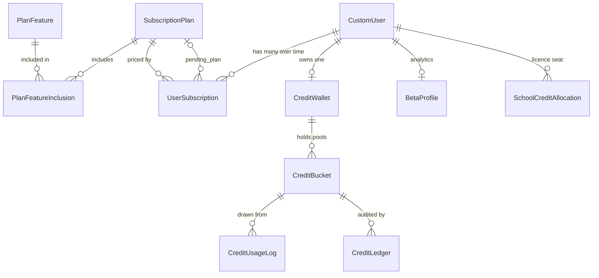
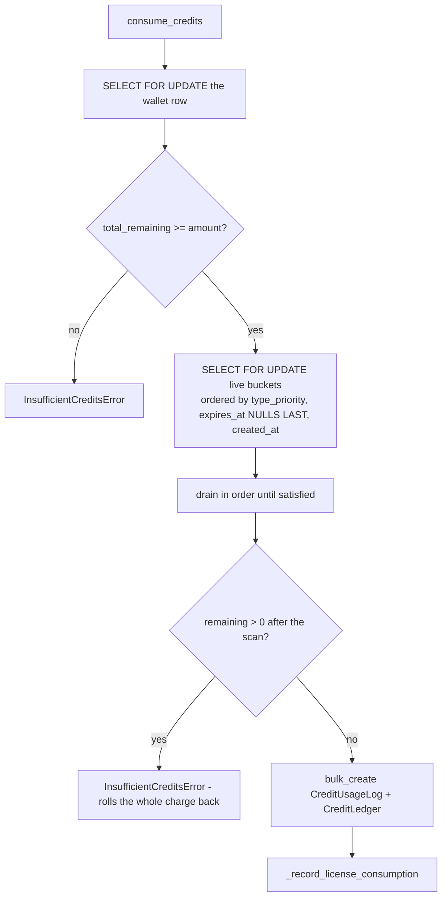
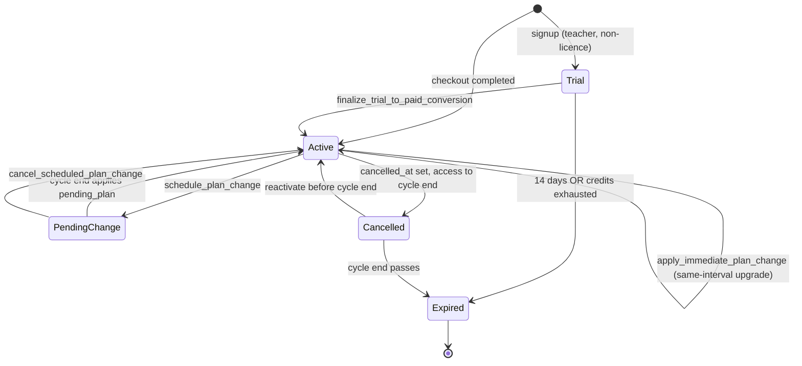
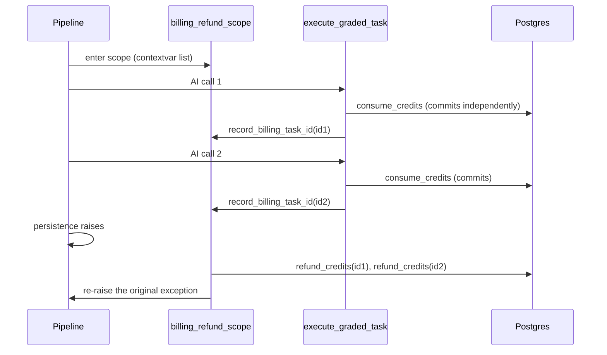

# Billing core — plans, credits, wallets, subscriptions, refunds

> Part of the [backend reference](README.md). Stripe integration is in [billing-stripe.md](billing-stripe.md); school licences in [billing-licenses.md](billing-licenses.md); the QA harness in [billing-qa-harness.md](billing-qa-harness.md). Related: [ai-processor.md](ai-processor.md), [users-and-auth.md](users-and-auth.md).

## In plain terms

Everything the AI does costs **credits**, and this app is the accounting system for them. A teacher's credits live in a **wallet**, which holds several separate pools called **buckets** — this month's allowance, credits carried over from last month, free-trial credits, extra blocks they bought, and gifts from support. When something is graded, credits are drawn from those pools in a deliberate order designed to waste as little as possible. Every movement is written to an immutable ledger, so any balance can be explained after the fact. And because a single grading run makes several billed calls, there is a mechanism that refunds *all* of them if the run fails partway through — the user is never charged for a grade they did not get.

**One number to remember: credits are stored multiplied by 1,000.** A plan advertised as "5,000 credits" stores `5_000_000`. The `display_*` properties do the division.

---

## Entry points

All paths relative to `/api/v1/`. `DefaultRouter(trailing_slash=False)` ([billing/urls.py:34](../../billing/urls.py#L34)).

| Base path | Viewset | Covered in |
|---|---|---|
| `subscription-plans` | `SubscriptionPlanViewSet` | here |
| `user-subscriptions` | `UserSubscriptionViewSet` | here |
| `credit-wallets` | `CreditWalletViewSet` | here |
| `credit-buckets` | `CreditBucketViewSet` | here |
| `credit-ledgers` | `CreditLedgerViewSet` | here |
| `credit-usage-logs` | `CreditUsageLogViewSet` | here |
| `subscription` | `SubscriptionManagementViewSet` | [billing-stripe.md](billing-stripe.md) |
| `analytics`, `beta-profile`, `beta-chart` | beta analytics | here |
| `invoices` | `BillingTransactionViewSet` | [billing-stripe.md](billing-stripe.md) |
| `payment-methods` | `PaymentMethodViewSet` | [billing-stripe.md](billing-stripe.md) |
| `admin/credits` | `AdminCreditManagementViewSet` | here |
| `license-subscriptions`, `school-credit-allocations`, `license-overage-offline-requests` | licence | [billing-licenses.md](billing-licenses.md) |
| `stripe/webhooks`, `stripe/webhooks/thin` | webhooks | [billing-stripe.md](billing-stripe.md) |
| `qa/time-travel`, `qa/console*` | QA harness | [billing-qa-harness.md](billing-qa-harness.md) |

### Celery tasks

| Task | Schedule | Retries | Covered in |
|---|---|---|---|
| `process_license_renewals` | daily 00:00 | **0** | [billing-licenses.md](billing-licenses.md) |
| `process_annual_plan_credit_grants` | daily 02:00 | **0** | here |
| `process_license_monthly_credit_refreshes` | daily 03:00 | **0** | [billing-licenses.md](billing-licenses.md) |
| `reconcile_subscription_renewals` | daily 04:00 | default | [billing-stripe.md](billing-stripe.md) |
| `cleanup_expired_credit_buckets` | daily 05:00 | **0** | here |
| `sweep_stale_stripe_events` | hourly :15 | **0** | [billing-stripe.md](billing-stripe.md) |
| `expire_active_trials` | every 6h | **0** | here |
| `nightly_stripe_live_qa` | daily 01:00 | **0** | [billing-qa-harness.md](billing-qa-harness.md) |
| `run_live_qa_console_job(run_id)` | on demand | **0** | [billing-qa-harness.md](billing-qa-harness.md) |

`max_retries=0` is the house style for billing tasks — a failure is a signal to investigate, not a transient to paper over. All seven scheduled ones are in `BEAT_HEALTH_EXPECTATIONS`.

### Management commands

| Command | Purpose |
|---|---|
| `seed_plan_features` | populate `PlanFeature` / `PlanFeatureInclusion` |
| `backfill` | general backfill |
| `backfill_billing_transactions` | see [billing-stripe.md](billing-stripe.md) |
| `backfill_receipt_urls` | see [billing-stripe.md](billing-stripe.md) |
| `replay_stripe_events` | see [billing-stripe.md](billing-stripe.md) |
| `audit_email_track_separation` | see [users-and-auth.md](users-and-auth.md) |
| `audit_school_admins` | see [billing-licenses.md](billing-licenses.md) |
| `run_stripe_live_qa` | see [billing-qa-harness.md](billing-qa-harness.md) |

---

## The credit unit

```
CONVERSION_FACTOR = 1000
```
([billing/models.py:19](../../billing/models.py#L19))

Everything in the database is **raw** credits. Everything shown to a user is raw ÷ 1000.

| Property | Rounding | Reasoning |
|---|---|---|
| `CreditWallet.display_balance` | `math.floor` | *"We use floor to be safe so we never over-promise"* ([models.py:1043-1049](../../billing/models.py#L1043-L1049)) |
| `CreditWallet.display_overage_balance` | `math.ceil` | *"We use ceil to be safe so we never under-promise"* ([models.py:1051-1057](../../billing/models.py#L1051-L1057)) |
| `SubscriptionPlan.display_monthly_credits` / `display_max_bank` / `display_overage_block_size` | — | [models.py:400-418](../../billing/models.py#L400-L418) |

Raw credits are consumed at **1 credit per provider token** — `execute_graded_task` charges `response.usage.total_tokens` directly ([ai-processor.md](ai-processor.md#pre-charge-estimate-post-charge-actual)). So a "5,000 credit" plan is 5,000,000 tokens.

`ManualCreditService.MAX_STORABLE_RAW_CREDITS = 2_147_483_647` ([services.py:1901](../../billing/services.py#L1901)) — the 32-bit signed integer ceiling, i.e. ~2.1 million display credits per grant.

---

## Data model

### Plan catalogue

**`SubscriptionPlan`** ([models.py:229-418](../../billing/models.py#L229-L418)) — the priced product.

| Field | Type | Meaning |
|---|---|---|
| `id` | UUID | PK |
| `name` | CharField, `PlanType` | the catalogue key |
| `display_name`, `tagline` | CharField | marketing copy |
| `category` | `PlanCategory` | `INDIVIDUAL` / `LICENSE` |
| `tier` | `PlanTier` | `STANDARD`/`PRO`/`POWER`/`BETA`/`CUSTOM`/`TRIAL` |
| `interval` | `BillingInterval` | `MONTHLY`/`ANNUAL`/`NONE` |
| `product_id`, `stripe_price_id`, `stripe_overage_price_id` | CharField | Stripe identifiers |
| `price_cents` | Decimal | |
| `monthly_credits` | PositiveInt | **raw** |
| `carry_over_percent` | Decimal | share of unused credits that may roll over |
| `carry_over_max` | PositiveInt | |
| `max_bank` | PositiveInt, nullable | **ceiling on total live banked balance** |
| `carry_over_expiry_months` | PositiveSmallInt | how long a carry-over bucket lives |
| `overage_block_size` | PositiveInt | raw credits per purchasable block |
| `overage_block_price` | Integer | cents |
| `max_overage_blocks` | PositiveSmallInt | per cycle |
| `features` | M2M → `PlanFeature` through `PlanFeatureInclusion` | |
| `highlight` | `PlanHighlight` | `BEST_VALUE` / `GREAT_VALUE` |
| `is_contact_sales` | Boolean | no self-serve checkout |
| `is_active` | Boolean | |

**`PlanType`** ([models.py:32-49](../../billing/models.py#L32-L49)) — complete enumeration:

| Individual | Licence |
|---|---|
| `STANDARD`, `PRO`, `POWER`, `BETA` (*internal only, not in spec*), `CUSTOM`, `STANDARD_ANNUAL`, `PRO_ANNUAL`, `POWER_ANNUAL`, `TRIAL` | `PRO_LICENSE`, `POWER_LICENSE`, `CUSTOM_LICENSE_STARTER`, `CUSTOM_LICENSE_MID`, `CUSTOM_LICENSE_HIGH` |

**`PLAN_TIER_HIERARCHY = [STANDARD, PRO, POWER]`** ([models.py:138-142](../../billing/models.py#L138-L142)) — *"A higher rank means a more valuable/featureful tier, **independent of price**."*

`get_tier_rank(tier)` raises a **deliberately explicit** `ValueError` for a tier not in the list ([models.py:145-159](../../billing/models.py#L145-L159)) naming the fix: *"Add it to `PLAN_TIER_HIERARCHY` in models.py if this tier should be comparable."* So `BETA`, `CUSTOM`, and `TRIAL` have **no upgrade/downgrade ranking** — any code path that tries to compare them fails loudly rather than guessing a direction.

**`PlanFeature`** ([models.py:162-190](../../billing/models.py#L162-L190)): `key` (`PlanFeatureKey`), `label`, and **`is_gating_feature`** — the flag that separates a code-enforced gate from a display-only catalogue label. **`PlanFeatureInclusion`** ([models.py:193-226](../../billing/models.py#L193-L226)) is the through-model: `plan`, `feature`, `included`, `display_order`.

**`PlanFeatureKey`** ([models.py:81-109](../../billing/models.py#L81-L109)) has 15 values split into gating candidates (`ADVANCED_*_ANALYTICS`, `AI_PROMPT_ASSIGNMENT_CREATION`, `AI_PROMPT_ANALYTICS_SUMMARY`, `PRE_SCHEDULED_GRADING`, `AI_EMAIL_FEEDBACK`, `CREDIT_ROLLOVER_25`) and explicitly *"display-only / catalogue labels"* (`UNLIMITED_COURSES`, `INVITE_STUDENTS_UPLOAD`, `BATCH_GRADING`, `BASIC_INSIGHTS`, `ADMIN_MANAGED_BILLING`, `SHARED_CREDIT_POOL`, `DEDICATED_SUPPORT`).

### `UserSubscription` ([models.py:420-588](../../billing/models.py#L420-L588))

| Field | Type | Meaning |
|---|---|---|
| `user`, `plan` | FK | note: **FK, not OneToOne** — a user accumulates historical subscription rows |
| `is_active` | Boolean | only one should be `True` at a time |
| `billing_cycle_start` / `_end` | DateTime | the **local** mirror of Stripe's period |
| `is_trial`, `trial_end` | Boolean / DateTime | |
| `auto_renew` | Boolean | |
| `cancelled_at` | DateTime | cancellation requested; access continues to `billing_cycle_end` |
| `pending_plan` | FK, nullable | the plan that takes effect at cycle end |
| `pending_change_type` | `PendingChangeType` | `DOWNGRADE` / `UPGRADE_DEFERRED` / `LATERAL_DEFERRED` |
| `pending_change_note` | TextField | user-facing explanation |
| `stripe_schedule_id` | CharField | the Stripe `SubscriptionSchedule` implementing the pending change |
| `stripe_subscription_id`, `stripe_customer_id`, `stripe_status` | CharField | |
| `next_credit_grant_at` | DateTime | drives the **annual** mid-cycle monthly grant |

**`StripeSubscriptionStatus`** ([models.py:23-29](../../billing/models.py#L23-L29)) — complete: `TRIALING`, `ACTIVE`, `PAST_DUE`, `CANCELED`, `INCOMPLETE`, `UNPAID`.

### `CreditWallet` ([models.py:590-1057](../../billing/models.py#L590-L1057))

`user` **OneToOne** (CASCADE), `overage_blocks_used` (per cycle), `stripe_customer_id` (db_index), timestamps.

The wallet holds no balance of its own — it is *"the container for all credit buckets associated with a user"*. Four read methods:

| Method | Includes | Purpose |
|---|---|---|
| `total_remaining_credits()` | **all** live buckets | the authoritative balance |
| `plan_remaining_credits()` | live buckets **excluding OVERAGE** | see below |
| `plan_used_credits()` | `used_credits` of the same set | the matching numerator |
| `live_carry_over_total()` | live `CARRY_OVER` only, `SELECT FOR UPDATE` | input to `max_bank` |

**Why `plan_*` excludes OVERAGE** ([models.py:660-668](../../billing/models.py#L660-L668)): *"OVERAGE buckets are purchased reactively, after a user has already exhausted their plan — they aren't part of a fixed allocation, so folding them into a '% of plan consumed' figure would make that percentage swing unpredictably every time a user buys more."*

**Why `plan_used_credits` reads buckets, not `CreditUsageLog`** ([models.py:682-693](../../billing/models.py#L682-L693)): *"both are read from the same live bucket rows, so `used / (used + remaining)` is a coherent '% of current plan consumed'. **Summing `CreditUsageLog` instead would mix an all-time numerator with a current-cycle denominator, inflating the percentage toward 100% as history accumulates.**"* Refunds are already reflected, because `refund_credits` decrements `used_credits` directly.

`live_carry_over_total` deliberately *"avoids combining `select_for_update()` with `.aggregate()` — locks the rows via a plain queryset first, then sums in Python, to sidestep any DB-backend inconsistency around locking aggregated queries"* ([models.py:715-720](../../billing/models.py#L715-L720)). It **must** be called inside a transaction.

### `CreditBucket` ([models.py:1067-1166](../../billing/models.py#L1067-L1166))

`wallet` FK, `bucket_type`, `total_credits`, `used_credits`, `expires_at` (nullable), `is_processed`, timestamps. Index on `(wallet, bucket_type, expires_at)`; ordered `expires_at, created_at`.

**`CreditBucketType`** ([models.py:1059-1064](../../billing/models.py#L1059-L1064)) — complete:

| Type | Source | Expires |
|---|---|---|
| `MONTHLY` | the subscription's periodic allocation | at cycle end |
| `CARRY_OVER` | unused credits rolled over | `carry_over_expiry_months` |
| `OVERAGE` | purchased blocks | **never** (`expires_at` always null) |
| `MANUAL_GRANT` | superadmin gift | optional |
| `TRIAL` | the free trial | at `trial_end` |

`remaining_credits` returns **0** for an expired bucket regardless of what is left in it ([models.py:1133-1145](../../billing/models.py#L1133-L1145)) — expiry forfeits, it does not carry.

`is_processed` marks a bucket already handled by the expiry-cleanup task.

### Ledger and usage log

**`CreditLedger`** ([models.py:1178-1226](../../billing/models.py#L1178-L1226)) — *"an immutable audit trail for all credit-related transactions."* `user`, `bucket`, `ledger_type`, **signed** `amount` (negative for consumption), `reference` (human string), `metadata` JSONField, `created_at`.

**`CreditLedgerType`** ([models.py:1169-1175](../../billing/models.py#L1169-L1175)) — complete: `CONSUME`, `REFUND`, `GRANT`, `EXPIRE`, `PURCHASE`, `PLAN_CHANGE`.

**`CreditUsageLog`** ([models.py:1228-1310](../../billing/models.py#L1228-L1310)) is the *refundable* record: `wallet`, `bucket`, `course`, `school`, `amount`, `feature`, `task_type`, **`task_id`**, `created_at`, `is_refunded`.

`task_id` is the refund key. `school` is a **snapshot at consumption time**, so school-level reporting stays historically accurate if the teacher later transfers ([ai-processor.md](ai-processor.md#pre-charge-estimate-post-charge-actual)).

The two tables are written together in `consume_credits` — the ledger for audit, the usage log for refunds.

### `BetaProfile` ([models.py:1313-1362](../../billing/models.py#L1313-L1362))

Per-user beta analytics: `joined_beta_at`, `first_ai_action_at`, `last_active_at`, `last_login_date`, `initial_beta_credits` (default **20,000,000** raw = 20,000 display), `total_credits_used` (db_index), per-feature breakdowns (`credits_used_grading` / `_creation` / `_feedback`), `analytics_view_count`, `distinct_login_days`, `has_hit_cap`, `conversion_probability`, `days_to_first_action`, `usage_velocity` (db_index).

### ER diagram


*Caption: the wallet is a container; every balance is the sum of its live buckets.*

---

## Consumption order

`CreditWallet.consume_credits(amount, feature, task_type, task_id, course, school)` ([models.py:832-1004](../../billing/models.py#L832-L1004)) is `@transaction.atomic`.


*Caption: the second insufficiency check catches a bucket expiring between the two reads.*

### The priority order and why

```
CARRY_OVER (0) → TRIAL (1) → MONTHLY (2) → MANUAL_GRANT (3) → OVERAGE (4)
```

**Ordered by type, not by expiry date** ([models.py:842-861](../../billing/models.py#L842-L861)):

> *"CARRY_OVER and TRIAL are one-shot pools that are **permanently forfeited** at their own expiry with no further chance to roll over, whereas unused MONTHLY balance gets **another chance** to become carry-over at the NEXT rollover. Prioritizing the pools that are actually at risk of permanent loss ahead of the renewable one minimizes real credit waste — draining by 'soonest expiry' instead would let a long-lived CARRY_OVER bucket sit untouched while MONTHLY drains first, which is backwards."*

Expiry is only a **secondary tiebreaker**, ordering multiple buckets of the same type (e.g. two `CARRY_OVER` buckets alive at once from different rollovers). `OVERAGE` is always last *"since it costs money and free/rollover credit should be exhausted first."*

The single ordinal is enough — *"OVERAGE always comes last (it has the highest value) — no separate sentinel needed."* Null `expires_at` sorts after time-bounded buckets of the same type via `nulls_last`.

### Two insufficiency checks

The second one ([models.py:980-991](../../billing/models.py#L980-L991)) is explicitly defensive: *"`total_remaining_credits()` said the balance was sufficient, but the locked bucket scan couldn't cover the full amount (e.g. a bucket crossed its `expires_at` between the two reads). **Raising here rolls the whole charge back rather than silently under-charging while reporting the full amount as consumed.**"*

### `_record_license_consumption` is an explicit call, not a signal

```python
CreditUsageLog.objects.bulk_create(usage_log)
CreditLedger.objects.bulk_create(ledger_log)
self._record_license_consumption(amount)
```

*"Explicit call, NOT a post_save signal: `bulk_create` never emits `post_save`, so a signal-based hook here silently never fires (**which is exactly how license consumption tracking was broken before**)"* ([models.py:995-999](../../billing/models.py#L995-L999)).

It rolls the amount into the owning `LicenseSubscription.total_credits_consumed` via an atomic `F()` update, **excluding** admin analytics allocations, and is acquired **last** — after the wallet and bucket locks — *"in both the consume and refund paths, so lock ordering stays consistent between them"* ([models.py:1006-1041](../../billing/models.py#L1006-L1041)).

---

## Rollover and the `max_bank` ceiling

`compute_capped_rollover(plan, unused_credits, monthly_amount, now, exclude_bucket_id)` ([models.py:736-830](../../billing/models.py#L736-L830)) is *"Single source of truth for how much of `unused_credits` may actually roll over."*

```
requested = int(unused_credits × plan.carry_over_percent / 100)
if plan.max_bank is None:  final = requested
else:
    room  = max(0, max_bank − effective_monthly − existing_live_carry_over)
    final = max(0, min(requested, room))
```

| Rule | Detail |
|---|---|
| Scope | `max_bank` caps **MONTHLY + CARRY_OVER only** — `OVERAGE` and `MANUAL_GRANT` are *"exempt by design and never enter this calculation"* |
| **The monthly grant is never trimmed** | only the carryover portion is reduced to make room |
| `max_bank < monthly grant` | carryover forced to 0, and **logged as a WARNING naming it a plan misconfiguration** rather than silently accepted ([models.py:809-819](../../billing/models.py#L809-L819)) |
| `plan` argument | for a plan **change**, this must be the **TARGET** plan — the new plan's rules apply to the rollover that feeds into it |
| `monthly_amount` | **licence callers MUST pass the real grant amount**, since it can be less than `plan.monthly_credits` when capped by the licence's seat/global budget. *"using the nominal plan value there would under-count room and over-trim carryover"* |

The returned `capping_metadata` is *"always safe to merge into a `CreditLedger` entry's `metadata` field and includes enough detail to **fully reconstruct the decision after the fact**"* — `requested_rollover`, `final_rollover`, `max_bank_applied`, `max_bank`, `existing_live_carry_over`, `monthly_amount_used`.

A fully-suppressed rollover is logged at INFO with the whole metadata blob ([services.py:766-775](../../billing/services.py#L766-L775)) — so "where did my credits go" is answerable.

---

## Subscription lifecycle


*Caption: `Trial → Trial` is impossible — one trial per account, ever.*

### Two different "renewal" paths, and why confusing them broke billing

| Method | Resets the billing cycle? | Used for |
|---|---|---|
| `activate_subscription` | **yes** — resets `billing_cycle_start`/`_end`/`next_credit_grant_at` to now + one period | a brand-new Stripe subscription from checkout, a real periodic renewal, or an **interval-crossing** change (MONTHLY → ANNUAL, which Stripe itself treats as a fresh period) |
| `apply_immediate_plan_change` | **no** | a **same-interval** price swap via `stripe.Subscription.modify(items=[...])` |

The reasoning ([services.py:353-375](../../billing/services.py#L353-L375)) is a root-cause note:

> *"Stripe does not reset a subscription's billing/renewal date just because an item's price changed, so this method must not either. … Calling `activate_subscription()` instead of this method for a same-interval immediate upgrade was the root cause of **local `billing_cycle_end` permanently drifting away from Stripe's real invoice date — silently swallowing the next real renewal's credit rollover**, and feeding a wrong 'effective date' into any later scheduled downgrade built from `billing_cycle_end`."*

`apply_immediate_plan_change` does five things and pointedly **does not** touch `billing_cycle_start`, `billing_cycle_end`, `next_credit_grant_at`, `auto_renew`, `overage_blocks_used`, `stripe_subscription_id`, or `stripe_customer_id` — *"none of those changed on Stripe's side, so none of them change here."* It raises `ValueError` defensively if the intervals differ.

It also clears `pending_plan`/`pending_change_type`/`pending_change_note`/`stripe_schedule_id`, because *"an immediate change always supersedes anything previously scheduled."* Callers remain responsible for releasing the Stripe-side schedule **before** calling it — *"same convention as every other mutation in this module."*

### `process_rollover_and_renewal`

Run at `billing_cycle_end`, *"by the `invoice.payment_succeeded` webhook normally, or by the nightly reconcile sweep as a fallback"* ([services.py:693-705](../../billing/services.py#L693-L705)).

1. `SELECT FOR UPDATE` the subscription.
2. `target_plan = pending_plan or plan` — this is where a scheduled downgrade lands.
3. Lock the current unprocessed `MONTHLY` bucket; compute the capped rollover against **`target_plan`**.
4. Create a `CARRY_OVER` bucket expiring at `now + carry_over_expiry_months`, with a `GRANT` ledger entry carrying the full capping metadata.
5. Retire the old monthly bucket: `expires_at = now`, `is_processed = True`.
6. `activate_subscription(user, target_plan, period_start, period_end)`.

`period_start`/`period_end` come from **Stripe's renewal invoice**. Passing them *"keeps the local cycle aligned with Stripe's instead of drifting by the webhook's processing latency every month."* `_resolve_billing_period` ([services.py:59](../../billing/services.py#L59)) handles the absent-or-implausible case.

### `schedule_plan_change`

`stripe_schedule_id` is a **required** argument ([services.py:792-803](../../billing/services.py#L792-L803)): *"the Stripe-side half … must already have happened before this is called; `stripe_schedule_id` is required specifically so that can't be skipped."* This is the pattern that stops the local and Stripe views of a pending change diverging.

### The free trial

| Constant | Value |
|---|---|
| `TRIAL_CREDITS_DISPLAY` | 5,000 |
| `TRIAL_CREDITS_RAW` | 5,000,000 |
| `TRIAL_DURATION_DAYS` | 14 |

([services.py:47-49](../../billing/services.py#L47-L49))

`activate_automatic_free_trial(user)` ([services.py:1743-1888](../../billing/services.py#L1743-L1888)) is called from `users/signals.py` on `CustomUser` creation — *"no Stripe, no card collection, no user action needed"*.

**The one critical guard** is a `select_for_update()` on any existing `is_trial=True` subscription for that user ([services.py:1795-1809](../../billing/services.py#L1795-L1809)) — *"preventing concurrent registration from creating two trials."* A second attempt raises `ValueError`: *"Free trial can only be activated once per account."*

It requires a `SubscriptionPlan` with `tier=TRIAL, category=INDIVIDUAL` to exist, and raises a **named, actionable** error if not: *"Free trial plan not found. Please create one in the admin panel."* That error is caught and logged by the signal, so registration still succeeds — see [users-and-auth.md](users-and-auth.md#signals-what-happens-when-a-user-row-is-created).

**A trial ends when either** 14 days pass **or** the 5,000 credits are exhausted, whichever comes first. Access is cut when `is_active=False` **or** `total_remaining_credits() == 0`.

`expire_active_trials` runs every 6 hours ([settings.py:860-863](../../AutoGrader/settings.py#L860-L863)) to flip the flag; the credit check is what enforces the balance half in real time.

### Annual plans get monthly grants

`process_annual_plan_credit_grants` (daily 02:00) and `process_mid_cycle_credit_grant` ([services.py:550](../../billing/services.py#L550)) exist because an ANNUAL plan is billed once but allocates credits monthly. `next_credit_grant_at` is the cursor.

---

## Refunds

Two layers.

### `SubscriptionService.refund_credits(task_id, reason)`

([services.py:1233-1385](../../billing/services.py#L1233-L1385)) restores credits consumed under one `task_id` **to their originating buckets**.

**Idempotent by construction:** only logs with `is_refunded=False` are considered, and both those logs and the buckets they point at are locked `FOR UPDATE` — *"a concurrent or Celery-redelivered caller cannot double-refund — the second caller blocks on the first's row locks, then re-reads and finds nothing left to do."*

Three careful details:

| Detail | Reasoning |
|---|---|
| `select_for_update(of=("self",))` | *"restricts the lock to the log rows themselves — without it, `select_for_update` + `select_related` locks every joined table (buckets, wallets, and even users) in join order, which both **over-locks and defeats the deliberate wallet-then-bucket lock ordering**"* |
| **Wallet rows locked before bucket rows** | *"in the same order `CreditWallet.consume_credits` does. **Locking in the opposite order here would deadlock against a concurrent consume.**"* |
| `amount = max(0, min(log.amount, bucket.used_credits))` | *"`used_credits` is a `PositiveIntegerField` with a Postgres `CHECK >= 0`. Clamp to a concrete value rather than an `F()`-decrement so a partially-refunded or externally-reset bucket can never push it negative and raise `IntegrityError`."* |

A bucket that has vanished still marks its log refunded *"so we don't keep retrying a dead reference."* A zero-amount clamp writes **no** ledger row — *"just audit noise"* — but still flips `is_refunded`.

Analytics reversals are accumulated per `(user, feature)` and applied via `AnalyticsService.record_refund`.

### `billing_refund_scope` — the multi-call wrapper

[billing/refunds.py](../../billing/refunds.py). The problem it solves ([refunds.py:1-17](../../billing/refunds.py#L1-L17)):

> *"Some AI features (grading, in particular) make several billed calls … If the operation ultimately fails, every credit charge made along the way should be refunded — **but the pipeline itself must NOT run inside one long-lived DB transaction to get that behaviour, because that holds the `CreditWallet` row locked across every network call in the run.**"*


*Caption: each charge commits independently; the scope reclaims them on failure.*

| Property | Detail |
|---|---|
| Storage | a **`ContextVar`**, not an attribute on the module-level `ai_processor` singleton — *"that singleton is instantiated once per process and shared by every thread — instance state would leak across unrelated requests/tasks"* ([refunds.py:25-34](../../billing/refunds.py#L25-L34)) |
| No open scope | `record_billing_task_id` is a **no-op**, so every existing caller keeps today's charge-and-keep behaviour untouched |
| Nesting | a successful inner scope **hands its ids up to the outer scope**, so an outer failure can still reclaim them ([refunds.py:73-75](../../billing/refunds.py#L73-L75)) |
| Trigger | `except BaseException` — so a `SystemExit`/`KeyboardInterrupt` mid-run still refunds |
| Refund failure | logged, **never raised** — *"the caller is already unwinding from the real error"* ([refunds.py:80-83](../../billing/refunds.py#L80-L83)) |

That last one is the residual risk, and the log line says so: *"Credits remain consumed — **manual reconciliation required**."*

The nesting behaviour is what makes the grading pipeline correct: `ai_processor`'s inner scope closes when the AI result exists, but `students.services._run_grading_pipeline` wraps the whole grade-and-persist sequence in an outer scope, so a failure during persistence still reclaims the AI charges ([students-and-submissions.md](students-and-submissions.md#the-refund-scope-is-the-key-decision)).

---

## Access control

[billing/access_control.py](../../billing/access_control.py) answers *"can this user use this AI feature right now?"*

### `AccessContext` — resolved once

`_resolve_access_context(user)` ([access_control.py:167-234](../../billing/access_control.py#L167-L234)) normalises four cases, *"so the credit check and the feature-tier check can never disagree about which subscription/allocation is authoritative for a given user."*

| `kind` | Resolved from | Gated by |
|---|---|---|
| `license_teacher` | active non-admin `SchoolCreditAllocation` under an active licence | the licence's plan tier |
| `license_admin` | the admin's own analytics allocation | **`ADMIN_ALLOWED_AI_FEATURES`** — a fixed allowlist, tier-independent |
| `individual` | active `UserSubscription` | the plan tier |
| `none` | — | blocked |

Precedence when a user somehow matches more than one: **licence teacher > licence admin > individual > none**, *"resolved deterministically regardless"* of whether that should be possible.

**Why this function exists:** the school admin *"previously fell through every branch of `CustomUser.get_active_subscription()` (that method only checks the license path for `is_teacher()==True`, and `SCHOOL_ADMIN` users have no individual `UserSubscription` either, so **admins resolved to 'no subscription' everywhere** before this)."*

`_get_wallet` uses `try/except`, not `getattr(..., default)`, because *"a reverse OneToOneField with no matching row raises `CreditWallet.DoesNotExist` (NOT `AttributeError`), so … `getattr`'s default only suppresses `AttributeError`"* ([access_control.py:154-165](../../billing/access_control.py#L154-L165)).

### `can_user_access_ai(user, feature)` — five checks in order

| # | Check | Failure reason |
|---|---|---|
| 1 | authenticated **and** `is_active` | "User not authenticated" / "User account is inactive" |
| 2 | resolvable `AccessContext` | "No active subscription" |
| 3 | individual trial: `trial_end` set **and** in the future | "Trial period has expired…" |
| 4 | `total_remaining_credits() > 0` | `TRIAL_CREDITS_EXHAUSTED_REASON` or `NO_CREDITS_REMAINING_REASON` |
| 5 | feature gating (only when `feature` is given) | admin allowlist, or "Your current plan does not include this feature" |

Checks 3 and 4's reasons are **named constants** ([access_control.py:69-81](../../billing/access_control.py#L69-L81)), *"kept next to where they're produced, rather than duplicated as string literals at each call site"* — `execute_graded_task` matches on them to decide whether to raise `InsufficientCreditsError` (balance) or `AIFeatureNotAvailableError` (permission).

A missing wallet or an exception resolving context both return **`False` with an "Internal Error"** reason — fail closed.

### Feature gating

`AI_FEATURE_GATING_MAP` ([access_control.py:105-109](../../billing/access_control.py#L105-L109)) is **deliberately not exhaustive**:

```python
{"Assignment Generation":   AI_PROMPT_ASSIGNMENT_CREATION,
 "Weekly Course Summary":   AI_PROMPT_ANALYTICS_SUMMARY}
```

Baseline features — *"Grading Assignment", "Assignment Extraction", "Answer Extraction", "Formatted Grade", "Student Summary"* — are **intentionally left unmapped**, *"so they fall through to 'no gating required' and stay available to every active, credit-having user"* ([access_control.py:83-104](../../billing/access_control.py#L83-L104)).

Gating fires only when the mapped `PlanFeature` has **`is_gating_feature=True`** — anything not in the map, or mapped to a display-only feature, is treated as baseline.

The module is honest about its own uncertainty: *"'Weekly Course Summary' is mapped here as a **best-effort inference** … Review/adjust this mapping against your actual `PlanFeatureInclusion` seed data."*

### `ADMIN_ALLOWED_AI_FEATURES`

```python
frozenset({"Weekly Course Summary", "Schooladmin Custom AI Prompt",
           "Weekly School Admin Summary"})
```
([access_control.py:126-133](../../billing/access_control.py#L126-L133))

**A trap worth knowing:** *"Every AI-processor call site whose caller passes a `SCHOOL_ADMIN` user … must have its `feature=` string listed here, **or it is unconditionally blocked for every school admin regardless of plan/credits** — this bit the schooladmin custom-AI-prompt dashboard feature before 'Schooladmin Custom AI Prompt' was added below."*

Adding a new school-admin AI feature therefore requires editing this set as well as writing the call.

`can_ai_be_used_for_assignment(assignment, feature)` ([access_control.py:394](../../billing/access_control.py#L394)) resolves the assignment's teacher and checks *their* access — the student-submission path.

---

## Maintenance tasks

### `cleanup_expired_credit_buckets` (daily 05:00)

Walks expired, unprocessed buckets, writes an `EXPIRE` ledger entry for the forfeited balance, and sets `is_processed=True`. `SubscriptionService.expire_bucket(bucket)` ([services.py:982](../../billing/services.py#L982)) is the unit of work.

Note that expiry is already **enforced at read time** — `remaining_credits` returns 0 and every balance query filters on `expires_at` — so this task is bookkeeping and ledger hygiene, not enforcement. If it stops, balances stay correct but the ledger loses its `EXPIRE` entries.

### `ManualCreditService`

`top_up_credits(...)` ([services.py:1961](../../billing/services.py#L1961)) is the superadmin gift path, exposed at `admin/credits`. It resolves the block size from the target user's plan ([services.py:1904-1922](../../billing/services.py#L1904-L1922)), creates a `MANUAL_GRANT` bucket, writes a `GRANT` ledger entry, and emails the user ([services.py:1924-1959](../../billing/services.py#L1924-L1959)).

`MANUAL_GRANT` buckets are **exempt from `max_bank`** and may have no expiry.

### `AnalyticsService`

`track_activity(user)` — distinct login days; called from login, verify, reset, and every AI charge.
`record_consumption(user, amount, feature)` — routes into `BetaProfile` via `FEATURE_TO_ANALYTICS_FIELD` ([services.py:2103-2110](../../billing/services.py#L2103-L2110)).
`record_refund` — the reversal.
`calculate_conversion_probability(profile)` ([services.py:2229](../../billing/services.py#L2229)).

---

## Failure modes & recovery

| Failure | Behaviour | Recovery |
|---|---|---|
| Balance below the request | `InsufficientCreditsError` **before** any AI call | top up |
| Bucket expires mid-scan | second check raises; **whole charge rolled back** | retry |
| Grading fails after charging | `billing_refund_scope` refunds every registered `task_id` | automatic |
| Refund itself fails | logged: *"Credits remain consumed — manual reconciliation required"* | **manual** — find the `task_id` in `CreditUsageLog` and re-run `refund_credits` |
| Process dies between the provider call and the charge commit | **call paid at the provider, user not charged** | none — fails in the user's favour |
| Concurrent consume + refund | serialised by the shared wallet-then-bucket lock order | automatic |
| Concurrent refund of the same `task_id` | second caller finds nothing to do | idempotent |
| `max_bank < monthly_credits` | carryover forced to 0, **WARNING logged** | fix the plan row |
| Rollover suppressed by `max_bank` | INFO log with full metadata; ledger entry records the decision | expected behaviour |
| Trial plan row missing | `ValueError`; **signal swallows it, registration succeeds, user has no trial** | create the plan, then activate by hand |
| Two concurrent registrations for one user | `select_for_update` guard; second raises | automatic |
| Tier not in `PLAN_TIER_HIERARCHY` | `ValueError` naming the fix | add it, or route around the comparison |
| Wallet missing | access check fails closed with "Internal Error" | `UserActivityMiddleware` recreates it on the next request |
| School-admin feature not in the allowlist | **silently blocked for every admin** | add the `feature=` string to `ADMIN_ALLOWED_AI_FEATURES` |
| `bulk_create` skips a signal | licence consumption undercounted | the explicit `_record_license_consumption` call prevents this — **do not convert it to a signal** |
| Local cycle drifts from Stripe's | rollover silently skipped for a cycle | the nightly reconcile sweep; and never call `activate_subscription` for a same-interval change |
| `cleanup_expired_credit_buckets` stops | balances stay correct; ledger loses `EXPIRE` entries | re-run |

**Where money can go inconsistent:** two places, both named in the code. A failed refund leaves credits consumed for work that was not delivered (logged, needs manual reconciliation). And a process death between the provider call and the charge commit leaves a call paid at the provider but uncharged (fails in the user's favour, unrecoverable).

---

## Configuration

| Var | Default | Effect |
|---|---|---|
| `STRIPE_SECRET_KEY` / `STRIPE_PUBLIC_KEY` / `STRIPE_WEBHOOK_SECRET` | required | live keys in `prod`, `LOCAL_STRIPE_*` elsewhere |
| `USE_BETA_PLAN_ON_SIGNUP` | `False` | `True` → new teachers get the `BETA` plan instead of the automatic 14-day trial |

Every other number here is **data or a constant**:

| Value | Where | Changeable by |
|---|---|---|
| `CONVERSION_FACTOR` = 1000 | `models.py:19` | deploy |
| `TRIAL_CREDITS_DISPLAY` / `_RAW` / `TRIAL_DURATION_DAYS` | `services.py:47-49` | deploy |
| `MAX_STORABLE_RAW_CREDITS` | `services.py:1901` | deploy (DB column limit) |
| `PLAN_TIER_HIERARCHY` | `models.py:138` | deploy |
| `AI_FEATURE_GATING_MAP` | `access_control.py:105` | deploy |
| `ADMIN_ALLOWED_AI_FEATURES` | `access_control.py:126` | deploy |
| `BetaProfile.initial_beta_credits` | `models.py:1328` | per-row default |
| `monthly_credits`, `carry_over_percent`, `max_bank`, `carry_over_expiry_months`, `overage_block_size`, `overage_block_price`, `max_overage_blocks` | **`SubscriptionPlan` rows** | admin / `seed_plan_features` |

That last row is the important one: **plan economics are data, not code.** Changing what a Pro plan grants is an admin edit, not a deploy — but changing *how* rollover works is a deploy.
