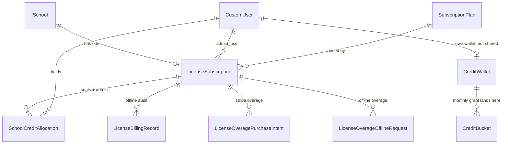
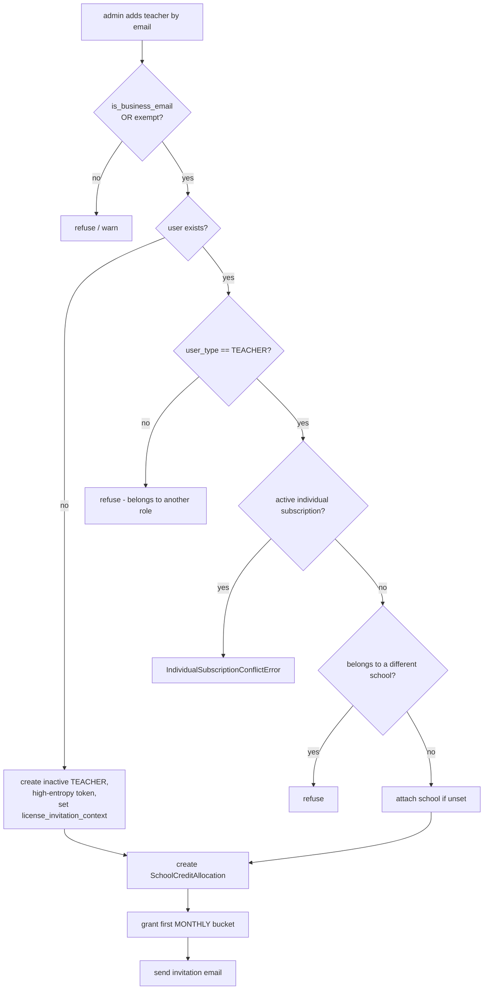
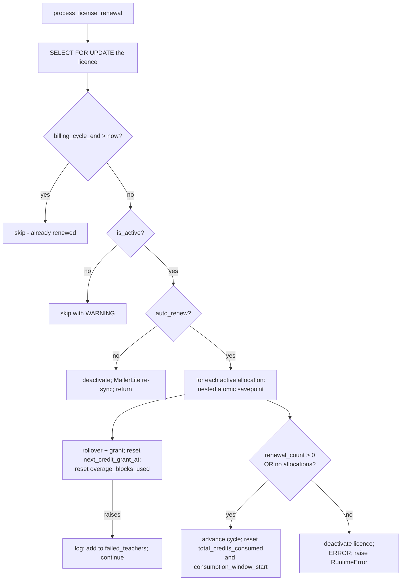
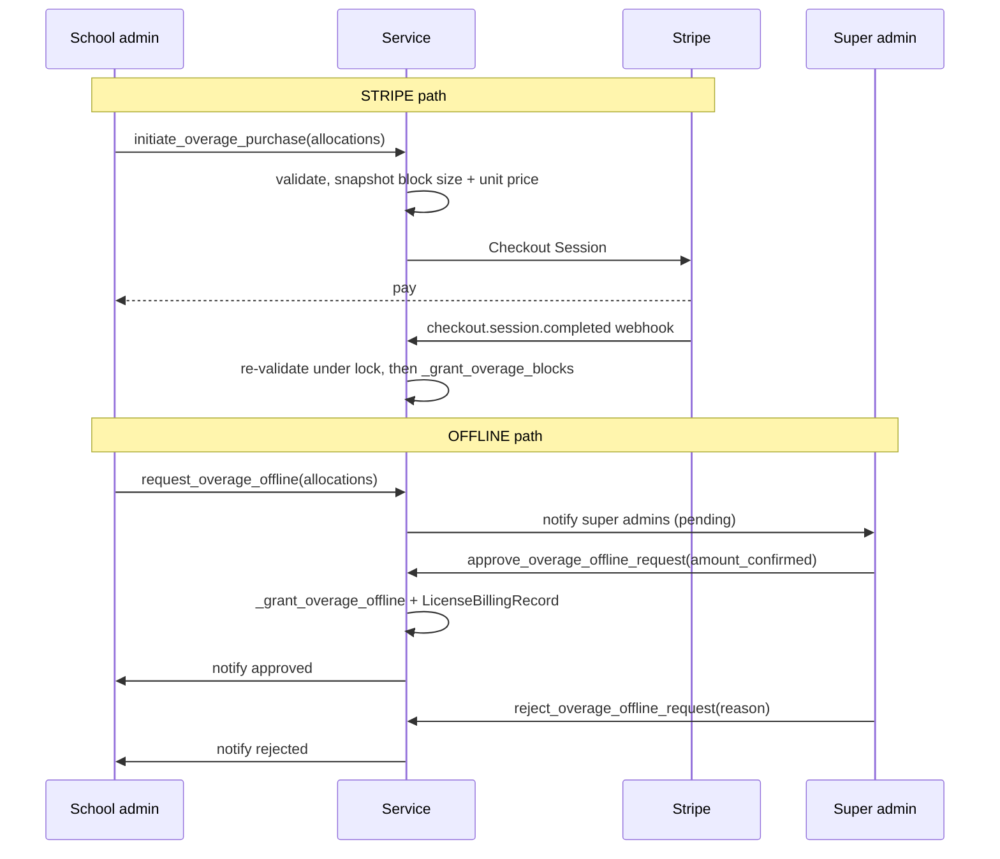

# Billing — school licences

> Part of the [backend reference](README.md). Credit mechanics: [billing-core.md](billing-core.md). Stripe: [billing-stripe.md](billing-stripe.md). The email fork that decides who may join a licence: [users-and-auth.md](users-and-auth.md).

## In plain terms

A **licence** is a school buying for its teachers instead of each teacher paying individually. The school admin manages the money; every teacher gets their **own** pot of credits, not a shared one, so one teacher running out never affects anyone else. The admin also gets a small credit allowance of their own, purely so their analytics dashboard can run. Licences can be paid through Stripe like everything else, or **offline** — invoiced and paid by bank transfer, with a superadmin recording each payment by hand, which is how real schools often buy software. When a school needs more credits mid-term, the admin can buy extra **blocks** and decide which teacher gets how many.

---

## Entry points

All paths relative to `/api/v1/`.

| Base path | Viewset | Permission |
|---|---|---|
| `license-subscriptions` | `LicenseSubscriptionViewSet` | [billing/license_views.py](../../billing/license_views.py) |
| `school-credit-allocations` | `SchoolCreditAllocationViewSet` | [billing/license_views.py](../../billing/license_views.py) |
| `license-overage-offline-requests` | `LicenseOverageOfflineRequestViewSet` | [billing/license_overage_offline_views.py](../../billing/license_overage_offline_views.py) |

### Tasks and commands

| Kind | Name | Purpose |
|---|---|---|
| Beat, daily 00:00 | `process_license_renewals` (`max_retries=0`) | renew licences whose cycle ended |
| Beat, daily 03:00 | `process_license_monthly_credit_refreshes` (`max_retries=0`) | monthly credit top-up for each teacher |
| Command | `audit_school_admins [--strict]` | **read-only** — find licences administered by the wrong person |

`process_license_monthly_credit_refreshes` exists because a licence's *contract* may run for 12 months while credits are granted *monthly*: *"For each active `SchoolCreditAllocation` with `next_credit_grant_at <= now`, expires the current monthly bucket, applies rollover, and grants a new monthly bucket"* ([billing/tasks.py:773-780](../../billing/tasks.py#L773-L780)).

### Service

`LicenseSubscriptionService` ([billing/license_service.py:107](../../billing/license_service.py#L107)) — *"All operations are atomic and include comprehensive audit logging."* It is deliberately isolated from `SubscriptionService` the same way that is isolated from `StripeService`.

---

## Design principles

Stated at the top of the module ([license_service.py:1-16](../../billing/license_service.py#L1-L16)):

- **One licence per school**
- **Each teacher gets an individual `CreditWallet` — NOT shared**
- Each teacher gets a `SchoolCreditAllocation` tracking their monthly allocation
- **Teachers are independent** — one's exhausted credits don't affect others
- Teachers *"cannot modify billing settings themselves"*; the school admin manages the licence
- All logic isolated from the individual-subscription service

The per-teacher wallet is the important one. It means the credit machinery in [billing-core.md](billing-core.md) is identical on both tracks — the licence only changes *where the monthly grant comes from*.

---

## Data model

### `LicenseSubscription` ([billing/models.py:1365-1530](../../billing/models.py#L1365-L1530))

| Field | Type | Meaning |
|---|---|---|
| `id` | UUID | PK |
| `school` | FK → School | CASCADE |
| `admin_user` | FK → CustomUser | who manages billing — **not just a bookkeeping field**, see below |
| `plan` | FK → SubscriptionPlan | must be `category=LICENSE` |
| `contract_months` | PositiveSmallInt | the **contract** length; credits are still granted monthly |
| `max_seats` | PositiveInt | |
| `billing_cycle_start` / `_end` | DateTime | |
| `is_active`, `auto_renew` | Boolean | |
| `stripe_subscription_id`, `stripe_customer_id`, `stripe_status` | CharField | null on offline licences |
| `billing_method` | `LicenseBillingMethod` | **`STRIPE`** or **`OFFLINE`** |
| `custom_price_cents` | Integer, nullable | negotiated price overriding `plan.price_cents` |
| `total_credits_consumed` | PositiveInt | per-cycle roll-up, written by `_record_license_consumption` |
| `consumption_window_start` | DateTime | so the monthly sweep does not reset on top of a renewal reset |

`teacher_count` and `seats_remaining` ([models.py:1510-1530](../../billing/models.py#L1510-L1530)) both **exclude** admin allocations.

### `SchoolCreditAllocation` ([billing/models.py:1781-1863](../../billing/models.py#L1781-L1863))

*"the bridge between `LicenseSubscription` and individual teacher `CreditWallet`s."*

| Field | Type | Meaning |
|---|---|---|
| `license_subscription` | FK | CASCADE, `related_name="allocations"` |
| `user` | FK → CustomUser | CASCADE, `related_name="school_credit_allocations"` |
| `monthly_allocation` | PositiveInt | **raw** credits (display × 1000) |
| `is_active` | Boolean | |
| `is_admin_allocation` | Boolean | see below |
| `next_credit_grant_at` | DateTime | when the monthly refresh is due **for this teacher** |

`unique_together = [("license_subscription", "user")]`; indexes on `(license_subscription, is_active)` and `(user, is_active)`.

**`is_admin_allocation`** is the field that makes admin credits invisible to every teacher-facing count ([models.py:1821-1831](../../billing/models.py#L1821-L1831)). It is *"Excluded from `teacher_count`/`seats_remaining`/`active_teacher_count`, from the `monthly_allocation` overwrite on plan changes, and from `LicenseSubscription.total_credits_consumed`."*

Miss that exclusion anywhere and the school is billed for a seat nobody occupies, or the admin's analytics spend is counted as teaching usage.

### Offline billing records

**`LicenseBillingRecord`** ([models.py:1532-1592](../../billing/models.py#L1532-L1592)) — the audit trail for manual billing: `license_subscription`, `record_type`, `amount_paid_cents`, `payment_reference`, `payment_method_label`, `notes`, `previous_billing_cycle_end`, `new_billing_cycle_end`, `performed_by`, `created_at`.

**`LicenseBillingRecordType`** ([models.py:117-129](../../billing/models.py#L117-L129)) — complete: `CREATED_OFFLINE`, `RENEWED_OFFLINE`, `PLAN_CHANGE_OFFLINE`, `SEATS_CHANGE_OFFLINE`, `CONVERTED_TO_STRIPE`, `CONVERTED_TO_OFFLINE`, `MANUAL_OVERAGE_GRANT`, `OFFLINE_OVERAGE_REQUEST_APPROVED`, `CANCELLED`.

### Overage models

**`LicenseOveragePurchaseIntent`** ([models.py:1600-1672](../../billing/models.py#L1600-L1672)) — the Stripe path. Key design point: it **snapshots the price at intent time** (`block_size_snapshot`, `unit_price_cents_snapshot`, `amount_cents`) alongside `allocations` (a JSONField mapping teacher id → block count), so a plan price change between intent and webhook cannot alter what was agreed. `status` is `LicenseOveragePurchaseStatus`; `stripe_checkout_session_id` and `stripe_payment_intent_id` link it back.

**`LicenseOverageOfflineRequest`** ([models.py:1680+](../../billing/models.py#L1680)) — the offline path. Same snapshot fields, plus `amount_cents_quoted`, `amount_confirmed_cents`, and a `LicenseOverageOfflineRequestStatus`.

### ER diagram


*Caption: exactly one of a teacher's allocations is `is_admin_allocation=True`, and it belongs to `admin_user`.*

---

## Who may be the licence admin

`validate_admin_user(admin_user, school)` ([license_service.py:274-322](../../billing/license_service.py#L274-L322)) is a security control, not a data-quality check.

> *"`admin_user` is **not just a bookkeeping field**: it decides who receives the school's admin credit allocation, whose email is reported as the school's billing contact, and who may request/approve overage. So it has to be someone who actually belongs to the school.*
>
> *Membership is required, not merely 'not contradicted'. This used to only reject an `admin_user` whose school was set AND different, which **let any user with `school=None` through — a `SUPER_ADMIN` is exactly that**, so a superadmin could name themselves as a school's license admin, **divert that school's admin credit allocation to their own wallet**, and displace the school's real admin."*

| Rejected | Message |
|---|---|
| `user_type == STUDENT` | "Student users cannot manage license subscriptions." |
| `SUPER_ADMIN` **or** `is_superuser` | "…is a super admin and cannot be set as the license admin… Name a school admin belonging to that school instead." |
| `school_id is None` | "…does not belong to any school…" |
| `school_id != school.id` | "…is not authorized to manage licenses for school…" |

The superadmin rejection is stated as a principle: *"A superadmin is platform staff, not a tenant member. They create and administer licenses through their own elevated permissions and **never need to be named as the license's `admin_user` to do so**."*

This is the billing-side mirror of the invariant `CustomUserSerializer.validate` enforces on the user side ([users-and-auth.md](users-and-auth.md#platform-staff-are-not-tenant-members)).

### `resolve_admin_user(school, admin_user=None)`

([license_service.py:324-370](../../billing/license_service.py#L324-L370)) — *"A license belongs to a school, and a school already knows who its admin is — so the caller shouldn't have to tell us, and getting it wrong shouldn't be possible."* When supplied (a school with several admins may legitimately designate which holds billing), it is still put through `validate_admin_user`.

Ordering mirrors the "first admin" convention the school views use, **with one addition: an active admin outranks an inactive one.** Inactive admins remain eligible rather than being skipped, because *"A school admin who was invited but hasn't completed registration yet is a real, expected state — **schools are onboarded before they buy**."*

### Repairing existing rows

`audit_school_admins [--strict]` ([billing/management/commands/audit_school_admins.py](../../billing/management/commands/audit_school_admins.py)) finds licences and accounts already in the bad state. It records that **QA reported superadmins showing up as the admin of schools**, via two now-closed routes: `validate_admin_user`'s old weakness, and `CustomUser` allowing a superuser to hold `user_type=SCHOOL_ADMIN` with a school attached.

**It never writes**: *"Reassignment is deliberately manual: picking the right admin for a school is a business decision, and for a license it also **moves a credit allocation**, which shouldn't happen behind anyone's back."*

---

## Plan validation

`validate_license_plan(plan)` ([license_service.py:246-273](../../billing/license_service.py#L246-L273)):

| Rejected | Reason |
|---|---|
| `category != LICENSE` | *"only LICENSE plans are allowed for license subscriptions"* |
| `monthly_credits` is None or 0 | *"Custom/contact-sales plans cannot be activated directly"* |
| `tier == STANDARD` | *"Standard Grader tier is not available under License subscription"* |

The last one is a **product rule expressed in code**: the entry tier is individual-only.

---

## Enrolling a teacher


*Caption: four independent refusals, each with a distinct message.*

`_get_or_invite_teacher(email, school, admin_user, raise_on_conflict=False)` ([license_service.py:1050-1165](../../billing/license_service.py#L1050-L1165)) applies the checks in order. `raise_on_conflict` selects the behaviour: **raise** for a single add (so the admin sees the reason), **log a warning and return `None`** for a batch (so one bad row does not abort the whole import).

The business-email requirement is enforcement point #5 of the email-track fork ([users-and-auth.md](users-and-auth.md#where-the-fork-is-enforced)).

The `IndividualSubscriptionConflictError` ([license_service.py:99](../../billing/license_service.py#L99)) is in the user-facing passthrough list ([AutoGrader/error_messages.py:29](../../AutoGrader/error_messages.py#L29)), so its message reaches the admin verbatim.

### The invitation context

`set_license_invitation_context()` / `clear_license_invitation_context()` ([billing/context.py](../../billing/context.py)) wrap teacher creation. `users.signals.create_default_settings_and_wallet` reads it and **skips the automatic free trial** for a user created during a licence invitation ([users/signals.py:114-119](../../users/signals.py#L114-L119)) — otherwise a licence-invited teacher would receive both a seat and a 14-day individual trial.

It is a contextvar rather than an argument because the trigger point is a Django signal, which cannot take extra parameters.

### Batch enrolment

`add_teachers_batch` ([license_service.py:1539](../../billing/license_service.py#L1539)) returns per-email results. `_invite_and_enroll_one_teacher` ([license_service.py:612](../../billing/license_service.py#L612)) is the unit; `_enroll_teacher_internal` ([license_service.py:1222](../../billing/license_service.py#L1222)) does the allocation and first grant.

Invitations are dispatched on commit via `safe_delay` ([license_service.py:1167-1220](../../billing/license_service.py#L1167-L1220)) — a broker outage loses the email but not the enrolment.

---

## The admin analytics allocation

```
ADMIN_ANALYTICS_CREDITS_DISPLAY = 5_000
ADMIN_ANALYTICS_CREDITS_RAW     = 5_000_000
```
([license_service.py:120-121](../../billing/license_service.py#L120-L121))

> *"Fixed monthly AI-credit allowance granted to a license's `admin_user`, separate from teacher allocations. **School admins cannot grade/perform AI tasks themselves, but their dashboard uses AI to generate analytics**, which requires credits the same way any other AI feature does."*

`_grant_admin_allocation(license_sub)` ([license_service.py:463](../../billing/license_service.py#L463)) creates the `is_admin_allocation=True` row. What that allocation may *spend* credits on is a separate, fixed allowlist — `ADMIN_ALLOWED_AI_FEATURES` in [billing-core.md](billing-core.md#admin_allowed_ai_features) — deliberately **not** tier-gated, because there is no "admin tier".

The amount is **the same as the individual free trial's** 5,000 display credits, and equally non-configurable.

---

## Monthly grants and rollover

`_rollover_and_grant_monthly_bucket(...)` ([license_service.py:371-460](../../billing/license_service.py#L371-L460)) is shared by every grant path.

**The bucket lookup is by "currently active", not "already expired"** — and the docstring explains exactly why:

> *"The latter is only safe when the caller is guaranteed to run AFTER the natural cycle end (true for the Stripe/Celery renewal path) — it is **NOT safe for a superadmin renewing an offline license EARLY**, where the current bucket is still live. Using the expired-only filter there would silently skip rollover and **leave the teacher holding both the old live bucket and a new one simultaneously (a double-grant)**. This version is safe for both callers."*

It passes `monthly_amount=grant_amount` to `compute_capped_rollover` — the licence-caller obligation flagged in [billing-core.md](billing-core.md#rollover-and-the-max_bank-ceiling): *"it can be less than `plan.monthly_credits` when capped by the licence's seat/global budget — using the nominal plan value there would under-count room and over-trim carryover."*

A fully-suppressed rollover logs at INFO with the capping metadata, naming the teacher.

---

## Renewal

`process_license_renewal(license_sub)` ([license_service.py:1675-1815](../../billing/license_service.py#L1675-L1815)):


*Caption: per-teacher savepoints mean one teacher's failure cannot roll back the whole school.*

| Decision | Reasoning |
|---|---|
| Idempotency check on `billing_cycle_end > now` | a redelivered webhook or a second Beat run is a no-op |
| **Per-teacher nested `transaction.atomic()`** | *"so failure of one teacher doesn't rollback the whole transaction"* |
| Cycle advanced only if **at least one** teacher renewed | otherwise the licence would advance with nobody granted |
| **All teachers failed → deactivate the licence and raise** | *"to avoid endless retries"* |
| `overage_blocks_used = 0` per wallet | overage caps are per cycle |
| `total_credits_consumed = 0` **and** `consumption_window_start = renewal_start` | *"Open a fresh consumption window alongside the reset, so the monthly sweep does not immediately reset again on top of it"* |

The "all teachers failed" branch is worth flagging: it **deactivates a paying school's licence**. That is the correct choice against an infinite retry loop, but it means a systemic bug (say, a missing wallet across the board) turns into a total outage for that school rather than a partial one. The ERROR log is the only signal.

`sync_teachers_under_license_to_mailerlite(license_sub)` runs on both deactivation paths so mailing-list segmentation follows the licence state.

---

## Offline billing

`billing_method = OFFLINE` means Stripe is not involved at all: the school is invoiced, pays by transfer, and a superadmin records it.

| Operation | Method | Writes a `LicenseBillingRecord` |
|---|---|---|
| Create offline | `create_license_subscription(...)` | `CREATED_OFFLINE` |
| Renew offline | `process_offline_renewal(...)` ([license_service.py:3266](../../billing/license_service.py#L3266)) | `RENEWED_OFFLINE` |
| Change plan offline | `change_license_plan(...)` | `PLAN_CHANGE_OFFLINE` |
| Change seats offline | `update_seats(...)` | `SEATS_CHANGE_OFFLINE` |
| Convert Stripe → offline | `convert_license_to_offline(...)` ([license_service.py:3408](../../billing/license_service.py#L3408)) | `CONVERTED_TO_OFFLINE` |
| Convert offline → Stripe | `_handle_license_convert_to_stripe` (webhook) | `CONVERTED_TO_STRIPE` |
| Manual overage grant | `grant_manual_teacher_overage(...)` ([license_service.py:3458](../../billing/license_service.py#L3458)) | `MANUAL_OVERAGE_GRANT` |
| Approve an offline overage request | `approve_overage_offline_request(...)` | `OFFLINE_OVERAGE_REQUEST_APPROVED` |
| Cancel | `cancel_license_subscription(...)` | `CANCELLED` |

Each record captures `amount_paid_cents`, `payment_reference`, `payment_method_label`, `performed_by`, and the **before/after cycle dates** — so an offline licence's billing history is reconstructable without Stripe.

`_resolve_effective_price(license_sub, new_plan, custom_price_cents, remove_custom_price)` ([license_service.py:219-244](../../billing/license_service.py#L219-L244)) resolves three cases: remove the custom price (fall back to the plan), set a new one, or **keep the existing custom price across a plan change** — the default, which is what a negotiated school contract needs.

Offline renewal is the caller that made `_rollover_and_grant_monthly_bucket`'s "currently active" lookup necessary: a superadmin can renew **early**, while the current bucket is still live.

---

## Overage purchases

A school that exhausts its credits mid-cycle buys extra **blocks**, and the admin decides the split between teachers.

### Shared validation

`_validate_overage_purchase_request(license_sub, allocations, total_blocks)` ([license_service.py:156-217](../../billing/license_service.py#L156-L217)) is *"Shared, read-only validation used by both branches **BEFORE any lock is taken or any Stripe call is made**."*

| Check | Rejection |
|---|---|
| licence active | "License is not active." |
| `total_blocks > 0` | "must be a positive integer" |
| `total_blocks <= MAX_BLOCKS_PER_PURCHASE` (**1000**) | *"Defensive cap against fat-finger/typo purchase"* — names the split-into-multiple workaround |
| `allocations` non-empty | |
| every per-teacher count is a positive `int` | |
| **`sum(allocations.values()) == total_blocks`** | the arithmetic must agree |
| plan has `overage_block_price > 0` | "no overage pricing configured" |
| plan has `overage_block_size > 0` | "no overage block size configured" |
| every named teacher is **active and eligible** | names the missing ids |

It explicitly does **not** claim to be sufficient: *"Does not check per-teacher activity under lock — callers that mutate state must re-validate that under `select_for_update()` themselves, since a teacher's status can change between this check and the actual grant."*

### Eligibility

`_overage_eligible_allocations_q(license_sub)` ([license_service.py:135-154](../../billing/license_service.py#L135-L154)):

```python
Q(is_admin_allocation=False) | Q(is_admin_allocation=True, user_id=license_sub.admin_user_id)
```

Every regular teacher allocation, **plus the licence's own admin's analytics allocation** — *"the admin can buy overage for their own analytics allocation same as for any teacher. No OTHER admin-flagged allocation ever qualifies, since a license has exactly one `admin_user`."*

It is shared by **four** call sites *"so the eligibility rule can't drift between them"*: this validator, `_grant_overage_offline`, the Stripe checkout-completed webhook, and `approve_overage_offline_request`.

### Two paths


*Caption: both paths snapshot the price at request time, so a plan change cannot alter what was agreed.*

`_OVERAGE_LOCK_TIMEOUT_SECONDS = 30` ([license_service.py:123](../../billing/license_service.py#L123)) guards the mutating half with a cache lock, the same pattern as the individual plan-change lock.

Notification helpers ([license_service.py:2990-3153](../../billing/license_service.py#L2990-L3153)) email superadmins on a pending request and the school admin on approval or rejection, each dispatching on commit via a nested `_dispatch()` + `safe_delay`. `_build_offline_overage_teacher_breakdown` ([license_service.py:3155](../../billing/license_service.py#L3155)) renders the per-teacher split into the email so the admin can check it before paying.

---

## Plan and seat changes

`change_license_plan(...)` ([license_service.py:2028](../../billing/license_service.py#L2028)) and `update_seats(...)` ([license_service.py:2141](../../billing/license_service.py#L2141)).

A plan change overwrites each teacher's `monthly_allocation` — **excluding the admin allocation**, which stays at its fixed 5,000. `_carry_forward_teacher_allocations` ([license_service.py:687](../../billing/license_service.py#L687)) preserves allocations across a change where appropriate.

For a Stripe-billed licence, `StripeSubscriptionMutationService.change_license_price` ([billing/stripe_service.py:1464](../../billing/stripe_service.py#L1464)) updates the Stripe side, with `_revert_to_previous_price` ([stripe_service.py:1647](../../billing/stripe_service.py#L1647)) as the rollback if the local half fails afterwards.

`remove_teacher_from_license(...)` ([license_service.py:1616](../../billing/license_service.py#L1616)) deactivates the allocation. The teacher's `school_id` **stays set** — which is why `CanManageSession` and the individual-plan guard both key off the *live licence state* rather than `school_id` ([classrooms.md](classrooms.md#session-ownership-and-permissions), [billing-stripe.md](billing-stripe.md#guard-1--the-licence-track-check)).

`get_teacher_allocation_info(teacher)` ([license_service.py:1977](../../billing/license_service.py#L1977)) is the read model a teacher sees — their own allocation, not the school's.

---

## Failure modes & recovery

| Failure | Behaviour | Recovery |
|---|---|---|
| Non-business email offered a seat | refused (raise or warn, per `raise_on_conflict`) | use a school address |
| Teacher already has an active individual plan | `IndividualSubscriptionConflictError`, message reaches the admin | cancel the individual plan first |
| Teacher belongs to a different school | refused naming both schools | — |
| Email already belongs to a non-teacher | refused naming the actual type | — |
| Superadmin named as licence admin | refused naming the fix | pre-existing rows: `audit_school_admins` |
| Admin has no school | refused | attach them to the school |
| Batch import, some rows bad | those rows warn and return `None`; the rest enrol | fix and re-run for the failures |
| Invitation email dropped (broker down) | enrolment commits; **teacher never invited** | re-add, or resend from the admin UI |
| One teacher fails at renewal | savepoint rolls back **that teacher only**; logged; listed in `failed_teachers` | investigate and grant by hand |
| **All** teachers fail at renewal | **licence deactivated**, ERROR, `RuntimeError` raised | manual — fix the cause, reactivate, re-run |
| Renewal runs twice | idempotency check on `billing_cycle_end` | automatic |
| Offline licence renewed **early** | correct — the "currently active" bucket lookup handles it | — |
| Overage blocks don't sum to the total | rejected before any lock or Stripe call | fix the split |
| Over 1000 blocks in one purchase | rejected, names the split workaround | — |
| Teacher deactivated between validation and grant | callers re-validate under lock | automatic |
| Plan has no overage pricing | rejected with a specific message | configure the plan |
| Admin allocation counted as a seat | prevented by `is_admin_allocation` exclusions | — |
| Stripe price change fails after the local change | `_revert_to_previous_price` | automatic |
| Teacher removed but `school_id` still set | expected — permissions key off live licence state | — |

**Where money can go inconsistent:**

- An offline licence's truth lives entirely in `LicenseBillingRecord` rows. A missing record means an unrecorded payment, and there is no external system to reconcile against.
- The "all teachers failed" deactivation stops a paying school's service. It is the right call against a retry loop, but recovery is entirely manual.
- Overage price snapshots protect the *agreed* amount; the actual grant still depends on the webhook or the approval arriving.

---

## Configuration

The licence system has **no env vars of its own**. Everything is either a `SubscriptionPlan` row or a module constant.

| Constant | Value | Where |
|---|---|---|
| `ADMIN_ANALYTICS_CREDITS_DISPLAY` / `_RAW` | 5,000 / 5,000,000 | [license_service.py:120-121](../../billing/license_service.py#L120-L121) |
| `MAX_BLOCKS_PER_PURCHASE` | 1,000 | [license_service.py:124](../../billing/license_service.py#L124) |
| `_OVERAGE_LOCK_TIMEOUT_SECONDS` | 30 | [license_service.py:123](../../billing/license_service.py#L123) |
| `ADMIN_ALLOWED_AI_FEATURES` | 3 feature strings | [billing/access_control.py:126](../../billing/access_control.py#L126) |

Per-licence data: `plan`, `contract_months`, `max_seats`, `custom_price_cents`, `billing_method`, and each `SchoolCreditAllocation.monthly_allocation`. Plan economics (`monthly_credits`, `carry_over_percent`, `max_bank`, `overage_block_size`, `overage_block_price`) come from the `SubscriptionPlan` row — see [billing-core.md](billing-core.md#configuration).

Email templates are Django templates rendered by `license_service.py` for invitations, overage-pending, overage-approved, and overage-rejected notifications.
