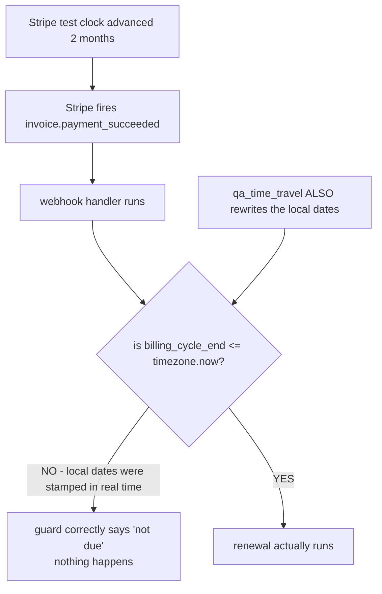

# Billing QA harness — real-Stripe testing, time travel, and the chaos walk

> Part of the [backend reference](README.md). Related: [billing-stripe.md](billing-stripe.md), [billing-licenses.md](billing-licenses.md), [ai-quality-harness.md](ai-quality-harness.md), [operations.md](operations.md).

## In plain terms

Every ordinary test in this codebase pretends to be Stripe. That means those tests check what the team *believes* Stripe does — and beliefs go quietly out of date when Stripe changes something. This harness is the answer: it drives **real** Stripe test-mode objects through the **real** billing code, so a change on Stripe's side breaks a nightly job instead of a customer. It also solves a problem specific to testing subscriptions: you can fast-forward Stripe's clock, but not our server's, so a renewal that Stripe thinks is due still looks weeks away to us. Two extra pieces sit on top: a **chaos walk** that does randomly-ordered real actions to find bugs nobody thought to script, and a **web console** so a tester can drive one subscriber through a flow by clicking rather than by shell.

**None of this ever touches live Stripe.** Every path refuses to run unless the key starts with `sk_test_`.

---

## Entry points

| Kind | Name | Gate |
|---|---|---|
| Beat, daily 01:00 | `billing.tasks.nightly_stripe_live_qa` (`max_retries=0`) | `ENABLE_STRIPE_LIVE_QA` + test keys |
| Celery, on demand | `billing.tasks.run_live_qa_console_job(run_id)` (`max_retries=0`) | same |
| Command | `run_stripe_live_qa [--list] [--scenario N] [--tier fast\|deep] [--workers N] [--keep-objects] [--chaos --seed N --steps N --shrink]` | same |
| URL | `POST /api/v1/qa/time-travel` | `ENABLE_BILLING_TIME_TRAVEL` + test key + `IsSuperAdmin` |
| URL | `GET /api/v1/qa/console` (+ `/state`, `/subscriber`, `/action`, `/reset`, `/runs`, `/runs/create`, `/runs/<uuid>`) | `ENABLE_STRIPE_LIVE_QA` + test key + superadmin |

**A disabled endpoint returns a bare 404, not 403** — *"so a misconfigured deployment gives no hint this endpoint exists"* ([billing/qa_time_travel.py:63-65](../../billing/qa_time_travel.py#L63-L65)).

### Module map

| Module | Role |
|---|---|
| [stripe_live_qa.py](../../billing/stripe_live_qa.py) | guardrails + `LiveQAHarness` object lifecycle |
| [stripe_live_qa_scenarios.py](../../billing/stripe_live_qa_scenarios.py) | `run_suite`, the single-threaded scenario registry |
| [qa_time_travel.py](../../billing/qa_time_travel.py) | the two-clock endpoint |
| [qa_console.py](../../billing/qa_console.py) | the superadmin web console |
| [live_qa/harness.py](../../billing/live_qa/harness.py) | `ConcurrentLiveQAHarness` |
| [live_qa/runner.py](../../billing/live_qa/runner.py) | concurrent entry point |
| [live_qa/events.py](../../billing/live_qa/events.py) | one shared Stripe event poller |
| [live_qa/concurrency.py](../../billing/live_qa/concurrency.py) | worker pool, DB hygiene, Stripe throttle |
| [live_qa/clock.py](../../billing/live_qa/clock.py) | the two-clock problem, at scale |
| [live_qa/invariants.py](../../billing/live_qa/invariants.py) | the invariant framework |
| [live_qa/invariants_individual.py](../../billing/live_qa/invariants_individual.py), [invariants_global.py](../../billing/live_qa/invariants_global.py) | the invariants themselves |
| [live_qa/checkpoints.py](../../billing/live_qa/checkpoints.py) | evaluates invariants after every step |
| [live_qa/chaos.py](../../billing/live_qa/chaos.py) | seeded random walk + shrinker |
| [live_qa/scenarios_fast.py](../../billing/live_qa/scenarios_fast.py), [_clock.py](../../billing/live_qa/scenarios_clock.py), [_long.py](../../billing/live_qa/scenarios_long.py), [_deep.py](../../billing/live_qa/scenarios_deep.py), [_license.py](../../billing/live_qa/scenarios_license.py) | the scenarios |

---

## Why this exists

The founding incident is recorded verbatim ([stripe_live_qa.py:5-16](../../billing/stripe_live_qa.py#L5-L16)):

> *"Every other test in this codebase mocks Stripe, which means they encode our **BELIEFS** about Stripe's API rather than its behaviour. C1 is the proof that beliefs go stale silently: **`current_period_end` moved off the Subscription object onto `items.data[]` in API version 2025-03-31**, the QA time-travel endpoint broke, and **hundreds of passing tests could not see it** — because every one of them mocked the shape we expected."*

The same reasoning is repeated at the nightly task ([billing/tasks.py:840-849](../../billing/tasks.py#L840-L849)) and the management command ([run_stripe_live_qa.py:3-5](../../billing/management/commands/run_stripe_live_qa.py#L3-L5)): *"This command checks the beliefs."*

### The gap it does not cover, stated openly

> *"Stripe Checkout completion cannot be automated: `checkout.session` hands back a URL that requires a browser to pay. So the suite creates subscriptions with `stripe.Subscription.create` and establishes the local row **the way the checkout webhook does**, then exercises everything downstream (renewal, trial conversion, upgrade, deferred downgrade, dunning). **The checkout hop itself remains covered only by mocks. That is a real gap and is stated here rather than papered over.**"* ([stripe_live_qa.py:18-27](../../billing/stripe_live_qa.py#L18-L27))

---

## Guardrails

Four independently-sufficient guards ([stripe_live_qa.py:29-51](../../billing/stripe_live_qa.py#L29-L51)):

| # | Guard |
|---|---|
| 1 | `settings.ENABLE_STRIPE_LIVE_QA` must be explicitly `True` |
| 2 | **Both** `stripe.api_key` **and** `settings.STRIPE_SECRET_KEY` must be `sk_test_` keys. *"An empty or unrecognised key is **REFUSED, not assumed safe** — 'no key' must never read as 'not live'"* |
| 3 | **Every single Stripe call routes through `guarded_call`**, which re-checks (2) immediately before the call |
| 4 | (endpoints) the caller must be a superadmin |

Guard 3 is the load-bearing one:

> *"A single import-time assertion would be cheap to defeat: settings can be reloaded, `stripe.api_key` is a plain module attribute anyone can reassign. **Re-asserting per call costs one string comparison and removes the entire class of 'it was test mode when we started' bugs.**"*

`ENABLE_BILLING_TIME_TRAVEL` is a **separate** flag from `ENABLE_STRIPE_LIVE_QA`, because the time-travel endpoint mostly reads while the suite writes ([settings.py:1253-1259](../../AutoGrader/settings.py#L1253-L1259)).

The time-travel endpoint has **no `DEBUG`/`ENVIRONMENT` requirement** ([qa_time_travel.py:63-70](../../billing/qa_time_travel.py#L63-L70)) — *"`ENABLE_BILLING_TIME_TRAVEL` is the single toggle controlling reachability, so whoever controls that one setting fully controls whether this endpoint is live. The Stripe test-key check is what actually prevents it from ever mutating real subscription dates against LIVE Stripe data even if that toggle is mistakenly left on somewhere."*

### Cleanup

*"Deleting a Test Clock deletes every object attached to it, so **clock deletion is the primary cleanup** and customer deletion is belt-and-braces."* ([stripe_live_qa.py:53-56](../../billing/stripe_live_qa.py#L53-L56))

Cleanup also deletes the `StripeEvent` ledger rows the run created — **and this is not tidiness**:

> *"a QA event left in FAILED state would be picked up by `sweep_stale_stripe_events` three days later and logged at ERROR as 'a customer may have paid without receiving anything' — **a false page about a customer who never existed**."*

QA users are created on a **`.invalid`** domain ([settings.py:1298-1303](../../AutoGrader/settings.py#L1298-L1303)) — *"RFC 2606 reserves it as never-resolvable, so a QA address can never receive mail even if some code path tries to send."*

`--keep-objects` skips cleanup, and the command's help marks it *"debugging only"*.

---

## The two-clock problem

This is the single most important concept in the harness.


*Caption: Stripe's clock and `timezone.now()` are independent. Moving only one produces a silent no-op.*

The explanation ([qa_time_travel.py:8-23](../../billing/qa_time_travel.py#L8-L23)):

> *"Stripe Test Clocks let QA fast-forward **Stripe's** simulated time … But our own server's real wall clock never moves. Every renewal idempotency guard in this codebase compares locally-stored dates — `billing_cycle_end`, `trial_end`, `next_credit_grant_at` — against REAL `timezone.now()`. Since those local dates were stamped using real time when the subscription was created, they're still genuinely in the future relative to the real clock even after Stripe's simulated clock has raced ahead — so the webhook arrives, but every 'is this actually due yet?' check **correctly (from a real-time perspective) says no**, and nothing appears to happen. **This isn't a bug in the guards** — they're doing exactly what they're supposed to for real customers."*

`live_qa/clock.py` restates it with the four affected queries ([live_qa/clock.py:8-24](../../billing/live_qa/clock.py#L8-L24)):

```
reconcile_subscription_renewals    billing_cycle_end__lte=now
process_annual_plan_credit_grants  next_credit_grant_at__lte=now
expire_active_trials               trial_end__lte=now
cleanup_expired_credit_buckets     expires_at__lte=now
```

> *"That last pair matters enormously here: **an annual plan's monthly credit grants are driven ENTIRELY by a local-clock task.** Advance a Stripe clock a year without also moving local time and the subscriber silently"* [receives none of them].

### What `qa/time-travel` does

Two things, deliberately separate ([qa_time_travel.py:25-49](../../billing/qa_time_travel.py#L25-L49)):

1. **Rewrites the local date field(s)** on ONE subscription so they are genuinely `<= timezone.now()`, *"making the existing, unmodified idempotency/eligibility checks in `webhooks.py` and `tasks.py` correctly conclude 'this is due'."*
2. **Best-effort advances the Stripe Test Clock** so Stripe also generates the invoice/webhook, without the tester touching Stripe's dashboard.

The clock is always advanced to **(next billing boundary + 1 hour)**. The boundary is read from `items.data[].current_period_end` — *"Stripe moved it off the top-level Subscription in API version 2025-03-31"* — falling back to the legacy top-level field, then `trial_end`.

**If no boundary can be determined, or the clock already sits past it, NO advance is issued and an explicit error is returned:**

> *"A short advance that fails to cross a boundary is worse than none: Stripe emits no invoice, so **the renewal QA subsequently observes actually came from the nightly reconcile Celery sweep** (which renews off the PREVIOUS cycle's already-paid invoice) **while the response reads as success.**"*

A `warnings` list in the response calls this out whenever the boundary was not crossed.

**It never calls renewal business logic directly** ([qa_time_travel.py:51-55](../../billing/qa_time_travel.py#L51-L55)) — never `process_rollover_and_renewal`, never `process_license_renewal` — *"doing so would test a shortcut, not the real, production webhook/Celery-triggered path this exists to validate."*

### Test clocks must be attached at customer creation

`BILLING_TEST_CLOCK_EMAIL_DOMAINS` ([settings.py:1241-1251](../../AutoGrader/settings.py#L1241-L1251)) lists domains whose **new** Stripe customers get a fresh test clock:

> *"A Test Clock can only ever be attached **when the customer is created**, so without this the billing time-travel tool can never advance Stripe's clock for customers made through the normal checkout flow."*

Empty by default; `"*"` covers every customer in a dedicated QA environment. `StripeCustomerService._qa_test_clock_kwargs` ([billing/stripe_service.py:262](../../billing/stripe_service.py#L262)) applies it, only when `ENABLE_BILLING_TIME_TRAVEL` is on **and** the key is a test key.

---

## Invariants

`live_qa/invariants.py` is described as *"THE HIGHEST-LEVERAGE PART OF THE SUITE"* ([live_qa/invariants.py:5-6](../../billing/live_qa/invariants.py#L5-L6)), and the argument is worth reading in full:

> *"A scenario asserts what its author thought to check, in the order they thought to check it. An invariant asserts something that must be true **at all times**, so it catches bugs in sequences nobody scripted — which is the only honest answer to 'test every possible scenario', **because the sequences cannot be enumerated**.*
>
> *Concretely: all three bugs fixed in Phase 0 were found by reading code. **Each would have been caught automatically by an invariant here.**"*

### Outcomes, never exceptions

> *"An invariant that itself throws is recorded as **ERROR**, visibly distinct from **VIOLATED** — **a buggy check must never masquerade as a billing bug, or the suite starts crying wolf.**"*

Three outcome states: `OK`, `VIOLATED` (a real billing bug), `ERROR` (the check itself broke).

### How they attach

`checkpoints.py` hangs invariant evaluation off **`drain_events`** rather than off a hook threaded through each scenario ([live_qa/checkpoints.py:5-13](../../billing/live_qa/checkpoints.py#L5-L13)):

> *"Every scenario in this suite drains events immediately after doing something that could change billing state — **that is what a 'step' IS here**. Existing scenarios need one line (registering their actor) and get per-step invariant evaluation for free."*

### Global invariants are scoped to this run

`invariants_global.py` checks the webhook ledger, but *"scoped to the event ids THIS RUN dispatched, never to the table as a whole"* ([live_qa/invariants_global.py:5-8](../../billing/live_qa/invariants_global.py#L5-L8)):

> *"a pre-existing FAILED row from a real incident is not this run's business, and **flagging it would train people to ignore the check**."*

`invariants_individual.py` states the principle for each check: *"Where an invariant maps onto a bug this codebase has actually had, the docstring says so — **that is the evidence it is worth its runtime**."*

---

## Scenario tiers

| Tier | Module | Clock advances | Runs in |
|---|---|---|---|
| **fast** | `scenarios_fast.py` | **none** | seconds — the nightly set |
| fast + clock | `scenarios_clock.py` | one or two | cheap enough for nightly |
| deep / long | `scenarios_long.py` | many | minutes to hours |
| deep | `scenarios_deep.py` | targeted calendar edges | — |
| licence | `scenarios_license.py` | — | the school track |

### `scenarios_fast` — chosen by commercial risk

*"Together they cover the surfaces where the gap between our mocks and Stripe's real behaviour is most commercially dangerous"* ([live_qa/scenarios_fast.py:6-15](../../billing/live_qa/scenarios_fast.py#L6-L15)). Example: `payment_method_lifecycle` exists because *"`billing/payment_method_views.py` is 600+ lines and 100% mocked."*

### `scenarios_long` — two shapes, two purposes

([live_qa/scenarios_long.py:6-14](../../billing/live_qa/scenarios_long.py#L6-L14))

| Shape | Buys | Finds |
|---|---|---|
| **MONTHLY**, 120 advances | renewal **count** | *"accumulation bugs, drifting anchors and unbounded row growth"* |
| **ANNUAL**, ~10 advances | calendar **distance** | *"Feb-29 anniversaries and multi-year date arithmetic"* |

### `scenarios_deep` — specific calendar traps

*"each one forces a specific calendar or scale edge case that a randomly-timed nightly run would only hit by luck"* ([live_qa/scenarios_deep.py:6-8](../../billing/live_qa/scenarios_deep.py#L6-L8)).

`month_end_anchor_divergence` is the clearest example and worth knowing as a live hazard:

> **Stripe PRESERVES a subscription's billing anchor day** (the 31st stays the 31st, clamped only in short months). **`dateutil`'s `relativedelta` CLAMPS instead** — Jan 31 → Feb 28 → Mar 28 **forever, never returning** to the 31st.

Since the local cycle is computed with `relativedelta` ([billing/services.py](../../billing/services.py)), a subscription anchored to the 29th–31st **drifts away from Stripe's real invoice date every February**. This scenario is what catches it.

`scenarios_clock`'s `void_or_refund_compensating_path` guards `_void_or_refund_side_effect_invoice` — *"This has an idempotency key precisely because it is a refund"* ([live_qa/scenarios_clock.py:9-15](../../billing/live_qa/scenarios_clock.py#L9-L15)).

### `scenarios_license` — a different object graph

([live_qa/scenarios_license.py:7-14](../../billing/live_qa/scenarios_license.py#L7-L14)) It cannot reuse `_establish_subscriber`: *"a School + a `SCHOOL_ADMIN` user instead of a lone TEACHER, per-seat quantity pricing instead of a flat price, and **`admin_user` is PROTECTed on `LicenseSubscription`** — deleting the admin while a license still references them raises, so cleanup here deletes the School FIRST."*

Registration matters: *"Importing the package is what REGISTERS the deep (long-horizon) scenarios into the shared registry. Without it `--list` and `--tier` would silently show only the fast ones, **which is worse than an error**"* ([run_stripe_live_qa.py:43-46](../../billing/management/commands/run_stripe_live_qa.py#L43-L46)).

---

## Concurrency

`ConcurrentLiveQAHarness` ([live_qa/harness.py](../../billing/live_qa/harness.py)) overrides **exactly two** methods — `create_customer` (to register with the bus) and `drain_events` (to read from a queue instead of polling Stripe).

> *"That is what lets the existing five scenarios run **concurrently with no modification at all**: they call `harness.drain_events(customer_id=...)` and get the same `[(event_type, status_code), ...]` back, without knowing a bus exists."*

The single-threaded harness *"stays the supported path for `--tier smoke` and for the existing unit tests, so this **adds a mode rather than replacing one**."*

### Why threads, not asyncio

([live_qa/concurrency.py:5-19](../../billing/live_qa/concurrency.py#L5-L19))

1. *"Every layer beneath this is synchronous — the Django ORM, the stripe client, `webhooks._record_and_dispatch`, and the existing scenarios. An asyncio design would have to wrap all of it in a thread pool anyway."*
2. **Decisively:** *"part of the point is to exercise the C3 webhook claim logic under **GENUINE** concurrency, which needs real OS threads on real database connections."*
3. *"The work is ~100% I/O wait (Stripe HTTP plus poll sleeps), so **the GIL is irrelevant here**."*

### One shared event poller

([live_qa/events.py:5-14](../../billing/live_qa/events.py#L5-L14)) *"Stripe's Event API cannot filter by customer. The single-threaded harness therefore lists account events and filters client-side, which is fine for one actor and **quadratic-ish for twelve**: each would independently pull the same pages, burning rate limit to discard 11/12 of what it fetched."* One poller pulls the stream once and routes each event to the right actor's queue.

### Teardown order is load-bearing

```
stop the poller  →  drain what is left  →  clean up
```
([live_qa/runner.py:10-14](../../billing/live_qa/runner.py#L10-L14)) — *"Cleaning up before draining would leave `dispatched_event_ids` incomplete"*, which would in turn leave QA `StripeEvent` rows behind for the sweeper to page about.

`runner.run_suite` keeps *"Same contract as `billing.stripe_live_qa_scenarios.run_suite` — takes scenario names, returns a `SuiteResult` — so the management command and the Celery task can switch to it without changing how results are reported."*

---

## The chaos walk

`live_qa/chaos.py` — a seeded random walk of real actions against one real Stripe subscriber, *"checked against the SAME invariant suite every named scenario uses — plus a **shrinker** that reduces a failing walk to the shortest one that still reproduces the violation."*

The rationale ([live_qa/chaos.py:7-17](../../billing/live_qa/chaos.py#L7-L17)):

> *"Every named scenario tests one **HAND-PICKED** story. Real customers do not follow hand-picked stories: they upgrade, then hit a card decline, then get a refund, then upgrade again, in whatever order their life happens to go. **A bug that only shows up from a specific INTERLEAVING of actions — not any single action in isolation — is exactly the class this suite's fixed scenarios cannot find by construction, no matter how many of them are written.**"*

**Reproducibility is the whole point:** `generate_sequence(seed, steps)` uses `random.Random(seed)`, **never the shared/global RNG**, so the same seed always produces the same sequence ([live_qa/chaos.py:19-23](../../billing/live_qa/chaos.py#L19-L23)).

```bash
manage.py run_stripe_live_qa --chaos --seed 12345 --steps 60 --shrink
```

A failure reports a seed and step count; re-running with the same values reproduces it, and `--shrink` minimises it to the shortest reproducing walk.

---

## The QA console

`qa_console.py` is a *"superadmin-only web console for driving the real-Stripe QA suite interactively instead of only from a terminal."*

The problem it solves ([qa_console.py:7-15](../../billing/qa_console.py#L7-L15)): *"Testing billing meant either clicking through Stripe's own dashboard by hand, or running `manage.py run_stripe_live_qa` and reading log output. **Neither lets you drive ONE test subscriber through a flow and watch local state change after every click**, and neither lets you trigger or review a suite run without shell access."*

**It is a UI over what already exists, not new billing logic** — the Console tab calls straight into `live_qa/chaos.py`'s action functions (*"the same ones the seeded chaos walk exercises"*), and the Dashboard tab calls `run_suite` / `run_chaos_walk` / `shrink_chaos_failure` unchanged.

### Security model

*"identical to `billing/qa_time_travel.py`"* — the existing `ENABLE_STRIPE_LIVE_QA` flag plus a real test key, via *"the same function `LiveQAHarness` itself requires internally, **so there is no way to reach this tool without also being able to reach everything it calls**."* Disabled → bare 404.

Superadmin is re-checked *"restated here as a plain function since these are ordinary Django views, not DRF ones — **this module needs to render HTML, which `APIView` does not do**."*

### Session state, not a harness object

([qa_console.py:37-50](../../billing/qa_console.py#L37-L50))

> *"`LiveQAHarness` is built to live for the duration of ONE process running ONE suite — its `cleanup()` walks in-memory lists it populated itself while creating things. An interactive console is the opposite shape: one HTTP request per click, with nothing surviving between them."*

So the "current test subscriber" is a small dict of ids in `request.session["qa_console_subscriber"]`, and each request rebuilds a real `Subscriber` dataclass from them. It uses the **base** `LiveQAHarness`, not the concurrent one, *"since the base implementation polls Stripe directly per `customer_id` and needs no shared event-bus state carried over from a previous request."*

### `LiveQARun`

Console-triggered runs are persisted as `LiveQARun` rows (`LiveQARunKind`, `LiveQARunStatus`) so results survive the request. `run_live_qa_console_job(run_id)` ([billing/tasks.py:908](../../billing/tasks.py#L908)) executes one, wrapped end-to-end in try/except so *"an unexpected crash … still leaves the row in a terminal FAILED state with the exception recorded, **rather than stuck at RUNNING forever with nothing to explain why**."*

---

## Escalation

`nightly_stripe_live_qa` ([billing/tasks.py:838-905](../../billing/tasks.py#L838-L905)) follows the `sweep_stale_stripe_events` convention.

| Outcome | Level | Message |
|---|---|---|
| Not enabled | **DEBUG** | *"skipping. (Needs `ENABLE_STRIPE_LIVE_QA` and `sk_test_` Stripe keys.)"* |
| `LiveQARefused` / `LiveQAConfigurationError` | **WARNING** | *"Misconfiguration, not a billing bug. WARNING, not ERROR: **nobody should be woken for a QA environment that is not set up**."* |
| A scenario failed | **ERROR** | names the scenario, the detail, and the reproduction command |
| Cleanup problem | **WARNING** | *"Leaked objects cost nothing in test mode but accumulate, and a leaked ledger row would make the event sweeper page falsely."* |
| All passed | INFO | the summary |

The ERROR text is written for whoever reads it at 2am:

> *"Stripe live QA scenario **X** FAILED against real Stripe: … This means **real Stripe behaviour no longer matches what the billing code assumes — mocked tests CANNOT catch this**. Reproduce with: `manage.py run_stripe_live_qa --scenario X`"*

`max_retries=0` *"on purpose: a failure here is a signal to investigate, not a transient to paper over, and **retrying would create a second set of Stripe objects while the first set is still being diagnosed**."*

The command *"Exits non-zero if any scenario fails, so cron/CI can detect it."*

Scheduling: 01:00, chosen because it is *"Slow (it waits on Stripe test-clock advances), which is exactly why it is nightly and not in the commit path. Hour 1 keeps it clear of the other billing jobs"* ([settings.py:831-839](../../AutoGrader/settings.py#L831-L839)). It is in `BEAT_HEALTH_EXPECTATIONS` at a 2-day alert threshold.

---

## Failure modes & recovery

| Failure | Behaviour | Recovery |
|---|---|---|
| Not enabled on this worker | DEBUG no-op | set `ENABLE_STRIPE_LIVE_QA` on a QA worker |
| Live (`sk_live_`) key present | **refused at every call**, `LiveQARefused` | expected and correct |
| Empty/unrecognised key | **refused** — never assumed safe | configure test keys |
| Key swapped mid-run | caught by the **per-call** re-check | automatic |
| A scenario fails | ERROR naming scenario + reproduction command; run continues | reproduce with `--scenario` |
| Cleanup leaves objects | WARNING; objects accumulate in test mode | `--keep-objects` was probably on; delete the clocks |
| QA `StripeEvent` rows left behind | **the sweeper pages falsely 3 days later** | delete them; check why cleanup did not run |
| Test clock already past the boundary | time-travel returns an **explicit error**, no advance issued | pick a different subscription |
| No boundary determinable | same | check `items.data[].current_period_end` |
| Advance did not cross a boundary | success response **with a `warnings` entry** | read the warnings — the "renewal" may be the reconcile sweep |
| Local dates moved but Stripe's clock not | webhook never fires; Celery sweep may still act | the two-clock problem — the endpoint does both halves |
| Customer created without a test clock | **cannot ever be time-travelled** | set `BILLING_TEST_CLOCK_EMAIL_DOMAINS` before creating |
| An invariant itself throws | recorded as **ERROR**, not `VIOLATED` | fix the check |
| Chaos walk fails | seed + step count reported | re-run the same seed; add `--shrink` |
| Console job crashes | `LiveQARun` left **FAILED** with the exception | read the row |
| Deep scenarios missing from `--list` | the package was not imported | the command imports it explicitly |
| Licence cleanup fails on `admin_user` | `PROTECT` raises | delete the School first — the scenario does |

**Nothing here can touch production data or live Stripe.** The residual risks are: accumulated test-mode objects (harmless, untidy), and leaked `StripeEvent` rows (harmful — a **false page**, which is why cleanup deletes them explicitly).

---

## Configuration

| Var | Default | Effect |
|---|---|---|
| `ENABLE_STRIPE_LIVE_QA` | `False` | gates the suite, the console, and the nightly task. *"Unlike the time-travel endpoint, which mostly READS, this suite **CREATES** Stripe customers, subscriptions and invoices, plus real local users — so it is off unless switched on deliberately"* ([settings.py:1253-1259](../../AutoGrader/settings.py#L1253-L1259)) |
| `ENABLE_BILLING_TIME_TRAVEL` | `False` | gates `qa/time-travel` |
| `BILLING_TEST_CLOCK_EMAIL_DOMAINS` | `[]` | domains whose **new** Stripe customers get a test clock. `"*"` for a dedicated QA environment. Only effective with `ENABLE_BILLING_TIME_TRAVEL` **and** a test key |
| `STRIPE_LIVE_QA_EMAIL_DOMAIN` | `stripe-live-qa.invalid` | domain for QA-created users; RFC 2606 guarantees it never resolves |
| `LOCAL_STRIPE_SECRET_KEY` | required | **must** be `sk_test_` |

**A QA/staging worker needs:** `ENABLE_STRIPE_LIVE_QA=True`, `ENABLE_BILLING_TIME_TRAVEL=True`, `sk_test_` keys, and `BILLING_TEST_CLOCK_EMAIL_DOMAINS` set to whatever domain the QA signups use.

**A production worker needs none of them** — all four default to off/empty, and the test-key check would refuse anyway.
