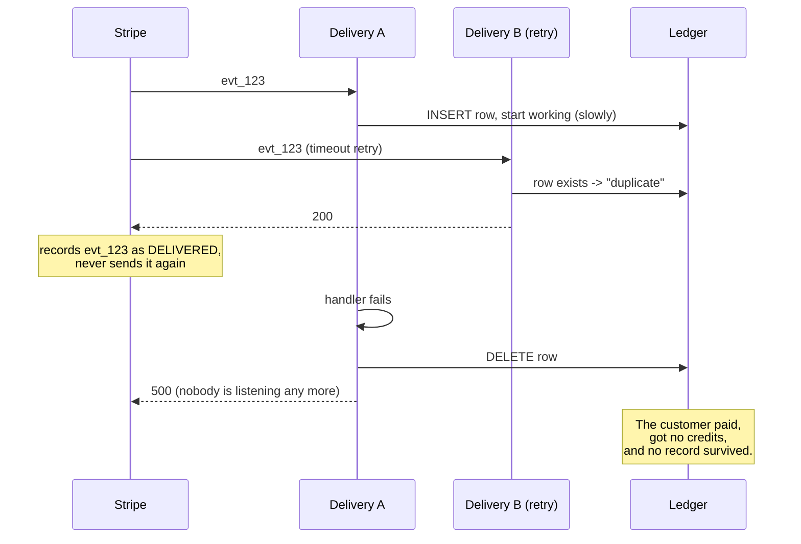
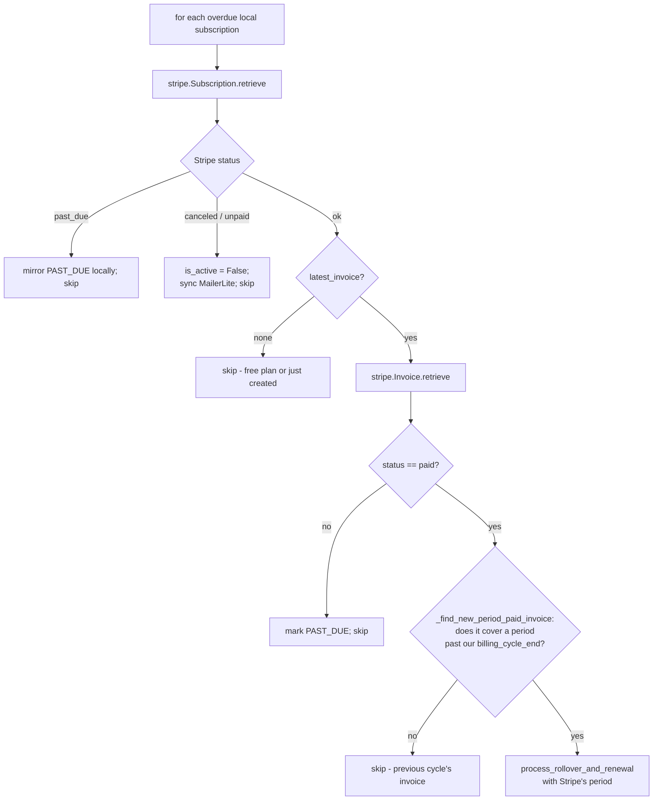
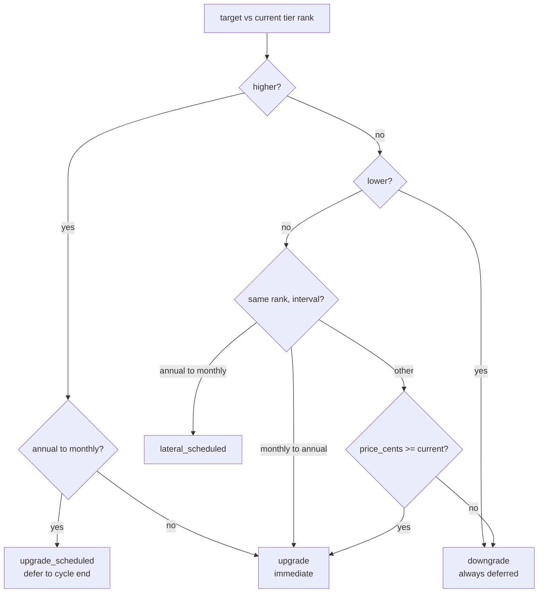

# Billing — Stripe integration, webhooks, and plan changes

> Part of the [backend reference](README.md). Credit mechanics are in [billing-core.md](billing-core.md); licences in [billing-licenses.md](billing-licenses.md); the QA harness in [billing-qa-harness.md](billing-qa-harness.md). Related: [integrations.md](integrations.md), [operations.md](operations.md).

## In plain terms

Money moves through Stripe, and Stripe tells us about it by calling back into our server — a **webhook**. The awkward part is that Stripe will call the same event more than once (it retries anything that looks like it failed), and our handlers hand out credits, so running one twice would give a customer double. This app therefore keeps a ledger of every event Stripe has ever sent and claims each one before working on it, so exactly one worker ever processes it. The other big piece here is **plan changes**: deciding whether switching plans should happen right now or wait until the end of the billing period, which depends on whether the user is moving up or down, and whether they are crossing between monthly and annual.

**The governing principle:** *"Checkout Session creation NEVER grants credits or creates local subscription rows. That only happens once a webhook confirms payment"* ([billing/stripe_service.py:8-14](../../billing/stripe_service.py#L8-L14)) — keeping "subscribed" and "paid" as two separate, auditable steps.

---

## Entry points

| Method | Path | Auth | Source |
|---|---|---|---|
| POST | `/api/v1/stripe/webhooks` | **signature only** | [billing/webhooks.py:314](../../billing/webhooks.py#L314) |
| POST | `/api/v1/stripe/webhooks/thin` | **signature only** | [billing/webhooks.py:334](../../billing/webhooks.py#L334) |
| CRUD | `/api/v1/subscription` (`SubscriptionManagementViewSet`) | IsAuthenticated | [billing/views.py](../../billing/views.py) |
| CRUD | `/api/v1/payment-methods` | IsAuthenticated + `IsNotStudent` | [billing/payment_method_views.py](../../billing/payment_method_views.py) |
| GET | `/api/v1/invoices` | IsAuthenticated | [billing/billing_transaction_views.py](../../billing/billing_transaction_views.py) |

Webhooks are `@csrf_exempt @require_POST`. *"Stripe calls it unauthenticated — **signature verification IS the auth**"* ([webhooks.py:19-22](../../billing/webhooks.py#L19-L22)).

### Tasks and commands

| Kind | Name | Purpose |
|---|---|---|
| Beat, hourly :15 | `sweep_stale_stripe_events` | watchdog over the event ledger |
| Beat, daily 04:00 | `reconcile_subscription_renewals` | safety net for missed renewals |
| Command | `replay_stripe_events [--event-id] [--event-type] [--since] [--apply]` | **human-gated** repair, `--dry-run` by default |
| Command | `backfill_billing_transactions` | rebuild `BillingTransaction` rows from stored event payloads |
| Command | `backfill_receipt_urls` | fill in missing receipt URLs |

### Service classes ([billing/stripe_service.py:20-29](../../billing/stripe_service.py#L20-L29))

| Class | Responsibility |
|---|---|
| `StripeCustomerService` | get-or-create Stripe `Customer` objects |
| `StripeCheckoutService` | Checkout Sessions for every "pay to unlock" flow |
| `StripeSubscriptionMutationService` | direct `Subscription.modify()` for upgrades on an existing subscription — no redirect, card already on file |
| `StripeOverageService` | explicit, user-confirmed overage block purchases via `PaymentIntent` |
| `StripeWebhookHandler` | what to do for each event type |
| `IndividualPlanChangeService` | the immediate-vs-deferred decision |
| `SubscriptionReactivationService` | undoing a scheduled cancellation |

`stripe.api_key` is set once at import ([billing/imports.py](../../billing/imports.py)) — every module imports `stripe` from there rather than configuring it again.

---

## The idempotency ledger

### The bug it was built to fix

The module docstring records the incident in full ([webhooks.py:25-52](../../billing/webhooks.py#L25-L52)). The old design treated *"a row exists"* as *"already handled"*, and **deleted** the row when a handler raised so Stripe's retry would start fresh. That combination lost billing events permanently:


*Caption: the original event-loss bug. Answering 200 for unfinished work is the root cause.*

A second, quieter hole had the same shape: *"gunicorn kills any request over `--timeout`, and `except Exception` cannot catch that, so the row survived with the work undone and every later redelivery was waved away as a duplicate — **permanently stuck**."*

The fix: **the ledger records what happened, and rows are NEVER deleted.** Only `SUCCEEDED` suppresses a redelivery. An event still being processed answers **409** — *"because answering 200 for work that has not finished is precisely the bug above."*

### `StripeEvent` ([billing/models.py:1886-1935](../../billing/models.py#L1886-L1935))

| Field | Type | Meaning |
|---|---|---|
| `id` | UUID | PK |
| `stripe_event_id` | CharField(255) | **unique**, db_index — the join key |
| `event_type` | CharField(100) | |
| `payload` | JSONField | the event's `data` — **what `replay_stripe_events` re-runs** |
| `processed_at` | DateTime, `auto_now_add` | **when first seen**, not completion. *"Kept under this name because `Meta.ordering` and the `backfill_billing_transactions` command both read it"* |
| `status` | CharField, db_index | see below |
| `claimed_at` | DateTime | *"Doubles as the **fencing token** for the terminal write, and is what identifies a claim abandoned by a killed worker"* |
| `completed_at` | DateTime | terminal state reached |
| `attempts` | PositiveInt | how many times a worker has claimed it |
| `last_error` | TextField | truncated to 2000 chars |

**`StripeEventStatus`** ([models.py:1866-1883](../../billing/models.py#L1866-L1883)) — complete enumeration:

| Status | Suppresses a redelivery? | Claimable? |
|---|---|---|
| `PROCESSING` (fresh claim) | no — answers 409 | **no** |
| `PROCESSING` (stale claim) | no | **yes** — the worker is dead |
| `SUCCEEDED` | **yes — the whole safety property** | no |
| `FAILED` | no | **yes, deliberately** — so Stripe's own retry does the work |

### Timing constants

```
WEBHOOK_REQUEST_HARD_TIMEOUT_SECONDS = 100        # == gunicorn --timeout
STRIPE_EVENT_CLAIM_STALE_AFTER       = 100 + 300  # 400s
STRIPE_RETRY_WINDOW                  = 3 days     # Stripe's own give-up point
```
([webhooks.py:74-96](../../billing/webhooks.py#L74-L96))

The staleness window is **derived from — not merely near — the hard kill point**, exactly as `GRADING_CLAIM_STALE_AFTER` is ([students-and-submissions.md](students-and-submissions.md#the-timing-constants)): *"a request that somehow ran past gunicorn's kill point is gone by the time this window elapses."*

> **`!! IF gunicorn's --timeout IS EVER RAISED, RAISE THIS WITH IT. !!`** ([webhooks.py:79-81](../../billing/webhooks.py#L79-L81))
>
> `scripts/check_gunicorn_timeout_sync.py` fails CI if the two drift ([operations.md](operations.md)). A matching comment sits next to `--timeout` in the [Dockerfile](../../Dockerfile#L79-L85).

*"A tight window here is dangerous: the handlers make outbound Stripe calls (`Refund.create`, `Subscription.modify`) that a **concurrent** second run would duplicate and **that no DB rollback can undo**."*

### The claim

```mermaid
stateDiagram-v2
    [*] --> PROCESSING: get_or_create (new event)
    FAILED --> PROCESSING: re-claimed by Stripe's retry
    PROCESSING --> PROCESSING: stale claim stolen (WARNING logged)
    PROCESSING --> SUCCEEDED: handler returned; fenced write
    PROCESSING --> FAILED: handler raised; fenced write
    SUCCEEDED --> [*]: terminal, never re-claimable
    note right of SUCCEEDED
        Rows are NEVER deleted.
    end note
```


*Caption: `SUCCEEDED` is a one-way door; everything else is recoverable.*

`_claim_stripe_event` ([webhooks.py:121-211](../../billing/webhooks.py#L121-L211)) is a **single conditional UPDATE whose row count is the result** — the same idiom as the grading claim:

```python
StripeEvent.objects.filter(stripe_event_id=...)
    .exclude(status=SUCCEEDED)
    .exclude(status=PROCESSING, claimed_at__gt=stale_cutoff)
    .update(status=PROCESSING, claimed_at=now, attempts=F("attempts")+1, ...)
```

*"Two concurrent redeliveries serialize on the row lock, and exactly one wins because the loser's UPDATE re-evaluates its WHERE clause against the winner's already-committed PROCESSING state and matches zero rows."*

**It is deliberately NOT wrapped in `transaction.atomic`** ([webhooks.py:140-145](../../billing/webhooks.py#L140-L145)):

> *"the claim must be committed and its row lock released **BEFORE the handler starts**, because the handler makes outbound network calls to Stripe. Holding a row lock across those is how a webhook endpoint stalls under a Stripe slowdown — and, more importantly, **an uncommitted claim is invisible to the racing delivery**, which would silently restore the very bug this fixes."*

Stealing an abandoned claim logs a **WARNING with the claim's age** ([webhooks.py:186-198](../../billing/webhooks.py#L186-L198)): *"This should be rare; if it shows up regularly in production, `STRIPE_EVENT_CLAIM_STALE_AFTER` is too tight and a slow-but-alive worker is being robbed."*

### The fencing token

`_finish_stripe_event(event_id, claim_token, status, error)` ([webhooks.py:215-241](../../billing/webhooks.py#L215-L241)) filters on `claimed_at=claim_token`:

> *"if this request was so slow that another delivery legitimately stole its claim as stale, this late write must NOT stomp the thief's result — otherwise a slow-but-failing original could **flip a freshly SUCCEEDED row back to FAILED and invite a replay of non-idempotent Stripe side effects**."*

A stolen-claim write logs a WARNING and leaves the current owner's result intact.

### The HTTP contract

([webhooks.py:251-263](../../billing/webhooks.py#L251-L263))

| Status | When | Stripe's reaction |
|---|---|---|
| **200** | handled now, or previously `SUCCEEDED`, or **an unhandled event type** | stop retrying — correct |
| **409** | another worker holds a fresh claim | retries; by then the event is `SUCCEEDED` (→200) or `FAILED` (→we do the work) |
| **500** | the handler raised | retries; the `FAILED` row is claimable |
| **400** | bad payload or signature | — |

An unrecognised event type is marked `SUCCEEDED` and answered 200 ([webhooks.py:288-292](../../billing/webhooks.py#L288-L292)) — there is nothing to do, and leaving it `PROCESSING` would make Stripe retry forever.

The 409 path logs at **INFO, not ERROR** ([webhooks.py:274-284](../../billing/webhooks.py#L274-L284)): *"this is the expected shape of a Stripe timeout redelivery and must not page anyone. It IS worth counting — a non-trivial rate means handlers have become slow, and **the fix is to move their outbound Stripe calls out of the DB transaction, never to answer 200 here (that is the original bug)**."*

### Two endpoints, one dispatch table

`_EVENT_HANDLERS` ([webhooks.py:102-116](../../billing/webhooks.py#L102-L116)) is shared by both endpoints. *"This used to be duplicated inline in `stripe_webhook` and `thin_webhook`, which meant every new event type had to be wired in two places or it silently no-op'd on one of them."*

| Event type | Handler |
|---|---|
| `checkout.session.completed` | `handle_checkout_completed` |
| `invoice.payment_succeeded` | `handle_invoice_payment_succeeded` |
| `invoice.payment_failed` | `handle_invoice_payment_failed` |
| `customer.subscription.deleted` | `handle_subscription_deleted` |
| `customer.subscription.updated` | `handle_subscription_updated` |
| `charge.refunded` | `handle_charge_refunded` |
| `payment_intent.succeeded` | `handle_payment_intent_succeeded` |
| `payment_intent.payment_failed` | `handle_payment_intent_failed` |
| `setup_intent.succeeded` | `handle_setup_intent_succeeded` |

**The thin webhook** ([webhooks.py:334-362](../../billing/webhooks.py#L334-L362)) receives Stripe's thin notification (an id, no payload), then fetches the full event. The fetch happens **before the ledger is touched**: *"an event we could not retrieve has no payload to record, and no row should exist for work never attempted."*

A failed retrieve returns **500, not 400**: *"a Stripe API outage is our/their transient problem, not a malformed request. Both are retried by Stripe, but the status code is what a human reads during an incident."*

---

## The sweeper and the replay command

`sweep_stale_stripe_events` (hourly at :15) does two jobs, **neither of which ever re-runs a handler** ([billing/tasks.py:685-773](../../billing/tasks.py#L685-L773)):

1. **Settle abandoned claims.** A `PROCESSING` row older than the staleness window is marked `FAILED`. *"The claim logic already treats these as re-claimable, so this is **not needed for correctness** — it exists so 'needs attention' collapses into a single queryable status instead of being split across two."* The update is **fenced on `claimed_at`**, same as the terminal write.
2. **Report failures, loudly once they are past saving.** A `FAILED` row that crosses `STRIPE_RETRY_WINDOW` *"will never be retried by anyone but a human. That is the only case that needs someone NOW, so **it is the only case that logs at ERROR**."*

The ERROR message is written for whoever is paged:

> *"N Stripe webhook event(s) FAILED and are past Stripe's ~3 day retry window — they will NEVER be retried automatically, so **a customer may have paid without receiving anything**. Inspect them in the admin (Billing > Stripe events, status=FAILED) and repair with: `manage.py replay_stripe_events --dry-run`"*

**Why it does not re-dispatch** ([tasks.py:706-712](../../billing/tasks.py#L706-L712)): the handlers reach `stripe.Refund.create` and `Subscription.modify`, *"which a database rollback cannot undo — **an automatic replay loop could refund a customer twice with nobody watching**. Repair is human-gated."*

`replay_stripe_events` ([billing/management/commands/replay_stripe_events.py](../../billing/management/commands/replay_stripe_events.py)) re-runs a `FAILED` event's **stored payload** through the same dispatch table. `--dry-run` is the default; `--apply` is required to act. **Only `FAILED` events are eligible — `SUCCEEDED` events are never touched, because "replaying one would double-grant credits."**

The command's own docstring states the residual danger plainly: *"If a handler failed AFTER issuing a refund but BEFORE finishing its database work, re-running it issues that refund a second time."* Hence "a command a person runs **after looking at the event**, not a loop that runs unattended."

Hourly scheduling is chosen so *"a failure is always seen with days to spare"* inside Stripe's 3-day window ([settings.py:819-822](../../AutoGrader/settings.py#L819-L822)).

---

## Renewal reconciliation

`reconcile_subscription_renewals` (daily 04:00) is the *"Daily safety net: ensures that all active individual subscriptions that should have been renewed by Stripe are actually renewed locally"* ([tasks.py:400-406](../../billing/tasks.py#L400-L406)).

It scans active, non-trial subscriptions with `billing_cycle_end <= now` and a Stripe id.


*Caption: "paid" alone is not enough — the invoice must cover a **new** period.*

The `_find_new_period_paid_invoice` check ([tasks.py:84](../../billing/tasks.py#L84)) is the subtle one, and its inline comment says why: *"Paid is not enough: the PREVIOUS cycle's invoice is also paid. Require an invoice that actually covers a period past"* the local cycle end. Without it, every daily run would re-renew on the strength of an old invoice.

A cancellation discovered here also triggers a MailerLite re-sync ([tasks.py:435-437](../../billing/tasks.py#L435-L437)) so the mailing-list segmentation stays accurate.

The task returns counts across five outcomes (`reconciled`, `skipped_past_due`, `skipped_not_paid`, `skipped_no_new_period`, `failed`), which is what makes "is the safety net actually catching anything?" answerable.

**This is the only task in `billing/tasks.py` without `max_retries=0`** — it uses Celery's default retry policy.

---

## Plan changes

`IndividualPlanChangeService.select_plan(user, target_plan, success_url, cancel_url)` ([stripe_service.py:2239](../../billing/stripe_service.py#L2239)) is the single entry point for a user picking a plan.

### Guard 1 — the licence-track check

`_assert_not_on_the_license_track(user)` ([stripe_service.py:2184-2236](../../billing/stripe_service.py#L2184-L2236)) runs **before the lock**, *"a rejection here is about who the user is, not about concurrent plan changes, so there is nothing to serialise."*

> *"The two tracks are deliberately separate, and the license side guards that separation carefully … **That guard was one-directional**: nothing stopped the same person going the OTHER way and buying an individual plan while actively holding a license seat.*
>
> *This is not just a tidiness rule, **it takes real money**. Access is resolved license-first, so a license teacher who buys an individual plan is charged every month by Stripe for credits they can never spend — their allocation answers every request. **The first sign of it is a refund request.**"*

Scoped to **active** allocations on **active** licences — a teacher removed from a licence, or whose school's licence lapsed, *"is back on their own and must be able to subscribe."*

Two distinct messages: one for the licence administrator, one for a teacher on a seat, the latter naming the workaround (*"use a separate account on a personal email address"*).

The `audit_email_track_separation` command finds accounts already in this state ([users-and-auth.md](users-and-auth.md#repairing-rows-written-before-the-doors-closed)).

### Guard 2 — the cache lock

```python
lock_key = f"billing:planchange:{user.id}"
if not cache.add(lock_key, "1", timeout=_LOCK_TIMEOUT_SECONDS):
    raise ValueError("A plan change is already being processed for your account…")
```
([stripe_service.py:2260-2269](../../billing/stripe_service.py#L2260-L2269))

A Redis `SETNX`-style lock, because the operation spans multiple outbound Stripe calls and cannot be held in a DB transaction.

### The branch decision

`_determine_branch(user, target_plan)` ([stripe_service.py:2482-2582](../../billing/stripe_service.py#L2482-L2582)) is *"Read-only … run under a row lock on the user's active subscription so concurrent calls for the same user serialize on the decision itself. **Performs NO mutation and NO external calls** — those happen afterward, outside this transaction."*

| Condition (checked in order) | Branch / outcome |
|---|---|
| no active subscription | `checkout` |
| current is a trial | `checkout` |
| no `stripe_subscription_id` | `checkout` |
| `stripe_status == PAST_DUE` | **reject** — "update your payment method first" |
| same plan **and** a pending change exists | `cancel_pending` |
| same plan, nothing pending | **reject** — "already subscribed to this plan" |
| current tier not in `PLAN_TIER_HIERARCHY` | **reject** — custom/contact-sales, contact support |
| target tier not in the hierarchy | **reject** — same |
| target rank > current, **annual → monthly** | `upgrade_scheduled` |
| target rank > current, otherwise | `upgrade` (immediate) |
| target rank < current | `downgrade` (**always deferred**) |
| equal rank, monthly → annual | `upgrade` (immediate) |
| equal rank, annual → monthly | `lateral_scheduled` |
| equal rank, anything else | fall back to comparing `price_cents` |


*Caption: rank is by `PLAN_TIER_HIERARCHY`, deliberately **independent of price**.*

**Why annual → monthly is always deferred**, even for a genuine tier upgrade: *"Stripe's interval-crossing proration produces **an unrefunded credit balance rather than a clean charge**"* ([stripe_service.py:2553-2557](../../billing/stripe_service.py#L2553-L2557)). The user's plan and features do not change yet, and `_build_deferred_upgrade_note` composes a persisted, user-facing explanation that also recommends the equivalent annual plan (found by `_find_recommended_annual_plan`) as the immediate alternative ([stripe_service.py:2588](../../billing/stripe_service.py#L2588)).

The last row is an explicit *"Defensive fallback: same tier, some other interval combination not covered above (e.g. `BillingInterval.NONE` on either side, or two distinct plan rows with identical tier+interval — **a catalog configuration issue, not a normal user scenario**)."*

### Auto-resume from cancellation

If the user's subscription is scheduled to cancel, `select_plan` **undoes that first** ([stripe_service.py:2280-2296](../../billing/stripe_service.py#L2280-L2296)) *"rather than making them call resume separately before picking a new plan."* Scoped to the branches that actually mutate an existing paid Stripe subscription — `checkout` and `cancel_pending` never have a cancelling subscription to reactivate.

The response message is prefixed via `_with_resume_notice`: *"We've undone the scheduled cancellation on your subscription."*

### Deferred changes and Stripe schedules

A deferred change needs a Stripe-side `SubscriptionSchedule` so Stripe bills the right price at the right moment. `schedule_plan_change_on_stripe` ([stripe_service.py:1739](../../billing/stripe_service.py#L1739)) creates it; `release_schedule` ([stripe_service.py:1976](../../billing/stripe_service.py#L1976)) removes it. `_extract_conflicting_schedule_id` ([stripe_service.py:1961](../../billing/stripe_service.py#L1961)) parses Stripe's error text when a schedule already exists, and `_create_fresh_schedule` ([stripe_service.py:1918](../../billing/stripe_service.py#L1918)) replaces it.

The local half (`SubscriptionService.schedule_plan_change`) **requires** the `stripe_schedule_id` as an argument, specifically so the Stripe-side half cannot be skipped ([billing-core.md](billing-core.md#schedule_plan_change)).

### Immediate upgrades

`change_plan(user_sub, new_plan, proration_behavior="always_invoice")` ([stripe_service.py:979](../../billing/stripe_service.py#L979)) or `create_upgrade_checkout_session` ([stripe_service.py:1168](../../billing/stripe_service.py#L1168)) depending on whether a card is on file.

`_apply_upgrade_directly` ([stripe_service.py:1319](../../billing/stripe_service.py#L1319)) then calls `SubscriptionService.apply_immediate_plan_change`, **not** `activate_subscription` — the distinction that caused the cycle-drift bug documented in [billing-core.md](billing-core.md#two-different-renewal-paths-and-why-confusing-them-broke-billing).

Two recovery helpers exist for when Stripe's proration produces something unwanted: `_void_or_refund_side_effect_invoice` ([stripe_service.py:1381](../../billing/stripe_service.py#L1381)) and `_revert_to_previous_price` ([stripe_service.py:1647](../../billing/stripe_service.py#L1647)).

---

## Webhook handlers

`handle_checkout_completed` ([stripe_service.py:2691](../../billing/stripe_service.py#L2691)) fans out on `session.metadata` to six sub-handlers:

| Metadata flow | Handler |
|---|---|
| individual subscribe | `_handle_individual_subscribe` |
| individual upgrade | `_handle_individual_upgrade_checkout_completed` |
| trial → paid | `_handle_trial_to_paid` |
| overage purchase | `_handle_overage_checkout_completed` |
| licence create | `_handle_license_create` |
| licence overage | `_handle_license_overage_checkout_completed` |
| licence convert to Stripe | `_handle_license_convert_to_stripe` |

`handle_invoice_payment_succeeded` ([stripe_service.py:3575](../../billing/stripe_service.py#L3575)) is the **normal renewal path** — it calls `SubscriptionService.process_rollover_and_renewal` with Stripe's authoritative period. `_extract_invoice_subscription_id` ([stripe_service.py:2665](../../billing/stripe_service.py#L2665)) handles the several shapes Stripe uses for that field across API versions.

`handle_subscription_updated` ([stripe_service.py:4041](../../billing/stripe_service.py#L4041)) syncs status and cancellation intent via `_sync_cancellation_intent(user_sub, cancel_at_period_end, stripe_subscription)` ([stripe_service.py:3974](../../billing/stripe_service.py#L3974)) — this is what keeps `cancelled_at` in step when the user cancels from Stripe's own billing portal rather than through the API.

`handle_setup_intent_succeeded` ([stripe_service.py:4437](../../billing/stripe_service.py#L4437)) completes an off-session card save.

`_stripe_timestamp_to_datetime` ([stripe_service.py:3959](../../billing/stripe_service.py#L3959)) converts Stripe's Unix seconds to aware datetimes — every period value passes through it.

---

## Payment methods

`PaymentMethodViewSet` ([billing/payment_method_views.py](../../billing/payment_method_views.py)) lists, adds, deletes, and sets a default card for *"whichever Stripe customer belongs to the requesting user's CURRENT billing context (individual subscriber or license admin — **never both at once**, and license teachers never manage billing directly)."*

**Not model-backed** — *"every response here reflects LIVE Stripe state, read on each request rather than cached/duplicated locally."* That avoids a whole class of drift bugs at the cost of a Stripe round trip per request.

Permission is `IsAuthenticated + IsNotStudent`.

`resolve_user_billing_context(user)` ([billing/subscription_resolver.py:20-49](../../billing/subscription_resolver.py#L20-L49)) decides which customer that is, with a **deliberately deterministic** resolution order *"so a user who somehow matches more than one path never gets a flaky result depending on query timing"*:

| Order | Source | Note |
|---|---|---|
| 1 | active `UserSubscription` | `INDIVIDUAL` — *"a directly-paid-for subscription always takes priority over any license role"* |
| 2 | active `LicenseSubscription` where `user == admin_user` | `LICENSE_ADMIN` |
| 3 | active non-admin `SchoolCreditAllocation` | `LICENSE_TEACHER` — `is_admin_allocation=True` rows are excluded *"on purpose — the admin's OWN analytics allocation must never be mistaken for a teacher enrollment"* |
| 4 | none | caller should 404 |

**Note this is the opposite order from `_resolve_access_context`** in [billing-core.md](billing-core.md#accesscontext--resolved-once), which puts licence first. That is not an inconsistency: *access* is licence-first because a seat covers the work; *billing management* is individual-first because that is the subscription the user pays for directly. Worth holding both in mind when debugging.

If a user administers more than one active licence (the School↔admin relationship is many-to-many), the most recently created is returned and `managed_license_count` *"reflects the true total so the caller can surface that honestly rather than silently hiding the ambiguity."*

`StripeCustomerService._get_or_create_payment_methods_only_portal_configuration()` ([stripe_service.py:413](../../billing/stripe_service.py#L413)) creates a restricted Stripe Billing Portal configuration — so a user sent to the portal can manage cards but not cancel or switch plans behind the app's back.

---

## Billing transactions

`BillingTransaction` is the local invoice record, surfaced at `/api/v1/invoices`.

**`BillingTransactionSource`** ([models.py:1949-1951](../../billing/models.py#L1949-L1951)): `INDIVIDUAL`, `LICENSE`.

**`BillingTransactionType`** ([models.py:1954-1988](../../billing/models.py#L1954-L1988)) — complete, 14 values:

| Individual | Licence (Stripe) | Licence (offline) |
|---|---|---|
| `INDIVIDUAL_SUBSCRIPTION_CHARGE`, `INDIVIDUAL_TRIAL_CONVERSION_CHARGE`, `INDIVIDUAL_UPGRADE_CHARGE`, `INDIVIDUAL_OVERAGE_PURCHASE` | `LICENSE_INITIAL_CHARGE`, `LICENSE_SUBSCRIPTION_CHARGE`, `LICENSE_PLAN_CHANGE_CHARGE`, `LICENSE_SEAT_CHANGE_CHARGE`, `LICENSE_OVERAGE_PURCHASE` | `LICENSE_OFFLINE_RENEWAL`, `LICENSE_OFFLINE_PLAN_CHANGE`, `LICENSE_OFFLINE_MANUAL_OVERAGE_GRANT`, `LICENSE_OFFLINE_OVERAGE_PURCHASE` |

Plus `OTHER`.

**`BillingTransactionStatus`** ([models.py:1991-1998](../../billing/models.py#L1991-L1998)): `PENDING`, `PAID`, `FAILED`, `REFUNDED`, `PARTIALLY_REFUNDED`, `VOIDED`, `MANUAL` (*"Recorded Manually (Offline)"*).

**`BillingTransactionMethod`** ([models.py:2001-2003](../../billing/models.py#L2001-L2003)): `STRIPE`, `OFFLINE`.

`BillingTransactionService` ([billing/billing_transaction_service.py](../../billing/billing_transaction_service.py)) is the single writer. `backfill_billing_transactions` rebuilds rows from `StripeEvent.payload` — which is why the ledger keeps payloads and why `processed_at` kept its original name.

---

## Failure modes & recovery

| Failure | Behaviour | Recovery |
|---|---|---|
| Bad webhook signature | 400 | — (this is the auth boundary) |
| Concurrent redelivery | **409**, Stripe retries | automatic |
| Handler raises | `FAILED` row + 500; Stripe retries for ~3 days | automatic within the window |
| Worker killed mid-handler | claim goes stale after 400s; next delivery steals it (WARNING) | automatic |
| `FAILED` past the 3-day window | **ERROR log** naming the repair command | **manual**: `replay_stripe_events --event-id … --apply` |
| Handler failed **after** a Stripe side effect | replaying duplicates it — no rollback possible | inspect the event in Stripe **first**; this is why replay is human-gated |
| Slow request whose claim was stolen | its terminal write is **rejected by the fence**, WARNING logged | the thief's result stands |
| Thin webhook: event retrieve fails | 500, **no ledger row created** | Stripe retries |
| Unhandled event type | marked `SUCCEEDED`, 200 | add a handler if it should do something |
| Renewal webhook lost entirely | local cycle goes stale | `reconcile_subscription_renewals` catches it within 24h |
| Stripe says `past_due` | mirrored locally; plan changes rejected with an actionable message | user updates their card |
| Stripe says `canceled`/`unpaid` | `is_active=False`, MailerLite re-synced | — |
| Concurrent plan change | second call rejected by the Redis lock | retry |
| Licence teacher buys an individual plan | rejected with a specific message | — (pre-existing rows: `audit_email_track_separation`) |
| Local cycle drifted from Stripe's | renewal webhook's period realigns it | do not call `activate_subscription` for a same-interval change |
| Stripe schedule conflict | `_extract_conflicting_schedule_id` + `_create_fresh_schedule` | automatic |
| gunicorn `--timeout` raised without raising the constant | **claims go stale too early; a live worker is robbed mid-handler** | `check_gunicorn_timeout_sync.py` fails CI |

**Where money can go inconsistent — the two named cases:**

1. A `FAILED` event past Stripe's retry window: *"a customer may have paid without receiving anything."* Detected hourly, repaired by hand.
2. A handler that failed after issuing a Stripe side effect: replaying duplicates it. Detected only by inspecting the event; no automation is safe here, which is exactly why none exists.

---

## Configuration

| Var | Environment | Effect |
|---|---|---|
| `STRIPE_PUBLIC_KEY` / `STRIPE_SECRET_KEY` / `STRIPE_WEBHOOK_SECRET` | **`prod` only** | live keys |
| `LOCAL_STRIPE_PUBLIC_KEY` / `_SECRET_KEY` / `_WEBHOOK_SECRET` | everything else | test keys |

([settings.py:1199-1206](../../AutoGrader/settings.py#L1199-L1206)) — all six read with **no default**, so a missing one prevents boot.

### Coupled constants

| Constant | Value | Coupled to |
|---|---|---|
| `WEBHOOK_REQUEST_HARD_TIMEOUT_SECONDS` | 100 | **gunicorn `--timeout` in the Dockerfile** — CI-enforced |
| `STRIPE_EVENT_CLAIM_STALE_AFTER` | 400s | derived from the above + 300 |
| `STRIPE_RETRY_WINDOW` | 3 days | Stripe's own behaviour; not ours to change |
| `IndividualPlanChangeService._LOCK_TIMEOUT_SECONDS` | see source | the Redis plan-change lock |

The webhook URLs (`/api/v1/stripe/webhooks`, `/api/v1/stripe/webhooks/thin`) must be registered in the Stripe dashboard with a signing secret matching `STRIPE_WEBHOOK_SECRET`. Both endpoints accept the same event types.

QA-only Stripe behaviour — test clocks and the live-QA suite — is documented in [billing-qa-harness.md](billing-qa-harness.md).
