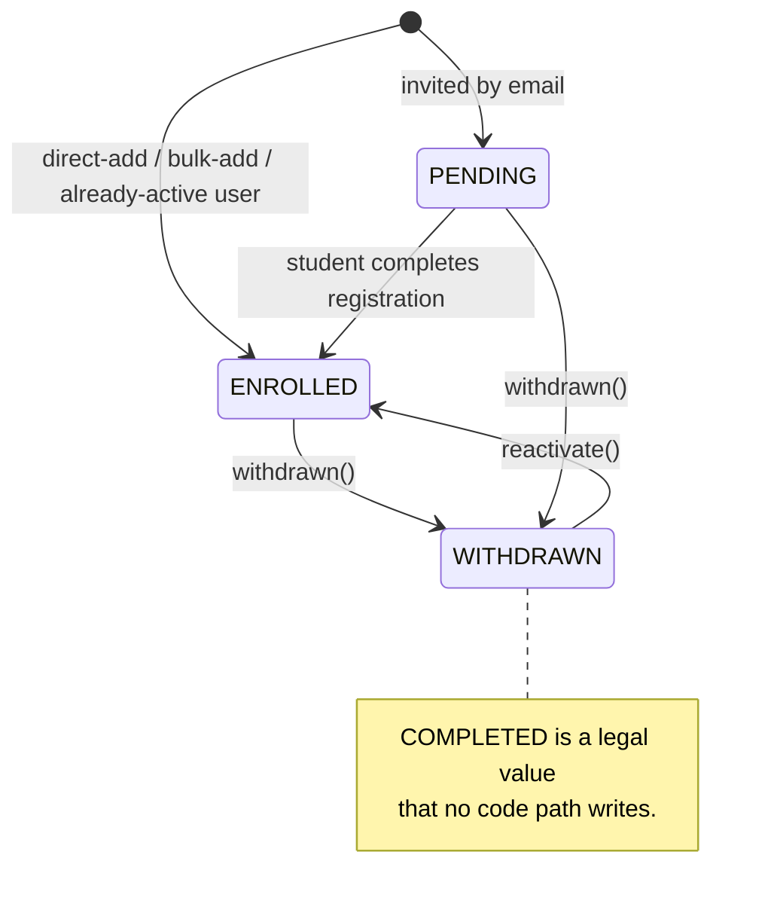
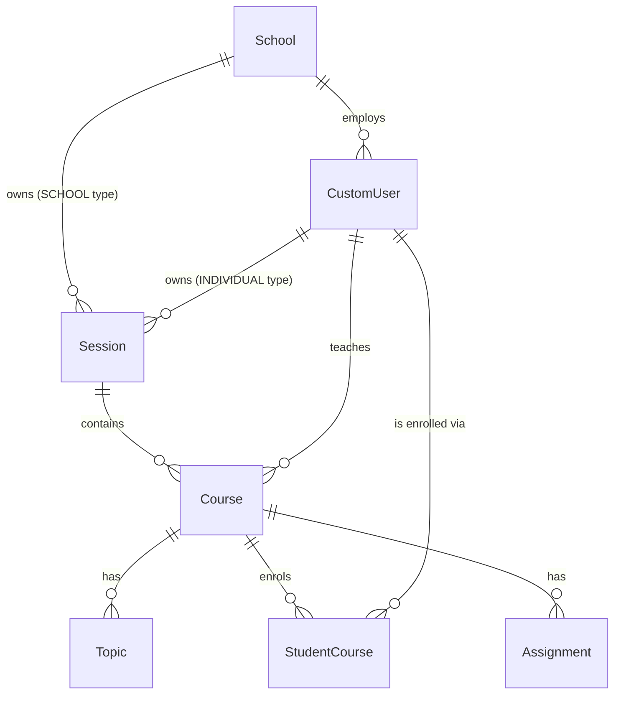
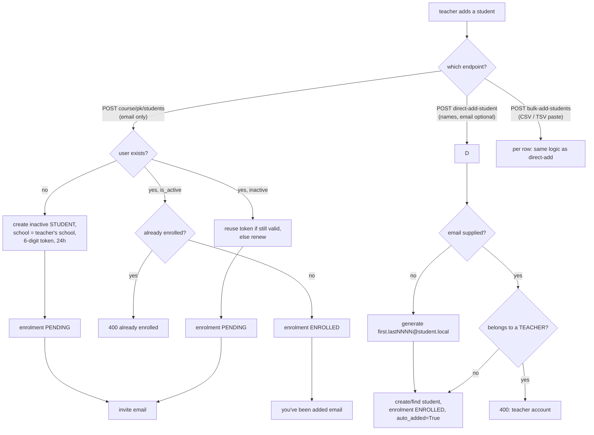
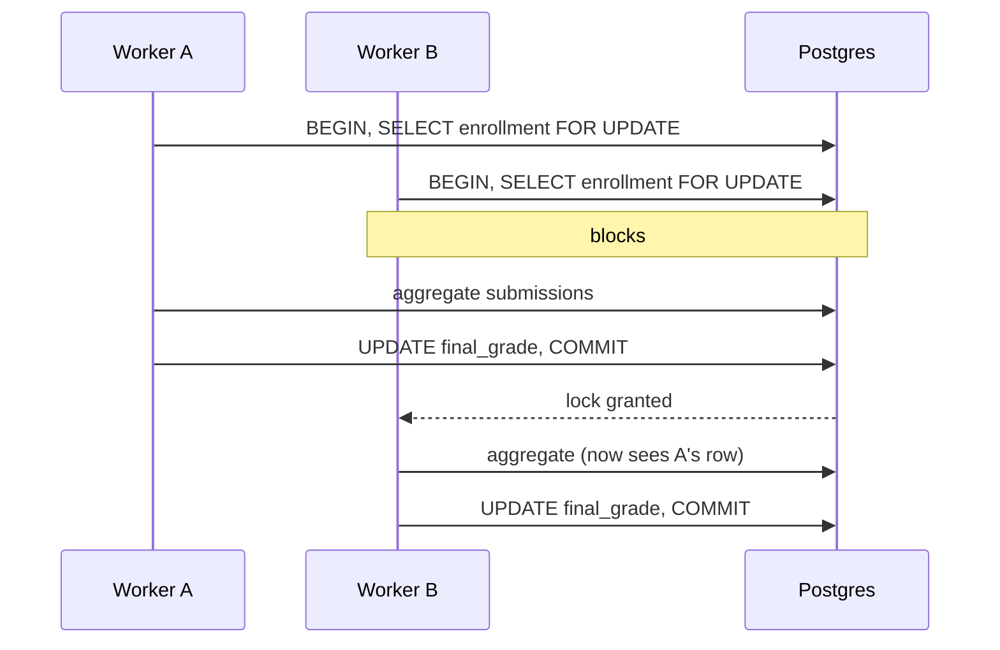
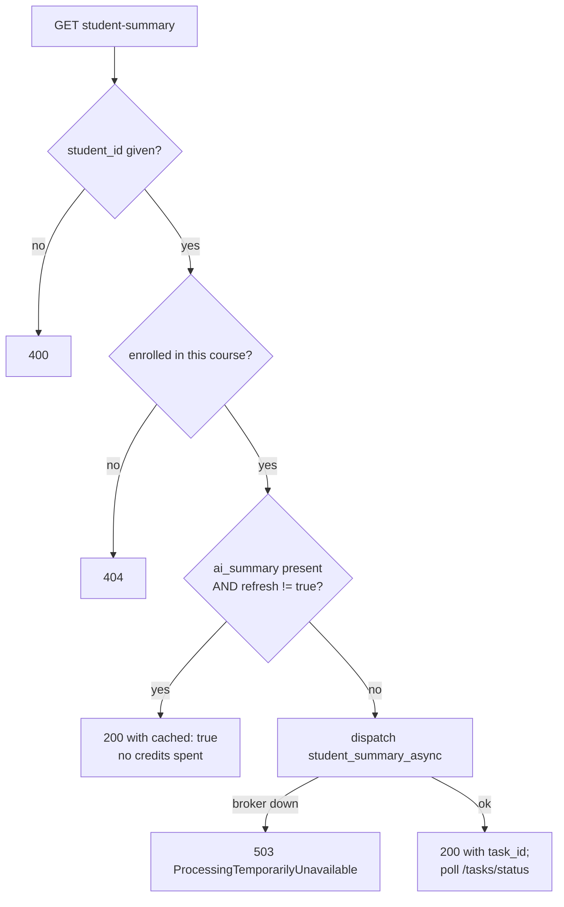

# Classrooms — schools, sessions, courses, topics, enrolment

> Part of the [backend reference](README.md). Related: [users-and-auth.md](users-and-auth.md), [assignments.md](assignments.md), [billing-licenses.md](billing-licenses.md), [security-and-tenancy.md](security-and-tenancy.md).

## In plain terms

This app holds the structure a teacher's work sits inside: a **school** (only relevant on the licence track), an academic **session** like "Fall 2026", the **courses** taught in that session, optional **topics** inside a course, and the record of which **students are enrolled** in which course. It is also where students get added — three different ways, depending on whether they have an email address, whether they already have an account, and whether the teacher is adding one student or pasting a whole roster. One quietly important rule lives here: two students with exactly the same name cannot be in the same course, because the name is how a scanned paper gets matched back to a person.

---

## Entry points

All paths relative to `/api/v1/`. Router is `SimpleRouter(trailing_slash=False)` ([classrooms/urls.py:11](../../classrooms/urls.py#L11)).

| Method | Path | Auth | Source |
|---|---|---|---|
| GET/POST/PATCH/DELETE | `schools` | **IsSuperAdmin only** | [classrooms/views.py:277-300](../../classrooms/views.py#L277-L300) |
| POST | `schools/create_with_admin` | IsSuperAdmin | [classrooms/views.py:303](../../classrooms/views.py#L303) |
| GET | `schools/admin-summary` | IsSuperAdmin | [classrooms/views.py:338](../../classrooms/views.py#L338) |
| GET | `schools/teacher-summary` | IsSuperAdmin | [classrooms/views.py:910](../../classrooms/views.py#L910) |
| GET | `schools/monthly-token-usage` | IsAuthenticated | [classrooms/views.py:1076](../../classrooms/views.py#L1076) |
| CRUD | `sessions` | IsAuthenticated + `CanManageSession` | [classrooms/views.py:2491](../../classrooms/views.py#L2491) |
| CRUD | `course` | IsAuthenticated + `IsTeacherOrReadOnly` | [classrooms/views.py:1247](../../classrooms/views.py#L1247) |
| POST | `course/<pk>/students` | teacher (via scoped queryset) | [classrooms/views.py:1322](../../classrooms/views.py#L1322) |
| POST | `course/<pk>/direct-add-student` | `IsTeacher` | [classrooms/views.py:1610](../../classrooms/views.py#L1610) |
| POST | `course/<pk>/bulk-add-students` | `IsTeacher` | [classrooms/views.py:1656](../../classrooms/views.py#L1656) |
| DELETE | `course/<pk>/student/<student_id>` | teacher (scoped) | [classrooms/views.py:1987](../../classrooms/views.py#L1987) |
| POST | `course/renew-student-token` | **AllowAny**, `register` throttle | [classrooms/views.py:2116](../../classrooms/views.py#L2116) |
| GET | `course/my-courses` | IsAuthenticated (student) | [classrooms/views.py:2226](../../classrooms/views.py#L2226) |
| GET | `course/<pk>/student-summary` | `IsTeacher` + `HasCreditBalance` | [classrooms/views.py:2319](../../classrooms/views.py#L2319) |
| POST | `course/<pk>/topics` | teacher (scoped) | [classrooms/views.py:2394](../../classrooms/views.py#L2394) |
| GET/PATCH/DELETE | `student-course` | IsAuthenticated + `IsTeacherOrReadOnly` | [classrooms/views.py:2679](../../classrooms/views.py#L2679) |
| GET | `student-course/my-students` | `IsTeacher` | [classrooms/views.py:2793](../../classrooms/views.py#L2793) |
| CRUD | `topics` | see note below | [classrooms/views.py:3028](../../classrooms/views.py#L3028) |

**`CourseCategoryViewSet` is defined but not routed** ([classrooms/views.py:2890](../../classrooms/views.py#L2890)) — it is absent from `classrooms/urls.py`, so `CourseCategory` has no API surface at all.

**`TopicViewSet` has two typos that disable protections** ([classrooms/views.py:3031-3033](../../classrooms/views.py#L3031-L3033)):
- `permission_class` (singular) instead of `permission_classes` — DRF ignores the attribute entirely, so the viewset falls back to the project default `IsAuthenticated`. **`IsTeacherOrReadOnly` is not in effect**; any authenticated user can POST/PATCH/DELETE a topic subject only to the queryset scoping.
- `"option"` instead of `"options"` in `http_method_names` — OPTIONS preflight is not allowed on this viewset.

### Celery tasks & signals

| Kind | Name | Source |
|---|---|---|
| Celery task | `classrooms.tasks.student_summary_async` (`bind=True`, **no retries, no time limit**) | [classrooms/tasks.py:10](../../classrooms/tasks.py#L10) |
| Signal | `post_save`/`post_delete` on `School`, `Session`, `Course`, `StudentCourse`, `Topic` → cache clear | [classrooms/signals.py:22-117](../../classrooms/signals.py#L22-L117) |
| Signal | `post_save` on `Course` → first-course milestone alert | [classrooms/signals.py:64-86](../../classrooms/signals.py#L64-L86) |
| Signal | `post_save`/`post_delete` on `students.StudentSubmission` → **recalculate `final_grade`** | [classrooms/signals.py:184-201](../../classrooms/signals.py#L184-L201) |

That last one is the app's most consequential piece of logic and lives here rather than in `students/` — see [Final-grade recalculation](#final-grade-recalculation).

---

## Data model

### `School` ([classrooms/models.py:11-21](../../classrooms/models.py#L11-L21))

| Field | Type | Null | Default | Notes |
|---|---|---|---|---|
| `id` | UUID | no | `uuid4` | PK |
| `name` | CharField(255) | no | — | **unique**, db_index |
| `address` | TextField | yes | — | |
| `phone` | CharField(20) | yes | — | |
| `website` | URLField(500) | yes | — | |
| `created_at` | DateTime | no | `auto_now_add` | |
| `is_active` | Boolean | no | `True` | **soft-delete flag** |

`DELETE /schools/<id>` does **not** delete — it sets `is_active=False` ([classrooms/views.py:289-295](../../classrooms/views.py#L289-L295)). The list is filtered to active schools unless `?include_archived=true` ([classrooms/views.py:284-287](../../classrooms/views.py#L284-L287)). Note `retrieve` uses the same queryset, so an archived school 404s on direct GET unless the query param is supplied.

### `Session` ([classrooms/models.py:29-114](../../classrooms/models.py#L29-L114))

An academic period. This model carries the individual-vs-school ownership split.

| Field | Type | Null | Default | Notes |
|---|---|---|---|---|
| `id` | UUID | no | `uuid4` | PK |
| `name` | CharField(100) | no | — | db_index |
| `created_at` | **DateField** | no | `auto_now_add` | date, not datetime |
| `owner_type` | CharField(20) | no | `INDIVIDUAL` | db_index; choices below |
| `teacher` | FK → CustomUser | yes | — | CASCADE. **Set only when `owner_type=INDIVIDUAL`** |
| `school` | FK → School | yes | — | CASCADE. **Set only when `owner_type=SCHOOL`** |
| `created_by` | FK → CustomUser | yes | — | `SET_NULL`, `related_name="+"`. Audit trail of who actually created it — kept separate from `teacher` so a SCHOOL session's `teacher` can stay null while still recording the author |

**`SessionOwnerType`** ([classrooms/models.py:24-26](../../classrooms/models.py#L24-L26)) — complete enumeration:

| Value | Meaning |
|---|---|
| `INDIVIDUAL` | owned by one teacher, no school |
| `SCHOOL` | created by a school admin, shared **read-only** with every teacher under that school |

**Constraints** ([classrooms/models.py:83-94](../../classrooms/models.py#L83-L94)) — two *partial* unique indexes:
- `unique_session_name_per_teacher` on `(name, teacher)` where `owner_type='INDIVIDUAL'`
- `unique_session_name_per_school` on `(name, school)` where `owner_type='SCHOOL'`

`clean()` enforces the ownership invariant in both directions ([classrooms/models.py:99-110](../../classrooms/models.py#L99-L110)), and `save()` calls `full_clean()` **unconditionally** ([classrooms/models.py:112-114](../../classrooms/models.py#L112-L114)). That means every `Session.save()` — including from a management command, a shell, or a bulk fixup — runs full model validation and raises `django.core.exceptions.ValidationError`, not a DRF one. It also means `Session.objects.bulk_create()` would **bypass** the check entirely, since `bulk_create` does not call `save()`.

### `Course` ([classrooms/models.py:117-151](../../classrooms/models.py#L117-L151))

| Field | Type | Null | Default | Notes |
|---|---|---|---|---|
| `id` | UUID | no | `uuid4` | PK |
| `name` | CharField(100) | no | — | db_index |
| `teacher` | FK → CustomUser | **yes** | — | CASCADE, `related_name="courses"` |
| `session` | FK → Session | **yes** | — | CASCADE, `related_name="courses"` |
| `description` | TextField | no (`blank=True`) | `""` | db_index — an index on a TextField, of limited use |
| `is_active` | Boolean | no | `True` | db_index |
| `created_at` | DateTime | no | `auto_now_add` | db_index |

`Meta.ordering = ["name"]`; unique constraint `unique_section_name_per_session` on `(name, teacher, session)`.

`__str__` is `f"{self.session.name} - {self.name}"` ([classrooms/models.py:150-151](../../classrooms/models.py#L150-L151)) — **this raises `AttributeError` when `session` is NULL**, which the schema permits. Anywhere a course is rendered in a log line, an admin page, or an error message, a session-less course will blow up.

`is_active` has no API path that sets it to `False` and no queryset filters on it — it is currently inert.

### `Topic` ([classrooms/models.py:154-176](../../classrooms/models.py#L154-L176))

`id` UUID PK, `name` CharField(100) db_index, `course` FK nullable (CASCADE, `related_name="topics"`), `created_at`. Unique on `(name, course)`. Same `__str__` NULL hazard as `Course`.

### `CourseCategory` ([classrooms/models.py:179-184](../../classrooms/models.py#L179-L184))

`id` UUID PK, `name` CharField(100) db_index. **No FK to anything, no route, no reference from `Course`.** It is an orphan table.

### `StudentCourse` — the enrolment ([classrooms/models.py:199-333](../../classrooms/models.py#L199-L333))

| Field | Type | Null | Default | Notes |
|---|---|---|---|---|
| `id` | UUID | no | `uuid4` | PK |
| `student` | FK → CustomUser | no | — | CASCADE, `related_name="enrollments"` |
| `course` | FK → Course | no | — | CASCADE, `related_name="enrollments"` |
| `auto_added` | Boolean | no | `False` | db_index. `True` when created by `direct_add_student`/bulk import rather than an email invitation |
| `created_at` | DateTime | no | `auto_now_add` | |
| `enrollment_status` | CharField(20) | no | `PENDING` | db_index; choices below |
| `withdrawal_date` | DateTime | yes | — | set by `withdrawn()`, cleared by `reactivate()` |
| `final_grade` | Decimal(5,2) | yes | — | **derived** — written only by the signal below, never by a serializer |
| `ai_summary` | TextField | yes | — | AI-generated performance summary for this student in this course |
| `ai_summary_generated_at` | DateTime | yes | — | cache timestamp for the above |

Unique constraint `unique_student_section_per_classroom` on `(student, course)`.

**`EnrollmentStatusType`** ([classrooms/models.py:187-191](../../classrooms/models.py#L187-L191)) — complete enumeration:

| Value | Meaning | Set by |
|---|---|---|
| `PENDING` | invited, account not yet activated | default; email-invite paths |
| `ENROLLED` | active | `direct_add_student`, `students` action for an already-active user, student registration completing |
| `WITHDRAWN` | removed from the course | `withdrawn()` |
| `COMPLETED` | course finished | **nothing in the codebase sets this** |

> **UNVERIFIED:** `COMPLETED` is a legal value that no code path ever writes. Whether it is aspirational or was written manually in production would need a data check (`SELECT enrollment_status, count(*) FROM classrooms_studentcourse GROUP BY 1`).

**Two managers** ([classrooms/models.py:242-243](../../classrooms/models.py#L242-L243)):
- `objects` = `StudentCourseQuerySet.as_manager()`, adding `.active()` which excludes `WITHDRAWN` ([classrooms/models.py:194-196](../../classrooms/models.py#L194-L196))
- `all_objects` = a plain `Manager`

Note that `objects` is **not** filtered by default — `.active()` is opt-in. `all_objects` is therefore functionally identical to `objects` for filtering purposes; its only difference is the absent `.active()` method.

### Status transitions


*Caption: `withdrawn()` is idempotent — it returns early if already withdrawn.*

Impossible transitions: nothing moves *to* `PENDING` after leaving it (`reactivate()` always goes to `ENROLLED`, even from `PENDING`), and nothing reaches `COMPLETED`.

### ER diagram


*Caption: `Session.teacher` and `Session.school` are mutually exclusive, enforced in `clean()`.*

---

## Session ownership and permissions

`CanManageSession` ([classrooms/permissions.py:114-168](../../classrooms/permissions.py#L114-L168)) is the most nuanced permission class in the codebase.

| Role | Read | Write |
|---|---|---|
| any authenticated | yes (queryset scoping does the narrowing) | — |
| `SUPER_ADMIN` + `is_superuser` | all sessions | always |
| `SCHOOL_ADMIN` | `SCHOOL` sessions of schools they belong to | only those (narrowed in `has_object_permission`) |
| `TEACHER` **not** under a licence | their own `INDIVIDUAL` sessions | only their own |
| `TEACHER` under an active licence | their school's `SCHOOL` sessions, read-only | **never** |
| `STUDENT` | sessions containing a course they are `ENROLLED` in | never |

**The key decision:** the teacher branch keys off `is_under_license()`, **not** `school_id` ([classrooms/permissions.py:122-128](../../classrooms/permissions.py#L122-L128), [classrooms/views.py:2540-2552](../../classrooms/views.py#L2540-L2552)). `school_id` stays set even after a teacher is removed from a licence or the licence lapses, so keying off it would leave that teacher permanently unable to see their own individual sessions. Keying off the live licence state means access follows the subscription.

`perform_create` assigns ownership server-side and never trusts the payload ([classrooms/views.py:2558-2600](../../classrooms/views.py#L2558-L2600)):

| Creator | Result |
|---|---|
| `SCHOOL_ADMIN` | `SCHOOL` session on their **first** school; `ParseError` if they administer none |
| `TEACHER`, not licensed | `INDIVIDUAL` session, `teacher=self`, `school=None` |
| `TEACHER`, licensed | `PermissionDenied` — "contact your school admin" |
| `SUPER_ADMIN` | requires an explicit `school` in the body; **there is deliberately no superadmin path for creating an INDIVIDUAL session on a teacher's behalf** |
| anyone else | `PermissionDenied` |

Note `admin_schools.first()` for a school admin: a user administering more than one school gets whichever school the default ordering returns, with no way to choose.

---

## Course and enrolment scoping

`CourseViewSet.get_queryset()` ([classrooms/views.py:1283-1320](../../classrooms/views.py#L1283-L1320)):

| Role | Sees |
|---|---|
| `TEACHER` | `teacher=self` |
| `STUDENT` | courses they have **any** enrolment in (including `WITHDRAWN`) |
| everyone else — **including `SCHOOL_ADMIN` and `SUPER_ADMIN`** | `Course.objects.none()` |

That is worth pausing on: a super admin cannot list courses through this endpoint. School-level course visibility is served by the dashboard endpoints instead ([dashboard.md](dashboard.md)).

The queryset prefetches `topics` and non-withdrawn enrolments into `active_enrollments`, and annotates `student_count` as a distinct count excluding withdrawn.

`StudentCourseViewSet.get_queryset()` ([classrooms/views.py:2709-2742](../../classrooms/views.py#L2709-L2742)) scopes to `course__teacher=user` for teachers, `student=user` for students, `none()` otherwise. `http_method_names` excludes `post` — enrolments are created only through the course actions, never by a direct POST.

Its submissions prefetch is deliberately filtered ([classrooms/views.py:2722-2730](../../classrooms/views.py#L2722-L2730)): unfiltered, it loaded **every** submission each student had ever made — across all courses, including other teachers' — into memory for the serializer to discard in Python. Both a performance and a data-exposure fix.

**Object-level protection on custom actions.** Custom `@action`s never call `self.get_object()`, so DRF's object-permission hook does not run. The code closes this by fetching through the scoped queryset explicitly:

```python
course = get_object_or_404(self.get_queryset(), pk=self.kwargs["pk"])
```

with the comment recording why: a bare `Course.objects.get(pk=...)` would let a teacher enrol a student into another teacher's course by guessing a course id ([classrooms/views.py:1331-1335](../../classrooms/views.py#L1331-L1335)).

A second, subtler ordering choice: the ownership lookup happens **before** the `transaction.atomic()` block, and the row is then re-fetched with `select_for_update()` inside it ([classrooms/views.py:1337-1346](../../classrooms/views.py#L1337-L1346)). Doing the initial lookup outside is what lets the ownership `Http404` propagate as a clean 404 rather than being swallowed by the blanket `except Exception` and downgraded to a 500. The same pattern is repeated in `remove_student` ([classrooms/views.py:1991-1997](../../classrooms/views.py#L1991-L1997)) and `handle_expired_token` ([classrooms/views.py:2216-2220](../../classrooms/views.py#L2216-L2220)).

---

## The name-uniqueness rule

`StudentCourse.find_name_conflicts()` ([classrooms/models.py:270-301](../../classrooms/models.py#L270-L301)) finds another enrolment in the same course whose student has a case-insensitively identical first, middle, **and** last name. `clean()` calls it and raises; `save()` calls `full_clean()` unconditionally ([classrooms/models.py:331-333](../../classrooms/models.py#L331-L333)).

**Why it exists:** the grading pipeline matches a scanned paper to a student by the name written on it (see [students-and-submissions.md](students-and-submissions.md)). Two identically-named students in one course make that match ambiguous, and an ambiguous match silently attributes one student's grade to another. The rule trades a rare legitimate case (genuine namesakes) for the elimination of a silent, high-cost error.

It is checked in four places, which is what makes it reliable:

| Where | When | Source |
|---|---|---|
| `StudentCourse.clean()` via `save()` | every write, including shell/admin | [classrooms/models.py:303-329](../../classrooms/models.py#L303-L329) |
| `DirectAddStudentSerializer.validate` | direct-add, for a friendly 400 | [classrooms/serializers.py:432-454](../../classrooms/serializers.py#L432-L454) |
| `StudentRegistrationCompletionSerializer` flow | when a student picks their name at registration | [users/views.py:1220-1240](../../users/views.py#L1220-L1240) |
| bulk import | per row | [classrooms/views.py:1880-1900](../../classrooms/views.py#L1880-L1900) |

The name comparison normalises with `.strip()` only ([classrooms/models.py:266-268](../../classrooms/models.py#L266-L268)); it does not collapse internal whitespace or normalise Unicode, so `"Jo  hn"` and `"John"` are different, as are visually identical names in different Unicode normal forms.

---

## Adding students: three paths


*Caption: only the email path produces a `PENDING` enrolment; the other two enrol immediately.*

### Path 1 — `POST course/<pk>/students` (email invitation)

Body: `{"email": ...}` ([classrooms/views.py:1322-1590](../../classrooms/views.py#L1322-L1590)). Three branches, all inside one `transaction.atomic()` on a `select_for_update()`-locked course:

| Existing user | Enrolment status | Email sent | Template |
|---|---|---|---|
| none | `PENDING` | "your course invitation is ready" | `ynrw7gy0ye2l2k8e` |
| active | `ENROLLED` | "you have been added to <course>" | `yzkq340r0n04d796` |
| inactive | `PENDING` | invitation | `ynrw7gy0ye2l2k8e` |

For an inactive existing user the token is **reused** if it is still present and unexpired, and only renewed otherwise ([classrooms/views.py:1537-1544](../../classrooms/views.py#L1537-L1544)) — so a student invited to a second course before activating does not have their first invite link invalidated.

A new student is created with `school = course.teacher.school` ([classrooms/views.py:1500](../../classrooms/views.py#L1500)). For an individual-track teacher that is `None`; for a licence-track teacher the student inherits the school. Note this contradicts the comment in [users/views.py:296-298](../../users/views.py#L296-L298) that "students carry `school=NULL`" — that is true for individual-track teachers only.

The response's `is_new_student` field is computed as `student.is_active is False` ([classrooms/views.py:1573](../../classrooms/views.py#L1573)) — it actually means "not yet activated", not "newly created".

All email dispatch uses `safe_delay`, so a broker outage silently drops the invitation while the enrolment still commits. **The student is then enrolled with a token they never received** — recoverable only via the renewal endpoint.

### Path 2 — `POST course/<pk>/direct-add-student`

For students with no email at all — the docstring says "like toddlers" ([classrooms/views.py:1604](../../classrooms/views.py#L1604)). `DirectAddStudentSerializer` ([classrooms/serializers.py:401-500](../../classrooms/serializers.py#L401-L500)) takes first/middle/last name, optional email, optional profile image.

If no email is given it generates `{first}.{last}{0-9999}@student.local` using `secrets.randbelow(10000)`, with non-alphanumerics stripped from the names ([classrooms/serializers.py:468-472](../../classrooms/serializers.py#L468-L472)). Those addresses are the `is_system_generated_email` placeholders that [users-and-auth.md](users-and-auth.md) describes — never real mailboxes, exempt from the personal/business fork, and returned as `email: null` by the API.

> The generated suffix is only 4 digits. With names stripped to alphanumerics, two students named "John Smith" in the same *school* have a 1-in-10,000 collision chance per pair; on collision the code finds the existing user and either enrols them (wrong student) or errors with "already enrolled". The `unique_student_section_per_classroom` and name-conflict rules catch the same-course case, but not a cross-course collision.

`validate_email` rejects an address that belongs to a `TEACHER` account ([classrooms/serializers.py:418-430](../../classrooms/serializers.py#L418-L430)) — but not one belonging to a `SCHOOL_ADMIN` or `SUPER_ADMIN`.

Enrolment is created directly as `ENROLLED` with `auto_added=True`.

### Path 3 — `POST course/<pk>/bulk-add-students`

Accepts either an uploaded CSV file or a `raw_data` string pasted from Excel ([classrooms/views.py:1656-1912](../../classrooms/views.py#L1656-L1912)). Delimiter is chosen by sniffing for a tab: `"\t" if "\t" in raw_data else ","` ([classrooms/views.py:1676](../../classrooms/views.py#L1676)).

Header detection accepts variations per field ([classrooms/views.py:1685-1690](../../classrooms/views.py#L1685-L1690)):

| Field | Accepted headers |
|---|---|
| `first_name` | `First Name`, `FirstName`, `first_name`, `first` |
| `last_name` | `Last Name`, `LastName`, `last_name`, `last` |
| `middle_name` | `Middle Name`, `middle_name`, `middle` |
| `email` | `Email`, `email`, `e-mail` |

The response is **per-row, not all-or-nothing** ([classrooms/views.py:1902-1911](../../classrooms/views.py#L1902-L1911)):

```json
{"total_processed": N, "success_count": N, "failure_count": N,
 "results": [{"name": "...", "status": "failed", "error": "..."}]}
```

Each row's exception is caught, logged, converted through `describe_user_error`, and recorded — so one bad row does not abort the import. The HTTP status is always **200**, even when every row failed; callers must read `failure_count`.

The uploaded file is decoded as UTF-8 with no error handling ([classrooms/views.py:1671](../../classrooms/views.py#L1671)), so a Latin-1 or UTF-16 CSV (common from Excel on Windows) raises `UnicodeDecodeError` before any row is processed.

### Renewing an expired invite

`POST course/renew-student-token` ([classrooms/views.py:2108-2210](../../classrooms/views.py#L2108-L2210)) is `AllowAny` — an unauthenticated caller submits an expired token and gets a fresh one emailed. The code is explicit that this is "both a token-guessing oracle and a free outbound-mail trigger", which is why it shares the `register` throttle bucket ([classrooms/views.py:2111-2115](../../classrooms/views.py#L2111-L2115)).

It requires the user to be inactive **and** to have a `PENDING` enrolment, then calls `renew_activation_token()` (students only — it raises `ValueError` for any other type). It emails both the student *and* the teacher, using Django templates `email/student_token_renewal.html` and `email/teacher_token_renewal_notification.html` — the only two places in this app that render templates rather than using MailerSend merge data.

The `except ParseError: raise` before the blanket handler ([classrooms/views.py:2199-2203](../../classrooms/views.py#L2199-L2203)) exists so DRF turns it into a real 400 rather than the generic 500 the blanket handler would produce.

---

## Final-grade recalculation

The single most important business rule in this app ([classrooms/signals.py:128-201](../../classrooms/signals.py#L128-L201)).

**Formula:** `sum(score) / sum(max_points) * 100`, over every submission by that student in that course where `graded_at IS NOT NULL AND score IS NOT NULL AND max_points > 0`.

| Decision | Rule | Reasoning |
|---|---|---|
| Points-weighted, not a mean of percentages | `Sum("score") / Sum("max_points")` | a 100-point exam must count more than a 5-point quiz |
| Runs on save **and** delete | two receivers | otherwise `final_grade` keeps counting work that was resubmitted, ungraded, or removed |
| Clamped to 0–100 | `max(0, min(100, raw))` | extra credit above 100% or a negative adjustment would otherwise fall outside every band in grade-distribution reporting |
| Rounded to 2dp, `ROUND_HALF_UP` | `quantize(Decimal("0.01"))` | matches `Decimal(5,2)` |
| `None` when there is nothing graded | `if not total_max_points` | distinguishes "no work yet" from "scored zero" |
| Written only if changed | `if enrollment.final_grade != new_final_grade` | avoids a pointless UPDATE and the cache-invalidation cascade it would trigger |
| **Row lock** | `select_for_update()` around aggregate + write | see below |

**The lock is the load-bearing part.** Batch grading ("grade all") finishes several submissions for the same `(student, course)` on different workers at nearly the same moment. An unlocked read-aggregate-write let a worker holding a *stale* aggregate win the last write, permanently understating `final_grade` — and nothing re-triggers the recalculation afterwards, so the wrong number is final. Under the lock, the second worker blocks until the first commits and then aggregates fresh data ([classrooms/signals.py:138-146](../../classrooms/signals.py#L138-L146)).


*Caption: without `FOR UPDATE`, B's stale aggregate would overwrite A's correct one.*

If the enrolment row does not exist, the function returns silently ([classrooms/signals.py:154-155](../../classrooms/signals.py#L154-L155)) — a submission for a student who was withdrawn and had their enrolment deleted simply does not update anything.

Note the signal fires on **every** `StudentSubmission.save()`, not only when a grade changed. A save that only touches, say, a status field still performs a locked aggregate. That is the cost of correctness here.

---

## First-course milestone alert

`notify_admins_of_teacher_first_course` ([classrooms/signals.py:64-86](../../classrooms/signals.py#L64-L86)):

| Condition | Effect |
|---|---|
| `created` is False | skip |
| no teacher, or teacher has no `school_id` | skip — individual-track teachers have no admins to notify |
| `Course.objects.filter(teacher=teacher).count() != 1` | skip — fires only on the *first* course |
| otherwise | queue `dashboard.tasks.send_teacher_first_course_milestone_alert` **on commit** |

`transaction.on_commit` matters: the task looks the course up by id, so dispatching before commit could hand the worker an id that is not yet visible (or never will be, if the transaction rolls back). The dispatch uses `safe_delay`, so a broker outage loses the alert without failing the course creation.

The `count() != 1` test is a race in principle — two courses created concurrently could both see a count of 2, or both see 1 — but the consequence is a missed or duplicated congratulation email.

---

## AI student summary

`GET course/<pk>/student-summary?student_id=<uuid>[&refresh=true]` ([classrooms/views.py:2316-2368](../../classrooms/views.py#L2316-L2368)).


*Caption: the cache check happens **after** `HasCreditBalance`, so a teacher with an empty wallet cannot read an already-generated summary.*

That ordering is worth noting: `HasCreditBalance` is a permission class, so it runs before the view body. A teacher who has run out of credits gets a 400 "Insufficient Credits" even for a cached summary that would cost nothing.

The cache is the `ai_summary` column itself — there is no TTL and no invalidation. A summary generated in September still returns in December unless `?refresh=true` is passed. `ai_summary_generated_at` is returned so a client can decide, but nothing server-side enforces freshness.

**`student_summary_async` is unusually unprotected** ([classrooms/tasks.py:9-41](../../classrooms/tasks.py#L9-L41)) for a task that makes a billed AI call:

- `bind=True` but **no `max_retries`, no `autoretry_for`, no time limit, no soft time limit**.
- `enrollment` is fetched with `.first()` and then used **without a None check** ([classrooms/tasks.py:16-30](../../classrooms/tasks.py#L16-L30)) — a student unenrolled between the view's check and the task's execution produces `AttributeError: 'NoneType' object has no attribute 'ai_summary'`, **after** the AI call has already been paid for.
- `except Exception as exc: raise exc` ([classrooms/tasks.py:40-41](../../classrooms/tasks.py#L40-L41)) is a no-op that adds nothing.
- It calls `enrollment.save()` with no `update_fields`, which triggers `full_clean()` (via `StudentCourse.save`) and therefore re-runs the name-conflict check on an unrelated write. If a name conflict was created in the meantime, saving the summary fails.
- Unlike every other user-initiated AI action, it does **not** go through `students.task_tracking.launch_processing_task`, so it has no `ProcessingTask` row — `/tasks/status/<id>` falls back to the Celery `AsyncResult` branch, which carries no context and no ownership check.

The view catches `BROKER_UNAVAILABLE_ERRORS` around `.delay()` by hand ([classrooms/views.py:2355-2358](../../classrooms/views.py#L2355-L2358)) rather than using the shared helper — same outcome, duplicated logic.

There is a substantial block of dead commented-out code below the return ([classrooms/views.py:2371-2391](../../classrooms/views.py#L2371-L2391)) showing the previous synchronous implementation.

---

## Caching

Five signal handlers clear wildcard patterns on every write ([classrooms/signals.py:22-117](../../classrooms/signals.py#L22-L117)):

| Sender | Patterns cleared |
|---|---|
| `School` | `*superadmin*`, `*schooladmin*`, `schools:*`, `courses:*`, `sessions:*` |
| `Session` | `*superadmin*`, `*schooladmin*`, `*school*`, `sessions:*`, `courses:*`, `assignments:*`, `studentsubmissions:*` |
| `Course` | the above plus `*teacheradmin*`, `*studentadmin*`, `*user*`, `studentcourses:*`, `topics:*` (12 patterns) |
| `StudentCourse` | 11 patterns |
| `Topic` | 8 patterns |

**This module defines its own `delete_cache_patterns`** ([classrooms/signals.py:14-19](../../classrooms/signals.py#L14-L19)) that shadows the batching helper in `AutoGrader.cache_utils`. It calls `cache.delete_pattern` immediately in a loop and does **not** deduplicate or participate in `batched_cache_invalidation`.

The consequence is concrete: a bulk import of 100 students fires the `StudentCourse` handler 100 times × 11 patterns = **1,100 keyspace SCANs against Redis**, plus another 1,100 from the `CustomUser` signal for the accounts created. This is exactly the scenario `AutoGrader/cache_utils.py` was written for ([AutoGrader/cache_utils.py:6-11](../../AutoGrader/cache_utils.py#L6-L11)); this module predates or missed it.

`DJANGO_REDIS_SCAN_ITERSIZE = 100_000` ([settings.py:1178](../../AutoGrader/settings.py#L1178)) reduces the round trips per scan but not the number of scans.

### A URL-name collision worth knowing

`schools/admin-summary` sets `url_name="admins-summary"` explicitly ([classrooms/views.py:338-350](../../classrooms/views.py#L338-L350)). Without it, DRF derives `url_name` from the method name (`admin-summary`), which with the `school` basename produces the reverse name `school-admin-summary` — **identical** to the one `dashboard.SchoolAdminDashboardView`'s `summary` action produces from basename `school-admin`. The two endpoints share nothing (`/schools/admin-summary` vs `/school-admin/dashboard/summary`), but whichever registered last would silently win every `reverse()` call.

---

## Failure modes & recovery

| Failure | User sees | Recovery |
|---|---|---|
| Duplicate name in a course | 400 naming the student and course | rename, or use a distinct middle name |
| Student already enrolled | 400 "already enrolled in this course" | — |
| Invite email dropped (broker down) | success — enrolment committed | student must use `renew-student-token`, or teacher re-adds |
| Bulk CSV in a non-UTF-8 encoding | 500 (`UnicodeDecodeError`) before any row | re-save the file as UTF-8 |
| Bulk import, some rows bad | **200** with `failure_count > 0` and per-row errors | fix and re-upload only the failed rows |
| Session name collides | `ValidationError` from the partial unique constraint | rename |
| `INDIVIDUAL` session with a school (or vice versa) | Django `ValidationError` from `clean()` | — |
| Licensed teacher tries to create a session | 403 "contact your school admin" | by design |
| School admin with no school creates a session | 400 "not assigned as an admin for any school" | attach them to a school |
| Course with `session=NULL` rendered | `AttributeError` in `__str__` | guard the render, or backfill `session` |
| `student_summary_async` on an unenrolled student | task `FAILURE`, **credits already spent** | manual — re-run after re-enrolling |
| `student_summary_async` hits a name conflict on save | task `FAILURE` after the AI call | resolve the conflict, re-run |
| Two workers grade the same student concurrently | correct — the row lock serialises them | — |
| Enrolment deleted after grading | `final_grade` is simply not updated; no error | — |

**Where data can go inconsistent:** `final_grade` is a derived value with no reconciliation job. If the signal is ever bypassed — `bulk_update`, a raw SQL fix, a `Submission` written with `update()` instead of `save()` — the stored grade silently diverges and nothing recomputes it. The only repair is to touch each affected submission so the signal re-fires.

---

## Configuration

This app has no env vars of its own. It reads:

| Setting | Used for |
|---|---|
| `STUDENT_FRONTEND_DOMAIN` | every student registration/login link ([classrooms/views.py:1382](../../classrooms/views.py#L1382), [1521](../../classrooms/views.py#L1521), [1567](../../classrooms/views.py#L1567), [2143](../../classrooms/views.py#L2143)) |
| `DEFAULT_FROM_EMAIL`, `SUPPORT_EMAIL` | every email |
| `ACTIVATION_TOKEN_VALIDITY` (constant, 24h) | new-student invite expiry ([users/models.py:34](../../users/models.py#L34)) |
| `CACHE_TTL` | `UserCacheMixin` list/retrieve caching |

MailerSend template ids are **hardcoded in the view**, not configurable:

| Template id | Purpose |
|---|---|
| `ynrw7gy0ye2l2k8e` | "complete your registration" invite (shared with `send_user_activation_email`) |
| `yzkq340r0n04d796` | "you have been added to <course>" for an already-active student |

Changing either requires a code deploy. The "expires in 24 hours" wording in these emails is a literal string, not derived from `ACTIVATION_TOKEN_VALIDITY` — the same drift hazard flagged in [users-and-auth.md](users-and-auth.md).
