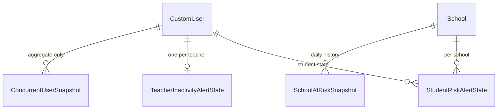
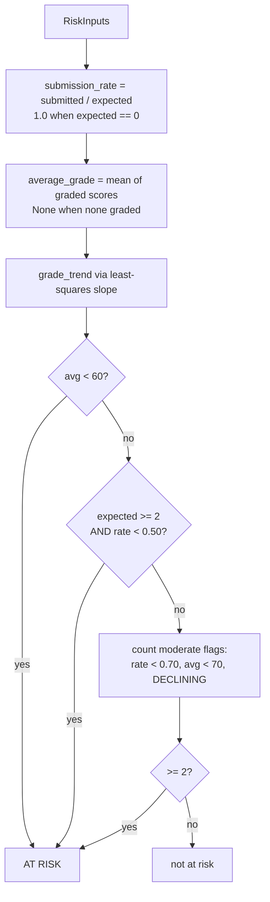
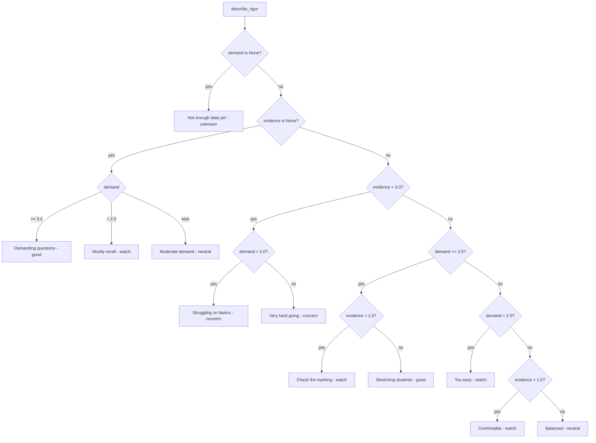
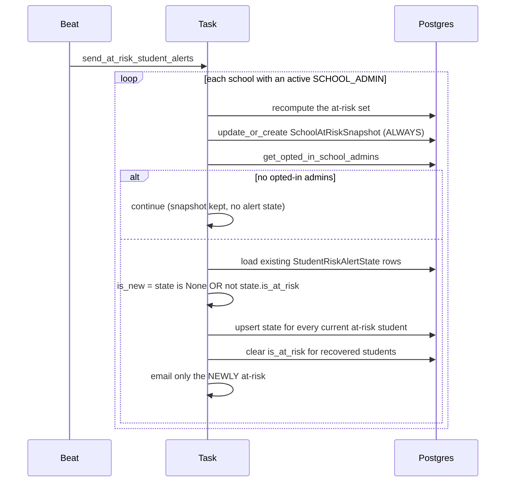
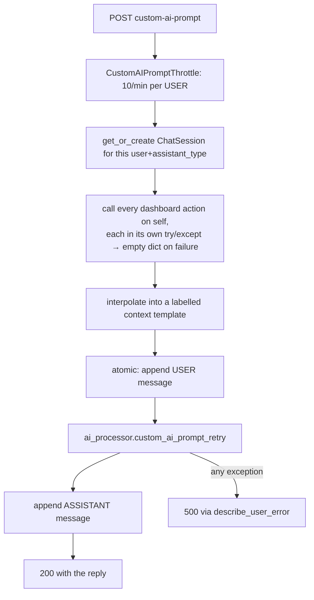

# Dashboard — analytics, at-risk detection, rigor roll-up, digests

> Part of the [backend reference](README.md). Related: [assignments.md](assignments.md), [ai-processor.md](ai-processor.md), [classrooms.md](classrooms.md), [security-and-tenancy.md](security-and-tenancy.md).

## In plain terms

The dashboard is the reporting layer: four different screens, one per role. A super admin sees the whole platform, a school admin sees their school, a teacher sees their own classes, a student sees their own work. It also runs the scheduled emails — weekly summaries for teachers, students, and school admins, plus two daily watchdogs: one that spots students who have started slipping, and one that spots teachers who have stopped logging in. Two ideas do most of the work here. **At-risk** is a single shared definition of "this student needs attention", so every screen and email agrees. **Rigor** is a 0–5 score for how much real thinking a teacher's assignments actually demand — deliberately paired with a plain-English verdict, because the number on its own misleads.

---

## Entry points

All paths relative to `/api/v1/`. `DefaultRouter(trailing_slash=False)` ([dashboard/urls.py:12](../../dashboard/urls.py#L12)).

### Four viewsets, one permission class each

| Viewset | Base | Permission | Source |
|---|---|---|---|
| `SuperAdminDashboardView` | `super-admin` | `IsSuperAdmin` | [dashboard/views.py:121](../../dashboard/views.py#L121) |
| `SchoolAdminDashboardView` | `school-admin` | `IsSchoolAdmin` | [dashboard/views.py:1273](../../dashboard/views.py#L1273) |
| `TeacherAdminDashboardView` | `teacher-admin` | `IsTeacher` | [dashboard/views.py:2855](../../dashboard/views.py#L2855) |
| `StudentAdminDashboardView` | `student-admin` | `IsStudent` | [dashboard/views.py:3700](../../dashboard/views.py#L3700) |

**Every viewset is a bare `viewsets.ViewSet`** with one class-level `permission_classes` and no per-action overrides. Role separation is therefore total: a school admin cannot reach a super-admin endpoint at all, rather than reaching it and seeing a filtered result. `IsSuperAdmin` requires **both** `user_type == SUPER_ADMIN` and `is_superuser` ([classrooms/permissions.py:74-80](../../classrooms/permissions.py#L74-L80)).

### Endpoints

| Method | Path | Source |
|---|---|---|
| GET | `super-admin/dashboard/adoption` | [views.py:141](../../dashboard/views.py#L141) |
| GET | `super-admin/dashboard/usage` | [views.py:227](../../dashboard/views.py#L227) |
| GET | `super-admin/dashboard/ai_performance` | [views.py:342](../../dashboard/views.py#L342) |
| GET | `super-admin/dashboard/scaling_signals` | [views.py:475](../../dashboard/views.py#L475) |
| GET | `super-admin/dashboard/schools` | [views.py:683](../../dashboard/views.py#L683) |
| GET | `super-admin/dashboard/teachers` | [views.py:787](../../dashboard/views.py#L787) |
| GET | `super-admin/dashboard/students` | [views.py:878](../../dashboard/views.py#L878) |
| GET | `super-admin/dashboard/concurrency` | [views.py:972](../../dashboard/views.py#L972) |
| POST | `super-admin/dashboard/custom-ai-prompt` | [views.py:1012](../../dashboard/views.py#L1012) |
| GET | `super-admin/dashboard/custom-ai-prompt/history` | [views.py:1144](../../dashboard/views.py#L1144) |
| GET | `school-admin/dashboard/summary` | [views.py:1295](../../dashboard/views.py#L1295) |
| GET | `school-admin/dashboard/at-risk-trend` | [views.py:1542](../../dashboard/views.py#L1542) |
| GET | `school-admin/dashboard/teachers` | [views.py:1836](../../dashboard/views.py#L1836) |
| GET | `school-admin/dashboard/teachers/<teacher_id>` | [views.py:1948](../../dashboard/views.py#L1948) |
| GET | `school-admin/dashboard/course-performance` | [views.py:2178](../../dashboard/views.py#L2178) |
| GET | `school-admin/dashboard/unit-performance` | [views.py:2366](../../dashboard/views.py#L2366) |
| GET | `school-admin/dashboard/students` | [views.py:2458](../../dashboard/views.py#L2458) |
| GET | `school-admin/dashboard/assignment-activity-over-time` | [views.py:2592](../../dashboard/views.py#L2592) |
| GET | `school-admin/dashboard/course-overview-chart` | [views.py:2702](../../dashboard/views.py#L2702) |
| POST/GET | `school-admin/dashboard/custom-ai-prompt[/history]` | [views.py:2756](../../dashboard/views.py#L2756) |
| GET | `teacher-admin/dashboard/overview/<session_id>` | [views.py:2891](../../dashboard/views.py#L2891) |
| GET | `teacher-admin/dashboard/courses/<course_id>` | [views.py:3197](../../dashboard/views.py#L3197) |
| GET | `teacher-admin/dashboard/assignments/<assignment_id>` | [views.py:3331](../../dashboard/views.py#L3331) |
| GET | `teacher-admin/dashboard/students/<course_id>` | [views.py:3438](../../dashboard/views.py#L3438) |
| POST/GET | `teacher-admin/dashboard/custom-ai-prompt[/history]` | [views.py:3583](../../dashboard/views.py#L3583) |
| GET | `student-admin/dashboard/summary/<course_id>` | [views.py:3732](../../dashboard/views.py#L3732) |
| GET | `student-admin/dashboard/assignments` | [views.py:3937](../../dashboard/views.py#L3937) |
| GET | `student-admin/dashboard/overview` | [views.py:4025](../../dashboard/views.py#L4025) |

### Celery tasks — all on Beat

| Task | Schedule | Setting |
|---|---|---|
| `record_concurrent_users` | **every 60s** | fixed |
| `send_weekly_course_summaries` | weekly | `WEEKLY_COURSE_SUMMARY_DAY_OF_WEEK` / `_HOUR` / `_MINUTE` |
| `send_weekly_student_summaries` | weekly | same three |
| `send_weekly_school_admin_summaries` | weekly | same three |
| `send_at_risk_student_alerts` | daily | `AT_RISK_ALERT_HOUR` / `_MINUTE` |
| `send_teacher_inactivity_alerts` | daily | `TEACHER_INACTIVITY_ALERT_HOUR` / `_MINUTE` |
| `send_teacher_first_course_milestone_alert(course_id)` | **event-driven** | dispatched by `classrooms.signals` on commit |

All six scheduled tasks are in `BEAT_HEALTH_EXPECTATIONS` ([settings.py:921-939](../../AutoGrader/settings.py#L921-L939)).

---

## Data model

Three small state tables. All the interesting numbers are computed on demand.

### `StudentRiskAlertState` ([dashboard/models.py:4-32](../../dashboard/models.py#L4-L32))

*"Persisted cache of each student's school-wide at-risk status, used to detect a `false→true` transition ('newly at-risk')."*

| Field | Type | Null | Default | Notes |
|---|---|---|---|---|
| `student` | FK → CustomUser | no | — | CASCADE, `related_name="risk_alert_states"` |
| `school` | FK → School | no | — | CASCADE |
| `is_at_risk` | Boolean | no | `False` | the transition being detected |
| `average_score` | Decimal(5,2) | yes | — | cleared to `None` on recovery |
| `last_checked_at` | DateTime | no | `auto_now` | |
| `last_alerted_at` | DateTime | yes | — | only bumped on a **new** flag |

Unique on `(student, school)`. **A mutable cache with no history** — which is exactly why the next model exists.

### `SchoolAtRiskSnapshot` ([dashboard/models.py:35-61](../../dashboard/models.py#L35-L61))

*"Daily snapshot … written for every school **regardless of email opt-in**. This is the only historical record of at-risk counts over time; `StudentRiskAlertState` is a mutable per-student cache with no history, so it can't serve trend charts."*

`school` FK, `snapshot_date` (Date), `at_risk_count` (PositiveInt), `created_at`. Unique on `(school, snapshot_date)`, ordered by `snapshot_date`.

Written with `update_or_create` ([tasks.py:320-324](../../dashboard/tasks.py#L320-L324)), so re-running the task the same day overwrites rather than duplicating.

### `TeacherInactivityAlertState` ([dashboard/models.py:64-82](../../dashboard/models.py#L64-L82))

*"…so the daily teacher-activity alert task sends exactly one email per inactivity episode instead of re-alerting every day the teacher remains inactive."*

`teacher` **OneToOne** → CustomUser (CASCADE), `is_flagged_inactive` (Boolean, default `False`), `last_active_at`, `last_alerted_at`.

### ER diagram


*Caption: no dashboard model stores a computed metric — only alert state and one count series.*

`ai_processor.ChatSession` / `ChatMessage` back the custom-AI-prompt history; see [Custom AI prompt](#custom-ai-prompt).

---

## At-risk classification

[dashboard/risk.py](../../dashboard/risk.py) is the **single source of truth**, *"Used by the weekly teacher course-summary email, the school-admin dashboard/weekly digest/daily alert task, and the teacher-admin session and per-course student dashboards, so all consumers agree on one definition instead of drifting independently"* ([risk.py:1-7](../../dashboard/risk.py#L1-L7)).

Pure dataclasses in, dataclass out. Inputs: `expected_assignment_count`, `submitted_count`, and `(submission_date, score_percentage)` pairs.

### The rule

```
at_risk = critical_grade OR critical_missing_work OR (moderate_flags >= 2)
```

| Component | Condition | Threshold |
|---|---|---|
| `critical_grade` | `average_grade is not None and average_grade < 60.0` | `CRITICAL_GRADE_THRESHOLD` |
| `critical_missing_work` | `expected >= 2 and submission_rate < 0.50` | `CRITICAL_SUBMISSION_THRESHOLD` |
| moderate A | `average_grade is not None and average_grade < 70.0` | `MODERATE_GRADE_THRESHOLD` |
| moderate B | `submission_rate < 0.70` | `SUBMISSION_RISK_THRESHOLD` |
| moderate C | `grade_trend == DECLINING` | — |


*Caption: `average_grade is None` (nothing graded yet) can never trigger the grade flags — a student with no grades is not automatically at risk.*

Two safety properties fall out of the `is not None` guards: a student with **no graded work at all** cannot trip either grade condition, and a student with **no assignments due** gets `submission_rate = 1.0` rather than a divide-by-zero.

`critical_missing_work` requires `expected >= 2` — missing one of one assignment is not yet a pattern.

### Trend detection

`_calculate_grade_trend` ([risk.py:130-159](../../dashboard/risk.py#L130-L159)):

| Rule | Value | Reasoning |
|---|---|---|
| Window | last **6** graded scores (`TREND_WINDOW`) | |
| Minimum | 2 points, else `INSUFFICIENT DATA` | |
| Method | **least-squares slope** (`np.polyfit`) projected across the window's date span | *"Using every point (rather than just the first/last score) makes the result far less sensitive to any single outlier"* |
| All graded the same day | falls back to first-vs-last | there is no time axis to fit against |
| Deadband | **±3.0** points (`TREND_DEADBAND`) | below this, `STABLE` — ordinary wobble is not a trend |

`TREND_INSUFFICIENT_DATA` is deliberately **not** `DECLINING`, so a student with one graded assignment never picks up moderate flag C.

### Issue tags and reasons

Alongside the boolean, `evaluate()` returns human-readable `issue_tags` and `reasons` ([risk.py:71-101](../../dashboard/risk.py#L71-L101)):

| Tag | When |
|---|---|
| `missing_submissions` | nothing submitted at all, or rate < 0.70 (with the missing count named) |
| `conceptual_gaps` | avg < 70 **and** submission rate is fine — *"suggests conceptual gaps despite regular submission"* |
| `low_scores` | avg < 70 **and** submission rate is also low |
| `declining_performance` | trend is `DECLINING` |

The `conceptual_gaps` / `low_scores` split is a genuinely useful distinction: the same low average means something different depending on whether the student is turning work in.

### Dead code

[dashboard/at_risk_improvements.py](../../dashboard/at_risk_improvements.py) is **430 lines entirely commented out** — an alternative multi-level `AtRiskCalculator` with variance, momentum, and recency scoring. `AT_RISK_IMPLEMENTATION_GUIDE.py` (363 lines) is a `.py` file used as prose documentation. Neither is imported by anything.

> **UNVERIFIED:** whether `at_risk_improvements.py` is an abandoned experiment or a staged replacement. To resolve: check git history for when it was commented out, or ask the author.

---

## Rigor roll-up

[dashboard/rigor.py](../../dashboard/rigor.py) rolls the per-assignment scores from [assignments/rigor.py](assignments.md#rigor-scoring) up to a teacher, and adds the `evidence` component, which lives in submission data rather than on the assignment.

Payload shape ([rigor.py:20-29](../../dashboard/rigor.py#L20-L29)):

```json
{"score": 3.4, "demand": 4.2, "evidence": 2.1, "standards": 3.8,
 "coverage": 0.94, "assignments_scored": 12, "submissions_scored": 340}
```

### Two queries, not two per teacher

`build_rigor_by_teacher(teacher_ids)` answers *"for every teacher in a school in **two queries total**, regardless of teacher count. The previous implementation ran two aggregate queries per teacher inside a Python loop, on top of re-deriving the metric from raw point values on every request"* ([rigor.py:11-16](../../dashboard/rigor.py#L11-L16)).

This is what the denormalised `Assignment.rigor_*` columns exist for ([assignments/models.py:64-70](../../assignments/models.py#L64-L70)).

### Two thresholds with recorded reasoning

| Constant | Value | Reasoning |
|---|---|---|
| `MIN_GRADED_SUBMISSIONS` | **5** | *"`evidence` is a sample statistic, so it needs a sample. Below this many graded submissions across a teacher's whole body of work the average is noise and we report None rather than a number that will swing wildly."* **`demand` has no equivalent floor** — *"it is measured from the questions themselves, not sampled, so one assignment's demand is genuinely that assignment's demand"* ([rigor.py:37-43](../../dashboard/rigor.py#L37-L43)) |
| `SCOREABLE_STATUSES` | everything except `DRAFT` | *"Draft assignments were never given to students, so they are not evidence of anything a teacher asked of anyone. Everything else (published **and unpublished**, i.e. published-then-withdrawn) counts"* ([rigor.py:45-50](../../dashboard/rigor.py#L45-L50)) |

### `describe_rigor` — why the number is not the deliverable

The reasoning is stated directly ([rigor.py:52-59](../../dashboard/rigor.py#L52-L59)):

> *"A bare 0-5 number tells a head teacher nothing, and comparing two of them actively misleads: **a teacher who sets harder questions but marks generously can score below one who sets easier questions marked honestly.** So every payload carries a plain-language verdict derived from the same components, and **that verdict — not the number — is what the weekly email leads with**."*

`describe_rigor(demand, evidence, standards, coverage)` ([rigor.py:81-199](../../dashboard/rigor.py#L81-L199)) returns `{label, meaning, tone, standards_note, coverage_note}`, kept beside the scoring *"so the API, the HTML email and the plain-text email all say the same thing."*

Interpretation thresholds:

| Constant | Value | Meaning |
|---|---|---|
| `DEMAND_HIGH` | 3.0 | Analyze/Evaluate/Create territory |
| `DEMAND_LOW` | 2.0 | mostly Remember/Understand — recall, not thinking |
| `EVIDENCE_EASY` | 1.0 | class averages **over 80%** — almost nobody was stretched |
| `EVIDENCE_STRUGGLING` | 3.0 | class averages **under 40%** — students are not coping |
| `STANDARDS_WEAK` | 2.5 | fewer than half the open-ended questions carry a usable rubric |
| `COVERAGE_THIN` | 0.5 | below this, say so rather than implying the verdict covers everything |

Remember `evidence` runs **opposite** to student scores (`5 × (1 − avg%/100)`), which is why higher evidence is worse.

### The verdict decision tree


*Caption: eleven verdicts, each with a `tone` for colour-coding.*

Two are worth calling out because they encode judgement, not arithmetic:

- **"Check the marking"** (demanding questions, yet almost everyone scores top marks): *"Worth checking whether marking is too generous or answers are circulating."* This is the only verdict that questions the teacher's grading rather than their question-setting.
- **"Struggling on basics"** (recall questions, low scores): *"The issue is more likely support than difficulty."* Low scores dominate the reading whatever the questions look like — the tree checks `evidence > EVIDENCE_STRUGGLING` **before** looking at demand.

`empty_rigor_payload()` ([rigor.py:202](../../dashboard/rigor.py#L202)) exists so *"callers can fall back to it instead of an ad-hoc `{}`, keeping every consumer's key access total"* — no consumer needs `.get()` with defaults.

---

## Scheduled emails

Every task follows the same shape: build an eligible queryset filtered on the opt-in flag, loop, build a summary, render HTML **and** plain text, `send_email_task.delay(...)`, and **catch per-item so one failure never aborts the batch**. Each returns a counted summary string.

| Task | Recipients | Opt-in flag | Extra filters |
|---|---|---|---|
| `send_weekly_course_summaries` | teachers, per course | `notify_weekly_summary` | `course.is_active`, teacher has an email |
| `send_weekly_student_summaries` | students | `notify_weekly_summary` | `ENROLLED` in an active course, real email (**excludes `@student.local`**) |
| `send_weekly_school_admin_summaries` | school admins | `notify_weekly_summary` | — |
| `send_at_risk_student_alerts` | school admins | `notify_at_risk_student_alerts` | see below |
| `send_teacher_inactivity_alerts` | school admins | `notify_teacher_activity_alerts` | see below |
| `send_teacher_first_course_milestone_alert` | school admins | (per `classrooms` signal) | best-effort |

Placeholder mailboxes are excluded explicitly ([tasks.py:150](../../dashboard/tasks.py#L150)) — the same `@student.local` exclusion as [assignments.md](assignments.md#notifications).

`get_opted_in_school_admins(school, flag=…)` ([users/services.py:137-155](../../users/services.py#L137-L155)) is the shared helper: active `SCHOOL_ADMIN`s of that school with a non-empty email and the flag set.

### The at-risk daily alert


*Caption: the snapshot is written unconditionally; the alert state only for schools that will actually be emailed.*

Three decisions ([tasks.py:292-305](../../dashboard/tasks.py#L292-L305)):

1. **Snapshots are written for every school regardless of opt-in** — so the trend chart works even for a school nobody subscribed to.
2. **Alerts fire only on a `false→true` transition**, *"never on students who remain at-risk from a previous run"* — otherwise every admin gets the same names daily forever.
3. Schools with zero opted-in admins get a snapshot but **no alert-state bookkeeping**. The consequence is stated and accepted: *"if an admin opts in later, the next run treats the whole current at-risk set as 'newly at-risk' and sends a one-time catch-up alert, **which is intentional**."*

Recovered students are cleared with `is_at_risk=False, average_score=None` ([tasks.py:367-373](../../dashboard/tasks.py#L367-L373)), so a later relapse re-alerts.

`last_alerted_at` is only bumped when `is_new` ([tasks.py:352-356](../../dashboard/tasks.py#L352-L356)) — it records the alert, not the check.

Per-school failures are caught and counted as `schools_skipped` ([tasks.py:414-421](../../dashboard/tasks.py#L414-L421)); the return string reports processed and skipped counts.

### The teacher-inactivity daily alert

`send_teacher_inactivity_alerts` ([tasks.py:433-544](../../dashboard/tasks.py#L433-L544)):

| Rule | Detail |
|---|---|
| Threshold | `TEACHER_INACTIVITY_THRESHOLD_DAYS` (default **14**) |
| Signal | `MAX(UserActivity.timestamp)` for that teacher — written by `UserActivityMiddleware` on every authenticated request ([project-config.md](project-config.md#useractivitymiddleware)) |
| **Grace period** | teachers whose `date_joined > cutoff` are **skipped** — *"Teachers who join more recently than the threshold (and so haven't had a fair chance to log in yet)"* |
| Inactive | `last_activity is None or last_activity < cutoff` |
| Alert | **once per episode** — only when `not state.is_flagged_inactive` |
| Recovery | becoming active clears the flag *"so a future inactivity episode re-alerts"* |

Note the school queryset here filters on `users__settings__notify_teacher_activity_alerts=True` **in the query** and then calls `get_opted_in_school_admins` again ([tasks.py:446-461](../../dashboard/tasks.py#L446-L461)) — a redundant double-filter, harmless but worth knowing when reading the query plan.

### `record_concurrent_users`

Every 60 seconds ([tasks.py:33-43](../../dashboard/tasks.py#L33-L43)):

1. `cleanup_expired_users()` — walks the Redis `online_users_set` and removes members whose `active_user:{type}:{id}` heartbeat key has expired ([users/services.py:97-123](../../users/services.py#L97-L123)).
2. `get_current_concurrent_users()` — the set's cardinality.
3. Insert a `ConcurrentUserSnapshot`.

**This is the only thing that trims `online_users_set`** — `UserActivityMiddleware` only ever `SADD`s ([users/middleware.py:41](../../users/middleware.py#L41)). If this task stops, the set grows unbounded and the concurrency figure inflates forever. That is why its Beat-health alert threshold is the tightest of any job (10 minutes against a 1-minute interval, [settings.py:921-924](../../AutoGrader/settings.py#L921-L924)).

`cleanup_expired_users` does one `has_key` call per member — **O(n) round trips to Redis per minute**, where n is the number of members ever added since the last successful cleanup.

### `send_teacher_first_course_milestone_alert`

Dispatched by `classrooms.signals` on commit when a teacher creates their first-ever course ([classrooms.md](classrooms.md#first-course-milestone-alert)). *"Silently no-ops if the course no longer exists, the teacher has no school, or no admin is opted in — **this is a best-effort milestone notification, not a critical path**"* ([tasks.py:551-556](../../dashboard/tasks.py#L551-L556)).

---

## Custom AI prompt

A free-text chat over the caller's own dashboard data, exposed on **four** surfaces:

| Surface | Assistant type |
|---|---|
| `SuperAdminDashboardView` | `SUPER_ADMIN_ANALYTICS` |
| `SchoolAdminDashboardView` | `SCHOOL_ADMIN_ANALYTICS` |
| `TeacherAdminDashboardView` | `TEACHER_ADMIN_ANALYTICS` |
| `billing.BetaAnalyticViewSet` | (see [billing-core.md](billing-core.md)) |


*Caption: the context is assembled by calling the viewset's own actions and reading `.data`.*

### The context is built by self-calling

`self.platform_adoption(request, ...).data`, `self.platform_usage(...)`, and seven more — **each wrapped in its own `try/except` that falls back to `{}`** ([views.py:1022-1067](../../dashboard/views.py#L1022-L1067)). So a broken sub-report degrades that section to empty rather than failing the whole chat.

The cost: **one chat message runs nine full dashboard reports**, each of which fans out into its own aggregate queries. This is the most expensive endpoint in the app per request, before the AI call is even made.

The nine sections are interpolated into a plainly-labelled template (`### PLATFORM ADOPTION METRICS`, etc.) ([views.py:1069-1094](../../dashboard/views.py#L1069-L1094)).

### Injection framing and throttling

Both the context dump and the user's question are wrapped as untrusted data by `AIProcessor.custom_ai_prompt` — *"the single place that builds this user turn, so every caller gets this for free"* ([ai-processor.md](ai-processor.md#prompt-injection-defence)). The metrics dump matters because *"it can itself carry other free text written elsewhere in the app — assignment titles/instructions, `Assignment.custom_ai_prompt`, course names"* ([services.py:283-296](../../ai_processor/services.py#L283-L296)).

`CustomAIPromptThrottle` ([dashboard/throttling.py](../../dashboard/throttling.py)) is a plain `UserRateThrottle` with a fixed `scope`, **not** `ScopedRateThrottle`. The reason is mechanical: *"these are multi-action ViewSets, and `ScopedRateThrottle` requires `throttle_scope` to already be a recognized attribute on the view class for DRF's router to accept it as an `@action` kwarg — a fixed `.scope` on the throttle class itself sidesteps that with no per-view wiring needed."*

**All four endpoints share one bucket on purpose**, *"so a user with access to more than one of them can't multiply their budget by switching endpoints."* `rate = None` is declared explicitly *"so tests can `patch.object(CustomAIPromptThrottle, 'rate', ...)`"* — `SimpleRateThrottle` defines no class-level `rate`.

Rate: `custom_ai_prompt: 10/min` ([settings.py:1049](../../AutoGrader/settings.py#L1049)). This is the **only authenticated throttle in the project**, and for the superadmin path it is the *only* volume control at all, since that path is unmetered by credits ([ai-processor.md](ai-processor.md#who-is-billed)).

`DASHBOARD_CUSTOM_AI_PROMPT_ENABLED` is the kill switch ([settings.py:694-703](../../AutoGrader/settings.py#L694-L703)): *"this is LLM behavior driven directly by arbitrary user-typed text, across more roles and with no structured-output check on the reply, so it needs the same off-without-a-deploy lever."*

### History

`ChatSession` ([ai_processor/models.py:15-40](../../ai_processor/models.py#L15-L40)) is unique per `(user, assistant_type)` via a **conditional** constraint (`user__isnull=False, assistant_type__isnull=False`), so a user has exactly one thread per surface — not one per conversation. `ChatMessage` stores `role` (`user`/`assistant`/`system`), `content`, `timestamp`, ordered ascending.

---

## Failure modes & recovery

| Failure | Behaviour | Recovery |
|---|---|---|
| One school errors in a daily task | caught, counted as `skipped`, loop continues | read the return string and the exception log |
| One recipient's email fails to queue | caught per-recipient, counted | others still sent |
| Broker down during a digest | **every** `send_email_task.delay` raises inside the per-item try → all counted as failures | re-run the task |
| `record_concurrent_users` stops | `online_users_set` grows unbounded; concurrency inflates | Beat health alerts after 10 min; the next successful run cleans up |
| At-risk task never ran for a school | no snapshot for that day — a **gap** in the trend chart | none; snapshots are not backfilled |
| Admin opts in after the fact | one-time catch-up alert naming the whole current at-risk set | **intentional** |
| Teacher joined recently | skipped by the grace period | automatic once past the threshold |
| A dashboard sub-report raises during custom-ai-prompt | that section becomes `{}`; the AI answers with a gap it cannot see | check logs — **the failure is invisible in the reply** |
| AI call fails | 500 with an actionable message; **the USER message is already appended** inside the atomic block | the transaction rolls back, so the message is not orphaned |
| Custom AI prompt over 10/min | 429 | wait |
| `evidence` below 5 graded submissions | reported as `None`, verdict says "not enough work graded yet" | by design |
| `demand` unavailable | whole rigor score is `None`, verdict "Not enough data yet" | run `backfill_assignment_rigor` if the data should exist |
| Rigor columns drifted | wrong numbers, **no error** | `backfill_assignment_rigor --dry-run` — see [assignments.md](assignments.md) |

**Where data can go inconsistent:** `SchoolAtRiskSnapshot` gaps are permanent — a missed daily run leaves a hole in the only historical record of at-risk counts, and nothing backfills it. `StudentRiskAlertState` can also drift into an over-alerting state if the task is restored after a long outage, since every currently-at-risk student with no state row reads as "newly at-risk".

---

## Configuration

| Var | Default | Effect |
|---|---|---|
| `WEEKLY_COURSE_SUMMARY_DAY_OF_WEEK` | `"6"` | day for **all three** weekly digests |
| `WEEKLY_COURSE_SUMMARY_HOUR` | `7` | hour for all three |
| `WEEKLY_COURSE_SUMMARY_MINUTE` | `0` | minute for all three |
| `AT_RISK_ALERT_HOUR` / `_MINUTE` | `6` / `30` | daily at-risk scan |
| `TEACHER_INACTIVITY_ALERT_HOUR` / `_MINUTE` | `6` / `45` | daily inactivity scan |
| `TEACHER_INACTIVITY_THRESHOLD_DAYS` | `14` | how long counts as inactive |
| `DASHBOARD_CUSTOM_AI_PROMPT_ENABLED` | `True` | kill switch for all four chat surfaces |
| `custom_ai_prompt` throttle rate | `10/min` | settings key, not env |

The three weekly digests **share one schedule triple** — there is no way to send the student digest at a different time from the teacher one without a code change.

### Non-configurable thresholds

Every business threshold in this app is a module constant requiring a deploy:

| Constant | Value | Module |
|---|---|---|
| `CRITICAL_GRADE_THRESHOLD` | 60.0 | `risk.py` |
| `MODERATE_GRADE_THRESHOLD` | 70.0 | `risk.py` |
| `SUBMISSION_RISK_THRESHOLD` | 0.70 | `risk.py` |
| `CRITICAL_SUBMISSION_THRESHOLD` | 0.50 | `risk.py` |
| `TREND_WINDOW` | 6 | `risk.py` |
| `TREND_DEADBAND` | 3.0 | `risk.py` |
| `MIN_GRADED_SUBMISSIONS` | 5 | `rigor.py` |
| `DEMAND_HIGH` / `DEMAND_LOW` | 3.0 / 2.0 | `rigor.py` |
| `EVIDENCE_EASY` / `EVIDENCE_STRUGGLING` | 1.0 / 3.0 | `rigor.py` |
| `STANDARDS_WEAK` | 2.5 | `rigor.py` |
| `COVERAGE_THIN` | 0.5 | `rigor.py` |

> A school with a different grading culture — where 65% is a strong result — would be systematically over-flagged by `CRITICAL_GRADE_THRESHOLD = 60`, with no per-school override available. Worth raising if the product moves beyond a single grading convention. The same applies to the letter-grade bands in [students-and-submissions.md](students-and-submissions.md#grade-bands).

### Email templates

Django templates in `templates/email/`: `weekly_student_summary.html`, `school_admin_at_risk_alert.html`, `school_admin_teacher_activity_alert.html`, plus the course and school-admin weekly summaries. Every email is sent with **both** an HTML body and a hand-built plain-text alternative (`_build_plaintext_summary`, `_build_plaintext_student_summary`, `_build_plaintext_school_admin_summary`, `_format_rigor_plaintext` — [tasks.py:606-830](../../dashboard/tasks.py#L606-L830)), so the digests degrade properly in a text-only client.
