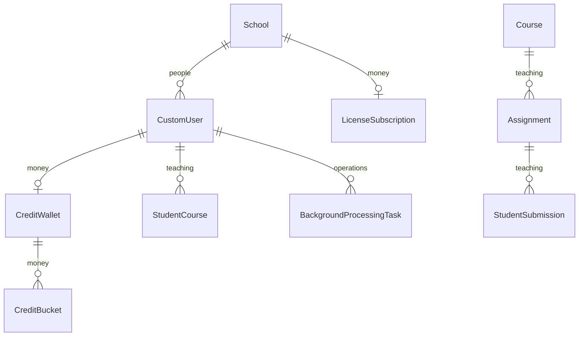
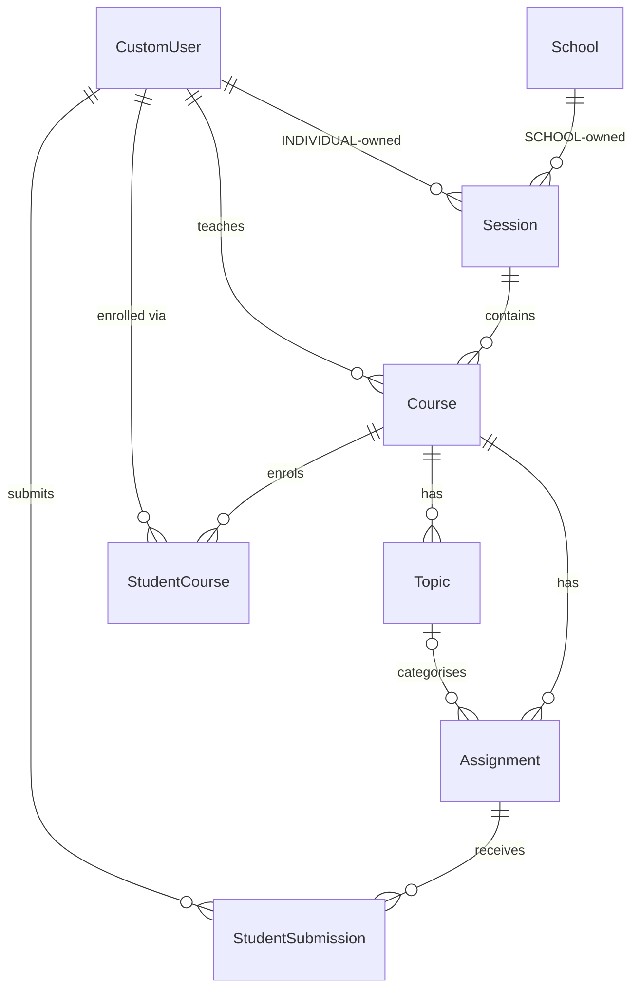
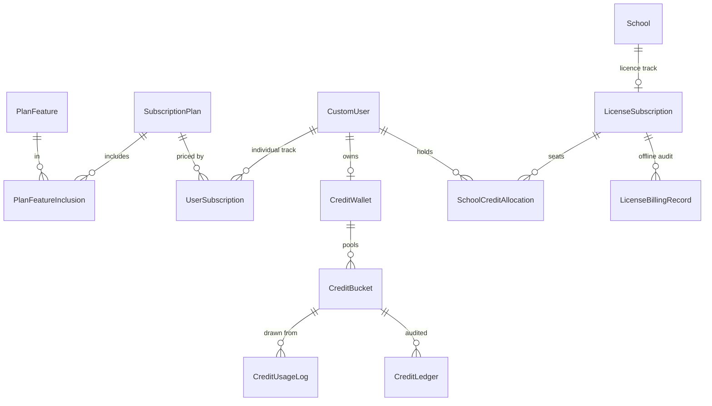

# Consolidated data model

> Part of the [backend reference](README.md). Field-by-field detail lives in each feature doc; this page is the map between them.

## In plain terms

Roughly forty tables across seven apps. They form four clusters that touch each other at only a few points: **people** (accounts and settings), **teaching** (schools, courses, assignments, submissions), **money** (plans, wallets, credits, subscriptions), and **operations** (background tasks, webhook ledger, alert state, benchmark history). The joins between clusters are deliberately few — a user id, a course id, a school id — which is what lets each cluster be reasoned about on its own.

---

## Conventions used throughout

| Convention | Detail |
|---|---|
| Primary keys | **UUIDv4** on almost every model — ids are not enumerable. Exceptions: `UserActivity`, `ConcurrentUserSnapshot`, and the dashboard alert-state tables use `BigAutoField` |
| Timestamps | `created_at` (`auto_now_add`) / `updated_at` (`auto_now`) on most tables |
| Enumerations | `models.TextChoices` throughout; the stored value is the uppercase name (`SHORT-ANSWER` is the one hyphenated exception) |
| Soft delete | only `School.is_active` and `SubscriptionPlan.is_active`. Everything else really deletes |
| Money | **cents**, integers |
| Credits | **raw = display × 1000** (`CONVERSION_FACTOR`) |
| Free-form JSON | `Assignment.questions`, `StudentSubmission.answers`/`feedback`, `BackgroundProcessingTask.meta`, `CreditLedger.metadata` — **no DB-level schema** |
| Derived columns | `Assignment.rigor_*`, `StudentCourse.final_grade`, `StudentSubmission.review_*`, `LicenseSubscription.total_credits_consumed` — kept in step by signals or explicit calls |

---

## Cluster map

*Caption: the four clusters and the handful of edges that cross between them.*

---

## People — `users`

| Model | Key | Notes | Doc |
|---|---|---|---|
| `CustomUser` | UUID | `USERNAME_FIELD = "email"`, `username` removed, `is_active` defaults **`False`** | [users-and-auth.md](users-and-auth.md#customuser-usersmodelspy91-273) |
| `Settings` | UUID | OneToOne; 8 notification flags, all `null=True` Booleans | [users-and-auth.md](users-and-auth.md#settings-usersmodelspy295-320) |
| `UserGoogleCredentials` | auto | OneToOne; tokens as `EncryptedCharField` | [users-and-auth.md](users-and-auth.md#usergooglecredentials-usersmodelspy276-286) |
| `PasswordResetOTP` | auto | OneToOne; 15 min, 5 attempts, 30 min lockout | [users-and-auth.md](users-and-auth.md#otp-models) |
| `PasswordChangeOTP` | auto | OneToOne; 5 min — **its verification is commented out** | same |
| `UserActivity` | auto | **one row per authenticated request** | [project-config.md](project-config.md#useractivitymiddleware) |
| `ConcurrentUserSnapshot` | auto | one row per minute | [dashboard.md](dashboard.md) |
| `BetaWhitelist`, `Waitlist` | UUID | **gate nothing** — kept as records only | [users-and-auth.md](users-and-auth.md#beta-access-records) |

**`UserTypes`**: `STUDENT`, `TEACHER`, `SCHOOL_ADMIN`, `SUPER_ADMIN`. **`RegistrationMethod`**: `EMAIL`, `GOOGLE`, `FACEBOOK`*, `TWITTER`* (*unused). **`ThemeType`**: `LIGHT`, `DARK`, `SYSTEM`. **`AccessMode`**: `BETA`, `WAITLIST`.

---

## Teaching — `classrooms`, `assignments`, `students`

| Model | Key | Notes | Doc |
|---|---|---|---|
| `School` | UUID | unique name; `is_active` soft-delete | [classrooms.md](classrooms.md#school-classroomsmodelspy11-21) |
| `Session` | UUID | `owner_type` splits INDIVIDUAL vs SCHOOL; two **partial** unique constraints; `save()` calls `full_clean()` | [classrooms.md](classrooms.md#session-classroomsmodelspy29-114) |
| `Course` | UUID | teacher and session both **nullable** — `__str__` raises when session is NULL | [classrooms.md](classrooms.md#course-classroomsmodelspy117-151) |
| `Topic` | UUID | unique per course | [classrooms.md](classrooms.md#topic-classroomsmodelspy154-176) |
| `CourseCategory` | UUID | **orphan** — no FK, no route, unreferenced | [classrooms.md](classrooms.md#coursecategory-classroomsmodelspy179-184) |
| `StudentCourse` | UUID | the enrolment; `final_grade` is **derived by signal**; `save()` calls `full_clean()` | [classrooms.md](classrooms.md#studentcourse--the-enrolment-classroomsmodelspy199-333) |
| `Assignment` | UUID | 30 fields; `questions` is free-form JSON; three derived `rigor_*` columns | [assignments.md](assignments.md#assignment-assignmentsmodelspy25-193) |
| `AssignmentGenerationHistory` | UUID | **legacy** — parallel to the session/message pair below | [assignments.md](assignments.md#generation-history-models) |
| `AssignmentGenerationSession` / `…Message` | UUID | the chat thread the viewset actually routes | same |
| `StudentSubmission` | UUID | one row per `(student, assignment)`; `grading_state` is the idempotency claim | [students-and-submissions.md](students-and-submissions.md#studentsubmission-studentsmodelspy31-240) |
| `BatchUploadSession` | UUID | `results` JSONField has a **lost-update race** — use the task rows instead | [students-and-submissions.md](students-and-submissions.md#batchuploadsession-studentsmodelspy249-314) |

**`SessionOwnerType`**: `INDIVIDUAL`, `SCHOOL`. **`EnrollmentStatusType`**: `PENDING`, `ENROLLED`, `WITHDRAWN`, `COMPLETED` (**never written**). **`AssignmentTypes`**: `OBJECTIVE`, `ESSAY`, `SHORT-ANSWER`, `HYBRID` (assignment-level only). **`AssignmentStatus`**: `DRAFT`, `PUBLISHED`, `UNPUBLISHED`. **`AssignmentGenerationRole`**: `USER`, `ASSISTANT`. **`GradingState`**: `IDLE`, `RUNNING`, `DONE`, `FAILED`. **`BatchUploadType`**: `submission`, `assignment`, `grade`.

*Caption: the teaching cluster. `Session.teacher` and `Session.school` are mutually exclusive.*

---

## Money — `billing`

### Catalogue

| Model | Notes |
|---|---|
| `SubscriptionPlan` | the priced product; **plan economics are data, not code** |
| `PlanFeature` | `is_gating_feature` separates a code-enforced gate from a display label |
| `PlanFeatureInclusion` | the through-model, with `display_order` |

### Individual track

| Model | Notes |
|---|---|
| `UserSubscription` | **FK, not OneToOne** — a user accumulates historical rows; carries the `pending_plan` machinery |
| `CreditWallet` | OneToOne; holds no balance itself |
| `CreditBucket` | the actual pools; consumption order is by **type**, not expiry |
| `CreditLedger` | immutable, signed audit trail |
| `CreditUsageLog` | the **refundable** record, keyed by `task_id` |
| `BetaProfile` | per-user beta analytics |

### Licence track

| Model | Notes |
|---|---|
| `LicenseSubscription` | one per school; `billing_method` STRIPE or OFFLINE |
| `SchoolCreditAllocation` | one per teacher — **`is_admin_allocation` excludes the admin from every seat count** |
| `LicenseBillingRecord` | the offline audit trail |
| `LicenseOveragePurchaseIntent` | Stripe overage; **snapshots the price at intent time** |
| `LicenseOverageOfflineRequest` | offline overage; same snapshot fields |

### Stripe and invoicing

| Model | Notes |
|---|---|
| `StripeEvent` | the idempotency ledger — **rows are never deleted** |
| `BillingTransaction` | the local invoice record, 14 types |
| `LiveQARun` | QA-console run records |

**Enumerations** (all complete lists in the feature docs): `PlanType` (14), `PlanCategory` (2), `PlanTier` (6), `BillingInterval` (3), `PlanHighlight` (2), `PlanFeatureKey` (15), `StripeSubscriptionStatus` (6), `PendingChangeType` (3), `CreditBucketType` (5), `CreditLedgerType` (6), `LicenseBillingMethod` (2), `LicenseBillingRecordType` (9), `LicenseOveragePurchaseStatus`, `LicenseOverageOfflineRequestStatus`, `StripeEventStatus` (3), `BillingTransactionSource` (2), `BillingTransactionType` (14), `BillingTransactionStatus` (7), `BillingTransactionMethod` (2).

*Caption: both tracks converge on `CreditWallet` — the credit machinery is identical either side.*

**The tracks never merge.** `UserSubscription` and `SchoolCreditAllocation` are separate paths to the same wallet, and guards on both sides refuse an account holding both ([security-and-tenancy.md](security-and-tenancy.md#2-nobody-is-billed-on-both-tracks)).

---

## Operations

| Model | App | Purpose | Doc |
|---|---|---|---|
| `BackgroundProcessingTask` | `students` | **every** long-running job's progress row | [students-and-submissions.md](students-and-submissions.md#backgroundprocessingtask-studentsmodelspy336-393) |
| `StudentRiskAlertState` | `dashboard` | per-student at-risk cache, **no history** | [dashboard.md](dashboard.md#studentriskalertstate-dashboardmodelspy4-32) |
| `SchoolAtRiskSnapshot` | `dashboard` | the **only** historical at-risk record | [dashboard.md](dashboard.md#schoolatrisksnapshot-dashboardmodelspy35-61) |
| `TeacherInactivityAlertState` | `dashboard` | one alert per inactivity episode | [dashboard.md](dashboard.md#teacherinactivityalertstate-dashboardmodelspy64-82) |
| `ChatSession` / `ChatMessage` | `ai_processor` | dashboard chat history | [dashboard.md](dashboard.md#history) |
| `BenchmarkRun` / `BenchmarkQuestionOutcome` | `ai_processor` | mirror of the JSONL benchmark history | [ai-quality-harness.md](ai-quality-harness.md#database-mirror) |
| `PeriodicTask` / `ClockedSchedule` | `django_celery_beat` | the schedule — **`ClockedSchedule` rows are never pruned** | [async-and-infrastructure.md](async-and-infrastructure.md#beat-schedule) |
| `OutstandingToken` / `BlacklistedToken` | `simplejwt` | refresh-token revocation | [security-and-tenancy.md](security-and-tenancy.md#authentication) |

**`BackgroundTaskType`**: `assignment_extraction`, `assignment_reextraction`, `batch_assignment_upload`, `answer_extraction`, `batch_answer_upload`, `submission_grading`, `batch_submission_grading`, `formatted_grade`. **`BackgroundTaskStatus`**: `PENDING`, `STARTED`, `CANCELLED`, `SUCCESS`, `FAILURE`. **`AssistantType`**: `SUPER_ADMIN_ANALYTICS`, `SCHOOL_ADMIN_ANALYTICS`, `TEACHER_ADMIN_ANALYTICS`. **`RoleType`**: `user`, `assistant`, `system`.

---

## Derived state

Six columns are computed from other rows. **None has a reconciliation loop**; each depends on a hook that a `bulk_update` or raw SQL would bypass.

| Column | Computed from | Kept in step by | Repair |
|---|---|---|---|
| `Assignment.rigor_demand` / `_standards` / `_blooms_coverage` | `Assignment.questions` | `pre_save` — **skipped when `update_fields` omits `questions`** | `backfill_assignment_rigor` |
| `StudentCourse.final_grade` | all graded submissions in that course | `post_save`/`post_delete`, under `SELECT FOR UPDATE` | **none** — touch each submission |
| `StudentSubmission.review_severity` / `review_tier` | `review_reasons` | written during grading; reset on every run | re-grade |
| `LicenseSubscription.total_credits_consumed` | every consumption | **an explicit call**, not a signal — `bulk_create` emits no `post_save` | reset at renewal |
| `Assignment.admin_grading_notified_at` | — | a one-way idempotency latch | clear by hand to re-notify |
| `StudentSubmission.raw_input` | `answers` | lazily backfilled on GET, via `.update()` | automatic |

**The `.update()` rule:** any `.update()` on `StudentSubmission` bypasses `post_save`, so it must be followed by a manual `delete_cache_patterns` call. Every current call site does ([students-and-submissions.md](students-and-submissions.md#publishing)).

---

## Explicit indexes

Beyond FK and unique indexes, ten are declared deliberately:

| Index | Reason |
|---|---|
| `assignment_course_title_idx` on `(course, title)` | *"`Meta.ordering` alone doesn't create a DB index"* |
| `submission_assignment_date_idx` on `(assignment, -submission_date)` | same |
| `submission_graded_at_idx` on `graded_at` | *"had no index at all despite being the filter column for 'ungraded submissions' checks"* across four modules |
| `(wallet, bucket_type, expires_at)` on `CreditBucket` | the consumption scan |
| `(license_subscription, is_active)`, `(user, is_active)` on `SchoolCreditAllocation` | seat lookups |
| `(mode, recorded_at)`, `(prompt_fingerprint)` on `BenchmarkRun` | trend queries |
| `(session, created_at)`, `(session, role, created_at)` on `AssignmentGenerationMessage` | chat history |
| `(user, course, -updated_at)` on `AssignmentGenerationSession` | thread list |

`db_index=True` also appears on ~25 individual fields, notably every filter column the review queue uses (`needs_review`, `review_tier`, `review_severity`, `grading_state`) and `score_percentage` (read by rigor's `evidence` component).

**`Assignment.rigor_*` are deliberately unindexed** — the dashboard filters on already-indexed columns and only aggregates these, *"while its non-concurrent `CREATE INDEX` would hold an exclusive write lock over the whole table at deploy time."*

---

## Constraints worth knowing

| Constraint | Effect |
|---|---|
| `unique_session_name_per_teacher` / `_per_school` | **partial** — conditioned on `owner_type` |
| `unique_section_name_per_session` on `(name, teacher, session)` | |
| `unique_topic_name_per_course` | |
| `unique_student_section_per_classroom` on `(student, course)` | one enrolment per pair |
| `unique_assignment_per_course` on `(course, title, raw_input_hash)` | same text + title cannot be added twice |
| `unique_student_submission_per_assignment` on `(student, assignment)` | **one submission row per pair** — resubmission overwrites |
| `unique_together (license_subscription, user)` | one allocation per teacher per licence |
| `unique_chat_session_per_user_assistant_type` | **conditional** on both being non-null |
| `unique_benchmark_question_outcome_per_run` | |
| `unique_student_school_risk_state`, `unique_school_at_risk_snapshot_date` | |
| `password_reset_unique_user_code_per_user`, `password_change_unique_user_code_per_user` | |
| `StripeEvent.stripe_event_id` unique | the idempotency key |
| `BackgroundProcessingTask.celery_task_id` unique | the status join key |

Two models call `full_clean()` unconditionally in `save()` — `Session` and `StudentCourse` — so every write runs full model validation and raises a Django `ValidationError`. **`bulk_create` bypasses both.**

---

## Migration history

**179 migrations**: billing 58, assignments 38, users 35, students 25, classrooms 16, ai_processor 5, dashboard 2. `grading` and `ocr_processor` have none — they are empty stub apps.

The house rule (additive-only unless explicitly acknowledged as an expand-contract step) is enforced in CI — see [operations.md](operations.md#migrations).

---

## Where to look next

| You want | Go to |
|---|---|
| A specific field's meaning and writer | the feature doc linked in the tables above |
| Why a status enum has a value nothing writes | that feature's state-machine section |
| How credits move | [billing-core.md](billing-core.md) |
| Why a derived column drifted | [Derived state](#derived-state) above, then the repair command |
| Which query scopes a table by tenant | [security-and-tenancy.md](security-and-tenancy.md#tenant-isolation) |
