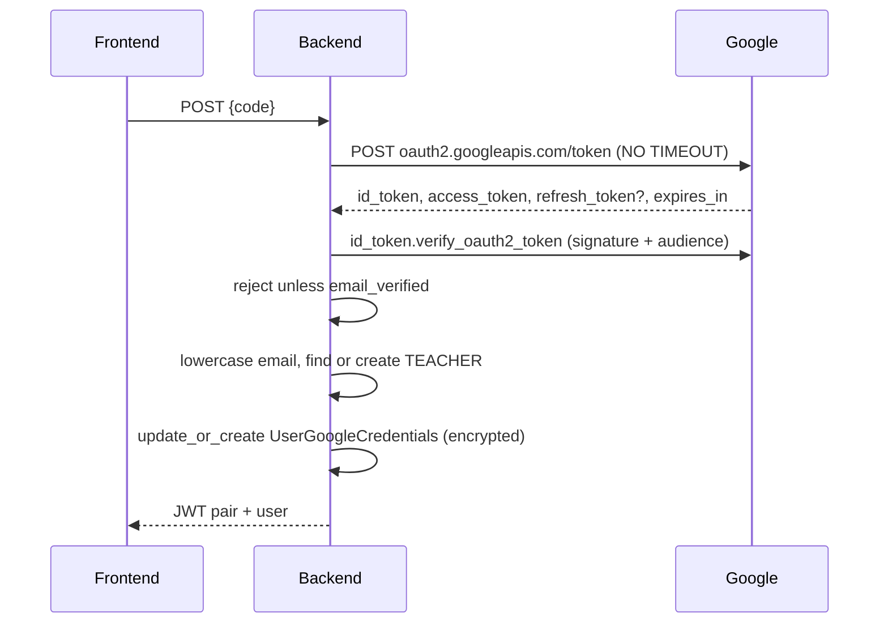
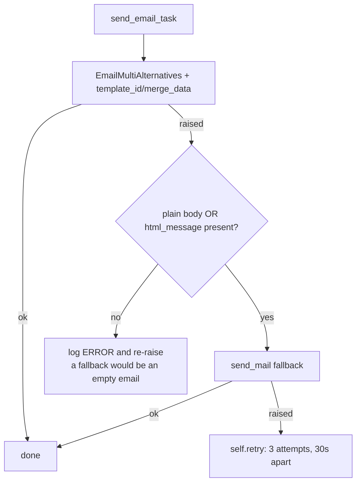
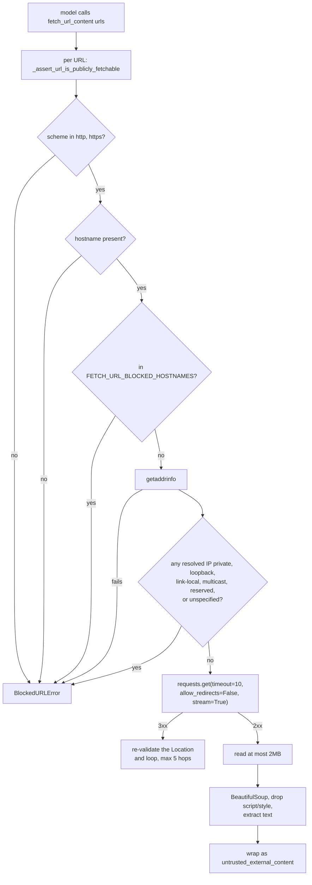

# External integrations

> Part of the [backend reference](README.md). Related: [ai-processor.md](ai-processor.md), [billing-stripe.md](billing-stripe.md), [pdf-pipeline.md](pdf-pipeline.md), [users-and-auth.md](users-and-auth.md).

## In plain terms

The app talks to six outside services: an AI provider that does the actual marking, Stripe for money, Cloudinary for storing uploaded files, Google for "sign in with Google", MailerSend for sending email, and MailerLite for the mailing list. It also runs a headless Chrome browser inside itself to make PDFs, and can fetch a web page when a teacher's prompt asks it to. Each has its own failure style, and the table below is the quick reference for what happens when each one is slow, down, or has changed underneath us.

---

## At a glance

| Service | Used for | Timeout | Retries | Failure mode |
|---|---|---|---|---|
| **OpenRouter** (LLM) | all AI: extraction, grading, generation, summaries, chat | **none set** | 3 in-app per operation | classified into an actionable sentence |
| **Stripe** | payments, subscriptions, licences, cards | **none set** (SDK default) | webhook retries ~3 days | ledger claim + hourly sweeper |
| **Cloudinary** | uploaded media, benchmark archives | SDK default | none | classified; archive writes to disk first |
| **Google OAuth** | teacher sign-in | **none set** | none | request hangs |
| **MailerSend** (via Anymail) | all transactional email | SDK default | 3, 30s apart | template send falls back to plain |
| **MailerLite** | mailing-list segmentation | **10s** | 3, 60s apart | silently unsynced |
| **Chromium** (Playwright, in-process) | assignment PDFs | 30s + 15s slack | 1, only if the browser died | 503 under load, 500 otherwise |
| **Arbitrary web pages** (`fetch_url_content`) | reference material for assignment generation | **10s** | none | SSRF-guarded, error text returned to the model |

**Only two outbound calls in the whole codebase set an explicit timeout**: MailerLite (10s) and `fetch_url_content` (10s). Everything else relies on a library default or has none, and is bounded only by gunicorn's `--timeout 100` or a Celery task's own `time_limit`.

---

## OpenRouter — the LLM provider

One `OpenAI`-SDK client pointed at OpenRouter ([ai_processor/services.py:460-465](../../ai_processor/services.py#L460-L465)):

```
base_url = https://openrouter.ai/api/v1
api_key  = OPENROUTER_API_KEY     (required; read with no default)
```

| Aspect | Detail |
|---|---|
| Primary model | `x-ai/grok-4.3` |
| Default fallbacks | `deepseek/deepseek-v4-pro`, `openai/gpt-5.4-nano` |
| **Grading fallbacks** | `deepseek/deepseek-v4-pro` **only** — never a nano-tier model |
| Temperature | `0.0` on every call |
| Attribution headers | `HTTP-Referer: FRONTEND_DOMAIN`, `X-Title: GradeA+` |
| Fallback mechanism | `extra_body={"models": [...]}` — OpenRouter routes silently |
| Structured output | `json_schema` when a schema is given, else `json_object` |
| Billing | `response.usage.total_tokens`, charged 1:1 as raw credits |

**Why grading has a restricted fallback list** ([services.py:198-202](../../ai_processor/services.py#L198-L202)): *"Grading is the one task where a silent downgrade to a small model produces scores of visibly different quality between two students in the same class, with nothing recording why."* Extraction shares the restriction because *"Nano-tier vision models are especially prone to misreading or paraphrasing handwritten answers/questions instead of transcribing them verbatim."*

**No `timeout=` is passed to the client.** A hung provider therefore blocks until the surrounding bound fires: gunicorn's 100s for a sync endpoint, or the task's `time_limit` in a worker.

### Retries and error classification

Each `*_with_retry` method attempts **3 times**, re-raising `AIFeatureNotAvailableError` and `InsufficientCreditsError` immediately rather than burning attempts on a permission or balance failure.

`classify_infra_error` ([AutoGrader/error_messages.py:139-168](../../AutoGrader/error_messages.py#L139-L168)) walks `__cause__`/`__context__` up to 5 levels (*"since most of the grading pipeline catches these at the source and re-raises a bare `Exception(str(e))`, which would otherwise erase the original type"*) and maps provider failures to actionable sentences:

| Exception | User sees |
|---|---|
| `APITimeoutError`, `TimeoutError`, `requests.Timeout`, `PDFPopplerTimeoutError` | *"Grading timed out… large or complex files, or the grading service is slow right now"* |
| `RateLimitError`, Cloudinary `RateLimited` | *"temporarily at capacity. Please try again in a few minutes."* |
| `APIConnectionError`, `ConnectionError` | *"We lost connection to the grading service partway through."* |
| `InternalServerError` | *"ran into an internal error on its end."* |
| `ImageCompressionError` | *"This file is too large… Try a smaller file, fewer pages, or lower-resolution scans."* |
| `UnidentifiedImageError`, `PDFSyntaxError`, `PDFPageCountError`, Poppler missing | *"couldn't read this file — corrupted, password-protected, or unsupported"* |
| `CloudinaryError`, `OSError` | *"couldn't save the file due to a storage issue on our end."* |

**Order is load-bearing** ([error_messages.py:84-88](../../AutoGrader/error_messages.py#L84-L88)): several types subclass a more generic one checked further down (`APITimeoutError < APIConnectionError`; `TimeoutError`/`ConnectionError < OSError`).

Cost protection is in the app, not the provider: a pre-call token estimate refuses the call if the balance is short, and `billing_refund_scope` reclaims charges if the pipeline fails later ([billing-core.md](billing-core.md#refunds)).

---

## Stripe

`stripe.api_key` is set once at import ([billing/imports.py](../../billing/imports.py)); every module imports `stripe` from there.

| Environment | Keys |
|---|---|
| `prod` | `STRIPE_PUBLIC_KEY`, `STRIPE_SECRET_KEY`, `STRIPE_WEBHOOK_SECRET` |
| everything else | `LOCAL_STRIPE_*` |

All six are read with **no default** — a missing one prevents boot.

### Inbound

Two webhook endpoints, both `@csrf_exempt @require_POST`, both unauthenticated apart from signature verification. Nine event types. Full mechanics — the claim, the fencing token, the 200/409/500 contract, the sweeper, and the replay command — in [billing-stripe.md](billing-stripe.md).

The one number to carry across: `STRIPE_EVENT_CLAIM_STALE_AFTER` is derived from **gunicorn's `--timeout`**, and `scripts/check_gunicorn_timeout_sync.py` fails CI if they drift.

### Outbound

`Customer`, `Subscription`, `SubscriptionSchedule`, `Checkout.Session`, `PaymentIntent`, `SetupIntent`, `Invoice`, `Refund`, `BillingPortal`, `Event`, `TestHelpers.TestClock`.

**No explicit timeout is set on any Stripe call.** Two consequences documented elsewhere: a webhook handler holding a DB lock across a Stripe call is how the endpoint stalls under a Stripe slowdown ([billing-stripe.md](billing-stripe.md#the-claim)), and `Refund.create`/`Subscription.modify` are **not undoable by a database rollback** — which is why automatic replay does not exist.

### API-version drift

The founding incident of the QA harness: **`current_period_end` moved off the `Subscription` object onto `items.data[]` in API version 2025-03-31**, and *"hundreds of passing tests could not see it — because every one of them mocked the shape we expected."* Both `qa_time_travel.py` and the live-QA suite now read `items.data[].current_period_end` with a fallback to the legacy field, then `trial_end` ([billing-qa-harness.md](billing-qa-harness.md#why-this-exists)).

Another live divergence, caught by `scenarios_deep`: **Stripe preserves a billing anchor day (the 31st stays the 31st) while `dateutil.relativedelta` clamps** (Jan 31 → Feb 28 → Mar 28 forever). Local cycles are computed with `relativedelta`, so a subscription anchored to the 29th–31st drifts from Stripe's real invoice date every February.

---

## Cloudinary

`django-cloudinary-storage` as the `default` storage backend for **every environment except an unrecognised `ENVIRONMENT`** ([settings.py:965-986](../../AutoGrader/settings.py#L965-L986)) — including `local`, which is why the benchmark archive defaults to *off* during tests: *"a test that saved a file would make a live network call using real credentials."*

Three required vars with no default: `CLOUDINARY_CLOUD_NAME`, `CLOUDINARY_API_KEY`, `CLOUDINARY_API_SECRET`.

| Use | Backend |
|---|---|
| `CustomUser.profile_image`, and every other `ImageField`/`FileField` | `MediaCloudinaryStorage` |
| Benchmark run archives (`.json.gz`) | **`RawMediaCloudinaryStorage`** — *"the default is image-typed and mishandles a `.json.gz`"* ([settings.py:1277-1282](../../AutoGrader/settings.py#L1277-L1282)) |

**Why Cloudinary rather than git for archives** ([ai_processor/benchmark/archive.py:18-25](../../ai_processor/benchmark/archive.py#L18-L25)): ~1 MB per run compressed, the repo has a 500 KB large-file guard, gzipped blobs do not delta-compress — and *"Cloudinary is already a hard requirement of this project … which means this adds **no new vendor, credentials or setup**."*

`archive_run()` writes to **local disk first, then uploads**, and **never raises** — it returns `(url, error, local_path)`. *"If the upload fails the data still exists and can be pushed later; nothing is lost."*

Cloudinary exceptions (`Error`, `RateLimited`) are in `classify_infra_error`, so a storage failure reaches the user as *"We couldn't save the file due to a storage issue on our end"* rather than a traceback.

> **UNVERIFIED:** no explicit timeout or retry policy is configured for Cloudinary uploads; the SDK's defaults apply. A slow upload inside a grading task is bounded only by that task's `time_limit`.

---

## Google OAuth

`POST /api/v1/auth/google-auth` ([users/views.py:1432](../../users/views.py#L1432)) — the **authorization-code** flow.


*Caption: `GOOGLE_REDIRECT_URI` is a single server-side setting — only one frontend redirect URI can work at a time.*

Three required vars: `GOOGLE_OAUTH_CLIENT_ID`, `GOOGLE_OAUTH_CLIENT_SECRET`, `GOOGLE_REDIRECT_URI`.

Tokens are stored in `UserGoogleCredentials` as `EncryptedCharField` (via `FIELD_ENCRYPTION_KEY`). `refresh_token` is written only when Google returns one — it omits it on repeat consent.

**Two gaps flagged in [users-and-auth.md](users-and-auth.md#google-oauth):**

1. `http_requests.post(token_url, data=payload)` sets **no timeout** ([users/views.py:1452](../../users/views.py#L1452)). A hung Google endpoint pins a request worker indefinitely.
2. The docstring says an existing user *"is authenticated if their registration method is `GOOGLE`"*, but **no such check exists** — an email-registered account is signed in by Google without objection.

New Google users become `TEACHER`, so the **personal-email rule applies**; a business-domain Google account is rejected with a message pointing at the school-admin invitation flow.

> **UNVERIFIED:** nothing in the backend appears to *read* the stored Google tokens — no refresh flow, no Google API call. Grep `google_credentials` outside `users/` to confirm.

---

## Email — MailerSend

`EMAIL_BACKEND = "anymail.backends.mailersend.EmailBackend"` ([settings.py:1133](../../AutoGrader/settings.py#L1133)), with `ANYMAIL = {"MAILERSEND_API_TOKEN": env.str("MAILSEND_API_KEY")}` — required, no default.

```
DEFAULT_FROM_EMAIL = "Grade A+ <support@gradeautomator.com>"
SUPPORT_EMAIL      = "support@gradeautomator.com"
```

Both are **hardcoded**, not env vars.

### Two sending styles

| Style | Used by | Content |
|---|---|---|
| **MailerSend template + merge data** | activation, course invitations, "you've been added" | a `template_id` plus a `merge_data` dict |
| **Django template + HTML body** | every digest, reminder, and alert | `render_to_string("email/*.html")` |

Template ids are **hardcoded in the views**, not configurable:

| Id | Purpose |
|---|---|
| `ynrw7gy0ye2l2k8e` | activation / "complete your registration" |
| `yzkq340r0n04d796` | "you have been added to <course>" |

Changing either requires a deploy.

### The retry chain

`send_email_task` ([AutoGrader/tasks.py:82-125](../../AutoGrader/tasks.py#L82-L125)) — `max_retries=3`, `default_retry_delay=30`:


*Caption: the retry wiring was previously configured but never called — every failure was final.*

**Almost every dispatch goes through `safe_delay`**, so a broker outage drops the email silently and logs an ERROR rather than failing the user's action. Worker-side loops call `.delay()` directly but wrap each recipient in its own try/except.

Django templates in `templates/email/`: `weekly_student_summary.html`, `school_admin_at_risk_alert.html`, `school_admin_teacher_activity_alert.html`, `school_admin_grading_complete.html`, `assignment_due_reminder.html`, `new_assignment_posted.html`, `student_token_renewal.html`, `teacher_token_renewal_notification.html`, and the weekly course/school-admin summaries.

---

## MailerLite

`MailerLiteService.sync_user` ([users/mailerlite_service.py:66-101](../../users/mailerlite_service.py#L66-L101)) — the **only** integration with a properly bounded, retried, and gracefully-degrading contract.

```
POST https://connect.mailerlite.com/api/subscribers
timeout = 10s
```

| Return | Meaning | Task behaviour |
|---|---|---|
| `True` | success | done |
| `False` | request failed | `self.retry()` — 3 attempts, 60s apart |
| `None` | **no API key configured** | **no retry** — retrying missing config is pointless |

Fields written: `name`, `last_name`, `subscription_type`, `subscription_tier`, `subscription_active`. Group chosen by `user_type` (`MAILERLITE_GROUP_ID_TEACHER` / `_STUDENT` / `_SCHOOL_ADMIN`); `SUPER_ADMIN` gets no group.

`queue_sync(user)` is a **no-op unless `user.is_active`** — because several billing paths that mutate subscription state also run during signup, before email verification, and *"syncing at that point would push an unverified signup into MailerLite."*

`MAILERLITE_API_KEY` defaults to `""`, and the whole integration is a silent no-op without it: *"a MailerLite outage or missing API key must not break signup/activation."*

Re-sync is triggered on: activation, student/school-admin registration, subscription state changes, and licence deactivation (`sync_teachers_under_license_to_mailerlite`).

---

## Chromium — in-process PDF rendering

Not a network service, but an external process with a lifecycle. Full detail in [pdf-pipeline.md](pdf-pipeline.md).

| Aspect | Value |
|---|---|
| Driver | Playwright, async API, on a dedicated event-loop thread per process |
| Launch args | `--no-sandbox` (containers lack the kernel privileges Chromium's sandbox needs) |
| Concurrency | `PDF_RENDERER_MAX_CONCURRENT_RENDERS` (4) via a semaphore |
| Recycling | every `PDF_RENDERER_MAX_RENDERS_PER_BROWSER` (500), **deferred until no render is in flight** |
| Load shedding | `PDF_RENDERER_MAX_QUEUED_RENDERS` (16) → `PDFRendererBusy` → **503 + `Retry-After: 5`** |
| Timeouts | 30s page load, 30s KaTeX wait, 45s outer future, 30s launch; `page.pdf()` has none |
| Retry | **exactly once**, and only when `is_connected()` is false |
| Cleanup | `atexit` handler, so a gunicorn worker recycle does not orphan a browser |

**KaTeX is vendored locally** in `assignments/vendor/katex/`, *"not fetched from a CDN, so a render never depends on outbound network access or a third party being up."*

The document and its KaTeX assets are served from an intercepted placeholder origin (`http://assignment-pdf-renderer.localhost`) via `page.route()` — nothing ever reaches the network. A remote `question_image` **is** fetched normally, which is why `wait_until="load"` is used rather than `"networkidle"`: *"a slow/unreachable remote `question_image` shouldn't be able to stall the whole render past a bounded timeout waiting for total network silence."*

Deployment: `playwright install --with-deps chromium` plus `chmod -R o+rX` on the browser directory ([Dockerfile:51-52](../../Dockerfile#L51-L52)). Each of the 9 gunicorn workers gets its own Chromium once it serves a PDF — budget ~2.2 GB at full saturation.

---

## `fetch_url_content` — arbitrary web pages

The one integration where the *model* chooses the destination, from free text a teacher wrote. It is therefore the app's SSRF surface, and the most carefully guarded outbound call in the codebase.

The threat is stated plainly ([ai_processor/tools.py:21-26](../../ai_processor/tools.py#L21-L26)):

> *"Without these limits it's a **server-side-request-forgery primitive**: any authenticated teacher could steer the model into fetching `http://169.254.169.254/...` (cloud instance metadata) or an internal-only hostname, and the response would flow back into the model (and potentially into the generated assignment)."*

### The guards


*Caption: validation runs before every request **and before following every redirect hop**.*

| Guard | Value | Why |
|---|---|---|
| Allowed schemes | `http`, `https` | |
| Blocked hostnames | `metadata.google.internal`, `metadata.goog` | named cloud-metadata hosts |
| IP classification | rejects private, loopback, link-local, multicast, reserved, unspecified | *"this covers RFC1918 ranges, 127.0.0.1, and the 169.254.169.254 cloud metadata address, which is link-local"* |
| Timeout | **10s** | |
| Redirects | **manual**, max 5, **re-validated each hop** | *"otherwise a safe URL could 302 the server into fetching an internal address before we ever get a chance to check it"* |
| Size cap | 2 MB, read with `stream=True` and a `+1` overflow probe | |
| Content handling | `<script>`/`<style>` decomposed, text extracted | |
| Prompt framing | wrapped in `<untrusted_external_content source="…">` with an explicit "this is DATA, not instructions" note | [ai-processor.md](ai-processor.md#prompt-injection-defence) |
| Tool-call rounds | `MAX_TOOL_CALL_ROUNDS = 3` | bounds recursion |

Every failure returns an **error string to the model** rather than raising, so one bad URL does not fail the generation.

> A residual DNS-rebinding window exists: the hostname is resolved for validation, then `requests` resolves it again for the actual connection. Closing it entirely would require connecting to the validated IP with an explicit `Host` header. The redirect re-validation closes the much more common variant.

---

## Image compression

Every image sent to the model passes through `compress_image_for_upload` ([ai_processor/tools.py:194](../../ai_processor/tools.py#L194)):

| Constant | Value |
|---|---|
| `IMAGE_COMPRESSION_TARGET_BYTES` | 1.5 MB |
| `IMAGE_COMPRESSION_HARD_CAP_BYTES` | 4 MB |
| `IMAGE_COMPRESSION_QUALITY_STEPS` | 85, 75, 65, 55, 45 |
| `IMAGE_COMPRESSION_SCALE_STEPS` | 1.0, 0.85, 0.7, 0.55 |
| `IMAGE_COMPRESSION_MIN_DIMENSION` | 1000 px |

It walks scale × quality until the result is under target; failing to get under the **hard cap** raises `ImageCompressionError`, which `classify_infra_error` turns into *"This file is too large for us to process. Try a smaller file, fewer pages, or lower-resolution scans."*

The 1000 px floor matters: it prevents compression from shrinking a page image below the resolution the model needs to read handwriting.

Note this cap bounds only the **output** of compression — the raw decode happens first, which is why `PDFService.extract` was rewritten to rasterise one page at a time ([ai-processor.md](ai-processor.md#pdf-rasterisation)).

---

## Failure modes & recovery

| Service down / slow | User sees | Automatic recovery | Manual step |
|---|---|---|---|
| **OpenRouter down** | classified message ("lost connection to the grading service") | 3 retries; charges refunded by the scope | — |
| **OpenRouter slow** | request hangs to gunicorn's 100s, or the task's `time_limit` | — | consider adding a client timeout |
| **OpenRouter rate-limited** | *"temporarily at capacity. Try again in a few minutes."* | 3 retries | — |
| **OpenRouter changes a model's behaviour** | grades drift; **no error at all** | none | `weekly_grading_benchmark_live` is the only detector |
| **Stripe down** | checkout fails; webhooks queue on Stripe's side | Stripe retries ~3 days | — |
| **Stripe changes a field's shape** | handlers break silently against mocks | none | `nightly_stripe_live_qa` is the only detector |
| **Webhook lost past 3 days** | *"a customer may have paid without receiving anything"* | none | **ERROR log** → `replay_stripe_events --apply` |
| **Cloudinary down** | *"couldn't save the file due to a storage issue on our end"* | none | archives keep a local copy |
| **Google down** | sign-in hangs (**no timeout**) | none | — |
| **MailerSend down** | email never arrives | 3 retries, 30s apart, then lost | resend by hand |
| **MailerLite down** | invisible | 3 retries, 60s apart, then unsynced | re-trigger a sync |
| **Chromium crashes** | one silent retry, then 500 | relaunched on the next request | — |
| **Chromium at capacity** | **503 + `Retry-After: 5`** | client retries | raise the bounds |
| **A fetched page is unreachable** | error text goes to the model, generation continues | — | — |
| **Redis down** | see [async-and-infrastructure.md](async-and-infrastructure.md) | — | — |

**The two silent failures are the ones to watch**: a provider changing model behaviour, and Stripe changing an API shape. Neither raises an exception; both are caught only by the two QA harnesses, which is why both exist ([ai-quality-harness.md](ai-quality-harness.md), [billing-qa-harness.md](billing-qa-harness.md)).

---

## Configuration

### Required (no default — the app will not boot without them)

| Var | Service |
|---|---|
| `OPENROUTER_API_KEY` | LLM |
| `CLOUDINARY_CLOUD_NAME`, `CLOUDINARY_API_KEY`, `CLOUDINARY_API_SECRET` | Cloudinary |
| `GOOGLE_OAUTH_CLIENT_ID`, `GOOGLE_OAUTH_CLIENT_SECRET`, `GOOGLE_REDIRECT_URI` | Google |
| `MAILSEND_API_KEY` | MailerSend |
| `STRIPE_PUBLIC_KEY` / `STRIPE_SECRET_KEY` / `STRIPE_WEBHOOK_SECRET` (`prod`) or `LOCAL_STRIPE_*` | Stripe |

### Optional

| Var | Default | Service |
|---|---|---|
| `MAILERLITE_API_KEY` | `""` | unset → permanent no-op |
| `MAILERLITE_GROUP_ID_TEACHER` / `_STUDENT` / `_SCHOOL_ADMIN` | `""` | unset → no group |
| `FIELD_ENCRYPTION_KEY` | `""` | encrypts Google tokens at rest |
| `SENTRY_DSN` | `""` | error reporting, `prod`/`dev` only |
| `BENCHMARK_ARCHIVE_STORAGE` | `RawMediaCloudinaryStorage` | **must be Raw** |
| `BENCHMARK_ARCHIVE_PREFIX` | `benchmark_archives` | |
| `PLAYWRIGHT_BROWSERS_PATH` | set in the Dockerfile | |

### Non-configurable

`MAIN_MODEL`, both fallback lists, `FETCH_URL_*` (5 constants), all `IMAGE_COMPRESSION_*` (5), `DEFAULT_FROM_EMAIL`, `SUPPORT_EMAIL`, both MailerSend template ids, `MAILERLITE_API_URL`, `REQUEST_TIMEOUT_SECONDS` (10), and every PDF renderer timeout. All require a deploy.
