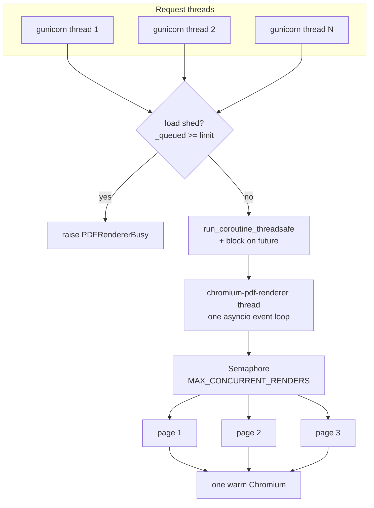
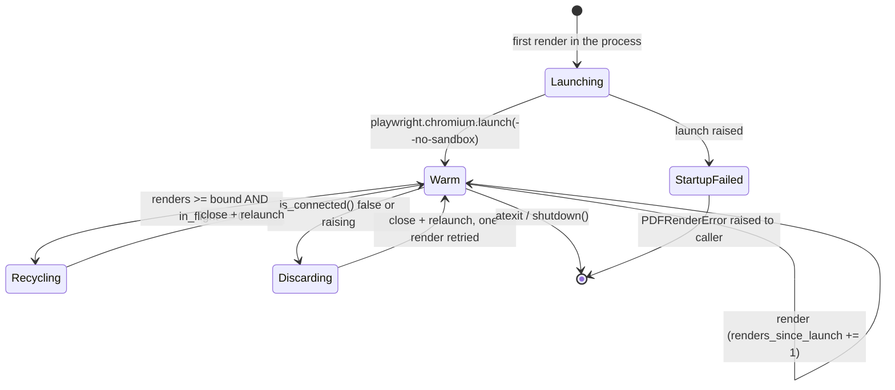
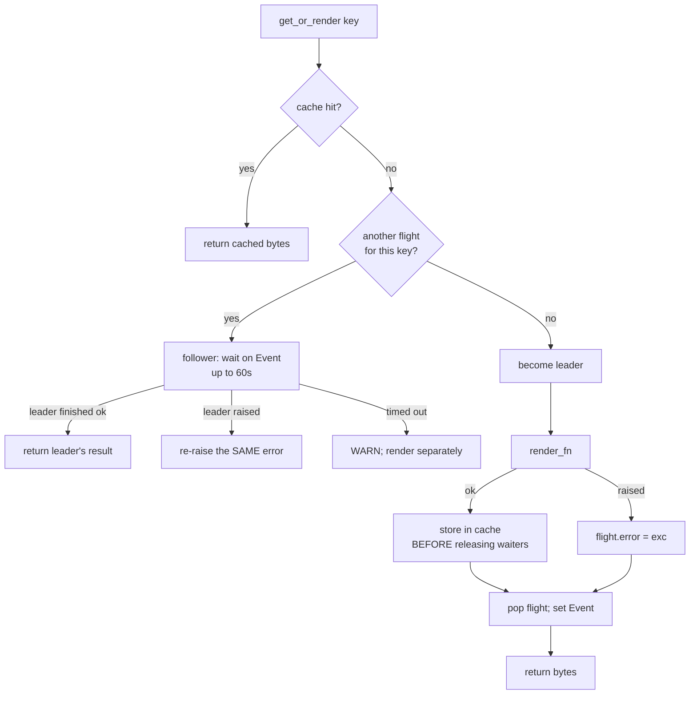
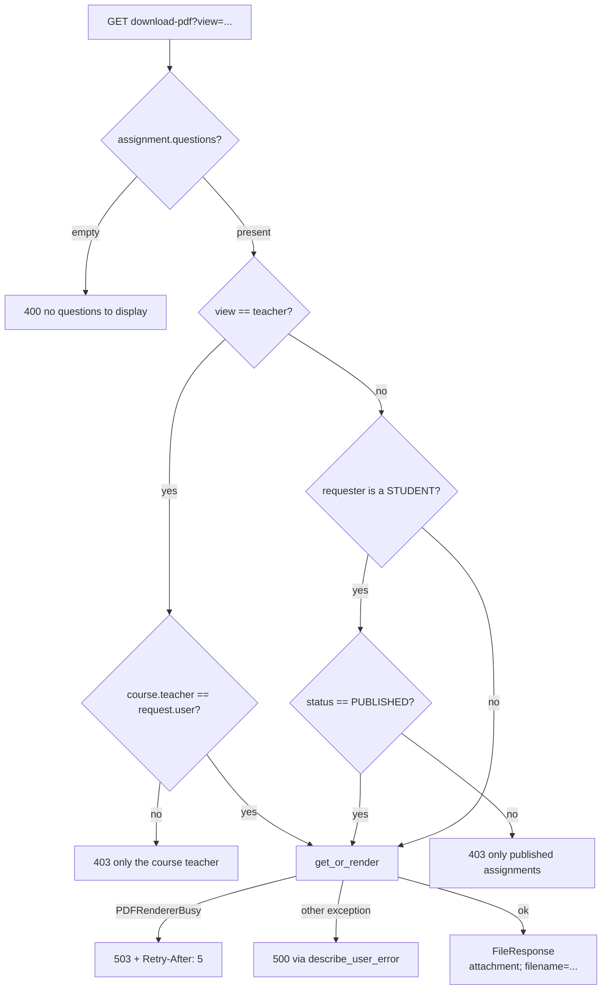

# The PDF pipeline — render, cache, single-flight, load-shed

> Part of the [backend reference](README.md). Related: [assignments.md](assignments.md), [async-and-infrastructure.md](async-and-infrastructure.md), [integrations.md](integrations.md), [operations.md](operations.md).

## In plain terms

When a teacher or student downloads an assignment as a PDF, the server builds an HTML page and prints it using a real, invisible Chrome browser running inside the server process. Chrome is used rather than a simple PDF library because assignments contain maths, and only a browser can typeset a formula like `$x = 5$` properly instead of printing the dollar signs. Because starting a browser is slow, one is kept warm and reused. Three separate protections stop that browser becoming a bottleneck: finished PDFs are **cached**, simultaneous requests for the same PDF **share one render** instead of doing thirty identical ones, and once too many renders are queued the server **refuses new ones quickly** rather than making everyone wait.

---

## Entry points

| Kind | Name | Auth | Source |
|---|---|---|---|
| URL | `GET /api/v1/assignments/<pk>/download-pdf?view=teacher\|student` | `IsAuthenticated, IsTeacherOrReadOnly` + per-view checks below | [assignments/views.py:1747](../../assignments/views.py#L1747) |
| Celery task | `assignments.tasks.prerender_assignment_pdfs` | dispatched on publish | [assignments/tasks.py:1229](../../assignments/tasks.py#L1229) |
| Public API | `render_html_to_pdf(full_html, …) -> bytes` | — | [assignments/pdf_renderer.py:721](../../assignments/pdf_renderer.py#L721) |
| Public API | `ensure_capacity()` | — | [assignments/pdf_renderer.py:684](../../assignments/pdf_renderer.py#L684) |
| Public API | `get_or_render(assignment, view_type, render_fn)` | — | [assignments/pdf_cache.py:161](../../assignments/pdf_cache.py#L161) |
| Public API | `render_assignment_pdf(assignment, include_rubric) -> bytes` | — | [assignments/pdf_document.py:18](../../assignments/pdf_document.py#L18) |

This feature owns **no database tables**. Its state is: a Redis cache entry per (assignment, view, timestamp), a process-local in-flight dict, and one Chromium process per worker.

### Module responsibilities

| Module | Owns |
|---|---|
| [pdf_document.py](../../assignments/pdf_document.py) | assembling the HTML document (both views) |
| [pdf_renderer.py](../../assignments/pdf_renderer.py) | the warm browser, concurrency, recycling, load shedding |
| [pdf_cache.py](../../assignments/pdf_cache.py) | the Redis cache and single-flight |
| [views.py `download_pdf`](../../assignments/views.py#L1747) | permissions, status mapping, filename |
| [vendor/katex/](../../assignments/vendor/katex/) | the vendored KaTeX assets |

---

## Why Chromium

WeasyPrint was the previous renderer and **has no LaTeX/math renderer at all**, so an assignment option like `"$x = 5$"` printed as literal text — dollar signs and all — instead of a typeset formula ([pdf_renderer.py:4-13](../../assignments/pdf_renderer.py#L4-L13)).

The decision chain recorded in the module docstring:

| Option | Rejected because |
|---|---|
| Keep WeasyPrint | cannot run the JavaScript KaTeX needs |
| Rasterise formulas to images | loses selectable/copyable text — Chromium's PDF text layer is not |
| **Chromium print-to-PDF + KaTeX** | chosen: real typesetting *and* selectable text |

KaTeX is **vendored locally** in `assignments/vendor/katex/`, not fetched from a CDN, so a render never depends on outbound network access or a third party being up ([pdf_renderer.py:6-9](../../assignments/pdf_renderer.py#L6-L9)).

This change had a security consequence that is called out at the point it matters: under WeasyPrint a stray `<script>` or `onerror=` in an assignment was inert, because WeasyPrint has no JS engine. **Chromium executes JavaScript while printing**, so the same raw interpolation that was harmless before is now a real script-injection path ([pdf_document.py:53-62](../../assignments/pdf_document.py#L53-L62)). Every interpolated value in `pdf_document.py` is therefore escaped or sanitised — see [Document assembly](#document-assembly).

---

## Concurrency model


*Caption: one loop thread per process owns Playwright; request threads never touch it directly.*

**One dedicated background thread per process** runs an asyncio event loop that owns the Playwright connection, the warm browser, and every page ([pdf_renderer.py:15-21](../../assignments/pdf_renderer.py#L15-L21)). Request threads submit a coroutine with `asyncio.run_coroutine_threadsafe()` and block on the future, so the public API stays synchronous for Django's sync views while renders run *concurrently* as coroutines.

**Concurrency is the point.** An earlier revision drove the same warm browser from a single worker thread pulling one job at a time off a queue, which meant a burst of downloads for distinct uncached assignments queued behind each other and **tail latency was the sum of the queue, not the cost of one render** ([pdf_renderer.py:23-30](../../assignments/pdf_renderer.py#L23-L30)). Chromium is happy running several pages at once, bounded by a semaphore so peak memory stays predictable rather than scaling with request volume.

The worker singleton is created lazily under a double-checked lock ([pdf_renderer.py:648-654](../../assignments/pdf_renderer.py#L648-L654)) and its constructor **blocks** until the browser is up or `BROWSER_LAUNCH_TIMEOUT_SECONDS` (30s) elapses ([pdf_renderer.py:317-323](../../assignments/pdf_renderer.py#L317-L323)) — so the very first PDF request in a fresh process pays the browser launch.

`_shutdown_worker` is registered with `atexit` ([pdf_renderer.py:681](../../assignments/pdf_renderer.py#L681)). Without it the loop thread is a daemon thread that would simply be killed mid-flight on interpreter exit, with **no guarantee Chromium's own subprocess gets closed** — risking an orphaned browser process surviving each gunicorn worker recycle ([pdf_renderer.py:657-667](../../assignments/pdf_renderer.py#L657-L667)).

The asyncio primitives are built in `__init__` rather than on the loop, which is correct only because since Python 3.10 asyncio primitives bind to the running loop on first await rather than capturing one at construction ([pdf_renderer.py:296-303](../../assignments/pdf_renderer.py#L296-L303)).

---

## Browser lifecycle


*Caption: `_acquire_browser` makes the replace decision atomically under `_swap_lock`, and never waits while holding it.*

`_acquire_browser` ([pdf_renderer.py:360-436](../../assignments/pdf_renderer.py#L360-L436)) decision table:

| Condition | Action | Reasoning |
|---|---|---|
| browser exists but `is_alive()` is False | close and relaunch **immediately, even with renders in flight** | Chromium died outright (OOM killer, crash, container kill). Those in-flight renders are using a browser that no longer exists — they are already lost, and `_render` retries them on the new one. Without this the dead object stays in place and fails every later render identically |
| `_needs_recycle()` **and `_in_flight == 0`** | close and relaunch | see below |
| `_needs_recycle()` but renders in flight | **defer** — keep using the old browser | see below |
| browser is None | launch; on failure leave it None and raise | so the next render retries the launch rather than the process's renderer staying wedged |

**The deferred-recycle decision is the subtle one.** The obvious alternative — wait for in-flight renders to drain, then swap — stalls the whole process, because it runs under the swap lock so every other render queues behind the slowest one still running. **Measured with a deliberately hung render, that dragged nine ~0.2s renders out to ~5s each** ([pdf_renderer.py:396-412](../../assignments/pdf_renderer.py#L396-L412)).

Deferring costs nothing that matters: the bound is memory hygiene, not correctness, so "recycle at the next quiet moment past N" is as good as "recycle exactly at N" — and under load heavy enough that the renderer is never idle, gunicorn's `--max-requests` recycles the whole worker anyway.

**Recycling is not fixing an observed leak.** A 120-render soak measured **~0.02 MB/render and still decelerating** — cache warm-up, not a leak. The bound exists against a future Chromium that *does* leak, and against callers with no process-level recycling of their own: a Celery task has no `--max-requests` equivalent ([pdf_renderer.py:370-375](../../assignments/pdf_renderer.py#L370-L375), [pdf_renderer.py:89-99](../../assignments/pdf_renderer.py#L89-L99)).

`_is_alive` treats a *raising* `is_connected()` as dead too: the question is "can this still render", and a browser object that cannot answer cannot render either ([pdf_renderer.py:334-346](../../assignments/pdf_renderer.py#L334-L346)).

**`--no-sandbox`** ([pdf_renderer.py:328-332](../../assignments/pdf_renderer.py#L328-L332)): Chromium's own sandbox needs kernel privileges typically unavailable inside a container (Docker/Railway). This is the documented workaround, and it is a real reduction in isolation — the document being rendered is partly AI-generated content, which is why the sanitisation in `pdf_document.py` and `sanitize_ai_html` matters.

### The one retry

`_render` ([pdf_renderer.py:553-586](../../assignments/pdf_renderer.py#L553-L586)) retries **exactly once**, and **only when the browser is actually gone**:

```python
if attempt == 1 and not self._is_alive(browser):
    continue
raise
```

If Chromium died mid-render, the failure has nothing to do with this document — every render in flight at that moment dies together. Retrying once on a fresh browser turns that into a slower download instead of a failed one. The guard is deliberately narrow: a timeout or a genuinely broken document **fails immediately** rather than being rendered twice (which for a broken document would just double the cost of failing).

The semaphore is acquired **before** the browser, so a burst waits on the semaphore rather than opening an unbounded number of pages ([pdf_renderer.py:554-557](../../assignments/pdf_renderer.py#L554-L557)).

---

## Load shedding

Two checks, one authoritative and one advisory.

**Authoritative** — `_ChromiumRenderWorker.render()` ([pdf_renderer.py:588-614](../../assignments/pdf_renderer.py#L588-L614)) increments a `_queued` counter under a plain `threading.Lock` **on the calling thread**, before any event-loop work is done, and raises `PDFRendererBusy` if it is already at the limit.

The measurement that motivated it: **under 300 concurrent callers without shedding, renders sat ~35s and 89 of 3000 eventually died at the 45s bound — each having held a request thread the whole time** ([pdf_renderer.py:593-600](../../assignments/pdf_renderer.py#L593-L600)). Refusing immediately turns that into a fast, honest "try again" and keeps threads free for requests the process can actually serve, cache hits included (which never reach this method).

**Advisory** — `ensure_capacity()` ([pdf_renderer.py:684-718](../../assignments/pdf_renderer.py#L684-L718)) is called at the *top* of `render_assignment_pdf`, before any HTML is assembled ([pdf_document.py:30-33](../../assignments/pdf_document.py#L30-L33)). Assembling an assignment's HTML costs real CPU, and under load that work is contended by every other thread doing the same thing. **Measured without it, shed requests still took up to 4.9s to be refused because they built their document first; with it they are refused in milliseconds.**

It is explicitly allowed to race — worst case, one extra caller builds HTML and is refused a moment later, which is exactly what happened before it existed. It also **deliberately does not start the browser**: if no renderer has been created yet, this process is by definition not at capacity.

### The three bounds

| Setting | Default | What it bounds | Reasoning |
|---|---|---|---|
| `PDF_RENDERER_MAX_CONCURRENT_RENDERS` | **4** | pages open at once | ~20 MB per open page on top of Chromium's ~165 MB baseline → roughly baseline + 80 MB under a burst. **Read once at worker start** — an asyncio semaphore cannot be resized, so a change takes effect on the next process ([pdf_renderer.py:104-120](../../assignments/pdf_renderer.py#L104-L120)) |
| `PDF_RENDERER_MAX_QUEUED_RENDERS` | `None` → **4× concurrency (16)** | queued + running before refusal | three waiting for every one rendering; at ~0.6–2s per render that caps the wait at a few seconds, past which a fast "try again" beats a parked thread. `0` disables shedding ([pdf_renderer.py:123-136](../../assignments/pdf_renderer.py#L123-L136)) |
| `PDF_RENDERER_MAX_RENDERS_PER_BROWSER` | **500** | renders before recycling | from the 120-render soak; bounds growth to a handful of MB while rarely firing under gunicorn's own `--max-requests` of 1000. `0` disables ([pdf_renderer.py:89-101](../../assignments/pdf_renderer.py#L89-L101)) |

`PDFRendererBusy` subclasses `PDFRenderError` but is semantically distinct: **nothing was tried**, so the caller can retry and callers that can wait *should* ([pdf_renderer.py:143-151](../../assignments/pdf_renderer.py#L143-L151)). It surfaces as **503 + `Retry-After: 5`**, not 500 ([assignments/views.py:1783-1802](../../assignments/views.py#L1783-L1802)) — which lets clients and proxies treat it as transient and frees the worker thread immediately rather than parking it for the render timeout.

### Timeout stack

| Bound | Value | Source |
|---|---|---|
| Page `goto` (`wait_until="load"`) | `timeout` (default 30s) | [pdf_renderer.py:516](../../assignments/pdf_renderer.py#L516) |
| `wait_for_function("window.__katexDone")` | same | [pdf_renderer.py:517-519](../../assignments/pdf_renderer.py#L517-L519) |
| `page.pdf()` | **none** — no timeout parameter in this Playwright version | [pdf_renderer.py:521-527](../../assignments/pdf_renderer.py#L521-L527) |
| Outer future wait | `timeout + 15` (45s) | [pdf_renderer.py:616-631](../../assignments/pdf_renderer.py#L616-L631) |
| Browser launch | 30s | [pdf_renderer.py:69](../../assignments/pdf_renderer.py#L69) |
| gunicorn `--timeout` | **100s** | [Dockerfile:86](../../Dockerfile#L86) |

The outer bound has 15s of slack beyond the in-page timeout because a render may also wait for a concurrency slot before it starts. Every Playwright call inside `_do_render` carries its own timeout, so the outer bound "should essentially never be what fires"; gunicorn's `--timeout` remains the real backstop for a wedged worker.

`page.pdf()` has no timeout of its own, and the reasoning is that by the time it is called the page has already fully loaded and finished typesetting (both bounded), so the export step has no remaining unbounded network/script wait to guard against directly.

**`wait_until="load"`, not `"networkidle"`** ([pdf_renderer.py:513-516](../../assignments/pdf_renderer.py#L513-L516)): a slow or unreachable remote `question_image` should not be able to stall the whole render past a bounded timeout waiting for total network silence.

> **Note for operators:** gunicorn's `--timeout 100` is mirrored by `WEBHOOK_REQUEST_HARD_TIMEOUT_SECONDS` in `billing/webhooks.py`, and `scripts/check_gunicorn_timeout_sync.py` fails CI if the two drift ([scripts/check_gunicorn_timeout_sync.py:2-10](../../scripts/check_gunicorn_timeout_sync.py#L2-L10)). Raising the gunicorn timeout for PDF reasons therefore also affects Stripe webhook claim-staleness timing. See [operations.md](operations.md).

---

## Serving the document and KaTeX

The document is **never written to disk**. Both it and the KaTeX assets are served through Playwright `page.route()` handlers from memory and local disk ([pdf_renderer.py:500-512](../../assignments/pdf_renderer.py#L500-L512)).

```
_RENDER_ORIGIN       = http://assignment-pdf-renderer.localhost
_RENDER_DOCUMENT_URL = {origin}/document.html
_KATEX_URL_PREFIX    = {origin}/katex/
```

Two constraints forced this shape:

1. **Chromium refuses to load a `file://` subresource from an `http(s)` document** ("Not allowed to load local resource"). The `file://` KaTeX references that worked when the document itself was a `file://` temp file would silently fail here, leaving `renderMathInElement` undefined and **every math document timing out waiting for `__katexDone`** ([pdf_renderer.py:78-83](../../assignments/pdf_renderer.py#L78-L83)).
2. Serving KaTeX from the document's own origin means the stylesheet's own relative font references (`url(fonts/KaTeX_*.woff2)`) resolve back through the same handler, so **no font handling is needed beyond the content-type map** ([pdf_renderer.py:262-270](../../assignments/pdf_renderer.py#L262-L270)).

The `.localhost` domain is deliberately one reserved for local/internal use, so a misrouted request could never reach anything real — though Playwright intercepts before the network layer, so nothing ever resolves it ([pdf_renderer.py:71-77](../../assignments/pdf_renderer.py#L71-L77)).

**Routes are registered per-page**, so concurrent renders can never serve each other's document ([pdf_renderer.py:506-507](../../assignments/pdf_renderer.py#L506-L507)). Genuinely remote `https://` question images are left alone to load normally.

### KaTeX injection

| Function | When | Effect |
|---|---|---|
| `has_math(html)` | always | `"$" in full_html` — a cheap heuristic ([pdf_renderer.py:168-180](../../assignments/pdf_renderer.py#L168-L180)) |
| `inject_katex(html)` | `has_math` true | inserts the stylesheet before `</head>`, the scripts + `renderMathInElement` call + `window.__katexDone = true` before `</body>` ([pdf_renderer.py:183-206](../../assignments/pdf_renderer.py#L183-L206)) |
| `_mark_no_math_done(html)` | `has_math` false | **skips KaTeX entirely** but still sets `__katexDone`, so `wait_for_function` doesn't wait out its full timeout for a marker that would never arrive ([pdf_renderer.py:209-219](../../assignments/pdf_renderer.py#L209-L219)) |

The heuristic **never false-negatives on real math** because every path that puts math into an assignment (both AI extraction prompts) is required to wrap it in `$…$`/`$$…$$`. It can false-positive on incidental text like "candy costs $5" — harmless, since KaTeX's `throwOnError: false` already leaves non-math `$…` as plain text, so a false positive only means the assets got loaded for nothing.

**Delimiter order is load-bearing:** `$$` must be listed before `$` ([pdf_renderer.py:60-66](../../assignments/pdf_renderer.py#L60-L66)). auto-render tries delimiters in order at each position, and `$` would otherwise match the opening/closing pair of a `$$…$$` block as two empty `$…$` matches instead of one display block.

`_validate_full_document` ([pdf_renderer.py:154-165](../../assignments/pdf_renderer.py#L154-L165)) requires both `</head>` and `</body>` and fails loudly — callers always build a complete document, so a missing tag is a caller bug worth failing on rather than silently skipping typesetting or the `__katexDone` marker.

### Asset serving

`_read_katex_asset` ([pdf_renderer.py:235-258](../../assignments/pdf_renderer.py#L235-L258)) resolves the path and calls `target.relative_to(KATEX_DIR.resolve())` to reject traversal. The comment is honest about the threat model: every URL reaching this handler is one this module authored or KaTeX's own stylesheet requested, so traversal is not a realistic threat — *"but a path built by string-joining untrusted-shaped input and read off disk should be bounded on principle, not on the strength of an argument about who can reach it."*

Assets are cached in a plain dict with **no lock**, which is safe because it is only ever touched from the renderer's event-loop thread ([pdf_renderer.py:228-232](../../assignments/pdf_renderer.py#L228-L232)). Content types: `.css` → `text/css`, `.js` → `text/javascript`, `.woff2` → `font/woff2`, everything else `application/octet-stream`.

---

## Cache and single-flight


*Caption: the leader stores to cache before waking followers, so a late arrival gets a hit rather than starting another render.*

### Key design

```
assignments:pdf:v1:<assignment_id>:<view_type>:<updated_at ISO>
```
([pdf_cache.py:84-93](../../assignments/pdf_cache.py#L84-L93))

**The timestamp is in the key, so there is nothing to invalidate by hand** — the same design `ai_processor/grading_cache.py` uses for the same reason ([pdf_cache.py:11-18](../../assignments/pdf_cache.py#L11-L18)). Editing an assignment bumps `updated_at` (`auto_now=True`, so every write path gets it for free), which changes the key, so the next request is a natural miss and the superseded entry ages out under its TTL. **A future write path added without a matching invalidation hook therefore cannot serve a stale PDF.**

`view_type` is in the key because the teacher's copy includes rubrics the student's must not — the two must never share an entry. Nothing else in the rendered document varies per requesting user, so those three components are the whole key. **Permission checks in `download_pdf` run before any lookup, so a cache hit can never bypass them** ([pdf_cache.py:20-26](../../assignments/pdf_cache.py#L20-L26)).

`updated_at` can be `None` for an unsaved in-memory instance; the key falls back to the literal `"unsaved"`, which simply never matches a stored entry ([pdf_cache.py:85-92](../../assignments/pdf_cache.py#L85-L92)).

`CACHE_VERSION = "v1"` is a manual escape hatch — bump it to invalidate every cached PDF at once after a template or styling change, which the key's own components cannot detect ([pdf_cache.py:56-58](../../assignments/pdf_cache.py#L56-L58)).

The `assignments:` namespace is chosen so the existing wildcard invalidation in `assignments/signals.py` (`clear_assignment_cache`, which deletes `assignments:*` on every save/delete) sweeps these too — belt-and-braces on top of the timestamped key, **not** the mechanism this cache's correctness depends on ([pdf_cache.py:50-54](../../assignments/pdf_cache.py#L50-L54)).

### Cache policy

| Setting | Default | Reasoning |
|---|---|---|
| `ASSIGNMENT_PDF_CACHE_ENABLED` | `True` | kill switch — `False` renders every download fresh |
| `ASSIGNMENT_PDF_CACHE_TTL_SECONDS` | **86400 (1 day)** | far longer than the project's general `CACHE_TTL` of 5 min, because a PDF costs a full browser render to rebuild and the timestamped key already guarantees an edited assignment is never served from here. A long TTL trades only memory for a much better hit rate ([pdf_cache.py:65-71](../../assignments/pdf_cache.py#L65-L71)) |
| `ASSIGNMENT_PDF_CACHE_MAX_BYTES` | **5 MB** | a typical assignment PDF measured **~43 KB**, but one with many embedded images can run to megabytes and nothing upstream bounds it. Without a cap, a handful of pathological assignments could hold hundreds of MB of Redis for a full TTL and evict everything else. Skipping the write costs those few downloads their cache hit and protects every other entry. `0` disables ([pdf_cache.py:74-81](../../assignments/pdf_cache.py#L74-L81)) |

**Every cache call is wrapped.** `get_cached_pdf` returns `None` on any exception and logs ([pdf_cache.py:96-104](../../assignments/pdf_cache.py#L96-L104)); `store_pdf` never raises ([pdf_cache.py:107-129](../../assignments/pdf_cache.py#L107-L129)). A backend hiccup degrades to "render it fresh", never to a failed download.

### Single-flight

The cache alone does nothing for the moment it matters most. **Measured: 30 simultaneous requests for one *uncached* assignment produced 30 identical Chromium renders** — every one a full miss, because none had finished storing a result yet. That is exactly the shape of a teacher publishing an assignment and a class opening it at once ([pdf_cache.py:33-39](../../assignments/pdf_cache.py#L33-L39)).

`get_or_render` ([pdf_cache.py:161-229](../../assignments/pdf_cache.py#L161-L229)) uses a process-local `dict[key] -> _Flight` guarded by a `threading.Lock`; each `_Flight` is an `Event` plus a result/error slot ([pdf_cache.py:132-145](../../assignments/pdf_cache.py#L132-L145)).

Four decisions worth understanding:

| Decision | Reasoning |
|---|---|
| **Per-process, not cluster-wide** | With N gunicorn workers a burst costs at most N renders instead of one per request. Making it exactly 1 cluster-wide would need a distributed lock, whose failure modes (expiry, a holder that dies mid-render) are far worse than the duplicate work it would save ([pdf_cache.py:170-176](../../assignments/pdf_cache.py#L170-L176)) |
| **Followers get the leader's error, not a retry** | The renderer already retries internally on a dead browser, so a failure that reaches here is one a retry storm would only repeat ([pdf_cache.py:177-180](../../assignments/pdf_cache.py#L177-L180)) |
| **Store to cache before releasing waiters** | So anyone arriving just after the flight is cleaned up gets a cache hit rather than starting another render of the same thing ([pdf_cache.py:220-224](../../assignments/pdf_cache.py#L220-L224)) |
| **Follower timeout 60s, then render separately** | Must exceed a normal render (the renderer's own bound is 30s plus queue slack) or followers would routinely bail out and re-render exactly what they were waiting for, reintroducing the stampede. If the leader is pathologically slow or died in a way that skipped cleanup, rendering for yourself is slower than waiting but **always terminates** ([pdf_cache.py:148-158](../../assignments/pdf_cache.py#L148-L158), [199-209](../../assignments/pdf_cache.py#L199-L209)) |

`except BaseException` on the leader's render ([pdf_cache.py:216](../../assignments/pdf_cache.py#L216)) is deliberate — it catches `SystemExit`/`KeyboardInterrupt` too, so followers are never left waiting on an `Event` that will never be set.

> The follower timeout reads `ASSIGNMENT_PDF_SINGLEFLIGHT_TIMEOUT_SECONDS` ([pdf_cache.py:158](../../assignments/pdf_cache.py#L158)), which is **not defined in `settings.py`** — it always falls back to the hardcoded `60.0`. Setting it in the environment has no effect; it would need adding to settings first.

### Pre-rendering

`prerender_assignment_pdfs` warms both views at publish time. Full behaviour and retry policy in [assignments.md](assignments.md#pdf-pre-rendering). The one-line summary: *single-flight cut a 30-request burst from 30 renders to 1; pre-rendering cuts it to 0* ([assignments/tasks.py:1236-1240](../../assignments/tasks.py#L1236-L1240)).

---

## Document assembly

`render_assignment_pdf(assignment, include_rubric)` ([pdf_document.py:18](../../assignments/pdf_document.py#L18)) lives apart from the viewset because it needs nothing from an HTTP request. **Two callers depend on that** — `download_pdf` serves it and the pre-render task warms the cache with it — and both must produce identical bytes or the cache would serve one caller's document to the other ([pdf_document.py:4-10](../../assignments/pdf_document.py#L4-L10)).

Order of operations:

1. `ensure_capacity()` — bail before building anything if already at capacity.
2. Build a `data` dict from `title`, `instructions`, `total_points`, `due_date` (ISO), `questions`.
3. `format_assignment_standard_html(data, include_rubric, include_document_header=False)` — the shared formatter, with its own header suppressed because this template renders its own title/instructions/meta block.
4. Escape/sanitise the interpolated values.
5. Interpolate into a full `<!DOCTYPE html>` document with an editorial serif stylesheet.
6. `render_html_to_pdf(...)` with header/footer templates and margins.

### Escaping — a genuine injection path

Because `include_document_header=False`, the shared formatter's own `sanitize_ai_html(instructions)` call **never runs against the version rendered here**. `Assignment.instructions` is stored as whatever raw HTML the AI produced (the formatter sanitises lazily at render time, not at write time), so `pdf_document.py` sanitises it explicitly ([pdf_document.py:79-92](../../assignments/pdf_document.py#L79-L92)).

| Value | Treatment |
|---|---|
| `course.name` | `escape_html` |
| `teacher.get_full_name()` | `escape_html` |
| `assignment.title` | `_strip_html_from_title` then `escape_html` |
| `assignment.instructions` | `sanitize_ai_html` (bleach allowlist — it must keep formatting) |
| `due_date` | server-formatted `strftime` — known safe |
| `total_points` | plain int — known safe |

### Page furniture

Running headers and footers (title top-centre, page count bottom-centre, brand mark bottom-right) are rendered via **Chromium's `header_template`/`footer_template` PDF options, not CSS `@page` margin boxes — Chromium's print-to-PDF does not support those** ([pdf_document.py:105-115](../../assignments/pdf_document.py#L105-L115)). Page margins are likewise set via `page.pdf()`'s `margin` option rather than CSS, so they stay in sync with the space those templates need.

`display_header_footer` is only enabled when at least one template is supplied, and a missing one is filled with `<span></span>` ([pdf_renderer.py:534-539](../../assignments/pdf_renderer.py#L534-L539)).

`print_background: True` is always set ([pdf_renderer.py:530](../../assignments/pdf_renderer.py#L530)); format defaults to A4.

---

## The download endpoint


*Caption: `?view` defaults to `student`; any value other than `teacher` is treated as student.*

`view_param = request.query_params.get("view", "student").lower().strip()` and `include_rubric = view_param == "teacher"` ([assignments/views.py:1755-1757](../../assignments/views.py#L1755-L1757)) — a typo like `?view=teachers` silently yields the student version, which fails safe.

**Permission asymmetry worth noting:** the teacher view requires `course.teacher == request.user` exactly, so a **super admin or school admin cannot download the teacher view** of any assignment. The student view's `PUBLISHED` check only applies when the requester's `user_type` is `STUDENT`; anyone else who reached the object through the queryset gets the student view of a draft. In practice `get_queryset()` already restricts non-teacher, non-student roles to nothing ([assignments.md](assignments.md#visibility)).

Filename sanitisation strips everything but word characters, whitespace and hyphens ([assignments/views.py:1823](../../assignments/views.py#L1823)), then uses `filename={filename!r}` — Python's `repr`, which produces single quotes (`filename='Algebra Test.pdf'`). RFC 6266 expects double quotes; most browsers tolerate it, but it is not standards-compliant.

---

## Failure modes & recovery

| Failure | Where | User sees | Recovery |
|---|---|---|---|
| Chromium fails to launch at startup | `_run` | `PDFRenderError` → 500 | check `PLAYWRIGHT_BROWSERS_PATH` and that `playwright install chromium` ran; the singleton is left unset so the next request retries |
| Chromium launch times out (30s) | `__init__` | 500 "Timed out waiting … to start" | as above |
| Chromium dies mid-render | `_render` | **one silent retry**, then a slower success | automatic |
| Chromium dies again on the retry | `_render` | 500 | automatic relaunch on the next request |
| Renderer at capacity | `render()` / `ensure_capacity()` | **503 + `Retry-After: 5`** | client retries |
| Page load or KaTeX wait exceeds 30s | `_do_render` | 500 "PDF rendering timed out" | usually a remote `question_image`; retry or remove the image |
| `page.pdf()` hangs | `_do_render` | 45s outer timeout → 500; then gunicorn's 100s | — |
| Malformed HTML (missing `</head>`/`</body>`) | `_validate_full_document` | 500 `ValueError` | caller bug — fix the template |
| Redis down | `pdf_cache` | **nothing** — every download renders fresh | self-heals; expect load |
| PDF over 5 MB | `store_pdf` | works, but re-renders on every download | raise `ASSIGNMENT_PDF_CACHE_MAX_BYTES`, or reduce embedded images |
| Leader render hangs > 60s | `get_or_render` | WARNING; each follower renders separately | the stampede returns for that key until the leader finishes |
| Assignment has no questions | `download_pdf` | 400 | — |
| Student requests an unpublished assignment | `download_pdf` | 403 | — |
| Non-owner requests the teacher view | `download_pdf` | 403 | — |
| Orphaned Chromium after worker recycle | — | gradual memory growth on the host | `atexit` handler prevents it; if it happens, check whether the worker was SIGKILLed |

**No money or persistent data can go inconsistent here** — the whole feature is derived output. The worst outcome is wasted CPU or a failed download.

---

## Configuration

| Var | Default | Effect |
|---|---|---|
| `ASSIGNMENT_PDF_CACHE_ENABLED` | `True` | `False` → render every download fresh |
| `ASSIGNMENT_PDF_CACHE_TTL_SECONDS` | `86400` | cache lifetime |
| `ASSIGNMENT_PDF_CACHE_MAX_BYTES` | `5242880` | renders above this are served but not cached; `0` disables the cap |
| `PDF_RENDERER_MAX_RENDERS_PER_BROWSER` | `500` | recycle bound; `0` disables recycling |
| `PDF_RENDERER_MAX_CONCURRENT_RENDERS` | `4` | pages at once; **read once at process start**; minimum 1 |
| `PDF_RENDERER_MAX_QUEUED_RENDERS` | `None` → 4× concurrency | shed threshold; `0` disables shedding |
| `PLAYWRIGHT_BROWSERS_PATH` | `/usr/local/share/ms-playwright` | set in the Dockerfile ([Dockerfile:18](../../Dockerfile#L18)) |

Non-configurable constants:

| Constant | Value | Source |
|---|---|---|
| `DEFAULT_RENDER_TIMEOUT_SECONDS` | 30.0 | [pdf_renderer.py:68](../../assignments/pdf_renderer.py#L68) |
| `BROWSER_LAUNCH_TIMEOUT_SECONDS` | 30.0 | [pdf_renderer.py:69](../../assignments/pdf_renderer.py#L69) |
| outer future slack | +15s | [pdf_renderer.py:626](../../assignments/pdf_renderer.py#L626) |
| follower timeout | 60.0 (setting key exists but is undefined) | [pdf_cache.py:158](../../assignments/pdf_cache.py#L158) |
| `CACHE_KEY_PREFIX` / `CACHE_VERSION` | `assignments:pdf` / `v1` | [pdf_cache.py:55-58](../../assignments/pdf_cache.py#L55-L58) |
| `_RENDER_ORIGIN` | `http://assignment-pdf-renderer.localhost` | [pdf_renderer.py:84](../../assignments/pdf_renderer.py#L84) |

### Deployment requirements

The Dockerfile installs Chromium with its system dependencies and makes the browser directory world-readable so a non-root process can use it ([Dockerfile:51-52](../../Dockerfile#L51-L52)):

```
RUN playwright install --with-deps chromium && chmod -R o+rX /usr/local/share/ms-playwright
```

Serving runs 9 workers × 4 threads with `--max-requests 1000 --max-requests-jitter 200` ([Dockerfile:86](../../Dockerfile#L86)). **Each of those 9 worker processes gets its own Chromium** once it serves a PDF — so plan for up to 9 × (~165 MB baseline + up to 4 × ~20 MB pages) ≈ **2.2 GB** of browser memory at full saturation, on top of Django itself. Reduce `PDF_RENDERER_MAX_CONCURRENT_RENDERS` or the worker count if that does not fit.

Celery workers that run `prerender_assignment_pdfs` each get their own Chromium too, and **have no `--max-requests` equivalent** — which is exactly the case `PDF_RENDERER_MAX_RENDERS_PER_BROWSER` exists for.
