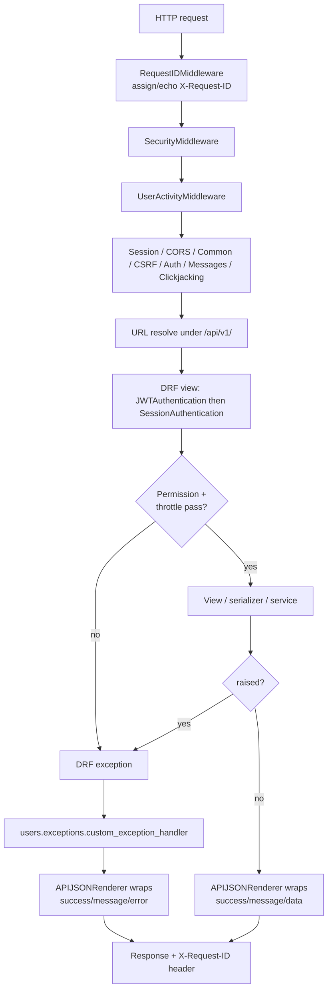
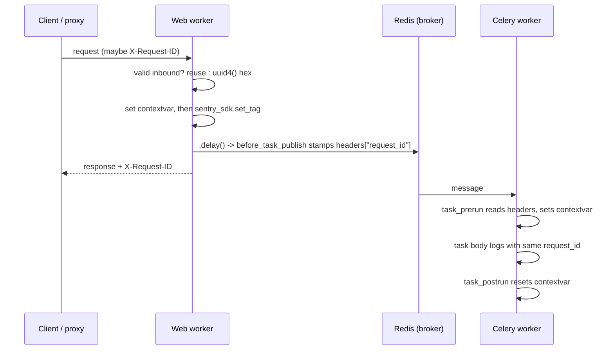
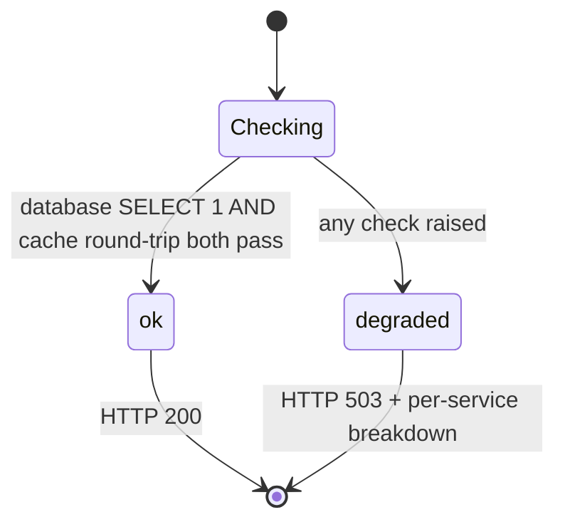

# Project configuration — `AutoGrader/`

> Part of the [backend reference](README.md). Related: [async-and-infrastructure.md](async-and-infrastructure.md), [security-and-tenancy.md](security-and-tenancy.md), [operations.md](operations.md).

## In plain terms

`AutoGrader/` is not a feature — it is the wiring that every feature runs on. It holds the one settings file that decides what the app connects to (database, Redis, Stripe, Cloudinary, the email provider), the Celery setup that lets slow work run in the background, the middleware that stamps every request with a trackable ID, and the health endpoints a deploy system polls to decide whether the app is alive. Almost everything in it changes behaviour based on a single environment variable called `ENVIRONMENT`, which is either `local`, `dev`, or `prod`. If you are debugging "why does this work locally but not in production", this is the file to read first.

---

## Entry points

| Kind | Path / name | Method | Auth | Source |
|---|---|---|---|---|
| URL | `/api/v1/health` | GET | **None** (`AllowAny`, no auth classes, throttle-exempt) | [AutoGrader/health.py:62-85](../../AutoGrader/health.py#L62-L85) |
| URL | `/api/v1/health/beat` | GET | **None** (same) | [AutoGrader/health.py:118-129](../../AutoGrader/health.py#L118-L129) |
| URL | `/admin/` | any | Django session + staff | [AutoGrader/urls.py:57](../../AutoGrader/urls.py#L57) |
| URL | `/api/v1/` (schema) | GET | per `SPECTACULAR_SETTINGS` | [AutoGrader/urls.py:32-38](../../AutoGrader/urls.py#L32-L38) |
| URL | `/api/v1/swagger-ui` | GET | as above | [AutoGrader/urls.py:34-37](../../AutoGrader/urls.py#L34-L37) |
| URL | `/api/v1/auth/login` | POST | none (obtains JWT) | [AutoGrader/urls.py:47](../../AutoGrader/urls.py#L47) |
| URL | `/api/v1/auth/refresh` | POST | refresh token | [AutoGrader/urls.py:48](../../AutoGrader/urls.py#L48) |
| Celery task | `AutoGrader.beat_health.check_beat_health` | — | Beat, every 15 min | [AutoGrader/beat_health.py:104](../../AutoGrader/beat_health.py#L104) |
| Celery task | `AutoGrader.tasks.send_email_task` | — | called via `safe_delay` across apps | [AutoGrader/tasks.py:82](../../AutoGrader/tasks.py#L82) |
| Celery signal | `before_task_publish` | — | — | [AutoGrader/celery_signals.py:81](../../AutoGrader/celery_signals.py#L81) |
| Celery signal | `task_prerun` | — | — | [AutoGrader/celery_signals.py:88](../../AutoGrader/celery_signals.py#L88) |
| Celery signal | `task_postrun` | — | — | [AutoGrader/celery_signals.py:106](../../AutoGrader/celery_signals.py#L106) |
| Middleware | `AutoGrader.middleware.RequestIDMiddleware` | — | — | [AutoGrader/middleware.py:23](../../AutoGrader/middleware.py#L23) |
| Error handlers | `handler400/403/404/500` | — | — | [AutoGrader/urls.py:26-30](../../AutoGrader/urls.py#L26-L30) → [AutoGrader/handlers.py](../../AutoGrader/handlers.py) |

**URL prefix.** Every app URL is mounted twice-nested: `urlpatterns` includes `core_urlpatterns` under `api/v1/`, and `core_urlpatterns` includes each app's `urls.py` at the empty prefix ([AutoGrader/urls.py:41-54](../../AutoGrader/urls.py#L41-L54)). So an app route declared as `assignments` is served at `/api/v1/assignments`. `APPEND_SLASH = False` ([settings.py:131](../../AutoGrader/settings.py#L131)) and `DEFAULT_ROUTER_TRAILING_SLASH: False` ([settings.py:1014](../../AutoGrader/settings.py#L1014)) — **trailing slashes are not accepted and not redirected to**; `/api/v1/assignments/` is a 404.

**djoser is installed but not routed.** `djoser` is in `INSTALLED_APPS` and `DJOSER` settings exist, but its URL include is commented out ([AutoGrader/urls.py:58](../../AutoGrader/urls.py#L58)); auth is served by `users.views.AuthViewSet` instead. The settings block says so explicitly ([settings.py:1086-1091](../../AutoGrader/settings.py#L1086-L1091)). Treat the `DJOSER` dict as mostly inert configuration — but see [users-and-auth.md](users-and-auth.md), because some djoser *machinery* (not its URLs) is still used.

---

## Request lifecycle

*Caption: middleware order is load-bearing — the request id is set first and torn down last.*

### Envelope shape

Every DRF response is re-wrapped by `APIJSONRenderer` ([users/renderers.py:112-161](../../users/renderers.py#L112-L161)):

- Success → `{"success": true, "message": ..., "data": <original payload>}`
- Failure → `{"success": false, "message": <flattened human string>, "error": {"field_errors": ...}}`

`flatten_errors` ([users/renderers.py:58-109](../../users/renderers.py#L58-L109)) collapses DRF's nested error dict into one string; multiple errors become a numbered list *inside a single string*, not a list. Field names are humanised (`non_field_errors` is unlabelled; everything else becomes `Field name: message`).

Unhandled exceptions (no DRF response) take a different branch: `custom_exception_handler` attaches the raw exception as `response._raw_exc` ([users/exceptions.py:32](../../users/exceptions.py#L32)) and the renderer converts it through `describe_user_error` ([users/renderers.py:147-149](../../users/renderers.py#L147-L149)), appending a traceback **only when `DEBUG`** ([users/renderers.py:150-154](../../users/renderers.py#L150-L154)).

The Django-level `handler400/403/404/500` functions ([AutoGrader/handlers.py](../../AutoGrader/handlers.py)) cover requests that never reach DRF. Note a bug worth knowing when reading logs: `_json_error` hardcodes `"message": "Not Found"` for **all four** handlers and ignores its own `message` argument ([AutoGrader/handlers.py:9-10](../../AutoGrader/handlers.py#L9-L10)) — a Django-level 500 renders as `{"success": false, "message": "Not Found", "error": {}}`.

---

## Correlation IDs

*Caption: one id spans the HTTP request, its logs, its Sentry event, and every task it dispatches.*

- Inbound ids are trusted only if they match `^[A-Za-z0-9._-]{1,128}$` ([AutoGrader/request_context.py:49](../../AutoGrader/request_context.py#L49)) — the value is echoed back and logged verbatim, so newline/separator injection is the threat being closed.
- The id is a `ContextVar`, not a module global, because both WSGI and Celery prefork reuse one process across many units of work ([AutoGrader/request_context.py:15-20](../../AutoGrader/request_context.py#L15-L20)).
- The `task_postrun` reset exists so a Beat task running after a request-triggered task does not inherit the previous id ([AutoGrader/celery_signals.py:24-28](../../AutoGrader/celery_signals.py#L24-L28)).
- `_extract_request_id` checks both `task.request.<key>` and `task.request.headers[<key>]` because eager execution only populates the latter ([AutoGrader/celery_signals.py:54-78](../../AutoGrader/celery_signals.py#L54-L78)).
- `X-Request-ID` is in `CORS_EXPOSE_HEADERS` ([settings.py:269](../../AutoGrader/settings.py#L269)) so a browser frontend can read it back and put it in a support ticket.

---

## Task dispatch: loud vs silent

Two wrappers exist so "the broker is down" has two deliberately different outcomes ([AutoGrader/dispatch.py:1-21](../../AutoGrader/dispatch.py#L1-L21)):

| Wrapper | Used for | On broker outage | Source |
|---|---|---|---|
| `safe_delay(task, ...)` | side effects: notification emails, MailerLite sync | logs ERROR, returns `None`, caller's work still commits | [AutoGrader/dispatch.py:56-72](../../AutoGrader/dispatch.py#L56-L72) |
| `students.task_tracking.launch_processing_task` | user-initiated grading/upload | raises `ProcessingTemporarilyUnavailable` → HTTP 503 | [AutoGrader/dispatch.py:47-53](../../AutoGrader/dispatch.py#L47-L53), see [students-and-submissions.md](students-and-submissions.md) |

Both classify an outage using the same tuple `BROKER_UNAVAILABLE_ERRORS` ([AutoGrader/dispatch.py:38-44](../../AutoGrader/dispatch.py#L38-L44)) — redis `ConnectionError`/`TimeoutError`, kombu `OperationalError`, and the builtin `ConnectionError`/`TimeoutError`. Anything else propagates, because a malformed `.delay()` call is a bug, not an outage.

---

## Cache invalidation batching

`delete_cache_patterns(*patterns)` is the only sanctioned way to do wildcard invalidation ([AutoGrader/cache_utils.py:45-60](../../AutoGrader/cache_utils.py#L45-L60)). Inside a `batched_cache_invalidation()` block the patterns are collected into a `ContextVar` set and flushed once at the outermost exit — including on exception, because rows written before the failure still need invalidating ([AutoGrader/cache_utils.py:63-81](../../AutoGrader/cache_utils.py#L63-L81)).

Why it exists: signal handlers clear ~10 patterns per user/enrollment save, and `django-redis`'s `delete_pattern` does a full keyspace `SCAN`. A bulk enrolment of N students would otherwise be N×10 keyspace scans against a remote Redis ([AutoGrader/cache_utils.py:6-11](../../AutoGrader/cache_utils.py#L6-L11)). `DJANGO_REDIS_SCAN_ITERSIZE = 100_000` ([settings.py:1178](../../AutoGrader/settings.py#L1178)) raises the default SCAN COUNT of 10 for the same reason.

Failures are swallowed and logged, never raised ([AutoGrader/cache_utils.py:39-42](../../AutoGrader/cache_utils.py#L39-L42)): stale cache for at most `CACHE_TTL` beats a 500 after the write already committed.

`KEY_PREFIX = "gaplus"` ([settings.py:1170](../../AutoGrader/settings.py#L1170)) is load-bearing — cache and Celery broker share one Redis instance, and a `delete_pattern("*user*")` without the prefix could match broker keys.

---

## Upload size guard

`validate_upload_size` ([AutoGrader/uploads.py:28-37](../../AutoGrader/uploads.py#L28-L37)) raises `PayloadTooLarge` (HTTP 413) above `MAX_UPLOAD_SIZE_BYTES`. It exists because `DATA_UPLOAD_MAX_MEMORY_SIZE` only caps in-memory buffering — a larger multipart part spills to temp disk and is still accepted ([AutoGrader/uploads.py:3-6](../../AutoGrader/uploads.py#L3-L6)).

> **UNVERIFIED:** the constant is `50 * 1024 * 1024` (50 MB) but the comment immediately above it justifies **25 MB** ([AutoGrader/uploads.py:21-25](../../AutoGrader/uploads.py#L21-L25)). One of the two was changed without the other. To resolve: check git history for the constant, and confirm with the team which limit is intended.

`MAX_UPLOAD_SIZE_BYTES` is **not** env-configurable — changing it needs a deploy.

---

## Health checks

*Caption: `/health` returns 200 only when every dependency answers; the body always names which one failed.*

`_check_cache` writes **and reads back** rather than just writing, so a backend that silently no-ops still fails the check ([AutoGrader/health.py:43-48](../../AutoGrader/health.py#L43-L48)).

`/health/beat` is deliberately a **second endpoint**, not one more check inside `/health` ([AutoGrader/health.py:12-21](../../AutoGrader/health.py#L12-L21)). Railway's Healthcheck Path gates a service's deploy cutover; folding "is Beat alive" into the web service's gate would let a Beat outage block unrelated web deploys. `/health/beat` is for an external uptime monitor.

`_check_beat_watchdog` ([AutoGrader/health.py:97-115](../../AutoGrader/health.py#L97-L115)) reads `PeriodicTask` row `check-beat-health` and fails if it is missing, disabled, or last ran more than `BEAT_WATCHDOG_MAX_GAP_MINUTES = 45` ago ([AutoGrader/health.py:94](../../AutoGrader/health.py#L94)) — three times the 15-minute schedule, so a routine scheduling delay never false-alarms.

### Why two layers of Beat monitoring

`check_beat_health` ([AutoGrader/beat_health.py:104-125](../../AutoGrader/beat_health.py#L104-L125)) logs an ERROR naming every overdue task from `BEAT_HEALTH_EXPECTATIONS`. It **cannot detect Beat being fully dead** — if Beat doesn't run, the watchdog doesn't run either. That gap is closed from a different process by `/health/beat`, which reads the watchdog's own `last_run_at` from the web process ([AutoGrader/beat_health.py:109-115](../../AutoGrader/beat_health.py#L109-L115)).

`find_overdue_tasks` ([AutoGrader/beat_health.py:47-101](../../AutoGrader/beat_health.py#L47-L101)):

| Row state | Result | Reasoning |
|---|---|---|
| No matching `PeriodicTask` | reported as overdue ("missing or renamed") | a renamed schedule entry silently stops being monitored otherwise |
| `enabled == False` | skipped | deliberately disabled, not broken |
| `last_run_at` is `None` | falls back to `date_changed` as reference | catches a newly-registered task that *never* starts firing, not just one that stops |
| `now - reference > alert_threshold` | reported as overdue | — |

`BEAT_HEALTH_EXPECTATIONS` ([settings.py:919-940](../../AutoGrader/settings.py#L919-L940)) is hand-maintained, not derived from the crontabs — the comment says so and asks whoever edits `CELERY_BEAT_SCHEDULE` to edit it too ([settings.py:909-918](../../AutoGrader/settings.py#L909-L918)). **This is a known drift risk:** the schedule has 18 entries and the expectations table has 16 (`send-weekly-course-summaries` etc. are present; `check-beat-health` itself and `send-weekly-*` coverage should be re-checked against the schedule when either changes).

---

## Decision logic

### `ENVIRONMENT` gating

`ENVIRONMENT` is read with no default ([settings.py:109](../../AutoGrader/settings.py#L109)) — the app will not boot without it. Everything below forks on it.

| Setting | `local` | `dev` | `prod` | Unrecognised value | Why |
|---|---|---|---|---|---|
| `DEBUG` | `True` | `False` | `False` | `False` + ERROR log | Fails closed. A typo previously left `DEBUG` unassigned → `NameError` at import; the current code keeps the fail-closed result but makes the cause visible ([settings.py:117-129](../../AutoGrader/settings.py#L117-L129)) |
| `ALLOWED_HOSTS` | `["*"]` | `[]` + Railway domains | fixed allowlist + Railway domains | as `prod` | Was `"*"` everywhere including prod — enables Host-header injection, poisoned reset links, cache poisoning ([settings.py:187-210](../../AutoGrader/settings.py#L187-L210)) |
| `CORS_ALLOWED_ORIGINS` | `["http://localhost:3000"]` | full production allowlist | same allowlist | as `prod` | `CORS_ALLOW_ALL_ORIGINS = True` previously overrode the allowlist in prod, letting any site call the API with a stolen bearer token ([settings.py:212-244](../../AutoGrader/settings.py#L212-L244)) |
| Secure cookies / HSTS | off | off | on | off | A `Secure`-only cookie is never sent over `http://localhost`, which looks like a broken login ([settings.py:272-298](../../AutoGrader/settings.py#L272-L298)) |
| Media storage | Cloudinary | Cloudinary | Cloudinary | filesystem | `ENVIRONMENT in ["dev","local"]` → Cloudinary; the `FileSystemStorage` branch is only reachable for an unrecognised value ([settings.py:965-986](../../AutoGrader/settings.py#L965-L986)) |
| Static storage | plain | plain | `ManifestStaticFilesStorage` | plain | cache-busting hashed names in prod only |
| DB URL env var | `DATABASE_URI_LOCAL` | `DATABASE_URI_DEV` | `DATABASE_URI` | `DATABASE_URI` | [settings.py:404-407](../../AutoGrader/settings.py#L404-L407) |
| Redis URL env var | `REDIS_LOCAL_URL` | `REDIS_DEV_URL` | `REDIS_PROD_URL` | `REDIS_PROD_URL` | broker, result backend, and cache all read the same choice ([settings.py:471-480](../../AutoGrader/settings.py#L471-L480), [1152-1172](../../AutoGrader/settings.py#L1152-L1172)) |
| Stripe keys | `LOCAL_STRIPE_*` | `LOCAL_STRIPE_*` | `STRIPE_*` | `LOCAL_STRIPE_*` | only `prod` uses live keys ([settings.py:1199-1206](../../AutoGrader/settings.py#L1199-L1206)) |
| Sentry | off | on if DSN | on if DSN | off | `ENVIRONMENT in ("prod","dev")` and DSN set ([settings.py:146](../../AutoGrader/settings.py#L146)) |

Note the asymmetry: for **security** settings an unrecognised `ENVIRONMENT` behaves like prod (fail closed), but for **storage** it falls to `FileSystemStorage` and for **Stripe/Redis/DB** it falls to the `dev`-ish or prod branch depending on the expression. The `.get(ENVIRONMENT, "DATABASE_URI")` and the trailing `else` in the Redis ternary both resolve to the production variable — so a typo'd `ENVIRONMENT` on a staging box would reach **production Redis and production Postgres** while using local Stripe keys. Worth treating as a hazard.

### CORS localhost regex

`CORS_ALLOWED_ORIGIN_REGEXES` permits any localhost origin in **every** environment ([settings.py:257-259](../../AutoGrader/settings.py#L257-L259)), unlike the allowlist. The stated justification: frontend devs run locally against a deployed backend, and `CORS_ALLOW_CREDENTIALS = False` ([settings.py:263](../../AutoGrader/settings.py#L263)) means it cannot ride a cookie/session — it only lets localhost JS *read* responses to bearer-token requests it already had the token to make ([settings.py:250-256](../../AutoGrader/settings.py#L250-L256)).

### Sentry sampling

`traces_sample_rate` defaults to `0.05` ([settings.py:168](../../AutoGrader/settings.py#L168)) because grading requests are long-running and full tracing would be costly; errors are always captured. `send_default_pii=False` ([settings.py:171](../../AutoGrader/settings.py#L171)) because payloads carry student work, grades, and billing identifiers. Both the `import sentry_sdk` and the middleware's `set_tag` are guarded against `ImportError` so a deploy that has not installed the package degrades to "no error reporting" rather than failing to start ([settings.py:179-185](../../AutoGrader/settings.py#L179-L185), [AutoGrader/middleware.py:49-58](../../AutoGrader/middleware.py#L49-L58)).

### Database connection settings

| Key | Value | Reason |
|---|---|---|
| `conn_max_age` | `600` | At 0, every request paid TCP+TLS+auth to managed Postgres before its first query ([settings.py:378-382](../../AutoGrader/settings.py#L378-L382)) |
| `conn_health_checks` | `True` | Only meaningful with persistent connections; a connection dropped by the pooler becomes a retry, not a 500 ([settings.py:383-386](../../AutoGrader/settings.py#L383-L386)) |
| `disable_server_side_cursors` | `True` | Production runs behind pgbouncer in **transaction** pooling mode; a server-side cursor outlives its transaction but the pooler reassigns the connection at commit, so `.iterator()` finds the cursor gone. **Must** be in the per-database dict, not module-level — the old module-level `DISABLE_SERVER_SIDE_CURSORS` did nothing ([settings.py:387-397](../../AutoGrader/settings.py#L387-L397)) |

`lock_timeout` and `idle_in_transaction_session_timeout` are deliberately **not** set here. Passing them as psycopg2 `options` made every connection die with `FATAL: unsupported startup parameter in options` — taking down web and Celery, invisibly to local/dev which talk to Postgres directly. They live on the DB role via `ALTER ROLE`; see [docs/ops/postgres-guard-rails.md](../ops/postgres-guard-rails.md) and the full write-up at [settings.py:415-437](../../AutoGrader/settings.py#L415-L437).

### Throttling

Deliberately **anonymous-only**: `UserRateThrottle` is not enabled because dashboard and grading views fan out into many sub-queries per page load and a global per-user cap would throttle legitimate use ([settings.py:1015-1022](../../AutoGrader/settings.py#L1015-L1022)).

| Scope | Rate | Guards |
|---|---|---|
| `anon` | 60/min | everything unauthenticated |
| `login` | 10/min | credential stuffing |
| `verify_email` | 5/hour | 6-digit activation code brute force ([users/throttling.py:22-33](../../users/throttling.py#L22-L33)) |
| `otp_request` | 5/hour | **load-bearing for the reset lockout** — `generate_code()` resets the failed-attempt counter, so unlimited code requests clear the lockout ([users/throttling.py:36-47](../../users/throttling.py#L36-L47)) |
| `password_reset` | 10/hour | |
| `register` | 10/hour | signup spam |
| `google_auth` | 20/hour | |
| `custom_ai_prompt` | 10/min | the one **authenticated** bucket. Deliberately one shared bucket across all four dashboard-chat endpoints so a multi-role user can't multiply their budget by hopping endpoints; the superadmin path is unmetered by credits, so this is its only volume control ([settings.py:1036-1049](../../AutoGrader/settings.py#L1036-L1049)) |

One thin `AnonRateThrottle` subclass per scope exists because DRF reads `throttle_scope` from the *view*, and `AuthViewSet` hosts every auth action on one class ([users/throttling.py:1-13](../../users/throttling.py#L1-L13)).

### JWT

`ACCESS_TOKEN_LIFETIME` 1 day, `REFRESH_TOKEN_LIFETIME` 2 days, rotation on, blacklist after rotation, HS256 ([settings.py:1054-1063](../../AutoGrader/settings.py#L1054-L1063)). A 1-day access token is long for a bearer credential; there is no revocation path for an access token before expiry (only refresh tokens are blacklisted).

> **UNVERIFIED:** no rationale is recorded for the 1-day access lifetime. To confirm whether it is deliberate, check with the team or look for a frontend constraint (e.g. no silent-refresh implementation).

---

## Celery app

`app = Celery("AutoGrader")`, configured from Django settings under the `CELERY` namespace, with `autodiscover_tasks()` ([AutoGrader/celery.py:8-17](../../AutoGrader/celery.py#L8-L17)). Because `AutoGrader` is not in `INSTALLED_APPS`, `beat_health` and `celery_signals` are imported **explicitly** at the bottom — autodiscovery would never find them ([AutoGrader/celery.py:19-28](../../AutoGrader/celery.py#L19-L28)).

Core broker settings and their reasoning are covered in [async-and-infrastructure.md](async-and-infrastructure.md). The one that matters most here:

`CELERY_BROKER_TRANSPORT_OPTIONS = {"visibility_timeout": 3600}` ([settings.py:500-502](../../AutoGrader/settings.py#L500-L502)). With `CELERY_TASK_ACKS_LATE = True`, Redis redelivers an unacked message after the visibility timeout, assuming the worker died. At the previous 600s, a legitimately long grading run was redelivered to a second worker and **double-billed the teacher**. Raised to 3600s, well above the grading task's own hard time limit. The actual correctness guarantee against duplicate execution is the DB-level grading claim in `students.services._claim_submission_for_grading`; this setting just makes redeliveries rare.

`send_email_task` ([AutoGrader/tasks.py:82-125](../../AutoGrader/tasks.py#L82-L125)): `max_retries=3, default_retry_delay=30`. `_send_email_impl` first tries a MailerSend template send, then falls back to plain `send_mail` — **unless** there is no plain body and no HTML, in which case a fallback would be an empty email and it re-raises instead ([AutoGrader/tasks.py:50-61](../../AutoGrader/tasks.py#L50-L61)). The retry wiring was previously configured but never called, so every failure was final ([AutoGrader/tasks.py:104-111](../../AutoGrader/tasks.py#L104-L111)).

---

## `UserActivityMiddleware`

Runs **after** the view (it calls `get_response` first) and, for an authenticated user, does three writes per request ([users/middleware.py:16-46](../../users/middleware.py#L16-L46)):

1. `UserActivity.objects.create(user=user)` — one row per request
2. `CreditWallet.objects.get_or_create(user=user)` — lazily materialises the billing wallet
3. Redis: `active_user:{user_type}:{id}` with a 300s TTL, and `SADD online_users_set "{user_type}:{id}"`

The whole block is wrapped in a bare `except Exception: pass` — the stated reason is that a view which deleted the user makes the FK insert fail, and this is non-critical logging.

Concerns worth flagging to a new engineer:

- **One `UserActivity` INSERT per authenticated request** is a write on every read endpoint. The code's own comment acknowledges it should be throttled or moved to a task ([users/middleware.py:23-25](../../users/middleware.py#L23-L25)).
- `online_users_set` is a Redis set with **no TTL and no eviction** in this middleware — it only grows. Whether anything trims it is covered in [dashboard.md](dashboard.md) (`record_concurrent_users` reads it).
- The bare `except` also swallows Redis outages and genuine bugs.

---

## Failure modes & recovery

| Failure | User sees | Automatic recovery | Manual intervention |
|---|---|---|---|
| `ENVIRONMENT` unset | app does not boot (`ImproperlyConfigured` from `env.str`) | none | set the env var |
| `ENVIRONMENT` typo'd | app boots with `DEBUG=False`, an ERROR log, **and production Redis/Postgres** | none | read the ERROR line at startup |
| `SECRET_KEY`/`DATABASE_URI`/Cloudinary/Stripe/Google/`MAILSEND_API_KEY` unset | app does not boot — all read with no default | none | set the var |
| Postgres down | `/health` → 503 `{"database": "error: ..."}`; API 500s | `conn_health_checks` retries a dead pooled connection | — |
| Redis down | `/health` → 503 `{"cache": ...}`; `safe_delay` dispatches silently dropped; user-initiated grading returns 503 typed error | workers retry broker connection on startup (`CELERY_BROKER_CONNECTION_RETRY_ON_STARTUP`) | dropped `safe_delay` emails are **lost, not queued** |
| Beat dies | nothing user-visible; scheduled billing/summary jobs stop | none | `/health/beat` → 503 for an external monitor; `check_beat_health` cannot detect this |
| Beat duplicated | tasks fire twice | none | `check-beat-health` won't catch it either — only the `last_run_at` gap check would look *healthy*. Detect via duplicate side effects |
| Sentry package missing but DSN set | WARNING at startup, no error reporting | degrades gracefully | `pip install -r requirements.txt` |
| Cache invalidation fails | stale reads for ≤ `CACHE_TTL` (300s) | self-heals at TTL | — |
| Upload > limit | HTTP 413 with the file name and size | — | — |
| Django-level 400/403/404/500 | `{"success": false, "message": "Not Found", ...}` regardless of the real status | — | the misleading message is a bug in `handlers.py` |

**Where money/data can go inconsistent:** the redelivery double-billing scenario above is the canonical one. It is mitigated at three layers — visibility timeout (rare), the grading claim (correct), and idempotency inside the billing tasks (see [billing-core.md](billing-core.md)).

---

## Configuration

Only project-level keys are listed; feature-specific env vars live in each feature's doc. **Never** read values from `.env`, `live.env`, or `QA.env` — names only.

### Required (no default — app will not boot without them)

`SECRET_KEY`, `FRONTEND_DOMAIN`, `ENVIRONMENT`, the environment's DB URL (`DATABASE_URI` / `DATABASE_URI_DEV` / `DATABASE_URI_LOCAL`), the environment's Redis URL (`REDIS_PROD_URL` / `REDIS_DEV_URL` / `REDIS_LOCAL_URL`), `CLOUDINARY_CLOUD_NAME`, `CLOUDINARY_API_KEY`, `CLOUDINARY_API_SECRET`, `MAILSEND_API_KEY`, `GOOGLE_OAUTH_CLIENT_ID`, `GOOGLE_OAUTH_CLIENT_SECRET`, `GOOGLE_REDIRECT_URI`, and the environment's Stripe trio (`STRIPE_PUBLIC_KEY`/`STRIPE_SECRET_KEY`/`STRIPE_WEBHOOK_SECRET` in prod, `LOCAL_STRIPE_*` otherwise).

### Optional

| Var | Default | Effect |
|---|---|---|
| `STUDENT_FRONTEND_DOMAIN` | `FRONTEND_DOMAIN` | separate student app domain for activation/login links ([settings.py:106](../../AutoGrader/settings.py#L106)) |
| `SENTRY_DSN` | `""` | enables error reporting in prod/dev only |
| `SENTRY_TRACES_SAMPLE_RATE` | `0.05` | trace sampling |
| `SECURE_SSL_REDIRECT` | `False` | opt-in; turning it on before the proxy is confirmed to set `X-Forwarded-Proto` causes a redirect loop ([settings.py:295-298](../../AutoGrader/settings.py#L295-L298)) |
| `RAILWAY_PUBLIC_DOMAIN`, `RAILWAY_PRIVATE_DOMAIN` | injected by Railway | appended to `ALLOWED_HOSTS` so a new service passes its own healthcheck without a code change |
| `FIELD_ENCRYPTION_KEY` | `""` | key for `encrypted_model_fields` |
| `GRADING_LOG_LEVEL` | `INFO` | level for the `ai_processor` and `students` loggers |
| `USE_BETA_PLAN_ON_SIGNUP` | `False` | see [billing-core.md](billing-core.md) |
| `CACHE_TTL` | `300` (constant, not env) | default cache lifetime |

Feature flags defined here but documented elsewhere: all `GRADING_*` and `ANSWER_*` → [ai-processor.md](ai-processor.md); `ASSIGNMENT_PDF_*` and `PDF_RENDERER_*` → [pdf-pipeline.md](pdf-pipeline.md); `DASHBOARD_CUSTOM_AI_PROMPT_ENABLED` → [dashboard.md](dashboard.md); `ENABLE_BILLING_TIME_TRAVEL`, `ENABLE_STRIPE_LIVE_QA`, `BILLING_TEST_CLOCK_EMAIL_DOMAINS`, `STRIPE_LIVE_QA_EMAIL_DOMAIN` → [billing-qa-harness.md](billing-qa-harness.md); `ENABLE_AI_LIVE_QA`, `BENCHMARK_ARCHIVE_*`, `GRADING_BENCHMARK_DAY_OF_WEEK` → [ai-quality-harness.md](ai-quality-harness.md); `ALLOWED_BUSINESS_EMAIL_DOMAINS`, `DISALLOWED_EMAIL_DOMAINS`, `DISPOSABLE_EMAIL_DOMAINS`, `EXEMPT_EMAIL_DOMAINS`, `MAILERLITE_*` → [users-and-auth.md](users-and-auth.md); the weekly-summary / at-risk / inactivity schedule vars → [dashboard.md](dashboard.md).

### Logging

No root logger is configured. `django` logs at `ERROR`, and `ai_processor` / `students` are configured explicitly with `propagate: False` ([settings.py:64-93](../../AutoGrader/settings.py#L64-L93)). The comment records why: before this, the whole grading pipeline logged under the name `ai_processor.validators` because of a stray `logging.basicConfig()` at import time, making it impossible to tell which stage produced a line. **Any app not listed there (`billing`, `assignments`, `classrooms`, `dashboard`, `users`) has no explicit handler** and relies on the default `lastResort` behaviour — worth knowing when a billing log line seems to be missing.
