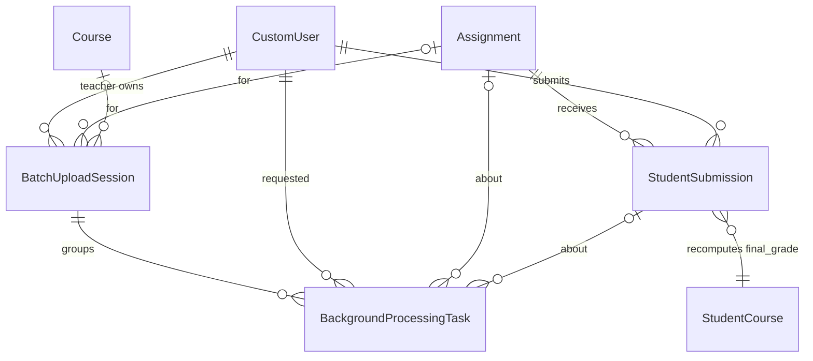
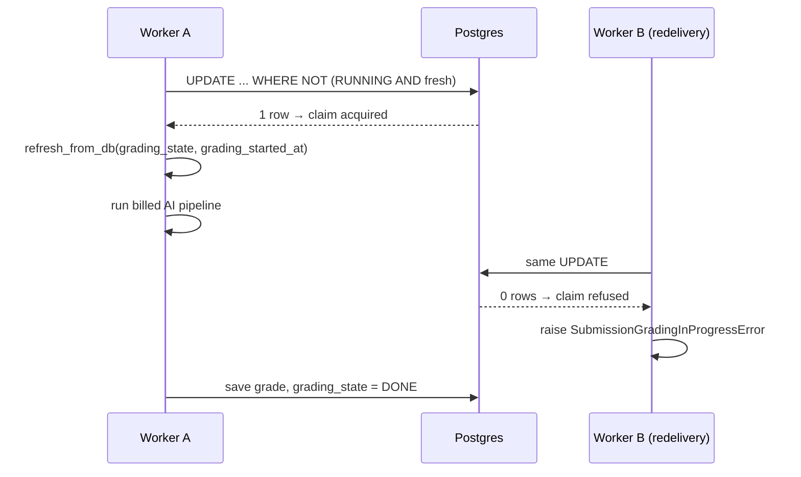
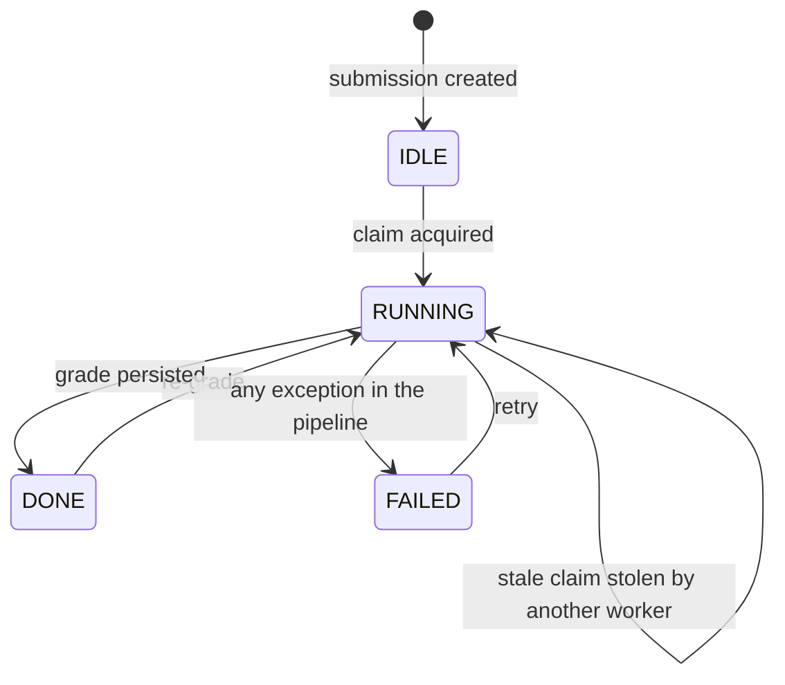
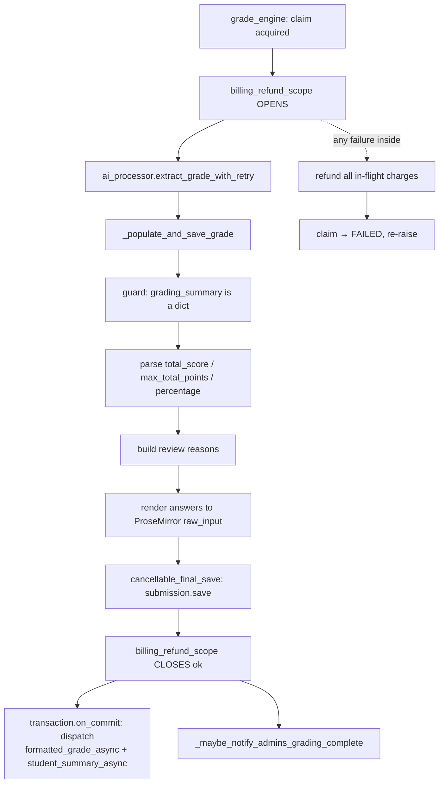
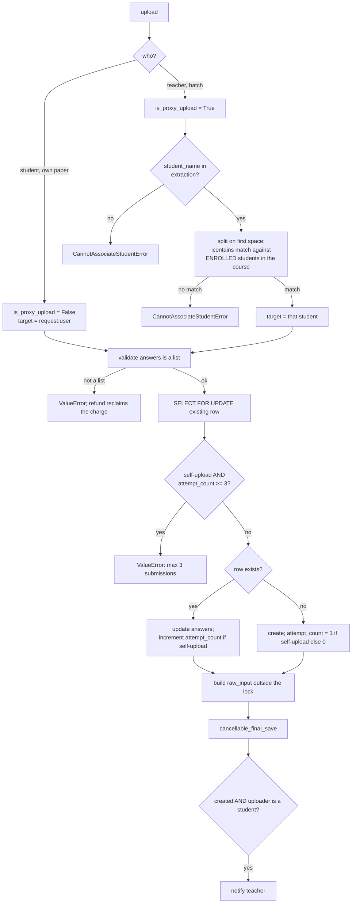
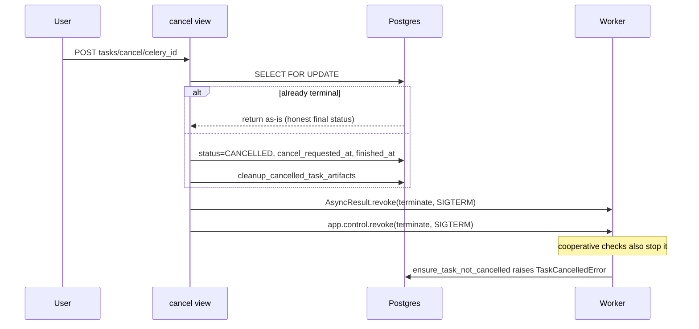

# Students and submissions — upload, grading claim, review queue, task tracking

> Part of the [backend reference](README.md). Related: [ai-processor.md](ai-processor.md), [assignments.md](assignments.md), [billing-core.md](billing-core.md), [async-and-infrastructure.md](async-and-infrastructure.md).

## In plain terms

This app holds a student's answers to an assignment and the grade that comes back. Answers get in three ways: a student uploads their own paper, a teacher uploads one student's paper for them, or a teacher uploads a whole stack and the system works out whose paper is whose from the name written on it. Grading is expensive and billed, so the app takes great care never to grade the same paper twice — it "claims" a submission before starting, and a second worker that finds an existing claim backs off instead of paying for the same work again. When two independent AI graders disagree, the submission is flagged into a **review queue** for the teacher, sorted worst-first. This app also owns the generic progress-tracking table that every long-running job in the product reports into.

---

## Entry points

All paths relative to `/api/v1/`. `SimpleRouter(trailing_slash=False)` ([students/urls.py:5](../../students/urls.py#L5)).

| Method | Path | Permissions | Source |
|---|---|---|---|
| GET | `submissions` | `IsAuthenticated` (scoped) | [students/views.py:172](../../students/views.py#L172) |
| GET | `submissions/<pk>` | `IsAuthenticated` (scoped) | [students/views.py:236](../../students/views.py#L236) |
| POST | `submissions` | — **raises `NotImplementedError`** | [students/views.py:275](../../students/views.py#L275) |
| PATCH | `submissions/<pk>` | `IsStudent, HasCreditBalance` | [students/views.py:538](../../students/views.py#L538) |
| DELETE | `submissions/<pk>` | `IsTeacher` | default |
| POST | `submissions/<assignment_id>/upload` | `IsStudent, HasCreditBalance` | [students/views.py:400](../../students/views.py#L400) |
| POST | `submissions/<assignment_id>/upload-async` | `IsStudent, HasCreditBalance` | [students/views.py:476](../../students/views.py#L476) |
| POST | `submissions/<assignment_id>/batch-upload` | `IsTeacher, HasCreditBalance` | [students/views.py:1089](../../students/views.py#L1089) |
| POST | `submissions/<pk>/grade` | `IsTeacher, HasCreditBalance` | [students/views.py:623](../../students/views.py#L623) |
| POST | `submissions/<pk>/grade-async` | `IsTeacher, HasCreditBalance` | [students/views.py:677](../../students/views.py#L677) |
| POST | `submissions/<pk>/schedule-grade-async` | `IsTeacher, HasCreditBalance` | [students/views.py:717](../../students/views.py#L717) |
| POST/PATCH | `submissions/<pk>/teacher_feedback` | `IsTeacherOrReadOnly` | [students/views.py:783](../../students/views.py#L783) |
| PATCH | `submissions/<pk>/update-grade` | `IsTeacher, HasCreditBalance` | [students/views.py:867](../../students/views.py#L867) |
| POST | `submissions/<pk>/publish` | `IsTeacher` | [students/views.py:1178](../../students/views.py#L1178) |
| POST | `submissions/<pk>/mark-reviewed` | **`IsAuthenticated` only** | [students/views.py:1235](../../students/views.py#L1235) |

`StudentViewSet` ([students/views.py:1367](../../students/views.py#L1367)) is defined but **not routed** — `students/urls.py` registers only `StudentSubmissionViewSet`.

`students/tasks.py` is **entirely commented out** ([students/tasks.py](../../students/tasks.py)) — every Celery task that operates on submissions lives in `assignments/tasks.py`. See [assignments.md](assignments.md#entry-points).

### Signals

| Signal | Effect | Source |
|---|---|---|
| `post_save`/`post_delete` on `StudentSubmission` | clear 7 cache patterns | [students/signals.py:16-26](../../students/signals.py#L16-L26) |
| `post_save`/`post_delete` on `BatchUploadSession` | clear 2 patterns | [students/signals.py:29-32](../../students/signals.py#L29-L32) |
| `post_save`/`post_delete` on `StudentSubmission` (in **classrooms**) | recalculate `StudentCourse.final_grade` | [classrooms/signals.py:184-201](../../classrooms/signals.py#L184-L201) — see [classrooms.md](classrooms.md#final-grade-recalculation) |

---

## Data model

### `StudentSubmission` ([students/models.py:31-240](../../students/models.py#L31-L240))

| Field | Type | Null | Default | Written by | Meaning |
|---|---|---|---|---|---|
| `id` | UUID | no | `uuid4` | — | PK |
| `assignment` | FK → Assignment | no | — | upload | CASCADE, `related_name="submissions"` |
| `student` | FK → CustomUser | no | — | upload | CASCADE, `related_name="submissions"` |
| `submission_date` | DateTime | no | `auto_now_add` | upload | set **explicitly** on first create — see below |
| `answers` | JSONField | **no** | — | AI extraction | the extracted answer list. Not nullable, which is why the upload path validates it |
| `raw_input` | TextField | yes | — | derived | ProseMirror JSON of the rendered answers; lazily backfilled on GET |
| `score` | Decimal(6,2) | yes | `0.00` | grading / override | final score (may be teacher-overridden) |
| `score_percentage` | Decimal(5,2) | yes | — | grading / override | **db_index** — the rigor `evidence` component reads this |
| `max_points` | Integer | yes | — | grading | |
| `feedback` | JSONField | yes | — | grading | the whole grading result blob |
| `graded_at` | DateTime | yes | — | grading | **db_index**; half the "is it graded" test |
| `grading_state` | CharField(20) | no | `IDLE` | claim | **db_index**; the idempotency claim |
| `grading_started_at` | DateTime | yes | — | claim | when the current claim was acquired |
| `grading_confidence` | Integer | **no** | `0` | grading | clamped 0–100 |
| `extraction_confidence` | Integer | **no** | `0` | upload | clamped 0–100 |
| `needs_review` | Boolean | no | `False` | grading | **db_index**; the review-queue filter |
| `review_reasons` | JSONField | yes | — | grading / resolution | why review is needed, plus the teacher's resolution |
| `review_severity` | Float | yes | — | grading | **db_index**; 0–1 tier-weighted sort key |
| `review_tier` | CharField(16) | yes | — | grading | **db_index**; `critical`/`moderate`/`borderline`, denormalised from `review_reasons` because a JSONField cannot be filtered |
| `ai_score` | Decimal(6,2) | yes | `0.00` | grading | preserved even after a teacher override |
| `ai_feedback` | JSONField | yes | — | — | **appears unwritten** — grading writes `feedback`, not this |
| `ai_graded_at` | DateTime | yes | — | grading | set when the AI run starts |
| `ai_grading_completed_at` | **DateField** | yes | — | grading | note: a *date*, not a datetime, unlike every neighbour |
| `was_regraded` | Boolean | no | `False` | override | **db_index** |
| `regraded_at` | DateTime | yes | — | override | |
| `formatted_grade` | TextField | yes | — | `formatted_grade_async` | the human-readable narrative grade |
| `is_published` | Boolean | no | `False` | publish | whether the student can see it |
| `scheduled_grading_at` | DateTime | yes | — | schedule | |
| `grading_task_name` | CharField(255) | yes | — | schedule | one-off `PeriodicTask` name |
| `attempt_count` | PositiveSmallInt | yes | `0` | upload | total submissions ever, **only incremented for student self-uploads** |

**Constraints and indexes** ([students/models.py:211-237](../../students/models.py#L211-L237)):
- `unique_student_submission_per_assignment` on `(student, assignment)` — **one row per student per assignment**; a resubmission overwrites rather than appends.
- `Meta.ordering = ["-submission_date"]`.
- `submission_assignment_date_idx` on `(assignment, -submission_date)` — `Meta.ordering` alone creates no index, so without this the sort had nothing to use once a teacher had enough submissions.
- `submission_graded_at_idx` on `graded_at` — it had **no index at all** despite being the filter column for every "ungraded submissions" check across four modules and the benchmark eval command.

`submission_date` is passed explicitly on create ([students/services.py:929-933](../../students/services.py#L929-L933)) rather than left to `auto_now_add`, because `student_submission_to_html()` renders the instance *before* it is ever saved and `auto_now_add` only populates on save.

**`GradingState`** ([students/models.py:9-27](../../students/models.py#L9-L27)) — complete: `IDLE`, `RUNNING`, `DONE`, `FAILED`.

### `BatchUploadSession` ([students/models.py:249-314](../../students/models.py#L249-L314))

`id` UUID, `teacher` FK (CASCADE), `task_type` (`BatchUploadType`), optional `assignment` and `course` FKs, `created_at`, `total_files` (default 0), `results` JSONField (default `list`).

**`BatchUploadType`** ([students/models.py:243-246](../../students/models.py#L243-L246)): `submission`, `assignment`, `grade`.

`update_result()` ([students/models.py:283-314](../../students/models.py#L283-L314)) re-fetches the row inside a transaction, appends, and saves `results` only.

> **This is a lost-update race.** It re-reads without `select_for_update()`, so two workers finishing simultaneously can both read the same `results` list, each append their own entry, and the second write silently discards the first. The `BackgroundProcessingTask` rows are the reliable source of batch progress; `session.results` is only read by the legacy fallback branch of `session-results` ([users/views.py:2096-2146](../../users/views.py#L2096-L2146)).

### `BackgroundProcessingTask` ([students/models.py:336-393](../../students/models.py#L336-L393))

The generic progress-tracking row for **every** long-running job in the product, not just submissions.

| Field | Type | Null | Notes |
|---|---|---|---|
| `id` | UUID | no | PK |
| `celery_task_id` | CharField(255) | yes | **unique**, db_index — the join key for `/tasks/status/<id>` |
| `requested_by` | FK → CustomUser | no | CASCADE — **this is the ownership check** |
| `batch_session` | FK → BatchUploadSession | yes | CASCADE |
| `assignment` | FK → Assignment | yes | CASCADE |
| `submission` | FK → StudentSubmission | yes | CASCADE |
| `task_type` | CharField(64) | no | `BackgroundTaskType` |
| `status` | CharField(20) | no | db_index, default `PENDING` |
| `file_name` | CharField(255) | yes | |
| `meta` | JSONField | no | default `{}`; merged, never replaced |
| `error` | TextField | yes | **user-facing message**, not a traceback |
| `cancel_requested_at`, `started_at`, `finished_at` | DateTime | yes | |
| `created_at`, `updated_at` | DateTime | no | |

**`BackgroundTaskType`** ([students/models.py:317-325](../../students/models.py#L317-L325)) — complete: `assignment_extraction`, `assignment_reextraction`, `batch_assignment_upload`, `answer_extraction`, `batch_answer_upload`, `submission_grading`, `batch_submission_grading`, `formatted_grade`.

**`BackgroundTaskStatus`** ([students/models.py:328-333](../../students/models.py#L328-L333)) — complete: `PENDING`, `STARTED`, `CANCELLED`, `SUCCESS`, `FAILURE`.

### ER diagram


*Caption: `(student, assignment)` is unique — one submission row per pair, updated on resubmission.*

---

## The grading claim

This is the correctness guarantee that money depends on.

### Why it exists

Celery runs with `acks_late=True` and a Redis broker `visibility_timeout`. If a grading run — several sequential AI calls, each with its own retries — takes longer than that timeout, **Redis redelivers the same message to a second worker while the first is still running**. Without a claim, both workers run the full **billed** pipeline concurrently on the same submission ([students/models.py:10-22](../../students/models.py#L10-L22)).

The visibility timeout was raised from 600s to 3600s ([settings.py:486-502](../../AutoGrader/settings.py#L486-L502)) after exactly this double-billed a teacher. But that setting only makes redeliveries *rare*; **the claim is what makes duplicate execution impossible**.

### How it works

```python
StudentSubmission.objects.filter(pk=submission_id)
    .exclude(grading_state=RUNNING, grading_started_at__gt=stale_cutoff)
    .update(grading_state=RUNNING, grading_started_at=now)
```
([students/services.py:138-163](../../students/services.py#L138-L163))

A **single conditional UPDATE**. Two concurrent claimants serialise on the row lock and exactly one wins: the loser's UPDATE re-evaluates its `WHERE` clause against the winner's committed `RUNNING` state and matches zero rows.

| State | Claimable? | Why |
|---|---|---|
| `IDLE` | yes | never graded |
| `DONE` | yes | a legitimate re-grade |
| `FAILED` | yes | released after a failed run, immediately re-gradable |
| `RUNNING`, `grading_started_at > now - GRADING_CLAIM_STALE_AFTER` | **no** | a live run holds it |
| `RUNNING`, older than that | yes | left behind by a crashed/killed worker |

### The timing constants

```
GRADING_TASK_TIME_LIMIT_SECONDS = 25 * 60          = 1500s
GRADING_CLAIM_STALE_AFTER       = 1500 + 300       = 1800s
grade_engine_async soft_time_limit = 1500 - 60     = 1440s
CELERY visibility_timeout                          = 3600s
```

The derivation chain matters and is stated at each site:

- `GRADING_CLAIM_STALE_AFTER` is derived **from** the task's hard kill point, not merely set near it: a worker that somehow ran past the kill point is dead by the time this window elapses, so a stale claim really is abandoned rather than merely slow ([students/services.py:128-135](../../students/services.py#L128-L135)). A tight window would let a slow-but-alive run be stolen and double-billed — the exact problem the claim exists to prevent.
- `soft_time_limit` fires 60s before the hard limit so the normal failure path (mark task failed, release the claim, refund in-flight charges) gets a chance to run before SIGKILL ([assignments/tasks.py:431-441](../../assignments/tasks.py#L431-L441)).
- `visibility_timeout` (3600s) sits above all of them, so a healthy still-running task is never mistaken for a dead one.


*Caption: the loser raises a typed, non-failure exception rather than erroring.*

### Around the claim

`grade_engine` ([students/services.py:247-263](../../students/services.py#L247-L263)):

1. Claim, or raise `SubmissionGradingInProgressError` ([students/exceptions.py:9-18](../../students/exceptions.py#L9-L18)) — explicitly **"not a failure"**.
2. `refresh_from_db(fields=["grading_state", "grading_started_at"])` — keeps the in-memory instance in sync with the claim just written, so the pipeline's final full save cannot clobber the claim fields with stale pre-claim values.
3. Run the pipeline.
4. On **any** `BaseException`, `_mark_grading_claim_failed` and re-raise.

`_mark_grading_claim_failed` ([students/services.py:166-190](../../students/services.py#L166-L190)) uses `.update()` and then **manually fires the cache invalidation**, because `.update()` bypasses `post_save`. Without it a failed submission keeps serving its cached pre-failure detail (`grading_state: RUNNING`) for up to `CACHE_TTL`, and nobody sees the run needs retrying. The import of `delete_cache_patterns` is lazy because `signals` is loaded at app-ready and a module-scope import would pull this module (and `ai_processor`) into that path.

### State machine


*Caption: `RUNNING → IDLE` is impossible — a released claim becomes `FAILED`, never `IDLE`.*

**Impossible transitions:** nothing ever returns to `IDLE`; `DONE → FAILED` cannot happen without passing through `RUNNING`; a fresh `RUNNING` cannot be entered by a second claimant.

**Silent hazard:** if a worker is SIGKILLed (OOM, container kill) the claim stays `RUNNING` and the submission is **un-gradable for 30 minutes** until it goes stale. There is no sweeper task and no manual release endpoint — a teacher retrying inside that window gets `SubmissionGradingInProgressError`.

---

## The grading pipeline

`_run_grading_pipeline` ([students/services.py:410-497](../../students/services.py#L410-L497)):


*Caption: the refund scope covers persistence, not just the AI call.*

### The refund scope is the key decision

`ai_processor` has its own inner `billing_refund_scope` that closes **the moment the AI result exists**. But everything after it — the `grading_summary` shape guard, `_coerce_confidence`, the HTML/ProseMirror conversion, and the final `save()` — can still raise. Without the outer scope, those failures **charged the teacher in full for a grade that was never saved**, and because `FAILED` is a re-claimable state, **each retry charged again** ([students/services.py:418-427](../../students/services.py#L418-L427)).

`billing_refund_scope` re-parents: the inner scope hands its committed `task_ids` up to the outer one on success, so a later failure here reclaims them too. See [billing-core.md](billing-core.md).

`_populate_and_save_grade` was split out of the pipeline for exactly this reason — so the whole grade-then-persist sequence sits inside one scope ([students/services.py:266-274](../../students/services.py#L266-L274)).

### Validation before persisting

```python
if not isinstance(grading_summary, dict):
    raise ValueError("Grading result has no grading_summary - refusing to persist it.")
```
([students/services.py:280-289](../../students/services.py#L280-L289))

The pipeline recomputes and clamps all arithmetic before returning, so `grading_summary` is *guaranteed* present on any AI-produced result. This guard exists so a malformed result from **any other source** fails loudly here instead of persisting an unusable grade or raising an opaque `KeyError` deeper down.

`_coerce_confidence` ([students/services.py:237-244](../../students/services.py#L237-L244)) clamps to `0–100` and returns `0` for junk — the DB column is non-nullable and the model can emit `null` or nonsense.

### Follow-up dispatch uses `on_commit`

`formatted_grade_async` and `student_summary_async` are dispatched **inside `transaction.on_commit`**, not merely after the save ([students/services.py:441-487](../../students/services.py#L441-L487)). Without it, `formatted_grade_async` could finish first and have its `formatted_grade` write clobbered by this function's own full-row save.

In autocommit mode the callback runs immediately; if a future caller wraps `grade_engine` in an outer transaction, dispatch waits for that commit.

The whole callback is wrapped in try/except: **the grade is already committed, so a follow-up dispatch failure must not fail (or un-claim) the graded run** ([students/services.py:479-486](../../students/services.py#L479-L486)).

### Admin "grading complete" notification

`_maybe_notify_admins_grading_complete` ([students/services.py:501-531](../../students/services.py#L501-L531)) fires **exactly once ever per assignment**:

| Gate | Condition |
|---|---|
| 1 | `assignment.status == PUBLISHED` |
| 2 | at least one submission exists |
| 3 | **no** submission has `graded_at IS NULL` |
| 4 | atomic claim: `UPDATE ... WHERE admin_grading_notified_at IS NULL` matched a row |

Gate 4 is the concurrency guard — if two submissions finish grading simultaneously, only one sees `rowcount == 1` and proceeds.

The once-ever behaviour is deliberate: a late submitter graded after the assignment was already marked complete does **not** re-trigger a second email. That avoids needing a second hook on submission creation for what would be a rare edge case.

Recipients are opted-in `SCHOOL_ADMIN`s of the teacher's school ([students/services.py:533-580](../../students/services.py#L533-L580)); an individual-track teacher (no school) means no notification at all.

---

## Upload paths


*Caption: the attempt limit applies only to student self-uploads; teacher proxy uploads are unlimited.*

### The `answers` guard

```python
if not isinstance(extracted_answers, list):
    raise ValueError("Answer extraction returned no usable `answers` list ...")
```
([students/services.py:843-857](../../students/services.py#L843-L857))

`StudentSubmission.answers` is not nullable. Before this guard, an extraction that came back without it reached the DB as SQL `NULL` and died with a bare `IntegrityError` — **after the teacher had been billed**, and with no indication of what was wrong. Validated at the boundary so the failure is legible and the enclosing refund scope can reclaim the charge.

### Student matching for proxy uploads

```python
CustomUser.objects.filter(
    enrollments__course=assignment.course,
    enrollments__enrollment_status="ENROLLED",
    first_name__icontains=first_name,
    last_name__icontains=last_name,
).first()
```
([students/services.py:872-884](../../students/services.py#L872-L884))

The name is split on the **first space only**, so `"Mary Jane Watson"` → first `"Mary"`, last `"Jane Watson"`. Matching is `icontains`, not exact, and takes `.first()`.

> This is why the name-uniqueness rule in [classrooms.md](classrooms.md#the-name-uniqueness-rule) exists — but `icontains` is looser than that rule guards against. `"Ann Smith"` matches a student named `"Joanne Smithson"`. Two distinct-by-that-rule students can still both match, and `.first()` picks one silently under `Meta.ordering` (`first_name, last_name, email`). A wrong match attributes one student's grade to another with no error.
>
> **UNVERIFIED:** whether `icontains` (rather than `iexact`) is deliberate — presumably to tolerate OCR noise and middle initials. No comment states it. To confirm: check the extraction prompt's instructions about how `student_name` should be formatted.

### The attempt limit

`attempt_count >= 3` blocks further **student self-uploads** ([students/services.py:914-919](../../students/services.py#L914-L919)). Enforced under `select_for_update()` to close a TOCTOU race where concurrent uploads from the same student could both pass the guard, each increment, and together bypass the limit ([students/services.py:886-895](../../students/services.py#L886-L895)).

`attempt_count` is **only incremented for self-uploads** — a teacher proxy-uploading for a student never advances it, so a teacher can re-upload indefinitely.

`raw_input` is built **outside** the lock ([students/services.py:940-945](../../students/services.py#L940-L945)) because it is CPU-only, then everything is persisted in one save. That keeps the row lock short.

The limit of 3 is a **bare literal** in the code, not a setting — changing it requires a deploy.

---

## Review queue

Two **independent** sources of review, deliberately accumulated rather than chained — a submission can have both a missing answer and a grader disagreement, and an `if/elif` would have silently reported only one ([students/services.py:316-322](../../students/services.py#L316-L322)).

### Source 1 — answer not found (always critical)

For every entry in `grading["answers_not_found"]` ([students/services.py:324-343](../../students/services.py#L324-L343)): tier `critical`, sort key `1.0` — **the very top of the queue**.

The reasoning is worth quoting: *every other review reason is a judgement call about a grade we are confident is at least about the right work; this one says we may not have the student's work at all, which is a data-integrity failure, not a marking disagreement. Scoring it 0 may still be correct — but that is a conclusion for a human to reach, not one the system is entitled to reach silently.*

### Source 2 — grader disagreement

For every entry in `feedback["second_opinion"]["disagreements"]` ([students/services.py:345-368](../../students/services.py#L345-L368)), recording both graders' scores, the tier, and the gap fraction. See [ai-processor.md](ai-processor.md#second-opinion) for how disagreements are detected and tiered.

### Source 2b — the second opinion could not run

`elif second_opinion.get("needs_review")` ([students/services.py:369-384](../../students/services.py#L369-L384)): currently only "out of credits". Grader A's grade stands, **but it was never cross-checked**, so it goes in the queue as *unverified* rather than passing as silently confirmed. Treated as `moderate` — unknowable, and the severity rule is never to downgrade what cannot be measured.

Second-opinion *failures/skips* for other reasons deliberately do **not** flag ([students/services.py:315-317](../../students/services.py#L315-L317)).

### The flags are RESET on every run

```python
if reasons: needs_review = True; ...
else:       needs_review = False; review_reasons = None; review_severity = None; review_tier = None
```
([students/services.py:386-396](../../students/services.py#L386-L396))

A re-grade whose graders now agree **must clear a stale flag** from an earlier run.

### Severity ordering — a real bug fixed

`review_severity` used to store the raw `gap_fraction`, which **silently mis-ordered the queue** ([students/services.py:191-204](../../students/services.py#L191-L204)). The second-opinion classifier calls a disagreement `critical` when the graders are ≥2 rubric levels apart *even at a small point gap*. So:

| Case | Raw fraction | Real tier | Raw-fraction ordering |
|---|---|---|---|
| 20 vs 18 on a (20,19,18,0) ladder | 0.10 | **critical** | buried at the bottom |
| 10 vs 6 on a (10,6,3,0) ladder | 0.40 | moderate | ranked above the critical one |

The fix is a **tier-weighted key**: the tier picks the band, `gap_fraction` orders only *within* the band.

```
critical   base 2/3  →  0.667 – 1.000
moderate   base 1/3  →  0.333 – 0.667
borderline base 0.0  →  0.000 – 0.333
sort_key = base + gap_fraction / 3
```
([students/services.py:205-226](../../students/services.py#L205-L226))

Bands are a third of the 0–1 range each, so a critical always outranks any moderate, which always outranks any borderline — **and the value still fits the existing `FloatField`, so no migration was needed**.

Two "never downgrade the unmeasurable" rules:

| Missing input | Treated as |
|---|---|
| `gap_fraction` is `None` or unparseable | `0.5` — mid-band, not the bottom of it |
| tier missing or unrecognised | `moderate`, matching the severity classifier's own rule |

`_worst_tier` ([students/services.py:229-234](../../students/services.py#L229-L234)) denormalises the most severe tier across all disagreements into `review_tier`, using `_TIER_RANK = {critical: 3, moderate: 2, borderline: 1}`.

### Querying the queue

```
GET /api/v1/submissions?needs_review=true&review_tier=critical&ordering=-review_severity
```

`review_tier` exists as its own indexed column precisely because the tier lives inside `review_reasons`, a JSONField, and django-filter cannot filter on it ([students/models.py:140-151](../../students/models.py#L140-L151)).

**NULLs-last handling** ([students/views.py:205-234](../../students/views.py#L205-L234)): Postgres sorts NULLs **first** on a DESC ordering, so an unqualified `?ordering=-review_severity` returned every un-flagged submission ahead of the actual queue. The viewset intercepts that ordering term and rebuilds it with `F(name).desc(nulls_last=True)`.

Because this bypasses DRF's `OrderingFilter`, it **re-validates each field name against `ordering_fields`** — the comment is explicit that an unvetted name here would be an ORM injection point.

### Resolving a review

Two paths, both recording a labelled outcome for a future eval loop:

| Endpoint | Resolution recorded | Effect |
|---|---|---|
| `POST submissions/<pk>/mark-reviewed` | `{"resolved": "confirmed", "by": …, "at": …}` | the AI grade stands |
| `PATCH submissions/<pk>/update-grade` | `{"resolved": "overridden", "by": …, "at": …}` | teacher's score replaces it |

`mark_reviewed` ([students/views.py:1235-1290](../../students/views.py#L1235-L1290)) uses a **conditional UPDATE claim** — of two racing requests only one matches `needs_review=True`, so the resolution entry is appended exactly once. An already-resolved submission is an **idempotent no-op, not an error**.

> `mark_reviewed` has **no `IsTeacher` permission** ([students/views.py:1229-1234](../../students/views.py#L1229-L1234)) — it falls through `get_permissions()`'s `else` branch, which *is* `[IsAuthenticated, IsTeacher]`, so it is teacher-only after all. Worth noting because the `@action` decorator itself declares no `permission_classes`, unlike every neighbouring action; the protection comes from `get_permissions()`'s default branch rather than the decorator.

---

## Manual grade override

`update_grade` ([students/views.py:867-1006](../../students/views.py#L867-L1006)) — the guards, in order:

| Check | Response | Reasoning |
|---|---|---|
| `feedback` is empty | 400 "not graded yet" | nothing to override |
| `"score"` absent from `validated_data` | 400 "A 'score' value is required" | `partial=True` makes every field optional, so a PATCH without `score` would pass validation with empty `validated_data` and `KeyError`-500 |
| `score` not numeric | 400 "Score must be a number" | |
| `max_total_points <= 0` | 400 "re-grade the submission first" | a percentage cannot be computed |
| `score < 0` or `score > max_total_points` | 400 with the bound | **an unclamped PATCH could store 500/10, and a percentage ≥ 1000 crashes at save time on the 5-digit decimal column** |

On success it writes `score`, `score_percentage`, `max_points`, mutates `feedback["grading_summary"]` in place, sets `was_regraded`/`regraded_at`, clears `needs_review` with an `"overridden"` resolution entry, and saves with explicit `update_fields`.

`max_total_points` is read from `feedback["grading_summary"]` with a fallback to `submission.max_points` ([students/views.py:894-897](../../students/views.py#L894-L897)).

If already published, the student is re-notified with `is_update=True` ([students/views.py:975-976](../../students/views.py#L975-L976)).

The formatted-grade regeneration goes through the **tracked** dispatch (`create_processing_task` + `launch_processing_task`) — a bare `.delay()` here previously made the regrade's formatting step invisible and uncancellable ([students/views.py:990-1004](../../students/views.py#L990-L1004)).

**`ai_score` and `ai_feedback` are deliberately not touched**, so the original AI grade survives an override — which is what makes the eval loop's labelled data possible.

---

## Publishing

`publish_grade` ([students/views.py:1178-1221](../../students/views.py#L1178-L1221)):

1. **Both** `graded_at` **and** `score` must be set. Requiring only one let a half-graded row (a run that set one but not the other) be published, emailing the student about a grade that does not exist.
2. Conditional UPDATE `WHERE is_published=False` as an atomic claim — two concurrent publish requests both saw `is_published=False`, but only one matches, so **the student gets exactly one notification instead of one per click**.
3. Because `.update()` bypasses `post_save`, the cache invalidation is fired **manually** — without it a student polling their submission keeps seeing it unpublished (and their grade withheld) for up to `CACHE_TTL` after the teacher published it.

The same three-part pattern appears in `mark_reviewed`, `_mark_grading_claim_failed`, and `publish_all_grades` ([assignments.md](assignments.md#publish-all-grades)). **The rule to carry away: any `.update()` on `StudentSubmission` must be followed by a manual `delete_cache_patterns` call.**

---

## Task tracking

[students/task_tracking.py](../../students/task_tracking.py) is the generic contract every long-running job uses.

### Dispatch

`launch_processing_task(task_callable, processing_task, *args, **kwargs)` ([students/task_tracking.py:67-81](../../students/task_tracking.py#L67-L81)):

1. Injects `processing_task_id` into kwargs.
2. `.delay(...)`.
3. On `BROKER_UNAVAILABLE_ERRORS` → mark the tracked task FAILURE, raise `ProcessingTemporarilyUnavailable` (**HTTP 503**). "This is not the task failing — it never got dispatched — so the caller gets a clean, typed error instead of a raw connection traceback surfacing as a generic 500."
4. On any other exception → mark FAILURE and re-raise.
5. `attach_celery_task` writes the Celery id back.

This is the **loud** counterpart to `safe_delay` ([project-config.md](project-config.md#task-dispatch-loud-vs-silent)).

> There is a small window between `.delay()` and `attach_celery_task()`: a worker fast enough to start before the id is written will find its `processing_task_id` valid (it was passed in kwargs), but `/tasks/status/<celery_id>` will 404-fall-back until the write lands.

### Status updates

`update_processing_task` ([students/task_tracking.py:110-164](../../students/task_tracking.py#L110-L164)) takes `select_for_update()` and enforces a **terminal-state guard**:

```python
if task.status in TERMINAL_TASK_STATUSES and status not in {None, task.status}:
    # merge meta only, do not change status
```

Once a task is `CANCELLED`, `SUCCESS`, or `FAILURE`, nothing can move it to a different terminal state. A worker that finishes after the user cancelled cannot flip `CANCELLED` back to `SUCCESS` — but its `meta` is still recorded.

`meta` is always **merged, never replaced** ([students/task_tracking.py:104-107](../../students/task_tracking.py#L104-L107)). `started_at`/`finished_at` are write-once (`if started and not task.started_at`).

`mark_processing_task_failure` ([students/task_tracking.py:186-202](../../students/task_tracking.py#L186-L202)) logs the real exception server-side with `exc_info`, then stores only `describe_background_task_error(error, fallback_message)` in the `error` column — so the user sees an actionable sentence and never a traceback. See [project-config.md](project-config.md) for the classifier.

### Cancellation


*Caption: revocation is best-effort; the cooperative checks are what actually stop a running task.*

**Cooperative checks.** `ensure_task_not_cancelled(processing_task_id)` ([students/task_tracking.py:214-225](../../students/task_tracking.py#L214-L225)) is a cheap `only("status")` read, called at every step boundary in the grading and upload pipelines. It raises `TaskCancelledError`.

**The final-save race.** `lock_processing_task_for_final_save` ([students/task_tracking.py:228-247](../../students/task_tracking.py#L228-L247)) closes the window where a worker checks for cancellation, a user cancels, and the worker then saves anyway using stale in-memory data. `cancellable_final_save` ([students/task_tracking.py:250-263](../../students/task_tracking.py#L250-L263)) wraps that in `transaction.atomic()` for the standard usage:

```python
with cancellable_final_save(processing_task_id):
    submission.save()
```

**Artifact cleanup.** `cleanup_cancelled_task_artifacts` ([students/task_tracking.py:273-325](../../students/task_tracking.py#L273-L325)) removes assignment rows that exist only because a create/upload task persisted them before cancellation was observed.

| Guard | Behaviour |
|---|---|
| task type not `ASSIGNMENT_EXTRACTION`/`BATCH_ASSIGNMENT_UPLOAD` | skip — **re-extraction/update tasks operate on real, pre-existing assignments and cancellation must leave the previous assignment intact** |
| no `assignment_id` | skip |
| the assignment has submissions | **skip with a WARNING** — never delete work students have answered |
| otherwise | detach tracked tasks first, then delete |

Detaching first is load-bearing: deleting the assignment would otherwise cascade and **erase the cancellation record the frontend still needs to poll** ([students/task_tracking.py:308-312](../../students/task_tracking.py#L308-L312)).

### Reconciliation with Celery

`normalize_processing_task_status` ([students/task_tracking.py:363-396](../../students/task_tracking.py#L363-L396)) is called on every status read. For a non-terminal tracked task it reads the Celery `AsyncResult` state and syncs:

| Celery state | Tracked status becomes |
|---|---|
| `REVOKED` | `CANCELLED` |
| `FAILURE` | `FAILURE` with "This task stopped unexpectedly…" |
| `SUCCESS` | `SUCCESS` |
| anything else | unchanged |

This catches the case where a worker is killed so hard it never writes its own terminal status. `CELERY_RESULT_EXPIRES = 3600` ([settings.py:770](../../AutoGrader/settings.py#L770)) means results vanish after an hour — a tracked task left `PENDING` longer than that can never be reconciled and stays `PENDING` forever.

`get_processing_task(task_id, requested_by=...)` ([students/task_tracking.py:84-95](../../students/task_tracking.py#L84-L95)) is where **ownership** is enforced, filtering on `requested_by`.

### Task context

`get_task_context` / `get_session_context` ([students/task_context.py](../../students/task_context.py)) map a tracked task to `{resource_type, resource_id, action, additional_ids}` so the frontend can navigate to whatever the task was about:

| Task types | `resource_type` | `action` |
|---|---|---|
| `ASSIGNMENT_EXTRACTION` | `assignment` | `extracted` |
| `BATCH_ASSIGNMENT_UPLOAD` | `assignment` | `batch_uploaded` |
| `ASSIGNMENT_REEXTRACTION` | `assignment` | `updated` |
| `ANSWER_EXTRACTION` | `submission` | `submitted` |
| `BATCH_ANSWER_UPLOAD` | `submission` | `batch_submitted` |
| `SUBMISSION_GRADING` | `grading` | `graded` |
| `BATCH_SUBMISSION_GRADING` | `grading` | `batch_graded` |
| `FORMATTED_GRADE` | `grading` | `formatted` |
| unmatched, but an FK is set | inferred from the FK | `related` |
| nothing set | `unknown` | `None` |

`additional_ids` is assembled defensively, walking FK chains only when the id is not already present ([students/task_context.py:100-135](../../students/task_context.py#L100-L135)).

---

## Visibility

`StudentSubmissionViewSet.get_queryset()` ([students/views.py:278-291](../../students/views.py#L278-L291)):

| Role | Sees |
|---|---|
| `STUDENT` | own submissions, **excluding** those on `DRAFT`/`UNPUBLISHED` assignments |
| `TEACHER` | every submission on their own courses' assignments |
| everyone else | `none()` |

Note the student exclusion is on the *assignment's* status, not on `is_published` — a student can see the submission row for a published assignment even before the grade is released. `StudentSubmissionDetailStudentVersionSerializer` is what withholds the grade fields.

Four serializer shapes ([students/views.py:293-300](../../students/views.py#L293-L300)): list, teacher-detail, student-detail, and the default write serializer.

`retrieve` ([students/views.py:236-273](../../students/views.py#L236-L273)) lazily backfills `raw_input` if missing, using **queryset `.update()`, not `instance.save()`**. The reasoning is important: a `save()` here fires `post_save`, which recalculates the course final grade **and** pattern-deletes every dashboard cache — so *a teacher merely paging through submissions repeatedly flushed deployment-wide caches*. Nothing grade-bearing changes, so skipping signals is correct, not just cheaper.

`POST submissions` raises `NotImplementedError` ([students/views.py:275-277](../../students/views.py#L275-L277)) — which surfaces as a **500**, not a 405. Submissions are only created through the upload actions.

`second_opinion_serializers.py` ([students/second_opinion_serializers.py](../../students/second_opinion_serializers.py)) contains **schema-only serializers**: never instantiated to serialise real data, they exist purely so drf-spectacular renders real nested objects in the OpenAPI schema instead of an undocumented JSON blob. Field names match the raw JSON keys exactly — a typing/documentation layer, never a reshape.

---

## Grade bands

`get_grade_details(percentage)` ([students/services.py:965-1007](../../students/services.py#L965-L1007)) — a pure function, complete table:

| Range | Letter | GPA | Remark |
|---|---|---|---|
| ≥ 97 | A+ | 4.0 | Excellent |
| 93–96 | A | 4.0 | Excellent |
| 90–92 | A− | 3.7 | Very Good |
| 87–89 | B+ | 3.3 | Good |
| 83–86 | B | 3.0 | Good |
| 80–82 | B− | 2.7 | Satisfactory |
| 77–79 | C+ | 2.3 | Satisfactory |
| 73–76 | C | 2.0 | Pass |
| 70–72 | C− | 1.7 | Pass |
| 67–69 | D+ | 1.3 | Poor |
| 65–66 | D | 1.0 | Poor |
| ≤ 64 | F | 0.0 | Fail |

Note there is **no band between 64 and 65** in the D row's stated range — the code's `elif pct >= 65` means 64.5 correctly falls to F; the docstring's "D 65-66" and "F 0-64" simply omit the fractional gap.

> **UNVERIFIED:** this is a US-style scale hardcoded in Python with no institutional override. Whether a school on a different scale is expected to reinterpret the percentage themselves is not recorded. The `final_grade` on `StudentCourse` stores the percentage, not the letter, so the scale only affects display.

---

## Caching

`clear_student_submission_cache` ([students/signals.py:16-26](../../students/signals.py#L16-L26)) clears seven patterns on every submission save or delete: `*superadmin*`, `*schooladmin*`, `*teacheradmin*`, `*studentadmin*`, `courses:*`, `assignments:*`, `studentsubmissions:*`.

Note it clears `assignments:*` — **which includes the rendered-PDF cache** ([pdf-pipeline.md](pdf-pipeline.md#key-design)). Every submission save therefore evicts cached assignment PDFs. Harmless for correctness (the timestamped key is the real guarantee) but it means the PDF cache is far less effective on a busy assignment than its 1-day TTL suggests.

Like `classrooms/signals.py`, this module **defines its own `delete_cache_patterns`** ([students/signals.py:8-13](../../students/signals.py#L8-L13)) that bypasses `AutoGrader.cache_utils`' batching. A batch grading run of 30 submissions fires 30 × 7 = 210 keyspace SCANs, plus one final-grade recalculation each.

---

## Failure modes & recovery

| Failure | User sees | Recovery |
|---|---|---|
| Claim held by a live worker | `SubmissionGradingInProgressError` | wait; retry |
| Worker SIGKILLed mid-grade | submission stuck `RUNNING`, un-gradable | **automatic after 30 min** (`GRADING_CLAIM_STALE_AFTER`); no manual release exists |
| Grading raises after the AI call | task FAILURE with an actionable message; **charge refunded**; state `FAILED` | retry |
| Grading raises during persistence | same — the outer refund scope covers it | retry |
| `grading_summary` malformed | `ValueError`; refunded; nothing persisted | investigate the model response |
| Follow-up dispatch fails | grade is committed and correct; no `formatted_grade` | re-trigger via `update-grade`, or leave it |
| Extraction returns no `answers` list | `ValueError`; refunded | re-upload |
| Proxy upload, no `student_name` | `CannotAssociateStudentError` → user-facing message | teacher assigns manually |
| Proxy upload, name not matched | same | check enrolment and spelling |
| Proxy upload, **wrong** name matched | **silent misattribution** | none automatic — the teacher must spot it |
| 4th student self-upload | `ValueError` "maximum of 3 submissions" | teacher can proxy-upload |
| Two workers finish a batch simultaneously | `session.results` **loses one entry** | use the `BackgroundProcessingTask` rows instead |
| User cancels mid-run | `CANCELLED`; created assignment cleaned up unless it has submissions | — |
| User cancels just before the final save | `TaskCancelledError` from the locked save | — |
| Worker killed without writing status | reconciled from `AsyncResult` on the next read | automatic, **only within `CELERY_RESULT_EXPIRES` (1h)** |
| Broker down at dispatch | 503 `ProcessingTemporarilyUnavailable` | retry |
| Double-click publish | one notification | conditional UPDATE |
| `.update()` without cache purge | stale payload for up to `CACHE_TTL` | every current call site does purge manually |

**Where money can go inconsistent:** the refund scope is the whole defence. It covers the AI call *and* persistence, and re-parents inner scopes so a late failure reclaims earlier charges. The residual risk is a process killed between the AI provider charging and the refund scope's cleanup running — see [billing-core.md](billing-core.md) for what reconciles that.

**Where data can go inconsistent:** proxy-upload misattribution (silent), and `BatchUploadSession.results` (lost updates, but not authoritative).

---

## Configuration

| Constant | Value | Source | Notes |
|---|---|---|---|
| `GRADING_TASK_TIME_LIMIT_SECONDS` | `1500` (25 min) | [students/services.py:126](../../students/services.py#L126) | referenced by name from `settings.py`'s broker comment |
| `GRADING_CLAIM_STALE_AFTER` | `1800` (30 min) | [students/services.py:135](../../students/services.py#L135) | derived: `TIME_LIMIT + 300` |
| max self-uploads | `3` | [students/services.py:916](../../students/services.py#L916) | bare literal |
| `_TIER_BASE` | critical 2/3, moderate 1/3, borderline 0 | [students/services.py:205-210](../../students/services.py#L205-L210) | |
| `_TIER_RANK` | critical 3, moderate 2, borderline 1 | [students/services.py:211](../../students/services.py#L211) | |
| `TERMINAL_TASK_STATUSES` | `{CANCELLED, SUCCESS, FAILURE}` | [students/task_tracking.py:25-29](../../students/task_tracking.py#L25-L29) | |
| `CACHE_TTL` | `300` | settings | detail-payload cache |

**None of these are env-configurable.** Every one requires a code deploy to change. The grading behaviour flags that *are* configurable (`GRADING_SECOND_OPINION_*`, `ANSWER_COMPLETENESS_ENFORCEMENT`, and the rest) live in [ai-processor.md](ai-processor.md); they shape what `feedback` contains, which is what this app's review-queue logic then reads.
