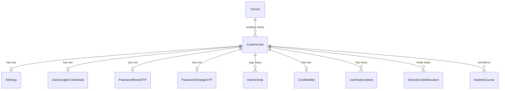
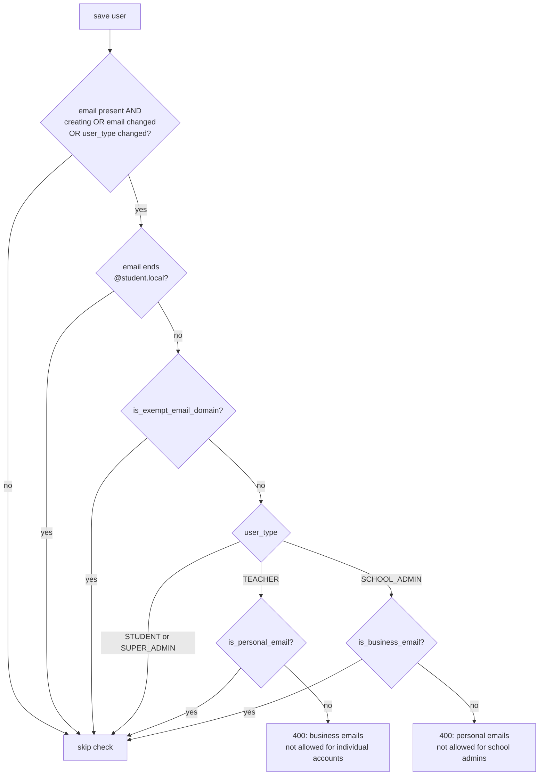
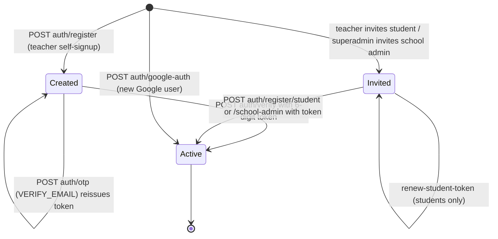
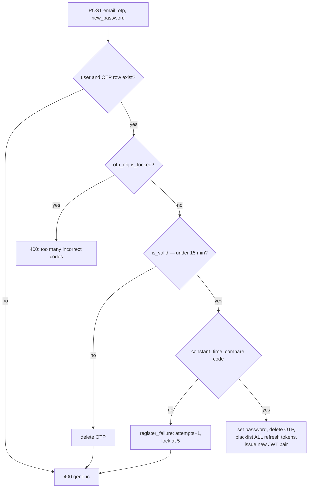
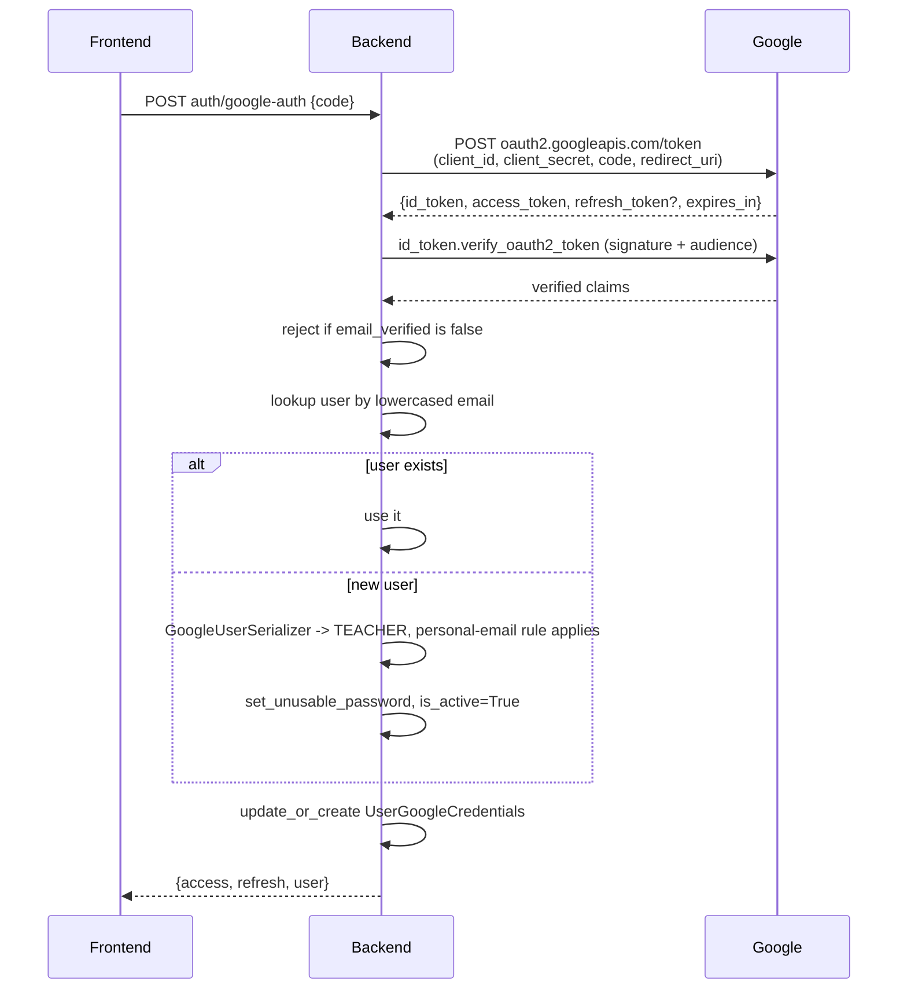
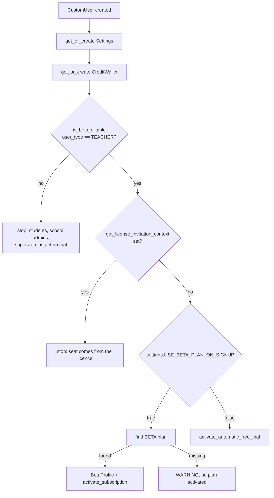

# Users, authentication, and the email-track fork

> Part of the [backend reference](README.md). Related: [security-and-tenancy.md](security-and-tenancy.md), [billing-licenses.md](billing-licenses.md), [classrooms.md](classrooms.md), [project-config.md](project-config.md).

## In plain terms

Everyone who uses Grade A+ — a student, a teacher, a school administrator, or the company's own staff — is one row in one `CustomUser` table, told apart by a `user_type` field. How you get an account depends on which of those you are: teachers sign themselves up, students and school admins are *invited* by someone else and finish registration through a link in an email. The single most important rule in this app lives here: **the email address you sign up with decides which product you get.** A personal address (gmail, outlook, yahoo…) means an individual teacher account that pays for itself; a work address means a school account that a school's licence pays for. There is deliberately no way to merge the two, and no way to move an account from one side to the other.

---

## Entry points

All paths are relative to `/api/v1/`. No trailing slashes.

### Authentication (`AuthViewSet`, `users/urls.py:15`)

| Method | Path | Auth | Throttle | Source |
|---|---|---|---|---|
| POST | `auth/verify` | AllowAny | `verify_email` 5/h | [users/views.py:688](../../users/views.py#L688) |
| POST | `auth/otp` | AllowAny | `otp_request` 5/h | [users/views.py:754](../../users/views.py#L754) |
| POST | `auth/reset-password` | AllowAny | `password_reset` 10/h | [users/views.py:839](../../users/views.py#L839) |
| POST | `auth/request-change-password` | IsAuthenticated | default | [users/views.py:913](../../users/views.py#L913) |
| POST | `auth/change-password` | IsAuthenticated | default | [users/views.py:964](../../users/views.py#L964) |
| POST | `auth/logout` | IsAuthenticated | default | [users/views.py:1078](../../users/views.py#L1078) |
| POST | `auth/register` | AllowAny | `register` 10/h | [users/views.py:1131](../../users/views.py#L1131) |
| POST | `auth/register/student` | AllowAny | `register` 10/h | [users/views.py:1179](../../users/views.py#L1179) |
| POST | `auth/register/school-admin` | AllowAny | `register` 10/h | [users/views.py:1308](../../users/views.py#L1308) |
| POST | `auth/google-auth` | AllowAny | `google_auth` 20/h | [users/views.py:1432](../../users/views.py#L1432) |
| POST | `auth/login` | none | `login` 10/min | [users/views.py:1587](../../users/views.py#L1587) |
| POST | `auth/refresh` | refresh token | default | [users/views.py:1629](../../users/views.py#L1629) |

`AuthViewSet.http_method_names = ["post", "options"]` ([users/views.py:666](../../users/views.py#L666)) — every action is POST-only.

### Users, settings, tasks, beta lists

| Method | Path | Auth | Source |
|---|---|---|---|
| GET | `users` | IsAuthenticated **+ IsSuperAdmin** | [users/views.py:280-281](../../users/views.py#L280-L281) |
| POST | `users` | IsAuthenticated + IsSuperAdmin (double-checked in `create`) | [users/views.py:349-358](../../users/views.py#L349-L358) |
| GET | `users/<uuid>` | IsAuthenticated (scoped queryset) | [users/views.py:287](../../users/views.py#L287) |
| PATCH | `users/<uuid>` | IsAuthenticated + **self-only unless super admin** | [users/views.py:329-346](../../users/views.py#L329-L346) |
| DELETE | `users/<uuid>` | IsAuthenticated + IsSuperAdmin | [users/views.py:280-281](../../users/views.py#L280-L281) |
| GET | `users/me` | IsAuthenticated | [users/views.py:384](../../users/views.py#L384) |
| GET | `users/settings` | IsAuthenticated + IsSuperAdmin | [users/views.py:554-555](../../users/views.py#L554-L555) |
| GET | `users/settings/my_settings` | IsAuthenticated | [users/views.py:612](../../users/views.py#L612) |
| GET/PATCH | `users/settings/<uuid>` | IsAuthenticated (scoped) | [users/views.py:561-573](../../users/views.py#L561-L573) |
| GET | `tasks/status/<task_id>` | IsAuthenticated | [users/views.py:1731](../../users/views.py#L1731) |
| POST | `tasks/cancel/<task_id>` | IsAuthenticated | [users/views.py:1826](../../users/views.py#L1826) |
| POST | `tasks/cancel-session/<session_id>` | IsAuthenticated, teacher-owned session | [users/views.py:1881](../../users/views.py#L1881) |
| GET | `tasks/session-results/<session_id>` | IsAuthenticated, teacher-owned session | [users/views.py:2025](../../users/views.py#L2025) |
| CRUD | `whitelist` | IsAuthenticated + IsSuperAdmin | [users/views.py:2201-2215](../../users/views.py#L2201-L2215) |
| CRUD | `waitlist` | IsAuthenticated + IsSuperAdmin | [users/views.py:2252-2266](../../users/views.py#L2252-L2266) |
| POST | `waitlist/<uuid>/transfer` | IsAuthenticated + IsSuperAdmin | [users/views.py:2280](../../users/views.py#L2280) |

### Other entry points

| Kind | Name | Source |
|---|---|---|
| Celery task | `users.tasks.sync_user_to_mailerlite` (`max_retries=3`, `default_retry_delay=60`) | [users/tasks.py:14-25](../../users/tasks.py#L14-L25) |
| Celery task | `users.tasks.sample_periodic_task` — **dead code**, not scheduled, not called | [users/tasks.py:8](../../users/tasks.py#L8) |
| Signal | `post_save`/`post_delete` on `CustomUser`, `Settings` → wildcard cache clear | [users/signals.py:18-30](../../users/signals.py#L18-L30) |
| Signal | `post_save` on `CustomUser` (created only) → Settings + CreditWallet + trial | [users/signals.py:33-177](../../users/signals.py#L33-L177) |
| Management command | `add_whitelist [emails…] [--file PATH]` | [users/management/commands/add_whitelist.py](../../users/management/commands/add_whitelist.py) |
| Middleware | `users.middleware.UserActivityMiddleware` | see [project-config.md](project-config.md#useractivitymiddleware) |

---

## Data model

### `CustomUser` ([users/models.py:91-273](../../users/models.py#L91-L273))

Extends `AbstractUser`. `USERNAME_FIELD = "email"`, `username = None` (the column is removed). `REQUIRED_FIELDS = ["first_name", "last_name"]`.

| Field | Type | Null | Default | Notes |
|---|---|---|---|---|
| `id` | UUID | no | `uuid4` | PK, not editable — UUIDs, so ids are not enumerable |
| `school` | FK → `classrooms.School` | **yes** | — | `on_delete=SET_NULL`, `related_name="users"`. Students carry `school=NULL` (they attach to a *course*, not a school) — see the queryset note below |
| `email` | EmailField | no | — | **unique**. Always stored lowercase/stripped ([users/serializers.py:137](../../users/serializers.py#L137)) |
| `first_name`, `last_name` | inherited CharField | — | `""` | |
| `middle_name` | CharField(255) | yes | `""` | |
| `user_type` | CharField(20) | no | `TEACHER` | choices below |
| `is_active` | Boolean | no | **`False`** | overridden from Django's default `True`. A new account is inactive until email verification |
| `bio` | TextField | yes | — | |
| `profile_image` | ImageField | yes | — | `upload_to=get_user_name` → `profile_pics/<id>/<email-local>_<date>_<ext>`. Note the filename has **no dot before the extension** ([users/models.py:80](../../users/models.py#L80)) |
| `profile_image_url` | CharField(255) | yes | — | read-only via API; written from the Google `picture` claim |
| `activation_token` | CharField(64) | yes | — | **db_index**. A 6-digit numeric OTP for the email flow; a high-entropy token for school-admin invites ([classrooms/serializers.py](../../classrooms/serializers.py)) |
| `activation_expires` | DateTime | yes | — | |
| `email_verified_at` | DateTime | yes | — | set once, at verification |
| `registration_method` | CharField(20) | no | `EMAIL` | choices below |

`Meta.ordering = ("first_name", "last_name", "email")` — every unordered `CustomUser` query pays this sort.

**`UserTypes`** ([users/models.py:70-74](../../users/models.py#L70-L74)) — complete enumeration:

| Value | Label | Meaning |
|---|---|---|
| `STUDENT` | Student | Enrolled in courses; `school` is always NULL |
| `TEACHER` | Teacher | The default. Either individual-track (personal email, own subscription) or licence-track (business email, seat on a school licence) |
| `SCHOOL_ADMIN` | School Admin | Administers one school; business email required |
| `SUPER_ADMIN` | Super Admin | Platform staff. **Must also have `is_superuser=True`** — every permission check requires both ([classrooms/permissions.py:74-80](../../classrooms/permissions.py#L74-L80)) |

**`RegistrationMethod`** ([users/models.py:83-87](../../users/models.py#L83-L87)): `EMAIL`, `GOOGLE`, `FACEBOOK`, `TWITTER`. Only `EMAIL` and `GOOGLE` have code paths; `FACEBOOK`/`TWITTER` are unused enum values.

**Helper methods worth knowing:**

- `get_full_name()` joins first/middle/last, skipping blanks ([users/models.py:145-150](../../users/models.py#L145-L150)).
- `is_beta_eligible()` returns `user_type == TEACHER` — this is what gates automatic trial activation ([users/models.py:174-176](../../users/models.py#L174-L176)).
- `get_active_subscription()` resolves **licence first**: for a teacher, an active `SchoolCreditAllocation` with an active `LicenseSubscription` wins; otherwise the personal `UserSubscription` ([users/models.py:178-206](../../users/models.py#L178-L206)). This ordering is why a teacher holding both is billed for credits they can never spend — see the audit command below.
- `subscription_type` → `"LICENSE"` | `"INDIVIDUAL"` | `None` ([users/models.py:208-224](../../users/models.py#L208-L224)).
- `get_teacher_monthly_allocation()` returns **raw credits (display value × 1000)** ([users/models.py:235-260](../../users/models.py#L235-L260)) — see [billing-core.md](billing-core.md) for the credit unit convention.
- `renew_activation_token()` **raises `ValueError` for non-students** ([users/models.py:262-273](../../users/models.py#L262-L273)); teachers must use the OTP endpoint instead.

### `UserGoogleCredentials` ([users/models.py:276-286](../../users/models.py#L276-L286))

| Field | Type | Null | Notes |
|---|---|---|---|
| `user` | OneToOne → CustomUser | no | `CASCADE`, `related_name="google_credentials"` |
| `access_token` | `EncryptedCharField(1024)` | no | encrypted at rest via `django-encrypted-model-fields` (`FIELD_ENCRYPTION_KEY`) |
| `refresh_token` | `EncryptedCharField(1024)` | yes | Google only returns one on first consent, so this is written only when present ([users/views.py:1542](../../users/views.py#L1542)) |
| `token_expiry` | DateTime | no | `now + expires_in` |
| `scopes` | TextField | yes | read from the ID token's `scope` claim |

> **UNVERIFIED:** nothing in the backend appears to *read* these credentials — no refresh flow, no Google API call using `access_token`. To confirm, grep for `google_credentials` outside `users/`. If nothing consumes them, this table stores encrypted third-party tokens with no current purpose.

### `Settings` ([users/models.py:295-320](../../users/models.py#L295-L320))

One row per user, created by signal. `id` UUID PK, `user` OneToOne (CASCADE).

| Field | Type | Default | Consumed by |
|---|---|---|---|
| `theme` | CharField(20), choices `LIGHT`/`DARK`/`SYSTEM` | `SYSTEM` | frontend only |
| `notify_student_submission` | Boolean, `null=True` | `False` | [students-and-submissions.md](students-and-submissions.md) |
| `notify_weekly_summary` | Boolean, `null=True` | `False` | `dashboard.tasks.send_weekly_*` |
| `notify_assignment_due_reminder` | Boolean, `null=True` | `False` | — |
| `notify_grading_complete` | Boolean, `null=True` | `False` | [grading flow](students-and-submissions.md) |
| `notify_assignment_edited` | Boolean, `null=True` | `False` | [assignments.md](assignments.md) |
| `notify_new_assignment_posted` | Boolean, `null=True` | `False` | [assignments.md](assignments.md) |
| `notify_teacher_activity_alerts` | Boolean, `null=True` | `False` | `dashboard.tasks.send_teacher_inactivity_alerts` |
| `notify_at_risk_student_alerts` | Boolean, `null=True` | `False` | `dashboard.tasks.send_at_risk_student_alerts` |

Every notification flag is **`null=True` on a BooleanField**, so it is genuinely three-valued (`True`/`False`/`NULL`) even though nothing sets `NULL` deliberately. Queries filter on `=True` ([users/services.py:151](../../users/services.py#L151)), so `NULL` behaves as opt-out.

`notify_assignment_edited` is **absent from `SettingsSerializer.Meta.fields`** ([users/serializers.py:30-41](../../users/serializers.py#L30-L41)) — it exists on the model and is read by the assignment-edit notification path, but **cannot be read or changed through the API**. That looks like an oversight rather than a decision.

### OTP models

| Model | Validity | Attempt limit | Lockout | Source |
|---|---|---|---|---|
| `PasswordResetOTP` | 15 minutes | `MAX_ATTEMPTS = 5` | `LOCKOUT_DURATION = 30 min` | [users/models.py:337-388](../../users/models.py#L337-L388) |
| `PasswordChangeOTP` | 5 minutes | none | none | [users/models.py:391-414](../../users/models.py#L391-L414) |

Both are OneToOne on user, with a unique `(user, code)` constraint and a `db_index`ed, globally-unique `code`. Codes are 6 numeric digits from `OTPManager.generate_otp()` ([users/services.py:86-88](../../users/services.py#L86-L88)) using `django.utils.crypto.get_random_string`.

`generate_code()` **resets `attempts` to 0 and clears `locked_until`** ([users/models.py:373-384](../../users/models.py#L373-L384)). That is the intended recovery route for a user who mistyped — and exactly why `OTPRequestThrottle` must stay on the issuing endpoint, or an attacker just requests a fresh code to wipe the counter.

**`PasswordChangeOTP` is currently unused for verification.** `change_password` generates and emails a code ([users/views.py:913-949](../../users/views.py#L913-L949)) but the OTP check in the change endpoint is **commented out** ([users/views.py:976-985](../../users/views.py#L976-L985)); it verifies `current_password` instead. So `request-change-password` sends a code that is never checked.

### Beta access records

| Model | Fields | Source |
|---|---|---|
| `BetaWhitelist` | `id` UUID PK, `email` unique, `is_active` (default `True`), `mode` (`BETA`/`WAITLIST`, default `BETA`), `created_at` | [users/models.py:431-455](../../users/models.py#L431-L455) |
| `Waitlist` | `id` UUID PK, `email` unique, `created_at`; `transfer_to_whitelist()` creates a `BetaWhitelist(mode=WAITLIST)` and deletes itself | [users/models.py:458-476](../../users/models.py#L458-L476) |

**Neither gates anything.** Signup is open; `validate_email` no longer consults them ([users/serializers.py:124-137](../../users/serializers.py#L124-L137)). They and their superadmin CRUD endpoints are kept as records only.

### `UserActivity` / `ConcurrentUserSnapshot`

`UserActivity` ([users/models.py:323-334](../../users/models.py#L323-L334)): `user` FK (CASCADE), `timestamp` (`auto_now_add`, **db_index**), `ordering = ["-timestamp"]`. One row per authenticated HTTP request — see the volume warning in [project-config.md](project-config.md#useractivitymiddleware).

`ConcurrentUserSnapshot` ([users/models.py:417-423](../../users/models.py#L417-L423)): `timestamp` (default `now`), `concurrent_users` (PositiveInteger). Written once a minute by `dashboard.tasks.record_concurrent_users`; read by `get_peak_concurrent_users` / `get_peak_time_of_day` ([users/services.py:169-195](../../users/services.py#L169-L195)).

### ER diagram


*Caption: `School` is FK-nullable — students and individual-track teachers have none.*

---

## The personal-vs-business email fork

This is the business model expressed as code. Read [users/utils.py:7-25](../../users/utils.py#L7-L25) first — it states the intent.

### Classification

Three pure functions in [users/utils.py](../../users/utils.py), all built on `email_domain()`:

`email_domain(email)` ([users/utils.py:294-336](../../users/utils.py#L294-L336)) normalises to a comparable domain, or returns `""`. It rejects: non-strings, anything without exactly one `@`, an empty local part, a domain with no dot / whitespace / `..` / a leading `.` or `-` / a trailing `-`. It strips a trailing dot (`gmail.com.` is a legal FQDN that would otherwise dodge a set lookup) and converts to punycode so an IDN school domain classifies the same wherever it is typed. **Everything downstream treats `""` as failing.** The docstring records the bugs this replaced: `email.split("@")[-1].lower()` returned the whole string for an address with no `@`, so typing `gmail.com` into the wrong box classified as a *business* domain.

`_matches_domain_set(domain, domains)` ([users/utils.py:339-354](../../users/utils.py#L339-L354)) walks the label suffixes, so `mail.gmail.com` and `students.yahoo.co.uk` match the parent entry rather than sliding through as unlisted business domains.

| Function | Returns True when | Source |
|---|---|---|
| `is_disposable_email` | domain (or a parent) is in the built-in throwaway set ∪ `DISPOSABLE_EMAIL_DOMAINS` | [users/utils.py:367-373](../../users/utils.py#L367-L373) |
| `is_personal_email` | domain parses, is **not** disposable, and is in `PERSONAL_EMAIL_DOMAINS` ∪ `DISALLOWED_EMAIL_DOMAINS` | [users/utils.py:376-391](../../users/utils.py#L376-L391) |
| `is_business_email` | if `ALLOWED_BUSINESS_EMAIL_DOMAINS` is set → domain must be in it. Otherwise: domain parses, is not disposable, is not personal | [users/utils.py:394-417](../../users/utils.py#L394-L417) |
| `is_exempt_email_domain` | domain is in `EXEMPT_EMAIL_DOMAINS` (default: empty) — **bypasses both rules** | [users/utils.py:420-432](../../users/utils.py#L420-L432) |

The built-in `PERSONAL_EMAIL_DOMAINS` set holds ~170 consumer providers ([users/utils.py:26-220](../../users/utils.py#L26-L220)), organised by vendor and region. `DISPOSABLE_EMAIL_DOMAINS` holds ~35 throwaway providers ([users/utils.py:225-264](../../users/utils.py#L225-L264)).

**Both helpers fail closed.** `is_personal_email` is a *positive* test — an unrecognised domain is not personal, so it is refused on the individual track rather than waved through. A malformed or disposable address is neither personal nor business and is refused on **both** tracks.

**The historical bug this replaced:** "business" used to mean "not one of 22 named consumer providers". That made the rule one character wide — `gmail.com` was blocked but `googlemail.com`, `yahoo.co.uk`, `proton.me`, `gmx.net` and every throwaway provider counted as business and could mint school-admin accounts ([users/utils.py:17-25](../../users/utils.py#L17-L25), [billing/management/commands/audit_email_track_separation.py:11-15](../../billing/management/commands/audit_email_track_separation.py#L11-L15)).

**Where the domain lists live.** The canonical lists are in `users/utils.py`. `settings.py` only *extends* them ([settings.py:1209-1236](../../AutoGrader/settings.py#L1209-L1236)) — they used to be duplicated in settings, which meant the settings copy silently won and the module copy was dead code waiting to drift. `EXEMPT_EMAIL_DOMAINS` defaults to empty because it opens **both** gates; `yopmail.com` used to sit there permanently, which meant anyone could mint a school admin with a public throwaway address.

### Where the fork is enforced

Four places. This is the complete list (verified by grep for the helper names):

| # | Enforcement point | Rule | Source |
|---|---|---|---|
| 1 | `CustomUserSerializer.validate` — TEACHER branch | teacher email **must be personal** | [users/serializers.py:265-278](../../users/serializers.py#L265-L278) |
| 2 | `CustomUserSerializer.validate` — SCHOOL_ADMIN branch | school-admin email **must be business** | [users/serializers.py:279-289](../../users/serializers.py#L279-L289) |
| 3 | `CustomUserSerializer.validate` — school-attachment guard | attaching a `school` to a TEACHER requires a **business** email | [users/serializers.py:301-320](../../users/serializers.py#L301-L320) |
| 4 | `SchoolWithAdminSerializer.validate_admin_email` | superadmin-created school admin **must be business** | [classrooms/serializers.py:645-660](../../classrooms/serializers.py#L645-L660) |
| 5 | `LicenseSubscriptionService._get_or_invite_teacher` | a licence seat requires a **business** email | [billing/license_service.py:1068-1077](../../billing/license_service.py#L1068-L1077) |

> Points 1–3 all sit inside one `validate()`. If you are changing this rule, that method is the place — but points 4 and 5 are separate implementations of "must be business" and will not pick up a change made only in `CustomUserSerializer`.

### When the rule fires

The check runs only under this condition ([users/serializers.py:259-264](../../users/serializers.py#L259-L264)):

```
email AND (is_creating OR email_changed OR user_type_changed)
      AND NOT is_system_generated
      AND NOT is_exempt_email_domain(email)
```

| Trigger | Why it is in the list |
|---|---|
| `is_creating` | the obvious case |
| `email_changed` | otherwise a user edits their way across the line |
| `user_type_changed` | **added later.** The rule previously only fired on creation or email change, so PATCHing an existing `jane@gmail.com` teacher to `SCHOOL_ADMIN` sailed through and left a school admin on a personal address. The code notes that "only a super admin can make that request" is not the same as "it is allowed" ([users/serializers.py:238-250](../../users/serializers.py#L238-L250)) |
| `NOT is_system_generated` | `@student.local` addresses are placeholders, not mailboxes — neither personal nor business, so a `user_type` change must not drag them into the check ([users/serializers.py:252-255](../../users/serializers.py#L252-L255)) |


*Caption: the fork. `STUDENT` and `SUPER_ADMIN` are deliberately unchecked.*

Note what the diagram makes visible: **`STUDENT` and `SUPER_ADMIN` have no email-domain rule at all.** Students are invited with whatever address their teacher supplies (often a generated `@student.local` placeholder), and platform staff are not tenant members.

### The school-attachment guard (rule 3)

Rules 1–2 police the email against the `user_type`. `school` was originally unchecked, so a super admin (the only actor for whom `school` is writable) could attach a school to a personal-email teacher, making an individual-track account a member of a school tenant ([users/serializers.py:291-300](../../users/serializers.py#L291-L300)). It does not by itself hand over a licence seat — enrolment re-checks the email at point 5 — but it satisfies the school-membership half of that check and leaves the account halfway across a line that is meant to be absolute.

### Platform staff are not tenant members

A separate invariant in the same `validate()` ([users/serializers.py:156-221](../../users/serializers.py#L156-L221)):

| Condition | Outcome |
|---|---|
| target is superuser/`SUPER_ADMIN` **and** `school` is being set | 400 on `school` |
| target is superuser/`SUPER_ADMIN` **and** requested type ∈ {`SCHOOL_ADMIN`,`TEACHER`,`STUDENT`} | 400 on `user_type` |
| requested type is `SUPER_ADMIN` **and** the effective school is not None | 400 on `user_type` — clear `"school": null` in the same request |

**Why:** without it, a superadmin could become `user_type=SCHOOL_ADMIN` with a school attached, at which point they appear as that school's admin on every school screen (all of which select on `user_type=SCHOOL_ADMIN`) **while still holding `is_superuser`** — and simultaneously lose their own access, because `IsSuperAdmin` checks `user_type`. The account ends up able to administer neither the platform nor, legitimately, the school. The mirror invariant is enforced on the billing side by `LicenseSubscriptionService.validate_admin_user()`.

### Repairing rows written before the doors closed

`python manage.py audit_email_track_separation [--strict]` ([billing/management/commands/audit_email_track_separation.py](../../billing/management/commands/audit_email_track_separation.py)) is **read-only by design** — the repairs (asking a school admin to move address, refunding an individual subscription a licence already covers) are business decisions, not things to do behind anyone's back ([lines 28-33](../../billing/management/commands/audit_email_track_separation.py#L28-L33)).

Four audits:

| Audit | Finds |
|---|---|
| School admins on a non-business email | `user_type=SCHOOL_ADMIN` failing `is_business_email` and not exempt ([line 98](../../billing/management/commands/audit_email_track_separation.py#L98)) |
| Licence seats on a non-business email | active non-admin `SchoolCreditAllocation` under an active licence, failing the same test ([line 131](../../billing/management/commands/audit_email_track_separation.py#L131)) |
| Individual teachers on a non-personal email | `TEACHER`, `school IS NULL`, no active allocation, failing `is_personal_email` ([line 167](../../billing/management/commands/audit_email_track_separation.py#L167)) |
| Accounts billed on both tracks | teachers holding a licence seat **and** an individual subscription ([line 208](../../billing/management/commands/audit_email_track_separation.py#L208)) |

`--strict` exits 1, for CI or cron. `_describe()` explains *why* an address fails in words a human can act on ([line 84](../../billing/management/commands/audit_email_track_separation.py#L84)).

---

## Registration and activation flows

There are three entirely separate registration paths, plus Google.


*Caption: `is_active` starts `False` on every path except Google, which activates immediately because Google has already verified the mailbox.*

**Legal transitions.** `is_active: False → True` happens in exactly five places: `verify` ([users/views.py:707](../../users/views.py#L707)), `register_student` ([users/views.py:1247](../../users/views.py#L1247)), `register_school_admin` ([users/views.py:1344](../../users/views.py#L1344)), Google account creation ([users/views.py:1513](../../users/views.py#L1513)), and `create_superuser` ([users/models.py:60](../../users/models.py#L60)). **`is_active: True → False` has no API path** — `is_active` is `read_only` on the serializer ([users/serializers.py:118](../../users/serializers.py#L118)). Deactivating an account requires the Django admin or a shell.

### Teacher self-signup

`POST auth/register` → `CustomUserSerializer(data=request.data)` with **no context** ([users/views.py:1145](../../users/views.py#L1145)). Because `PRIVILEGED_FIELDS` are read-only unless the serializer was built with a super-admin request in context ([users/serializers.py:73-91](../../users/serializers.py#L73-L91)), a client-supplied `user_type` is silently dropped and the model default `TEACHER` applies.

The comment records a real bug: an earlier version stripped `user_type` by mutating `request.data`, which raises `AttributeError` on the immutable `QueryDict` produced by a form-encoded or multipart body — so **every non-JSON registration 500'd**, whether or not it mentioned `user_type` ([users/views.py:1137-1144](../../users/views.py#L1137-L1144)).

`create()` then sends the activation email inside a `transaction.atomic()`, catching and logging any email failure so a mail outage does not fail the registration ([users/serializers.py:330-345](../../users/serializers.py#L330-L345)).

`send_user_activation_email` ([users/services.py:20-78](../../users/services.py#L20-L78)) sets a fresh 6-digit token with a **15-minute** expiry, builds `https://<domain>/verify-email?email=…&token=…`, and picks the domain by user type: `STUDENT_FRONTEND_DOMAIN` for students, `FRONTEND_DOMAIN` otherwise. It uses MailerSend template `ynrw7gy0ye2l2k8e` with merge data. The whole body is wrapped in try/except returning `None` — a failure to queue never breaks signup.

> **Contradiction to flag:** the activation email says "This link expires in 15 minutes" and `send_user_activation_email` sets 15 minutes ([users/services.py:24](../../users/services.py#L24)), but `ACTIVATION_TOKEN_VALIDITY` — used by the *student invite/renewal* path — is **24 hours** ([users/models.py:34](../../users/models.py#L34)). Two different validity windows for the same field, chosen by which code path wrote it. The model comment additionally warns that the "expires in 7 days"/"24 hours" wording in the invite emails (`classrooms/views.py`, `billing/license_service.py`) is a literal string, not derived from the constant ([users/models.py:31-33](../../users/models.py#L31-L33)).

### `auth/verify`

Looks up `(email, activation_token)`, rejects an expired `activation_expires`, then sets `email_verified_at`, clears the token/expiry, sets `is_active=True`, queues a MailerLite sync, and **returns a JWT pair** — verification logs you in ([users/views.py:688-726](../../users/views.py#L688-L726)).

Two robustness notes: `request.data.get("email").strip()` will `AttributeError` → 500 if `email` is absent, and the `if not email or not token` check on the next line is therefore unreachable for a missing key ([users/views.py:689-693](../../users/views.py#L689-L693)). And the token lookup is a plain queryset filter, not a constant-time compare — unlike the reset-password path.

### `auth/otp`

Two types, validated by `OTPSerializer` ([users/serializers.py:411-418](../../users/serializers.py#L411-L418)):

| `otp_type` | Precondition | Action |
|---|---|---|
| `VERIFY_EMAIL` | rejects if already verified **and** active | re-sends the activation email |
| `RESET_PASSWORD` | rejects if `email_verified_at` is unset | `get_or_create` a `PasswordResetOTP`, `generate_code()`, email it via `safe_delay` |

An unknown email returns **202 with a neutral message** ([users/views.py:768-774](../../users/views.py#L768-L774)) so the endpoint does not confirm account existence. Note the enumeration is only *partly* closed: a **known** email in the wrong state raises `ParseError` with a specific message ("Email already verified", "Email not verified"), which distinguishes it from an unknown one.

### `auth/reset-password`


*Caption: every non-lockout failure returns the identical message.*

Three deliberate choices ([users/views.py:839-896](../../users/views.py#L839-L896)):

1. The OTP is looked up **by user**, not by `(user, code)`. The old `(user, code)` lookup made every wrong guess indistinguishable from "no OTP exists", which is why the attempts budget could not be enforced at all ([users/views.py:847-851](../../users/views.py#L847-L851)).
2. `constant_time_compare` so response latency does not leak how much of the code was right ([users/views.py:867-870](../../users/views.py#L867-L870)).
3. On success, **every** outstanding refresh token is blacklisted ([users/views.py:880-882](../../users/views.py#L880-L882)) — a password reset logs out every other device. `change_password` does the same ([users/views.py:990-992](../../users/views.py#L990-L992)).

### Student registration

`POST auth/register/student` ([users/views.py:1179-1277](../../users/views.py#L1179-L1277)), all inside one `transaction.atomic()`:

1. Find `CustomUser` by `activation_token` with `is_active=False`.
2. If `activation_expires < now`, return **200** (not an error) with a `renewal_url` and the expired token, so the frontend can offer a re-send ([users/views.py:1197-1209](../../users/views.py#L1197-L1209)).
3. Collect the student's `PENDING` enrolments and check each course for a **name conflict** — another student with the same first/middle/last already enrolled ([users/views.py:1220-1240](../../users/views.py#L1220-L1240)). Any conflict aborts the whole registration listing the affected courses. This exists because a teacher matching a scanned paper to a student relies on the name; two identically-named students in one course make that ambiguous. See [students-and-submissions.md](students-and-submissions.md).
4. Write names, password, profile image; activate; verify email; clear token.
5. Flip every pending enrolment to `ENROLLED`.

### School-admin registration

`POST auth/register/school-admin` ([users/views.py:1308-1379](../../users/views.py#L1308-L1379)). Same shape, plus:

- The lookup uses `select_for_update()` and requires `user_type=SCHOOL_ADMIN, is_active=False` — the row lock prevents two concurrent submissions of the same invite link from both racing past the `is_active` check ([users/views.py:1321-1332](../../users/views.py#L1321-L1332)).
- An expired invite says "contact your superadmin", with no self-service renewal.
- Returns a JWT pair — the admin is logged in immediately.

The invite itself is created by `SchoolWithAdminSerializer` ([classrooms/serializers.py:624+](../../classrooms/serializers.py#L624)), which creates the account with **no usable password** and a **high-entropy token** (not the 6-digit OTP), so no secret ever travels through an email template ([classrooms/serializers.py:687-701](../../classrooms/serializers.py#L687-L701)).

---

## Google OAuth


*Caption: the whole exchange is synchronous inside one request. No timeout is set on the token call.*

Details ([users/views.py:1432-1560](../../users/views.py#L1432-L1560)):

- The **authorization-code** flow, not the ID-token/credential flow, despite the OpenAPI description saying "Verifies a Google ID token (credential)" ([users/views.py:1385](../../users/views.py#L1385)) — the request body is `code`. The docstring is stale relative to the code.
- `redirect_uri` comes from `GOOGLE_REDIRECT_URI`, a single server-side setting, so only one frontend redirect URI can work at a time.
- `email_verified` false → `ParseError` ([users/views.py:1478-1479](../../users/views.py#L1478-L1479)).
- The email is lowercased before lookup. Without it, a mixed-case Google address misses the lookup, falls into the create branch, and dies on the unique constraint ([users/views.py:1482-1486](../../users/views.py#L1482-L1486)).
- New Google users become **TEACHER** (the model default), so **the personal-email rule applies**. A Google account on a business domain is rejected with a rewritten message telling them their school account is created by their school admin, not by this button ([users/views.py:1519-1533](../../users/views.py#L1519-L1533)).
- `set_unusable_password()` — a Google account has no password to guess.
- `refresh_token` is only written when Google returns one ([users/views.py:1542](../../users/views.py#L1542)); Google omits it on repeat consent.

**Gaps worth knowing:**

- `http_requests.post(token_url, data=payload)` has **no `timeout=`** ([users/views.py:1452](../../users/views.py#L1452)). A hung Google endpoint pins a request worker indefinitely. Every other outbound HTTP call in this codebase sets one (e.g. MailerLite's 10s at [users/mailerlite_service.py:95](../../users/mailerlite_service.py#L95)).
- The endpoint's documented behaviour says an existing user "is authenticated if their registration method is `GOOGLE`" ([users/views.py:1389](../../users/views.py#L1389)), but **no such check exists in the code** ([users/views.py:1494-1496](../../users/views.py#L1494-L1496)). An account registered by email is signed in by Google without objection. Since Google has verified the mailbox this is defensible as account linking, but the documented and actual behaviour differ.
- The `except ValueError` at the end ([users/views.py:1559-1560](../../users/views.py#L1559-L1560)) catches token-verification failures **and** any other `ValueError` raised anywhere in the 120-line block, reporting all of them as "Invalid Google token signature".

---

## User visibility and edit rules

`CustomUserViewSet.get_queryset()` ([users/views.py:287-327](../../users/views.py#L287-L327)) is the tenant boundary for user records.

| Role | Can see |
|---|---|
| `SUPER_ADMIN` **and** `is_superuser` | everyone |
| `SCHOOL_ADMIN` **with** `school_id` | self, everyone in their school, and every student enrolled in a course whose teacher is in their school |
| `TEACHER` | self, plus every student enrolled in one of their courses |
| anyone else (incl. `SCHOOL_ADMIN` with no school) | self only |
| unauthenticated | none |

Two design notes recorded in the docstring:

- Without this, the viewset exposed `CustomUser.objects.all()` behind a bare `IsAuthenticated` — any logged-in user could read, edit, or delete any other by guessing a UUID.
- **It must never raise.** `UserCacheMixin.get_cache_key` calls `get_queryset()` for the model name *before* permissions run, so an exception here surfaces as a 500 instead of a 401/403.
- The super-admin test requires **both** `is_superuser` and `user_type == SUPER_ADMIN`, mirroring `IsSuperAdmin`; checking only one would let the two disagree.

**Seeing is not editing.** `partial_update` re-checks and raises `PermissionDenied` unless the target is yourself or you are a super admin ([users/views.py:329-346](../../users/views.py#L329-L346)) — the queryset deliberately lets teachers read their students, and without this that read access would grant write access.

`PRIVILEGED_FIELDS = ("user_type", "school")` are forced read-only in `__init__` unless the serializer was constructed with an authenticated super admin in context ([users/serializers.py:71-91](../../users/serializers.py#L71-L91)). Both directions are set explicitly rather than relying on `Meta.read_only_fields`, because **DRF ignores `read_only_fields` for fields declared on the class** and `school` is declared there — listing it in `Meta` alone would leave it writable.

Other serializer rules:

- Students cannot change their own names after registration ([users/serializers.py:231-236](../../users/serializers.py#L231-L236)) — again because name is the matching key for scanned papers.
- `to_representation` returns `email: None` for `@student.local` placeholder addresses ([users/serializers.py:324-328](../../users/serializers.py#L324-L328)), so the frontend does not display a fake mailbox.

`HasCreditBalance` ([users/permissions.py:8-91](../../users/permissions.py#L8-L91)) is the credit gate on AI actions. Super admins pass unconditionally. For a **student**, it checks *the teacher's* wallet, resolved from the URL kwargs in priority order `assignment_id` → `course_id`/`id` → `submission_id`/`pk`. If no teacher can be resolved it falls back to the student's own (near-certainly empty) wallet — meaning **an endpoint whose URL kwargs don't match those names will deny a student**. It raises `ParseError` (HTTP 400) with HTML markup in the message, not 402/403.

---

## Caching

`UserCacheMixin` ([users/mixins.py:11-53](../../users/mixins.py#L11-L53)) caches `list` and `retrieve` per user for `CACHE_TTL` (300s):

- retrieve → `{model}s:user_id__{uid}:instance_id__{pk}`
- list → `{model}s:user_id__{uid}:query__{md5(sorted query params)}`

`users/me` and `settings/my_settings` use their own keys (`user:user_id__{uid}`, `settings:user_id__{uid}:view__my_settings`).

Invalidation is a wildcard sweep on every `CustomUser`/`Settings` save or delete ([users/signals.py:18-30](../../users/signals.py#L18-L30)), clearing nine patterns: `*superadmin*`, `*schooladmin*`, `*teacheradmin*`, `*studentadmin*`, `*user*`, `*school*`, `*course*`, `*studentcourse*`, `*settings*`.

Two observations for anyone debugging cache behaviour:

- These patterns are extremely broad. `*user*` matches every key produced by the mixin for every model whose name contains "user", and `*course*` reaches into the classrooms cache. That is intentional over-invalidation, but it means one user save clears a lot.
- This handler calls `cache.delete_pattern` **directly**, not through `AutoGrader.cache_utils.delete_cache_patterns` — so it does **not** participate in `batched_cache_invalidation`. A bulk operation saving N users triggers 9N keyspace scans. Compare [classrooms.md](classrooms.md), where the enrolment signals do go through the batching helper.

---

## Signals: what happens when a user row is created

`create_default_settings_and_wallet` ([users/signals.py:33-177](../../users/signals.py#L33-L177)) runs on `post_save` with `created=True` only.


*Caption: every branch catches its own exceptions — registration must never fail because billing setup did.*

Each of the four steps is individually wrapped in try/except with a logged error, and the comment is explicit that "registration should succeed even if trial activation fails". The cost of that choice: a user can end up **without a `Settings` row, without a `CreditWallet`, or without a trial**, with only a log line to show for it. Two of those three self-heal — `my_settings` does a `get_or_create` ([users/views.py:621-625](../../users/views.py#L621-L625)) and `UserActivityMiddleware` does a `get_or_create` on the wallet on the next request ([users/middleware.py:31](../../users/middleware.py#L31)). **A missing trial does not self-heal** and needs manual intervention.

`get_license_invitation_context()` ([billing/context.py](../../billing/context.py)) is a contextvar set by the licence-invitation code path, so a teacher created *as part of* a licence enrolment does not also get an individual trial. See [billing-licenses.md](billing-licenses.md).

---

## MailerLite sync

`MailerLiteService.sync_user` ([users/mailerlite_service.py:66-101](../../users/mailerlite_service.py#L66-L101)) upserts the user as a subscriber at `https://connect.mailerlite.com/api/subscribers` with a **10-second timeout**, tagged into a group chosen by `user_type`:

| `user_type` | Group setting |
|---|---|
| `TEACHER` | `MAILERLITE_GROUP_ID_TEACHER` |
| `STUDENT` | `MAILERLITE_GROUP_ID_STUDENT` |
| `SCHOOL_ADMIN` | `MAILERLITE_GROUP_ID_SCHOOL_ADMIN` |
| `SUPER_ADMIN` | none — no group is attached |

Custom fields written: `name`, `last_name`, `subscription_type`, `subscription_tier`, `subscription_active` ([users/mailerlite_service.py:44-64](../../users/mailerlite_service.py#L44-L64)).

Return contract drives retry behaviour:

| Return | Meaning | Task behaviour |
|---|---|---|
| `True` | success | done |
| `False` | request failed | `self.retry()` — up to 3 tries, 60s apart ([users/tasks.py:14-25](../../users/tasks.py#L14-L25)) |
| `None` | no API key configured | **no retry** — retrying a missing config is pointless |

`queue_sync(user)` ([users/mailerlite_service.py:104-123](../../users/mailerlite_service.py#L104-L123)) is a no-op unless `user.is_active`. Several billing paths that mutate subscription state (`activate_subscription`) also run during signup, *before* email verification; syncing then would push an unverified signup into MailerLite. The guard makes it safe to call `queue_sync` unconditionally from those shared paths — activation-time sync picks up the correct state later.

Dispatch always goes through `safe_delay` ([users/mailerlite_service.py:123](../../users/mailerlite_service.py#L123)), so a broker outage silently skips the sync rather than failing activation.

---

## Background-task status API

`TaskViewSet` ([users/views.py:1633-2150](../../users/views.py#L1633-L2150)) is the frontend's polling surface for anything asynchronous. It lives in `users/` but is really part of the grading pipeline — the model, claim, and cancellation semantics are documented in [students-and-submissions.md](students-and-submissions.md).

**Two-tier resolution.** Every read first tries the tracked `ProcessingTask` row via `get_processing_task(task_id, requested_by=request.user)` — which is where **ownership** is enforced — and only falls back to Celery's `AsyncResult` when there is no tracked row ([users/views.py:1735-1767](../../users/views.py#L1735-L1767)).

> The fallback branch does **not** check ownership: `AsyncResult(task_id)` is queried for any authenticated caller who supplies a task id. Task ids are UUIDs and the exposed data is a status string plus `str(task.info)`, so this is low-severity, but it is an asymmetry between the two branches.

Status mapping to the four frontend-facing values ([users/views.py:1773-1794](../../users/views.py#L1773-L1794)):

| DB `BackgroundTaskStatus` | Celery state | API `status` |
|---|---|---|
| `PENDING`, `STARTED` | `PENDING`, `STARTED`, `RETRY` | `processing` |
| `SUCCESS` | `SUCCESS` | `completed` |
| `FAILURE` | `FAILURE` | `failed` |
| `CANCELLED` | `REVOKED` | `cancelled` |
| anything unrecognised | anything else | `processing` (default) |

`meta` is always stringified with `str()` before serialisation ([users/views.py:1750](../../users/views.py#L1750)) — the frontend receives a Python-repr string, not JSON.

**Cancellation** ([users/views.py:1826-1850](../../users/views.py#L1826-L1850)) is honest about races: if the task was already terminal when the request arrived, the response reports that real final status instead of claiming cancellation succeeded.

**Session results** ([users/views.py:2025-2150](../../users/views.py#L2025-L2150)) aggregates a `BatchUploadSession`'s tasks into success/failure/cancelled/pending buckets with a progress fraction and percentage, and carries a legacy branch reading `session.results` for sessions predating tracked tasks (those entries have `context: None` and use the status string `"FAILED"` rather than `"FAILURE"`).

---

## Failure modes & recovery

| Failure | User sees | Recovery |
|---|---|---|
| `auth/verify` posted without `email` or `token` key | **500** (`AttributeError` on `.strip()`) | client must send both keys |
| Activation token expired (teacher) | 400 "Activation link has expired" | `POST auth/otp` with `VERIFY_EMAIL` |
| Activation token expired (student) | **200** with `renewal_url` and `expired_token` | frontend calls the renewal endpoint |
| Activation token expired (school admin) | 400 "contact your superadmin" | superadmin re-invites |
| Activation email fails to send | registration still succeeds; server-side `logger.exception` | user must request a new OTP; no automatic retry of the *queueing* |
| 5 wrong reset codes | 400 "Too many incorrect codes" for 30 min | request a fresh code — which **clears the lockout** |
| Google token exchange hangs | request hangs (no timeout) | none automatic |
| Google sign-in on a business domain | 400 explaining the school-admin invite path | use the invitation link |
| MailerLite down | invisible to the user | 3 retries at 60s; then permanently unsynced |
| Redis/broker down at activation | activation succeeds; MailerLite sync silently dropped | `safe_delay` logs ERROR; sync never happens |
| `Settings` row missing | none — self-heals on `my_settings` | automatic |
| `CreditWallet` missing | none — self-heals in middleware | automatic |
| **Trial not activated** | teacher has no credits and no obvious reason | **manual** — check logs for "Failed to activate automatic trial", then activate by hand |
| Name conflict on student registration | 400 naming the conflicting courses | teacher must resolve the duplicate |
| Two people open the same school-admin invite | one succeeds, the other gets "Invalid or expired activation token" | `select_for_update` makes this deterministic |

**Where data can go inconsistent:** the email-track split. Rows written before the current rules existed can still sit on the wrong side, and closing the doors did not repair them — that is precisely what `audit_email_track_separation` exists to surface. The costliest variant is an account billed on **both** tracks, because access resolves licence-first, so the individual subscription bills every month for credits the user can never spend.

---

## Configuration

| Var | Default | Effect |
|---|---|---|
| `ALLOWED_BUSINESS_EMAIL_DOMAINS` | `[]` | non-empty turns business classification into a **strict allowlist** — only these domains and their subdomains count as business |
| `DISALLOWED_EMAIL_DOMAINS` | `[]` | extra consumer domains treated as personal (individual-track only) |
| `DISPOSABLE_EMAIL_DOMAINS` | `[]` | extra throwaway domains, refused on **both** tracks |
| `EXEMPT_EMAIL_DOMAINS` | `[]` | domains that bypass the rule entirely, **both** directions. QA lever; must stay empty in production |
| `MAILERLITE_API_KEY` | `""` | unset → sync is a permanent no-op (returns `None`, no retries) |
| `MAILERLITE_GROUP_ID_TEACHER` / `_STUDENT` / `_SCHOOL_ADMIN` | `""` | unset → subscriber created with no group |
| `GOOGLE_OAUTH_CLIENT_ID` / `_SECRET` / `GOOGLE_REDIRECT_URI` | **required** | Google OAuth; the app will not boot without them |
| `FIELD_ENCRYPTION_KEY` | `""` | encrypts `UserGoogleCredentials` tokens at rest |
| `FRONTEND_DOMAIN` / `STUDENT_FRONTEND_DOMAIN` | required / falls back | which app the activation link points at |
| `USE_BETA_PLAN_ON_SIGNUP` | `False` | `True` → new teachers get the `BETA` plan instead of the automatic free trial |
| `CACHE_TTL` | `300` | `UserCacheMixin` and the `me`/`my_settings` caches |

Throttle rates (`login`, `verify_email`, `otp_request`, `password_reset`, `register`, `google_auth`) are settings keys, not env vars — see [project-config.md](project-config.md#throttling).

Non-configurable constants that behave like config:

| Constant | Value | Source |
|---|---|---|
| `ACTIVATION_TOKEN_VALIDITY` | 24 hours | [users/models.py:34](../../users/models.py#L34) |
| activation email token expiry | **15 minutes** | [users/services.py:24](../../users/services.py#L24) |
| `PasswordResetOTP` validity | 15 minutes | [users/models.py:361](../../users/models.py#L361) |
| `PasswordResetOTP.MAX_ATTEMPTS` | 5 | [users/models.py:342](../../users/models.py#L342) |
| `PasswordResetOTP.LOCKOUT_DURATION` | 30 minutes | [users/models.py:343](../../users/models.py#L343) |
| `PasswordChangeOTP` validity | 5 minutes | [users/models.py:407](../../users/models.py#L407) |
| OTP length | 6 numeric digits | [users/services.py:82](../../users/services.py#L82) |
| `ACTIVE_WINDOW_SECONDS` | 300 | [users/middleware.py:9](../../users/middleware.py#L9) |
| `REQUEST_TIMEOUT_SECONDS` (MailerLite) | 10 | [users/mailerlite_service.py:26](../../users/mailerlite_service.py#L26) |
