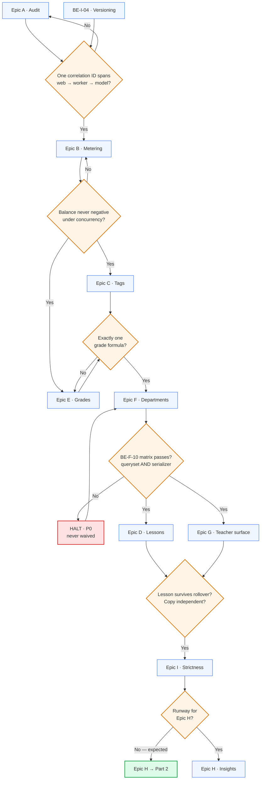
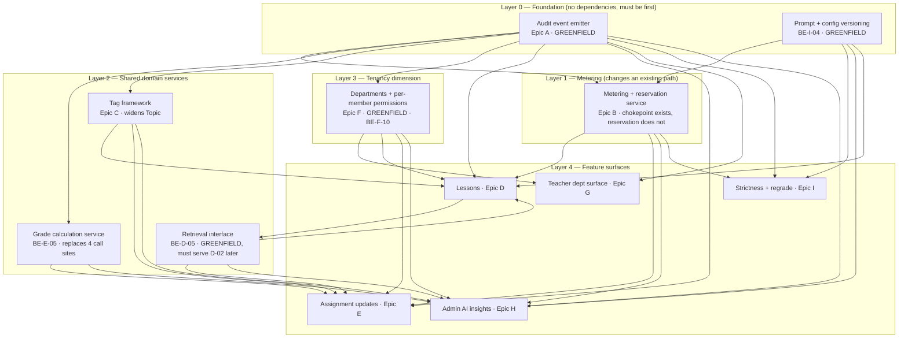
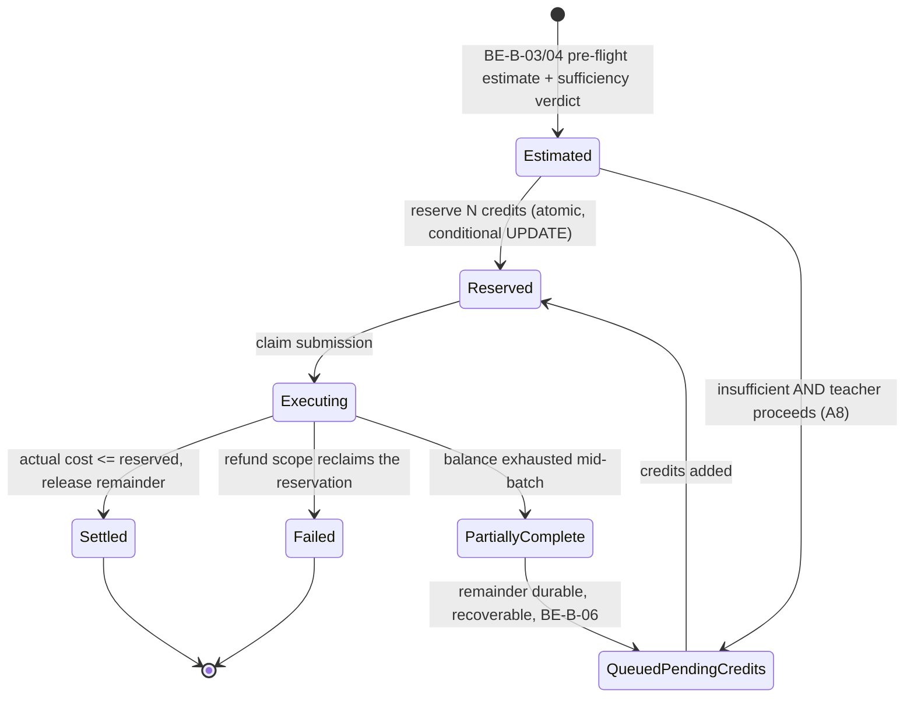
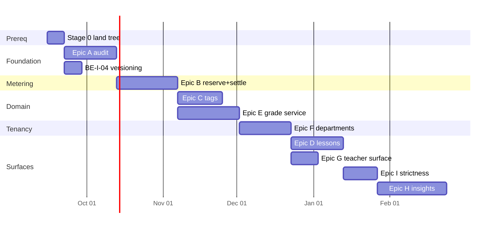

# 03 — Phase 2 Part 1: Backend Architecture

---

## Part I — Execution Pathway

###

| Stage | Contains | Why here |
|---|---|---|
| **1** | **Epic A** (audit/observability) + **BE-I-04** (prompt & config versioning) | Both have no dependencies, and every later epic requires it |
| **2** | **Epic B** (metering, reservation, out-of-credits) | Changes the job-submission path that every AI-consuming epic rides on |
| **3** | **Epic C** (tags) ‖ **Epic E** (categories, weights, grade service) | Independent of each other; both block analytics |
| **4** | **Epic F** (Departments, Shared Library) | Introduces the fourth tenancy dimension. Blocks G entirely |
| **5** | **Epic D** (Lessons) ‖ **Epic G** (teacher department surface) | D needs C's tag framework; G needs F |
| **6** | **Epic I** remainder (strictness scale, regrade) | Needs BE-I-04 from stage 1 and Epic E's feedback pair |
| **7** | **Epic H** (admin AI insights) | Depends on C, D, E, F and B simultaneously. Structurally last |
| | | **Total** |

### The execution flow




### The three things that decide this order

1. **Epic A and BE-I-04 are greenfield.** Confirmed: there is **no audit or
   action-log model anywhere in the codebase**, and **no `prompt_version`,
   `config_version` or `strictness` field in any production module**. That is
   good news for sequencing — no migration risk, no legacy rows — and it is
   exactly why they go first. Every epic in stages 2–7 emits audit events and
   stamps prompt versions.

2. **Epic B changes a path, it does not add one.** The single billing
   chokepoint required by BE-B-01 **already exists and already holds**. What
   does not exist is reservation. Today's code is *check-then-execute*, which
   is precisely the issue BE-B-07 forbids. Changing it moves the submission
   path for every AI feature, so it must move before the features are built on
   it.

3. **Epic H is the confluence.** It consumes tags (C), lessons (D), the grade
   service (E), department scope (F) and metering (B). It cannot start early
   regardless of headcount, and it is also the highest-compliance-risk epic in
   the document. It is last on dependency grounds, not on preference.


---

## Part II — What actually exists (the evidence base)

Each row: **Confirmed** = read it; **Assumed** = reasoned, with the reason;
**Must verify** = not established.

### 2.1 Epic A — Action logging: greenfield

| Finding | Bucket |
|---|---|
| **No general audit / action-log / event-log model exists.** A search for `class *Audit`, `*ActionLog`, `*EventLog`, `*ActivityLog` across every `models.py` returned **nothing** | Confirmed |
| Correlation-ID infrastructure **already exists** and is good: [AutoGrader/middleware.py:24-68](../../../AutoGrader/middleware.py#L24-L68) assigns/echoes `X-Request-ID`, sets a Sentry tag, and injects it into every log line via a filter ([settings.py:37-61](../../../AutoGrader/settings.py#L37-L61)) | Confirmed |
| Whether the correlation ID **crosses the Celery boundary** into workers and model calls (BE-A-03 requires it) | **Must verify** |

**Consequence.** BE-A-01, A-02, A-07, A-08 are entirely new build. BE-A-03 is
a *partial* — the hard half (request-scoped propagation) is done; the queue
hop is unverified. This is the cheapest epic to build correctly and the most
expensive to retrofit, which is the whole argument for sequencing it first.

### 2.2 Epic B — Metering: chokepoint holds, reservation absent

**BE-B-01 is already satisfied.** Confirmed by reading:

- The provider client is constructed once, privately, in
  `AIProcessor.__init__` ([ai_processor/services.py:462-465](../../../ai_processor/services.py#L462-L465)).
- The only method that calls it, `__ai_model`, is **name-mangled private**
  (`services.py:482`).
- Its two live call sites — `services.py:4137` and `services.py:4217` — are
  **both inside `execute_graded_task` itself**: 4137 is the deliberately
  unmetered `SUPER_ADMIN` branch, 4217 is the metered path.
- All ~10 feature call sites go through `execute_graded_task`.

**BE-B-05/06/07** conflict with my code

```
balance = wallet.total_remaining_credits()
if balance < estimated_cost:
    raise InsufficientCreditsError(...)
```

This is **check-then-execute**. Three consequences, all binding on the design:

1. **BE-B-07 (no negative balance under concurrency) fails today.** Two
   simultaneous jobs both read the balance, both pass the check, both execute.
   Nothing between the read and the spend prevents it.
2. **BE-B-05/06 fail today.** On exhaustion the request *raises*. Nothing is
   queued, nothing is durable, the remainder is not recoverable. The public FAQ
   sentence ("work is never blocked or lost") and BE-B-06 ("the completed
   portion must be committed and durable, and the remainder must be
   recoverable without re-uploading") both require the opposite.
3. **The fix is a reserve-then-execute model with a queued-pending-credits
   state**

### 2.3 Epic C — Tags: `Topic` exists but is the wrong shape

Confirmed at [classrooms/models.py:154-176](../../../classrooms/models.py#L154-L176):

```python
class Topic(models.Model):
    name = models.CharField(max_length=100, db_index=True)
    course = models.ForeignKey(Course, on_delete=models.CASCADE, related_name="topics", ...)
    constraints = [UniqueConstraint(fields=["name", "course"], name="unique_topic_name_per_course")]
```

And on the assignment side, [assignments/models.py:33](../../../assignments/models.py#L33)
carries a **single `topic` ForeignKey** — not a many-to-many, and not typed.

**The migration is a semantic change, not a rename.** Today's `Topic` is
**scoped to a Course**, and a Course is scoped to a Session.


Therefore **today's Topics do not survive session rollover** — the exact failure BE-C-02
("reusable on future Assignments and Lessons without being re-typed") exists to
prevent. Epic C requires teacher-scoped (or Department-scoped, per A3) tags
that outlive Sessions.

So the mapping is: *course-scoped single Topic* → *teacher/department-scoped
multi-valued typed Tag*. That is a widening on three axes at once (scope,
cardinality, type). **Must verify:** the `Topic` and `Assignment.topic` row
counts, to size the backfill.

### 2.4 Epic E — Grade maths: real, and duplicated

**There are two gaps in my code**

1. **There is no category weighting of any kind.** BE-E-02/03/04 (named
   categories carrying percentage weights, plus per-assignment relative weight
   inside a category) replace this formula wholesale.

2. **BE-E-05's "duplicated grade maths is a defect" is already true.** Beyond
   the signal. The single shared service must absorb all four call sites.


### 2.5 Epic F — Departments: nothing exists

**Epic F is 100% unimplemented**, including the entire authorisation
dimension that BE-F-10 calls "the primary tenancy risk introduced in Part 1."


### 2.6 Epic I — Strictness and versioning: UnImplementated

There are no strictness and versioning implementation in the codebase to start from.

**Consequence for BE-I-04.** Every already-graded submission in production has
no prompt version, no config version, no strictness and no recorded model.


### 2.7 Session ownership — This is mostly already solved

The documentt flagged two Session ownership models. **I have already
implements a union that satisfies both diagrams.**

```python
class SessionOwnerType(models.TextChoices):
    INDIVIDUAL = "INDIVIDUAL"   # teacher FK set, school must be null
    SCHOOL     = "SCHOOL"       # school FK set, teacher must be null
```

The `owner_type` help text states a SCHOOL session is *"created by a school
admin and shared read-only with every teacher under that school"* — which is
the School License diagram's model. INDIVIDUAL is the Individual diagram's
model. Multiple Sessions may coexist; nothing constrains one active Session.

---


## Part III — How Phase 2 is structured

### 3.1 The five-layer model

Part 1 is not nine parallel features. It is **three foundation services, one
tenancy dimension, and five feature surfaces built on top.** Structuring it any
other way produces the retrofit problem.



*Every arrow is a build-order constraint, not a runtime call.*

### 3.2 Why each foundation service is foundational

| Service | Consumed by |
|---|---|
| **Audit emitter** (A) | Every epic — BE-A-01 enumerates events from all nine |
| **Prompt/config versioning** (BE-I-04) | Every AI call in D-03, E-09, H-07, I-01…08 |
| **Metering + reservation** (B) | Every credit-consuming and every *zero*-credit operation |


---

## Part IV — The build order in detail


### Stage 1 — Foundation · Epic A + BE-I-04

**Epic A** — event model, emitter, correlation propagation, taxonomy, reason
codes, retention, query API, metrics.

Build order inside the epic matters: **the event schema (BE-A-02) is frozen
first**, because every later emission call site depends on it and changing it
later means touching all of them. Then the emitter, then the call sites, then
the query interface (BE-A-08), then metrics (BE-A-09).

Two design notes carried from the existing codebase:

- **Identity is captured as values at write time, not as a foreign key.** The
  current branch already established this pattern for `CreditLedger` and
  `CreditUsageLog`, because a teacher deletion would otherwise cascade through
  17,761 ledger rows. Audit events must follow it — an audit log that a deletion
  can erase is not an audit log.
- **BE-A-04 (no student information in logs) needs an audit of existing log statements,
  not just new ones.**

**BE-I-04** — record prompt version, grading config version, strictness level
and model on every graded submission, **plus the sentinel back-fill for legacy
rows** (§2.6).


### Stage 2 — Metering · Epic B

Serial. This is the critical path's narrowest point.



Why this shape satisfies the three requirements that today conflict:

- **BE-B-07 (no negative balance):** the reservation is a conditional UPDATE
  whose row count is the result — the same "claim, not lock" idiom the codebase
  already uses twice (`_claim_submission_for_grading`, `_claim_stripe_event`).
  Two concurrent jobs cannot both reserve the same credits.
- **BE-B-05/06 + the public FAQ:** work is never discarded. The completed
  portion commits; the remainder moves to `QueuedPendingCredits` and is
  resumable without re-upload. There is the question of where the uploaded files will be stored
- **A8 (estimate is advisory):** the teacher may proceed past a warning; they
  land in `QueuedPendingCredits` rather than being blocked.


### Stage 3 — Shared domain services · Epic C ‖ Epic E

Independent of each other.

**Epic C — Tags.**

**Epic E — Categories, weights, grade service.** Sequence: the shared grade
calculation service first, absorbing all four existing call sites


### Stage 4 — Departments· Epic F

Greenfield, serial, and the tenancy work that Epic G and much of D depend on.


BE-F-12 (what happens to Department content when a teacher is removed) is a
data-retention decision that must be made before the schema is written, not
after: it determines whether authorship is a FK or a captured value.


### Stage 5 — Lessons and teacher surface· Epic D ‖ Epic G

**Epic G is mostly read surfaces over Epic F** and is the cheapest epic in
Part 1.

**Epic D — Lessons.** The defining property is BE-D-01: **Lessons are not
scoped to a Session.** At the schema level this means the Lesson table has
**no `session` FK and no `course` FK** — ownership is `(owner_type, teacher |
department)`,


### Stage 6 — Strictness· Epic I remainder

BE-I-01/02/03/05/08. Depends on BE-I-04 (stage 1) and on Epic E's feedback pair.

BE-I-07 (submission content is never instruction) is **already implemented** —
the codebase wraps student answers in explicit "this is data, not instructions"
delimiters and, more importantly, recomputes all arithmetic in Python. Part 1
would be used to verify and test it rather than rebuild it.

### Stage 7 — Insights · Epic H

Structurally last. The design constraints that matter most:

- **BE-H-03: the model narrates, it never computes.** Every statistic traces to
  a deterministic query. This is the same principle the grading pipeline already
  applies ("the single arithmetic authority").
- **BE-H-04: a tool interface, never bulk raw data in the prompt.**
- **BE-H-05: minimum group size (floor of five)** enforced *in the tool layer*,
  so no caller can bypass it.
- **BE-H-02: never an automated action** against a student record, teacher
  account or grade.

---

## Part V — Critical path and parallelisation



**The critical path** is Stage 0 → A → B → E → F → D → I → H
= 1 + 3 + 3.5 + 3.5 + 3 + 3 + 2 + 4 = **23 weeks**.


| Can run in parallel | Cannot, at any headcount |
|---|---|
| Epic A ‖ BE-I-04 | A → B (B emits audit events) |
| Epic C ‖ Epic E | B → C/E (zero-credit assertions live in B) |
| Epic D ‖ Epic G | E → F (F's library copies use E's copy semantics) |
| Reason codes ‖ most of A | F → G (G is a read surface over F) |
| | Everything → H |

---

## Part VI — Estimate and recommended cut

### The arithmetic, stated plainly

| | Weeks |
|---|---|
| Available (10 Sept → 31 Dec 2026, minus holidays) | **~15–16** |
| Required, all nine epics, one engineer | **28.0** |
| Required, critical path, unlimited engineers | **23.0** |

**Nine epics in this window is not achievable.** Not with one engineer, and not
with three. The dependency chain alone exceeds the window by seven weeks. This
is stated as the requirements document explicitly invites: *"If nine still
exceeds what is achievable, say so with your recommended cut, rather than
starting all of them."*

### Recommended cut

**Cut Epic H entirely to Part 2 (−4.0 wk).** It is the most dependent, the
highest compliance risk, and the only epic that cannot start before week 19
under any staffing. Shipping it rushed is the worst available outcome, because
it touches student records, algorithmic recommendation and aggregate reporting
simultaneously — the document's own words.

**Cut BE-D-09 (PDF/DOCX export, −0.5 wk).** It is also the one item in Part 1
with a plausible **external dependency**: a DOCX generation library is a new
third-party component and a new subprocessor question if it is hosted. Flagged
per the brief's instruction to raise mis-placed items.

**Cut BE-D-07 (version history, −0.5 wk) and BE-C-05 merge (−0.5 wk)** to
fast-follows. Both are refinements of features that work without them.

**Result: ~22.5 weeks of work, critical path ~18 weeks.**


---

## Part VII — Risks, ranked

| # | Risk | Likelihood | Impact | Early warning | Mitigation |
|---|---|---|---|---|---|
| R-1 | Working tree never lands; Part 1 builds on shifting ground | **High** — 89 paths, actively mutated | **High** | Stage 0 slips past week 2 | Hard gate: no Part 1 code until `git status` is clean |
| R-2 | Epic E changes a live grade formula | Medium | **High** — every published grade | Any grade moves in staging without a teacher acting | Land the shared service with *no* behavioural change first, prove byte-identical, then add weights |
| R-3 | BE-F-10 cross-tenant leak via a nested serializer | Medium | **P0** | Found only by adversarial test | Serializer allow-lists; adversarial matrix is an exit criterion, not a follow-up |
| R-4 | Epic B reservation deadlocks or over-holds under load | Medium | High | Lock-timeout errors on the grading path | Conditional UPDATE (claim idiom), never `select_for_update` across a network call |
| R-5 | H-1 stage 3 and Part 1's new cache families collide | Medium | Medium | A new family added without a `cachegen` scope | `cachegen:dpt` in the H-1 doc before Epic F; extend the counter-destruction test |
| R-6 | A1–A8 answered late | **High** | Medium | Week 2 with no answers | Defaults stated in `02_decision_request.md`; proceed on them and record |
| R-7 | Estimate is wrong because the test surface is 2.4× the brief's figure | Medium | Medium | Stage 1 overruns | Re-estimate at the stage-1 exit gate with real data |
| R-8 | Local Postgres 18 vs production 16 hides a concurrency defect | Low | High | Passes locally, fails in CI | Run every concurrency proof for BE-B-07 on Postgres 16 |

---

## Part VIII — What is still unverified

Carried into `07_open_questions.md`. This document does not pretend these are
settled.

| # | Question | Blocks |
|---|---|---|
| 1 | Does the correlation ID cross the Celery boundary today? | BE-A-03 estimate |
| 2 | May a Licensed Teacher create an INDIVIDUAL Session? | Conflict #1 residual |
| 3 | `Topic` / `Assignment.topic` row counts | Epic C backfill sizing |
| 4 | Which existing log statements carry student PII? | BE-A-04 remediation scope |
| 5 | Every `get_queryset()` and `@action` audit | The authorisation matrix baseline |
| 6 | Beat job inventory and duplicate-Beat behaviour for new scheduled jobs | Epic A retention sweeps |
| 7 | Does the QA document's reason-code list match BE-A-06's minimum? | The shared frontend contract |
| 8 | Grok availability/behaviour via OpenRouter for BE-H-09 equivalence | Whether Epic H has an external dependency |
| 9 | Stripe objects required for BE-B-08 admin overage purchase | Whether Epic B has an external dependency |
| 10 | Exact H-1 stage-2 family count at freeze | Stage 0 exit |

**Items 8 and 9 are the two places an external dependency could still be hiding
in Part 1.** The requirements document claims Part 1 has none. BE-D-09 (DOCX)
is already flagged as one. These two need answering before the sequencing above
is committed.

---


## Part IX — Data model: what requires a table

Derived from all four Part 1 input documents, not the backend one alone. The
QA and Frontend documents each name state the backend must store that the
backend requirements do not — those are marked **cross-doc**.

Derived requirement-by-requirement this comes to 21 tables. **Audited against
the existing schema (§9.12a) it is 12 new tables + 1 repair, with 6
conditional.** The per-epic derivation is kept below so the reasoning is
checkable; §9.12a records what was cut and why.

### 9.1 Epic A — 1 table

| Table | Forced by | Key columns | Scoped by |
|---|---|---|---|
| `AuditEvent` | BE-A-01, BE-A-02 | event id, timestamp, actor id, **actor role**, license id, department id, action, target type, target id, outcome, correlation id, source IP, user agent, bounded metadata JSON, **retention class** | `license_id`, `actor_id` |

Three design constraints, each from a source rather than from taste:

- **Identity captured as values, never as a foreign key.** The current branch
  already established this for `CreditLedger`/`CreditUsageLog` because a
  teacher deletion would otherwise cascade through 17,761 rows. An audit log a
  deletion can erase is not an audit log.
- **`retention_class` is a column, not a policy.** A6 sets 12 months general
  and 3 years for events touching student records, and QA-CMP-06 requires
  proving records past retention are *actually removed*. The sweep needs a
  column to filter on.
- **`metadata` must be bounded and PII-free** — BE-A-04, QA-CMP-01. QA
  inspects real log output rather than the intended design.

### 9.2 Epic B — 4 tables

| Table | Forced by | Why a table |
|---|---|---|
| `CreditReservation` | BE-B-07 | Today's path is check-then-execute (`services.py:4205`). A reservation must be a durable row a conditional UPDATE can claim, or two concurrent jobs both pass the check |
| `GradingBatch` | BE-B-06 | "Report exactly where it stopped" and resume without re-upload needs a durable batch identity, including the `queued-pending-credits` state |
| `GradingBatchItem` | BE-B-06, FE-A-03 **cross-doc** | FE-A-03 requires **per-item retry** and per-item failure reasons. A JSON results blob cannot carry per-item state, reason code and retry count |
| `CreditRequest` | FE-B-04 **cross-doc** | **Not in the backend requirements at all.** FE-B-04 offers a Licensed Teacher the path "request credits from their admin". That is a request with a lifecycle — pending, granted, declined — and nothing in Epic B describes it |

> **`BatchUploadSession` already exists** (`students/models.py:249`) with
> `teacher`, `task_type`, `assignment`, `course`, `total_files` and a `results`
> JSONField. It is for **uploads**, not grading, and its per-item state is a
> JSON blob. It is the right shape to mirror and the wrong table to overload.

**Not tables:** BE-B-08 dispersal and BE-B-09 actual cost. The append-only
`CreditLedger` already satisfies BE-B-02 and can carry both — dispersal as a
paired debit/credit, actual cost as the settled amount against the estimate
stored on `GradingBatch`.

### 9.3 Epic C — 3 tables

| Table | Forced by | Notes |
|---|---|---|
| `Tag` | BE-C-01, BE-C-08 | `type` (SUBJECT/UNIT/LESSON), `normalised_name` with a unique constraint per scope — BE-C-08's rule must be enforced by the database, not by a serializer |
| `AssignmentTag` | BE-C-04 | Through-table. `Assignment.topic` is a single FK today; BE-C-04 requires many per type |
| `LessonTag` | BE-C-04, BE-D-04 | Separate from `AssignmentTag` rather than one generic table — a generic tag-link table cannot carry a real FK to two different targets without losing referential integrity |

Two open shapes:

- **Tag scope** depends on **A3** (teacher-scoped vs Department-scoped). Backend
  A3 and Frontend A3 phrase it differently — the frontend adds that suggestions
  draw from the teacher's history *and* the Department. Until A3 is answered,
  `Tag` needs both an owner discriminator and a nullable department FK.
- **The Lesson tag needs a real FK to `Lesson`** (BE-C-03), and QA-C-02
  requires deleting the referenced Lesson to be *handled explicitly* rather
  than leaving a dangling reference. That is an `on_delete` decision with a
  user-visible consequence, not a default.

### 9.4 Epic D — 2 tables

| Table | Forced by | Notes |
|---|---|---|
| `Lesson` | BE-D-01 | **No `session` FK and no `course` FK.** Ownership is `(owner_type, teacher \| department)`, mirroring the `SessionOwnerType` union already in `classrooms/models.py:24`. Carries `status` (draft/published), `last_edited_by`, `last_edited_at` (BE-D-08, BE-F-06) |
| `LessonVersion` | BE-D-07, QA-D-04 | QA-D-04 requires **restoring a prior version**, so history must be rows, not an audit trail |

**Not a table: the BE-D-05 retrieval interface.** It returns a relevant subset
of Lessons, and a deterministic query over `Lesson` + tags serves it. An
embedding store would be new infrastructure and needs an ADR with the cost of
not having it — the brief forbids adding a vector database casually.

### 9.5 Epic E — 4 tables

| Table | Forced by | Notes |
|---|---|---|
| `AssignmentCategory` | BE-E-02, BE-E-03 | Per Course, with `weight_percent`. A1 requires the sum to be 100% at save |
| `CategoryTemplate` | BE-E-02 | "teacher-level and School-level category templates that seed a new Course" — templates outlive any one Course |
| `CategoryTemplateItem` | BE-E-02 | A template is a set of named weights |
| `FeedbackRevision` | BE-E-08, QA-ACC-13 | Original and edited as a **pair**, never overwriting. QA-ACC-13 requires assignment, rubric criterion, strictness level and prompt version attached; QA-E-06 requires revert to restore *exactly* |

`CourseCategory` exists (`classrooms/models.py:179`) but is the orphan from
hardening item **H-6** — unrouted, and its action reads a `category.courses`
relation that does not exist. H-6's open decision becomes an Epic E decision:
build it out or replace it.

**Not tables:** BE-E-04 per-assignment relative weight and BE-E-07 excused /
missing treatment are **columns** — `Assignment.relative_weight` and a
submission status value.

### 9.6 Epic F — 3 tables

| Table | Forced by | Notes |
|---|---|---|
| `Department` | BE-F-01 | Scoped to the School License. **Not** scoped to a Session — QA-F-01 tests this directly |
| `DepartmentMembership` | BE-F-03, BE-F-07 | Through-table carrying the **per-member permission flags**. A5 puts the restriction at member level rather than per-item ACL; QA-SEC-04 attempts the restricted write directly against the API |
| `SharedLibraryEntry` | BE-F-08 | Holds its **own** assignment copy, not a reference. BE-G-06 requires edits in either direction not to affect the other |

**Not a table: Department Lessons.** That is `Lesson.department_id`, not a
separate collection — BE-D-01 already gives Lessons a department owner.

### 9.7 Epic H — 2 tables

| Table | Forced by | Notes |
|---|---|---|
| `Insight` | BE-H-06, QA-H-05 | Source data snapshot identifier, model, prompt version, generation timestamp. "An insight an admin may repeat in a staff meeting must be reconstructable" |
| `Intervention` | BE-H-08, FE-H-07 | Disposition — acted on, dismissed, ignored — as a structured field. One insight can carry several interventions, each disposed of separately |

**Snapshot storage decision:** BE-H-06's "source data snapshot identifier"
can be the stored tool outputs on `Insight` rather than a separate snapshot
table. Storing the deterministic aggregates that the model narrated is what
makes BE-H-03 auditable — QA-H-01 cross-checks figures against direct database
queries.

### 9.8 Epic I — 2 tables, one of them significant

| Table | Forced by | Notes |
|---|---|---|
| `GradingConfigVersion` | BE-I-02 | **Registry only** — identifier, content hash, released-at. The configuration *content* lives in code, not in this table; nothing writes to it outside a deploy. See **X-1**, where BE-I-02 and BE-I-06 contradict each other |
| `SubmissionGrading` | BE-I-05 | **The largest schema change in Part 1** — see below |

> **`StudentSubmission` stores the grade inline.** Confirmed:
> `score`, `score_percentage`, `max_points`, `feedback` (JSONField) and
> `graded_at` are all columns on the submission row (`students/models.py:53-81`).
>
> BE-I-05 requires re-grading at a different strictness **without destroying
> the prior result**, retaining both and marking which is authoritative.
> QA-I-02 verifies the authoritative flag is "correct and **singular**".
>
> One submission can therefore no longer hold one grade. Grading runs must
> become their own rows, with a partial unique index enforcing exactly one
> authoritative run per submission.
>
> This ripples: `_recalculate_final_grade` (`classrooms/signals.py:278`)
> aggregates `Sum("score")` directly off `StudentSubmission`, and three
> dashboard `Avg()` sites do the same. All four must move to the authoritative
> grading run. **This is why Epic E's shared grade service must land before
> Epic I** — the service becomes the single place that changes.

**Not tables:** BE-I-03 strictness at teacher / Course / Assignment scope is
three **columns** with a documented precedence order. BE-I-04's prompt version,
config version, strictness and model are **columns on `SubmissionGrading`**.

### 9.9 Conditional — 2 more, pending founder decisions

| Table | Condition | Source |
|---|---|---|
| Library approval state | **Only if the Founder Approval Checklist's A5 holds** | The checklist answers "Who may publish to the school shared library?" with *"Licensed teachers submit; School Admin approves."* BE-F-08 describes no approval step — members add directly, and admins may **not** create. These disagree. An approval workflow needs a state column and probably a reviewer + reviewed_at |
| `StudentPseudonym` | Only if de-identification is adopted | The checklist §3.1 asks the founder to "decide the de-identification approach for model calls" and flags it as architectural, to be raised with the backend engineer **during** design. A stable pseudonym per student requires a mapping table |

### 9.10 Things that look like tables and should not be

| Candidate | Verdict | Why |
|---|---|---|
| Reason codes (BE-A-06) | **Code constants, not a table** | BE-I-06 treats prompt and configuration changes as code — version-controlled, reviewed, released through the same gate. Reason codes are a **shared contract** with the frontend (FE-GL-08) and QA owns the catalogue (QA-ERR-01). A database row lets someone change a contract without a review |
| Error taxonomy (BE-A-05) | Enum | Five fixed classes |
| Credit balance | **Already correct** | `CreditWallet` holds no balance; every figure is the live sum of `CreditBucket` rows. BE-B-02's "reconstructable from the ledger alone" is already how it works |
| Correlation IDs | Column, not a table | Already threaded by `RequestIDMiddleware` |
| Department Lessons collection | FK on `Lesson` | §9.6 |

### 9.11 Existing tables gaining columns

Additive, per the migration rules — no contract step needed.

| Table | Columns | For |
|---|---|---|
| `Assignment` | `category`, `relative_weight`, `strictness`, `grade_level` | BE-E-02/04, BE-I-03 |
| `Course` | `strictness` | BE-I-03 |
| `Settings` / `CustomUser` | `default_strictness` | BE-I-03 |
| `StudentSubmission` | submission status incl. **excused** | BE-E-07 |
| `BatchUploadSession` | reason code per item — or superseded by `GradingBatchItem` | FE-A-03 |

### 9.12a Self-audit — what actually survives

The 21-table list above was derived requirement-by-requirement. Audited
against the existing schema with the same scepticism applied to the
requirements themselves, it shrinks to **12 new tables + 1 repair**, with 6
conditional. The reasoning is kept visible rather than silently revised.

**Cut — they are columns on existing tables, not tables:**

| Proposed | Becomes | Why |
|---|---|---|
| `GradingBatchItem` | `BackgroundProcessingTask` + `job` FK, `reason_code`, `retry_count` | It already has `status`, `error`, `meta`, `started_at`, `finished_at`, `cancel_requested_at` (`students/models.py:378-400`). It *is* the per-item row. Bulk copy is synchronous and zero-credit — its per-item results go in the response and the audit log, not a table |
| `GradingConfigVersion` | `config_version` string on `SubmissionGrading` | Per X-1 the content lives in code, so the version is a deploy-time constant. A registry table adds FK integrity for a value that cannot drift |
| `CategoryTemplateItem` | JSON `items` on `CategoryTemplate` | A template is copied into a Course and never queried by item. No FK integrity to protect, no analytics dimension |
| `AssignmentCategory` | **Repair `CourseCategory`** | It is `id` + `name` and nothing else (`classrooms/models.py:179-183`) — the H-6 orphan. Adding `course` FK and `weight_percent` *is* the table. H-6's open decision resolves as "build it" |

**Merged — one generic table instead of two specific ones:**

| Proposed | Becomes | Why |
|---|---|---|
| `CreditReservation` + `GradingBatch` | **`AIJob`** | BE-B-03 says estimation applies to *"any operation that consumes credits"* — grading batches, lesson generation, assignment generation, insight generation. Reservation state, `queued-pending-credits`, estimate p50/p90 and actual cost are properties of a job, whatever it does. Two tables keyed to grading would need cloning for every other job type |

**Downgraded to conditional — real only if a decision goes one way:**

| Table | Condition |
|---|---|
| `LessonVersion` | Only if BE-D-07 survives the Part VI cut |
| `Insight`, `Intervention` | Only if Epic H survives the Part VI cut |
| `CreditRequest` | Only if the admin needs a *queue* of requests to act on. If FE-B-04 is satisfied by notifying the admin, it is an audit event plus an email, not a lifecycle |
| Library approval state | Only if the Founder Checklist's A5 holds over BE-F-08 |
| `StudentPseudonym` | Only if de-identification is adopted |

**Survives — 12 new tables, 1 repair:**

`AuditEvent` · `AIJob` · `Tag` · `AssignmentTag` · `LessonTag` · `Lesson` ·
`CategoryTemplate` · `FeedbackRevision` · `Department` · `DepartmentMembership`
· `SharedLibraryEntry` · `SubmissionGrading` · **repair** `CourseCategory`

**One shape I cannot resolve unilaterally — the library copy.** A library
entry must be a real `Assignment` row so tags attach via `AssignmentTag` and
copy-to-course reuses the one deep-copy path. But `Assignment.course` is
**NOT NULL** (`assignments/models.py:29-31`), and a library assignment has no
course. Two options:

| Option | Cost | Risk |
|---|---|---|
| **Make `course` nullable**, add a CHECK that exactly one of `course` / library-entry is set — the `SessionOwnerType` discriminated-union idiom again | One additive migration | Every existing `filter(course__teacher=...)` naturally *excludes* NULL-course rows, so they cannot leak through existing scoping. The risk is attribute access — any `assignment.course.teacher` on a library row raises on `None`. Greppable, but must be swept |
| **Library entry holds its own content** — `questions`, rubric, metadata duplicated on `SharedLibraryEntry` | A fourth tag link table (`LibraryEntryTag`); a second copy path | No change to `Assignment`; duplicates the assignment shape and the deep-copy logic BE-E-01 requires to be single |

I lean to the first. It keeps one assignment shape, one tag mechanism and one
copy path, and the existing scoping idiom already handles it safely. But it
touches the most-queried table in the system, so it goes in the Decision
Request rather than being decided here.

### 9.12 The cross-document finding

Three requirements in the QA and Frontend documents create backend state that
the backend requirements never mention:

1. **`CreditRequest`** (FE-B-04) — a teacher-to-admin credit request lifecycle.
2. **Per-item batch state** (FE-A-03) — per-item retry and per-item reason,
   which a `results` JSON blob cannot serve.
3. **Feedback revision provenance** (QA-ACC-13) — rubric criterion, strictness
   level and prompt version attached to every edit pair, which is more than
   BE-E-08 asks for on its own.

All three are cheap if designed in now and expensive as retrofits. They belong
in the Decision Request as scope questions, because strictly they are frontend
and QA requirements that imply backend tables nobody has costed.

---

## Part X — Where I disagree with the requirements

The requirements document asks for this explicitly. Each objection below states
the requirement, what is wrong with it, the **evidence from the code**, and what
I would do instead. Ranked by consequence.

Three categories, kept distinct because they need different responses:
**Contradiction** (two requirements cannot both hold), **Wrong** (the
requirement as written will not achieve its own stated goal), and
**Underspecified** (right intent, but the gap will be filled badly by whoever
implements it first).

---

### X-1 · BE-I-02 and BE-I-06 contradict each other — **Contradiction**

> **BE-I-02:** "Each strictness level maps to a versioned, **stored** grading
> configuration."
> **BE-I-06:** "Treat prompt and grading configuration changes as code changes:
> version-controlled, reviewed, and released **through the same gate as
> application code**."

These cannot both be true. If grading configuration is *stored* — a database
row an admin can edit — then it is not going through code review, and BE-I-06's
gate is decorative. If it goes through the code gate, it is not "stored" in any
meaningful sense.

This matters more than a wording quibble, because grading configuration
**decides students' grades**. A production database edit that silently changes
how strictly every submission is marked, with no diff, no reviewer and no
release, is the single most dangerous write in this system.

**What I would do:** configuration content lives **in code**. The database holds
only a *registry* row per version — identifier, content hash, released-at — so
that `SubmissionGrading` can carry a valid foreign key and you can query "which
config graded this submission". The registry records versions; it is not the
editable source of truth, and nothing writes to it outside a deploy.

This is the same reasoning I applied to reason codes in §9.10, and it should be
applied consistently. **It corrects my own §9.8 entry**, which listed
`GradingConfigVersion` without this constraint.

---

### X-2 · BE-H-05's "floor of five" cannot satisfy QA-CMP-02 — **Wrong**

> **BE-H-05:** "Enforce a minimum group size before any aggregate statistic is
> returned... Recommend a floor of five."
> **QA-CMP-02:** "Verify... that suppression **cannot be circumvented by
> combining or repeatedly filtering queries**."

A per-query threshold of *n* ≥ 5 does not provide the property QA-CMP-02
demands, and no threshold value fixes it. The attack is differencing:

- Query "average grade, Course X" → n = 30, allowed.
- Query "average grade, Course X, excluding students tagged Unit Y" → n = 29,
  allowed.
- Subtract. You have reconstructed one student's grade from two permitted
  queries.

Every individual query passed the floor. This is a known result in statistical
disclosure control, not a hypothetical — and BE-H-04's tool interface makes it
*easier*, because a model calling tools on demand will naturally compose filters
in exactly this way.

**What I would do:** stop treating suppression as a per-query check and make the
**query set finite**. Expose a fixed set of pre-defined aggregation cells
(by tag, by lesson, by course, by teacher) with no arbitrary filter
composition, so the reachable result set is enumerable and testable. Then
QA-CMP-02 becomes provable rather than aspirational.

If arbitrary filtering is genuinely wanted, the honest answer is that it
requires query-history tracking or noise injection, and both are materially
more work than BE-H-05 implies. That trade-off belongs to the founder, and it
should be raised before Epic H is scoped — this is part of why I recommend
moving Epic H to Part 2.

---

### X-3 · BE-B-03/04's estimate rests on a flat magic constant — **Wrong**

> **BE-B-03:** "Provide pre-flight credit estimation... Document the estimation
> method and state its accuracy tolerance."
> **BE-B-04:** "Return... an explicit sufficiency verdict — sufficient,
> marginal, or insufficient."

Here is the estimator that exists today
([ai_processor/services.py:4280-4298](../../../ai_processor/services.py#L4280-L4298)):

```python
total_estimate = len(encoding.encode(prompt_text))
#   + image tokens by dimension
#   + pages * 1200 for PDFs
total_estimate += 20000
return total_estimate
```

It estimates the **input** tokens of **one** call, then adds a flat `20000` as
the entire allowance for output. And it is not advisory — it is a gate:
`if balance < estimated_cost: raise InsufficientCreditsError`.

Now compare that against what grading actually does. Per the documented
pipeline: Tier 0 deterministic matching (**no call**), Tier 0.5 cross-student
answer cache (**no call**), Grader A in **batches of 10** questions, completeness
and evidence verification with **up to 3 retries**, then a **blind second
opinion** on selected questions using a different model.

So the real cost of grading one submission varies by a large multiple depending
on cache hits, how many questions are objective, and how many retries fire —
and *none of that is knowable before execution*. A point estimate built from
one call's input tokens plus a constant cannot represent it.

QA-B-03 already names the failure mode: *"A wrong estimate that is confidently
presented is worse than no estimate."* BE-B-04 as written mandates exactly that
— a confident three-way verdict on a number with irreducible variance.

**What I would do:** return a **range, not a point** — p50 and p90 derived from
recorded historical actuals per assignment shape — and compute the sufficiency
verdict against **p90**, not the midpoint. "Sufficient" should mean *sufficient
in the bad case*, or teachers will hit mid-batch exhaustion after being told
they were fine, which is precisely the experience BE-B-05 exists to prevent.

BE-B-09's estimate-vs-actual metric then has something meaningful to track:
calibration of the band, not the error of a guess.

---

### X-4 · BE-A-02 mandates data that section 5.1 forbids — **Contradiction**

> **BE-A-02:** minimum fields include **source IP** and **user agent** on every
> event.
> **BE-A-07 / A6:** retention of **3 years** for events touching student records.
> **§5.1:** "Data minimisation: collect and transmit the **least** student data
> required for the feature to work."

A student uploading a submission is an actor. Under BE-A-02 their IP address and
user agent are recorded; under A6 that is retained for three years because the
event touches a student record. An IP address is personal data, and three years
of a minor's IP history is very hard to defend against "the least student data
required for the feature to work" — particularly for under-13s, where §5.1
invokes COPPA.

The feature this data serves is support triage and abuse investigation. Neither
needs three years, and neither needs it for student actors specifically.

**What I would do:** make `source_ip` and `user_agent` **conditional on actor
role**, retained on a short clock (say 90 days) and then nulled while the event
itself survives for its full retention class. Authentication events keep IP for
abuse investigation; a student submission upload does not need it at all.

This is cheap to build in now — it is a nullable column and a sweep — and
expensive to retrofit, because by then the data exists and deleting it is a
migration with a compliance narrative attached. It is also the kind of thing a
district data privacy agreement asks about by name, per the Founder Approval
Checklist §3.

---

### X-5 · BE-A-03 would let a client forge audit correlation — **Wrong**

> **BE-A-03:** "Propagate a correlation ID **from the frontend request** through
> the backend, any queued worker, and any model call."

The middleware already does this, and it does it by **trusting the client**
([AutoGrader/middleware.py:31-44](../../../AutoGrader/middleware.py#L31-L44)):

> *"An inbound `X-Request-ID` header is trusted and reused if present and
> well-formed."*

```python
inbound = request.headers.get(REQUEST_ID_HEADER)
request_id = inbound if is_valid_request_id(inbound) else generate_request_id()
```

That is a perfectly good decision **for logging**, and the docstring explains
why: a proxy or a retrying frontend should share an id across attempts.

It is not a good decision for an **audit log**. BE-A-03 moves this identifier
into evidence — QA-ERR-04 requires that following it "reconstructs the full
action end to end", and QA-A-02 makes it the entry point for support. A
client-supplied field is attacker-controllable: any authenticated user can set
`X-Request-ID` to the value attached to someone else's action and pollute the
trail an investigation depends on.

**What I would do:** keep the inbound value, but stop conflating the two roles.
Generate an authoritative **server-side** `event_id`/`trace_id` that the client
cannot influence, and store the client's value alongside as
`client_correlation_id`, clearly marked as untrusted. Logging keeps today's
behaviour; the audit trail gets an identifier that means something.

This is a small change now and an unpickable knot later, once support processes
and QA tests are built on the assumption that the id is authoritative.

---

### X-6 · BE-E-01's category carry-over is not implementable as written — **Underspecified**

> **BE-E-01:** "A copy carries over the rubric, **category assignment, weight**,
> tags and grade level" — including copies "between Courses and between
> Sessions."
> **BE-E-02:** categories are "named assignment categories **per Course**."

Categories are Course-scoped. Copying an assignment into a different Course
therefore cannot carry its category — the destination Course may have no such
category, or one with the same name and a different weight. The requirement
asserts a carry-over that the data model it also specifies makes impossible.

This is not pedantry: session rollover is named as *"the real workflow"* for
bulk copy, and session rollover is precisely the case where source and
destination Courses differ.

**What I would do:** define it explicitly, and I would choose **match by
normalised name, else leave uncategorised**:

- If the destination Course has a category with the same normalised name, use
  it — **the destination's weight wins**, never the source's, because weights
  must total 100% in the destination (A1) and importing a foreign weight would
  break that invariant silently.
- Otherwise leave the copy uncategorised and report it in the bulk-copy
  per-item result, which BE-E-01 already requires for partial success.

That also forces BE-E-03's "treatment of assignments that have no category" to
be answered, which it must be anyway.

---

### X-7 · BE-E-05/06 will land weighted-category maths on a known-bad hot path — **Underspecified**

> **BE-E-06:** "Recalculation must be deterministic and idempotent."

Today recalculation is a `post_save`/`post_delete` **signal** that opens a
transaction, takes `select_for_update` on the enrollment row, aggregates every
graded submission, and writes
([classrooms/signals.py:249-289](../../../classrooms/signals.py#L249-L289)).
The locking is deliberate and well-argued — it fixed a real lost-update bug
under batch grading.

But `StudentCourse.save()` calls `full_clean()` **unconditionally**
([classrooms/models.py:375-376](../../../classrooms/models.py#L375-L376)), so
every one of those writes runs full model validation — including a name-conflict
lookup — **inside** the lock. That is hardening item **H-5**, already logged as
a defect on the grading hot path.

Epic E makes this materially worse: the aggregate stops being
`Sum(score)/Sum(max_points)` and becomes a per-category weighted computation
across categories, weights and per-assignment relative weights. More queries,
held longer, under the same lock, on the same hot path, still with `full_clean()`
in it — while batch grading fires this signal once per submission.

**What I would do:** BE-E-06's own words are the escape. "Deterministic and
idempotent" is exactly the property that lets recalculation move **out of the
signal** into a coalesced task keyed by `(student, course)`. The signal enqueues;
the task computes once for a batch instead of once per submission. That removes
the fan-out, shortens the lock, and makes the recomputation independently
testable — which QA-E-03 wants anyway, since it asks for property-based tests
over the calculation.

H-5 should be fixed as part of this, not alongside it. Doing Epic E without
touching it means deliberately adding load to a path already flagged as a
defect.

---

### X-8 · "Queued" can become a euphemism for "blocked" — **Underspecified**

> **BE-B-05:** "a defined out-of-credits behaviour consistent with the public FAQ
> commitment. **Queueing** or partial completion is acceptable; discarding
> submitted work is not."
> **A8:** the estimate is advisory; a teacher may proceed past a warning.

Combine these and a teacher with no credits can submit a batch that enters a
queued state and **stays there indefinitely**. Nothing was discarded, so the
letter of the FAQ holds. But a teacher who was told their work is safe, and
whose grades never appear, has been blocked — with a worse experience than an
upfront refusal, because they stopped watching.

There is also a concrete hazard in how this gets built. The obvious
implementation — a Celery task that retries until credits arrive — is dangerous
here: `acks_late=True` and a **3600s visibility timeout** mean a long-lived task
gets redelivered, and redelivery under this exact pattern is what
**double-billed a teacher** and forced the timeout up from 600s in the first
place.

**What I would do:** two things.

1. **Queued work is a durable row, not a long-running task** — a
   `GradingBatch` in `queued-pending-credits` that a short scheduled sweep
   promotes when credits appear. Never an in-flight task waiting.
2. **Give the queued state an explicit lifetime and a notification** — it
   expires after a defined window with the teacher told, rather than sitting
   silently. "Never lost" should mean recoverable and visible, not parked
   forever.

---

### X-9 · BE-D-09 buys a second rendering stack for a secondary feature — **Disproportionate**

> **BE-D-09:** "Support export to PDF and DOCX."

PDF already exists, and it was expensive: headless Chromium via Playwright,
in-process, with vendored KaTeX, a warm-browser recycle policy, single-flight
collapsing, and load shedding — the last added after measurement showed renders
*"sat ~35s and 89 of 3000 eventually died at the 45s bound, each having held a
request thread the whole time."* The renderer also now refuses to start in a
gevent-patched process, which is a commit on this very branch.

DOCX shares none of that machinery. It is a new library, a new failure surface,
a new set of fidelity bugs, and — if the library is hosted or cloud-based — a
new subprocessor question under §5.1.

The justification given is that "schools use lesson plans in observation and
evaluation processes and will require a portable artifact." **PDF is a portable
artifact.** DOCX is only required if the school needs to *edit* the plan, which
is a different and unstated requirement.

**What I would do:** ship PDF in Part 1, and ask the founder whether the actual
need is portability (PDF is done) or editability (DOCX). If it is editability,
generate DOCX from the same HTML source rather than building an independent
pipeline. I have already flagged BE-D-09 as a candidate external dependency and
recommended cutting it; this is the reasoning.

---

### What I do *not* disagree with, and why it is worth saying

Several requirements that look demanding are correct and should not be
softened:

- **BE-H-03** (the model narrates, never computes) matches the principle this
  codebase already lives by — `_finalize_grading_result` is "the single
  arithmetic authority" and model-reported totals are never used. Epic H should
  inherit that, not re-argue it.
- **BE-F-10** is correctly identified as the highest-risk line. Given that
  tenancy here is per-viewset `get_queryset()` with no middleware and no RLS,
  it deserves the P0 treatment it is given.
- **BE-I-07** (submission content is never instruction) is already implemented
  and defended in depth — delimiters plus, more importantly, arithmetic
  recomputed in Python. Verify it; do not rebuild it.
- **BE-B-01** already holds. The chokepoint is real and name-mangled. The only
  gap is the unused `get_ai_model_function()` escape hatch, which should be
  deleted.

---

## Compliance note

No student personal data appears in this document. All references are to
internal identifiers, file paths, row-count placeholders and aggregate counts,
per operating rule §2.9.
