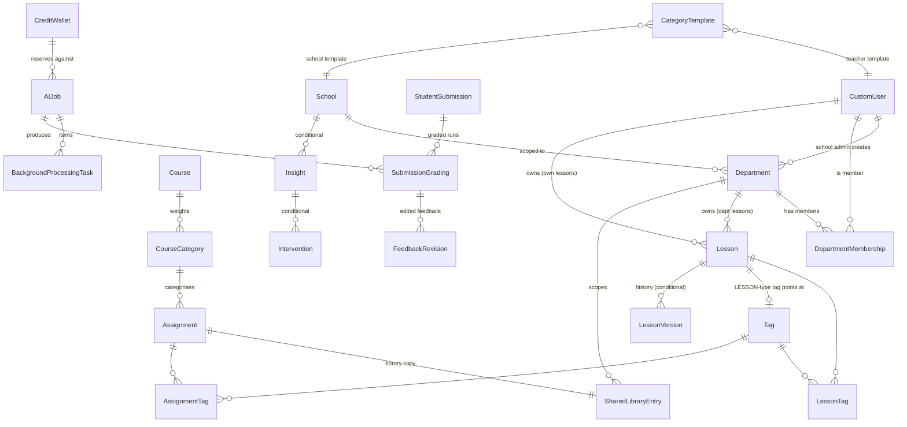

# 03a — Data Model Specification

**Phase 2 Part 1 · Backend.** Companion to [03_architecture.md](03_architecture.md)
Part IX. Where that document argues *which* tables exist, this one specifies
*what is in them*.

Status: **specification for review.** Nothing here is implemented.

---

## 0. Conventions

These match the existing codebase, cited so the new tables read like the old
ones.

| Convention | Rule | Source |
|---|---|---|
| Primary key | `id UUID`, `default=uuid.uuid4`, `editable=False` | every model in `classrooms/models.py`, `students/models.py` |
| Timestamps | `created_at` with `auto_now_add=True`; `updated_at` with `auto_now=True` where rows are mutable | `classrooms/models.py:139` |
| Status fields | `TextChoices`, UPPERCASE values, `db_index=True` | `students/models.py:334-339` |
| Credits | `IntegerField`, **raw = display × 1000**. "5,000 credits" is `5_000_000` | `billing/models.py`, glossary |
| Identity on immutable rows | **Captured as values, never as a FK**: `<role>_id UUID` + `<role>_email` with no constraint, so a deletion cannot cascade through history | `CreditLedger`, `billing/models.py:1283-1301` |
| Tenancy | Every table names the column(s) `get_queryset()` scopes by. There is no middleware and no RLS | `docs/backend/security-and-tenancy.md` |
| Migrations | Additive only. Anything non-additive needs the three-deploy expand–contract pattern and an `# expand-contract-step:` acknowledgement | `docs/MIGRATIONS.md`, CI |
| pgbouncer | Transaction pooling. No `LISTEN/NOTIFY`, no session advisory locks, no server-side cursors | `docs/ops/postgres-guard-rails.md` |
| Table names | Django default `<app>_<model>` unless stated | — |

**Column-table legend.** `Type` is the Django field; the Postgres type follows
from it. `Null` is whether the column accepts NULL. `Key` marks PK / FK / UQ /
IX (indexed). `on_delete` is stated for every FK with its reason.

---

## 1. Entity relationship diagram



`AuditEvent` is deliberately absent from the diagram: it has **no foreign
keys** by design (§2.1).

---

## 2. Core tables

### 2.1 `AuditEvent`

**App:** new `audit` app · **Table:** `audit_auditevent`
**Purpose:** One row per meaningful user or system action (BE-A-01). Append-only.
**Scoped by:** `license_id` for School Admin queries; unrestricted for Super
Admin (BE-A-08).

| Column | Type | Null | Default | Key | Description |
|---|---|---|---|---|---|
| `id` | UUIDField | no | uuid4 | PK | Event identifier. Server-generated; never client-supplied |
| `occurred_at` | DateTimeField | no | now | IX | When the action happened |
| `actor_id` | UUIDField | yes | — | IX | The acting user's id, **captured as a value** — no FK. NULL for system actions |
| `actor_role` | CharField(20) | no | — | IX | `STUDENT` / `TEACHER` / `SCHOOL_ADMIN` / `SUPER_ADMIN` / `SYSTEM`, frozen at write time |
| `actor_email` | CharField(254) | yes | — | | Captured value. **NULL when `actor_role = STUDENT`** — data minimisation, §5.1 |
| `license_id` | UUIDField | yes | — | IX | The School License the action occurred under. NULL for Individual Teachers |
| `department_id` | UUIDField | yes | — | IX | Department in scope, where applicable (BE-A-02) |
| `action` | CharField(64) | no | — | IX | Stable verb, e.g. `ASSIGNMENT_COPY`, `DEPARTMENT_MEMBER_ADD`. From a fixed code-level enum |
| `target_type` | CharField(64) | no | — | IX | Model name of the object acted on |
| `target_id` | UUIDField | yes | — | IX | Id of the object acted on |
| `outcome` | CharField(16) | no | — | IX | `SUCCESS` / `FAILURE` / `DENIED` |
| `error_class` | CharField(16) | yes | — | | BE-A-05 taxonomy when `outcome != SUCCESS`: `USER` / `VALIDATION` / `PROVIDER` / `MODEL` / `SYSTEM` |
| `reason_code` | CharField(64) | yes | — | IX | BE-A-06 machine-readable code when applicable. Indexed for BE-A-09 rate metrics |
| `trace_id` | UUIDField | no | — | IX | **Server-generated** correlation id spanning web → worker → model call. Authoritative |
| `client_correlation_id` | CharField(64) | yes | — | | The inbound `X-Request-ID`, stored as **untrusted** context. See X-5 |
| `source_ip` | GenericIPAddressField | yes | — | | Nulled by the retention sweep after `PII_SHORT_RETENTION_DAYS`; never populated for `STUDENT` actors. See X-4 |
| `user_agent` | CharField(512) | yes | — | | Same handling as `source_ip` |
| `retention_class` | CharField(16) | no | — | IX | `GENERAL` (12 months) or `STUDENT_RECORD` (3 years) per A6. Set at write time; drives the sweep |
| `before` | JSONField | yes | — | | Prior state for value-changing actions (BE-E-06 weight changes). Bounded; identifiers only |
| `after` | JSONField | yes | — | | New state, same rules |
| `metadata` | JSONField | no | `{}` | | Bounded, PII-free context. Enforced by the emitter's allow-list, not by convention |

**Indexes**
- `(license_id, occurred_at DESC)` — the School Admin view (BE-A-08)
- `(actor_id, occurred_at DESC)` — filter by actor
- `(action, occurred_at DESC)` — filter by action type; BE-A-09 rate metrics
- `(reason_code, occurred_at DESC)` partial `WHERE reason_code IS NOT NULL` — reason-code spike detection
- `(retention_class, occurred_at)` — the retention sweep
- `(trace_id)` — support entry point (QA-ERR-04)

**Constraints**
- No foreign keys. An audit log a deletion can erase is not an audit log.
- Application-layer append-only, following the `CreditLedger` pattern on the
  current branch: `save()` refuses updates, `delete()` is only callable by the
  retention sweep.

---

### 2.2 `AIJob`

**App:** `billing` · **Table:** `billing_aijob`
**Purpose:** One row per credit-consuming operation — a grading batch, a lesson
generation, an assignment generation, an insight generation. Holds the credit
**reservation** (BE-B-07), the estimate (BE-B-03/04), the actual cost (BE-B-09)
and the `QUEUED_PENDING_CREDITS` state (BE-B-05/06).
**Scoped by:** `requested_by_id` (teacher's own jobs); `school_id` for admin.

| Column | Type | Null | Default | Key | Description |
|---|---|---|---|---|---|
| `id` | UUIDField | no | uuid4 | PK | Job identifier; also the resume handle (BE-B-06) |
| `job_type` | CharField(32) | no | — | IX | `BATCH_GRADING` / `LESSON_GENERATION` / `ASSIGNMENT_GENERATION` / `INSIGHT_GENERATION` |
| `status` | CharField(32) | no | `ESTIMATED` | IX | See state machine below |
| `requested_by` | FK → `users.CustomUser` | no | — | FK, IX | Who asked. `on_delete=CASCADE` — an operational row, not history; the ledger keeps the money trail |
| `wallet` | FK → `billing.CreditWallet` | no | — | FK, IX | Wallet the reservation is held against. `on_delete=PROTECT` — a wallet with open reservations must not vanish |
| `school_id` | UUIDField | yes | — | IX | Captured tenancy value for admin roll-ups |
| `course` | FK → `classrooms.Course` | yes | — | FK | Context for grading batches. `on_delete=SET_NULL` — the job record outlives the course |
| `assignment` | FK → `assignments.Assignment` | yes | — | FK | Context for grading batches. `on_delete=SET_NULL` |
| `estimate_p50` | IntegerField | yes | — | | Median estimated cost, raw credits. See X-3 |
| `estimate_p90` | IntegerField | yes | — | | 90th-percentile estimate. **The sufficiency verdict is computed against this** |
| `sufficiency_verdict` | CharField(16) | yes | — | | `SUFFICIENT` / `MARGINAL` / `INSUFFICIENT` as shown to the user (BE-B-04); stored so BE-B-09 can measure it |
| `reserved_credits` | IntegerField | no | 0 | | Amount held. Reduces spendable balance while `status` is `RESERVED`/`RUNNING` |
| `reservation_claimed_at` | DateTimeField | yes | — | | Set by the conditional UPDATE that reserves; the **fencing token** for settle/release |
| `consumed_credits` | IntegerField | no | 0 | | Actual cost settled so far, raw credits (BE-B-09) |
| `released_credits` | IntegerField | no | 0 | | Reservation returned on settle/failure |
| `total_items` | IntegerField | no | 0 | | Items in the batch (submissions, or 1 for a generation) |
| `completed_items` | IntegerField | no | 0 | | Durably committed items |
| `failed_items` | IntegerField | no | 0 | | Items that failed with a reason code |
| `stopped_at_item` | IntegerField | yes | — | | Position where credits ran out. "Report exactly where it stopped" (BE-B-06) |
| `queued_at` | DateTimeField | yes | — | | When the job entered `QUEUED_PENDING_CREDITS` |
| `expires_at` | DateTimeField | yes | — | | When a queued job is expired with notification rather than left forever. See X-8 |
| `trace_id` | UUIDField | no | — | IX | Correlation id shared with `AuditEvent` rows and every item |
| `meta` | JSONField | no | `{}` | | Bounded job context; no student data |
| `created_at` | DateTimeField | no | now | IX | |
| `updated_at` | DateTimeField | no | now | | |

**State machine** (`status`)

```
ESTIMATED → RESERVED → RUNNING → SETTLED
    │           │          ├──→ PARTIALLY_COMPLETE → QUEUED_PENDING_CREDITS → RESERVED
    │           │          └──→ FAILED
    └──→ QUEUED_PENDING_CREDITS (insufficient, teacher proceeds per A8)
                 └──→ EXPIRED (past expires_at, teacher notified)
    any non-terminal → CANCELLED
```

**Indexes**
- `(wallet_id, status)` partial `WHERE status IN ('RESERVED','RUNNING')` — the
  spendable-balance query subtracts open reservations
- `(status, expires_at)` partial `WHERE status = 'QUEUED_PENDING_CREDITS'` —
  the promotion / expiry sweep
- `(requested_by_id, created_at DESC)` — a teacher's job list

**Constraints**
- `CHECK (reserved_credits >= 0 AND consumed_credits >= 0 AND released_credits >= 0)`
- `CHECK (completed_items + failed_items <= total_items)`
- Reservation is taken by **one conditional UPDATE** whose row count is the
  result — the same claim idiom as `_claim_submission_for_grading`. Never
  `select_for_update` across a network call.

**Relationship to existing tables**
- `BackgroundProcessingTask` gains `job FK → AIJob` and becomes the per-item
  row (§4). `BatchUploadSession` is untouched — it is for uploads.

---

### 2.3 `Tag`

**App:** new `tags` app · **Table:** `tags_tag`
**Purpose:** A reusable label of one of three types (BE-C-01), scoped to a
teacher or a Department (A3), with normalised uniqueness (BE-C-08).
**Scoped by:** `teacher_id` **or** `department_id`, per `owner_type`.

| Column | Type | Null | Default | Key | Description |
|---|---|---|---|---|---|
| `id` | UUIDField | no | uuid4 | PK | |
| `tag_type` | CharField(16) | no | — | IX | `SUBJECT` / `UNIT` / `LESSON` |
| `name` | CharField(100) | no | — | | Display name as the teacher typed it (trimmed) |
| `normalised_name` | CharField(100) | no | — | IX | `name` lower-cased, whitespace collapsed, Unicode NFKC. **The uniqueness key.** Rule documented per BE-C-08 |
| `owner_type` | CharField(16) | no | — | IX | `TEACHER` or `DEPARTMENT`. Discriminated union, same idiom as `Session.owner_type` |
| `teacher` | FK → `users.CustomUser` | yes | — | FK | Set only when `owner_type = TEACHER`. `on_delete=CASCADE` — a teacher's private tags go with the teacher |
| `department` | FK → `classrooms.Department` | yes | — | FK | Set only when `owner_type = DEPARTMENT`. `on_delete=CASCADE` — resolved by BE-F-12 decision (§2.10) |
| `lesson` | FK → `lessons.Lesson` | yes | — | FK, UQ | **Required when `tag_type = LESSON`, NULL otherwise** (BE-C-03). `on_delete=PROTECT` — deleting a referenced Lesson must be explicit (QA-C-02); the service unlinks or reassigns first |
| `created_by_id` | UUIDField | yes | — | | Captured value |
| `created_at` | DateTimeField | no | now | | |
| `usage_count` | IntegerField | no | 0 | | Denormalised count of `AssignmentTag` + `LessonTag` rows. Drives BE-C-05's "how many items are affected" and FE-C-03's reuse prominence. Maintained by the service, verified by a test |

**Indexes**
- `(teacher_id, tag_type, normalised_name)` — autocomplete for teacher-scoped tags
- `(department_id, tag_type, normalised_name)` — autocomplete for department-scoped tags

**Constraints**
- `UNIQUE (teacher_id, tag_type, normalised_name) WHERE owner_type = 'TEACHER'`
- `UNIQUE (department_id, tag_type, normalised_name) WHERE owner_type = 'DEPARTMENT'`
- `UNIQUE (lesson_id) WHERE tag_type = 'LESSON'` — one tag per Lesson
- `CHECK ((owner_type = 'TEACHER' AND teacher_id IS NOT NULL AND department_id IS NULL) OR (owner_type = 'DEPARTMENT' AND department_id IS NOT NULL AND teacher_id IS NULL))`
- `CHECK ((tag_type = 'LESSON') = (lesson_id IS NOT NULL))`

**Migration from `Topic`.** Existing `classrooms.Topic` rows are course-scoped
(`Topic.course`). Backfill: one `UNIT` tag per distinct
`(course.teacher, normalised(topic.name))`, owner `TEACHER`; then one
`AssignmentTag` per `Assignment.topic`. `Topic` and `Assignment.topic` are
**left in place** for one release (expand) and removed in a later contract
step. Row counts: **must verify** against a production-shaped database.

---

### 2.4 `AssignmentTag`

**App:** `tags` · **Table:** `tags_assignmenttag`
**Purpose:** Many-to-many link, Assignment ↔ Tag (BE-C-04, BE-E-10).
**Scoped by:** through `assignment.course.teacher`.

| Column | Type | Null | Default | Key | Description |
|---|---|---|---|---|---|
| `id` | UUIDField | no | uuid4 | PK | |
| `assignment` | FK → `assignments.Assignment` | no | — | FK, IX | `on_delete=CASCADE` — a link has no meaning without its assignment |
| `tag` | FK → `tags.Tag` | no | — | FK, IX | `on_delete=CASCADE` — BE-C-05 delete is explicit and confirmed with the affected count first; after confirmation the links go |
| `created_at` | DateTimeField | no | now | | |

**Constraints**
- `UNIQUE (assignment_id, tag_id)`

**Copy semantics (BE-C-06).** Copying an assignment copies its `AssignmentTag`
rows to the new assignment. Copying **across scope** (teacher → library, library
→ teacher) re-resolves each tag by `(tag_type, normalised_name)` in the
destination scope, creating it if absent. The tag *concept* carries; the row
does not.

---

### 2.5 `LessonTag`

**App:** `tags` · **Table:** `tags_lessontag`
**Purpose:** Many-to-many link, Lesson ↔ Tag (BE-C-04, BE-D-04). Only
`SUBJECT` and `UNIT` tags apply to Lessons — a Lesson does not carry a
`LESSON` tag.
**Scoped by:** through `lesson` ownership.

| Column | Type | Null | Default | Key | Description |
|---|---|---|---|---|---|
| `id` | UUIDField | no | uuid4 | PK | |
| `lesson` | FK → `lessons.Lesson` | no | — | FK, IX | `on_delete=CASCADE` |
| `tag` | FK → `tags.Tag` | no | — | FK, IX | `on_delete=CASCADE` |
| `created_at` | DateTimeField | no | now | | |

**Constraints**
- `UNIQUE (lesson_id, tag_id)`
- Service-level: reject `tag.tag_type = LESSON`. (A DB CHECK cannot see the
  joined row; enforced in `clean()` and tested.)

---

### 2.6 `Lesson`

**App:** new `lessons` app · **Table:** `lessons_lesson`
**Purpose:** A lesson plan owned by a teacher or a Department (BE-D-01).
**Session-independent by construction: this table has no `session` column and
no `course` column.**
**Scoped by:** `teacher_id` (own lessons) or `department_id` via
`DepartmentMembership` (department lessons).

| Column | Type | Null | Default | Key | Description |
|---|---|---|---|---|---|
| `id` | UUIDField | no | uuid4 | PK | |
| `title` | CharField(255) | no | — | IX | |
| `content` | JSONField | no | — | | ProseMirror document, stored the same way `Assignment.raw_input` is — **must verify** that shape and match it, so the same editor serves both (FE-G-03) |
| `content_text` | TextField | no | `""` | | Plain-text projection of `content`, for search (FE-D-09) and for the retrieval interface (BE-D-05). Maintained on save |
| `owner_type` | CharField(16) | no | — | IX | `TEACHER` or `DEPARTMENT`. Same idiom as `Session.owner_type` |
| `teacher` | FK → `users.CustomUser` | yes | — | FK, IX | Set only when `owner_type = TEACHER`. `on_delete=CASCADE` |
| `department` | FK → `classrooms.Department` | yes | — | FK, IX | Set only when `owner_type = DEPARTMENT`. `on_delete=PROTECT` — makes silent disappearance (BE-F-12) structurally impossible; the service must reassign or explicitly delete first |
| `status` | CharField(16) | no | `DRAFT` | IX | `DRAFT` / `PUBLISHED` (BE-D-07) |
| `source` | CharField(16) | no | — | | `UPLOAD` or `AI_GENERATED`. Both paths land in this one table (BE-D-02); the field records provenance only |
| `grade_level` | CharField(32) | yes | — | | Grade level the lesson targets. AI generation reads the teacher's setting (BE-D-03); stored so the lesson is self-describing |
| `ai_job` | FK → `billing.AIJob` | yes | — | FK | The generation job, when `source = AI_GENERATED`. `on_delete=SET_NULL` |
| `created_by_id` | UUIDField | no | — | | Captured value — who created it, regardless of who owns it (a School Admin may create a department lesson, BE-F-05) |
| `created_at` | DateTimeField | no | now | IX | |
| `last_edited_by_id` | UUIDField | no | — | | Captured value (BE-D-08, BE-F-06). Shown in list views (FE-F-06) |
| `last_edited_by_name` | CharField(255) | no | — | | Captured display name, so the list view needs no join and survives a teacher leaving |
| `last_edited_at` | DateTimeField | no | now | IX | Concurrent-edit attribution is tested (QA-D-06) |
| `version` | IntegerField | no | 1 | | Monotonic; bumped on every content save. Optimistic-concurrency token for the editor and the FK target for `LessonVersion` |

**Indexes**
- `(teacher_id, status, last_edited_at DESC)` — the Lessons tab
- `(department_id, status, last_edited_at DESC)` — Department Lessons
- GIN on `to_tsvector('simple', content_text)` — search and BE-D-05 retrieval

**Constraints**
- `CHECK ((owner_type = 'TEACHER' AND teacher_id IS NOT NULL AND department_id IS NULL) OR (owner_type = 'DEPARTMENT' AND department_id IS NOT NULL AND teacher_id IS NULL))`

**Deletion.** Deleting a Lesson referenced by a `LESSON`-type `Tag` is blocked
by `PROTECT`; the service offers "delete tag and its links" or "cancel"
(QA-C-02). Copying a Lesson (BE-D-06) creates a new row with new `id`, `source`
copied, `ai_job` NULL, `version = 1`, and re-resolved tags — no residual
reference.

---

### 2.7 `CategoryTemplate`

**App:** `classrooms` · **Table:** `classrooms_categorytemplate`
**Purpose:** A named set of category weights that seeds a new Course
(BE-E-02). Owned by a teacher or by a School.
**Scoped by:** `teacher_id` or `school_id`, per `owner_type`.

| Column | Type | Null | Default | Key | Description |
|---|---|---|---|---|---|
| `id` | UUIDField | no | uuid4 | PK | |
| `name` | CharField(100) | no | — | | Template name, e.g. "Standard secondary" |
| `owner_type` | CharField(16) | no | — | IX | `TEACHER` or `SCHOOL` |
| `teacher` | FK → `users.CustomUser` | yes | — | FK | `on_delete=CASCADE` |
| `school` | FK → `classrooms.School` | yes | — | FK | `on_delete=CASCADE` |
| `items` | JSONField | no | — | | `[{"name": "Exam", "weight_percent": "50.00"}, ...]`. A template is copied into `CourseCategory` rows on Course creation and never queried by item, so JSON is honest here |
| `created_by_id` | UUIDField | no | — | | Captured value |
| `created_at` | DateTimeField | no | now | | |
| `updated_at` | DateTimeField | no | now | | |

**Constraints**
- `UNIQUE (teacher_id, name) WHERE owner_type = 'TEACHER'`
- `UNIQUE (school_id, name) WHERE owner_type = 'SCHOOL'`
- Sum of `items[].weight_percent` = 100.00 — enforced in `clean()` (A1); a
  JSON array cannot be CHECKed in Postgres without a function.

---

### 2.8 `CourseCategory` — **repair of an existing table**

**App:** `classrooms` · **Table:** `classrooms_coursecategory` (exists)
**Purpose:** A named, weighted category within one Course (BE-E-02/03).
Today the table is `id` + `name` and is linked to nothing
(`classrooms/models.py:179-183`) — hardening item H-6. Repairing it resolves
H-6 as "build it".
**Scoped by:** `course.teacher`.

| Column | Type | Null | Default | Key | Description |
|---|---|---|---|---|---|
| `id` | UUIDField | no | uuid4 | PK | *(exists)* |
| `name` | CharField(100) | no | — | IX | *(exists)* Category name, e.g. "Exam" |
| `course` | FK → `classrooms.Course` | **yes → no** | — | FK, IX | **New.** Added nullable (expand), backfilled, then made NOT NULL (contract). `on_delete=CASCADE` |
| `weight_percent` | DecimalField(5,2) | no | `0.00` | | **New.** Share of the final grade. Sum across a Course = 100.00 (A1) |
| `position` | IntegerField | no | 0 | | **New.** Display order |
| `created_at` | DateTimeField | no | now | | **New.** |

**Constraints**
- `UNIQUE (course_id, name)`
- `CHECK (weight_percent >= 0 AND weight_percent <= 100)`
- Sum-to-100 across a Course is a **multi-row** invariant. Enforced in the
  service under `select_for_update` on the Course row, and by a test. Postgres
  cannot express it as a constraint without a trigger, and the project does
  not use triggers.

**Row count before repair: must verify.** If zero (expected — the table was
never routed), the expand–contract collapses to one additive migration.

**Uncategorised assignments (BE-E-03).** `Assignment.category` is nullable.
Treatment is a documented, API-discoverable choice: uncategorised assignments
contribute to a **virtual "Uncategorised" bucket** whose weight is the
remainder after configured categories, or `0` when categories already total
100. Recorded here so it is a decision, not an accident.

---

### 2.9 `Department`

**App:** `classrooms` · **Table:** `classrooms_department`
**Purpose:** A faculty grouping under a School License (BE-F-01). **Persists
across Sessions by construction: no `session` column.**
**Scoped by:** `school_id`.

| Column | Type | Null | Default | Key | Description |
|---|---|---|---|---|---|
| `id` | UUIDField | no | uuid4 | PK | |
| `school` | FK → `classrooms.School` | no | — | FK, IX | The tenancy root. `on_delete=CASCADE` — a school's departments go with the school. **Must verify** whether the codebase's tenancy root for a License is `School` or a billing licence row; every existing queryset scopes by `school`, so `School` is used here |
| `name` | CharField(100) | no | — | IX | |
| `description` | TextField | no | `""` | | |
| `created_by_id` | UUIDField | no | — | | Captured value — the School Admin (BE-F-02) |
| `created_at` | DateTimeField | no | now | | |
| `updated_at` | DateTimeField | no | now | | |

**Constraints**
- `UNIQUE (school_id, name)`

**Deletion (BE-F-12).** `Lesson.department` and `SharedLibraryEntry.department`
are `PROTECT`, so `Department.delete()` fails while content exists. The service
exposes exactly two explicit paths: **delete with content** (after the
confirmation FE-F-02 requires) or **reassign content to another Department**.
There is no path by which content vanishes as a side effect.

---

### 2.10 `DepartmentMembership`

**App:** `classrooms` · **Table:** `classrooms_departmentmembership`
**Purpose:** Which Licensed Teachers are in which Department (BE-F-03), and
the **per-member permission flags** (BE-F-07, A5).
**Scoped by:** `department.school`.

| Column | Type | Null | Default | Key | Description |
|---|---|---|---|---|---|
| `id` | UUIDField | no | uuid4 | PK | |
| `department` | FK → `classrooms.Department` | no | — | FK, IX | `on_delete=CASCADE` |
| `teacher` | FK → `users.CustomUser` | no | — | FK, IX | `on_delete=CASCADE` — a removed teacher's membership goes; their **content stays**, because content is owned by the Department, not the membership |
| `can_edit_lessons` | BooleanField | no | `True` | | May add/edit Department Lessons. Default permissive per BE-F-07 |
| `can_edit_library` | BooleanField | no | `True` | | May add/edit Shared Library entries |
| `added_by_id` | UUIDField | no | — | | Captured value — the admin who placed them |
| `created_at` | DateTimeField | no | now | | |
| `updated_at` | DateTimeField | no | now | | Flag changes are audit-logged (BE-F-11) with before/after |

**Constraints**
- `UNIQUE (department_id, teacher_id)`
- Service-level: `teacher.school_id == department.school_id` and
  `teacher.user_type == TEACHER` (BE-F-02 — members come from the License's
  Licensed Teachers). Cross-school membership is a P0 and is tested
  adversarially.

**Authorisation.** Read access = a membership row exists. Write access =
membership row **and** the relevant flag. Restricted members retain read
(Frontend A5). Both checks live in the service and the viewset, never in the
UI (QA-SEC-04).

---

### 2.11 `SharedLibraryEntry`

**App:** `classrooms` · **Table:** `classrooms_sharedlibraryentry`
**Purpose:** Membership of an Assignment copy in a Department's Shared
Assignment Library (BE-F-08), with last-edited attribution (BE-F-06).
**Scoped by:** `department_id` via `DepartmentMembership`.

| Column | Type | Null | Default | Key | Description |
|---|---|---|---|---|---|
| `id` | UUIDField | no | uuid4 | PK | |
| `department` | FK → `classrooms.Department` | no | — | FK, IX | `on_delete=PROTECT` (BE-F-12, see §2.9) |
| `assignment` | OneToOne → `assignments.Assignment` | no | — | FK, UQ | **The library's own copy** — a real Assignment row so tags and the deep-copy path are reused. `on_delete=CASCADE`. Independent of any teacher's copy in both directions (BE-G-06) |
| `added_by_id` | UUIDField | no | — | | Captured value |
| `added_by_name` | CharField(255) | no | — | | Captured display name |
| `added_at` | DateTimeField | no | now | IX | |
| `last_edited_by_id` | UUIDField | no | — | | Captured value (BE-F-06) |
| `last_edited_by_name` | CharField(255) | no | — | | For list views without a join (FE-F-06) |
| `last_edited_at` | DateTimeField | no | now | IX | |

**Conditional columns — only if the Founder Checklist's A5 ("teachers submit,
admin approves") holds over BE-F-08:**

| Column | Type | Null | Default | Description |
|---|---|---|---|---|
| `approval_status` | CharField(16) | no | `APPROVED` | `PENDING` / `APPROVED` / `REJECTED`. Default `APPROVED` keeps BE-F-08 behaviour when the workflow is off |
| `reviewed_by_id` | UUIDField | yes | — | Captured value |
| `reviewed_at` | DateTimeField | yes | — | |

**Indexes**
- `(department_id, last_edited_at DESC)` — the library list

**The open shape.** `Assignment.course` is NOT NULL today
(`assignments/models.py:29-31`) and a library copy has no course. Resolution is
in the Decision Request; this spec assumes **`Assignment.course` becomes
nullable with a CHECK that exactly one of `course` / library membership is set**
(§4.1). If the alternative is chosen — the entry holds its own content — this
table gains `questions`, `rubric` and metadata columns and a fourth tag link
table is required.

---

### 2.12 `SubmissionGrading`

**App:** `students` · **Table:** `students_submissiongrading`
**Purpose:** One row per **grading run** of a submission. Carries the BE-I-04
provenance and makes BE-I-05 re-grading possible: prior results are retained,
exactly one is authoritative.
**Scoped by:** `submission.assignment.course.teacher`, and the student for
their own.

> **As decided (note added 2026-10-06, BE-I-04).** This table is **not built
> yet**. The founder's representative chose the small version of BE-I-04 on
> 2026-10-06: the label of a grade is first recorded as six columns on
> `students.StudentSubmission` (§4.4), written in the same `UPDATE` as the
> score. **That is the first form of the grading record. A later stage
> improves on it: this table of grading runs, built beside re-grading
> (BE-I-05) or feedback editing (BE-E-08), whichever comes first, and filled
> from those columns**, so every grade made since the columns shipped carries
> its real label into the table. Until the table exists, a re-grade
> overwrites the label with the newer run's, as it overwrites the score; the
> audit trail keeps the score before and after each grading.

**This is the largest schema change in Part 1.** `StudentSubmission` holds
`score`, `score_percentage`, `max_points`, `feedback` and `graded_at` inline
today (`students/models.py:53-81`). Those move here.

| Column | Type | Null | Default | Key | Description |
|---|---|---|---|---|---|
| `id` | UUIDField | no | uuid4 | PK | |
| `submission` | FK → `students.StudentSubmission` | no | — | FK, IX | `on_delete=CASCADE` — a grading run has no meaning without its submission. Student deletion/export (QA-CMP-03) follows this edge |
| `is_authoritative` | BooleanField | no | `False` | IX | **Exactly one `True` per submission** (QA-I-02 "singular"). The one the gradebook, analytics and exports read |
| `score` | DecimalField(8,2) | yes | — | | Awarded points — the "single arithmetic authority" output of `_finalize_grading_result` |
| `score_percentage` | DecimalField(5,2) | yes | — | | `score / max_points × 100` |
| `max_points` | IntegerField | no | — | | Assignment maximum at grading time, frozen — a later rubric edit must not re-scale a past grade |
| `feedback` | JSONField | yes | — | | Per-question evaluations as the model returned them, post-clamp. **Never edited in place** — teacher edits go to `FeedbackRevision` |
| `graded_at` | DateTimeField | no | now | IX | |
| `strictness_level` | CharField(16) | no | — | IX | `LENIENT` / `STANDARD` / `STRICT` — the **effective** level (BE-I-01, BE-I-03) |
| `strictness_source` | CharField(16) | no | — | | `TEACHER_DEFAULT` / `COURSE` / `ASSIGNMENT` — which scope won the precedence (QA-ACC-08; FE-I-02 shows it) |
| `prompt_version` | CharField(64) | no | — | IX | Identifier of the prompt as released in code (BE-I-04). Legacy back-fill: `legacy-pre-part1` |
| `config_version` | CharField(64) | no | — | IX | Identifier of the grading configuration as released in code (BE-I-02, X-1). Legacy: `legacy-pre-part1` |
| `model_id` | CharField(128) | no | — | IX | Provider model string actually used, e.g. `x-ai/grok-4.3` (BE-I-04, §5.4) |
| `fallback_used` | BooleanField | no | `False` | IX | `True` when the fallback model served this run (BE-A-09 fallback-rate metric) |
| `second_opinion_model_id` | CharField(128) | yes | — | | Grader B's model, when the blind second opinion ran |
| `confidence` | DecimalField(5,4) | yes | — | | Model-reported confidence where the output supports it (BE-I-08). NULL when unavailable — "never downgrade what we can't measure" |
| `needs_review` | BooleanField | no | `False` | IX | Set on second-opinion disagreement or low confidence; feeds the review queue |
| `ai_job` | FK → `billing.AIJob` | yes | — | FK | The batch that produced it. `on_delete=SET_NULL` |
| `superseded_by` | FK → self | yes | — | FK | The re-grade that replaced this as authoritative, if any (BE-I-05 "retain both") |
| `graded_by_id` | UUIDField | yes | — | | Captured value: the teacher who triggered grading or re-grading |
| `trace_id` | UUIDField | yes | — | IX | Correlation id |

**Indexes**
- `UNIQUE (submission_id) WHERE is_authoritative` — **the** constraint that makes "singular" true at the database, not in code
- `(submission_id, graded_at DESC)` — history view (FE-I-03 side-by-side)
- `(prompt_version, config_version, model_id)` — the QA accuracy suite's attribution query (QA-ACC-12)

**Migration (expand–contract, three deploys)**
1. **Expand.** Create table. Back-fill one row per graded `StudentSubmission`
   with `is_authoritative = True`, versions `legacy-pre-part1`, `model_id`
   from the submission's `feedback` metadata where present else `unknown`.
   Dual-write from the grading pipeline.
2. **Migrate readers.** `_recalculate_final_grade`
   (`classrooms/signals.py:278`) and the three dashboard `Avg()` sites move to
   the authoritative row — via the Epic E grade service, which is why E precedes
   I in sequencing.
3. **Contract.** Drop `score`, `score_percentage`, `max_points`, `feedback`,
   `graded_at` from `StudentSubmission`. Requires
   `# expand-contract-step:` acknowledgement in CI.

---

### 2.13 `FeedbackRevision`

**App:** `students` · **Table:** `students_feedbackrevision`
**Purpose:** A teacher's edit to one piece of AI feedback, stored as an
**original / edited pair** that never overwrites the original (BE-E-08, A7).
Shaped as a labelled training signal (QA-ACC-13).
**Scoped by:** `grading.submission.assignment.course.teacher`.

| Column | Type | Null | Default | Key | Description |
|---|---|---|---|---|---|
| `id` | UUIDField | no | uuid4 | PK | |
| `grading` | FK → `students.SubmissionGrading` | no | — | FK, IX | The run whose feedback was edited. `on_delete=CASCADE`. Assignment, strictness, prompt and config version are all reachable through this FK — **not duplicated** |
| `criterion_key` | CharField(128) | no | — | IX | Which question / rubric criterion inside `feedback` was edited. Stable path, e.g. `q3.criterion_2` |
| `original_text` | TextField | no | — | | The AI text at the moment of first edit. Written once, never changed |
| `edited_text` | TextField | no | — | | What the student sees (A7) |
| `is_current` | BooleanField | no | `True` | IX | The revision the student-facing view reads. Reverting sets `is_current = False` and the student sees `original_text` again (QA-E-06 "restores it exactly") |
| `edited_by_id` | UUIDField | no | — | | Captured value |
| `edited_at` | DateTimeField | no | now | IX | |
| `reverted_at` | DateTimeField | yes | — | | |

**Indexes**
- `UNIQUE (grading_id, criterion_key) WHERE is_current` — one live edit per criterion
- `(grading_id, criterion_key, edited_at DESC)` — edit history

**Zero-credit.** Every write to this table runs inside `zero_credit_scope()`
(03_architecture §3.3) and a test asserts no `CreditLedger` row is created.

---

## 3. Conditional tables

Specified so they can be built without redesign; built only if the stated
condition holds.

### 3.1 `LessonVersion` — *if BE-D-07 survives the Part VI cut*

**App:** `lessons` · **Purpose:** Content snapshot per save, restorable (QA-D-04).

| Column | Type | Null | Default | Key | Description |
|---|---|---|---|---|---|
| `id` | UUIDField | no | uuid4 | PK | |
| `lesson` | FK → `lessons.Lesson` | no | — | FK, IX | `on_delete=CASCADE` |
| `version_number` | IntegerField | no | — | | Matches `Lesson.version` at the time of snapshot |
| `content` | JSONField | no | — | | Full snapshot. Restoring copies it back and bumps `Lesson.version` — history is never rewritten |
| `status_at_version` | CharField(16) | no | — | | `DRAFT` / `PUBLISHED` |
| `saved_by_id` | UUIDField | no | — | | Captured value |
| `saved_at` | DateTimeField | no | now | | |

**Constraints:** `UNIQUE (lesson_id, version_number)`.

### 3.2 `Insight` — *if Epic H survives the Part VI cut*

**App:** new `insights` app · **Purpose:** One generated insight with full
provenance (BE-H-06).

| Column | Type | Null | Default | Key | Description |
|---|---|---|---|---|---|
| `id` | UUIDField | no | uuid4 | PK | |
| `school` | FK → `classrooms.School` | no | — | FK, IX | Scope, derived from the authenticated admin — **never** from prompt content (BE-H-01). `on_delete=CASCADE` |
| `requested_by_id` | UUIDField | no | — | | Captured value |
| `ai_job` | FK → `billing.AIJob` | yes | — | FK | Metering against the admin's balance (BE-H-07). `on_delete=SET_NULL` |
| `snapshot` | JSONField | no | — | | **The deterministic tool outputs the model narrated** — every figure in `narrative` traces to a value here (BE-H-03). Groups below the minimum size appear as explicit suppression markers, not omissions (FE-H-05) |
| `narrative` | TextField | no | — | | The model's prose. Visually attributed as AI (FE-H-04) |
| `model_id` | CharField(128) | no | — | IX | |
| `fallback_used` | BooleanField | no | `False` | | BE-H-09 |
| `prompt_version` | CharField(64) | no | — | IX | |
| `generated_at` | DateTimeField | no | now | IX | |
| `trace_id` | UUIDField | no | — | IX | |

**Indexes:** `(school_id, generated_at DESC)`.

### 3.3 `Intervention` — *with `Insight`*

| Column | Type | Null | Default | Key | Description |
|---|---|---|---|---|---|
| `id` | UUIDField | no | uuid4 | PK | |
| `insight` | FK → `insights.Insight` | no | — | FK, IX | `on_delete=CASCADE` |
| `text` | TextField | no | — | | The suggestion. A suggestion to a human, never an action (BE-H-02) |
| `target_type` | CharField(32) | yes | — | | `TEACHER` / `COURSE` / `DEPARTMENT` / `TAG`. **Never `STUDENT`** — an intervention below the minimum group size cannot exist (BE-H-05) |
| `target_id` | UUIDField | yes | — | | |
| `disposition` | CharField(16) | no | `PENDING` | IX | `PENDING` / `ACTED_ON` / `DISMISSED` / `IGNORED` (BE-H-08) |
| `disposed_by_id` | UUIDField | yes | — | | Captured value |
| `disposed_at` | DateTimeField | yes | — | | |

### 3.4 `CreditRequest` — *only if admins need a queue, not just a notification (FE-B-04)*

**App:** `billing`.

| Column | Type | Null | Default | Key | Description |
|---|---|---|---|---|---|
| `id` | UUIDField | no | uuid4 | PK | |
| `teacher` | FK → `users.CustomUser` | no | — | FK, IX | `on_delete=CASCADE` |
| `school` | FK → `classrooms.School` | no | — | FK, IX | The admin who sees it. `on_delete=CASCADE` |
| `requested_credits` | IntegerField | no | — | | Raw credits (× 1000) |
| `message` | CharField(500) | no | `""` | | Teacher's note |
| `status` | CharField(16) | no | `PENDING` | IX | `PENDING` / `GRANTED` / `DECLINED` / `WITHDRAWN` |
| `ai_job` | FK → `billing.AIJob` | yes | — | FK | The queued job that prompted it, if any. `on_delete=SET_NULL` |
| `decided_by_id` | UUIDField | yes | — | | Captured value |
| `decided_at` | DateTimeField | yes | — | | |
| `created_at` | DateTimeField | no | now | IX | |

**Granting** creates the BE-B-08 dispersal (a paired debit/credit in
`CreditLedger`, atomic) and promotes the linked `AIJob` from
`QUEUED_PENDING_CREDITS`.

### 3.5 `StudentPseudonym` — *only if de-identification is adopted (Founder Checklist §3.1)*

**App:** `students`.

| Column | Type | Null | Default | Key | Description |
|---|---|---|---|---|---|
| `id` | UUIDField | no | uuid4 | PK | |
| `student` | OneToOne → `users.CustomUser` | no | — | FK, UQ | `on_delete=CASCADE` — deletion removes the mapping (QA-CMP-03) |
| `pseudonym` | UUIDField | no | uuid4 | UQ | The only identifier that reaches a model provider. Stable per student so cross-student caching (Tier 0.5) still works |
| `created_at` | DateTimeField | no | now | | |

---

## 4. Changes to existing tables

All additive unless marked. Each column states the requirement that forces it.

### 4.1 `assignments.Assignment`

| Column | Type | Null | Default | Change | Forced by |
|---|---|---|---|---|---|
| `category` | FK → `classrooms.CourseCategory` | yes | — | add. `on_delete=SET_NULL` — deleting a category uncategorises, never deletes assignments | BE-E-02, BE-E-03 |
| `relative_weight` | DecimalField(8,2) | no | `1.00` | add. Weight *within* the category — points-style, not a second percentage (BE-E-04) | BE-E-04 |
| `strictness` | CharField(16) | yes | — | add. Per-assignment override; NULL = inherit from Course | BE-I-03 |
| `department` | FK → `classrooms.Department` | yes | — | add. Set for library copies. `on_delete=PROTECT` | BE-F-08 |
| `course` | FK → `classrooms.Course` | **no → yes** | — | **pending decision** — nullable so a library copy can exist without a Course. CHECK `(course_id IS NOT NULL) <> (department_id IS NOT NULL)` | BE-F-08, §2.11 |
| `last_edited_by_id` | UUIDField | yes | — | add. Captured value | BE-F-06 |
| `last_edited_by_name` | CharField(255) | yes | — | add | FE-F-06 |
| `last_edited_at` | DateTimeField | yes | — | add | BE-F-06 |
| `topic` | FK → `classrooms.Topic` | — | — | **remove in a later contract step**, after `AssignmentTag` backfill | BE-C-01 |

`grade_level` — BE-E-01 says a copy carries grade level. **Must verify**
whether it already exists on `Assignment`; the grep in this engagement did not
surface it.

### 4.2 `classrooms.Course`

| Column | Type | Null | Default | Forced by |
|---|---|---|---|---|
| `strictness` | CharField(16) | yes | — | BE-I-03. NULL = inherit from teacher default |

### 4.3 `users.Settings` (or `CustomUser` — **must verify** which holds per-teacher preferences)

| Column | Type | Null | Default | Forced by |
|---|---|---|---|---|
| `default_strictness` | CharField(16) | no | `STANDARD` | BE-I-03 — the bottom of the precedence order |

**Precedence (BE-I-03), documented:** `Assignment.strictness` →
`Course.strictness` → `Settings.default_strictness`. First non-NULL wins. The
winner is recorded on `SubmissionGrading.strictness_source`.

### 4.4 `students.StudentSubmission`

| Column | Type | Null | Default | Change | Forced by |
|---|---|---|---|---|---|
| `submission_status` | CharField(16) | no | `SUBMITTED` | add. `SUBMITTED` / `MISSING` / **`EXCUSED`** / `GRADED`. Excused and missing have documented, API-visible treatment in the weighted average (BE-E-07): `EXCUSED` is excluded from both numerator and denominator; `MISSING` counts as 0 | BE-E-07 |
| `score`, `score_percentage`, `max_points`, `feedback`, `graded_at` | — | — | — | **remove in the §2.12 contract step** | BE-I-05 |
| `grading_prompt_version`, `grading_config_version` | CharField(128) | no | `unlabelled` (also the database default) | **added 2026-10-06, BE-I-04, migration `students/0031`.** Version of the grading instructions; version of the grading settings, read once per run (`ai_processor/grading_config.py`) | BE-I-04, FR-I-04 |
| `grading_strictness` | CharField(32) | no | `unlabelled` | added with the above. `not_yet_set` until the strictness scale exists | BE-I-04 |
| `grading_model` | CharField(255) | no | `unlabelled` | added with the above. The model that marked the most answers, as the provider named it; `deterministic`; or `unknown` | BE-I-04 |
| `grading_fallback_used` | CharField(16) | no | `unlabelled` | added with the above. `yes` / `no` / `unknown` / `not_applicable` | NFR-MDL-03 |
| `grading_release` | CharField(64) | no | `unlabelled` | added with the above. The release that did the grading, or `none`; beside the settings version, never inside it | BE-I-04 |

> **First form of the grading record (note added 2026-10-06, BE-I-04).** The
> six `grading_*` label columns above are the first form of the record of
> what produced a grade. **A later stage improves on it: the table of grading
> runs (§2.12), built beside re-grading or feedback editing and filled from
> these columns.** They are dropped again in §2.12's contract step, with the
> grade columns. `unlabelled` means no label recorded: graded before labels
> existed, or not graded. As of slice A the columns exist and nothing writes
> them; the label is written with the grade in a later slice of this stage.

> **When a saved AI answer is reused (note added 2026-10-06, BE-I-04
> slice B).** Not a table: the store is the cache
> (`ai_processor/grading_cache.py`). A saved answer is reused only when
> everything sent to the AI for that question matches: the whole question as
> serialised into the prompt; the answer's text, its `answer_status` and its
> `transcription_notes`; the assignment's title and instructions; the
> teacher's extra instructions as spliced; the grading prompt's version and
> the grading settings' version; and the intended model. **Stated limits.**
> The match does not look at the other questions of the paper, the other
> answers or the answer's place in a batch, which the AI also sees in the
> same call. Nor does it look at the answer's `source_page`, its
> `confidence` or its own copy of `question_text`, which are sent too: they
> differ from student to student for the same text, so matching on them
> would end all reuse. The release is not part of the match, so a deploy
> does not empty the store. Each stored value names the model that answered.
> **A stated choice** (accepted by the SM 2026-10-06): for `answer_status`
> and `transcription_notes`, a field that is missing, null, empty or only
> whitespace counts as "nothing said" and matches as one; outer whitespace is
> not compared.

> **The label is written with the grade, and the audit entry says the same
> (note added 2026-10-06, BE-I-04 slice C).** The six label columns are set
> by the same `UPDATE` as the score (`students.services._populate_and_save_grade`).
> The model is the one that marked the most answers, fresh and reused
> together; `grading_fallback_used` is `yes` if any kept call or reused
> answer came from a backup model, `unknown` if none did and one came from a
> model the provider did not name or that is on neither list, `no` if all
> came from the main model, `not_applicable` if no AI call was made and
> nothing was reused. Second-opinion calls are in neither. Only kept replies
> count: the label says which models produced the grade that was saved, not
> every model that was called. No document listed the audit entry's keys
> before; for the `GRADING_COMPLETED` entry they are now: `assignment_id`,
> `submission_id`, `task_id`, `duration_ms`, `model`, `prompt_version`,
> `grading_config_version`, `strictness`, and four added by this slice:
> `models_served` (the models of the fresh calls of the grader that sets the
> score), `models_reused` (the models that first produced the reused
> answers), `models_second_opinion`, each a list of names cut to 64
> characters for a person to read; and `fresh_backup_used`, one word for the
> fresh calls only (`yes`, `no`, `unknown`, `no_fresh_call`), worked out on
> the exact names before any cut. The backup measurement reads that one
> word and nothing else; `unknown` is counted apart.

### 4.5 `students.BackgroundProcessingTask`

Becomes the per-item row of an `AIJob`.

| Column | Type | Null | Default | Forced by |
|---|---|---|---|---|
| `job` | FK → `billing.AIJob` | yes | — | BE-B-06. `on_delete=SET_NULL` |
| `reason_code` | CharField(64) | yes | — | BE-A-06, FE-A-03 — per-item machine-readable failure |
| `retry_count` | IntegerField | no | 0 | FE-A-03 per-item retry |
| `item_index` | IntegerField | yes | — | Position within the job; makes `AIJob.stopped_at_item` meaningful |

Existing `status`, `error`, `meta`, `started_at`, `finished_at`,
`cancel_requested_at` are reused unchanged.

### 4.6 `classrooms.Topic`

**Removed in a contract step** after the `Tag` backfill (§2.3). Until then it
is read-only.

---

## 5. Enumerations

Defined in code as `TextChoices`, listed here so the contract is visible.

| Enum | Values | Used by |
|---|---|---|
| `ActorRole` | `STUDENT`, `TEACHER`, `SCHOOL_ADMIN`, `SUPER_ADMIN`, `SYSTEM` | `AuditEvent.actor_role` |
| `AuditOutcome` | `SUCCESS`, `FAILURE`, `DENIED` | `AuditEvent.outcome` |
| `ErrorClass` | `USER`, `VALIDATION`, `PROVIDER`, `MODEL`, `SYSTEM` | `AuditEvent.error_class` (BE-A-05) |
| `RetentionClass` | `GENERAL`, `STUDENT_RECORD` | `AuditEvent.retention_class` (A6) |
| `AIJobType` | `BATCH_GRADING`, `LESSON_GENERATION`, `ASSIGNMENT_GENERATION`, `INSIGHT_GENERATION` | `AIJob.job_type` |
| `AIJobStatus` | `ESTIMATED`, `RESERVED`, `RUNNING`, `PARTIALLY_COMPLETE`, `QUEUED_PENDING_CREDITS`, `SETTLED`, `FAILED`, `CANCELLED`, `EXPIRED` | `AIJob.status` |
| `SufficiencyVerdict` | `SUFFICIENT`, `MARGINAL`, `INSUFFICIENT` | `AIJob.sufficiency_verdict` (BE-B-04) |
| `TagType` | `SUBJECT`, `UNIT`, `LESSON` | `Tag.tag_type` |
| `OwnerType` | `TEACHER`, `DEPARTMENT`, `SCHOOL` | `Tag`, `Lesson`, `CategoryTemplate` (subset each) |
| `LessonStatus` | `DRAFT`, `PUBLISHED` | `Lesson.status` |
| `LessonSource` | `UPLOAD`, `AI_GENERATED` | `Lesson.source` |
| `StrictnessLevel` | `LENIENT`, `STANDARD`, `STRICT` | `SubmissionGrading`, `Assignment`, `Course`, `Settings` (BE-I-01) |
| `StrictnessSource` | `TEACHER_DEFAULT`, `COURSE`, `ASSIGNMENT` | `SubmissionGrading.strictness_source` |
| `SubmissionStatus` | `SUBMITTED`, `MISSING`, `EXCUSED`, `GRADED` | `StudentSubmission.submission_status` |
| `InterventionDisposition` | `PENDING`, `ACTED_ON`, `DISMISSED`, `IGNORED` | `Intervention.disposition` |
| `CreditRequestStatus` | `PENDING`, `GRANTED`, `DECLINED`, `WITHDRAWN` | `CreditRequest.status` |
| `ApprovalStatus` | `PENDING`, `APPROVED`, `REJECTED` | `SharedLibraryEntry.approval_status` (conditional) |

---

## 6. Tenancy summary

The column each new table's `get_queryset()` scopes by. This is the
authorisation baseline; every row here becomes a line in the adversarial
matrix.

| Table | Teacher sees | School Admin sees | Student sees | Enforcement column |
|---|---|---|---|---|
| `AuditEvent` | own actions only (if exposed) | `license_id = own` | none | `license_id`, `actor_id` |
| `AIJob` | `requested_by = self` | `school_id = own` | none | `requested_by_id`, `school_id` |
| `Tag` | own + departments they belong to | department tags on own License | none | `teacher_id` / `department_id` |
| `Lesson` | own + departments they belong to (subject to flags) | all department lessons on own License | none | `teacher_id` / `department_id` |
| `CourseCategory` | `course.teacher = self` | via school roll-ups | none | `course_id` |
| `CategoryTemplate` | own + own school's | own school's | none | `teacher_id` / `school_id` |
| `Department` | those they belong to, **name and roster only** (BE-G-02) | own school's | none | `school_id` + membership |
| `DepartmentMembership` | rows in own departments; **never** other members' balances/courses (BE-F-10) | own school's | none | `department.school_id` |
| `SharedLibraryEntry` | departments they belong to | own school's | none | `department_id` + membership |
| `SubmissionGrading` | `submission.assignment.course.teacher = self` | school roll-ups, aggregated | **own submissions only**, authoritative row only, `feedback` via `FeedbackRevision` where `is_current` | `submission_id` chain |
| `FeedbackRevision` | as `SubmissionGrading` | none | `edited_text` only, never `original_text` (A7) | `grading_id` chain |

---

## 7. What is deliberately absent

| Not modelled | Why |
|---|---|
| A `Session` FK on `Lesson` or `Department` | The defining property of Epics D and F. Its absence is the design |
| Reason-code table | Shared contract, lives in code (03_architecture §9.10) |
| Grading configuration content | Lives in code; only the version string is stored (X-1) |
| Any protected-class attribute, anywhere | D-04. Its absence is tested, not assumed |
| A student self-registration path | §5.1 / QA-CMP-04 |
| A vector / embedding table | BE-D-05 retrieval is a deterministic query over `Lesson.content_text` + tags. An embedding store needs an ADR |

---

## 8. Open items affecting this specification

| # | Item | Affects |
|---|---|---|
| 1 | `Assignment.course` nullable vs. content-bearing library entry | §2.11, §4.1 |
| 2 | Tenancy root for a License — `School` or a billing licence row | `Department.school`, `AuditEvent.license_id` |
| 3 | `Topic` / `Assignment.topic` / `CourseCategory` row counts | Backfill sizing, §2.3, §2.8 |
| 4 | Shape of `Assignment.raw_input` (ProseMirror JSON) | `Lesson.content` must match it |
| 5 | Whether `Assignment.grade_level` exists | §4.1 |
| 6 | Which model holds per-teacher preferences (`Settings` vs `CustomUser`) | §4.3 |
| 7 | A3 — tag scope for Licensed Teachers | `Tag.owner_type` semantics |
| 8 | Founder Checklist A5 vs BE-F-08 | §2.11 conditional columns |
| 9 | BE-F-12 — delete-with-content vs reassign on Department deletion | `PROTECT` handling in the service |
| 10 | De-identification | §3.5 |
